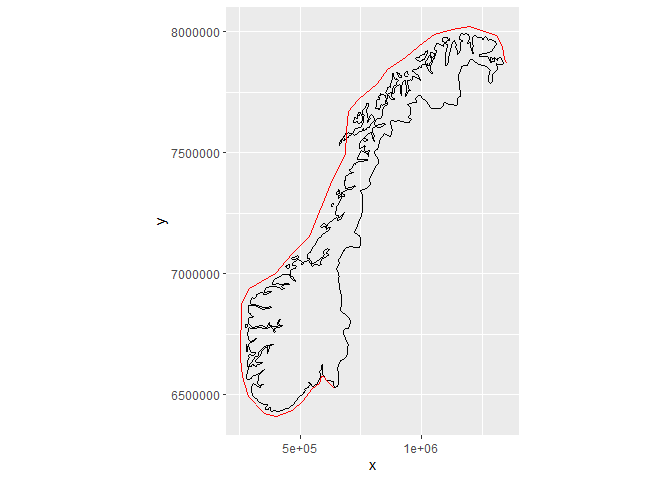

## 1. Packages + definitions  

```r
library(ggplot2)
library(dplyr)
library(purrr)
library(sp)

crs_longlat <- "+proj=longlat +ellps=WGS84 +datum=WGS84"
crs_utm <- "+proj=utm +zone=32 +ellps=WGS84 +datum=WGS84 +units=m"
```

Functions  

```r
source("103_Distance_along_coast_functions.R")
```


## 2. Data

### Station data  

```r
df_stations <- readRDS("Data/101_Selected_stations.rds")
```


### Coordinates along coast  
Made in script 102  

```r
coast <- readRDS("Data/102_coast_coordinates.rmd")
```

### Norway map data

```r
#
# Get Norway map data
#
test <- maps::map("world", "Norway", plot = FALSE)   # map data for Norway - this is just to get region names
sel <- grepl("Svalbard", test$names) | test$names == "Norway:Jan Mayen"  # select Svalbard + Jan Mayen
# test$names[!sel]
map <- maps::map("world", test$names[!sel], exact = TRUE, plot = FALSE)  # Norway w/o Svalbard + Jan Mayen
map_df <- data.frame(Longitude = map$x, Latitude = map$y)
```


### Plot coordinates along coast  
Long-lat coordinates  

```r
ggplot(map_df, aes(Longitude, Latitude)) + 
  geom_path() +
  coord_map("lambert", lat0 = 64, lon0 = 11) +
  geom_path(data = coast, color = "blue") +
  geom_point(data = coast, color = "blue") 
```

<!-- -->


## 4. Add UTM coordinates (x and y) to map

```r
#
# Add UTM coordinates (x and y) to map
#
coordinate_exists <- !is.na(map_df$Longitude)   # sp doesn't like NAs
SP <- SpatialPoints(map_df[coordinate_exists, c("Longitude", "Latitude")],
                    proj4string=CRS(crs_longlat)
)
SP.UTM <- spTransform(SP, CRS(crs_utm))
# Add transformed coords to data set
map_df$x[coordinate_exists] <- SP.UTM@coords[,1]
map_df$y[coordinate_exists] <- SP.UTM@coords[,2]

# Plot map 
ggplot(map_df, aes(x, y)) + 
  geom_path() +
  coord_fixed()
```

<!-- -->


## 5. Distance from point along coast  

### Make 'coastsegment_distance'   
Distances along coast segments

```r
#
# Distances for start points of the coast segments
#
segment_dx <- diff(coast$x)/1000
segment_dy <- diff(coast$y)/1000
coastsegment_distance <- sqrt(segment_dx^2 + segment_dy^2) %>% cumsum()
coastsegment_distance <- c(0, coastsegment_distance)
coastsegment_distance
```

```
##  [1]    0.00000   35.57563   69.07444   77.13420  104.65681  139.71662
##  [7]  201.95271  261.89173  333.57830  386.84844  480.28367  566.00644
## [13]  642.95392  723.92513  794.51827  870.45524  939.27022 1063.94254
## [19] 1170.08556 1267.64526 1499.11265 1639.76846 1736.21744 1818.39978
## [25] 1882.21931 1982.03134 2054.87673 2142.02076 2215.68761 2294.55571
## [31] 2371.42529 2444.72861 2496.01659 2561.46976 2612.91895 2665.37530
## [37] 2685.72980
```

### Test 'get_distance_along_coast' and 'check_distance_along_coast'  

```r
# Usual case: the point is on the normal to at least one of the edges
check_distance_along_coast(point = list(x = 600000, y = 6550000), 
                           df_segments = coast, 
                           df_segments_distances = coastsegment_distance)
```

```
## $coord
##          x       y
## 1 610086.5 6559883
## 
## $segment_no
## [1] 2
## 
## $distance_to_segment
## [1] 14.12165
## 
## $distance_from_segment_start
## [1] 10.59748
## 
## $distance
## [1] 46.1731
```

<!-- -->

```r
# Unusual case: the point is by a "concave" edge on the coast
check_distance_along_coast(point = list(x = 1285975, y = 7880861), 
                           df_segments = coast, 
                           df_segments_distances = coastsegment_distance)
```

```
## $coord
##          x       y
## 36 1341902 7887778
## 
## $segment_no
## [1] 36
## 
## $distance_to_segment
## [1] 56.35326
## 
## $distance_from_segment_start
## [1] 0
## 
## $distance
## [1] 2665.375
```

<!-- -->

```r
if (FALSE){
  check_distance_along_coast(point = list(x = 500000, y = 6550000), 
                             df_segments = coast, 
                             df_segments_distances = coastsegment_distance)
  
  check_distance_along_coast(point = list(x = 500000, y = 6450000), 
                             df_segments = coast, 
                             df_segments_distances = coastsegment_distance)
  
}
```


## 6. Add Dist_along_coast to station data  

### Add UTM coordinates (x,y)  

```r
df_stations <- as.data.frame(df_stations)

coordinate_exists <- !is.na(df_stations$Lon)   # sp doesn't like NAs
SP <- SpatialPoints(df_stations[coordinate_exists, c("Lon", "Lat")],
                    proj4string=CRS(crs_longlat)
)
SP.UTM <- spTransform(SP, CRS(crs_utm))
# Add transformed coords to data set
df_stations$x[coordinate_exists] <- SP.UTM@coords[,1]
df_stations$y[coordinate_exists] <- SP.UTM@coords[,2]
```

### Plot  

```r
ggplot(map_df, aes(x, y)) + 
  geom_path() +
  coord_fixed() +
  geom_path(data = coast, color = "blue") +
  geom_point(data = df_stations, color = "red3") 
```

<!-- -->


### Get Dist_along_coast  

```r
get_distance_along_coast_s <- safely(get_distance_along_coast)

rows <- 1:nrow(df_stations)

result_list <- rows %>%
  map(~ get_distance_along_coast_s(
    point = list(x = df_stations$x[.], y = df_stations$y[.]), 
    df_segments = coast, 
    df_segments_distances = coastsegment_distance)) %>%
  purrr::transpose()

# Sum up results
ok <- result_list$error %>% map_lgl(is.null)
dist <- result_list$result[ok] %>% map_dbl(~.$distance)

# Number that didnæt work
sum(!ok)
```

```
## [1] 0
```

### Check out the ones with error, if necessary

```r
if (sum(!ok) > 0){

    i <- which(!ok)[1]
  
  # debugonce(get_distance_along_coast_all)
  check_distance_along_coast(
    point = list(x = df_stations$x[i], y = df_stations$y[i]), 
    df_segments = coast, 
    df_segments_distances = coastsegment_distance)
  
}
```

### Add Dist_along_coast  


```r
df_stations$Dist_along_coast <- NA
df_stations$Dist_along_coast[ok] <- dist
```

## 7. Save  

```r
saveRDS(df_stations, "Data/103_Selected_stations.rds")
```

