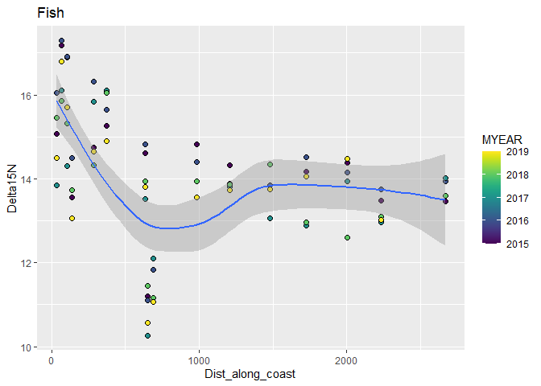
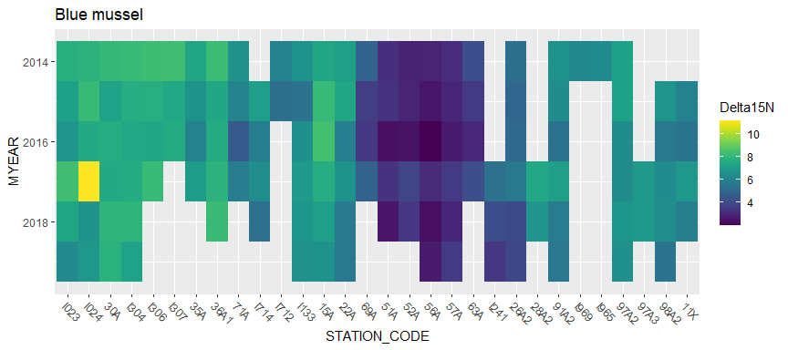
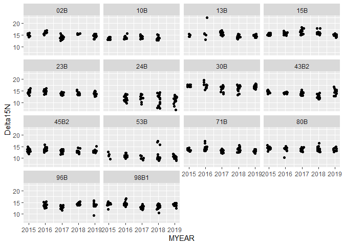
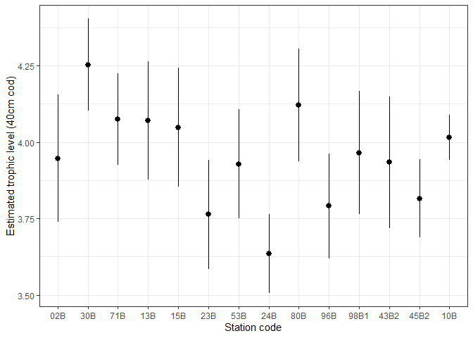

Mail fra Anders 13.05.2020:  
  
Trofisk nivå for de enkelte torskeindivider regnes ut slik:
  
`TL_torsk = 2 + (Delta15N_torsk - Delta15N_blåskjell)/3.8`     
  
Her er `Delta15N_torsk` verdien av d15N for den enkelte torsken, mens `Delta15N_blåskjell` er gjennomsnittlig verdi av d15N i blåskjell fra den nærmeste blåskjellstasjonen.  

Ligningen har som antakelse at alle blåskjell langs kysten er på trofisk nivå ca. 2 (altså at de er primærkonsumenter) og at d15N øker med 3.8 for hvert (hele) trofiske nivå i næringskjeden.  


## 1. Libraries  

```r
library(dplyr)
library(forcats)   # fct_reorder()
library(ggplot2)
library(leaflet)
library(knitr)

library(safejoin)  # package from https://github.com/moodymudskipper/safejoin 
```


## 2. Data

### Read files   
NOTE: the file `87_df_isotopes.rds` is created in the `Milkys` project and copied from there

```r
# Raw data  
dat <- readRDS("Data/101_Selected_data.rds") %>%
  mutate(STATION_CODE = case_when(
    STATION_CODE %in% "36A" ~ "36A1",
    TRUE ~ STATION_CODE)
    )

cat("\nRaw data: \n")
xtabs(~MYEAR, dat)

# Extra isotope data  
# created in the `Milkys` project and copied from there
dat_isotopes <- readRDS("Input_data/87_df_isotopes.rds") %>%
  mutate(STATION_CODE = case_when(
    STATION_CODE %in% "36A" ~ "36A1",
    TRUE ~ STATION_CODE)
    )

cat("\n\nIsotope data: \n")
xtabs(~MYEAR, dat_isotopes)
xtabs(~STATION_CODE, dat_isotopes)

# Station metadata
df_stations <- readRDS("Data/103_Selected_stations.rds")

# Station metadata needs to be summarised  
df_stations <- df_stations %>%
  mutate(MSTAT = case_when(
    STATION_CODE %in% "I969" ~ "RH",
    TRUE ~ MSTAT)) %>%
  group_by(STATION_CODE, MSTAT) %>%
  summarise_at(vars("Lat", "Lon", "Dist_along_coast"), mean, na.rm = TRUE)
```

```
## 
## Raw data: 
## MYEAR
##  1994  1995  1996  1997  1998  1999  2000  2001  2002  2003  2004  2005  2006 
##  7483  8641  8718  8202  8366  9225  8431  8987  9655  9441  9979 11985 11578 
##  2007  2008  2009  2010  2011  2012  2013  2014  2015  2016  2017  2018  2019 
## 12387 12899 18251 19054 19822 12269 14747 15106 18870 18890 25925 24337 17440 
## 
## 
## Isotope data: 
## MYEAR
## 2014 2015 2016 2017 2018 2019 
##   70  455  515  537  536  488 
## STATION_CODE
##  02B  10B  11X  13B  15A  15B  19B  22A  23B  24B 26A2 28A2  28B  30A  30B  33F 
##  105  138   12  156   18  180   90   18  173  119   18    6   89   18  161   22 
##  35A 36A1  36B  36F 43B2 45B2  51A  52A  53B  53F  56A  57A  63A  69A  71A  71B 
##   12   17  149    4  175  173   15   15  166    2   18   18   12   12   10  167 
##  80B 91A2  96B 97A2 97A3 98A2 98B1 I023 I024 I133 I241 I304 I306 I307 I712 I714 
##  171   18  150   18    6   15  160   18   14   18    9   17   12    9    4   12 
## I965 I969 
##    3    3
```
#### Stations by year    

```r
dat %>%
  filter(substr(PARAM, 1, 2) == "PF" & MYEAR >= 2014) %>%
  xtabs(~STATION_CODE + MYEAR, .) %>%
  knitr::kable()
```


|     | 2014| 2015| 2016| 2017| 2018| 2019|
|:----|----:|----:|----:|----:|----:|----:|
|13B  |  154|  154|  165|  132|   90|  100|
|22A  |    0|    0|    0|   33|   30|   30|
|23B  |  154|  165|  165|  143|  140|  150|
|24B  |    0|  158|  165|  165|  120|  140|
|30A  |    0|    0|    0|   33|   30|   30|
|30B  |  165|  132|  165|  132|  100|   50|
|36A1 |    0|    0|    0|   33|   30|   30|
|36B  |  165|  165|  165|  110|  150|   60|
|43B2 |  165|  143|  132|  165|  150|  150|
|51A  |    0|    0|    0|   33|   30|    0|
|53B  |   99|  154|  165|  165|  150|  150|
|80B  |  165|  165|  154|  165|  140|  110|
|98A2 |    0|    0|    0|   33|   30|   30|
|98B1 |   88|  165|  165|  121|  120|  150|
|I241 |    0|    0|    0|   33|   30|   30|
|I964 |    0|    0|    0|    0|   33|    0|
|I965 |    0|    0|    0|    0|   33|   33|
|I969 |    0|    0|    0|    0|   33|   22|

### Add position       
Using `df_stations`   
Position lacking for stations 19B (Barents Sea - no blue mussel close anyway)  

```r
dat_isotopes <- dat_isotopes %>%
  safe_left_join(df_stations %>% select(STATION_CODE, Lat, Lon, Dist_along_coast, MSTAT), 
                 na_matches = "never",
                 check = "CV",
                 by = "STATION_CODE")

check <- dat_isotopes %>%
  group_by(STATION_CODE) %>%
  summarise(Lat = first(Lat), .groups = "drop")

cat("Positions added for", sum(!is.na(check$Lat)), "stations \n")
cat("Positions lacking for", sum(is.na(check$Lat)), "stations \n")
if (sum(is.na(check$Lat)) > 0)
  cat("- positions lacking for stations", check$STATION_CODE[is.na(check$Lat)] %>% paste(collapse = ", "), "\n")
```

```
## Positions added for 49 stations 
## Positions lacking for 1 stations 
## - positions lacking for stations 19B
```

## 3. Calculate means of Delta15N     

```r
dat_isotopes_means1 <- dat_isotopes %>%
  group_by(TISSUE_NAME, STATION_CODE, Lat, Lon, Dist_along_coast, MYEAR) %>%
  summarise_at(c("Delta13C", "Delta15N"), mean, na.rm = TRUE) %>%
  ungroup() %>%
  mutate(STATION_CODE = fct_reorder(STATION_CODE, Dist_along_coast),
         Organism = case_when(
           grepl("B", STATION_CODE) ~ "Cod",
           grepl("F", STATION_CODE) ~ "Flatfish",
           TRUE ~ "Blue mussel"
         ))
```


## 4. Plot Delta15N means, tile plots {.tabset}   

### Cod (muscle)  

```r
dat_isotopes_means1 %>%
  filter(TISSUE_NAME %in% "Muskel") %>%
  ggplot(aes(STATION_CODE, MYEAR, fill = Delta15N)) +
  geom_tile() +
  viridis::scale_fill_viridis() +
  labs(title = "Muskel")
```

```
## Warning: Removed 17 rows containing missing values (geom_tile).
```

<!-- -->

### Blue mussel 

```r
dat_isotopes_means1 %>%
  filter(TISSUE_NAME %in% "Whole soft body") %>%
  ggplot(aes(STATION_CODE, MYEAR, fill = Delta15N)) +
  geom_tile() +
  viridis::scale_fill_viridis() +
  theme(axis.text.x = element_text(angle = -45, hjust = 0)) +
  labs(title = "Blue mussel")
```

<!-- -->
## 5. Plot Delta15N means by distance along coast, tile plots {.tabset}   

### Cod (muscle)  

```r
dat_isotopes_means1 %>%
  filter(TISSUE_NAME %in% "Muskel") %>%
  ggplot(aes(Dist_along_coast, Delta15N)) +
  geom_point(aes(fill = MYEAR), shape = 21, size = rel(2)) +
  viridis::scale_fill_viridis() +
  geom_smooth(method = 'loess', formula = 'y ~ x') +
  labs(title = "Fish")
```

```
## Warning: Removed 23 rows containing non-finite values (stat_smooth).
```

```
## Warning: Removed 23 rows containing missing values (geom_point).
```

<!-- -->


### Blue mussel  

```r
dat_isotopes_means1 %>%
  filter(TISSUE_NAME %in% "Whole soft body") %>%
  ggplot(aes(Dist_along_coast, Delta15N)) +
  geom_point(aes(fill = MYEAR), shape = 21, size = rel(2)) +
  viridis::scale_fill_viridis() +
  geom_smooth(method = 'loess', formula = 'y ~ x') +
  labs(title = "Blue mussel")
```

<!-- -->


## 6. Find closest mussel station for each cod station   

### Leaflet map   


```r
dat_isotopes_stations <- dat_isotopes_means1 %>%
  group_by(TISSUE_NAME, STATION_CODE, Lat, Lon) %>%
  summarise(Years = paste(MYEAR, collapse = ", "), .groups = "drop") 


df <- dat_isotopes_stations %>% 
  filter(TISSUE_NAME %in% c("Muskel", "Whole soft body") & !is.na(Lat))

icons <- awesomeIcons(
  icon = 'ios-close',
  iconColor = 'black',
  library = 'ion',
  markerColor = case_when(
    df$TISSUE_NAME == "Whole soft body" ~ "blue",
    df$TISSUE_NAME == "Muskel" ~ "red")
)

leaflet(df) %>%
  addTiles() %>%
  addAwesomeMarkers(~Lon, ~Lat, icon = icons,
                    label =  ~STATION_CODE)
```

<!--html_preserve--><div id="htmlwidget-b6d3bf8327b6426396fa" style="width:672px;height:480px;" class="leaflet html-widget"></div>
<script type="application/json" data-for="htmlwidget-b6d3bf8327b6426396fa">{"x":{"options":{"crs":{"crsClass":"L.CRS.EPSG3857","code":null,"proj4def":null,"projectedBounds":null,"options":{}}},"calls":[{"method":"addTiles","args":["//{s}.tile.openstreetmap.org/{z}/{x}/{y}.png",null,null,{"minZoom":0,"maxZoom":18,"tileSize":256,"subdomains":"abc","errorTileUrl":"","tms":false,"noWrap":false,"zoomOffset":0,"zoomReverse":false,"opacity":1,"zIndex":1,"detectRetina":false,"attribution":"&copy; <a href=\"http://openstreetmap.org\">OpenStreetMap<\/a> contributors, <a href=\"http://creativecommons.org/licenses/by-sa/2.0/\">CC-BY-SA<\/a>"}]},{"method":"addAwesomeMarkers","args":[[59.06482,59.81466,59.52833,59.0405,59.0405,59.0465,58.13283,58.05138,59.89562,60.09727,60.09727,60.39664,62.46778,63.44563,66.04437,68.19655,69.653,70.65,69.81623,59.09511,59.07905,59.881445,59.85133,59.71333,59.7445,59.48359,59.07357,59.02333,59.0514,59.04533,58.13167,58.0487225,59.58503,59.9822483333333,60.08406,60.09677,60.2205,60.3871366666667,60.42096,60.40077,61.93622,61.93622,63.65144,66.28017,66.311835,67.41271,67.2963,68.2500566666667,69.8993],[10.97354,10.550915,10.35,10.43583,10.43583,9.70275,7.9885,6.7469,5.10856,6.53972,6.53972,5.27069,6.06862,10.37173,12.50355,14.77182,18.974,23.63333,29.7602,11.13678,10.98734,10.7118325,10.589,10.55517,10.52283,10.49499,10.42522,9.75367,9.7038,9.70683,8.00167,6.8991425,5.145465,5.75288833333333,6.550725,6.53293,6.602,6.68923,6.40502,5.30396,5.04878,5.048783333,9.56386,14.041835,14.12558,14.62193,14.3956,14.66412,29.741],{"icon":"ios-close","markerColor":["red","red","red","red","red","red","red","red","red","red","red","red","red","red","red","red","red","red","red","blue","blue","blue","blue","blue","blue","blue","blue","blue","blue","blue","blue","blue","blue","blue","blue","blue","blue","blue","blue","blue","blue","blue","blue","blue","blue","blue","blue","blue","blue"],"iconColor":"black","spin":false,"squareMarker":false,"iconRotate":0,"font":"monospace","prefix":"ion"},null,null,{"interactive":true,"draggable":false,"keyboard":true,"title":"","alt":"","zIndexOffset":0,"opacity":1,"riseOnHover":false,"riseOffset":250},null,null,null,null,["02B","30B","33F","36B","36F","71B","13B","15B","23B","53B","53F","24B","28B","80B","96B","98B1","43B2","45B2","10B","I023","I024","30A","I304","I306","I307","35A","36A1","71A","I714","I712","I133","15A","22A","69A","51A","52A","56A","57A","63A","I241","26A2","28A2","91A2","I969","I965","97A2","97A3","98A2","11X"],{"interactive":false,"permanent":false,"direction":"auto","opacity":1,"offset":[0,0],"textsize":"10px","textOnly":false,"className":"","sticky":true},null]}],"limits":{"lat":[58.0487225,70.65],"lng":[5.04878,29.7602]}},"evals":[],"jsHooks":[]}</script><!--/html_preserve-->


### Closest/corresponding mussel station   
Set based on map above  

```r
data_closest_mussel_station <- read.csv(textConnection("
Cod_station, Mussel_station
30B,I304
33F,35A
02B,I024
36F,36A1
71B,I712
13B,I133
15B,15A
23B,22A
24B,I241
80B,91A2
96B,I969
98B1,98A2
43B2,98A2
45B2,98A2
10B,11X
"),
stringsAsFactors = FALSE
)

# Pretty far from eacah other: 80B, 91A2
```


### Plot N15 for these cod and mussel stations  {.tabset}  

#### Cod

```r
dat_isotopes %>%
  filter(TISSUE_NAME %in% "Muskel" &
           STATION_CODE %in% data_closest_mussel_station$Cod_station) %>%
  ggplot(aes(MYEAR, Delta15N)) +
  geom_jitter(width = 0.1) +
  facet_wrap(vars(STATION_CODE))
```

```
## Warning: Removed 233 rows containing missing values (geom_point).
```

<!-- -->

#### Blue mussel

```r
dat_isotopes %>%
  filter(TISSUE_NAME %in% "Whole soft body" &
         STATION_CODE %in% data_closest_mussel_station$Mussel_station) %>%
  ggplot(aes(MYEAR, Delta15N)) +
  geom_jitter(width = 0.1) +
  facet_wrap(vars(STATION_CODE))
```

<!-- -->

### Summarise mussel data  
For each station (not year-specific means)  

```r
data_mussel_means <- dat_isotopes %>%
  filter(TISSUE_NAME %in% "Whole soft body" & 
           STATION_CODE %in% data_closest_mussel_station$Mussel_station) %>%
  filter(!(STATION_CODE %in% "I024" & MYEAR %in% 2017)) %>%
  group_by(STATION_CODE) %>%
  summarise_at(c("Delta13C", "Delta15N"), mean, na.rm = TRUE) %>%
  rename(Delta13C_mussel = Delta13C,
         Delta15N_mussel = Delta15N) %>%
  ungroup()

data_closest_mussel_station <- data_closest_mussel_station %>%
  left_join(data_mussel_means, by = c("Mussel_station" = "STATION_CODE"))
```


## 7. Add mussel data columns to main data   
And calculate trophic level (TL)

```r
dat2 <- dat %>%
  # Add Delta13C, Delta15N for each individual
  left_join(
    dat_isotopes %>% 
      select(MYEAR, STATION_CODE, TISSUE_NAME, SAMPLE_NO2, Delta13C, Delta15N), 
    by = c("MYEAR", "STATION_CODE", "TISSUE_NAME", "SAMPLE_NO2")
  ) %>%
  # Add Delta13C, Delta15N for closest mussel station
  left_join(
    data_closest_mussel_station, 
    by = c("STATION_CODE" = "Cod_station")) %>%
  # Calculate trophic level (TL)
  mutate(TL = case_when(
    TISSUE_NAME %in% c("Lever", "Muskel") ~ 2 + (Delta15N - Delta15N_mussel)/3.8,
    TISSUE_NAME %in% "Whole soft body" ~ 2)
  )
```


## 8. Plots  

### Cod trophic level by year  

```r
dat2 %>%
  filter(TISSUE_NAME %in% "Muskel" &
           PARAM %in% "HG" &
           STATION_CODE %in% data_closest_mussel_station$Cod_station &
           !is.na(TL)) %>%
  ggplot(aes(MYEAR, TL)) +
  geom_jitter(width = 0.25, alpha = 0.4) +
  facet_wrap(vars(STATION_CODE))
```

<!-- -->


### Plot cod trophic level by mean length  

```r
dat2 %>%
  filter(TISSUE_NAME %in% "Muskel" &
           PARAM %in% "HG" &
           STATION_CODE %in% data_closest_mussel_station$Cod_station &
           !is.na(TL)) %>%
  ggplot(aes(LNMEA, TL, color = MYEAR)) +
  geom_point() +
  facet_wrap(vars(STATION_CODE))
```

<!-- -->

## 9. Statistical analysis: station + year    

```r
dat2b <- dat2 %>%
  filter(TISSUE_NAME %in% "Muskel" & TL < 6) %>% # cod - and remive one outlier 
  mutate(MYEAR = factor(MYEAR))

m0 <- lm(TL ~ 1, dat2b)
m1 <- lm(TL ~ MYEAR, dat2b)
m2 <- lm(TL ~ STATION_CODE, dat2b)
m3 <- lm(TL ~ MYEAR + STATION_CODE, dat2b)
m4 <- lm(TL ~ MYEAR*STATION_CODE, dat2b)    # Very slow!

cat("===========================================\n")
cat("\nEffect of MYEAR: \n\n")
anova(m0, m1)
cat("===========================================\n")
cat("\nEffect of STATION_CODE: \n\n")
anova(m0, m2)
cat("===========================================\n")
cat("\nEffect of STATION_CODE in addition to MYEAR: \n\n")
anova(m1, m3)
cat("===========================================\n")
cat("\nEffect of STATION_CODE*MYEAR interaction: \n\n")
anova(m3, m4)
```

```
## ===========================================
## 
## Effect of MYEAR: 
## 
## Analysis of Variance Table
## 
## Model 1: TL ~ 1
## Model 2: TL ~ MYEAR
##   Res.Df    RSS Df Sum of Sq      F    Pr(>F)    
## 1   6068 503.95                                  
## 2   6064 479.23  4    24.715 78.182 < 2.2e-16 ***
## ---
## Signif. codes:  0 '***' 0.001 '**' 0.01 '*' 0.05 '.' 0.1 ' ' 1
## ===========================================
## 
## Effect of STATION_CODE: 
## 
## Analysis of Variance Table
## 
## Model 1: TL ~ 1
## Model 2: TL ~ STATION_CODE
##   Res.Df    RSS Df Sum of Sq      F    Pr(>F)    
## 1   6068 503.95                                  
## 2   6056 410.49 12    93.455 114.89 < 2.2e-16 ***
## ---
## Signif. codes:  0 '***' 0.001 '**' 0.01 '*' 0.05 '.' 0.1 ' ' 1
## ===========================================
## 
## Effect of STATION_CODE in addition to MYEAR: 
## 
## Analysis of Variance Table
## 
## Model 1: TL ~ MYEAR
## Model 2: TL ~ MYEAR + STATION_CODE
##   Res.Df    RSS Df Sum of Sq      F    Pr(>F)    
## 1   6064 479.23                                  
## 2   6052 381.54 12    97.696 129.14 < 2.2e-16 ***
## ---
## Signif. codes:  0 '***' 0.001 '**' 0.01 '*' 0.05 '.' 0.1 ' ' 1
## ===========================================
## 
## Effect of STATION_CODE*MYEAR interaction: 
## 
## Analysis of Variance Table
## 
## Model 1: TL ~ MYEAR + STATION_CODE
## Model 2: TL ~ MYEAR * STATION_CODE
##   Res.Df    RSS Df Sum of Sq      F    Pr(>F)    
## 1   6052 381.54                                  
## 2   6007 296.51 45     85.03 38.281 < 2.2e-16 ***
## ---
## Signif. codes:  0 '***' 0.001 '**' 0.01 '*' 0.05 '.' 0.1 ' ' 1
```

### Station effect 1 (after removing year effect)     
Model: MYEAR + STATION_CODE  

```r
# visreg::visreg(fit = m3, xvar = "STATION_CODE")

df_stationeffect1 <- visreg::visreg(fit = m3, xvar = "STATION_CODE", plot = FALSE)  
str(df_stationeffect1, 2)
```

```
## List of 3
##  $ fit :'data.frame':	13 obs. of  6 variables:
##   ..$ MYEAR       : Factor w/ 5 levels "2015","2016",..: 3 3 3 3 3 3 3 3 3 3 ...
##   ..$ STATION_CODE: Factor w/ 13 levels "02B","10B","13B",..: 1 2 3 4 5 6 7 8 9 10 ...
##   ..$ TL          : num [1:13] 4.05 4.05 4.05 4.05 4.05 ...
##   ..$ visregFit   : num [1:13] 3.89 3.95 4.18 4.05 3.97 ...
##   ..$ visregLwr   : num [1:13] 3.86 3.92 4.15 4.03 3.95 ...
##   ..$ visregUpr   : num [1:13] 3.91 3.97 4.21 4.08 4 ...
##  $ res :'data.frame':	6069 obs. of  5 variables:
##   ..$ MYEAR       : Factor w/ 5 levels "2015","2016",..: 3 3 3 3 3 3 3 3 3 3 ...
##   ..$ STATION_CODE: Factor w/ 13 levels "02B","10B","13B",..: 1 1 1 1 1 1 1 1 1 1 ...
##   ..$ TL          : num [1:6069] 4.05 4.05 4.05 4.05 4.05 ...
##   ..$ visregRes   : num [1:6069] 3.67 3.67 3.67 3.67 3.67 ...
##   ..$ visregPos   : logi [1:6069] FALSE FALSE FALSE FALSE FALSE FALSE ...
##  $ meta:List of 6
##   ..$ x             : chr "STATION_CODE"
##   ..$ y             : chr "TL"
##   ..$ hasInteraction: logi FALSE
##   ..$ yName         : chr "TL"
##   ..$ trans         :function (x)  
##   ..$ class         : chr "lm"
##  - attr(*, "class")= chr "visreg"
```

```r
levels(df_stationeffect1$fit$STATION_CODE)
```

```
##  [1] "02B"  "10B"  "13B"  "15B"  "23B"  "24B"  "30B"  "43B2" "45B2" "71B" 
## [11] "80B"  "96B"  "98B1"
```

```r
# Add position plus Dist_along_coast
df_stationeffect1$fit <- df_stationeffect1$fit %>%
  safe_left_join(df_stations %>% select(STATION_CODE, Lat, Lon, Dist_along_coast, MSTAT), 
                 na_matches = "never",
                 check = "CV",
                 by = "STATION_CODE") %>%
  # put STATION_CODE in correct order  
  mutate(STATION_CODE = fct_reorder(STATION_CODE, Dist_along_coast))
# levels(df_stationeffect1$fit$STATION_CODE)

df_stationeffect1$res <- df_stationeffect1$res %>%
  safe_left_join(df_stations %>% select(STATION_CODE, Lat, Lon, Dist_along_coast, MSTAT), 
                 na_matches = "never",
                 check = "CV",
                 by = "STATION_CODE") %>%
  mutate(STATION_CODE = fct_reorder(STATION_CODE, Dist_along_coast))  
```


### Plot year effect  

```r
visreg::visreg(fit = m3, xvar = "MYEAR")  
```

<!-- -->


## 10. Statistical analysis: station + year + length   

```r
# library(MuMIn)

m0 <- lm(TL ~ 1, dat2b)
m1 <- lm(TL ~ LNMEA, dat2b)
m2 <- lm(TL ~ STATION_CODE, dat2b)
m3 <- lm(TL ~ LNMEA + STATION_CODE, dat2b)
m3b <- lm(TL ~ LNMEA + STATION_CODE + MYEAR, dat2b)
m4 <- lm(TL ~ LNMEA*STATION_CODE, dat2b)
m4b <- lm(TL ~ LNMEA*STATION_CODE + MYEAR, dat2b)

cat("===========================================\n")
cat("\nEffect of length: \n\n")
anova(m0, m1)
cat("===========================================\n")
cat("\nEffect of STATION_CODE: \n\n")
anova(m0, m2)
cat("===========================================\n")
cat("\nEffect of STATION_CODE in addition to length: \n\n")
anova(m1, m3)
cat("===========================================\n")
cat("\nEffect of Year in addition to STATION_CODE + length: \n\n")
anova(m3, m3b)
cat("===========================================\n")
cat("\nEffect of STATION_CODE*length interaction: \n\n")
anova(m3, m4)
cat("===========================================\n")
cat("\nAdding STATION_CODE*length interaction to STATION_CODE + length + year model: \n\n")
anova(m3b, m4b)
```

```
## ===========================================
## 
## Effect of length: 
## 
## Analysis of Variance Table
## 
## Model 1: TL ~ 1
## Model 2: TL ~ LNMEA
##   Res.Df    RSS Df Sum of Sq      F    Pr(>F)    
## 1   6068 503.95                                  
## 2   6067 493.09  1     10.86 133.62 < 2.2e-16 ***
## ---
## Signif. codes:  0 '***' 0.001 '**' 0.01 '*' 0.05 '.' 0.1 ' ' 1
## ===========================================
## 
## Effect of STATION_CODE: 
## 
## Analysis of Variance Table
## 
## Model 1: TL ~ 1
## Model 2: TL ~ STATION_CODE
##   Res.Df    RSS Df Sum of Sq      F    Pr(>F)    
## 1   6068 503.95                                  
## 2   6056 410.49 12    93.455 114.89 < 2.2e-16 ***
## ---
## Signif. codes:  0 '***' 0.001 '**' 0.01 '*' 0.05 '.' 0.1 ' ' 1
## ===========================================
## 
## Effect of STATION_CODE in addition to length: 
## 
## Analysis of Variance Table
## 
## Model 1: TL ~ LNMEA
## Model 2: TL ~ LNMEA + STATION_CODE
##   Res.Df    RSS Df Sum of Sq      F    Pr(>F)    
## 1   6067 493.09                                  
## 2   6055 383.67 12    109.42 143.91 < 2.2e-16 ***
## ---
## Signif. codes:  0 '***' 0.001 '**' 0.01 '*' 0.05 '.' 0.1 ' ' 1
## ===========================================
## 
## Effect of Year in addition to STATION_CODE + length: 
## 
## Analysis of Variance Table
## 
## Model 1: TL ~ LNMEA + STATION_CODE
## Model 2: TL ~ LNMEA + STATION_CODE + MYEAR
##   Res.Df    RSS Df Sum of Sq      F    Pr(>F)    
## 1   6055 383.67                                  
## 2   6051 358.98  4    24.688 104.04 < 2.2e-16 ***
## ---
## Signif. codes:  0 '***' 0.001 '**' 0.01 '*' 0.05 '.' 0.1 ' ' 1
## ===========================================
## 
## Effect of STATION_CODE*length interaction: 
## 
## Analysis of Variance Table
## 
## Model 1: TL ~ LNMEA + STATION_CODE
## Model 2: TL ~ LNMEA * STATION_CODE
##   Res.Df    RSS Df Sum of Sq      F    Pr(>F)    
## 1   6055 383.67                                  
## 2   6043 368.65 12    15.019 20.516 < 2.2e-16 ***
## ---
## Signif. codes:  0 '***' 0.001 '**' 0.01 '*' 0.05 '.' 0.1 ' ' 1
## ===========================================
## 
## Adding STATION_CODE*length interaction to STATION_CODE + length + year model: 
## 
## Analysis of Variance Table
## 
## Model 1: TL ~ LNMEA + STATION_CODE + MYEAR
## Model 2: TL ~ LNMEA * STATION_CODE + MYEAR
##   Res.Df    RSS Df Sum of Sq     F    Pr(>F)    
## 1   6051 358.98                                 
## 2   6039 347.72 12    11.256 16.29 < 2.2e-16 ***
## ---
## Signif. codes:  0 '***' 0.001 '**' 0.01 '*' 0.05 '.' 0.1 ' ' 1
```


### Get length effect depending on station  {.tabset} 
Model: Length * STATION_CODE + Year  

```r
# visreg::visreg(fit = m4b, xvar = "LNMEA", by = "STATION_CODE", gg = TRUE)

df_effects <- visreg::visreg(fit = m4b, xvar = "LNMEA", by = "STATION_CODE", plot = FALSE)  

# str(df_effects, 2)
# levels(df_effects$fit$STATION_CODE)

# Add position plus Dist_along_coast
df_effects$fit <- df_effects$fit %>%
  safe_left_join(df_stations %>% select(STATION_CODE, Lat, Lon, Dist_along_coast, MSTAT), 
                 na_matches = "never",
                 check = "CV",
                 by = "STATION_CODE") %>%
  # put STATION_CODE in correct order  
  mutate(STATION_CODE = fct_reorder(STATION_CODE, Dist_along_coast))
# levels(df_stationeffect$fit$STATION_CODE)

df_effects$res <- df_effects$res %>%
  safe_left_join(df_stations %>% select(STATION_CODE, Lat, Lon, Dist_along_coast, MSTAT), 
                 na_matches = "never",
                 check = "CV",
                 by = "STATION_CODE") %>%
  mutate(STATION_CODE = fct_reorder(STATION_CODE, Dist_along_coast))  
```

#### Length effect    

```r
ggplot(df_effects$fit, aes(x = LNMEA)) +
  geom_ribbon(aes(ymin = visregLwr, ymax = visregUpr), fill = "lightblue") +
  geom_line(aes(y = visregFit)) +
  facet_wrap(vars(STATION_CODE))
```

<!-- -->

#### Length effect with residuals      

```r
ggplot(df_effects$fit, aes(x = LNMEA)) +
  geom_ribbon(aes(ymin = visregLwr, ymax = visregUpr), fill = "lightblue") +
  geom_point(data = df_effects$res, aes(y = visregRes), size = rel(0.5)) +
  geom_line(aes(y = visregFit)) +
  facet_wrap(vars(STATION_CODE))
```

<!-- -->


### Station effect 2, 40 cm cod (after removing year and length effect)     
Model: MYEAR + STATION_CODE * Length 

```r
# visreg::visreg(fit = m4b, xvar = "STATION_CODE", cond = list(LNMEA = 600, MYEAR = 2019), gg = TRUE)

df_stationeffect2 <- visreg::visreg(
  fit = m4b, 
  xvar = "STATION_CODE", 
  cond = list(LNMEA = 400, MYEAR = 2019), 
  plot = FALSE)  


# Add position plus Dist_along_coast
df_stationeffect2$fit <- df_stationeffect2$fit %>%
  safe_left_join(df_stations %>% select(STATION_CODE, Lat, Lon, Dist_along_coast, MSTAT), 
                 na_matches = "never",
                 check = "CV",
                 by = "STATION_CODE") %>%
  # put STATION_CODE in correct order  
  mutate(STATION_CODE = fct_reorder(STATION_CODE, Dist_along_coast))
# levels(df_stationeffect$fit$STATION_CODE)

df_stationeffect2$res <- df_stationeffect2$res %>%
  safe_left_join(df_stations %>% select(STATION_CODE, Lat, Lon, Dist_along_coast, MSTAT), 
                 na_matches = "never",
                 check = "CV",
                 by = "STATION_CODE") %>%
  mutate(STATION_CODE = fct_reorder(STATION_CODE, Dist_along_coast))  
```

### Station effect3, 70 cm cod (after removing year and length effect)     
Model: MYEAR + STATION_CODE * Length 

```r
# visreg::visreg(fit = m4b, xvar = "STATION_CODE", cond = list(LNMEA = 600, MYEAR = 2019), gg = TRUE)

df_stationeffect3 <- visreg::visreg(
  fit = m4b, 
  xvar = "STATION_CODE", 
  cond = list(LNMEA = 700, MYEAR = 2019), 
  plot = FALSE)  


# Add position plus Dist_along_coast
df_stationeffect3$fit <- df_stationeffect3$fit %>%
  safe_left_join(df_stations %>% select(STATION_CODE, Lat, Lon, Dist_along_coast, MSTAT), 
                 na_matches = "never",
                 check = "CV",
                 by = "STATION_CODE") %>%
  # put STATION_CODE in correct order  
  mutate(STATION_CODE = fct_reorder(STATION_CODE, Dist_along_coast))
# levels(df_stationeffect$fit$STATION_CODE)

df_stationeffect3$res <- df_stationeffect3$res %>%
  safe_left_join(df_stations %>% select(STATION_CODE, Lat, Lon, Dist_along_coast, MSTAT), 
                 na_matches = "never",
                 check = "CV",
                 by = "STATION_CODE") %>%
  mutate(STATION_CODE = fct_reorder(STATION_CODE, Dist_along_coast))  
```

## 11. Plot station effects {.tabset}

### Mean TL  

```r
ggplot(df_stationeffect1$fit, aes(STATION_CODE)) +
  geom_crossbar(aes(y = visregFit, ymin = visregLwr, ymax = visregUpr), color = "red3")
```

<!-- -->

### Mean TL (w/ residuals)  

```r
ggplot(df_stationeffect1$fit, aes(STATION_CODE)) +
  geom_jitter(data = df_stationeffect1$res, aes(y = visregRes), width = 0.1) +
  geom_crossbar(aes(y = visregFit, ymin = visregLwr, ymax = visregUpr), color = "red3")
```

<!-- -->

### TL 40 cm cod 

```r
ggplot(df_stationeffect2$fit, aes(STATION_CODE)) +
  geom_crossbar(aes(y = visregFit, ymin = visregLwr, ymax = visregUpr), color = "red3")
```

<!-- -->

### TL 40 cm cod (w/ residuals)  

```r
ggplot(df_stationeffect2$fit, aes(STATION_CODE)) +
  geom_jitter(data = df_stationeffect2$res, aes(y = visregRes), width = 0.1) +
  geom_crossbar(aes(y = visregFit, ymin = visregLwr, ymax = visregUpr), color = "red3")
```

<!-- -->


### TL 70 cm cod 

```r
ggplot(df_stationeffect3$fit, aes(STATION_CODE)) +
  geom_crossbar(aes(y = visregFit, ymin = visregLwr, ymax = visregUpr), color = "red3")
```

<!-- -->

### TL 70 cm cod (w/ residuals)  

```r
ggplot(df_stationeffect3$fit, aes(STATION_CODE)) +
  geom_jitter(data = df_stationeffect3$res, aes(y = visregRes), width = 0.1) +
  geom_crossbar(aes(y = visregFit, ymin = visregLwr, ymax = visregUpr), color = "red3")
```

<!-- -->

### Mean TL vs distance      

```r
ggplot(df_stationeffect1$fit, aes(Dist_along_coast)) +
  geom_point(aes(y = visregFit), color = "red3", size = rel(2)) +
  geom_errorbar(aes(ymin = visregLwr, ymax = visregUpr), color = "red3", width = 100)
```

<!-- -->


### TL 40 cm vs distance      

```r
ggplot(df_stationeffect2$fit, aes(Dist_along_coast)) +
  geom_point(aes(y = visregFit), color = "red3", size = rel(2)) +
  geom_errorbar(aes(ymin = visregLwr, ymax = visregUpr), color = "red3", width = 100)
```

<!-- -->


### TL 70 cm vs distance      

```r
ggplot(df_stationeffect3$fit, aes(Dist_along_coast)) +
  geom_point(aes(y = visregFit), color = "red3", size = rel(2)) +
  geom_errorbar(aes(ymin = visregLwr, ymax = visregUpr), color = "red3", width = 100)
```

<!-- -->


## 12. Save data  

```r
if (FALSE){
  saveRDS(dat2, "Data/104_Selected_data.rds")
}
```

