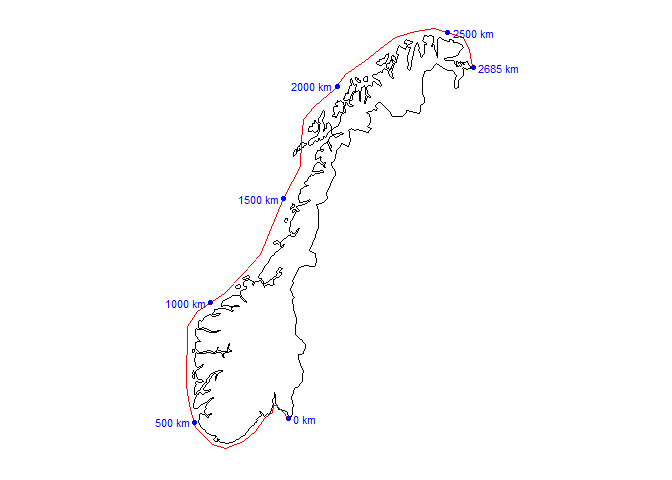
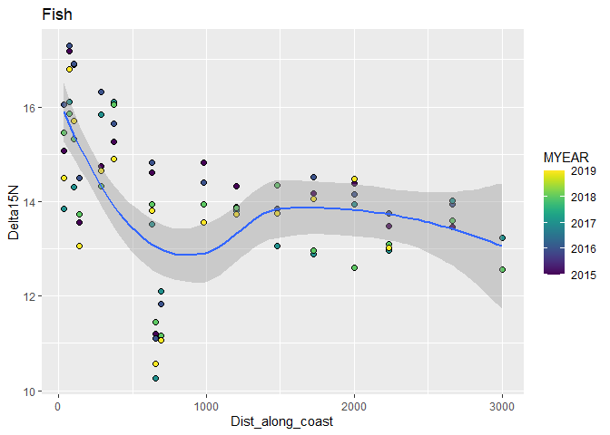
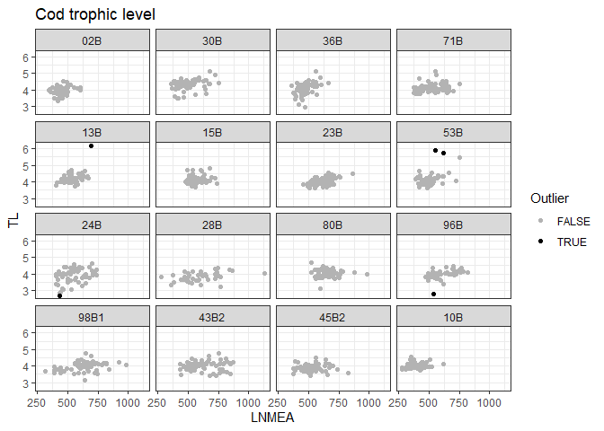

Mail fra Anders 13.05.2020:  
  
Trofisk nivå for de enkelte torskeindivider regnes ut slik:
  
`TL_torsk = 2 + (Delta15N_torsk - Delta15N_blåskjell)/3.8`     
  
Her er `Delta15N_torsk` verdien av d15N for den enkelte torsken, mens `Delta15N_blåskjell` er gjennomsnittlig verdi av d15N i blåskjell fra den nærmeste blåskjellstasjonen.  

Ligningen har som antakelse at alle blåskjell langs kysten er på trofisk nivå ca. 2 (altså at de er primærkonsumenter) og at d15N øker med 3.8 for hvert (hele) trofiske nivå i næringskjeden.  


## 1. Libraries  

```r
library(forcats)   # fct_reorder()
library(ggplot2)
library(leaflet)
library(knitr)
library(purrr)

library(safejoin)  # package from https://github.com/moodymudskipper/safejoin 

library(sp)
library(kableExtra)

library(dplyr)            #   load last to avoid name conflicts such as MASS::select

crs_longlat <- "+proj=longlat +ellps=WGS84 +datum=WGS84"
crs_utm <- "+proj=utm +zone=32 +ellps=WGS84 +datum=WGS84 +units=m"

source("103_Distance_along_coast_functions.R")

# environment(select)
```


## 2. Data

### Read files   
NOTE: the file `87_df_isotopes.rds` is created in the `Milkys` project and copied from there

```r
# Raw data  
dat <- readRDS("Data/101_Selected_data.rds") %>%
  mutate(STATION_CODE = case_when(
    STATION_CODE %in% "36A" ~ "36A1",
    TRUE ~ STATION_CODE)
    )

cat("\nRaw data: \n")
xtabs(~MYEAR, dat)

# Extra isotope data  
# created in the `Milkys` project and copied from there
dat_isotopes <- readRDS("Input_data/87_df_isotopes.rds") %>%
  mutate(STATION_CODE = case_when(
    STATION_CODE %in% "36A" ~ "36A1",
    TRUE ~ STATION_CODE)
    )

cat("\n\nIsotope data: \n")
xtabs(~MYEAR, dat_isotopes)
xtabs(~STATION_CODE, dat_isotopes)

# Station metadata
df_stations <- readRDS("Data/103_Selected_stations.rds")

# Station metadata needs to be summarised  
df_stations <- df_stations %>%
  filter(Station_Name != "Risøy, Østerfjord") %>%
  mutate(MSTAT = case_when(
    STATION_CODE %in% "I969" ~ "RH",
    TRUE ~ MSTAT)) %>%
  group_by(STATION_CODE, Station_Name, MSTAT) %>%
  summarise_at(vars("Lat", "Lon", "Dist_along_coast"), mean, na.rm = TRUE)

check <- df_stations %>%
  group_by(STATION_CODE) %>%
  mutate(n = n()) %>%
  filter(n > 1)

if (nrow(check) > 0){
  stop("Some STATION_CODE occurs more than one time")
}
```

```
## 
## Raw data: 
## MYEAR
##  1994  1995  1996  1997  1998  1999  2000  2001  2002  2003  2004  2005  2006 
##  7483  8641  8718  8202  8366  9225  8431  8987  9655  9441  9979 11985 11578 
##  2007  2008  2009  2010  2011  2012  2013  2014  2015  2016  2017  2018  2019 
## 12387 12899 18251 19054 19822 12269 14747 15106 18870 18890 25925 24337 17440 
## 
## 
## Isotope data: 
## MYEAR
## 2014 2015 2016 2017 2018 2019 
##   70  455  515  537  536  488 
## STATION_CODE
##  02B  10B  11X  13B  15A  15B  19B  22A  23B  24B 26A2 28A2  28B  30A  30B  33F 
##  105  138   12  156   18  180   90   18  173  119   18    6   89   18  161   22 
##  35A 36A1  36B  36F 43B2 45B2  51A  52A  53B  53F  56A  57A  63A  69A  71A  71B 
##   12   17  149    4  175  173   15   15  166    2   18   18   12   12   10  167 
##  80B 91A2  96B 97A2 97A3 98A2 98B1 I023 I024 I133 I241 I304 I306 I307 I712 I714 
##  171   18  150   18    6   15  160   18   14   18    9   17   12    9    4   12 
## I965 I969 
##    3    3
```


#### Stations by year    

```r
dat %>%
  filter(substr(PARAM, 1, 2) == "PF" & MYEAR >= 2014) %>%
  xtabs(~STATION_CODE + MYEAR, .) %>%
  knitr::kable()
```

<table>
 <thead>
  <tr>
   <th style="text-align:left;">   </th>
   <th style="text-align:right;"> 2014 </th>
   <th style="text-align:right;"> 2015 </th>
   <th style="text-align:right;"> 2016 </th>
   <th style="text-align:right;"> 2017 </th>
   <th style="text-align:right;"> 2018 </th>
   <th style="text-align:right;"> 2019 </th>
  </tr>
 </thead>
<tbody>
  <tr>
   <td style="text-align:left;"> 13B </td>
   <td style="text-align:right;"> 154 </td>
   <td style="text-align:right;"> 154 </td>
   <td style="text-align:right;"> 165 </td>
   <td style="text-align:right;"> 132 </td>
   <td style="text-align:right;"> 90 </td>
   <td style="text-align:right;"> 100 </td>
  </tr>
  <tr>
   <td style="text-align:left;"> 22A </td>
   <td style="text-align:right;"> 0 </td>
   <td style="text-align:right;"> 0 </td>
   <td style="text-align:right;"> 0 </td>
   <td style="text-align:right;"> 33 </td>
   <td style="text-align:right;"> 30 </td>
   <td style="text-align:right;"> 30 </td>
  </tr>
  <tr>
   <td style="text-align:left;"> 23B </td>
   <td style="text-align:right;"> 154 </td>
   <td style="text-align:right;"> 165 </td>
   <td style="text-align:right;"> 165 </td>
   <td style="text-align:right;"> 143 </td>
   <td style="text-align:right;"> 140 </td>
   <td style="text-align:right;"> 150 </td>
  </tr>
  <tr>
   <td style="text-align:left;"> 24B </td>
   <td style="text-align:right;"> 0 </td>
   <td style="text-align:right;"> 158 </td>
   <td style="text-align:right;"> 165 </td>
   <td style="text-align:right;"> 165 </td>
   <td style="text-align:right;"> 120 </td>
   <td style="text-align:right;"> 140 </td>
  </tr>
  <tr>
   <td style="text-align:left;"> 30A </td>
   <td style="text-align:right;"> 0 </td>
   <td style="text-align:right;"> 0 </td>
   <td style="text-align:right;"> 0 </td>
   <td style="text-align:right;"> 33 </td>
   <td style="text-align:right;"> 30 </td>
   <td style="text-align:right;"> 30 </td>
  </tr>
  <tr>
   <td style="text-align:left;"> 30B </td>
   <td style="text-align:right;"> 165 </td>
   <td style="text-align:right;"> 132 </td>
   <td style="text-align:right;"> 165 </td>
   <td style="text-align:right;"> 132 </td>
   <td style="text-align:right;"> 100 </td>
   <td style="text-align:right;"> 50 </td>
  </tr>
  <tr>
   <td style="text-align:left;"> 36A1 </td>
   <td style="text-align:right;"> 0 </td>
   <td style="text-align:right;"> 0 </td>
   <td style="text-align:right;"> 0 </td>
   <td style="text-align:right;"> 33 </td>
   <td style="text-align:right;"> 30 </td>
   <td style="text-align:right;"> 30 </td>
  </tr>
  <tr>
   <td style="text-align:left;"> 36B </td>
   <td style="text-align:right;"> 165 </td>
   <td style="text-align:right;"> 165 </td>
   <td style="text-align:right;"> 165 </td>
   <td style="text-align:right;"> 110 </td>
   <td style="text-align:right;"> 150 </td>
   <td style="text-align:right;"> 60 </td>
  </tr>
  <tr>
   <td style="text-align:left;"> 43B2 </td>
   <td style="text-align:right;"> 165 </td>
   <td style="text-align:right;"> 143 </td>
   <td style="text-align:right;"> 132 </td>
   <td style="text-align:right;"> 165 </td>
   <td style="text-align:right;"> 150 </td>
   <td style="text-align:right;"> 150 </td>
  </tr>
  <tr>
   <td style="text-align:left;"> 51A </td>
   <td style="text-align:right;"> 0 </td>
   <td style="text-align:right;"> 0 </td>
   <td style="text-align:right;"> 0 </td>
   <td style="text-align:right;"> 33 </td>
   <td style="text-align:right;"> 30 </td>
   <td style="text-align:right;"> 0 </td>
  </tr>
  <tr>
   <td style="text-align:left;"> 53B </td>
   <td style="text-align:right;"> 99 </td>
   <td style="text-align:right;"> 154 </td>
   <td style="text-align:right;"> 165 </td>
   <td style="text-align:right;"> 165 </td>
   <td style="text-align:right;"> 150 </td>
   <td style="text-align:right;"> 150 </td>
  </tr>
  <tr>
   <td style="text-align:left;"> 80B </td>
   <td style="text-align:right;"> 165 </td>
   <td style="text-align:right;"> 165 </td>
   <td style="text-align:right;"> 154 </td>
   <td style="text-align:right;"> 165 </td>
   <td style="text-align:right;"> 140 </td>
   <td style="text-align:right;"> 110 </td>
  </tr>
  <tr>
   <td style="text-align:left;"> 98A2 </td>
   <td style="text-align:right;"> 0 </td>
   <td style="text-align:right;"> 0 </td>
   <td style="text-align:right;"> 0 </td>
   <td style="text-align:right;"> 33 </td>
   <td style="text-align:right;"> 30 </td>
   <td style="text-align:right;"> 30 </td>
  </tr>
  <tr>
   <td style="text-align:left;"> 98B1 </td>
   <td style="text-align:right;"> 88 </td>
   <td style="text-align:right;"> 165 </td>
   <td style="text-align:right;"> 165 </td>
   <td style="text-align:right;"> 121 </td>
   <td style="text-align:right;"> 120 </td>
   <td style="text-align:right;"> 150 </td>
  </tr>
  <tr>
   <td style="text-align:left;"> I241 </td>
   <td style="text-align:right;"> 0 </td>
   <td style="text-align:right;"> 0 </td>
   <td style="text-align:right;"> 0 </td>
   <td style="text-align:right;"> 33 </td>
   <td style="text-align:right;"> 30 </td>
   <td style="text-align:right;"> 30 </td>
  </tr>
  <tr>
   <td style="text-align:left;"> I964 </td>
   <td style="text-align:right;"> 0 </td>
   <td style="text-align:right;"> 0 </td>
   <td style="text-align:right;"> 0 </td>
   <td style="text-align:right;"> 0 </td>
   <td style="text-align:right;"> 33 </td>
   <td style="text-align:right;"> 0 </td>
  </tr>
  <tr>
   <td style="text-align:left;"> I965 </td>
   <td style="text-align:right;"> 0 </td>
   <td style="text-align:right;"> 0 </td>
   <td style="text-align:right;"> 0 </td>
   <td style="text-align:right;"> 0 </td>
   <td style="text-align:right;"> 33 </td>
   <td style="text-align:right;"> 33 </td>
  </tr>
  <tr>
   <td style="text-align:left;"> I969 </td>
   <td style="text-align:right;"> 0 </td>
   <td style="text-align:right;"> 0 </td>
   <td style="text-align:right;"> 0 </td>
   <td style="text-align:right;"> 0 </td>
   <td style="text-align:right;"> 33 </td>
   <td style="text-align:right;"> 22 </td>
  </tr>
</tbody>
</table>

### Add position       
Using `df_stations`   
Position lacking for stations 19B (Barents Sea - no blue mussel close anyway)  

```r
dat_isotopes <- dat_isotopes %>%
  safe_left_join(df_stations %>% select(STATION_CODE, Lat, Lon, Dist_along_coast, MSTAT), 
                 na_matches = "never",
                 check = "CV",
                 by = "STATION_CODE")

check <- dat_isotopes %>%
  group_by(STATION_CODE) %>%
  summarise(Lat = first(Lat), .groups = "drop")

cat("Positions added for", sum(!is.na(check$Lat)), "stations \n")
cat("Positions lacking for", sum(is.na(check$Lat)), "stations \n")
if (sum(is.na(check$Lat)) > 0)
  cat("- positions lacking for stations", check$STATION_CODE[is.na(check$Lat)] %>% paste(collapse = ", "), "\n")
```

```
## Positions added for 50 stations 
## Positions lacking for 0 stations
```
### Data for plotting maps   
From script 122 (without adaption)      
  
Mapdata  

```r
#
# Get Norway map data
#
test <- maps::map("world", "Norway", plot = FALSE)   # map data for Norway - this is just to get region names
sel <- grepl("Svalbard", test$names) | test$names == "Norway:Jan Mayen"  # select Svalbard + Jan Mayen
# test$names[!sel]
map <- maps::map("world", test$names[!sel], exact = TRUE, plot = FALSE)  # Norway w/o Svalbard + Jan Mayen
mapdata <- data.frame(Longitude = map$x, Latitude = map$y)

#
# Add UTM coordinates (x and y) to map
#
coordinate_exists <- !is.na(mapdata$Longitude)   # sp doesn't like NAs
SP <- sp::SpatialPoints(mapdata[coordinate_exists, c("Longitude", "Latitude")],
                    proj4string=CRS(crs_longlat)
)
SP.UTM <- sp::spTransform(SP, CRS(crs_utm))
# Add transformed coords to data set
mapdata$x[coordinate_exists] <- SP.UTM@coords[,1]
mapdata$y[coordinate_exists] <- SP.UTM@coords[,2]
```

'Coast' - line going along coast  
* See plot at end of script   

```r
#
# "Coast" data (coordinates for segments along the coast)
#
coast <- readRDS("Data/102_coast_coordinates.rmd")

#
# Make 'coastsegment_distance'   
#
# Distances for start points of the coast segments
segment_dx <- diff(coast$x)/1000
segment_dy <- diff(coast$y)/1000
coastsegment_distance <- sqrt(segment_dx^2 + segment_dy^2) %>% cumsum()
coastsegment_distance <- c(0, coastsegment_distance)
```

'coast_points' - points/text to plot along 'coast'   

```r
# Get positions for these km's:
coast_points <- 
  c(0, 500, 1000, 1500, 2000, 2500, 2685) %>% map_df(~get_point_on_coastline(.))

# Direction of text labels:
coast_points$Text_direction <- "West"
coast_points$Text_direction[c(1,6,7)] <- "East"

SP.utm <- SpatialPoints(coast_points[,c("x", "y")], 
                        proj4string=CRS(crs_utm)
                        )
SP.longlat <- spTransform(SP.utm, CRS(crs_longlat))
coast_points$Longitude <- SP.longlat@coords[,1]
coast_points$Latitude <- SP.longlat@coords[,2]
```


```r
source("103_Distance_along_coast_functions.R")
```


```r
plot_coast_distance <- function(map, coast){
  
    # Get positions for km's to show:
  points <- c(0, 500, 1000, 1500, 2000, 2500, 2685) %>% map_df(~get_point_on_coastline(.))
  
  
  # Direction of text labels:
  points$Text_direction <- "West"
  points$Text_direction[c(1,6,7)] <- "East"
  
  # PLot
  gg2 <- ggplot(map, aes(x, y)) +
    geom_path() +
    coord_fixed() +
    geom_path(data = coast, color = "red") +
    geom_point(data = points, color = "blue") +
    geom_text(data = points %>% filter(Text_direction == "West"), 
              aes(x = x - 20000, label = paste(distance, "km")), 
              color = "blue", hjust = 1, size = rel(3)) +
    geom_text(data = points %>% filter(Text_direction == "East"), 
              aes(x = x + 20000, label = paste(distance, "km")), 
              color = "blue", hjust = 0, size = rel(3)) +
    expand_limits(x = c(min(mapdata$x, na.rm = TRUE) - 150000,
                        max(mapdata$x, na.rm = TRUE) + 200000)) +
    theme_minimal() +
    theme(
      axis.text = element_blank(),
      axis.title = element_blank(),
      axis.ticks = element_blank(),
      panel.grid = element_blank()
    )
  
gg2
}


# debugonce(plot_coast_distance)
plot_coast_distance(mapdata, coast)
```

<!-- -->

## 3. Calculate means of Delta15N     

```r
dat_isotopes_means1 <- dat_isotopes %>%
  group_by(TISSUE_NAME, STATION_CODE, Lat, Lon, Dist_along_coast, MYEAR) %>%
  summarise_at(c("Delta13C", "Delta15N"), mean, na.rm = TRUE) %>%
  ungroup() %>%
  mutate(STATION_CODE = fct_reorder(STATION_CODE, Dist_along_coast),
         Organism = case_when(
           grepl("B", STATION_CODE) ~ "Cod",
           grepl("F", STATION_CODE) ~ "Flatfish",
           TRUE ~ "Blue mussel"
         ))
```


## 4. Plot Delta15N means, tile plots {.tabset}   

### Cod (muscle)  

```r
dat_isotopes_means1 %>%
  filter(TISSUE_NAME %in% "Muskel") %>%
  ggplot(aes(STATION_CODE, MYEAR, fill = Delta15N)) +
  geom_tile() +
  viridis::scale_fill_viridis() +
  scale_y_reverse() +
  labs(title = "Muskel")
```

```
## Warning: Removed 17 rows containing missing values (geom_tile).
```

<!-- -->

### Blue mussel 

```r
dat_isotopes_means1 %>%
  filter(TISSUE_NAME %in% "Whole soft body") %>%
  ggplot(aes(STATION_CODE, MYEAR, fill = Delta15N)) +
  geom_tile() +
  viridis::scale_fill_viridis() +
  scale_y_reverse() +
  theme(axis.text.x = element_text(angle = -45, hjust = 0)) +
  labs(title = "Blue mussel")
```

<!-- -->
## 5. Plot Delta15N means by distance along coast, tile plots {.tabset}   

### Cod (muscle)  

```r
dat_isotopes_means1 %>%
  filter(TISSUE_NAME %in% "Muskel") %>%
  ggplot(aes(Dist_along_coast, Delta15N)) +
  geom_point(aes(fill = MYEAR), shape = 21, size = rel(2)) +
  viridis::scale_fill_viridis() +
  geom_smooth(method = 'loess', formula = 'y ~ x') +
  labs(title = "Fish")
```

```
## Warning: Removed 21 rows containing non-finite values (stat_smooth).
```

```
## Warning: Removed 21 rows containing missing values (geom_point).
```

<!-- -->


### Blue mussel  

```r
dat_isotopes_means1 %>%
  filter(TISSUE_NAME %in% "Whole soft body") %>%
  ggplot(aes(Dist_along_coast, Delta15N)) +
  geom_point(aes(fill = MYEAR), shape = 21, size = rel(2)) +
  viridis::scale_fill_viridis() +
  geom_smooth(method = 'loess', formula = 'y ~ x') +
  labs(title = "Blue mussel")
```

<!-- -->


## 6. Find closest mussel station for each cod station   

### Leaflet map   


```r
dat_isotopes_stations <- dat_isotopes_means1 %>%
  group_by(TISSUE_NAME, STATION_CODE, Lat, Lon) %>%
  summarise(Years = paste(MYEAR, collapse = ", "), .groups = "drop") 


df <- dat_isotopes_stations %>% 
  filter(TISSUE_NAME %in% c("Muskel", "Whole soft body") & !is.na(Lat))

icons <- awesomeIcons(
  icon = 'ios-close',
  iconColor = 'black',
  library = 'ion',
  markerColor = case_when(
    df$TISSUE_NAME == "Whole soft body" ~ "blue",
    df$TISSUE_NAME == "Muskel" ~ "red")
)

leaflet(df) %>%
  addTiles() %>%
  addAwesomeMarkers(~Lon, ~Lat, icon = icons,
                    label =  ~STATION_CODE)
```

<!--html_preserve--><div id="htmlwidget-3142e5e0b1863cc7ace3" style="width:672px;height:480px;" class="leaflet html-widget"></div>
<script type="application/json" data-for="htmlwidget-3142e5e0b1863cc7ace3">{"x":{"options":{"crs":{"crsClass":"L.CRS.EPSG3857","code":null,"proj4def":null,"projectedBounds":null,"options":{}}},"calls":[{"method":"addTiles","args":["//{s}.tile.openstreetmap.org/{z}/{x}/{y}.png",null,null,{"minZoom":0,"maxZoom":18,"tileSize":256,"subdomains":"abc","errorTileUrl":"","tms":false,"noWrap":false,"zoomOffset":0,"zoomReverse":false,"opacity":1,"zIndex":1,"detectRetina":false,"attribution":"&copy; <a href=\"http://openstreetmap.org\">OpenStreetMap<\/a> contributors, <a href=\"http://creativecommons.org/licenses/by-sa/2.0/\">CC-BY-SA<\/a>"}]},{"method":"addAwesomeMarkers","args":[[59.06482,59.812653,59.5283333333333,59.0405,59.0405,59.0465,58.1328333333333,58.051384,59.895618,60.09727,60.09727,60.39664,62.4677833333333,63.445624,66.04437,68.18577,69.653,70.65,78.17,69.81623,59.095112,59.079053,59.88362,59.8513333333333,59.7133333333333,59.7445,59.48359,59.07357,59.0233333333333,59.0514,59.0453333333333,58.1316666666667,58.04605,59.58711,59.984,60.084292,60.096771,60.2205,60.387073,60.42096,60.4007721666667,61.9362166666667,62.465851,63.651438,66.28022,66.31162,67.41271,67.296306,68.24917,69.8993],[10.97354,10.551829,10.35,10.4358333333333,10.4358333333333,9.70275,7.9885,6.746898,5.108565,6.539719,6.539719,5.27069,6.06861666666667,10.371726,12.503554,14.708138,18.974,23.6333333333333,13.46,29.7602,11.136779,10.987336,10.711,10.589,10.5551666666667,10.5228333333333,10.49499,10.42522,9.75366666666667,9.70384,9.70683333333333,8.00166666666667,6.9159,5.15203,5.7545,6.550954,6.532933,6.602,6.689524,6.40502,5.303955,5.04878333333333,6.239601,9.56386,14.0349,14.12537,14.621928,14.395639,14.6627,29.741],{"icon":"ios-close","markerColor":["red","red","red","red","red","red","red","red","red","red","red","red","red","red","red","red","red","red","red","red","blue","blue","blue","blue","blue","blue","blue","blue","blue","blue","blue","blue","blue","blue","blue","blue","blue","blue","blue","blue","blue","blue","blue","blue","blue","blue","blue","blue","blue","blue"],"iconColor":"black","spin":false,"squareMarker":false,"iconRotate":0,"font":"monospace","prefix":"ion"},null,null,{"interactive":true,"draggable":false,"keyboard":true,"title":"","alt":"","zIndexOffset":0,"opacity":1,"riseOnHover":false,"riseOffset":250},null,null,null,null,["02B","30B","33F","36B","36F","71B","13B","15B","23B","53B","53F","24B","28B","80B","96B","98B1","43B2","45B2","19B","10B","I023","I024","30A","I304","I306","I307","35A","36A1","71A","I714","I712","I133","15A","22A","69A","51A","52A","56A","57A","63A","I241","26A2","28A2","91A2","I969","I965","97A2","97A3","98A2","11X"],{"interactive":false,"permanent":false,"direction":"auto","opacity":1,"offset":[0,0],"textsize":"10px","textOnly":false,"className":"","sticky":true},null]}],"limits":{"lat":[58.04605,78.17],"lng":[5.04878333333333,29.7602]}},"evals":[],"jsHooks":[]}</script><!--/html_preserve-->


### Closest/corresponding mussel station   
Set based on map above  

```r
#
# 19B = Svalbard - no bue mussel stations close  
#

data_closest_mussel_station <- read.csv(textConnection("
Cod_station, Mussel_station
30B,I304
33F,35A
02B,I024
36F,36A1
71B,I712
13B,I133
15B,15A
23B,22A
24B,I241
28B,28A2
36B,36A1
53B,56A
80B,91A2
96B,I969
98B1,98A2
43B2,98A2
45B2,98A2
10B,11X
"),
stringsAsFactors = FALSE
)

# Pretty far from eacah other: 80B, 91A2
```

### Table of corresponding cod/mussel stations  

```r
table_coupling_stations <- df_stations %>%
  filter(grepl("B", STATION_CODE)) %>%
  select(STATION_CODE, Station_Name, Dist_along_coast) %>%
  mutate(Dist_along_coast = round(Dist_along_coast)) %>%
  rename(Cod_station = STATION_CODE,
         Cod_station_name = Station_Name,
         `Dist along coast (km)` = Dist_along_coast) %>%
  inner_join(
    data_closest_mussel_station, 
    by = "Cod_station") %>%
  left_join(df_stations %>% 
              select(STATION_CODE, Station_Name) %>%
              rename(Mussel_station = STATION_CODE,
                     Mussel_station_name = Station_Name),
            by = "Mussel_station") %>%
  arrange(`Dist along coast (km)`)

# Remove underscores in names
names(table_coupling_stations) <- gsub("_", " ", names(table_coupling_stations), fixed = TRUE)

table_coupling_stations %>%
  kbl(escape = FALSE) %>%
  kable_classic()
```

<table class=" lightable-classic" style='font-family: "Arial Narrow", "Source Sans Pro", sans-serif; margin-left: auto; margin-right: auto;'>
 <thead>
  <tr>
   <th style="text-align:left;"> Cod station </th>
   <th style="text-align:left;"> Cod station name </th>
   <th style="text-align:right;"> Dist along coast (km) </th>
   <th style="text-align:left;"> Mussel station </th>
   <th style="text-align:left;"> Mussel station name </th>
  </tr>
 </thead>
<tbody>
  <tr>
   <td style="text-align:left;"> 02B </td>
   <td style="text-align:left;"> Kirkøy, Hvaler </td>
   <td style="text-align:right;"> 36 </td>
   <td style="text-align:left;"> I024 </td>
   <td style="text-align:left;"> Kirkøy, Hvaler </td>
  </tr>
  <tr>
   <td style="text-align:left;"> 30B </td>
   <td style="text-align:left;"> Inner Oslofjord </td>
   <td style="text-align:right;"> 69 </td>
   <td style="text-align:left;"> I304 </td>
   <td style="text-align:left;"> Gåsøya, Inner Oslofjord </td>
  </tr>
  <tr>
   <td style="text-align:left;"> 36B </td>
   <td style="text-align:left;"> Tjøme, Outer Oslofjord </td>
   <td style="text-align:right;"> 105 </td>
   <td style="text-align:left;"> 36A1 </td>
   <td style="text-align:left;"> Tjøme, Outer Oslofjord </td>
  </tr>
  <tr>
   <td style="text-align:left;"> 71B </td>
   <td style="text-align:left;"> Stathelle area, Langesundfjord </td>
   <td style="text-align:right;"> 138 </td>
   <td style="text-align:left;"> I712 </td>
   <td style="text-align:left;"> Croftholmen, Langesundfjord </td>
  </tr>
  <tr>
   <td style="text-align:left;"> 13B </td>
   <td style="text-align:left;"> Kristiansand harbour area </td>
   <td style="text-align:right;"> 287 </td>
   <td style="text-align:left;"> I133 </td>
   <td style="text-align:left;"> Odderøya, Kristiansand harbour </td>
  </tr>
  <tr>
   <td style="text-align:left;"> 15B </td>
   <td style="text-align:left;"> Skågskjera, Farsund </td>
   <td style="text-align:right;"> 373 </td>
   <td style="text-align:left;"> 15A </td>
   <td style="text-align:left;"> Gåsøya-Ullerøya, Farsund </td>
  </tr>
  <tr>
   <td style="text-align:left;"> 23B </td>
   <td style="text-align:left;"> Bømlo, Outer Selbjørnfjord </td>
   <td style="text-align:right;"> 634 </td>
   <td style="text-align:left;"> 22A </td>
   <td style="text-align:left;"> Espevær, Outer Bømlafjord </td>
  </tr>
  <tr>
   <td style="text-align:left;"> 53B </td>
   <td style="text-align:left;"> Inner Sørfjord </td>
   <td style="text-align:right;"> 654 </td>
   <td style="text-align:left;"> 56A </td>
   <td style="text-align:left;"> Kvalnes, Mid Sørfjord </td>
  </tr>
  <tr>
   <td style="text-align:left;"> 24B </td>
   <td style="text-align:left;"> Bergen harbour area </td>
   <td style="text-align:right;"> 692 </td>
   <td style="text-align:left;"> I241 </td>
   <td style="text-align:left;"> Nordnes, Bergen harbour </td>
  </tr>
  <tr>
   <td style="text-align:left;"> 28B </td>
   <td style="text-align:left;"> Ålesund harbour area </td>
   <td style="text-align:right;"> 984 </td>
   <td style="text-align:left;"> 28A2 </td>
   <td style="text-align:left;"> Ålesund harbour </td>
  </tr>
  <tr>
   <td style="text-align:left;"> 80B </td>
   <td style="text-align:left;"> Trondheim harbour </td>
   <td style="text-align:right;"> 1206 </td>
   <td style="text-align:left;"> 91A2 </td>
   <td style="text-align:left;"> Ørland area, Outer Trondheimsfjord </td>
  </tr>
  <tr>
   <td style="text-align:left;"> 96B </td>
   <td style="text-align:left;"> Sandnessjøen area </td>
   <td style="text-align:right;"> 1477 </td>
   <td style="text-align:left;"> I969 </td>
   <td style="text-align:left;"> Bjørnbærviken, Inner Ranfjord </td>
  </tr>
  <tr>
   <td style="text-align:left;"> 98B1 </td>
   <td style="text-align:left;"> Austnesfjord, Lofoten </td>
   <td style="text-align:right;"> 1724 </td>
   <td style="text-align:left;"> 98A2 </td>
   <td style="text-align:left;"> Svolvær airport area </td>
  </tr>
  <tr>
   <td style="text-align:left;"> 43B2 </td>
   <td style="text-align:left;"> Tromsø harbour area </td>
   <td style="text-align:right;"> 2004 </td>
   <td style="text-align:left;"> 98A2 </td>
   <td style="text-align:left;"> Svolvær airport area </td>
  </tr>
  <tr>
   <td style="text-align:left;"> 45B2 </td>
   <td style="text-align:left;"> Hammerfest harbour area </td>
   <td style="text-align:right;"> 2233 </td>
   <td style="text-align:left;"> 98A2 </td>
   <td style="text-align:left;"> Svolvær airport area </td>
  </tr>
  <tr>
   <td style="text-align:left;"> 10B </td>
   <td style="text-align:left;"> Kjøfjord, Outer Varangerfjord </td>
   <td style="text-align:right;"> 2665 </td>
   <td style="text-align:left;"> 11X </td>
   <td style="text-align:left;"> Brashavn, Outer Varangerfjord </td>
  </tr>
</tbody>
</table>


### Plot N15 for these cod and mussel stations  {.tabset}  

#### Cod

```r
dat_isotopes %>%
  filter(TISSUE_NAME %in% "Muskel" & 
           grepl("B", STATION_CODE) & 
           STATION_CODE %in% data_closest_mussel_station$Cod_station) %>%
  ggplot(aes(MYEAR, Delta15N)) +
  geom_jitter(width = 0.1) +
  facet_wrap(vars(STATION_CODE))
```

```
## Warning: Removed 275 rows containing missing values (geom_point).
```

<!-- -->

#### Blue mussel

```r
dat_isotopes %>%
  filter(TISSUE_NAME %in% "Whole soft body" &
         STATION_CODE %in% data_closest_mussel_station$Mussel_station) %>%
  ggplot(aes(MYEAR, Delta15N)) +
  geom_jitter(width = 0.1) +
  facet_wrap(vars(STATION_CODE))
```

<!-- -->

### Summarise mussel data  
For each station (not year-specific means)  

```r
data_mussel_means <- dat_isotopes %>%
  filter(TISSUE_NAME %in% "Whole soft body" & 
           STATION_CODE %in% data_closest_mussel_station$Mussel_station) %>%
  filter(!(STATION_CODE %in% "I024" & MYEAR %in% 2017)) %>%
  group_by(STATION_CODE) %>%
  summarise_at(c("Delta13C", "Delta15N"), mean, na.rm = TRUE) %>%
  rename(Delta13C_mussel = Delta13C,
         Delta15N_mussel = Delta15N) %>%
  ungroup()

data_closest_mussel_station <- data_closest_mussel_station %>%
  left_join(data_mussel_means, by = c("Mussel_station" = "STATION_CODE"))
```


## 7. Add mussel data columns to main data   
### a. Add mussel and calculate trophic level (TL)   
All data, i.e. one line per parameter and sample, for all parameters  
* Note: suitable for correlating contaminants with TL  
* Not the data to use for looking at TL itself, use dat3 for that    

```r
dat2 <- dat %>%
  # Add Delta13C, Delta15N for each individual
  left_join(
    dat_isotopes %>% 
      select(MYEAR, STATION_CODE, TISSUE_NAME, SAMPLE_NO2, Delta13C, Delta15N), 
    by = c("MYEAR", "STATION_CODE", "TISSUE_NAME", "SAMPLE_NO2")
  ) %>% # View()
  # Add Delta13C, Delta15N for closest mussel station
  left_join(
    data_closest_mussel_station, 
    by = c("STATION_CODE" = "Cod_station")) %>%
  ungroup() %>% 
  # Calculate trophic level (TL)
  mutate(
    TL = case_when(
      TISSUE_NAME %in% c("Lever", "Muskel") ~ 2 + (Delta15N - Delta15N_mussel)/3.8,
      TISSUE_NAME %in% "Whole soft body" ~ 2)
    )  %>%
  # Add Lat, Lon, Dist_along_coast, MSTAT
  safe_left_join(df_stations %>% select(STATION_CODE, Lat, Lon, Dist_along_coast, MSTAT), 
                 na_matches = "never",
                 check = "CV",
                 by = "STATION_CODE") %>%
  # Make STATION_CODE factor levels to follow 'Dist_along_coast'
  mutate(STATION_CODE = fct_reorder(STATION_CODE, Dist_along_coast))

cat("dat2:", nrow(dat2), "lines \n")
```

```
## dat2: 350956 lines
```

```r
# dat2$STATION_CODE %>% levels()
```


### b. Keep only isotopes and TL data    
Plus LNMEA and FAT_PERC

```r
dat3 <- dat2 %>%
  filter(TISSUE_NAME %in% "Muskel" & !is.na(TL)) %>%
  group_by(TISSUE_NAME, MYEAR, STATION_CODE, Lat, Lon, Dist_along_coast, MSTAT, SAMPLE_NO2) %>%
  summarise(across(c(Delta15N, Delta15N_mussel, TL, LNMEA, FAT_PERC), first),
            .groups = "drop") %>%
  mutate(MYEAR_f = factor(MYEAR),
         STATION_CODE = fct_drop(STATION_CODE)
         ) 

cat("dat3:", nrow(dat3), "lines \n")
```

```
## dat3: 1031 lines
```

### c. Save   

```r
#
# These data are used in script 105
#

saveRDS(dat2, "Data/104_dat2.rds")
saveRDS(dat3, "Data/104_dat3.rds")
saveRDS(data_closest_mussel_station, "Data/104_data_closest_mussel_station.rds")
```

## 8. Remove excessively low/high trophic level  

### Remove 5 outliers   
See "code" for cut-off values  

```r
dat3 <- dat3 %>%
  mutate(
    Outlier = case_when(
      TL > 5.6 ~ TRUE,
      TL < 2.8 ~ TRUE,
      TRUE ~ FALSE)
    )

xtabs(~Outlier, dat3)
```

```
## Outlier
## FALSE  TRUE 
##  1026     5
```

```r
ggplot(dat3, aes(LNMEA, TL, color = Outlier)) + 
  geom_point() +
  scale_color_manual(values = c("grey70", "black")) +
  facet_wrap(vars(STATION_CODE)) +
  labs(title = "Cod trophic level") +
  theme_bw()
```

<!-- -->

```r
dat3 <- dat3 %>% 
  filter(!Outlier) %>%
  select(-Outlier)
```

## 9. Plots {.tabset}  
Repating the Delta15N plot shown above  

### Cod Delta15N    

```r
dat_isotopes_means1 %>%
  filter(TISSUE_NAME %in% "Muskel" & grepl("B", STATION_CODE)) %>%
  ggplot(aes(STATION_CODE, MYEAR, fill = Delta15N)) +
  geom_tile() +
  viridis::scale_fill_viridis() +
  scale_y_reverse() +
  labs(title = "Muskel")
```

```
## Warning: Removed 14 rows containing missing values (geom_tile).
```

<!-- -->

### Median cod TL    

```r
dat3 %>%
  group_by(MYEAR, STATION_CODE) %>%
  summarise(TL = median(TL), .groups = "drop") %>%
  ggplot(aes(STATION_CODE, MYEAR, fill = TL)) +
  geom_tile() +
  viridis::scale_fill_viridis() +
  scale_y_reverse() +
  labs(title = "Cod trophic level") 
```

<!-- -->

### TL boxplots  

```r
ggplot(dat3, aes(factor(MYEAR), TL)) + 
  geom_boxplot() +
  facet_wrap(vars(STATION_CODE)) +
  labs(title = "Cod trophic level") 
```

<!-- -->

  
### TL vs length    

```r
ggplot(dat3, aes(LNMEA, TL)) + 
  geom_point(aes(fill = MYEAR_f), pch = 21, size = rel(2)) +
  viridis::scale_fill_viridis(discrete = TRUE) +
  geom_smooth(method = "lm", formula = 'y ~ x') +
  facet_wrap(vars(STATION_CODE)) +
  labs(y = "Trophic level", x = "Cod length (mm)") 
```

<!-- -->
  
### TL vs Delta15N    

```r
ggplot(dat3, aes(Delta15N, TL)) + 
  geom_point(aes(fill = STATION_CODE), pch = 21, size = rel(2)) +
  viridis::scale_fill_viridis(discrete = TRUE)
```

<!-- -->

## 10. Mixed-model analyses  
### Load mixed-model analyses   
* Models were estimated using script 105, we just load the saved results here (to save time)       
* Models estimated using both REML (gives the best estimates) and ML (can be used for hypothesis testing using ANOVA)   
    + REML = restricted maximum likelihood  
    + ML = maximum likelihood    

```r
#
# Models 
#

model_list <- readRDS("Data/105_model_list.rds")

# The formula for each REML model  
model_list[1:3] %>% map(formula)
```

```
## [[1]]
## TL ~ STATION_CODE + (1 | MYEAR_f)
## 
## [[2]]
## TL ~ LNMEA + STATION_CODE + (1 | MYEAR_f)
## 
## [[3]]
## TL ~ LNMEA * STATION_CODE + (1 | MYEAR_f)
```

```r
# name of models in script 105:
# list(fm2b, fm3a, fm3b, fm2b_null_ml, fm2b_ml, fm3a_ml, fm3b_ml)
# Model 1-3 are estimated using REML 
# Model 4: null model estimated using ML 
# Model 5-7 = model 1-3 estimated using ML 

mod_station <- model_list[[1]]       
mod_station_length <- model_list[[2]]
mod_station_length_x <- model_list[[3]]
mod_ml_null <- model_list[[4]]
mod_ml_station <- model_list[[5]]       
mod_ml_station_length <- model_list[[6]]
mod_ml_station_length_x <- model_list[[7]]


#
# Predictions  
# Made using model_list 1-3 above (i.e. the REML models)  
#

# name of predic in script 105:
# list(newdat, pred_3a, pred_3b)
model_predictions <- readRDS("Data/105_model_predictions.rds")

# Set names so they 
pred_station <- model_predictions[[1]]
pred_station_length <- model_predictions[[2]]
pred_station_length_x <- model_predictions[[3]]
```

### ANOVA of models  
* Using the ML (max. likelihood models)  
* Clearly indicates that station, length and the station*length interaction all are significant  
* I.e., there are significant differences in the length_TL relationship among stations  

```r
anova(mod_ml_null, mod_ml_station, mod_ml_station_length, mod_ml_station_length_x)
```

```
## Data: dat3
## Models:
## mod_ml_null: TL ~ 1 + (1 | MYEAR_f)
## mod_ml_station: TL ~ STATION_CODE + (1 | MYEAR_f)
## mod_ml_station_length: TL ~ LNMEA + STATION_CODE + (1 | MYEAR_f)
## mod_ml_station_length_x: TL ~ LNMEA * STATION_CODE + (1 | MYEAR_f)
##                         npar     AIC    BIC   logLik deviance   Chisq Df
## mod_ml_null                3 258.337 272.80 -126.169  252.337           
## mod_ml_station            16  82.979 160.13  -25.489   50.979 201.358 13
## mod_ml_station_length     17  24.029 106.01    4.986   -9.971  60.950  1
## mod_ml_station_length_x   30  19.891 164.56   20.054  -40.109  30.138 13
##                         Pr(>Chisq)    
## mod_ml_null                           
## mod_ml_station           < 2.2e-16 ***
## mod_ml_station_length    5.855e-15 ***
## mod_ml_station_length_x   0.004499 ** 
## ---
## Signif. codes:  0 '***' 0.001 '**' 0.01 '*' 0.05 '.' 0.1 ' ' 1
```

### Distance data - to add to predicted data  

```r
df_stations_plot <- df_stations %>%
  filter(STATION_CODE %in% pred_station$STATION_CODE) %>%
  select(STATION_CODE, Station_Name, Lon, Lat, Dist_along_coast) %>%
  mutate(
    Station_y = case_when(
      STATION_CODE %in% c("30B","53B") ~ 0,
      TRUE ~ -0.04)
  ) %>%
  mutate(
    Place = case_when(
      STATION_CODE %in% "30B" ~ "Oslo",
      STATION_CODE %in% "13B" ~ "Kristiansand",
      STATION_CODE %in% "24B" ~ "Bergen",
      STATION_CODE %in% "80B" ~ "Trondheim",
      STATION_CODE %in% "43B2" ~ "Tromsø",
      STATION_CODE %in% "10B" ~ "Kirkenes")
  )
```

### Plot function  

```r
# df_stations_plot is given globally  
plot_pred_distance <- function(model_predictions, ylabel, length = NULL, 
                               station_data = df_stations_plot){
  if (is.null(length)){
    df <- model_predictions
  } else {
    df <- model_predictions %>%
      filter(LNMEA == length)
  }
  df <- df %>%
    safe_left_join(station_data,
                   by = "STATION_CODE", na_matches = "never",
                   check = "CV")
  ggplot(df, aes(Dist_along_coast, TL)) +
    geom_pointrange(aes(ymin = plo, ymax = phi)) +
    geom_text(aes(y = min(plo) + Station_y, label = STATION_CODE), 
              angle = 30, size = rel(3), color = "blue3") +
    geom_text(aes(y = max(phi) + 0.02, label = Place), 
              angle = 0, size = rel(3), color = "blue3") +
    labs(x = "Station code", y = ylabel) +
    theme_bw()
}
```


## 11. Plots of station estimates {.tabset}   
* All models use "year" as a random factor, station effect is estimated on the year level   
* CIs estimated using Ben Bolker's method, and are based on fixed-effects uncertainty only, i.e. the confidence interval for the station effect  

### Model: station only

```r
gg <- plot_pred_distance(pred_station, "Estimated trophic level")
gg
```

```
## Warning: Removed 8 rows containing missing values (geom_text).
```

<!-- -->

### Model: station + length (40 cm)  
Model including station and length (additive effect). Predictions for 50 cm cod. For other lengths, only the the y axis would change, not the relative heights of each station  

```r
length <- 400
ylabel <- paste0("Estimated trophic level (", length/10, "cm cod)")
gg <- plot_pred_distance(pred_station_length, ylabel, length = length)
gg
```

```
## Warning: Removed 8 rows containing missing values (geom_text).
```

<!-- -->


### Model: station x length  (40 cm)   
Model including station, length and the station x length interaction. Predictions for 40 cm cod. 

```r
length <- 400
ylabel <- paste0("Estimated trophic level (", length/10, "cm cod)")
gg <- plot_pred_distance(pred_station_length_x, ylabel, length = length)
gg
```

```
## Warning: Removed 8 rows containing missing values (geom_text).
```

<!-- -->


### Model: station x length  (70 cm)   
Model including station, length and the station x length interaction. Predictions for 40 cm cod. 

```r
length <- 700
ylabel <- paste0("Estimated trophic level (", length/10, "cm cod)")
gg <- plot_pred_distance(pred_station_length_x, ylabel, length = length)
gg
```

```
## Warning: Removed 8 rows containing missing values (geom_text).
```

<!-- -->


## 12. Mixed model analysis of distance along coast {.tabset}   
  
### a. Distance along coast  
NOTE: Scale is 1000 kms, which is why estimate and CI is 1000x higher than in c 

```r
# Read results from script 105  
model_list_brm <- readRDS("Data/105_model_list_brm.rds")

model_list_brm[[1]]
```

```
##  Family: gaussian 
##   Links: mu = identity; sigma = identity 
## Formula: TL ~ Dist_along_coast_s + (1 | STATION_CODE) 
##    Data: dat3 (Number of observations: 918) 
## Samples: 2 chains, each with iter = 6000; warmup = 1000; thin = 1;
##          total post-warmup samples = 10000
## 
## Group-Level Effects: 
## ~STATION_CODE (Number of levels: 14) 
##               Estimate Est.Error l-95% CI u-95% CI Rhat Bulk_ESS Tail_ESS
## sd(Intercept)     0.12      0.03     0.08     0.19 1.00     2143     3249
## 
## Population-Level Effects: 
##                    Estimate Est.Error l-95% CI u-95% CI Rhat Bulk_ESS Tail_ESS
## Intercept              4.05      0.03     3.98     4.12 1.00     2441     3694
## Dist_along_coast_s    -0.07      0.04    -0.15     0.01 1.00     2588     3749
## 
## Family Specific Parameters: 
##       Estimate Est.Error l-95% CI u-95% CI Rhat Bulk_ESS Tail_ESS
## sigma     0.26      0.01     0.25     0.27 1.00     8671     6808
## 
## Samples were drawn using sampling(NUTS). For each parameter, Bulk_ESS
## and Tail_ESS are effective sample size measures, and Rhat is the potential
## scale reduction factor on split chains (at convergence, Rhat = 1).
```

```r
fixed <- summary(model_list_brm[[1]])$fixed
fixed <- as.data.frame(fixed)

fixed %>%
  kable()
```

<table>
 <thead>
  <tr>
   <th style="text-align:left;">   </th>
   <th style="text-align:right;"> Estimate </th>
   <th style="text-align:right;"> Est.Error </th>
   <th style="text-align:right;"> l-95% CI </th>
   <th style="text-align:right;"> u-95% CI </th>
   <th style="text-align:right;"> Rhat </th>
   <th style="text-align:right;"> Bulk_ESS </th>
   <th style="text-align:right;"> Tail_ESS </th>
  </tr>
 </thead>
<tbody>
  <tr>
   <td style="text-align:left;"> Intercept </td>
   <td style="text-align:right;"> 4.0489093 </td>
   <td style="text-align:right;"> 0.0346035 </td>
   <td style="text-align:right;"> 3.9787855 </td>
   <td style="text-align:right;"> 4.1182355 </td>
   <td style="text-align:right;"> 1.000279 </td>
   <td style="text-align:right;"> 2441 </td>
   <td style="text-align:right;"> 3694 </td>
  </tr>
  <tr>
   <td style="text-align:left;"> Dist_along_coast_s </td>
   <td style="text-align:right;"> -0.0719306 </td>
   <td style="text-align:right;"> 0.0410201 </td>
   <td style="text-align:right;"> -0.1520032 </td>
   <td style="text-align:right;"> 0.0113239 </td>
   <td style="text-align:right;"> 1.000314 </td>
   <td style="text-align:right;"> 2588 </td>
   <td style="text-align:right;"> 3749 </td>
  </tr>
</tbody>
</table>
  
### Distance along coast, length-corrected        

```r
model_list_brm[[3]]
```

```
##  Family: gaussian 
##   Links: mu = identity; sigma = identity 
## Formula: TL ~ LNMEA + Dist_along_coast + (1 + LNMEA | STATION_CODE) 
##    Data: dat3 (Number of observations: 918) 
## Samples: 2 chains, each with iter = 6000; warmup = 1000; thin = 1;
##          total post-warmup samples = 10000
## 
## Group-Level Effects: 
## ~STATION_CODE (Number of levels: 14) 
##                      Estimate Est.Error l-95% CI u-95% CI Rhat Bulk_ESS
## sd(Intercept)            0.29      0.11     0.11     0.53 1.00     2216
## sd(LNMEA)                0.00      0.00     0.00     0.00 1.00     1542
## cor(Intercept,LNMEA)    -0.78      0.26    -0.98    -0.00 1.00     2812
##                      Tail_ESS
## sd(Intercept)            2942
## sd(LNMEA)                1703
## cor(Intercept,LNMEA)     2671
## 
## Population-Level Effects: 
##                  Estimate Est.Error l-95% CI u-95% CI Rhat Bulk_ESS Tail_ESS
## Intercept            3.71      0.12     3.49     3.96 1.00     5265     6910
## LNMEA                0.00      0.00     0.00     0.00 1.00     6156     7218
## Dist_along_coast    -0.00      0.00    -0.00     0.00 1.00     4152     6439
## 
## Family Specific Parameters: 
##       Estimate Est.Error l-95% CI u-95% CI Rhat Bulk_ESS Tail_ESS
## sigma     0.25      0.01     0.24     0.26 1.00    11366     8172
## 
## Samples were drawn using sampling(NUTS). For each parameter, Bulk_ESS
## and Tail_ESS are effective sample size measures, and Rhat is the potential
## scale reduction factor on split chains (at convergence, Rhat = 1).
```

```r
fixed <- summary(model_list_brm[[3]])$fixed
fixed <- as.data.frame(fixed)

fixed %>%
  kable()
```

<table>
 <thead>
  <tr>
   <th style="text-align:left;">   </th>
   <th style="text-align:right;"> Estimate </th>
   <th style="text-align:right;"> Est.Error </th>
   <th style="text-align:right;"> l-95% CI </th>
   <th style="text-align:right;"> u-95% CI </th>
   <th style="text-align:right;"> Rhat </th>
   <th style="text-align:right;"> Bulk_ESS </th>
   <th style="text-align:right;"> Tail_ESS </th>
  </tr>
 </thead>
<tbody>
  <tr>
   <td style="text-align:left;"> Intercept </td>
   <td style="text-align:right;"> 3.7142430 </td>
   <td style="text-align:right;"> 0.1188444 </td>
   <td style="text-align:right;"> 3.4867954 </td>
   <td style="text-align:right;"> 3.9554987 </td>
   <td style="text-align:right;"> 1.001773 </td>
   <td style="text-align:right;"> 5265 </td>
   <td style="text-align:right;"> 6910 </td>
  </tr>
  <tr>
   <td style="text-align:left;"> LNMEA </td>
   <td style="text-align:right;"> 0.0007852 </td>
   <td style="text-align:right;"> 0.0001602 </td>
   <td style="text-align:right;"> 0.0004770 </td>
   <td style="text-align:right;"> 0.0011128 </td>
   <td style="text-align:right;"> 1.000627 </td>
   <td style="text-align:right;"> 6156 </td>
   <td style="text-align:right;"> 7218 </td>
  </tr>
  <tr>
   <td style="text-align:left;"> Dist_along_coast </td>
   <td style="text-align:right;"> -0.0000913 </td>
   <td style="text-align:right;"> 0.0000647 </td>
   <td style="text-align:right;"> -0.0002153 </td>
   <td style="text-align:right;"> 0.0000365 </td>
   <td style="text-align:right;"> 1.000138 </td>
   <td style="text-align:right;"> 4152 </td>
   <td style="text-align:right;"> 6439 </td>
  </tr>
</tbody>
</table>

### Distance along coast, length-corrected, plot  
LNMEA = fish length, Dista_along_coast = distance along coast   

```r
fixed$Effect <- rownames(fixed)

ggplot(fixed %>% filter(Effect != "Intercept"), 
       aes(Effect, Estimate)) +
  geom_pointrange(aes(ymin = `l-95% CI`, ymax = `u-95% CI`)) +
  geom_hline(yintercept = 0)
```

<!-- -->


## 13. Maps and station table {.tabset}  

### Map  

```r
stations_right <- c("02B", "30B", "13B", "53B", "10B")

gg_map <- ggplot(mapdata, aes(Longitude, Latitude)) + 
  geom_path(color = "grey50") +
  coord_map("lambert", parameters = c(10.4, 59.3), 
            xlim = c(5, 28), ylim = c(57.9, 72)) +
  geom_point(data = df_stations_plot, aes(Lon, Lat), color = "red3") +
  geom_text(data = df_stations_plot %>% filter(STATION_CODE %in% stations_right), 
            aes(Lon, Lat, label = STATION_CODE),
            hjust = -0.2, color = "red3") +
  geom_text(data = df_stations_plot %>% filter(!STATION_CODE %in% stations_right), 
            aes(Lon, Lat, label = STATION_CODE),
            hjust = 1.2, color = "red3") +
  theme_minimal() +
  theme(axis.title = element_blank())

gg_map
```

<!-- -->


### Map with coastal distance    

```r
stations_right <- c("02B", "30B", "13B", "53B", "10B")

gg_map +
  geom_path(data = coast, color = "blue") +
  geom_point(data = coast_points, color = "blue") +
  geom_text(data = coast_points %>% filter(Text_direction == "West"), 
            aes(label = paste(distance, "km")), color = "blue", hjust = 1.2) +
  geom_text(data = coast_points %>% filter(Text_direction == "East"), 
            aes(label = paste(distance, "km")), color = "blue", hjust = -0.2) +
  coord_map("lambert", parameters = c(10.4, 59.3), 
            xlim = c(2, 30), ylim = c(57.9, 72))
```

```
## Coordinate system already present. Adding new coordinate system, which will replace the existing one.
```

<!-- -->

### Station table  

```r
df_stations_plot %>%
  select(STATION_CODE:Dist_along_coast) %>%
  arrange(Dist_along_coast) %>%
  mutate(across(c(Lon,Lat), round, digits = 4)) %>%
  mutate(Dist_along_coast = round(Dist_along_coast, digits = 0)) %>%
  rename(`Station code` = STATION_CODE,
         `Station name` = Station_Name,
         `Distance along coast`= Dist_along_coast) %>%
  kable()
```

<table>
 <thead>
  <tr>
   <th style="text-align:left;"> Station code </th>
   <th style="text-align:left;"> Station name </th>
   <th style="text-align:right;"> Lon </th>
   <th style="text-align:right;"> Lat </th>
   <th style="text-align:right;"> Distance along coast </th>
  </tr>
 </thead>
<tbody>
  <tr>
   <td style="text-align:left;"> 02B </td>
   <td style="text-align:left;"> Kirkøy, Hvaler </td>
   <td style="text-align:right;"> 10.9735 </td>
   <td style="text-align:right;"> 59.0648 </td>
   <td style="text-align:right;"> 36 </td>
  </tr>
  <tr>
   <td style="text-align:left;"> 30B </td>
   <td style="text-align:left;"> Inner Oslofjord </td>
   <td style="text-align:right;"> 10.5518 </td>
   <td style="text-align:right;"> 59.8127 </td>
   <td style="text-align:right;"> 69 </td>
  </tr>
  <tr>
   <td style="text-align:left;"> 71B </td>
   <td style="text-align:left;"> Stathelle area, Langesundfjord </td>
   <td style="text-align:right;"> 9.7028 </td>
   <td style="text-align:right;"> 59.0465 </td>
   <td style="text-align:right;"> 138 </td>
  </tr>
  <tr>
   <td style="text-align:left;"> 13B </td>
   <td style="text-align:left;"> Kristiansand harbour area </td>
   <td style="text-align:right;"> 7.9885 </td>
   <td style="text-align:right;"> 58.1328 </td>
   <td style="text-align:right;"> 287 </td>
  </tr>
  <tr>
   <td style="text-align:left;"> 15B </td>
   <td style="text-align:left;"> Skågskjera, Farsund </td>
   <td style="text-align:right;"> 6.7469 </td>
   <td style="text-align:right;"> 58.0514 </td>
   <td style="text-align:right;"> 373 </td>
  </tr>
  <tr>
   <td style="text-align:left;"> 23B </td>
   <td style="text-align:left;"> Bømlo, Outer Selbjørnfjord </td>
   <td style="text-align:right;"> 5.1086 </td>
   <td style="text-align:right;"> 59.8956 </td>
   <td style="text-align:right;"> 634 </td>
  </tr>
  <tr>
   <td style="text-align:left;"> 53B </td>
   <td style="text-align:left;"> Inner Sørfjord </td>
   <td style="text-align:right;"> 6.5397 </td>
   <td style="text-align:right;"> 60.0973 </td>
   <td style="text-align:right;"> 654 </td>
  </tr>
  <tr>
   <td style="text-align:left;"> 24B </td>
   <td style="text-align:left;"> Bergen harbour area </td>
   <td style="text-align:right;"> 5.2707 </td>
   <td style="text-align:right;"> 60.3966 </td>
   <td style="text-align:right;"> 692 </td>
  </tr>
  <tr>
   <td style="text-align:left;"> 80B </td>
   <td style="text-align:left;"> Trondheim harbour </td>
   <td style="text-align:right;"> 10.3717 </td>
   <td style="text-align:right;"> 63.4456 </td>
   <td style="text-align:right;"> 1206 </td>
  </tr>
  <tr>
   <td style="text-align:left;"> 96B </td>
   <td style="text-align:left;"> Sandnessjøen area </td>
   <td style="text-align:right;"> 12.5036 </td>
   <td style="text-align:right;"> 66.0444 </td>
   <td style="text-align:right;"> 1477 </td>
  </tr>
  <tr>
   <td style="text-align:left;"> 98B1 </td>
   <td style="text-align:left;"> Austnesfjord, Lofoten </td>
   <td style="text-align:right;"> 14.7081 </td>
   <td style="text-align:right;"> 68.1858 </td>
   <td style="text-align:right;"> 1724 </td>
  </tr>
  <tr>
   <td style="text-align:left;"> 43B2 </td>
   <td style="text-align:left;"> Tromsø harbour area </td>
   <td style="text-align:right;"> 18.9740 </td>
   <td style="text-align:right;"> 69.6530 </td>
   <td style="text-align:right;"> 2004 </td>
  </tr>
  <tr>
   <td style="text-align:left;"> 45B2 </td>
   <td style="text-align:left;"> Hammerfest harbour area </td>
   <td style="text-align:right;"> 23.6333 </td>
   <td style="text-align:right;"> 70.6500 </td>
   <td style="text-align:right;"> 2233 </td>
  </tr>
  <tr>
   <td style="text-align:left;"> 10B </td>
   <td style="text-align:left;"> Kjøfjord, Outer Varangerfjord </td>
   <td style="text-align:right;"> 29.7602 </td>
   <td style="text-align:right;"> 69.8162 </td>
   <td style="text-align:right;"> 2665 </td>
  </tr>
</tbody>
</table>


