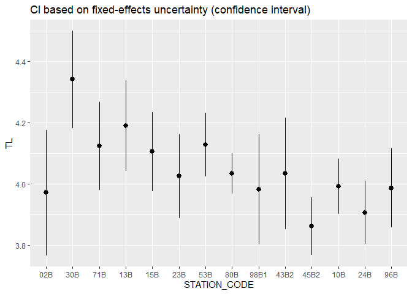

## 1. Libraries  

```r
library(dplyr)
library(ggplot2)
library(lme4)

library(arm)
library(merTools)    # predictInterval()
```

## 2. Data  

```r
dat2 <- readRDS("Data/104_dat2.rds")
cat("Data/104_dat2.rds: ", nrow(dat2), "lines \n")

dat3_uncleaned <- readRDS("Data/104_dat3.rds")
cat("Data/104_dat3.rds: ", nrow(dat3_uncleaned), "lines \n\n")

data_closest_mussel_station <- readRDS("Data/104_data_closest_mussel_station.rds")

xtabs(~STATION_CODE +  MYEAR, dat3_uncleaned)
```

```
## Data/104_dat2.rds:  350956 lines 
## Data/104_dat3.rds:  923 lines 
## 
##             MYEAR
## STATION_CODE 2015 2016 2017 2018 2019
##         02B    14   10   15    8   15
##         30B    15   12   15   15   15
##         71B    15   15   15   13   15
##         13B     6    5   15   15   13
##         15B    15   15   15   15   15
##         23B    15   15   15   15   15
##         53B     5   15    5   15   15
##         80B    15   14   15   15   11
##         98B1   15   15   15   15   15
##         43B2   15   15   15   15   15
##         45B2   15   15   15    8   15
##         10B    15   15   14   15    0
##         24B     0   15   10   15   14
##         96B     0   15   13   15   13
```

## 3. Plot means  

### Raw data  

```r
ggplot(dat3_uncleaned, aes(factor(MYEAR), TL)) + 
  geom_boxplot() +
  facet_wrap(vars(STATION_CODE)) +
  labs(title = "Cod trophic level") 
```

<!-- -->
### TL vs length    

```r
ggplot(dat3_uncleaned, aes(LNMEA, TL, color = factor(MYEAR))) + 
  geom_point() +
  facet_wrap(vars(STATION_CODE)) +
  labs(title = "Cod trophic level") 
```

<!-- -->


## Make dat3  

### Pick outliers  

```r
dat3_uncleaned <- dat3_uncleaned %>%
  mutate(
    Outlier = case_when(
      TL > 5.6 ~ TRUE,
      TL < 2.8 ~ TRUE,
      TRUE ~ FALSE)
    )

xtabs(~Outlier, dat3_uncleaned)
```

```
## Outlier
## FALSE  TRUE 
##   918     5
```

```r
ggplot(dat3_uncleaned, aes(LNMEA, TL, color = Outlier)) + 
  geom_point() +
  scale_color_manual(values = c("grey70", "black")) +
  facet_wrap(vars(STATION_CODE)) +
  labs(title = "Cod trophic level") +
  theme_bw()
```

<!-- -->


### Remove outliers  

```r
dat3 <- dat3_uncleaned %>% filter(!Outlier)
```


## Means  

```r
dat3 %>%
  group_by(MYEAR, STATION_CODE) %>%
  summarise(TL = median(TL), .groups = "drop") %>%
  ggplot(aes(STATION_CODE, MYEAR, fill = TL)) +
  geom_tile() +
  viridis::scale_fill_viridis() +
  scale_y_reverse() +
  labs(title = "Cod trophic level") 
```

<!-- -->

## 4. STATION_CODE as random factor (i.e., 2 random effects)  

```r
fm2 <- lmer(
  formula = TL ~ 1 + (1|MYEAR_f) + (1|STATION_CODE), 
  data = dat3
)
summary(fm2)
```

```
## Linear mixed model fit by REML ['lmerMod']
## Formula: TL ~ 1 + (1 | MYEAR_f) + (1 | STATION_CODE)
##    Data: dat3
## 
## REML criterion at convergence: 106
## 
## Scaled residuals: 
##     Min      1Q  Median      3Q     Max 
## -4.1898 -0.5784 -0.0248  0.5592  5.5969 
## 
## Random effects:
##  Groups       Name        Variance Std.Dev.
##  STATION_CODE (Intercept) 0.015379 0.12401 
##  MYEAR_f      (Intercept) 0.005459 0.07389 
##  Residual                 0.061893 0.24878 
## Number of obs: 918, groups:  STATION_CODE, 14; MYEAR_f, 5
## 
## Fixed effects:
##             Estimate Std. Error t value
## (Intercept)  4.05028    0.04753   85.21
```

### Check random effects  
This doesn't look right  

```r
eff <- ranef(fm2 , drop = TRUE)

eff$STATION_CODE
```

```
##         02B         30B         71B         13B         15B         23B 
## -0.10509982  0.27266356  0.06645647  0.16875738  0.05182082 -0.02367223 
##         53B         80B        98B1        43B2        45B2         10B 
##  0.07726581 -0.01579066 -0.06516509 -0.01544691 -0.18062388 -0.04389159 
##         24B         96B 
## -0.13706674 -0.05020712 
## attr(,"postVar")
##  [1] 0.001438458 0.001320719 0.001310655 0.001582520 0.001291458 0.001291458
##  [7] 0.001582579 0.001341484 0.001291458 0.001291458 0.001365047 0.001491077
## [13] 0.001587633 0.001552309
```

```r
attr(eff$STATION_CODE, "postVar")  
```

```
##  [1] 0.001438458 0.001320719 0.001310655 0.001582520 0.001291458 0.001291458
##  [7] 0.001582579 0.001341484 0.001291458 0.001291458 0.001365047 0.001491077
## [13] 0.001587633 0.001552309
```

```r
df <- tibble(
  STATION_CODE = names(eff$STATION_CODE) %>% factor(levels = levels(dat3$STATION_CODE)),
  Estimate = eff$STATION_CODE,
  SD = attr(eff$STATION_CODE, "postVar")  
)

ggplot(df, aes(STATION_CODE, Estimate)) +
  geom_pointrange(aes(ymin = Estimate - 2*SD, ymax = Estimate + 2*SD))
```

<!-- -->

## 5.  STATION_CODE as fixed factor (fm2b)   
* 'STATION_CODE' is to be evaluated within years   
    + See http://www.rensenieuwenhuis.nl/r-sessions-16-multilevel-model-specification-lme4/

```r
fm2b <- lmer(
  formula = TL ~ STATION_CODE + (STATION_CODE|MYEAR_f), 
  data = dat3
)
```

```
## boundary (singular) fit: see ?isSingular
```

```r
summary(fm2b)
```

```
## Linear mixed model fit by REML ['lmerMod']
## Formula: TL ~ STATION_CODE + (STATION_CODE | MYEAR_f)
##    Data: dat3
## 
## REML criterion at convergence: -62
## 
## Scaled residuals: 
##     Min      1Q  Median      3Q     Max 
## -4.3041 -0.5526 -0.0279  0.4965  6.1933 
## 
## Random effects:
##  Groups   Name             Variance Std.Dev. Corr                         
##  MYEAR_f  (Intercept)      0.048588 0.22043                               
##           STATION_CODE30B  0.043815 0.20932  -0.70                        
##           STATION_CODE71B  0.005048 0.07105  -1.00  0.72                  
##           STATION_CODE13B  0.113856 0.33743  -0.94  0.69  0.94            
##           STATION_CODE15B  0.063912 0.25281  -0.85  0.30  0.84  0.89      
##           STATION_CODE23B  0.014986 0.12242  -0.80  0.96  0.82  0.81  0.49
##           STATION_CODE53B  0.024221 0.15563  -0.93  0.89  0.94  0.89  0.66
##           STATION_CODE80B  0.044318 0.21052  -0.98  0.76  0.98  0.92  0.79
##           STATION_CODE98B1 0.040755 0.20188  -0.58  0.97  0.61  0.54  0.12
##           STATION_CODE43B2 0.104687 0.32355  -0.80  0.98  0.82  0.80  0.46
##           STATION_CODE45B2 0.023815 0.15432  -0.95  0.86  0.96  0.95  0.75
##           STATION_CODE10B  0.050476 0.22467  -0.94  0.61  0.94  0.99  0.93
##           STATION_CODE24B  0.071307 0.26703  -0.95  0.74  0.95  1.00  0.86
##           STATION_CODE96B  0.036150 0.19013  -0.82  0.50  0.82  0.58  0.56
##  Residual                  0.049057 0.22149                               
##                                                 
##                                                 
##                                                 
##                                                 
##                                                 
##                                                 
##                                                 
##   0.96                                          
##   0.88  0.97                                    
##   0.88  0.79  0.64                              
##   0.97  0.94  0.84  0.93                        
##   0.93  0.98  0.97  0.74  0.93                  
##   0.73  0.84  0.90  0.45  0.74  0.92            
##   0.85  0.92  0.94  0.60  0.84  0.97  0.98      
##   0.56  0.74  0.80  0.48  0.57  0.68  0.60  0.60
##                                                 
## Number of obs: 918, groups:  MYEAR_f, 5
## 
## Fixed effects:
##                  Estimate Std. Error t value
## (Intercept)       3.97130    0.10260  38.705
## STATION_CODE30B   0.36975    0.10127   3.651
## STATION_CODE71B   0.15249    0.04987   3.057
## STATION_CODE13B   0.21847    0.15673   1.394
## STATION_CODE15B   0.13357    0.11936   1.119
## STATION_CODE23B   0.05403    0.06679   0.809
## STATION_CODE53B   0.15623    0.08126   1.923
## STATION_CODE80B   0.06193    0.10186   0.608
## STATION_CODE98B1  0.01031    0.09806   0.105
## STATION_CODE43B2  0.06270    0.14967   0.419
## STATION_CODE45B2 -0.11027    0.07931  -1.390
## STATION_CODE10B   0.02026    0.10856   0.187
## STATION_CODE24B  -0.06540    0.12669  -0.516
## STATION_CODE96B   0.01489    0.09507   0.157
```

```
## 
## Correlation matrix not shown by default, as p = 14 > 12.
## Use print(x, correlation=TRUE)  or
##     vcov(x)        if you need it
```

```
## convergence code: 0
## boundary (singular) fit: see ?isSingular
```
### Hypothesis testing using ANOVA    
https://bbolker.github.io/mixedmodels-misc/glmmFAQ.html#methods-for-testing-single-parameters  

```r
# Null model
fm2b_null <- lmer(
  formula = TL ~ 1 + (1|MYEAR_f), 
  data = dat3
)

anova(fm2b_null, fm2b)
```

```
## refitting model(s) with ML (instead of REML)
```

```
## Warning in commonArgs(par, fn, control, environment()): maxfun < 10 *
## length(par)^2 is not recommended.
```

```
## Data: dat3
## Models:
## fm2b_null: TL ~ 1 + (1 | MYEAR_f)
## fm2b: TL ~ STATION_CODE + (STATION_CODE | MYEAR_f)
##           npar    AIC    BIC   logLik deviance  Chisq  Df Pr(>Chisq)    
## fm2b_null    3 258.34 272.80 -126.169   252.34                          
## fm2b       120 112.72 691.38   63.642  -127.28 379.62 117  < 2.2e-16 ***
## ---
## Signif. codes:  0 '***' 0.001 '**' 0.01 '*' 0.05 '.' 0.1 ' ' 1
```


### Estimates from station coefficients  
"Simple-minded" solution  
- Plot shown in next chunk
- Note that 02B disappears, it is the Intercept   

```r
df <- summary(fm2b)$coe
df <- df %>%
  as.data.frame() %>%
  rename(SD = `Std. Error`) %>%
  mutate(
    STATION_CODE = sub("STATION_CODE", "", rownames(df))  %>% factor(levels = levels(dat3$STATION_CODE))
         )


gg2b_1 <- ggplot(df[-1,], aes(STATION_CODE, Estimate)) +
  geom_pointrange(aes(ymin = Estimate - 2*SD, ymax = Estimate + 2*SD))  +
  labs(title = "CI from fixed-effect coefficients (lacking 02B)") 

# gg_2b_1
```

### Estimates using Ben Bolker's code  
https://bbolker.github.io/mixedmodels-misc/glmmFAQ.html#lme4  

```r
model <- fm2b

newdat <- data.frame(
  STATION_CODE = factor(levels(dat3$STATION_CODE), levels = levels(dat3$STATION_CODE))
  )
newdat$TL <- predict(model, newdat, re.form = NA)

mm <- model.matrix(terms(model),newdat)
## or newdat$distance <- mm %*% fixef(model)

pvar1 <- diag(mm %*% tcrossprod(vcov(model), mm))
tvar1 <- pvar1 + VarCorr(model)$MYEAR_f[1]  ## random effect here. must be adapted for more complex models
cmult <- 2 ## could use 1.96
newdat <- data.frame(
    newdat
    , plo = newdat$TL - cmult*sqrt(pvar1)
    , phi = newdat$TL + cmult*sqrt(pvar1)
    , tlo = newdat$TL - cmult*sqrt(tvar1)
    , thi = newdat$TL + cmult*sqrt(tvar1)
)


gg2b_2 <- ggplot(newdat, aes(STATION_CODE, TL)) +
  geom_pointrange(aes(ymin = plo, ymax = phi)) +
  labs(title = "CI based on fixed-effects uncertainty (confidence interval)")

gg2b_3 <- ggplot(newdat, aes(STATION_CODE, TL)) +
  geom_pointrange(aes(ymin = tlo, ymax = thi)) +
  labs(title = "CI based on fixed uncertainty + random effect variance (prediction interval)")

gg2b_1
```

<!-- -->

```r
gg2b_2
```

<!-- -->

```r
gg2b_3
```

<!-- -->
### Estimates using merTools::predictInterval    
See https://stats.stackexchange.com/a/167059/13380 

```r
newdat2 <- expand.grid(
    STATION_CODE = factor(levels(dat3$STATION_CODE), levels = levels(dat3$STATION_CODE)),
    MYEAR_f = levels(dat3$MYEAR_f)
    )

preds <- predictInterval(fm2b, newdata = newdat2, which = "fixed", n.sims = 999)
```

```
## Warning in chol.default(sigma, pivot = TRUE): the matrix is either rank-
## deficient or indefinite

## Warning in chol.default(sigma, pivot = TRUE): the matrix is either rank-
## deficient or indefinite

## Warning in chol.default(sigma, pivot = TRUE): the matrix is either rank-
## deficient or indefinite

## Warning in chol.default(sigma, pivot = TRUE): the matrix is either rank-
## deficient or indefinite

## Warning in chol.default(sigma, pivot = TRUE): the matrix is either rank-
## deficient or indefinite
```

```r
# str(preds)
newdat2 <- bind_cols(newdat2, preds)

# ggplot(newdat2, aes(STATION_CODE, fit, color = MYEAR_f)) +
#   geom_point()

ggplot(newdat2, aes(STATION_CODE, fit, color = MYEAR_f)) +
  geom_pointrange(aes(ymin = lwr, ymax = upr), position = position_dodge(width = 0.55))
```

<!-- -->


## 6. STATION_CODE + length (LNMEA) as fixed effects (fm3)   
* fm3a: additive station and length effects   
   - TL increase with length same on all stations   
* fm3b: additive station and length effects   
   - TL increase with length differs between stations   
* Code based on  
http://www.rensenieuwenhuis.nl/r-sessions-16-multilevel-model-specification-lme4/ 

```r
fm3a <- lmer(
  formula = TL ~ LNMEA + STATION_CODE + (1 + STATION_CODE|MYEAR_f), 
  data = dat3
)
```

```
## boundary (singular) fit: see ?isSingular
```

```r
fm3b <- lmer(
  formula = TL ~ LNMEA*STATION_CODE + (1 + STATION_CODE|MYEAR_f), 
  data = dat3
)
```

```
## boundary (singular) fit: see ?isSingular
```

```r
summary(fm3a)
```

```
## Linear mixed model fit by REML ['lmerMod']
## Formula: TL ~ LNMEA + STATION_CODE + (1 + STATION_CODE | MYEAR_f)
##    Data: dat3
## 
## REML criterion at convergence: -91.1
## 
## Scaled residuals: 
##     Min      1Q  Median      3Q     Max 
## -4.2403 -0.5255 -0.0084  0.5022  5.7112 
## 
## Random effects:
##  Groups   Name             Variance Std.Dev. Corr                         
##  MYEAR_f  (Intercept)      0.047177 0.21720                               
##           STATION_CODE30B  0.050388 0.22447  -0.77                        
##           STATION_CODE71B  0.009654 0.09825  -0.91  0.78                  
##           STATION_CODE13B  0.114817 0.33885  -0.96  0.73  0.98            
##           STATION_CODE15B  0.064212 0.25340  -0.87  0.40  0.83  0.91      
##           STATION_CODE23B  0.015973 0.12639  -0.85  0.95  0.86  0.85  0.59
##           STATION_CODE53B  0.026893 0.16399  -0.89  0.93  0.88  0.88  0.65
##           STATION_CODE80B  0.043870 0.20945  -0.99  0.82  0.90  0.95  0.83
##           STATION_CODE98B1 0.037219 0.19292  -0.74  0.99  0.79  0.72  0.37
##           STATION_CODE43B2 0.107509 0.32789  -0.77  0.98  0.85  0.78  0.45
##           STATION_CODE45B2 0.028380 0.16846  -0.88  0.89  0.97  0.94  0.71
##           STATION_CODE10B  0.046794 0.21632  -0.96  0.68  0.97  0.99  0.94
##           STATION_CODE24B  0.076560 0.27669  -0.98  0.75  0.97  1.00  0.90
##           STATION_CODE96B  0.027219 0.16498  -0.88  0.78  0.66  0.71  0.58
##  Residual                  0.046685 0.21607                               
##                                                 
##                                                 
##                                                 
##                                                 
##                                                 
##                                                 
##                                                 
##   1.00                                          
##   0.91  0.94                                    
##   0.92  0.90  0.77                              
##   0.94  0.92  0.80  0.99                        
##   0.96  0.96  0.91  0.89  0.93                  
##   0.80  0.83  0.94  0.67  0.73  0.90            
##   0.86  0.89  0.97  0.74  0.79  0.93  0.99      
##   0.77  0.79  0.87  0.74  0.71  0.69  0.72  0.77
##                                                 
## Number of obs: 918, groups:  MYEAR_f, 5
## 
## Fixed effects:
##                    Estimate Std. Error t value
## (Intercept)       3.700e+00  1.076e-01  34.398
## LNMEA             6.131e-04  8.286e-05   7.399
## STATION_CODE30B   3.329e-01  1.073e-01   3.102
## STATION_CODE71B   1.042e-01  5.809e-02   1.794
## STATION_CODE13B   1.606e-01  1.573e-01   1.021
## STATION_CODE15B   5.916e-02  1.197e-01   0.494
## STATION_CODE23B  -4.748e-02  6.905e-02  -0.688
## STATION_CODE53B   1.234e-01  8.423e-02   1.465
## STATION_CODE80B  -6.789e-02  1.025e-01  -0.662
## STATION_CODE98B1 -1.052e-01  9.525e-02  -1.105
## STATION_CODE43B2 -5.046e-02  1.521e-01  -0.332
## STATION_CODE45B2 -1.684e-01  8.473e-02  -1.987
## STATION_CODE10B   5.804e-02  1.048e-01   0.554
## STATION_CODE24B  -1.393e-01  1.306e-01  -1.066
## STATION_CODE96B  -7.492e-02  8.545e-02  -0.877
```

```
## 
## Correlation matrix not shown by default, as p = 15 > 12.
## Use print(x, correlation=TRUE)  or
##     vcov(x)        if you need it
```

```
## convergence code: 0
## boundary (singular) fit: see ?isSingular
```

```r
summary(fm3b)
```

```
## Linear mixed model fit by REML ['lmerMod']
## Formula: TL ~ LNMEA * STATION_CODE + (1 + STATION_CODE | MYEAR_f)
##    Data: dat3
## 
## REML criterion at convergence: 46.6
## 
## Scaled residuals: 
##     Min      1Q  Median      3Q     Max 
## -4.5021 -0.5192 -0.0015  0.5145  4.1608 
## 
## Random effects:
##  Groups   Name             Variance Std.Dev. Corr                         
##  MYEAR_f  (Intercept)      0.047529 0.21801                               
##           STATION_CODE30B  0.053238 0.23073  -0.79                        
##           STATION_CODE71B  0.009109 0.09544  -0.88  0.72                  
##           STATION_CODE13B  0.115099 0.33926  -0.96  0.73  0.97            
##           STATION_CODE15B  0.065099 0.25515  -0.86  0.40  0.83  0.90      
##           STATION_CODE23B  0.016647 0.12902  -0.90  0.94  0.80  0.86  0.63
##           STATION_CODE53B  0.044205 0.21025  -0.70  0.86  0.69  0.72  0.47
##           STATION_CODE80B  0.044773 0.21160  -0.96  0.83  0.83  0.92  0.79
##           STATION_CODE98B1 0.041775 0.20439  -0.60  0.95  0.63  0.58  0.18
##           STATION_CODE43B2 0.107326 0.32761  -0.78  0.97  0.82  0.79  0.45
##           STATION_CODE45B2 0.026812 0.16374  -0.91  0.88  0.95  0.95  0.73
##           STATION_CODE10B  0.051327 0.22656  -0.97  0.73  0.95  0.98  0.89
##           STATION_CODE24B  0.084237 0.29024  -1.00  0.73  0.90  0.97  0.91
##           STATION_CODE96B  0.027579 0.16607  -0.91  0.88  0.68  0.77  0.58
##  Residual                  0.044938 0.21199                               
##                                                 
##                                                 
##                                                 
##                                                 
##                                                 
##                                                 
##                                                 
##   0.93                                          
##   0.96  0.86                                    
##   0.81  0.77  0.64                              
##   0.91  0.84  0.79  0.96                        
##   0.95  0.87  0.92  0.78  0.93                  
##   0.83  0.64  0.89  0.57  0.78  0.92            
##   0.86  0.67  0.94  0.53  0.74  0.90  0.98      
##   0.90  0.68  0.89  0.73  0.81  0.80  0.82  0.86
##                                                 
## Number of obs: 918, groups:  MYEAR_f, 5
## 
## Fixed effects:
##                          Estimate Std. Error t value
## (Intercept)             3.7054770  0.2501489  14.813
## LNMEA                   0.0006021  0.0005162   1.166
## STATION_CODE30B         0.2012614  0.2875726   0.700
## STATION_CODE71B         0.2089725  0.2730531   0.765
## STATION_CODE13B         0.0169720  0.3796823   0.045
## STATION_CODE15B         0.2038269  0.3637116   0.560
## STATION_CODE23B        -0.4482102  0.3103429  -1.444
## STATION_CODE53B        -0.6581168  0.3223043  -2.042
## STATION_CODE80B         0.5580470  0.3308293   1.687
## STATION_CODE98B1        0.2313354  0.2799617   0.826
## STATION_CODE43B2        0.0513432  0.3043382   0.169
## STATION_CODE45B2       -0.0232177  0.2914803  -0.080
## STATION_CODE10B         0.1254099  0.3041303   0.412
## STATION_CODE24B        -0.7483730  0.3145055  -2.380
## STATION_CODE96B        -0.3198028  0.3176629  -1.007
## LNMEA:STATION_CODE30B   0.0002628  0.0005833   0.451
## LNMEA:STATION_CODE71B  -0.0002003  0.0005807  -0.345
## LNMEA:STATION_CODE13B   0.0002682  0.0007065   0.380
## LNMEA:STATION_CODE15B  -0.0002548  0.0006882  -0.370
## LNMEA:STATION_CODE23B   0.0006623  0.0006098   1.086
## LNMEA:STATION_CODE53B   0.0016011  0.0006578   2.434
## LNMEA:STATION_CODE80B  -0.0009568  0.0006132  -1.560
## LNMEA:STATION_CODE98B1 -0.0005310  0.0005540  -0.959
## LNMEA:STATION_CODE43B2 -0.0001596  0.0005573  -0.286
## LNMEA:STATION_CODE45B2 -0.0002686  0.0005989  -0.448
## LNMEA:STATION_CODE10B  -0.0001432  0.0006742  -0.212
## LNMEA:STATION_CODE24B   0.0010955  0.0005989   1.829
## LNMEA:STATION_CODE96B   0.0004102  0.0006182   0.663
```

```
## 
## Correlation matrix not shown by default, as p = 28 > 12.
## Use print(x, correlation=TRUE)  or
##     vcov(x)        if you need it
```

```
## convergence code: 0
## boundary (singular) fit: see ?isSingular
```

### ANOVA  

```r
anova(fm2b, fm3a, fm3b)
```

```
## refitting model(s) with ML (instead of REML)
```

```
## Warning in commonArgs(par, fn, control, environment()): maxfun < 10 *
## length(par)^2 is not recommended.

## Warning in commonArgs(par, fn, control, environment()): maxfun < 10 *
## length(par)^2 is not recommended.
```

```
## Warning in optwrap(optimizer, devfun, x@theta, lower = x@lower, calc.derivs =
## TRUE, : convergence code 1 from bobyqa: bobyqa -- maximum number of function
## evaluations exceeded
```

```
## Warning in commonArgs(par, fn, control, environment()): maxfun < 10 *
## length(par)^2 is not recommended.
```

```
## Warning in optwrap(optimizer, devfun, x@theta, lower = x@lower, calc.derivs =
## TRUE, : convergence code 1 from bobyqa: bobyqa -- maximum number of function
## evaluations exceeded
```

```
## Data: dat3
## Models:
## fm2b: TL ~ STATION_CODE + (STATION_CODE | MYEAR_f)
## fm3a: TL ~ LNMEA + STATION_CODE + (1 + STATION_CODE | MYEAR_f)
## fm3b: TL ~ LNMEA * STATION_CODE + (1 + STATION_CODE | MYEAR_f)
##      npar     AIC    BIC  logLik deviance  Chisq Df Pr(>Chisq)    
## fm2b  120 112.715 691.38  63.642  -127.28                         
## fm3a  121  67.854 651.34  87.073  -174.15 46.861  1  7.619e-12 ***
## fm3b  134  50.325 696.50 108.837  -217.68 43.529 13  3.673e-05 ***
## ---
## Signif. codes:  0 '***' 0.001 '**' 0.01 '*' 0.05 '.' 0.1 ' ' 1
```


### Estimates using Ben Bolker's code  
https://bbolker.github.io/mixedmodels-misc/glmmFAQ.html#lme4    

### Function for getting estimates from models with station + length

```r
get_estimates_model3 <- function(model){

  newdat3 <- expand.grid(
    STATION_CODE = factor(levels(dat3$STATION_CODE), levels = levels(dat3$STATION_CODE)),
    LNMEA = seq(300, 800, 100)
  )
  
  newdat3$TL <- predict(model, newdat3, re.form = NA)
  
  mm <- model.matrix(terms(model),newdat3)
  ## or newdat3$distance <- mm %*% fixef(model)
  
  pvar1 <- diag(mm %*% tcrossprod(vcov(model), mm))
  tvar1 <- pvar1 + VarCorr(model)$MYEAR_f[1]  ## random effect here. must be adapted for more complex models
  cmult <- 2 ## could use 1.96
  newdat3 <- data.frame(
    newdat3
    , plo = newdat3$TL - cmult*sqrt(pvar1)
    , phi = newdat3$TL + cmult*sqrt(pvar1)
    , tlo = newdat3$TL - cmult*sqrt(tvar1)
    , thi = newdat3$TL + cmult*sqrt(tvar1)
  )
  
  newdat3
  
}
```


### Model 3a. additive station and length effects  
I.e., length effect is the same in all stations

```r
pred_3a <- get_estimates_model3(fm3a)

# Mainly for showing that lines are parallell  
gg3a_lines <- ggplot(pred_3a, aes(LNMEA, TL)) +
  geom_line() +
  facet_wrap(vars(STATION_CODE))

# 
gg3a_40 <- pred_3a %>%
  filter(LNMEA == 400) %>%
  ggplot(aes(STATION_CODE, TL)) +
  geom_pointrange(aes(ymin = plo, ymax = phi)) +
  labs(title = "TL for 40 cm cod (no station*length interaction)")

# Just for testing: this should be identical to the previous, 
# except the y szcael being a bit different  
gg3a_80 <- pred_3a %>%
  filter(LNMEA == 800) %>%
  ggplot(aes(STATION_CODE, TL)) +
  geom_pointrange(aes(ymin = plo, ymax = phi)) +
  labs(title = "TL for 80 cm cod (no station*length interaction)")

if (FALSE){
  gg3a_lines
  gg3a_40
  gg3a_70
}
```


### Model 3b. Interaction between station and length effects   
I.e., length effect differs among stations

```r
pred_3b <- get_estimates_model3(fm3b)

# Mainly for showing that lines are NOT parallell  
gg3b_lines <- ggplot(pred_3b, aes(LNMEA, TL)) +
  geom_ribbon(aes(ymin = plo, ymax = phi), fill = "lightblue") +
  geom_line() +
  geom_rug(data = dat3) +
  facet_wrap(vars(STATION_CODE))

# 
gg3b_40 <- pred_3b %>%
  filter(LNMEA == 400) %>%
  ggplot(aes(STATION_CODE, TL)) +
  geom_pointrange(aes(ymin = plo, ymax = phi)) +
  labs(title = "TL for 40 cm cod (with station*length interaction)")

# Just for testing: this should be identical to the previous, 
# except the y szcael being a bit different  
gg3b_70 <- pred_3b %>%
  filter(LNMEA == 700) %>%
  ggplot(aes(STATION_CODE, TL)) +
  geom_pointrange(aes(ymin = plo, ymax = phi)) +
  labs(title = "TL for 70 cm cod (with station*length interaction)")

gg3a_40
```

<!-- -->

```r
gg3b_40
```

<!-- -->

```r
gg3b_70
```

<!-- -->

```r
gg3b_lines
```

<!-- -->

