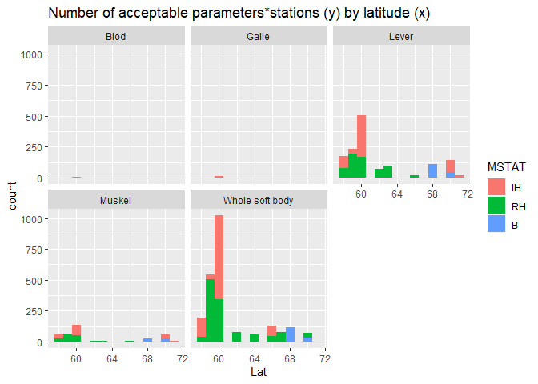
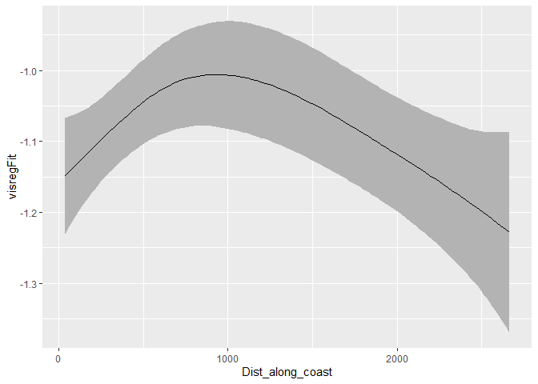
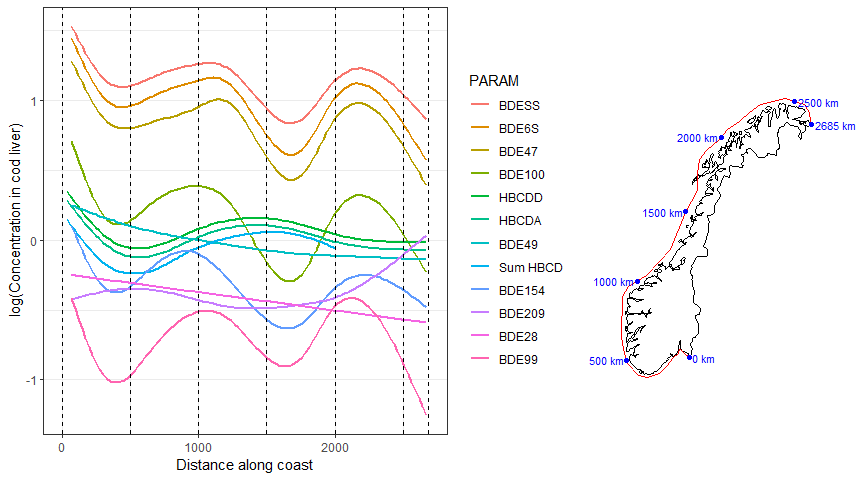
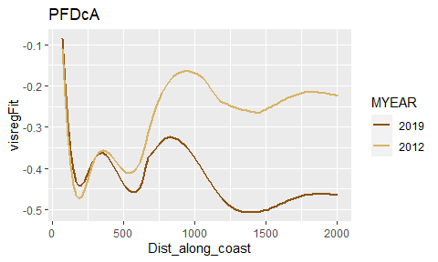

Based on script 120   


## 1. Libraries  

```r
library(rlang)

library(devtools)
library(lme4)
# library(usethis)
library(dplyr)
library(tidyr)
library(purrr)
library(forcats)
library(ggplot2)
library(mgcv)
library(visreg)

# devtools::install_github("moodymudskipper/safejoin")
library(safejoin)

# devtools::install_github("lenz99-/lme4cens")
library(lme4cens)

# For SpatialPoints() function in part 2, used for map in part 8
library(sp)

# For combining plots
library(cowplot)

# For nicer tables
library(knitr)
library(kableExtra)

# For get_point_on_coastline()
# Used in part 8  
source("103_Distance_along_coast_functions.R")
source("121_Analysis_01_functions.R")
```


## 2. Data   
Note that we get stations from script 103  

```r
# Data including trophic level
dat <- readRDS("Data/104_Selected_data.rds")
  
cat("Read data from script 104 \n")

# Extra isotope data
dat_isotopes <- readRDS("Input_data/87_df_isotopes.rds")

# Station metadata
df_stations <- readRDS("Data/103_Selected_stations.rds")


# xtabs(~STATION_CODE, df_stations ) %>% sort()
df_stations <- df_stations %>%
  mutate(MSTAT = case_when(
    STATION_CODE %in% "I969" ~ "RH",
    TRUE ~ MSTAT)) %>%
  group_by(STATION_CODE, MSTAT) %>%
  summarise_at(vars("Lat", "Lon", "Dist_along_coast"), mean)

check <- df_stations %>%
  group_by(STATION_CODE) %>%
  mutate(n = n()) %>%
  filter(n > 1)

if (nrow(check) > 0){
  cat("Some stations have >1 MSTAT codes - check 'check'! \n")
}
```

```
## Read data from script 104
```

### Parameter metadata (for sorting)  
Defines

```r
group_order <- c("Metals and metalloids", "Chlorobiphenyls", 
                 "Polycyclic aromatic hydrocarbons (PAHs)",
                 "Organobromines", "Organochlorines (general)", "Organofluorines",
                 "Phosphorus flame retardant (PFR)",
                 "Phenols/chlorophenols", "Bisphenols",
                 "Chlorinated paraffins", "Dichloro-diphenyl-trichloroethane (DDTs)", 
                 "Hexachlorocyclohexanes", 
                 "Biological effects: molecular/biochemical/cellular/assays", 
                 "Organic esters", "Isotopes", "Cyclodienes", "Dioxins", "Biomarkers", 
                 "Phthalates", "Organo-metallic compounds", "Major inorganic constituents", 
                 "Triazines", "Siloxanes", "Chlorinated flame retardants",
                 "Others")

df_parameter_groups <- read.csv2("Input_data/47_df_par.csv", stringsAsFactors = FALSE)

#
# Extra metadata
#
df <- textConnection("
Parameter.Code;Substance.Group
MCCP inkl. LOQ;Chlorinated paraffins
MCCP eksl. LOQ;Chlorinated paraffins
SCCP eksl. LOQ;Chlorinated paraffins
KPAH;Polycyclic aromatic hydrocarbons (PAHs)
PAH16;Polycyclic aromatic hydrocarbons (PAHs)
Sum HBCD;Organobromines
% C;Others
% N;Others
BDE156;Organobromines
BDE17;Organobromines
BDE184;Organobromines
BDE191;Organobromines
BDE197;Organobromines
BDE206;Organobromines
BDE207;Organobromines
BPA;Bisphenols
C/N;Others
Delta15N;Others
DRYWT%;Others
Fett;Others
Oktaklorstyren (OCS);Organochlorines (general)
Aldrin;Organochlorines (general)
Endrin;Organochlorines (general)
Dieldrin;Organochlorines (general)
Mirex;Organochlorines (general)
alfa-Klordan (cis);Organochlorines (general)
gamma-Klordan (trans);Organochlorines (general)
Heptaklor;Organochlorines (general)
Heptaklor epoksid;Organochlorines (general)
;Organochlorines (general)
;Organochlorines (general)
Pentaklorbenzen (QCB);Chlorobiphenyls
") %>% 
  read.csv2(stringsAsFactors = FALSE) %>%
  mutate(Parameter.Name = Parameter.Code)
# df

df_parameter_groups <- bind_rows(df_parameter_groups, df)

sel <- df_parameter_groups$Substance.Group == ""
df_parameter_groups$Substance.Group[sel] <- "Others"

# Check that 'Parameter.Code' covers all PARAM in the data
# (not completey but good enough; check later using e.g. 'par  <- series_param_tissue$PARAM')
par  <- unique(dat$PARAM)
par[!par %in% df_parameter_groups$Parameter.Code]
```

```
##  [1] "Sum PCB 7"                        "Sum 6 DIN-PCB eksl. LOQ"         
##  [3] "Sum 6 DIN-PCB inkl. LOQ"          "Total 6 ndl-PCB (medium-bound)"  
##  [5] "WHO(2005)-PCB TEQ (medium-bound)" "WHO(2005)-PCB TEQ eksl. LOQ"     
##  [7] "WHO(2005)-PCB TEQ inkl. LOQ"      "CDDO"                            
##  [9] "CDFO"                             "DDDOP"                           
## [11] "DDEOP"                            "DDTOP"                           
## [13] "HCHB"                             "HCHD"                            
## [15] "Nonaklor, trans-"                 "Oxyklordan"                      
## [17] "Toksafen Parlar 26"               "Toksafen Parlar 50"              
## [19] "Toksafen Parlar 62"               "trans-Heptaklorepoksid"          
## [21] "TPT"
```

```r
# Check that 'group_order' covers all groups
groups <- df_parameter_groups$Substance.Group %>% unique()
groups[!groups %in% group_order] %>% dput()
```

```
## character(0)
```

```r
# Order groups  
df_parameter_groups <- df_parameter_groups  %>% # filter(grepl("PAH", PARAM))
  mutate(Substance.Group = factor(Substance.Group, levels = group_order))

df_parameter_groups %>%
  filter(is.na(Substance.Group)) %>%
  select(Parameter.Code,Substance.Group) %>%
  nrow()
```

```
## [1] 0
```


### Isotopes in 'dat'   
Already added in script 104.  
  
It is not that easy as we heading out at here, since we need to couple isotopes (given for muscle) to 
chemical data (usually given for liver). See script 87 in `Milkys` project instead  


```r
if (FALSE){
  
  dat %>%
    filter(PARAM %in% c("Delta13C", "Delta15N") & MYEAR >= 2014) %>%
    xtabs(~MYEAR, .)
  
  #dat %>%
  #  filter(PARAM %in% c("Delta13C", "Delta15N") & MYEAR >= 2014) %>% View()
  
  dat %>%
    filter(PARAM %in% c("Delta13C", "Delta15N") & MYEAR >= 2014) %>%
    select(MYEAR, STATION_CODE, TISSUE_NAME, SAMPLE_NO2, PARAM, VALUE_WW) %>%
    tidyr::pivot_wider(names_from = PARAM, values_from = VALUE_WW) %>%
    arrange(MYEAR, STATION_CODE, TISSUE_NAME, SAMPLE_NO2)
  
}
```


### dat2 - combined data  
Adding
- position data + MSTAT (type of station - industry-impacted, representative or background)  
- LOQ  
- mean trophic level per station  


```r
# Median LOQ (per year and tissue only - should be the same for all stations)
dat_param_loq <- dat %>%
  filter(!is.na(FLAG1)) %>%
  group_by(PARAM, MYEAR, TISSUE_NAME) %>%
  summarise(LOQ = median(VALUE_WW))
```

```
## `summarise()` regrouping output by 'PARAM', 'MYEAR' (override with `.groups` argument)
```

```r
dat2 <- dat %>%
  filter(!is.na(VALUE_WW)) %>%
  ungroup() %>%
  # Add position data + MSTAT (type of station - industry-impacted, representative or background)
  safe_left_join(df_stations %>% 
                   select(STATION_CODE, Lat, Lon, Dist_along_coast, MSTAT),
                 check = "CV",
                 by = "STATION_CODE",
                 na_matches = "never") %>%
  # Add LOQ
  safe_left_join(dat_param_loq,
                 check = "CV",
                 by = c("PARAM", "MYEAR", "TISSUE_NAME"),
                 na_matches = "never") %>%
  mutate(MSTAT = factor(MSTAT,  levels = c("IH", "RH", "B"))) %>%
  # Add mean trophic level per station
  group_by(STATION_CODE) %>%
  mutate(TL_mean = mean(TL, na.rm = TRUE)) %>%
  ungroup() %>%
  filter(!is.na(Dist_along_coast))

# dat2 <- dat
```


### Test add_random_data() function  

```r
# Check parameters with ca 50% under LOQ
dat2 %>%
  filter(MYEAR > 2014) %>%
  group_by(PARAM) %>%
  summarise(less_thans = mean(!is.na(FLAG1))) %>%
  filter(less_thans < 0.5) %>%
  arrange(desc(less_thans))
```

```
## `summarise()` ungrouping output (override with `.groups` argument)
```

```
## # A tibble: 95 x 2
##    PARAM              less_thans
##    <chr>                   <dbl>
##  1 BAP                     0.486
##  2 ICDP                    0.466
##  3 MBT                     0.458
##  4 DDDOP                   0.454
##  5 PB                      0.425
##  6 CB28                    0.408
##  7 Heptaklor epoksid       0.388
##  8 Mirex                   0.361
##  9 CB169                   0.350
## 10 alfa-Klordan (cis)      0.348
## # ... with 85 more rows
```

```r
# Just pick 10 randm PFUdA records
test <- dat2 %>%
  filter(PARAM %in% "PFUdA") %>%
  select(MYEAR, STATION_CODE, VALUE_WW, FLAG1, LOQ) %>%
  head(10)

test
```

```
## # A tibble: 10 x 5
##    MYEAR STATION_CODE VALUE_WW FLAG1   LOQ
##    <dbl> <chr>           <dbl> <chr> <dbl>
##  1  2012 13B              1    <       1  
##  2  2012 13B              1.4  <NA>    1  
##  3  2012 13B              1    <       1  
##  4  2012 13B              1    <       1  
##  5  2012 13B              1    <       1  
##  6  2012 13B              1.2  <NA>    1  
##  7  2013 13B              0.46 <NA>    0.4
##  8  2013 13B              0.61 <NA>    0.4
##  9  2013 13B              0.43 <NA>    0.4
## 10  2013 13B              0.42 <NA>    0.4
```

```r
# debugonce(add_random_data)
test %>% add_random_data()
```

```
##    MYEAR STATION_CODE VALUE_WW FLAG1 LOQ VALUE_WW_r
## 1   2012          13B     1.00     < 1.0  0.9797916
## 2   2012          13B     1.40  <NA> 1.0  1.4000000
## 3   2012          13B     1.00     < 1.0  0.6517556
## 4   2012          13B     1.00     < 1.0  0.6992444
## 5   2012          13B     1.00     < 1.0  0.7490810
## 6   2012          13B     1.20  <NA> 1.0  1.2000000
## 7   2013          13B     0.46  <NA> 0.4  0.4600000
## 8   2013          13B     0.61  <NA> 0.4  0.6100000
## 9   2013          13B     0.43  <NA> 0.4  0.4300000
## 10  2013          13B     0.42  <NA> 0.4  0.4200000
```

```r
test %>% add_random_data()
```

```
##    MYEAR STATION_CODE VALUE_WW FLAG1 LOQ VALUE_WW_r
## 1   2012          13B     1.00     < 1.0  0.9310510
## 2   2012          13B     1.40  <NA> 1.0  1.4000000
## 3   2012          13B     1.00     < 1.0  0.8048400
## 4   2012          13B     1.00     < 1.0  0.5011466
## 5   2012          13B     1.00     < 1.0  0.5722666
## 6   2012          13B     1.20  <NA> 1.0  1.2000000
## 7   2013          13B     0.46  <NA> 0.4  0.4600000
## 8   2013          13B     0.61  <NA> 0.4  0.6100000
## 9   2013          13B     0.43  <NA> 0.4  0.4300000
## 10  2013          13B     0.42  <NA> 0.4  0.4200000
```


### Use correct basis  

```r
pah <- c("ACNLE", "ACNE", "FLE", "PA", "ANT", "FLU", "PYR", "BAA", 
         "CHR", "BBJF", "BKF", "BAP", "DBA3A", "BGHIP", "ICDP", "NAP", 
         "BBJKF", "BJKF", "PAH16", "KPAH", "P_S") 
pfas <- c("PFOS", "PFOSA", "PFBS", "PFDcA", "PFHxA", "PFHxS", 
          "PFHpA", "PFUdA", "PFOA", "PFNA", "PFUdA")
metals <- c("AG", "AS", "CD", "CO", "CR", "CU", "HG", "SN", 
            "NI", "PB", "ZN")

dat2 <- dat2 %>%
  mutate(CONC = case_when(
    PARAM %in% c(pah, pfas, metals) ~ VALUE_DW,
    !PARAM %in% c(pah, pfas, metals) ~ VALUE_WW
  ),
  Basis = case_when(
    PARAM %in% c(pah, pfas, metals) ~ "Dry weight",
    !PARAM %in% c(pah, pfas, metals) ~ "Wet weight"
  )
  )
  
table(dat2$Basis)
```

```
## 
## Dry weight Wet weight 
##      81954     258396
```


### Data for plotting maps  
Used in part 8  

```r
#
# Get Norway map data
#
test <- maps::map("world", "Norway", plot = FALSE)   # map data for Norway - this is just to get region names
sel <- grepl("Svalbard", test$names) | test$names == "Norway:Jan Mayen"  # select Svalbard + Jan Mayen
# test$names[!sel]
map <- maps::map("world", test$names[!sel], exact = TRUE, plot = FALSE)  # Norway w/o Svalbard + Jan Mayen
mapdata <- data.frame(Longitude = map$x, Latitude = map$y)

#
# Add UTM coordinates (x and y) to map
#
coordinate_exists <- !is.na(mapdata$Longitude)   # sp doesn't like NAs
SP <- sp::SpatialPoints(mapdata[coordinate_exists, c("Longitude", "Latitude")],
                    proj4string=CRS(crs_longlat)
)
SP.UTM <- sp::spTransform(SP, CRS(crs_utm))
# Add transformed coords to data set
mapdata$x[coordinate_exists] <- SP.UTM@coords[,1]
mapdata$y[coordinate_exists] <- SP.UTM@coords[,2]


#
# "Coast" data (coordinates for segments along the coast)
#
coast <- readRDS("Data/102_coast_coordinates.rmd")

#
# Make 'coastsegment_distance'   
#
# Distances for start points of the coast segments
segment_dx <- diff(coast$x)/1000
segment_dy <- diff(coast$y)/1000
coastsegment_distance <- sqrt(segment_dx^2 + segment_dy^2) %>% cumsum()
coastsegment_distance <- c(0, coastsegment_distance)
```

## 3. dat_param - data for one parameter   


```r
# All metals  
dat2 %>%
  filter(nchar(PARAM) == 2 & MYEAR >= 2014) %>%
  xtabs(~PARAM + MYEAR, .)
```

```
##      MYEAR
## PARAM 2014 2015 2016 2017 2018 2019
##    AG  272  313  317  303  279  256
##    AS  272  317  320  306  288  261
##    BA    3    0    0    0    0    0
##    CD  272  316  320  306  288  261
##    CO  272  314  317  303  279  256
##    CR  272  317  320  306  288  261
##    CU  272  317  320  306  288  261
##    HG  305  345  340  336  323  282
##    MO    3    0    0    0    0    0
##    NI  272  317  320  306  288  261
##    PA   29   36   33   25   30   22
##    PB  272  317  320  306  288  261
##    SN  272  313  317  303  279  256
##    ZN  272  317  320  306  288  261
```

```r
param <- "NI"
# tissue <- "Lever"
tissue <- "Whole soft body"

dat_param <-  dat2 %>%
  filter(PARAM %in% param & TISSUE_NAME %in% tissue) %>% 
  add_random_data() %>%
  mutate(log_CONC = log10(VALUE_WW)) %>%
  select(PARAM, STATION_CODE, TISSUE_NAME, MSTAT, log_CONC, MYEAR, Dist_along_coast, LNMEA, FAT_PERC, TL, TL_mean) # %>%


# Check missing values per year
dat_param %>%
  filter(MYEAR >= 2014) %>%
  split(.$MYEAR) %>%
  purrr::map(~apply(is.na(.), 2, mean))
```

```
## $`2014`
##            PARAM     STATION_CODE      TISSUE_NAME            MSTAT 
##       0.00000000       0.00000000       0.00000000       0.00000000 
##         log_CONC            MYEAR Dist_along_coast            LNMEA 
##       0.00000000       0.00000000       0.00000000       1.00000000 
##         FAT_PERC               TL          TL_mean 
##       0.01075269       0.00000000       0.00000000 
## 
## $`2015`
##            PARAM     STATION_CODE      TISSUE_NAME            MSTAT 
##       0.00000000       0.00000000       0.00000000       0.00000000 
##         log_CONC            MYEAR Dist_along_coast            LNMEA 
##       0.00000000       0.00000000       0.00000000       1.00000000 
##         FAT_PERC               TL          TL_mean 
##       0.02912621       0.00000000       0.00000000 
## 
## $`2016`
##            PARAM     STATION_CODE      TISSUE_NAME            MSTAT 
##       0.00000000       0.00000000       0.00000000       0.00000000 
##         log_CONC            MYEAR Dist_along_coast            LNMEA 
##       0.00000000       0.00000000       0.00000000       1.00000000 
##         FAT_PERC               TL          TL_mean 
##       0.03092784       0.00000000       0.00000000 
## 
## $`2017`
##            PARAM     STATION_CODE      TISSUE_NAME            MSTAT 
##       0.00000000       0.00000000       0.00000000       0.00000000 
##         log_CONC            MYEAR Dist_along_coast            LNMEA 
##       0.00000000       0.00000000       0.00000000       1.00000000 
##         FAT_PERC               TL          TL_mean 
##       0.08045977       0.00000000       0.00000000 
## 
## $`2018`
##            PARAM     STATION_CODE      TISSUE_NAME            MSTAT 
##        0.0000000        0.0000000        0.0000000        0.0000000 
##         log_CONC            MYEAR Dist_along_coast            LNMEA 
##        0.0000000        0.0000000        0.0000000        1.0000000 
##         FAT_PERC               TL          TL_mean 
##        0.1111111        0.0000000        0.0000000 
## 
## $`2019`
##            PARAM     STATION_CODE      TISSUE_NAME            MSTAT 
##       0.00000000       0.00000000       0.00000000       0.00000000 
##         log_CONC            MYEAR Dist_along_coast            LNMEA 
##       0.00000000       0.00000000       0.00000000       1.00000000 
##         FAT_PERC               TL          TL_mean 
##       0.07936508       0.00000000       0.00000000
```

```r
dat_param %>%
  filter(MYEAR >= 2014) %>%
  xtabs(~STATION_CODE + MYEAR, .)
```

```
##             MYEAR
## STATION_CODE 2014 2015 2016 2017 2018 2019
##        10A2     3    3    3    3    3    0
##        11X      3    3    3    3    3    0
##        15A      3    3    3    3    3    3
##        22A      3    3    3    3    3    3
##        26A2     3    3    3    3    3    3
##        30A      3    3    3    3    3    3
##        31A      3    3    3    3    3    3
##        35A      3    3    3    3    0    0
##        36A      0    0    3    3    0    0
##        36A1     3    3    0    0    3    3
##        52A      3    3    3    3    3    0
##        57A      3    3    3    3    3    3
##        63A      3    3    3    3    0    0
##        64A      3    3    3    3    3    3
##        65A      3    3    3    3    3    3
##        69A      3    3    3    3    0    0
##        71A      3    3    3    1    0    0
##        76A2     3    3    3    3    3    3
##        91A2     3    3    3    3    3    3
##        97A2     3    3    3    3    3    3
##        98A2     3    3    3    3    3    3
##        I023     3    3    3    3    3    3
##        I024     3    3    1    2    3    2
##        I131A    3    3    3    3    3    3
##        I133     3    4    3    3    3    3
##        I241     2    3    3    3    3    3
##        I301     3    3    3    3    3    3
##        I304     3    3    3    3    3    2
##        I306     3    3    3    3    0    0
##        I307     3    3    3    0    0    0
##        I712     1    3    0    0    0    0
##        I714     0    3    3    3    3    0
##        I964     0    1    3    1    3    0
##        I965     3    4    3    1    3    3
##        I969     3    4    3    1    3    2
```

## 4. Test: dist_along_coast, adjust separetely for each station     
- First adjust for length, fat and trophic level, separately for each station  
    + Test for one series, using `dat_param`  
    +  In (b) and (c), variable log_CONC_adj is added, creates `dat_param2`  
- Then (d) analyse the adjusted values by year and distance along coast  
- 

### a. Check data patterns  

```r
df_summ <- dat2 %>%
  filter(PARAM %in% param & TISSUE_NAME %in% tissue) %>%
  group_by(STATION_CODE, MYEAR) %>%
  summarise(n = n(), median = median(VALUE_WW), below_loq = mean(!is.na(FLAG1)), loq = mean(LOQ),
            has_LNMEA = mean(!is.na(LNMEA)), has_TL = mean(!is.na(TL))) 
```

```
## `summarise()` regrouping output by 'STATION_CODE' (override with `.groups` argument)
```

```r
ggplot(df_summ, aes(MYEAR, STATION_CODE)) +
  geom_tile(aes(fill = n))
```

<!-- -->

```r
ggplot(df_summ, aes(MYEAR, STATION_CODE)) +
  geom_tile(aes(fill = below_loq))
```

<!-- -->

```r
ggplot(df_summ, aes(MYEAR, STATION_CODE)) +
  geom_tile(aes(fill = loq))
```

<!-- -->

```r
ggplot(df_summ, aes(MYEAR, STATION_CODE)) +
  geom_tile(aes(fill = has_LNMEA))
```

<!-- -->

```r
ggplot(df_summ, aes(MYEAR, STATION_CODE)) +
  geom_tile(aes(fill = has_TL))
```

<!-- -->


### b. Adjust for length and fat (LF), functions    
We do not include trophic level (TL) as there are data only since 2015  
So it will (somehow) be included in the analysese on a per-station basis instead   
  
#### Test `add_adjusted_value_LF`   
Adds the variable log_CONC_adj - creates `dat_param2`   
May also remove some records 
Note that you can select the response variable you want

```r
#
# Note: add_adjusted_value_LF() may remove some records
#

dim(dat_param)
```

```
## [1] 1005   11
```

```r
dat_param2 <- add_adjusted_value_LF(dat_param, LNMEA_fixed = 500, FAT_PERC_fixed = 40, plot = FALSE)
```

```
## Warning in predict.lm(mod, pred_data): prediction from a rank-deficient fit may
## be misleading
```

```r
cat("\n")
```

```r
dim(dat_param2)
```

```
## [1] 440  12
```

```r
# names(dat_param)
# names(dat_param2)
```


#### Plots of 'dat_param2'  

```r
ggplot(dat_param2, aes(log_CONC, log_CONC_adj)) +
  geom_point()
```

<!-- -->

```r
dat_param2 %>%
  group_by(MYEAR, STATION_CODE) %>%
  summarise_at(vars(log_CONC, log_CONC_adj), list(mean=mean, min=min, max=max)) %>%
  ggplot(aes(MYEAR, log_CONC_mean)) +
  geom_pointrange(aes(ymin = log_CONC_min, ymax = log_CONC_max), size = rel(0.2)) +
  geom_pointrange(aes(x = MYEAR + 0.35, y = log_CONC_adj_mean, 
                      ymin = log_CONC_adj_min, ymax = log_CONC_adj_max),
                  color = "red", size = rel(0.2)) +
  facet_wrap(vars(STATION_CODE)) +
  labs(title = "Log concentrations (mean, min and max)", subtitle = "Black = raw concentration, red = adjusted")
```

<!-- -->

```r
ggplot(dat_param2, aes(log_CONC_adj - log_CONC, LNMEA)) +
  geom_point()
```

<!-- -->

```r
ggplot(dat_param2, aes(log_CONC_adj - log_CONC, FAT_PERC)) +
  geom_point()
```

<!-- -->


#### Test using random values

```r
dat_param2_random <- dat2 %>%
  filter(PARAM %in% "PFUdA" & TISSUE_NAME %in% "Lever") %>% 
  add_random_data() %>%
  mutate(log_CONC = log10(VALUE_WW),
         log_CONC_r = log10(VALUE_WW_r)) %>%
  select(STATION_CODE, TISSUE_NAME, MSTAT, log_CONC, log_CONC_r, MYEAR, Dist_along_coast, LNMEA, FAT_PERC, TL, TL_mean) %>%
  add_adjusted_value_LF(LNMEA_fixed = 500, FAT_PERC_fixed = 40, plot = FALSE, response_variable = "log_CONC_r")
```

```
## Warning in predict.lm(mod, pred_data): prediction from a rank-deficient fit may
## be misleading
```

```r
names(dat_param2_random)
```

```
##  [1] "STATION_CODE"     "TISSUE_NAME"      "MSTAT"            "log_CONC"        
##  [5] "log_CONC_r"       "MYEAR"            "Dist_along_coast" "LNMEA"           
##  [9] "FAT_PERC"         "TL"               "TL_mean"          "log_CONC_r_adj"
```

### c. Adjust for fat only    
For blue mussel, where we lack length for a lot of years  

#### Function `add_adjusted_value_F`   
- to use for data containing one parameter/tissue       

```r
#
# Note: add_adjusted_value_LF() may remove some records
#
dim(dat_param)
```

```
## [1] 1005   11
```

```r
dat_param2 <- add_adjusted_value_F(dat_param, plot = FALSE)
```

```
## Warning in predict.lm(mod, pred_data): prediction from a rank-deficient fit may
## be misleading
```

```r
cat("\n")
```

```r
dim(dat_param2)
```

```
## [1] 940  12
```

```r
# names(dat_param)
# names(dat_param2)
```


### d. Linear analysis by year and dist. along coast   
Use gls with AR1 model  

#### Test

```r
dat_param2 %>%
  filter(is.na(Dist_along_coast))
```

```
##  [1] PARAM            STATION_CODE     TISSUE_NAME      MSTAT           
##  [5] log_CONC         MYEAR            Dist_along_coast LNMEA           
##  [9] FAT_PERC         TL               TL_mean          log_CONC_adj    
## <0 rows> (or 0-length row.names)
```

```r
# PSeudorepl
mod0 <- gls(log_CONC_adj ~ MYEAR + Dist_along_coast, data = dat_param2)
acf(residuals(mod0), type = "partial")
```

<!-- -->

```r
# Autocorrelation structure only
mod10 <- gls(log_CONC_adj ~ 1, data = dat_param2,
            correlation = corAR1(form = ~1 | STATION_CODE))
acf(residuals(mod10), type = "partial")
```

<!-- -->

```r
# Year
mod1a <- gls(log_CONC_adj ~ MYEAR, data = dat_param2,
            correlation = corAR1(form = ~1 | STATION_CODE))
# Dist_along_coast
mod1b <- gls(log_CONC_adj ~ Dist_along_coast, data = dat_param2,
            correlation = corAR1(form = ~1 | STATION_CODE))
# Year + Dist_along_coast
mod1c <- gls(log_CONC_adj ~ MYEAR + Dist_along_coast, data = dat_param2,
            correlation = corAR1(form = ~1 | STATION_CODE))
# Year - Dist_along_coast - interaction
mod1d <- gls(log_CONC_adj ~ MYEAR*Dist_along_coast, data = dat_param2,
            correlation = corAR1(form = ~1 | STATION_CODE))

aic <- AIC(mod0, mod10, mod1a, mod1b, mod1c, mod1d)
```

```
## Warning in AIC.default(mod0, mod10, mod1a, mod1b, mod1c, mod1d): models are not
## all fitted to the same number of observations
```

```r
aic$dAIC <- aic$AIC - min(aic$AIC)
aic
```

```
##       df        AIC      dAIC
## mod0   4  434.31148 578.59670
## mod10  3 -137.88191   6.40331
## mod1a  4 -144.28522   0.00000
## mod1b  4 -117.19679  27.08843
## mod1c  5 -123.44441  20.84081
## mod1d  6  -99.93953  44.34569
```

```r
# AIC says that "models are not all fitted to the same number of observations"
# BUT they are! (see below)
cat("\n")
```

```r
list(mod0, mod10, mod1a, mod1b, mod1c, mod1d) %>% map_int(~summary(.)$dims$N)
```

```
## [1] 940 940 940 940 940 940
```

```r
# summary(mod1d) %>% str()
summary(mod1a)$tTable
```

```
##                    Value    Std.Error   t-value      p-value
## (Intercept) -45.21542600 10.644626109 -4.247723 2.374792e-05
## MYEAR         0.02207177  0.005286819  4.174868 3.259123e-05
```

```r
# summary(mod1d)$tTable
# summary(mod1c)$tTable
# summary(mod1c)$tTable
# summary(mod1c)$tTable[2:3,] %>% matrix(nrow = 1) %>% data.frame()
```

#### Test function 'run_gls'    

```r
# Used in section 6
model_string <- data.frame(
  modelnumber = 1:5,
  model = c("~", 
            "~ MYEAR",
            "~ Dist_along_coast",
            "~ MYEAR + Dist_along_coast",
            "~ MYEAR*Dist_along_coast")
)

# debugonce(run_gls)
# run_gls(dat_param2)

list(dat_param2,
     dat_param2 %>% filter(MSTAT != "IH")) %>% 
  map_dfr(run_gls)
```

```
## Warning in AIC.default(mod10, mod1a, mod1b, mod1c, mod1d): models are not all
## fitted to the same number of observations

## Warning in AIC.default(mod10, mod1a, mod1b, mod1c, mod1d): models are not all
## fitted to the same number of observations
```

```
##   Best_model dAIC_yr dAIC_dist dAIC_yr_dist dAIC_yr_x_dist   Year_est
## 1          2       0  27.08843     20.84081       44.34569 0.02212611
## 2          2       0  23.33338     20.86098       44.51407 0.01982494
##    Position_est     Year_se  Position_se       Year_p Position_p
## 1  6.053550e-06 0.005323938 3.184206e-05 3.535638e-05  0.8492627
## 2 -1.248292e-05 0.005400883 2.938345e-05 2.628863e-04  0.6711101
```

#### Test using random values  

```r
run_gls(dat_param2_random,  response_variable = "log_CONC_r_adj") 
```

```
## Warning in AIC.default(mod10, mod1a, mod1b, mod1c, mod1d): models are not all
## fitted to the same number of observations
```

```
##   Best_model  dAIC_yr dAIC_dist dAIC_yr_dist dAIC_yr_x_dist     Year_est
## 1          3 21.34209         0     8.285573       30.18073 -0.008657385
##    Position_est     Year_se  Position_se    Year_p   Position_p
## 1 -0.0001264285 0.005906908 2.009305e-05 0.1431126 4.981599e-10
```

```r
run_gls(dat_param2_random,  response_variable = "log_CONC") 
```

```
## Warning in AIC.default(mod10, mod1a, mod1b, mod1c, mod1d): models are not all
## fitted to the same number of observations
```

```
##   Best_model  dAIC_yr dAIC_dist dAIC_yr_dist dAIC_yr_x_dist    Year_est
## 1          4 12.42297    1.4794            0       23.53289 -0.01839234
##    Position_est     Year_se  Position_se       Year_p   Position_p
## 1 -0.0001117627 0.005177775 1.774259e-05 0.0004028395 4.772037e-10
```


### e. Test function for one replicate    
Function `analysis_one_par_one_repl` 

```r
# Testing 
analysis_one_par_one_repl("NI", "Lever", dat2)
```

```
## Warning in predict.lm(mod, pred_data): prediction from a rank-deficient fit may
## be misleading
```

```
## Warning in AIC.default(mod10, mod1a, mod1b, mod1c, mod1d): models are not all
## fitted to the same number of observations
```

```
##   PARAM TISSUE_NAME Best_model  dAIC_yr dAIC_dist dAIC_yr_dist dAIC_yr_x_dist
## 1    NI       Lever          1 9.951691   20.7388     30.67129       48.71271
##      Year_est  Position_est     Year_se Position_se    Year_p Position_p
## 1 0.003638589 -1.885095e-05 0.006450855  2.6862e-05 0.5727784  0.4828958
```

```r
if (FALSE){
  analysis_one_par_one_repl("NI", "Whole soft body", dat2)
  analysis_one_par_one_repl("PFUdA", "Lever", dat2)
  analysis_one_par_one_repl("CD", "Whole soft body", dat2)
  debugonce(analysis_one_par_one_repl)
  debugonce(add_adjusted_value_LF)
  analysis_one_par_one_repl("HG", "Muskel", dat2)
}

# 1:5 %>% set_names()
```

### f. N replicates  

#### Test

```r
1:3 %>% 
  set_names() %>% 
  map_dfr(
  ~analysis_one_par_one_repl(param = "PFUdA", 
                             tissue = "Lever", 
                             data = dat2),
  .id = "Repl"
)
```

```
## Warning in predict.lm(mod, pred_data): prediction from a rank-deficient fit may
## be misleading
```

```
## Warning in AIC.default(mod10, mod1a, mod1b, mod1c, mod1d): models are not all
## fitted to the same number of observations
```

```
## Warning in predict.lm(mod, pred_data): prediction from a rank-deficient fit may
## be misleading
```

```
## Warning in AIC.default(mod10, mod1a, mod1b, mod1c, mod1d): models are not all
## fitted to the same number of observations
```

```
## Warning in predict.lm(mod, pred_data): prediction from a rank-deficient fit may
## be misleading
```

```
## Warning in AIC.default(mod10, mod1a, mod1b, mod1c, mod1d): models are not all
## fitted to the same number of observations
```

```
##   Repl PARAM TISSUE_NAME Best_model  dAIC_yr dAIC_dist dAIC_yr_dist
## 1    1 PFUdA       Lever          3 25.75985         0     8.690521
## 2    2 PFUdA       Lever          3 23.12457         0     8.854685
## 3    3 PFUdA       Lever          3 26.33435         0     8.833031
##   dAIC_yr_x_dist     Year_est  Position_est     Year_se  Position_se    Year_p
## 1       31.64628 -0.007769737 -0.0001333578 0.005862955 1.993042e-05 0.1854484
## 2       31.45336 -0.007399781 -0.0001282392 0.005871425 1.997859e-05 0.2079015
## 3       31.62316 -0.007462735 -0.0001353344 0.005908228 2.010140e-05 0.2068924
##     Position_p
## 1 3.987413e-11
## 2 2.267348e-10
## 3 3.044602e-11
```

#### Test function for n replicates    
- `analysis_one_par` 
- Replicates needed since 'add_random_data' will give different results each time  

```r
analysis_one_par("NI", "Lever", dat2, nrepl = 2)

if (FALSE){
  analysis_one_par("PFUdA", "Lever", dat2, nrepl = 5)
}
```

```
##   Repl PARAM TISSUE_NAME Best_model  dAIC_yr dAIC_dist dAIC_yr_dist
## 1    1    NI       Lever          1 9.850722  20.68775     30.51574
## 2    2    NI       Lever          1 9.833057  20.76823     30.57938
##   dAIC_yr_x_dist    Year_est  Position_est     Year_se  Position_se    Year_p
## 1       49.14078 0.004202600 -1.989338e-05 0.006440099 2.681718e-05 0.5141024
## 2       48.58358 0.004292646 -1.840153e-05 0.006430199 2.677372e-05 0.5044734
##   Position_p
## 1  0.4582778
## 2  0.4919663
```

## 5. Linear model - all parameters + tissues


### Plot number of data   
Naturally higher for cod than for blue mussel

```r
dat2 %>%
  count(PARAM, TISSUE_NAME) %>%
  ggplot(aes(n)) + 
  geom_histogram(binwidth = 200) +
  facet_wrap(vars(TISSUE_NAME)) +
  labs(title = "Number of parameters (y) with a given number of samples (x)")
```

<!-- -->

```r
dat2 %>%
  count(PARAM, TISSUE_NAME) %>% 
  ggplot(aes(n)) + 
  geom_histogram(binwidth = 25) +
  facet_wrap(vars(TISSUE_NAME)) +
  coord_cartesian(xlim = c(0,500)) +
  labs(title = "Number of parameters (y) with a given number of samples (x)",
       subtitle = "Only parameters with <500 samples shown")
```

<!-- -->

### Plot number of stations 

```r
# Number of parameters/stations 
df_acceptable_stations <- dat2 %>%
  group_by(PARAM, TISSUE_NAME) %>%
  mutate(sample_size = n()) %>%
  count(PARAM, TISSUE_NAME, STATION_CODE, MSTAT, Lat, MYEAR, sample_size) %>%
  filter(n >= 3) %>%  # min. number of samples per parameter/station/year 
  group_by(PARAM, TISSUE_NAME, STATION_CODE, MSTAT, Lat, sample_size) %>%
  summarise(n_years = n(), .groups = "drop") %>%
  filter(n_years >= 3)      # min. number of years per parameter/station
cat("Acceptable PARAM, TISSUE_NAME, STATION_CODE combinations: ", 
    nrow(df_acceptable_stations), "\n")
```

```
## Acceptable PARAM, TISSUE_NAME, STATION_CODE combinations:  4055
```

```r
# Plot
ggplot(df_acceptable_stations, aes(Lat, fill = MSTAT)) +
  geom_histogram(binwidth = 1) +
  facet_wrap(vars(TISSUE_NAME)) +
  labs(title = "Number of acceptable parameters*stations (y) by latitude (x)")
```

<!-- -->

```r
# One line per parameter/tissue/region/impact, n = number of stations  
df_param <- df_acceptable_stations %>%
  mutate(Area = case_when(
    Lat > 65 ~ "North",
    Lat > 63 ~ "Mid",
    TRUE ~ "South"
  ),
  Impacted = (MSTAT == "IH")
  ) %>% 
  arrange(PARAM, TISSUE_NAME, Area) %>%
  count(PARAM, TISSUE_NAME, Area, Impacted, sample_size, .groups = "drop")

# One line per parameter/tissue - one column per region (all stations)
df_param_all <- df_param %>%
  group_by(PARAM, TISSUE_NAME, Area, sample_size) %>% 
  summarise(n = sum(n), .groups = "drop") %>%
  tidyr::pivot_wider(names_from = "Area", values_from = "n") 

# One line per parameter/tissue - one column per region (unimpacted stations)
df_param_notimpacted <- df_param %>%
  filter(!Impacted) %>%
  tidyr::pivot_wider(names_from = "Area", values_from = "n") %>%
  select(-Impacted)

# One line per tissue/coverage - number gives number of parameters
df1 <- df_param_all %>%
  mutate(Spatial_coverage = case_when(
    North >= 2 ~ "OK",
    TRUE ~ "Not OK")) %>%
  count(TISSUE_NAME, Spatial_coverage) %>% # View()
  rename(All = n)

# One line per tissue/coverage - number gives number of parameters (unimpacted stations)
df2 <- df_param_notimpacted %>%
  mutate(Spatial_coverage = case_when(
    North >= 2 ~ "OK",
    TRUE ~ "Not OK")) %>% # View()
  count(TISSUE_NAME, Spatial_coverage) %>%
  rename(Notimpacted = n) 

# One line per tissue/coverage - number gives number of parameters
check <- left_join(df1, df2, by = c("TISSUE_NAME", "Spatial_coverage"),
          na_matches = "never") #"%>%
  #select(TISSUE_NAME, Spatial_coverage)
# xtabs(~)

kable(check, caption = "Number of parameters")
```

<table>
<caption>Number of parameters</caption>
 <thead>
  <tr>
   <th style="text-align:left;"> TISSUE_NAME </th>
   <th style="text-align:left;"> Spatial_coverage </th>
   <th style="text-align:right;"> All </th>
   <th style="text-align:right;"> Notimpacted </th>
  </tr>
 </thead>
<tbody>
  <tr>
   <td style="text-align:left;"> Blod </td>
   <td style="text-align:left;"> Not OK </td>
   <td style="text-align:right;"> 1 </td>
   <td style="text-align:right;"> 1 </td>
  </tr>
  <tr>
   <td style="text-align:left;"> Galle </td>
   <td style="text-align:left;"> Not OK </td>
   <td style="text-align:right;"> 3 </td>
   <td style="text-align:right;"> 3 </td>
  </tr>
  <tr>
   <td style="text-align:left;"> Lever </td>
   <td style="text-align:left;"> Not OK </td>
   <td style="text-align:right;"> 30 </td>
   <td style="text-align:right;"> 71 </td>
  </tr>
  <tr>
   <td style="text-align:left;"> Lever </td>
   <td style="text-align:left;"> OK </td>
   <td style="text-align:right;"> 89 </td>
   <td style="text-align:right;"> 48 </td>
  </tr>
  <tr>
   <td style="text-align:left;"> Muskel </td>
   <td style="text-align:left;"> OK </td>
   <td style="text-align:right;"> 28 </td>
   <td style="text-align:right;"> 28 </td>
  </tr>
  <tr>
   <td style="text-align:left;"> Whole soft body </td>
   <td style="text-align:left;"> Not OK </td>
   <td style="text-align:right;"> 43 </td>
   <td style="text-align:right;"> 55 </td>
  </tr>
  <tr>
   <td style="text-align:left;"> Whole soft body </td>
   <td style="text-align:left;"> OK </td>
   <td style="text-align:right;"> 117 </td>
   <td style="text-align:right;"> 105 </td>
  </tr>
</tbody>
</table>

### Select time series - 'series_param_tissue'    
Based on 'df_param_notimpacted'  

```r
series_param_tissue <- dat2 %>%
  distinct(PARAM, TISSUE_NAME) %>%
  # Only difference from the next: using 'df_param_notimpacted' here:
  left_join(df_param_notimpacted, 
            by = c("PARAM", "TISSUE_NAME"),
            na_matches = "never") %>%
  filter(North >= 2) %>%    # At least 2 not-impacted time series in Northern Norway
  as.data.frame()

# head(dat_param_tissue)  
cat("Number of time series:", nrow(series_param_tissue), "\n")  
```

```
## Number of time series: 181
```

Safe version of analysis_one_par  

```r
analysis_one_par_s <- safely(analysis_one_par)
```


### dat2_notimpacted: data from non-impacted stations  

```r
series_param_tissue[12:13,]
```

```
##    TISSUE_NAME PARAM sample_size .groups Mid North South
## 12       Lever    ZN        4839    drop   1     3     7
## 13       Lever CB_S7        4865    drop   1     3     7
```

```r
dat2_notimpacted <- dat2 %>%
  # Only difference from the next: using 'df_param_notimpacted' here:
  filter(!MSTAT %in% "IH") %>% 
  as.data.frame()

# Test
if (FALSE){
  
  analysis_one_par_s("ZN", "Lever", dat2_notimpacted, nrepl = 3)
  analysis_one_par_s("CB_S7", "Lever", dat2_notimpacted, nrepl = 3)
  analysis_one_par_S("PFUdA", "Lever", dat2_notimpacted, nrepl = 3)
  
  # Test 2
  result_list <- 12:13 %>%
    # result_list <- seq(1,10) %>%
    purrr::map(
      ~analysis_one_par_s(series_param_tissue$PARAM[.], 
                          series_param_tissue$TISSUE_NAME[.], 
                          dat2_notimpacted,    # NOTE
                          nrepl = 3)
    ) %>%
    purrr::transpose()
  
  ok <- result_list[[2]] %>% map_lgl(is.null)
  sum(ok)
  
  result <- result_list[[1]][ok] %>% bind_rows()

  
}
```

### Run analysis for all non-impacted stations   
Is only run if 'run_analysis' = TRUE, otherwise we use saved data (next chunk)

```r
# run_analysis <- TRUE
run_analysis <- FALSE

if (run_analysis){
  
  # For taking the time 
  t0 <- Sys.time()
  
  result_list <- 1:nrow(series_param_tissue) %>%
    # result_list <- seq(1,10) %>%
    purrr::map(
      ~analysis_one_par_s(series_param_tissue$PARAM[.], 
                          series_param_tissue$TISSUE_NAME[.], 
                          dat2_notimpacted,    # NOTE
                          nrepl = 3)
    ) %>%
    purrr::transpose()
  
  # For takng the time 
  t1 <- Sys.time()
  t1-t0     # 6.75 minutes
  
} else {
  
  # If run_analysis = FALSE, we just use the saved data
  result_list <- readRDS("Data/120_result_list_notimpacted.rds")

}
```

### Save   
We only run the "savRDS" line if we have run a new analysis (run_analysis = TRUE)  
Otherwise we just read the saved data  

```r
if (run_analysis){
  saveRDS(result_list, "Data/120_result_list_notimpacted.rds")
} else {
  result_list <- readRDS("Data/120_result_list_notimpacted.rds")
}

length(result_list[[1]])
```

```
## [1] 338
```

```r
length(result_list[[2]])
```

```
## [1] 338
```


### Linear_results - store result as 'linear_results'  

```r
ok <- result_list[[2]] %>% map_lgl(is.null)
cat("Number of regressions that worked (numbers / fraction): \n")
```

```
## Number of regressions that worked (numbers / fraction):
```

```r
sum(ok)
```

```
## [1] 318
```

```r
mean(ok)
```

```
## [1] 0.9408284
```

```r
# series_param_tissue$Result_nonimpact <- ok

linear_results <- result_list[[1]][ok] %>% 
  bind_rows() %>% 
  left_join(df_parameter_groups[c("Parameter.Code", "Substance.Group")],
            by = c("PARAM" = "Parameter.Code"),
            na_matches = "never") %>%
  select(Substance.Group, everything()) %>%
  arrange(Substance.Group)
```

## 6. Check results  

### Best AIC   
See function 'run_gls' (section 4, 'Linear analysis by year and dist.') for models  


```r
linear_results %>%
  left_join(model_string, by = c("Best_model" = "modelnumber")) %>%
  xtabs(~model + TISSUE_NAME, .)
```

```
##                             TISSUE_NAME
## model                        Lever Muskel Whole soft body
##   ~                            146     53             320
##   ~ Dist_along_coast            16      4               6
##   ~ MYEAR                      163     12             178
##   ~ MYEAR + Dist_along_coast    50      0              12
##   ~ MYEAR*Dist_along_coast       3      0               0
```

### Table of estimates     
As a beautiful (?) kable table  

```r
linear_results %>%
  filter(TISSUE_NAME %in% "Lever") %>%
  group_by(Substance.Group, PARAM, TISSUE_NAME) %>%
  summarise_all(list(min = min, mean = mean, median = median)) %>%
  ungroup() %>%
  mutate(Position_est_mean = (1000*Position_est_mean) %>% round(3),
         Position_se_mean = (1000*Position_se_mean) %>% round(3),
         P = format_p(Position_p_median),
         Parameter = cell_spec(
           PARAM, "html", 
           color = ifelse(Position_p_median < 0.05, "red", "black")),
         Distance_along_coast = cell_spec(
           Position_est_mean, "html", 
           color = ifelse(Position_p_median < 0.05, "red", "black")),
         SE = cell_spec(
           Position_se_mean, "html",
           color = ifelse(Position_p_median < 0.05, "red", "black")),
         `P-value` = cell_spec(
           P, "html", 
           color = ifelse(Position_p_median < 0.05, "red", "black")),
  ) %>%
  select(Parameter, Distance_along_coast, SE, `P-value`) %>%
  knitr::kable(format = "html", escape = FALSE) %>%
  kableExtra::kable_styling(bootstrap_options = "condensed")
```

<table class="table table-condensed" style="margin-left: auto; margin-right: auto;">
 <thead>
  <tr>
   <th style="text-align:left;"> Parameter </th>
   <th style="text-align:left;"> Distance_along_coast </th>
   <th style="text-align:left;"> SE </th>
   <th style="text-align:left;"> P-value </th>
  </tr>
 </thead>
<tbody>
  <tr>
   <td style="text-align:left;"> <span style="     color: red !important;">AG</span> </td>
   <td style="text-align:left;"> <span style="     color: red !important;">-0.096</span> </td>
   <td style="text-align:left;"> <span style="     color: red !important;">0.036</span> </td>
   <td style="text-align:left;"> <span style="     color: red !important;">0.007</span> </td>
  </tr>
  <tr>
   <td style="text-align:left;"> <span style="     color: black !important;">AS</span> </td>
   <td style="text-align:left;"> <span style="     color: black !important;">-0.024</span> </td>
   <td style="text-align:left;"> <span style="     color: black !important;">0.018</span> </td>
   <td style="text-align:left;"> <span style="     color: black !important;">0.19</span> </td>
  </tr>
  <tr>
   <td style="text-align:left;"> <span style="     color: red !important;">CD</span> </td>
   <td style="text-align:left;"> <span style="     color: red !important;">0.268</span> </td>
   <td style="text-align:left;"> <span style="     color: red !important;">0.012</span> </td>
   <td style="text-align:left;"> <span style="     color: red !important;">&lt; 0.001</span> </td>
  </tr>
  <tr>
   <td style="text-align:left;"> <span style="     color: red !important;">CO</span> </td>
   <td style="text-align:left;"> <span style="     color: red !important;">-0.131</span> </td>
   <td style="text-align:left;"> <span style="     color: red !important;">0.023</span> </td>
   <td style="text-align:left;"> <span style="     color: red !important;">&lt; 0.001</span> </td>
  </tr>
  <tr>
   <td style="text-align:left;"> <span style="     color: black !important;">CR</span> </td>
   <td style="text-align:left;"> <span style="     color: black !important;">-0.038</span> </td>
   <td style="text-align:left;"> <span style="     color: black !important;">0.036</span> </td>
   <td style="text-align:left;"> <span style="     color: black !important;">0.29</span> </td>
  </tr>
  <tr>
   <td style="text-align:left;"> <span style="     color: red !important;">CU</span> </td>
   <td style="text-align:left;"> <span style="     color: red !important;">-0.08</span> </td>
   <td style="text-align:left;"> <span style="     color: red !important;">0.01</span> </td>
   <td style="text-align:left;"> <span style="     color: red !important;">&lt; 0.001</span> </td>
  </tr>
  <tr>
   <td style="text-align:left;"> <span style="     color: black !important;">NI</span> </td>
   <td style="text-align:left;"> <span style="     color: black !important;">0.005</span> </td>
   <td style="text-align:left;"> <span style="     color: black !important;">0.037</span> </td>
   <td style="text-align:left;"> <span style="     color: black !important;">0.9</span> </td>
  </tr>
  <tr>
   <td style="text-align:left;"> <span style="     color: black !important;">PB</span> </td>
   <td style="text-align:left;"> <span style="     color: black !important;">-0.001</span> </td>
   <td style="text-align:left;"> <span style="     color: black !important;">0.008</span> </td>
   <td style="text-align:left;"> <span style="     color: black !important;">0.86</span> </td>
  </tr>
  <tr>
   <td style="text-align:left;"> <span style="     color: black !important;">SN</span> </td>
   <td style="text-align:left;"> <span style="     color: black !important;">0.014</span> </td>
   <td style="text-align:left;"> <span style="     color: black !important;">0.025</span> </td>
   <td style="text-align:left;"> <span style="     color: black !important;">0.61</span> </td>
  </tr>
  <tr>
   <td style="text-align:left;"> <span style="     color: red !important;">ZN</span> </td>
   <td style="text-align:left;"> <span style="     color: red !important;">-0.044</span> </td>
   <td style="text-align:left;"> <span style="     color: red !important;">0.005</span> </td>
   <td style="text-align:left;"> <span style="     color: red !important;">&lt; 0.001</span> </td>
  </tr>
  <tr>
   <td style="text-align:left;"> <span style="     color: red !important;">CB_S7</span> </td>
   <td style="text-align:left;"> <span style="     color: red !important;">-0.132</span> </td>
   <td style="text-align:left;"> <span style="     color: red !important;">0.015</span> </td>
   <td style="text-align:left;"> <span style="     color: red !important;">&lt; 0.001</span> </td>
  </tr>
  <tr>
   <td style="text-align:left;"> <span style="     color: red !important;">CB101</span> </td>
   <td style="text-align:left;"> <span style="     color: red !important;">-0.042</span> </td>
   <td style="text-align:left;"> <span style="     color: red !important;">0.017</span> </td>
   <td style="text-align:left;"> <span style="     color: red !important;">0.01</span> </td>
  </tr>
  <tr>
   <td style="text-align:left;"> <span style="     color: red !important;">CB105</span> </td>
   <td style="text-align:left;"> <span style="     color: red !important;">-0.125</span> </td>
   <td style="text-align:left;"> <span style="     color: red !important;">0.02</span> </td>
   <td style="text-align:left;"> <span style="     color: red !important;">&lt; 0.001</span> </td>
  </tr>
  <tr>
   <td style="text-align:left;"> <span style="     color: red !important;">CB114</span> </td>
   <td style="text-align:left;"> <span style="     color: red !important;">-0.178</span> </td>
   <td style="text-align:left;"> <span style="     color: red !important;">0.061</span> </td>
   <td style="text-align:left;"> <span style="     color: red !important;">0.004</span> </td>
  </tr>
  <tr>
   <td style="text-align:left;"> <span style="     color: red !important;">CB118</span> </td>
   <td style="text-align:left;"> <span style="     color: red !important;">-0.108</span> </td>
   <td style="text-align:left;"> <span style="     color: red !important;">0.017</span> </td>
   <td style="text-align:left;"> <span style="     color: red !important;">&lt; 0.001</span> </td>
  </tr>
  <tr>
   <td style="text-align:left;"> <span style="     color: red !important;">CB123</span> </td>
   <td style="text-align:left;"> <span style="     color: red !important;">-0.142</span> </td>
   <td style="text-align:left;"> <span style="     color: red !important;">0.071</span> </td>
   <td style="text-align:left;"> <span style="     color: red !important;">0.05</span> </td>
  </tr>
  <tr>
   <td style="text-align:left;"> <span style="     color: black !important;">CB126</span> </td>
   <td style="text-align:left;"> <span style="     color: black !important;">-0.071</span> </td>
   <td style="text-align:left;"> <span style="     color: black !important;">0.061</span> </td>
   <td style="text-align:left;"> <span style="     color: black !important;">0.24</span> </td>
  </tr>
  <tr>
   <td style="text-align:left;"> <span style="     color: red !important;">CB138</span> </td>
   <td style="text-align:left;"> <span style="     color: red !important;">-0.129</span> </td>
   <td style="text-align:left;"> <span style="     color: red !important;">0.016</span> </td>
   <td style="text-align:left;"> <span style="     color: red !important;">&lt; 0.001</span> </td>
  </tr>
  <tr>
   <td style="text-align:left;"> <span style="     color: red !important;">CB153</span> </td>
   <td style="text-align:left;"> <span style="     color: red !important;">-0.162</span> </td>
   <td style="text-align:left;"> <span style="     color: red !important;">0.015</span> </td>
   <td style="text-align:left;"> <span style="     color: red !important;">&lt; 0.001</span> </td>
  </tr>
  <tr>
   <td style="text-align:left;"> <span style="     color: red !important;">CB156</span> </td>
   <td style="text-align:left;"> <span style="     color: red !important;">-0.134</span> </td>
   <td style="text-align:left;"> <span style="     color: red !important;">0.016</span> </td>
   <td style="text-align:left;"> <span style="     color: red !important;">&lt; 0.001</span> </td>
  </tr>
  <tr>
   <td style="text-align:left;"> <span style="     color: red !important;">CB157</span> </td>
   <td style="text-align:left;"> <span style="     color: red !important;">-0.159</span> </td>
   <td style="text-align:left;"> <span style="     color: red !important;">0.063</span> </td>
   <td style="text-align:left;"> <span style="     color: red !important;">0.01</span> </td>
  </tr>
  <tr>
   <td style="text-align:left;"> <span style="     color: red !important;">CB167</span> </td>
   <td style="text-align:left;"> <span style="     color: red !important;">-0.17</span> </td>
   <td style="text-align:left;"> <span style="     color: red !important;">0.063</span> </td>
   <td style="text-align:left;"> <span style="     color: red !important;">0.008</span> </td>
  </tr>
  <tr>
   <td style="text-align:left;"> <span style="     color: black !important;">CB169</span> </td>
   <td style="text-align:left;"> <span style="     color: black !important;">-0.085</span> </td>
   <td style="text-align:left;"> <span style="     color: black !important;">0.051</span> </td>
   <td style="text-align:left;"> <span style="     color: black !important;">0.09</span> </td>
  </tr>
  <tr>
   <td style="text-align:left;"> <span style="     color: red !important;">CB180</span> </td>
   <td style="text-align:left;"> <span style="     color: red !important;">-0.168</span> </td>
   <td style="text-align:left;"> <span style="     color: red !important;">0.015</span> </td>
   <td style="text-align:left;"> <span style="     color: red !important;">&lt; 0.001</span> </td>
  </tr>
  <tr>
   <td style="text-align:left;"> <span style="     color: red !important;">CB189</span> </td>
   <td style="text-align:left;"> <span style="     color: red !important;">-0.245</span> </td>
   <td style="text-align:left;"> <span style="     color: red !important;">0.079</span> </td>
   <td style="text-align:left;"> <span style="     color: red !important;">0.002</span> </td>
  </tr>
  <tr>
   <td style="text-align:left;"> <span style="     color: red !important;">CB209</span> </td>
   <td style="text-align:left;"> <span style="     color: red !important;">-0.072</span> </td>
   <td style="text-align:left;"> <span style="     color: red !important;">0.01</span> </td>
   <td style="text-align:left;"> <span style="     color: red !important;">&lt; 0.001</span> </td>
  </tr>
  <tr>
   <td style="text-align:left;"> <span style="     color: red !important;">CB28</span> </td>
   <td style="text-align:left;"> <span style="     color: red !important;">-0.097</span> </td>
   <td style="text-align:left;"> <span style="     color: red !important;">0.012</span> </td>
   <td style="text-align:left;"> <span style="     color: red !important;">&lt; 0.001</span> </td>
  </tr>
  <tr>
   <td style="text-align:left;"> <span style="     color: red !important;">CB52</span> </td>
   <td style="text-align:left;"> <span style="     color: red !important;">-0.062</span> </td>
   <td style="text-align:left;"> <span style="     color: red !important;">0.016</span> </td>
   <td style="text-align:left;"> <span style="     color: red !important;">&lt; 0.001</span> </td>
  </tr>
  <tr>
   <td style="text-align:left;"> <span style="     color: red !important;">CB77</span> </td>
   <td style="text-align:left;"> <span style="     color: red !important;">-0.166</span> </td>
   <td style="text-align:left;"> <span style="     color: red !important;">0.048</span> </td>
   <td style="text-align:left;"> <span style="     color: red !important;">&lt; 0.001</span> </td>
  </tr>
  <tr>
   <td style="text-align:left;"> <span style="     color: red !important;">CB81</span> </td>
   <td style="text-align:left;"> <span style="     color: red !important;">-0.191</span> </td>
   <td style="text-align:left;"> <span style="     color: red !important;">0.064</span> </td>
   <td style="text-align:left;"> <span style="     color: red !important;">0.003</span> </td>
  </tr>
  <tr>
   <td style="text-align:left;"> <span style="     color: red !important;">Pentaklorbenzen (QCB)</span> </td>
   <td style="text-align:left;"> <span style="     color: red !important;">0.057</span> </td>
   <td style="text-align:left;"> <span style="     color: red !important;">0.015</span> </td>
   <td style="text-align:left;"> <span style="     color: red !important;">&lt; 0.001</span> </td>
  </tr>
  <tr>
   <td style="text-align:left;"> <span style="     color: red !important;">BDE100</span> </td>
   <td style="text-align:left;"> <span style="     color: red !important;">-0.103</span> </td>
   <td style="text-align:left;"> <span style="     color: red !important;">0.041</span> </td>
   <td style="text-align:left;"> <span style="     color: red !important;">0.01</span> </td>
  </tr>
  <tr>
   <td style="text-align:left;"> <span style="     color: black !important;">BDE119</span> </td>
   <td style="text-align:left;"> <span style="     color: black !important;">0.056</span> </td>
   <td style="text-align:left;"> <span style="     color: black !important;">0.034</span> </td>
   <td style="text-align:left;"> <span style="     color: black !important;">0.07</span> </td>
  </tr>
  <tr>
   <td style="text-align:left;"> <span style="     color: black !important;">BDE126</span> </td>
   <td style="text-align:left;"> <span style="     color: black !important;">-0.017</span> </td>
   <td style="text-align:left;"> <span style="     color: black !important;">0.038</span> </td>
   <td style="text-align:left;"> <span style="     color: black !important;">0.7</span> </td>
  </tr>
  <tr>
   <td style="text-align:left;"> <span style="     color: black !important;">BDE138</span> </td>
   <td style="text-align:left;"> <span style="     color: black !important;">-0.129</span> </td>
   <td style="text-align:left;"> <span style="     color: black !important;">0.08</span> </td>
   <td style="text-align:left;"> <span style="     color: black !important;">0.12</span> </td>
  </tr>
  <tr>
   <td style="text-align:left;"> <span style="     color: red !important;">BDE153</span> </td>
   <td style="text-align:left;"> <span style="     color: red !important;">-0.064</span> </td>
   <td style="text-align:left;"> <span style="     color: red !important;">0.029</span> </td>
   <td style="text-align:left;"> <span style="     color: red !important;">0.02</span> </td>
  </tr>
  <tr>
   <td style="text-align:left;"> <span style="     color: black !important;">BDE154</span> </td>
   <td style="text-align:left;"> <span style="     color: black !important;">-0.062</span> </td>
   <td style="text-align:left;"> <span style="     color: black !important;">0.036</span> </td>
   <td style="text-align:left;"> <span style="     color: black !important;">0.09</span> </td>
  </tr>
  <tr>
   <td style="text-align:left;"> <span style="     color: black !important;">BDE156</span> </td>
   <td style="text-align:left;"> <span style="     color: black !important;">-0.018</span> </td>
   <td style="text-align:left;"> <span style="     color: black !important;">0.02</span> </td>
   <td style="text-align:left;"> <span style="     color: black !important;">0.37</span> </td>
  </tr>
  <tr>
   <td style="text-align:left;"> <span style="     color: red !important;">BDE17</span> </td>
   <td style="text-align:left;"> <span style="     color: red !important;">0.16</span> </td>
   <td style="text-align:left;"> <span style="     color: red !important;">0.05</span> </td>
   <td style="text-align:left;"> <span style="     color: red !important;">0.002</span> </td>
  </tr>
  <tr>
   <td style="text-align:left;"> <span style="     color: black !important;">BDE183</span> </td>
   <td style="text-align:left;"> <span style="     color: black !important;">-0.031</span> </td>
   <td style="text-align:left;"> <span style="     color: black !important;">0.063</span> </td>
   <td style="text-align:left;"> <span style="     color: black !important;">0.64</span> </td>
  </tr>
  <tr>
   <td style="text-align:left;"> <span style="     color: red !important;">BDE184</span> </td>
   <td style="text-align:left;"> <span style="     color: red !important;">0.024</span> </td>
   <td style="text-align:left;"> <span style="     color: red !important;">0.015</span> </td>
   <td style="text-align:left;"> <span style="     color: red !important;">0.03</span> </td>
  </tr>
  <tr>
   <td style="text-align:left;"> <span style="     color: black !important;">BDE191</span> </td>
   <td style="text-align:left;"> <span style="     color: black !important;">0.008</span> </td>
   <td style="text-align:left;"> <span style="     color: black !important;">0.013</span> </td>
   <td style="text-align:left;"> <span style="     color: black !important;">0.54</span> </td>
  </tr>
  <tr>
   <td style="text-align:left;"> <span style="     color: black !important;">BDE196</span> </td>
   <td style="text-align:left;"> <span style="     color: black !important;">-0.002</span> </td>
   <td style="text-align:left;"> <span style="     color: black !important;">0.049</span> </td>
   <td style="text-align:left;"> <span style="     color: black !important;">0.87</span> </td>
  </tr>
  <tr>
   <td style="text-align:left;"> <span style="     color: black !important;">BDE197</span> </td>
   <td style="text-align:left;"> <span style="     color: black !important;">0.001</span> </td>
   <td style="text-align:left;"> <span style="     color: black !important;">0.013</span> </td>
   <td style="text-align:left;"> <span style="     color: black !important;">0.25</span> </td>
  </tr>
  <tr>
   <td style="text-align:left;"> <span style="     color: black !important;">BDE206</span> </td>
   <td style="text-align:left;"> <span style="     color: black !important;">0.029</span> </td>
   <td style="text-align:left;"> <span style="     color: black !important;">0.032</span> </td>
   <td style="text-align:left;"> <span style="     color: black !important;">0.56</span> </td>
  </tr>
  <tr>
   <td style="text-align:left;"> <span style="     color: black !important;">BDE207</span> </td>
   <td style="text-align:left;"> <span style="     color: black !important;">0.012</span> </td>
   <td style="text-align:left;"> <span style="     color: black !important;">0.019</span> </td>
   <td style="text-align:left;"> <span style="     color: black !important;">0.41</span> </td>
  </tr>
  <tr>
   <td style="text-align:left;"> <span style="     color: black !important;">BDE209</span> </td>
   <td style="text-align:left;"> <span style="     color: black !important;">-0.047</span> </td>
   <td style="text-align:left;"> <span style="     color: black !important;">0.052</span> </td>
   <td style="text-align:left;"> <span style="     color: black !important;">0.37</span> </td>
  </tr>
  <tr>
   <td style="text-align:left;"> <span style="     color: black !important;">BDE28</span> </td>
   <td style="text-align:left;"> <span style="     color: black !important;">-0.004</span> </td>
   <td style="text-align:left;"> <span style="     color: black !important;">0.034</span> </td>
   <td style="text-align:left;"> <span style="     color: black !important;">0.89</span> </td>
  </tr>
  <tr>
   <td style="text-align:left;"> <span style="     color: black !important;">BDE47</span> </td>
   <td style="text-align:left;"> <span style="     color: black !important;">-0.07</span> </td>
   <td style="text-align:left;"> <span style="     color: black !important;">0.039</span> </td>
   <td style="text-align:left;"> <span style="     color: black !important;">0.08</span> </td>
  </tr>
  <tr>
   <td style="text-align:left;"> <span style="     color: black !important;">BDE49</span> </td>
   <td style="text-align:left;"> <span style="     color: black !important;">-0.008</span> </td>
   <td style="text-align:left;"> <span style="     color: black !important;">0.048</span> </td>
   <td style="text-align:left;"> <span style="     color: black !important;">0.87</span> </td>
  </tr>
  <tr>
   <td style="text-align:left;"> <span style="     color: black !important;">BDE66</span> </td>
   <td style="text-align:left;"> <span style="     color: black !important;">-0.062</span> </td>
   <td style="text-align:left;"> <span style="     color: black !important;">0.044</span> </td>
   <td style="text-align:left;"> <span style="     color: black !important;">0.16</span> </td>
  </tr>
  <tr>
   <td style="text-align:left;"> <span style="     color: red !important;">BDE6S</span> </td>
   <td style="text-align:left;"> <span style="     color: red !important;">-0.072</span> </td>
   <td style="text-align:left;"> <span style="     color: red !important;">0.035</span> </td>
   <td style="text-align:left;"> <span style="     color: red !important;">0.04</span> </td>
  </tr>
  <tr>
   <td style="text-align:left;"> <span style="     color: red !important;">BDE71</span> </td>
   <td style="text-align:left;"> <span style="     color: red !important;">-0.203</span> </td>
   <td style="text-align:left;"> <span style="     color: red !important;">0.079</span> </td>
   <td style="text-align:left;"> <span style="     color: red !important;">0.01</span> </td>
  </tr>
  <tr>
   <td style="text-align:left;"> <span style="     color: red !important;">BDE77</span> </td>
   <td style="text-align:left;"> <span style="     color: red !important;">-0.182</span> </td>
   <td style="text-align:left;"> <span style="     color: red !important;">0.074</span> </td>
   <td style="text-align:left;"> <span style="     color: red !important;">0.01</span> </td>
  </tr>
  <tr>
   <td style="text-align:left;"> <span style="     color: black !important;">BDE85</span> </td>
   <td style="text-align:left;"> <span style="     color: black !important;">-0.122</span> </td>
   <td style="text-align:left;"> <span style="     color: black !important;">0.071</span> </td>
   <td style="text-align:left;"> <span style="     color: black !important;">0.08</span> </td>
  </tr>
  <tr>
   <td style="text-align:left;"> <span style="     color: black !important;">BDE99</span> </td>
   <td style="text-align:left;"> <span style="     color: black !important;">0.049</span> </td>
   <td style="text-align:left;"> <span style="     color: black !important;">0.046</span> </td>
   <td style="text-align:left;"> <span style="     color: black !important;">0.28</span> </td>
  </tr>
  <tr>
   <td style="text-align:left;"> <span style="     color: black !important;">BDESS</span> </td>
   <td style="text-align:left;"> <span style="     color: black !important;">-0.05</span> </td>
   <td style="text-align:left;"> <span style="     color: black !important;">0.031</span> </td>
   <td style="text-align:left;"> <span style="     color: black !important;">0.11</span> </td>
  </tr>
  <tr>
   <td style="text-align:left;"> <span style="     color: red !important;">HBCDA</span> </td>
   <td style="text-align:left;"> <span style="     color: red !important;">0.115</span> </td>
   <td style="text-align:left;"> <span style="     color: red !important;">0.058</span> </td>
   <td style="text-align:left;"> <span style="     color: red !important;">0.05</span> </td>
  </tr>
  <tr>
   <td style="text-align:left;"> <span style="     color: black !important;">HBCDB</span> </td>
   <td style="text-align:left;"> <span style="     color: black !important;">-0.072</span> </td>
   <td style="text-align:left;"> <span style="     color: black !important;">0.048</span> </td>
   <td style="text-align:left;"> <span style="     color: black !important;">0.14</span> </td>
  </tr>
  <tr>
   <td style="text-align:left;"> <span style="     color: black !important;">HBCDD</span> </td>
   <td style="text-align:left;"> <span style="     color: black !important;">0.089</span> </td>
   <td style="text-align:left;"> <span style="     color: black !important;">0.052</span> </td>
   <td style="text-align:left;"> <span style="     color: black !important;">0.09</span> </td>
  </tr>
  <tr>
   <td style="text-align:left;"> <span style="     color: black !important;">HBCDG</span> </td>
   <td style="text-align:left;"> <span style="     color: black !important;">-0.076</span> </td>
   <td style="text-align:left;"> <span style="     color: black !important;">0.068</span> </td>
   <td style="text-align:left;"> <span style="     color: black !important;">0.27</span> </td>
  </tr>
  <tr>
   <td style="text-align:left;"> <span style="     color: red !important;">Sum HBCD</span> </td>
   <td style="text-align:left;"> <span style="     color: red !important;">0.2</span> </td>
   <td style="text-align:left;"> <span style="     color: red !important;">0.074</span> </td>
   <td style="text-align:left;"> <span style="     color: red !important;">0.008</span> </td>
  </tr>
  <tr>
   <td style="text-align:left;"> <span style="     color: black !important;">Aldrin</span> </td>
   <td style="text-align:left;"> <span style="     color: black !important;">0.002</span> </td>
   <td style="text-align:left;"> <span style="     color: black !important;">0.008</span> </td>
   <td style="text-align:left;"> <span style="     color: black !important;">0.76</span> </td>
  </tr>
  <tr>
   <td style="text-align:left;"> <span style="     color: red !important;">alfa-Klordan (cis)</span> </td>
   <td style="text-align:left;"> <span style="     color: red !important;">0.248</span> </td>
   <td style="text-align:left;"> <span style="     color: red !important;">0.054</span> </td>
   <td style="text-align:left;"> <span style="     color: red !important;">&lt; 0.001</span> </td>
  </tr>
  <tr>
   <td style="text-align:left;"> <span style="     color: red !important;">Dieldrin</span> </td>
   <td style="text-align:left;"> <span style="     color: red !important;">0.104</span> </td>
   <td style="text-align:left;"> <span style="     color: red !important;">0.026</span> </td>
   <td style="text-align:left;"> <span style="     color: red !important;">&lt; 0.001</span> </td>
  </tr>
  <tr>
   <td style="text-align:left;"> <span style="     color: red !important;">Endrin</span> </td>
   <td style="text-align:left;"> <span style="     color: red !important;">0.023</span> </td>
   <td style="text-align:left;"> <span style="     color: red !important;">0.009</span> </td>
   <td style="text-align:left;"> <span style="     color: red !important;">0.03</span> </td>
  </tr>
  <tr>
   <td style="text-align:left;"> <span style="     color: red !important;">gamma-Klordan (trans)</span> </td>
   <td style="text-align:left;"> <span style="     color: red !important;">0.135</span> </td>
   <td style="text-align:left;"> <span style="     color: red !important;">0.035</span> </td>
   <td style="text-align:left;"> <span style="     color: red !important;">&lt; 0.001</span> </td>
  </tr>
  <tr>
   <td style="text-align:left;"> <span style="     color: red !important;">HCB</span> </td>
   <td style="text-align:left;"> <span style="     color: red !important;">0.111</span> </td>
   <td style="text-align:left;"> <span style="     color: red !important;">0.007</span> </td>
   <td style="text-align:left;"> <span style="     color: red !important;">&lt; 0.001</span> </td>
  </tr>
  <tr>
   <td style="text-align:left;"> <span style="     color: black !important;">Heptaklor</span> </td>
   <td style="text-align:left;"> <span style="     color: black !important;">0.01</span> </td>
   <td style="text-align:left;"> <span style="     color: black !important;">0.009</span> </td>
   <td style="text-align:left;"> <span style="     color: black !important;">0.17</span> </td>
  </tr>
  <tr>
   <td style="text-align:left;"> <span style="     color: red !important;">Heptaklor epoksid</span> </td>
   <td style="text-align:left;"> <span style="     color: red !important;">0.107</span> </td>
   <td style="text-align:left;"> <span style="     color: red !important;">0.017</span> </td>
   <td style="text-align:left;"> <span style="     color: red !important;">&lt; 0.001</span> </td>
  </tr>
  <tr>
   <td style="text-align:left;"> <span style="     color: black !important;">Mirex</span> </td>
   <td style="text-align:left;"> <span style="     color: black !important;">0.057</span> </td>
   <td style="text-align:left;"> <span style="     color: black !important;">0.054</span> </td>
   <td style="text-align:left;"> <span style="     color: black !important;">0.3</span> </td>
  </tr>
  <tr>
   <td style="text-align:left;"> <span style="     color: black !important;">OCS</span> </td>
   <td style="text-align:left;"> <span style="     color: black !important;">0.011</span> </td>
   <td style="text-align:left;"> <span style="     color: black !important;">0.007</span> </td>
   <td style="text-align:left;"> <span style="     color: black !important;">0.15</span> </td>
  </tr>
  <tr>
   <td style="text-align:left;"> <span style="     color: red !important;">Oktaklorstyren (OCS)</span> </td>
   <td style="text-align:left;"> <span style="     color: red !important;">0.052</span> </td>
   <td style="text-align:left;"> <span style="     color: red !important;">0.023</span> </td>
   <td style="text-align:left;"> <span style="     color: red !important;">0.03</span> </td>
  </tr>
  <tr>
   <td style="text-align:left;"> <span style="     color: red !important;">QCB</span> </td>
   <td style="text-align:left;"> <span style="     color: red !important;">0.057</span> </td>
   <td style="text-align:left;"> <span style="     color: red !important;">0.011</span> </td>
   <td style="text-align:left;"> <span style="     color: red !important;">&lt; 0.001</span> </td>
  </tr>
  <tr>
   <td style="text-align:left;"> <span style="     color: red !important;">PFAS</span> </td>
   <td style="text-align:left;"> <span style="     color: red !important;">-0.31</span> </td>
   <td style="text-align:left;"> <span style="     color: red !important;">0.049</span> </td>
   <td style="text-align:left;"> <span style="     color: red !important;">&lt; 0.001</span> </td>
  </tr>
  <tr>
   <td style="text-align:left;"> <span style="     color: black !important;">PFBS</span> </td>
   <td style="text-align:left;"> <span style="     color: black !important;">0.011</span> </td>
   <td style="text-align:left;"> <span style="     color: black !important;">0.083</span> </td>
   <td style="text-align:left;"> <span style="     color: black !important;">0.92</span> </td>
  </tr>
  <tr>
   <td style="text-align:left;"> <span style="     color: black !important;">PFDcA</span> </td>
   <td style="text-align:left;"> <span style="     color: black !important;">-0.02</span> </td>
   <td style="text-align:left;"> <span style="     color: black !important;">0.015</span> </td>
   <td style="text-align:left;"> <span style="     color: black !important;">0.25</span> </td>
  </tr>
  <tr>
   <td style="text-align:left;"> <span style="     color: black !important;">PFHpA</span> </td>
   <td style="text-align:left;"> <span style="     color: black !important;">0.054</span> </td>
   <td style="text-align:left;"> <span style="     color: black !important;">0.06</span> </td>
   <td style="text-align:left;"> <span style="     color: black !important;">0.35</span> </td>
  </tr>
  <tr>
   <td style="text-align:left;"> <span style="     color: black !important;">PFHxA</span> </td>
   <td style="text-align:left;"> <span style="     color: black !important;">0.063</span> </td>
   <td style="text-align:left;"> <span style="     color: black !important;">0.099</span> </td>
   <td style="text-align:left;"> <span style="     color: black !important;">0.54</span> </td>
  </tr>
  <tr>
   <td style="text-align:left;"> <span style="     color: black !important;">PFHxS</span> </td>
   <td style="text-align:left;"> <span style="     color: black !important;">-0.001</span> </td>
   <td style="text-align:left;"> <span style="     color: black !important;">0.035</span> </td>
   <td style="text-align:left;"> <span style="     color: black !important;">0.87</span> </td>
  </tr>
  <tr>
   <td style="text-align:left;"> <span style="     color: black !important;">PFNA</span> </td>
   <td style="text-align:left;"> <span style="     color: black !important;">0.065</span> </td>
   <td style="text-align:left;"> <span style="     color: black !important;">0.046</span> </td>
   <td style="text-align:left;"> <span style="     color: black !important;">0.15</span> </td>
  </tr>
  <tr>
   <td style="text-align:left;"> <span style="     color: black !important;">PFOA</span> </td>
   <td style="text-align:left;"> <span style="     color: black !important;">0.009</span> </td>
   <td style="text-align:left;"> <span style="     color: black !important;">0.036</span> </td>
   <td style="text-align:left;"> <span style="     color: black !important;">0.84</span> </td>
  </tr>
  <tr>
   <td style="text-align:left;"> <span style="     color: red !important;">PFOS</span> </td>
   <td style="text-align:left;"> <span style="     color: red !important;">-0.249</span> </td>
   <td style="text-align:left;"> <span style="     color: red !important;">0.051</span> </td>
   <td style="text-align:left;"> <span style="     color: red !important;">&lt; 0.001</span> </td>
  </tr>
  <tr>
   <td style="text-align:left;"> <span style="     color: red !important;">PFOSA</span> </td>
   <td style="text-align:left;"> <span style="     color: red !important;">-0.336</span> </td>
   <td style="text-align:left;"> <span style="     color: red !important;">0.045</span> </td>
   <td style="text-align:left;"> <span style="     color: red !important;">&lt; 0.001</span> </td>
  </tr>
  <tr>
   <td style="text-align:left;"> <span style="     color: black !important;">PFUdA</span> </td>
   <td style="text-align:left;"> <span style="     color: black !important;">-0.024</span> </td>
   <td style="text-align:left;"> <span style="     color: black !important;">0.023</span> </td>
   <td style="text-align:left;"> <span style="     color: black !important;">0.23</span> </td>
  </tr>
  <tr>
   <td style="text-align:left;"> <span style="     color: black !important;">EHDPP</span> </td>
   <td style="text-align:left;"> <span style="     color: black !important;">0.028</span> </td>
   <td style="text-align:left;"> <span style="     color: black !important;">0.042</span> </td>
   <td style="text-align:left;"> <span style="     color: black !important;">0.49</span> </td>
  </tr>
  <tr>
   <td style="text-align:left;"> <span style="     color: black !important;">TBEP</span> </td>
   <td style="text-align:left;"> <span style="     color: black !important;">0.066</span> </td>
   <td style="text-align:left;"> <span style="     color: black !important;">0.068</span> </td>
   <td style="text-align:left;"> <span style="     color: black !important;">0.35</span> </td>
  </tr>
  <tr>
   <td style="text-align:left;"> <span style="     color: black !important;">TBP</span> </td>
   <td style="text-align:left;"> <span style="     color: black !important;">0.109</span> </td>
   <td style="text-align:left;"> <span style="     color: black !important;">0.073</span> </td>
   <td style="text-align:left;"> <span style="     color: black !important;">0.13</span> </td>
  </tr>
  <tr>
   <td style="text-align:left;"> <span style="     color: black !important;">TCEP</span> </td>
   <td style="text-align:left;"> <span style="     color: black !important;">0.082</span> </td>
   <td style="text-align:left;"> <span style="     color: black !important;">0.139</span> </td>
   <td style="text-align:left;"> <span style="     color: black !important;">0.54</span> </td>
  </tr>
  <tr>
   <td style="text-align:left;"> <span style="     color: black !important;">TCPP</span> </td>
   <td style="text-align:left;"> <span style="     color: black !important;">0.046</span> </td>
   <td style="text-align:left;"> <span style="     color: black !important;">0.056</span> </td>
   <td style="text-align:left;"> <span style="     color: black !important;">0.39</span> </td>
  </tr>
  <tr>
   <td style="text-align:left;"> <span style="     color: black !important;">TCrP</span> </td>
   <td style="text-align:left;"> <span style="     color: black !important;">0.018</span> </td>
   <td style="text-align:left;"> <span style="     color: black !important;">0.027</span> </td>
   <td style="text-align:left;"> <span style="     color: black !important;">0.53</span> </td>
  </tr>
  <tr>
   <td style="text-align:left;"> <span style="     color: black !important;">TDCP</span> </td>
   <td style="text-align:left;"> <span style="     color: black !important;">0.058</span> </td>
   <td style="text-align:left;"> <span style="     color: black !important;">0.109</span> </td>
   <td style="text-align:left;"> <span style="     color: black !important;">0.56</span> </td>
  </tr>
  <tr>
   <td style="text-align:left;"> <span style="     color: black !important;">TEHP</span> </td>
   <td style="text-align:left;"> <span style="     color: black !important;">0.078</span> </td>
   <td style="text-align:left;"> <span style="     color: black !important;">0.114</span> </td>
   <td style="text-align:left;"> <span style="     color: black !important;">0.4</span> </td>
  </tr>
  <tr>
   <td style="text-align:left;"> <span style="     color: black !important;">TIBP</span> </td>
   <td style="text-align:left;"> <span style="     color: black !important;">0.053</span> </td>
   <td style="text-align:left;"> <span style="     color: black !important;">0.044</span> </td>
   <td style="text-align:left;"> <span style="     color: black !important;">0.13</span> </td>
  </tr>
  <tr>
   <td style="text-align:left;"> <span style="     color: black !important;">ToCrP</span> </td>
   <td style="text-align:left;"> <span style="     color: black !important;">0.051</span> </td>
   <td style="text-align:left;"> <span style="     color: black !important;">0.194</span> </td>
   <td style="text-align:left;"> <span style="     color: black !important;">0.82</span> </td>
  </tr>
  <tr>
   <td style="text-align:left;"> <span style="     color: black !important;">TPhP</span> </td>
   <td style="text-align:left;"> <span style="     color: black !important;">0.034</span> </td>
   <td style="text-align:left;"> <span style="     color: black !important;">0.022</span> </td>
   <td style="text-align:left;"> <span style="     color: black !important;">0.08</span> </td>
  </tr>
  <tr>
   <td style="text-align:left;"> <span style="     color: black !important;">MCCP</span> </td>
   <td style="text-align:left;"> <span style="     color: black !important;">0.016</span> </td>
   <td style="text-align:left;"> <span style="     color: black !important;">0.065</span> </td>
   <td style="text-align:left;"> <span style="     color: black !important;">0.8</span> </td>
  </tr>
  <tr>
   <td style="text-align:left;"> <span style="     color: black !important;">MCCP eksl. LOQ</span> </td>
   <td style="text-align:left;"> <span style="     color: black !important;">0.015</span> </td>
   <td style="text-align:left;"> <span style="     color: black !important;">0.08</span> </td>
   <td style="text-align:left;"> <span style="     color: black !important;">0.86</span> </td>
  </tr>
  <tr>
   <td style="text-align:left;"> <span style="     color: red !important;">SCCP</span> </td>
   <td style="text-align:left;"> <span style="     color: red !important;">0.087</span> </td>
   <td style="text-align:left;"> <span style="     color: red !important;">0.044</span> </td>
   <td style="text-align:left;"> <span style="     color: red !important;">0.05</span> </td>
  </tr>
  <tr>
   <td style="text-align:left;"> <span style="     color: red !important;">SCCP eksl. LOQ</span> </td>
   <td style="text-align:left;"> <span style="     color: red !important;">0.176</span> </td>
   <td style="text-align:left;"> <span style="     color: red !important;">0.071</span> </td>
   <td style="text-align:left;"> <span style="     color: red !important;">0.01</span> </td>
  </tr>
  <tr>
   <td style="text-align:left;"> <span style="     color: black !important;">DDEPP</span> </td>
   <td style="text-align:left;"> <span style="     color: black !important;">0.009</span> </td>
   <td style="text-align:left;"> <span style="     color: black !important;">0.011</span> </td>
   <td style="text-align:left;"> <span style="     color: black !important;">0.43</span> </td>
  </tr>
  <tr>
   <td style="text-align:left;"> <span style="     color: black !important;">DDTEP</span> </td>
   <td style="text-align:left;"> <span style="     color: black !important;">0.011</span> </td>
   <td style="text-align:left;"> <span style="     color: black !important;">0.01</span> </td>
   <td style="text-align:left;"> <span style="     color: black !important;">0.25</span> </td>
  </tr>
  <tr>
   <td style="text-align:left;"> <span style="     color: red !important;">DDTPP</span> </td>
   <td style="text-align:left;"> <span style="     color: red !important;">-0.035</span> </td>
   <td style="text-align:left;"> <span style="     color: red !important;">0.017</span> </td>
   <td style="text-align:left;"> <span style="     color: red !important;">0.05</span> </td>
  </tr>
  <tr>
   <td style="text-align:left;"> <span style="     color: red !important;">TDEPP</span> </td>
   <td style="text-align:left;"> <span style="     color: red !important;">0.069</span> </td>
   <td style="text-align:left;"> <span style="     color: red !important;">0.014</span> </td>
   <td style="text-align:left;"> <span style="     color: red !important;">&lt; 0.001</span> </td>
  </tr>
  <tr>
   <td style="text-align:left;"> <span style="     color: red !important;">HCHA</span> </td>
   <td style="text-align:left;"> <span style="     color: red !important;">0.024</span> </td>
   <td style="text-align:left;"> <span style="     color: red !important;">0.006</span> </td>
   <td style="text-align:left;"> <span style="     color: red !important;">&lt; 0.001</span> </td>
  </tr>
  <tr>
   <td style="text-align:left;"> <span style="     color: red !important;">HCHG</span> </td>
   <td style="text-align:left;"> <span style="     color: red !important;">-0.061</span> </td>
   <td style="text-align:left;"> <span style="     color: red !important;">0.009</span> </td>
   <td style="text-align:left;"> <span style="     color: red !important;">&lt; 0.001</span> </td>
  </tr>
  <tr>
   <td style="text-align:left;"> <span style="     color: black !important;">EROD</span> </td>
   <td style="text-align:left;"> <span style="     color: black !important;">0.064</span> </td>
   <td style="text-align:left;"> <span style="     color: black !important;">0.045</span> </td>
   <td style="text-align:left;"> <span style="     color: black !important;">0.15</span> </td>
  </tr>
  <tr>
   <td style="text-align:left;"> <span style="     color: black !important;">TBT</span> </td>
   <td style="text-align:left;"> <span style="     color: black !important;">0.022</span> </td>
   <td style="text-align:left;"> <span style="     color: black !important;">0.057</span> </td>
   <td style="text-align:left;"> <span style="     color: black !important;">0.63</span> </td>
  </tr>
  <tr>
   <td style="text-align:left;"> <span style="     color: black !important;">DRYWT%</span> </td>
   <td style="text-align:left;"> <span style="     color: black !important;">-0.005</span> </td>
   <td style="text-align:left;"> <span style="     color: black !important;">0.004</span> </td>
   <td style="text-align:left;"> <span style="     color: black !important;">0.24</span> </td>
  </tr>
  <tr>
   <td style="text-align:left;"> <span style="     color: black !important;">Fett</span> </td>
   <td style="text-align:left;"> <span style="     color: black !important;">0.003</span> </td>
   <td style="text-align:left;"> <span style="     color: black !important;">0.003</span> </td>
   <td style="text-align:left;"> <span style="     color: black !important;">0.27</span> </td>
  </tr>
  <tr>
   <td style="text-align:left;"> <span style="     color: red !important;">DDDOP</span> </td>
   <td style="text-align:left;"> <span style="     color: red !important;">0.141</span> </td>
   <td style="text-align:left;"> <span style="     color: red !important;">0.056</span> </td>
   <td style="text-align:left;"> <span style="     color: red !important;">0.01</span> </td>
  </tr>
  <tr>
   <td style="text-align:left;"> <span style="     color: black !important;">DDEOP</span> </td>
   <td style="text-align:left;"> <span style="     color: black !important;">0.005</span> </td>
   <td style="text-align:left;"> <span style="     color: black !important;">0.034</span> </td>
   <td style="text-align:left;"> <span style="     color: black !important;">0.94</span> </td>
  </tr>
  <tr>
   <td style="text-align:left;"> <span style="     color: black !important;">DDTOP</span> </td>
   <td style="text-align:left;"> <span style="     color: black !important;">0.096</span> </td>
   <td style="text-align:left;"> <span style="     color: black !important;">0.052</span> </td>
   <td style="text-align:left;"> <span style="     color: black !important;">0.07</span> </td>
  </tr>
  <tr>
   <td style="text-align:left;"> <span style="     color: black !important;">HCHB</span> </td>
   <td style="text-align:left;"> <span style="     color: black !important;">0.016</span> </td>
   <td style="text-align:left;"> <span style="     color: black !important;">0.01</span> </td>
   <td style="text-align:left;"> <span style="     color: black !important;">0.13</span> </td>
  </tr>
  <tr>
   <td style="text-align:left;"> <span style="     color: black !important;">HCHD</span> </td>
   <td style="text-align:left;"> <span style="     color: black !important;">0.01</span> </td>
   <td style="text-align:left;"> <span style="     color: black !important;">0.008</span> </td>
   <td style="text-align:left;"> <span style="     color: black !important;">0.27</span> </td>
  </tr>
  <tr>
   <td style="text-align:left;"> <span style="     color: red !important;">Nonaklor, trans-</span> </td>
   <td style="text-align:left;"> <span style="     color: red !important;">0.168</span> </td>
   <td style="text-align:left;"> <span style="     color: red !important;">0.053</span> </td>
   <td style="text-align:left;"> <span style="     color: red !important;">0.002</span> </td>
  </tr>
  <tr>
   <td style="text-align:left;"> <span style="     color: red !important;">Oxyklordan</span> </td>
   <td style="text-align:left;"> <span style="     color: red !important;">0.062</span> </td>
   <td style="text-align:left;"> <span style="     color: red !important;">0.023</span> </td>
   <td style="text-align:left;"> <span style="     color: red !important;">0.008</span> </td>
  </tr>
  <tr>
   <td style="text-align:left;"> <span style="     color: black !important;">Sum 6 DIN-PCB eksl. LOQ</span> </td>
   <td style="text-align:left;"> <span style="     color: black !important;">-0.121</span> </td>
   <td style="text-align:left;"> <span style="     color: black !important;">0.073</span> </td>
   <td style="text-align:left;"> <span style="     color: black !important;">0.1</span> </td>
  </tr>
  <tr>
   <td style="text-align:left;"> <span style="     color: black !important;">Sum 6 DIN-PCB inkl. LOQ</span> </td>
   <td style="text-align:left;"> <span style="     color: black !important;">-0.144</span> </td>
   <td style="text-align:left;"> <span style="     color: black !important;">0.075</span> </td>
   <td style="text-align:left;"> <span style="     color: black !important;">0.06</span> </td>
  </tr>
  <tr>
   <td style="text-align:left;"> <span style="     color: red !important;">Sum PCB 7</span> </td>
   <td style="text-align:left;"> <span style="     color: red !important;">-0.099</span> </td>
   <td style="text-align:left;"> <span style="     color: red !important;">0.043</span> </td>
   <td style="text-align:left;"> <span style="     color: red !important;">0.02</span> </td>
  </tr>
  <tr>
   <td style="text-align:left;"> <span style="     color: red !important;">Toksafen Parlar 26</span> </td>
   <td style="text-align:left;"> <span style="     color: red !important;">0.277</span> </td>
   <td style="text-align:left;"> <span style="     color: red !important;">0.032</span> </td>
   <td style="text-align:left;"> <span style="     color: red !important;">&lt; 0.001</span> </td>
  </tr>
  <tr>
   <td style="text-align:left;"> <span style="     color: red !important;">Toksafen Parlar 50</span> </td>
   <td style="text-align:left;"> <span style="     color: red !important;">0.336</span> </td>
   <td style="text-align:left;"> <span style="     color: red !important;">0.035</span> </td>
   <td style="text-align:left;"> <span style="     color: red !important;">&lt; 0.001</span> </td>
  </tr>
  <tr>
   <td style="text-align:left;"> <span style="     color: red !important;">Toksafen Parlar 62</span> </td>
   <td style="text-align:left;"> <span style="     color: red !important;">0.041</span> </td>
   <td style="text-align:left;"> <span style="     color: red !important;">0.016</span> </td>
   <td style="text-align:left;"> <span style="     color: red !important;">0.02</span> </td>
  </tr>
  <tr>
   <td style="text-align:left;"> <span style="     color: red !important;">trans-Heptaklorepoksid</span> </td>
   <td style="text-align:left;"> <span style="     color: red !important;">0.017</span> </td>
   <td style="text-align:left;"> <span style="     color: red !important;">0.009</span> </td>
   <td style="text-align:left;"> <span style="     color: red !important;">0.04</span> </td>
  </tr>
  <tr>
   <td style="text-align:left;"> <span style="     color: black !important;">WHO(2005)-PCB TEQ eksl. LOQ</span> </td>
   <td style="text-align:left;"> <span style="     color: black !important;">-0.078</span> </td>
   <td style="text-align:left;"> <span style="     color: black !important;">0.058</span> </td>
   <td style="text-align:left;"> <span style="     color: black !important;">0.18</span> </td>
  </tr>
  <tr>
   <td style="text-align:left;"> <span style="     color: black !important;">WHO(2005)-PCB TEQ inkl. LOQ</span> </td>
   <td style="text-align:left;"> <span style="     color: black !important;">-0.105</span> </td>
   <td style="text-align:left;"> <span style="     color: black !important;">0.061</span> </td>
   <td style="text-align:left;"> <span style="     color: black !important;">0.09</span> </td>
  </tr>
</tbody>
</table>

```r
# writeLines(table, "clipboard")
# table
```

## 7. Additive GAMM (additive distance and time effects)      

We use a bit different approach than in part 4-5:     
- run_gamm() returns a list of two data frames (run_gls returned just a one.line data frame)  
- thus, to avoid too many "list layers" in the final result, we skip the analysis_one_par()
  function (see "function for n replicates, above)  
- the final run runs through a data frame (listno_replicate) with e.g. 3 rows per 
  parameter/tissue (for 3 replicates of below-LOQ numbers)   
  
#### Functions for GAMM    


```r
# Test function 3
z <- run_gamm(dat_param2, repl = 1)
str(z, 1)
```

```
## List of 2
##  $ ttable    :'data.frame':	1 obs. of  9 variables:
##  $ plotvalues:'data.frame':	101 obs. of  9 variables:
```


### Test 1 - one replicate, one series         

```r
# interaction = FALSE is used in this part (section 7-9)
# interaction = TRUE is used from section 10 onwards

#
# Testing one series
#
x1 <- gamm_one_par_one_repl("NI", "Lever", dat2)
```

```
## Warning in predict.lm(mod, pred_data): prediction from a rank-deficient fit may
## be misleading
```

```r
ggplot(x1$plotvalues, aes(Dist_along_coast, visregFit)) +
  geom_ribbon(aes(ymin = visregLwr, ymax = visregUpr), fill = "grey70") +
  geom_line()
```

<!-- -->

```r
#
# Adding another series, show both
#
# debugonce(gamm_one_par_one_repl)
# debugonce(run_gamm)
# debugonce(run_gamm_model)
# debugonce(run_gamm_extract_results)
# x2 <- gamm_one_par_one_repl("Dieldrin", "Whole soft body", dat2)
```

### Test 2 - one replicate, two series         

```r
x2 <- gamm_one_par_one_repl("PFUdA", "Lever", dat2)
```

```
## Warning in predict.lm(mod, pred_data): prediction from a rank-deficient fit may
## be misleading
```

```r
# Show t values
list(x1, x2) %>% map_df(~.$ttable)
```

```
##   PARAM TISSUE_NAME Repl         Year_edf    Position_esdf             Year_F
## 1    NI       Lever    1 1.00000092138628 2.48547536775171 0.0945648267523774
## 2 PFUdA       Lever    1 2.47424754208149  1.0000002402152   7.19847404203217
##         Position_F               Year_p           Position_p
## 1 4.55535001361359     0.75848169037155   0.0269643832709807
## 2 51.3438520466125 0.000200788715234004 1.60647957295208e-12
```

```r
# Show plot
list(x1, x2) %>% 
  map_df(~.$plotvalues) %>%
  ggplot(aes(Dist_along_coast, visregFit)) +
    geom_ribbon(aes(ymin = visregLwr, ymax = visregUpr, fill = PARAM), alpha = 0.5) +
    geom_line(aes(color = PARAM))
```

<!-- -->


### Run for all parameters and replicates

#### Test   
Two parameters only  

```r
if (FALSE){ 
  
  # 1:nrow(series_param_tissue) %>%
  
  nrow <- 2  # number of parameters/tissues
  nrep <- 2  # number of replicates
  
  # Data frame with two columns, col. 1 for parameter/tissue, col. 2 for replicate  
  listno_replicate <- data.frame(
    listno = rep(1:nrow, each = nrep),
    replicate = rep(1:nrep, nrow)
  )
  nrow(listno_replicate)  # 4
  
  # GAM analyses  
  x <- 1:nrow(listno_replicate) %>%
    map(
      ~gamm_one_par_one_repl(
        series_param_tissue$PARAM[listno_replicate$listno[.]], 
        series_param_tissue$TISSUE_NAME[listno_replicate$listno[.]],
        repl = listno_replicate$listno[.],
        data = dat2)
    )
  
  str(x, 1)            # list of 4 lists
  str(x[[1]], 1)       # list of 2, ttable and plotvalues
  
}
```

#### All parameters/tissues  
Is only run if 'run_analysis' = TRUE, otherwise we use saved data   

```r
# Safe version
gamm_one_par_one_repl_s <- safely(gamm_one_par_one_repl)

# Set up
nrow <- nrow(series_param_tissue)  # number of parameters/tissues
nrep <- 3                          # number of replicates

# Set up data frame with two columns, col. 1 for parameter/tissue, col. 2 for replicate  
listno_replicate <- data.frame(
  listno = rep(1:nrow, each = nrep),
  replicate = rep(1:nrep, nrow)
)
cat("Length of listno_replicate: \n")
```

```
## Length of listno_replicate:
```

```r
nrow(listno_replicate)  # 1014
```

```
## [1] 543
```

```r
#o#o#o#o#o#o#o#o#o#o#o#o#o#o#o#o#o#o#o#o#o#o#o#o
#
# Set this to TRUE to recalculate all annalyses
#
# If FALSE, saved results are used  
#
#o#o#o#o#o#o#o#o#o#o#o#o#o#o#o#o#o#o#o#o#o#o#o#o
run_analysis <- FALSE  

# run_analysis <- TRUE  

if (run_analysis) {
  
  # For taking the time 
  t0 <- Sys.time()
  
  # GAM analyses  
  gamm_list <- 1:nrow(listno_replicate) %>%
    map(
      ~gamm_one_par_one_repl_s(
        series_param_tissue$PARAM[listno_replicate$listno[.]], 
        series_param_tissue$TISSUE_NAME[listno_replicate$listno[.]],
        repl = listno_replicate$replicate[.],
        data = dat2)
    ) %>%
    purrr::transpose()
  
  # For takng the time 
  t1 <- Sys.time()
  t1-t0     # 16 minutes
  
  
} else {

  # Use the saved results
  gamm_list <- readRDS("Data/120_gamm_list_notimpacted.rds")
  
}

cat("\n gamm_list: \n")
```

```
## 
##  gamm_list:
```

```r
str(gamm_list, 1)              # list of 2 lists, "result" and "error"
```

```
## List of 2
##  $ result:List of 1014
##  $ error :List of 1014
```

```r
cat("\n gamm_list$result: \n")
```

```
## 
##  gamm_list$result:
```

```r
length(gamm_list$result)       # list of 555
```

```
## [1] 1014
```

```r
str(gamm_list$result[[1]], 1)  # list of 2 data frames, ttable (1 row) and plotvalues (101 rows)
```

```
## List of 2
##  $ ttable    :'data.frame':	1 obs. of  9 variables:
##  $ plotvalues:'data.frame':	101 obs. of  9 variables:
```

### Save  
Only done once, when we have run the entire analysis  

```r
if (run_analysis)
  saveRDS(gamm_list, "Data/120_gamm_list_notimpacted.rds")
```

## 8. Additive GAMM, results  

### Get analyses that didn't fail  


```r
cat("Number of regressions that worked (numbers / fraction): \n")
```

```
## Number of regressions that worked (numbers / fraction):
```

```r
ok <- gamm_list[["error"]] %>% map_lgl(is.null)
sum(ok)
```

```
## [1] 921
```

```r
mean(ok)  # 0.91
```

```
## [1] 0.908284
```

```r
# Save "ok" in data frame used to run analysis
# listno_replicate$Result_ok <- ok

if (FALSE){
  i <- grep("Heptaklorepoksid", series_param_tissue$PARAM)
  j <- which(listno_replicate$listno %in% i)
  ok[j]
}
```

### Extract t-values and plot values (fitted lines)  
- t-values: ttable_gamm  
- Also take the median fitted lines (across replicates): plotvalues_gamm_med     
- Also add 'Substance.Group' for both    

```r
# Extract the one-line t-tables and combine
ttable_gamm <- gamm_list[["result"]][ok] %>% 
  map_df(~.[["ttable"]]) %>%
  # Add substance group
  left_join(df_parameter_groups[c("Parameter.Code", "Substance.Group")],
            by = c("PARAM" = "Parameter.Code"))

# Extract the line fits for the "Positopn" effects  
plotvalues_gamm <- gamm_list[["result"]][ok] %>% 
  map_df(~.[["plotvalues"]])

# Median fitted lines (across replicates)
plotvalues_gamm_med <- plotvalues_gamm %>%
  group_by(PARAM, TISSUE_NAME, Dist_along_coast) %>%
    summarise_at(
    vars(visregFit, visregLwr, visregUpr),
    median) %>%
  # Add substance group
  left_join(df_parameter_groups[c("Parameter.Code", "Substance.Group")],
            by = c("PARAM" = "Parameter.Code"))

# Check 'plotvalues_gamm' and 'plotvalues_gamm_med' for 
#   a parameter with many <LOQ values (BAP)
if (FALSE){
plotvalues_gamm %>%
  filter(PARAM == "BAP") %>%
  # We cheat a bit to recreate how Repl should actually be (because of code error; now fixed):
  mutate(Repl = rep(1:3, each = 101)) %>%   # xtabs(~TISSUE_NAME + Repl, .) 
  ggplot(aes(Dist_along_coast, visregFit)) + 
  geom_path(aes(color = factor(Repl)), size = 2) +
  geom_path(
    data = plotvalues_gamm_med %>% filter(PARAM == "BAP"),
    aes(Dist_along_coast, visregFit),
    linetype = 2
  )
}
```

### Check p-values and the fit's degrees of freedom    
- fit's degrees of freedom > 1 (second graph) means non-linear fit   
- Position_p 

```r
# All numbers are character, set to numeric
vars <- c("Repl", 
          "Year_edf", "Position_esdf", "Year_F", 
          "Position_F", "Year_p", "Position_p")
for (var in vars)
  ttable_gamm[[var]] <- as.numeric(ttable_gamm[[var]])

ttable_gamm %>%
  ggplot(aes(Position_p)) + geom_histogram()
```

```
## `stat_bin()` using `bins = 30`. Pick better value with `binwidth`.
```

<!-- -->

```r
ttable_gamm %>%
  ggplot(aes(Position_p, Position_esdf)) + geom_point()
```

<!-- -->

```r
ttable_gamm %>%
  xtabs(~(Position_p < 0.05) + (Position_esdf > 1), .)

ttable_gamm %>%
  xtabs(~ addNA(Substance.Group) + (Position_p < 0.05) + TISSUE_NAME, .)

# for checking
if (FALSE){
  ttable_gamm %>%
    filter(is.na(Substance.Group)) %>%
    xtabs(~PARAM, .) %>%
    names() %>%
    paste(collapse = ";")
}
```

```
##                  Position_esdf > 1
## Position_p < 0.05 FALSE TRUE
##             FALSE    29  367
##             TRUE      6  528
## , , TISSUE_NAME = Lever
## 
##                                                            Position_p < 0.05
## addNA(Substance.Group)                                      FALSE TRUE
##   Metals and metalloids                                         3   27
##   Chlorobiphenyls                                               0   63
##   Polycyclic aromatic hydrocarbons (PAHs)                       0    0
##   Organobromines                                               30   63
##   Organochlorines (general)                                    16   20
##   Organofluorines                                              18   15
##   Phosphorus flame retardant (PFR)                             33    0
##   Phenols/chlorophenols                                         0    0
##   Bisphenols                                                    0    0
##   Chlorinated paraffins                                         9    3
##   Dichloro-diphenyl-trichloroethane (DDTs)                      0   12
##   Hexachlorocyclohexanes                                        3    3
##   Biological effects: molecular/biochemical/cellular/assays     0    0
##   Organic esters                                                0    0
##   Isotopes                                                      0    0
##   Cyclodienes                                                   0    0
##   Dioxins                                                       0    0
##   Biomarkers                                                    0    0
##   Phthalates                                                    0    0
##   Organo-metallic compounds                                     0    0
##   Major inorganic constituents                                  0    0
##   Triazines                                                     0    0
##   Siloxanes                                                     0    0
##   Chlorinated flame retardants                                  0    0
##   Others                                                        0    6
##   <NA>                                                         20   28
## 
## , , TISSUE_NAME = Muskel
## 
##                                                            Position_p < 0.05
## addNA(Substance.Group)                                      FALSE TRUE
##   Metals and metalloids                                         0    3
##   Chlorobiphenyls                                               0   33
##   Polycyclic aromatic hydrocarbons (PAHs)                       0    0
##   Organobromines                                                0    0
##   Organochlorines (general)                                     6    3
##   Organofluorines                                               0    0
##   Phosphorus flame retardant (PFR)                              0    0
##   Phenols/chlorophenols                                         0    0
##   Bisphenols                                                    0    0
##   Chlorinated paraffins                                         0    0
##   Dichloro-diphenyl-trichloroethane (DDTs)                      3    9
##   Hexachlorocyclohexanes                                        3    3
##   Biological effects: molecular/biochemical/cellular/assays     0    0
##   Organic esters                                                0    0
##   Isotopes                                                      0    0
##   Cyclodienes                                                   0    0
##   Dioxins                                                       0    0
##   Biomarkers                                                    0    0
##   Phthalates                                                    0    0
##   Organo-metallic compounds                                     0    0
##   Major inorganic constituents                                  0    0
##   Triazines                                                     0    0
##   Siloxanes                                                     0    0
##   Chlorinated flame retardants                                  0    0
##   Others                                                        0    6
##   <NA>                                                          0    0
## 
## , , TISSUE_NAME = Whole soft body
## 
##                                                            Position_p < 0.05
## addNA(Substance.Group)                                      FALSE TRUE
##   Metals and metalloids                                         9   27
##   Chlorobiphenyls                                              10   53
##   Polycyclic aromatic hydrocarbons (PAHs)                      28   56
##   Organobromines                                               69   27
##   Organochlorines (general)                                    27    9
##   Organofluorines                                               0    0
##   Phosphorus flame retardant (PFR)                             35    4
##   Phenols/chlorophenols                                        15    0
##   Bisphenols                                                    3    0
##   Chlorinated paraffins                                        12    0
##   Dichloro-diphenyl-trichloroethane (DDTs)                      0   12
##   Hexachlorocyclohexanes                                        2    4
##   Biological effects: molecular/biochemical/cellular/assays     0    0
##   Organic esters                                                0    0
##   Isotopes                                                      0    6
##   Cyclodienes                                                   0    0
##   Dioxins                                                       0    0
##   Biomarkers                                                    0    0
##   Phthalates                                                    0    0
##   Organo-metallic compounds                                    12    6
##   Major inorganic constituents                                  0    0
##   Triazines                                                     0    0
##   Siloxanes                                                     0    0
##   Chlorinated flame retardants                                  0    0
##   Others                                                        0   18
##   <NA>                                                         30   15
```

### Plot fits for one group       
Both horizontally and vertically

```r
group <- "Organobromines"

gg <- plotvalues_gamm_med %>%
  # Add 'Position_p' (p-values) to data
  left_join(ttable_gamm %>% select(PARAM, TISSUE_NAME, Position_p), 
            by = c("PARAM", "TISSUE_NAME")) %>%
  mutate(Significant = ifelse(Position_p < 0.05, "Significant", "Not significant")) %>%
  filter(Substance.Group %in% group &
           TISSUE_NAME %in% "Lever"
           ) %>% 
  ggplot(aes(Dist_along_coast, visregFit, color = PARAM, linetype = Significant)) + 
  geom_line() + 
  scale_linetype_manual(values = c(2,1))

gg
```

<!-- -->

```r
gg +
  coord_flip()
```

<!-- -->

### Plot results with map   
Example: Organobromines   
- Pick only the most common ones, and those with a geographic pattern  

```r
group <- "Organobromines"

# Get positions for km's to show:
points <- c(0, 500, 1000, 1500, 2000, 2500, 2685) %>% map_df(~get_point_on_coastline(.))

gg1 <- plotvalues_gamm_med %>%
  # Pick data
  filter(Substance.Group %in% group &
           TISSUE_NAME %in% "Lever"
           ) %>% 
  # Add 'Position_p' (p-values) to data
  left_join(ttable_gamm %>% select(PARAM, TISSUE_NAME, Position_p), 
            by = c("PARAM", "TISSUE_NAME")) %>%
  mutate(Significant = ifelse(Position_p < 0.05, "Significant", "Not significant")) %>%
  # Find mean value (next 3 lines)
  group_by(PARAM) %>%
  mutate(mean_value = mean(visregFit)) %>%
  ungroup() %>%
  # Pick only the most common parameters (next 4 lines)
  filter(mean_value > (-0.8) & Significant == "Significant") %>%
  # Set factors in order following mean_value
  mutate(PARAM = forcats::fct_reorder(PARAM, mean_value, .desc = TRUE)) %>%
  # Plot
  ggplot(aes(Dist_along_coast, visregFit, color = PARAM)) + 
  geom_line(size = rel(1)) + 
  geom_vline(data = points, 
             aes(xintercept = distance),
             linetype = "dashed") +  
  annotate("vline", xintercept = points$distance) +
  labs(x = "Distance along coast", y = "log(Concentration in cod liver)") +
  theme_bw() 

# Direction of text labels:
points$Text_direction <- "West"
points$Text_direction[c(1,6,7)] <- "East"

# PLot
gg2 <- ggplot(mapdata, aes(x, y)) +
  geom_path() +
  coord_fixed() +
  geom_path(data = coast, color = "red") +
  geom_point(data = points, color = "blue") +
  geom_text(data = points %>% filter(Text_direction == "West"), 
            aes(x = x - 20000, label = paste(distance, "km")), color = "blue", hjust = 1, size = rel(3)) +
  geom_text(data = points %>% filter(Text_direction == "East"), 
            aes(x = x + 20000, label = paste(distance, "km")), color = "blue", hjust = 0, size = rel(3)) +
  expand_limits(x = c(min(mapdata$x, na.rm = TRUE) - 150000,
                      max(mapdata$x, na.rm = TRUE) + 200000)) +
  theme_minimal() +
  theme(
    axis.text = element_blank(),
    axis.title = element_blank(),
    axis.ticks = element_blank(),
    panel.grid = element_blank()
  )

cowplot::plot_grid(gg1, gg2, nrow = 1, rel_widths = c(2, 1))
```

<!-- -->


## 9. Combine linear + non-linear results in table  

### Combine tables  

```r
# linear_results

# OLD - some error with cell spec results oin cells that look like this:
# <span style=" color: black !important;" >Metals and metalloids</span>

#
# tab1 <- linear_results %>%
#   filter(TISSUE_NAME %in% "Lever" & !is.na(Position_est)) %>%
#   select(PARAM, TISSUE_NAME, Position_est, Position_p) %>%
#   group_by(PARAM, TISSUE_NAME) %>%
#   summarise_all(list(min = min, mean = mean, median = median)) %>%
#   ungroup() %>%
#   mutate(Linear_effect = case_when(
#     is.na(Position_est_mean) ~ "-",
#     Position_est_mean < 0 ~ "Decreasing",
#     Position_est_mean >= 0 ~ "Increasing"),
#     Linear_p = case_when(
#       is.na(Position_p_median) ~ "-",
#       Position_p_median < 0.001 ~ "< 0.001",
#       Position_p_median < 0.01 ~ round(Position_p_median, 3) %>% as.character(),
#       Position_p_median <= 1 ~ round(Position_p_median, 2) %>% as.character()),
#     Linear_p = cell_spec(
#       Linear_p, "html", 
#       color = ifelse(Position_p_median < 0.05, "red", "black"))
#     ) %>% 
#   select(PARAM, TISSUE_NAME, Linear_effect, Linear_p)

tab1 <- linear_results %>%
  filter(TISSUE_NAME %in% "Lever" & !is.na(Position_est)) %>%
  select(PARAM, TISSUE_NAME, Position_est, Position_p) %>%
  group_by(PARAM, TISSUE_NAME) %>%
  summarise_all(list(min = min, mean = mean, median = median)) %>%
  ungroup() %>%
  mutate(Linear_effect = case_when(
    is.na(Position_est_mean) ~ "-",
    Position_est_mean < 0 ~ "Decreasing",
    Position_est_mean >= 0 ~ "Increasing"),
    Linear_p = case_when(
      is.na(Position_p_median) ~ "-",
      Position_p_median < 0.001 ~ "< 0.001",
      Position_p_median < 0.01 ~ round(Position_p_median, 3) %>% as.character(),
      Position_p_median <= 1 ~ round(Position_p_median, 2) %>% as.character())
    ) %>% 
  select(PARAM, TISSUE_NAME, Linear_effect, Linear_p)


# tab1


# non-linear results

# OLD - some error with cell spec
#
# tab2 <- ttable_gamm %>%
#   group_by(PARAM, TISSUE_NAME) %>%
#   summarise_at(vars(Position_esdf, Position_p), median) %>%
#   mutate(Non_linear_df = round(Position_esdf, 2), 
#     Non_linear_p = case_when(
#       is.na(Position_p) ~ "-",
#       Position_p < 0.001 ~ "< 0.001",
#       Position_p < 0.01 ~ round(Position_p, 3) %>% as.character(),
#       Position_p <= 1 ~ round(Position_p, 2) %>% as.character()),
#     Non_linear_p = cell_spec(
#       Non_linear_p, "html", 
#       color = ifelse(!is.na(Position_p) & Position_p < 0.05, "red", "black"))
#     ) %>% 
#   select(PARAM, TISSUE_NAME, Non_linear_df, Non_linear_p)

tab2 <- ttable_gamm %>%
  group_by(PARAM, TISSUE_NAME) %>%
  summarise_at(vars(Position_esdf, Position_p), median) %>%
  mutate(Non_linear_df = round(Position_esdf, 2), 
    Non_linear_p = case_when(
      is.na(Position_p) ~ "-",
      Position_p < 0.001 ~ "< 0.001",
      Position_p < 0.01 ~ round(Position_p, 3) %>% as.character(),
      Position_p <= 1 ~ round(Position_p, 2) %>% as.character())
    ) %>% 
  select(PARAM, TISSUE_NAME, Non_linear_df, Non_linear_p)


# Combine:

# OLD - some error with cell_spec
#
# tab_comb <- left_join(tab1, tab2, by = c("PARAM", "TISSUE_NAME")) %>%
#     # Add substance group
#   left_join(df_parameter_groups[c("Parameter.Code", "Substance.Group")],
#             by = c("PARAM" = "Parameter.Code")) %>%
#   select(Substance.Group, everything()) %>%
#   arrange(Substance.Group, PARAM) %>%
#   mutate(
#     Substance.Group = cell_spec(Substance.Group, "html", color = "black"),
#         PARAM = cell_spec(PARAM, "html", color = "black"),
#         TISSUE_NAME = cell_spec(TISSUE_NAME, "html", color = "black"),
#         Linear_effect = cell_spec(Linear_effect, "html", color = "black"),
#         Non_linear_df = cell_spec(Non_linear_df, "html", color = "black")
#     )

tab_comb <- left_join(tab1, tab2, by = c("PARAM", "TISSUE_NAME")) %>%
    # Add substance group
  left_join(df_parameter_groups[c("Parameter.Code", "Substance.Group")],
            by = c("PARAM" = "Parameter.Code")) %>%
  select(Substance.Group, everything()) %>%
  arrange(Substance.Group, PARAM)

  
# cell_spec("makan", "html", color = "red")
```

### Order variables  

```r
pars_pcb <- tab_comb %>% 
  filter(Substance.Group %in% "Chlorobiphenyls") %>%
  pull(PARAM) %>%
  sort_by_number() %>%
  move_to_back("CB")

pars_bde <- tab_comb$PARAM %>% grep("^BD", ., value = TRUE) %>%
  sort_by_number()

pars_hbcd <- tab_comb$PARAM %>% grep("HBCD", ., value = TRUE) %>%
  sort() %>%
  move_to_front("Sum HBCD")

pars_pfas <- tab_comb %>% 
  filter(Substance.Group %in% "Organofluorines") %>%
  pull(PARAM) %>% 
  move_to_front("PFAS$")  # since this is the sum  

# Show all, for check  
pars_pcb
```

```
##  [1] "Pentaklorbenzen (QCB)" "CB_S7"                 "CB28"                 
##  [4] "CB52"                  "CB77"                  "CB81"                 
##  [7] "CB101"                 "CB105"                 "CB114"                
## [10] "CB118"                 "CB123"                 "CB126"                
## [13] "CB138"                 "CB153"                 "CB156"                
## [16] "CB157"                 "CB167"                 "CB169"                
## [19] "CB180"                 "CB189"                 "CB209"
```

```r
pars_bde
```

```
##  [1] "BDESS"  "BDE6S"  "BDE17"  "BDE28"  "BDE47"  "BDE49"  "BDE66"  "BDE71" 
##  [9] "BDE77"  "BDE85"  "BDE99"  "BDE100" "BDE119" "BDE126" "BDE138" "BDE153"
## [17] "BDE154" "BDE156" "BDE183" "BDE184" "BDE191" "BDE196" "BDE197" "BDE206"
## [25] "BDE207" "BDE209"
```

```r
pars_hbcd
```

```
## [1] "Sum HBCD" "HBCDA"    "HBCDB"    "HBCDD"    "HBCDG"
```

```r
pars_pfas
```

```
##  [1] "PFAS"  "PFBS"  "PFDcA" "PFHpA" "PFHxA" "PFHxS" "PFNA"  "PFOA"  "PFOS" 
## [10] "PFOSA" "PFUdA"
```

```r
# Other parameters, in alphabetic order 
par_all <- tab_comb %>% pull(PARAM)
sel1 <- par_all %in% pars_pcb
sel2 <- par_all %in% pars_bde
sel3 <- par_all %in% pars_hbcd
sel4 <- par_all %in% pars_pfas
pars_other <- par_all[!(sel1 | sel2 | sel3 | sel4)]

# Correct order
par_levels <- c(pars_pcb, pars_bde, pars_hbcd, pars_pfas, pars_other)

# Check if some parameters occur more than once (they shouldn't!):
check <- table(par_levels)
if (sum(check > 1) > 0)
  check[check > 1]


# Set PARAM factor levels in correct order
tab_comb <- tab_comb %>%
  mutate(PARAM = factor(PARAM, levels = par_levels))
```

### Show table  

```r
# Must fix problem with cell_spec, see above
if (FALSE){
  kabletab <- kable(tab_comb %>% 
                      arrange(Substance.Group, PARAM),
                    format = "html", escape = FALSE) %>%
    kable_styling(bootstrap_options = "condensed")
  
  kabletab
}


kable(tab_comb)
```

<table>
 <thead>
  <tr>
   <th style="text-align:left;"> Substance.Group </th>
   <th style="text-align:left;"> PARAM </th>
   <th style="text-align:left;"> TISSUE_NAME </th>
   <th style="text-align:left;"> Linear_effect </th>
   <th style="text-align:left;"> Linear_p </th>
   <th style="text-align:right;"> Non_linear_df </th>
   <th style="text-align:left;"> Non_linear_p </th>
  </tr>
 </thead>
<tbody>
  <tr>
   <td style="text-align:left;"> Metals and metalloids </td>
   <td style="text-align:left;"> AG </td>
   <td style="text-align:left;"> Lever </td>
   <td style="text-align:left;"> Decreasing </td>
   <td style="text-align:left;"> 0.007 </td>
   <td style="text-align:right;"> 4.63 </td>
   <td style="text-align:left;"> &lt; 0.001 </td>
  </tr>
  <tr>
   <td style="text-align:left;"> Metals and metalloids </td>
   <td style="text-align:left;"> AS </td>
   <td style="text-align:left;"> Lever </td>
   <td style="text-align:left;"> Decreasing </td>
   <td style="text-align:left;"> 0.19 </td>
   <td style="text-align:right;"> 1.00 </td>
   <td style="text-align:left;"> 0.005 </td>
  </tr>
  <tr>
   <td style="text-align:left;"> Metals and metalloids </td>
   <td style="text-align:left;"> CD </td>
   <td style="text-align:left;"> Lever </td>
   <td style="text-align:left;"> Increasing </td>
   <td style="text-align:left;"> &lt; 0.001 </td>
   <td style="text-align:right;"> 6.65 </td>
   <td style="text-align:left;"> &lt; 0.001 </td>
  </tr>
  <tr>
   <td style="text-align:left;"> Metals and metalloids </td>
   <td style="text-align:left;"> CO </td>
   <td style="text-align:left;"> Lever </td>
   <td style="text-align:left;"> Decreasing </td>
   <td style="text-align:left;"> &lt; 0.001 </td>
   <td style="text-align:right;"> 5.87 </td>
   <td style="text-align:left;"> &lt; 0.001 </td>
  </tr>
  <tr>
   <td style="text-align:left;"> Metals and metalloids </td>
   <td style="text-align:left;"> CR </td>
   <td style="text-align:left;"> Lever </td>
   <td style="text-align:left;"> Decreasing </td>
   <td style="text-align:left;"> 0.29 </td>
   <td style="text-align:right;"> 2.79 </td>
   <td style="text-align:left;"> 0.009 </td>
  </tr>
  <tr>
   <td style="text-align:left;"> Metals and metalloids </td>
   <td style="text-align:left;"> CU </td>
   <td style="text-align:left;"> Lever </td>
   <td style="text-align:left;"> Decreasing </td>
   <td style="text-align:left;"> &lt; 0.001 </td>
   <td style="text-align:right;"> 6.66 </td>
   <td style="text-align:left;"> &lt; 0.001 </td>
  </tr>
  <tr>
   <td style="text-align:left;"> Metals and metalloids </td>
   <td style="text-align:left;"> NI </td>
   <td style="text-align:left;"> Lever </td>
   <td style="text-align:left;"> Increasing </td>
   <td style="text-align:left;"> 0.9 </td>
   <td style="text-align:right;"> 2.46 </td>
   <td style="text-align:left;"> 0.03 </td>
  </tr>
  <tr>
   <td style="text-align:left;"> Metals and metalloids </td>
   <td style="text-align:left;"> PB </td>
   <td style="text-align:left;"> Lever </td>
   <td style="text-align:left;"> Decreasing </td>
   <td style="text-align:left;"> 0.86 </td>
   <td style="text-align:right;"> 6.66 </td>
   <td style="text-align:left;"> &lt; 0.001 </td>
  </tr>
  <tr>
   <td style="text-align:left;"> Metals and metalloids </td>
   <td style="text-align:left;"> SN </td>
   <td style="text-align:left;"> Lever </td>
   <td style="text-align:left;"> Increasing </td>
   <td style="text-align:left;"> 0.61 </td>
   <td style="text-align:right;"> 1.00 </td>
   <td style="text-align:left;"> 0.75 </td>
  </tr>
  <tr>
   <td style="text-align:left;"> Metals and metalloids </td>
   <td style="text-align:left;"> ZN </td>
   <td style="text-align:left;"> Lever </td>
   <td style="text-align:left;"> Decreasing </td>
   <td style="text-align:left;"> &lt; 0.001 </td>
   <td style="text-align:right;"> 5.89 </td>
   <td style="text-align:left;"> &lt; 0.001 </td>
  </tr>
  <tr>
   <td style="text-align:left;"> Chlorobiphenyls </td>
   <td style="text-align:left;"> CB_S7 </td>
   <td style="text-align:left;"> Lever </td>
   <td style="text-align:left;"> Decreasing </td>
   <td style="text-align:left;"> &lt; 0.001 </td>
   <td style="text-align:right;"> 6.65 </td>
   <td style="text-align:left;"> &lt; 0.001 </td>
  </tr>
  <tr>
   <td style="text-align:left;"> Chlorobiphenyls </td>
   <td style="text-align:left;"> CB101 </td>
   <td style="text-align:left;"> Lever </td>
   <td style="text-align:left;"> Decreasing </td>
   <td style="text-align:left;"> 0.01 </td>
   <td style="text-align:right;"> 6.54 </td>
   <td style="text-align:left;"> &lt; 0.001 </td>
  </tr>
  <tr>
   <td style="text-align:left;"> Chlorobiphenyls </td>
   <td style="text-align:left;"> CB105 </td>
   <td style="text-align:left;"> Lever </td>
   <td style="text-align:left;"> Decreasing </td>
   <td style="text-align:left;"> &lt; 0.001 </td>
   <td style="text-align:right;"> 6.37 </td>
   <td style="text-align:left;"> &lt; 0.001 </td>
  </tr>
  <tr>
   <td style="text-align:left;"> Chlorobiphenyls </td>
   <td style="text-align:left;"> CB114 </td>
   <td style="text-align:left;"> Lever </td>
   <td style="text-align:left;"> Decreasing </td>
   <td style="text-align:left;"> 0.004 </td>
   <td style="text-align:right;"> 1.00 </td>
   <td style="text-align:left;"> &lt; 0.001 </td>
  </tr>
  <tr>
   <td style="text-align:left;"> Chlorobiphenyls </td>
   <td style="text-align:left;"> CB118 </td>
   <td style="text-align:left;"> Lever </td>
   <td style="text-align:left;"> Decreasing </td>
   <td style="text-align:left;"> &lt; 0.001 </td>
   <td style="text-align:right;"> 6.64 </td>
   <td style="text-align:left;"> &lt; 0.001 </td>
  </tr>
  <tr>
   <td style="text-align:left;"> Chlorobiphenyls </td>
   <td style="text-align:left;"> CB123 </td>
   <td style="text-align:left;"> Lever </td>
   <td style="text-align:left;"> Decreasing </td>
   <td style="text-align:left;"> 0.05 </td>
   <td style="text-align:right;"> 1.00 </td>
   <td style="text-align:left;"> &lt; 0.001 </td>
  </tr>
  <tr>
   <td style="text-align:left;"> Chlorobiphenyls </td>
   <td style="text-align:left;"> CB126 </td>
   <td style="text-align:left;"> Lever </td>
   <td style="text-align:left;"> Decreasing </td>
   <td style="text-align:left;"> 0.24 </td>
   <td style="text-align:right;"> 1.00 </td>
   <td style="text-align:left;"> &lt; 0.001 </td>
  </tr>
  <tr>
   <td style="text-align:left;"> Chlorobiphenyls </td>
   <td style="text-align:left;"> CB138 </td>
   <td style="text-align:left;"> Lever </td>
   <td style="text-align:left;"> Decreasing </td>
   <td style="text-align:left;"> &lt; 0.001 </td>
   <td style="text-align:right;"> 6.62 </td>
   <td style="text-align:left;"> &lt; 0.001 </td>
  </tr>
  <tr>
   <td style="text-align:left;"> Chlorobiphenyls </td>
   <td style="text-align:left;"> CB153 </td>
   <td style="text-align:left;"> Lever </td>
   <td style="text-align:left;"> Decreasing </td>
   <td style="text-align:left;"> &lt; 0.001 </td>
   <td style="text-align:right;"> 6.62 </td>
   <td style="text-align:left;"> &lt; 0.001 </td>
  </tr>
  <tr>
   <td style="text-align:left;"> Chlorobiphenyls </td>
   <td style="text-align:left;"> CB156 </td>
   <td style="text-align:left;"> Lever </td>
   <td style="text-align:left;"> Decreasing </td>
   <td style="text-align:left;"> &lt; 0.001 </td>
   <td style="text-align:right;"> 6.46 </td>
   <td style="text-align:left;"> &lt; 0.001 </td>
  </tr>
  <tr>
   <td style="text-align:left;"> Chlorobiphenyls </td>
   <td style="text-align:left;"> CB157 </td>
   <td style="text-align:left;"> Lever </td>
   <td style="text-align:left;"> Decreasing </td>
   <td style="text-align:left;"> 0.01 </td>
   <td style="text-align:right;"> 1.00 </td>
   <td style="text-align:left;"> &lt; 0.001 </td>
  </tr>
  <tr>
   <td style="text-align:left;"> Chlorobiphenyls </td>
   <td style="text-align:left;"> CB167 </td>
   <td style="text-align:left;"> Lever </td>
   <td style="text-align:left;"> Decreasing </td>
   <td style="text-align:left;"> 0.008 </td>
   <td style="text-align:right;"> 1.00 </td>
   <td style="text-align:left;"> &lt; 0.001 </td>
  </tr>
  <tr>
   <td style="text-align:left;"> Chlorobiphenyls </td>
   <td style="text-align:left;"> CB169 </td>
   <td style="text-align:left;"> Lever </td>
   <td style="text-align:left;"> Decreasing </td>
   <td style="text-align:left;"> 0.09 </td>
   <td style="text-align:right;"> 1.00 </td>
   <td style="text-align:left;"> &lt; 0.001 </td>
  </tr>
  <tr>
   <td style="text-align:left;"> Chlorobiphenyls </td>
   <td style="text-align:left;"> CB180 </td>
   <td style="text-align:left;"> Lever </td>
   <td style="text-align:left;"> Decreasing </td>
   <td style="text-align:left;"> &lt; 0.001 </td>
   <td style="text-align:right;"> 6.74 </td>
   <td style="text-align:left;"> &lt; 0.001 </td>
  </tr>
  <tr>
   <td style="text-align:left;"> Chlorobiphenyls </td>
   <td style="text-align:left;"> CB189 </td>
   <td style="text-align:left;"> Lever </td>
   <td style="text-align:left;"> Decreasing </td>
   <td style="text-align:left;"> 0.002 </td>
   <td style="text-align:right;"> 1.00 </td>
   <td style="text-align:left;"> &lt; 0.001 </td>
  </tr>
  <tr>
   <td style="text-align:left;"> Chlorobiphenyls </td>
   <td style="text-align:left;"> CB209 </td>
   <td style="text-align:left;"> Lever </td>
   <td style="text-align:left;"> Decreasing </td>
   <td style="text-align:left;"> &lt; 0.001 </td>
   <td style="text-align:right;"> 3.91 </td>
   <td style="text-align:left;"> &lt; 0.001 </td>
  </tr>
  <tr>
   <td style="text-align:left;"> Chlorobiphenyls </td>
   <td style="text-align:left;"> CB28 </td>
   <td style="text-align:left;"> Lever </td>
   <td style="text-align:left;"> Decreasing </td>
   <td style="text-align:left;"> &lt; 0.001 </td>
   <td style="text-align:right;"> 6.77 </td>
   <td style="text-align:left;"> &lt; 0.001 </td>
  </tr>
  <tr>
   <td style="text-align:left;"> Chlorobiphenyls </td>
   <td style="text-align:left;"> CB52 </td>
   <td style="text-align:left;"> Lever </td>
   <td style="text-align:left;"> Decreasing </td>
   <td style="text-align:left;"> &lt; 0.001 </td>
   <td style="text-align:right;"> 6.67 </td>
   <td style="text-align:left;"> &lt; 0.001 </td>
  </tr>
  <tr>
   <td style="text-align:left;"> Chlorobiphenyls </td>
   <td style="text-align:left;"> CB77 </td>
   <td style="text-align:left;"> Lever </td>
   <td style="text-align:left;"> Decreasing </td>
   <td style="text-align:left;"> &lt; 0.001 </td>
   <td style="text-align:right;"> 1.00 </td>
   <td style="text-align:left;"> &lt; 0.001 </td>
  </tr>
  <tr>
   <td style="text-align:left;"> Chlorobiphenyls </td>
   <td style="text-align:left;"> CB81 </td>
   <td style="text-align:left;"> Lever </td>
   <td style="text-align:left;"> Decreasing </td>
   <td style="text-align:left;"> 0.003 </td>
   <td style="text-align:right;"> 1.00 </td>
   <td style="text-align:left;"> &lt; 0.001 </td>
  </tr>
  <tr>
   <td style="text-align:left;"> Chlorobiphenyls </td>
   <td style="text-align:left;"> Pentaklorbenzen (QCB) </td>
   <td style="text-align:left;"> Lever </td>
   <td style="text-align:left;"> Increasing </td>
   <td style="text-align:left;"> &lt; 0.001 </td>
   <td style="text-align:right;"> 1.00 </td>
   <td style="text-align:left;"> 0.003 </td>
  </tr>
  <tr>
   <td style="text-align:left;"> Organobromines </td>
   <td style="text-align:left;"> BDE100 </td>
   <td style="text-align:left;"> Lever </td>
   <td style="text-align:left;"> Decreasing </td>
   <td style="text-align:left;"> 0.01 </td>
   <td style="text-align:right;"> 6.35 </td>
   <td style="text-align:left;"> &lt; 0.001 </td>
  </tr>
  <tr>
   <td style="text-align:left;"> Organobromines </td>
   <td style="text-align:left;"> BDE119 </td>
   <td style="text-align:left;"> Lever </td>
   <td style="text-align:left;"> Increasing </td>
   <td style="text-align:left;"> 0.07 </td>
   <td style="text-align:right;"> 1.77 </td>
   <td style="text-align:left;"> &lt; 0.001 </td>
  </tr>
  <tr>
   <td style="text-align:left;"> Organobromines </td>
   <td style="text-align:left;"> BDE126 </td>
   <td style="text-align:left;"> Lever </td>
   <td style="text-align:left;"> Decreasing </td>
   <td style="text-align:left;"> 0.7 </td>
   <td style="text-align:right;"> 1.00 </td>
   <td style="text-align:left;"> &lt; 0.001 </td>
  </tr>
  <tr>
   <td style="text-align:left;"> Organobromines </td>
   <td style="text-align:left;"> BDE138 </td>
   <td style="text-align:left;"> Lever </td>
   <td style="text-align:left;"> Decreasing </td>
   <td style="text-align:left;"> 0.12 </td>
   <td style="text-align:right;"> 1.00 </td>
   <td style="text-align:left;"> 0.57 </td>
  </tr>
  <tr>
   <td style="text-align:left;"> Organobromines </td>
   <td style="text-align:left;"> BDE153 </td>
   <td style="text-align:left;"> Lever </td>
   <td style="text-align:left;"> Decreasing </td>
   <td style="text-align:left;"> 0.02 </td>
   <td style="text-align:right;"> 6.38 </td>
   <td style="text-align:left;"> &lt; 0.001 </td>
  </tr>
  <tr>
   <td style="text-align:left;"> Organobromines </td>
   <td style="text-align:left;"> BDE154 </td>
   <td style="text-align:left;"> Lever </td>
   <td style="text-align:left;"> Decreasing </td>
   <td style="text-align:left;"> 0.09 </td>
   <td style="text-align:right;"> 6.25 </td>
   <td style="text-align:left;"> &lt; 0.001 </td>
  </tr>
  <tr>
   <td style="text-align:left;"> Organobromines </td>
   <td style="text-align:left;"> BDE156 </td>
   <td style="text-align:left;"> Lever </td>
   <td style="text-align:left;"> Decreasing </td>
   <td style="text-align:left;"> 0.37 </td>
   <td style="text-align:right;"> 1.00 </td>
   <td style="text-align:left;"> 0.15 </td>
  </tr>
  <tr>
   <td style="text-align:left;"> Organobromines </td>
   <td style="text-align:left;"> BDE17 </td>
   <td style="text-align:left;"> Lever </td>
   <td style="text-align:left;"> Increasing </td>
   <td style="text-align:left;"> 0.002 </td>
   <td style="text-align:right;"> 5.45 </td>
   <td style="text-align:left;"> &lt; 0.001 </td>
  </tr>
  <tr>
   <td style="text-align:left;"> Organobromines </td>
   <td style="text-align:left;"> BDE183 </td>
   <td style="text-align:left;"> Lever </td>
   <td style="text-align:left;"> Decreasing </td>
   <td style="text-align:left;"> 0.64 </td>
   <td style="text-align:right;"> 1.00 </td>
   <td style="text-align:left;"> 0.1 </td>
  </tr>
  <tr>
   <td style="text-align:left;"> Organobromines </td>
   <td style="text-align:left;"> BDE184 </td>
   <td style="text-align:left;"> Lever </td>
   <td style="text-align:left;"> Increasing </td>
   <td style="text-align:left;"> 0.03 </td>
   <td style="text-align:right;"> 1.00 </td>
   <td style="text-align:left;"> 0.14 </td>
  </tr>
  <tr>
   <td style="text-align:left;"> Organobromines </td>
   <td style="text-align:left;"> BDE191 </td>
   <td style="text-align:left;"> Lever </td>
   <td style="text-align:left;"> Increasing </td>
   <td style="text-align:left;"> 0.54 </td>
   <td style="text-align:right;"> 1.00 </td>
   <td style="text-align:left;"> 0.09 </td>
  </tr>
  <tr>
   <td style="text-align:left;"> Organobromines </td>
   <td style="text-align:left;"> BDE196 </td>
   <td style="text-align:left;"> Lever </td>
   <td style="text-align:left;"> Decreasing </td>
   <td style="text-align:left;"> 0.87 </td>
   <td style="text-align:right;"> 1.00 </td>
   <td style="text-align:left;"> 0.86 </td>
  </tr>
  <tr>
   <td style="text-align:left;"> Organobromines </td>
   <td style="text-align:left;"> BDE197 </td>
   <td style="text-align:left;"> Lever </td>
   <td style="text-align:left;"> Increasing </td>
   <td style="text-align:left;"> 0.25 </td>
   <td style="text-align:right;"> 1.00 </td>
   <td style="text-align:left;"> 0.6 </td>
  </tr>
  <tr>
   <td style="text-align:left;"> Organobromines </td>
   <td style="text-align:left;"> BDE206 </td>
   <td style="text-align:left;"> Lever </td>
   <td style="text-align:left;"> Increasing </td>
   <td style="text-align:left;"> 0.56 </td>
   <td style="text-align:right;"> 1.00 </td>
   <td style="text-align:left;"> 0.68 </td>
  </tr>
  <tr>
   <td style="text-align:left;"> Organobromines </td>
   <td style="text-align:left;"> BDE207 </td>
   <td style="text-align:left;"> Lever </td>
   <td style="text-align:left;"> Increasing </td>
   <td style="text-align:left;"> 0.41 </td>
   <td style="text-align:right;"> 1.00 </td>
   <td style="text-align:left;"> 0.47 </td>
  </tr>
  <tr>
   <td style="text-align:left;"> Organobromines </td>
   <td style="text-align:left;"> BDE209 </td>
   <td style="text-align:left;"> Lever </td>
   <td style="text-align:left;"> Decreasing </td>
   <td style="text-align:left;"> 0.37 </td>
   <td style="text-align:right;"> 3.91 </td>
   <td style="text-align:left;"> 0.01 </td>
  </tr>
  <tr>
   <td style="text-align:left;"> Organobromines </td>
   <td style="text-align:left;"> BDE28 </td>
   <td style="text-align:left;"> Lever </td>
   <td style="text-align:left;"> Decreasing </td>
   <td style="text-align:left;"> 0.89 </td>
   <td style="text-align:right;"> 1.00 </td>
   <td style="text-align:left;"> &lt; 0.001 </td>
  </tr>
  <tr>
   <td style="text-align:left;"> Organobromines </td>
   <td style="text-align:left;"> BDE47 </td>
   <td style="text-align:left;"> Lever </td>
   <td style="text-align:left;"> Decreasing </td>
   <td style="text-align:left;"> 0.08 </td>
   <td style="text-align:right;"> 6.34 </td>
   <td style="text-align:left;"> &lt; 0.001 </td>
  </tr>
  <tr>
   <td style="text-align:left;"> Organobromines </td>
   <td style="text-align:left;"> BDE49 </td>
   <td style="text-align:left;"> Lever </td>
   <td style="text-align:left;"> Decreasing </td>
   <td style="text-align:left;"> 0.87 </td>
   <td style="text-align:right;"> 2.03 </td>
   <td style="text-align:left;"> &lt; 0.001 </td>
  </tr>
  <tr>
   <td style="text-align:left;"> Organobromines </td>
   <td style="text-align:left;"> BDE66 </td>
   <td style="text-align:left;"> Lever </td>
   <td style="text-align:left;"> Decreasing </td>
   <td style="text-align:left;"> 0.16 </td>
   <td style="text-align:right;"> 5.58 </td>
   <td style="text-align:left;"> &lt; 0.001 </td>
  </tr>
  <tr>
   <td style="text-align:left;"> Organobromines </td>
   <td style="text-align:left;"> BDE6S </td>
   <td style="text-align:left;"> Lever </td>
   <td style="text-align:left;"> Decreasing </td>
   <td style="text-align:left;"> 0.04 </td>
   <td style="text-align:right;"> 6.32 </td>
   <td style="text-align:left;"> &lt; 0.001 </td>
  </tr>
  <tr>
   <td style="text-align:left;"> Organobromines </td>
   <td style="text-align:left;"> BDE71 </td>
   <td style="text-align:left;"> Lever </td>
   <td style="text-align:left;"> Decreasing </td>
   <td style="text-align:left;"> 0.01 </td>
   <td style="text-align:right;"> 2.41 </td>
   <td style="text-align:left;"> &lt; 0.001 </td>
  </tr>
  <tr>
   <td style="text-align:left;"> Organobromines </td>
   <td style="text-align:left;"> BDE77 </td>
   <td style="text-align:left;"> Lever </td>
   <td style="text-align:left;"> Decreasing </td>
   <td style="text-align:left;"> 0.01 </td>
   <td style="text-align:right;"> 1.00 </td>
   <td style="text-align:left;"> 0.85 </td>
  </tr>
  <tr>
   <td style="text-align:left;"> Organobromines </td>
   <td style="text-align:left;"> BDE85 </td>
   <td style="text-align:left;"> Lever </td>
   <td style="text-align:left;"> Decreasing </td>
   <td style="text-align:left;"> 0.08 </td>
   <td style="text-align:right;"> 1.00 </td>
   <td style="text-align:left;"> 0.53 </td>
  </tr>
  <tr>
   <td style="text-align:left;"> Organobromines </td>
   <td style="text-align:left;"> BDE99 </td>
   <td style="text-align:left;"> Lever </td>
   <td style="text-align:left;"> Increasing </td>
   <td style="text-align:left;"> 0.28 </td>
   <td style="text-align:right;"> 6.48 </td>
   <td style="text-align:left;"> &lt; 0.001 </td>
  </tr>
  <tr>
   <td style="text-align:left;"> Organobromines </td>
   <td style="text-align:left;"> BDESS </td>
   <td style="text-align:left;"> Lever </td>
   <td style="text-align:left;"> Decreasing </td>
   <td style="text-align:left;"> 0.11 </td>
   <td style="text-align:right;"> 6.17 </td>
   <td style="text-align:left;"> &lt; 0.001 </td>
  </tr>
  <tr>
   <td style="text-align:left;"> Organobromines </td>
   <td style="text-align:left;"> HBCDA </td>
   <td style="text-align:left;"> Lever </td>
   <td style="text-align:left;"> Increasing </td>
   <td style="text-align:left;"> 0.05 </td>
   <td style="text-align:right;"> 4.13 </td>
   <td style="text-align:left;"> &lt; 0.001 </td>
  </tr>
  <tr>
   <td style="text-align:left;"> Organobromines </td>
   <td style="text-align:left;"> HBCDB </td>
   <td style="text-align:left;"> Lever </td>
   <td style="text-align:left;"> Decreasing </td>
   <td style="text-align:left;"> 0.14 </td>
   <td style="text-align:right;"> 1.00 </td>
   <td style="text-align:left;"> &lt; 0.001 </td>
  </tr>
  <tr>
   <td style="text-align:left;"> Organobromines </td>
   <td style="text-align:left;"> HBCDD </td>
   <td style="text-align:left;"> Lever </td>
   <td style="text-align:left;"> Increasing </td>
   <td style="text-align:left;"> 0.09 </td>
   <td style="text-align:right;"> 4.24 </td>
   <td style="text-align:left;"> &lt; 0.001 </td>
  </tr>
  <tr>
   <td style="text-align:left;"> Organobromines </td>
   <td style="text-align:left;"> HBCDG </td>
   <td style="text-align:left;"> Lever </td>
   <td style="text-align:left;"> Decreasing </td>
   <td style="text-align:left;"> 0.27 </td>
   <td style="text-align:right;"> 4.79 </td>
   <td style="text-align:left;"> &lt; 0.001 </td>
  </tr>
  <tr>
   <td style="text-align:left;"> Organobromines </td>
   <td style="text-align:left;"> Sum HBCD </td>
   <td style="text-align:left;"> Lever </td>
   <td style="text-align:left;"> Increasing </td>
   <td style="text-align:left;"> 0.008 </td>
   <td style="text-align:right;"> 3.53 </td>
   <td style="text-align:left;"> 0.01 </td>
  </tr>
  <tr>
   <td style="text-align:left;"> Organochlorines (general) </td>
   <td style="text-align:left;"> Aldrin </td>
   <td style="text-align:left;"> Lever </td>
   <td style="text-align:left;"> Increasing </td>
   <td style="text-align:left;"> 0.76 </td>
   <td style="text-align:right;"> 1.47 </td>
   <td style="text-align:left;"> 0.54 </td>
  </tr>
  <tr>
   <td style="text-align:left;"> Organochlorines (general) </td>
   <td style="text-align:left;"> alfa-Klordan (cis) </td>
   <td style="text-align:left;"> Lever </td>
   <td style="text-align:left;"> Increasing </td>
   <td style="text-align:left;"> &lt; 0.001 </td>
   <td style="text-align:right;"> 3.69 </td>
   <td style="text-align:left;"> &lt; 0.001 </td>
  </tr>
  <tr>
   <td style="text-align:left;"> Organochlorines (general) </td>
   <td style="text-align:left;"> Dieldrin </td>
   <td style="text-align:left;"> Lever </td>
   <td style="text-align:left;"> Increasing </td>
   <td style="text-align:left;"> &lt; 0.001 </td>
   <td style="text-align:right;"> 1.00 </td>
   <td style="text-align:left;"> 0.4 </td>
  </tr>
  <tr>
   <td style="text-align:left;"> Organochlorines (general) </td>
   <td style="text-align:left;"> Endrin </td>
   <td style="text-align:left;"> Lever </td>
   <td style="text-align:left;"> Increasing </td>
   <td style="text-align:left;"> 0.03 </td>
   <td style="text-align:right;"> 1.00 </td>
   <td style="text-align:left;"> 0.02 </td>
  </tr>
  <tr>
   <td style="text-align:left;"> Organochlorines (general) </td>
   <td style="text-align:left;"> gamma-Klordan (trans) </td>
   <td style="text-align:left;"> Lever </td>
   <td style="text-align:left;"> Increasing </td>
   <td style="text-align:left;"> &lt; 0.001 </td>
   <td style="text-align:right;"> 2.98 </td>
   <td style="text-align:left;"> 0.02 </td>
  </tr>
  <tr>
   <td style="text-align:left;"> Organochlorines (general) </td>
   <td style="text-align:left;"> HCB </td>
   <td style="text-align:left;"> Lever </td>
   <td style="text-align:left;"> Increasing </td>
   <td style="text-align:left;"> &lt; 0.001 </td>
   <td style="text-align:right;"> 6.93 </td>
   <td style="text-align:left;"> &lt; 0.001 </td>
  </tr>
  <tr>
   <td style="text-align:left;"> Organochlorines (general) </td>
   <td style="text-align:left;"> Heptaklor </td>
   <td style="text-align:left;"> Lever </td>
   <td style="text-align:left;"> Increasing </td>
   <td style="text-align:left;"> 0.17 </td>
   <td style="text-align:right;"> 1.00 </td>
   <td style="text-align:left;"> 0.34 </td>
  </tr>
  <tr>
   <td style="text-align:left;"> Organochlorines (general) </td>
   <td style="text-align:left;"> Heptaklor epoksid </td>
   <td style="text-align:left;"> Lever </td>
   <td style="text-align:left;"> Increasing </td>
   <td style="text-align:left;"> &lt; 0.001 </td>
   <td style="text-align:right;"> 1.00 </td>
   <td style="text-align:left;"> &lt; 0.001 </td>
  </tr>
  <tr>
   <td style="text-align:left;"> Organochlorines (general) </td>
   <td style="text-align:left;"> Mirex </td>
   <td style="text-align:left;"> Lever </td>
   <td style="text-align:left;"> Increasing </td>
   <td style="text-align:left;"> 0.3 </td>
   <td style="text-align:right;"> 1.00 </td>
   <td style="text-align:left;"> 0.81 </td>
  </tr>
  <tr>
   <td style="text-align:left;"> Organochlorines (general) </td>
   <td style="text-align:left;"> OCS </td>
   <td style="text-align:left;"> Lever </td>
   <td style="text-align:left;"> Increasing </td>
   <td style="text-align:left;"> 0.15 </td>
   <td style="text-align:right;"> 6.86 </td>
   <td style="text-align:left;"> &lt; 0.001 </td>
  </tr>
  <tr>
   <td style="text-align:left;"> Organochlorines (general) </td>
   <td style="text-align:left;"> Oktaklorstyren (OCS) </td>
   <td style="text-align:left;"> Lever </td>
   <td style="text-align:left;"> Increasing </td>
   <td style="text-align:left;"> 0.03 </td>
   <td style="text-align:right;"> 3.50 </td>
   <td style="text-align:left;"> &lt; 0.001 </td>
  </tr>
  <tr>
   <td style="text-align:left;"> Organochlorines (general) </td>
   <td style="text-align:left;"> QCB </td>
   <td style="text-align:left;"> Lever </td>
   <td style="text-align:left;"> Increasing </td>
   <td style="text-align:left;"> &lt; 0.001 </td>
   <td style="text-align:right;"> 1.00 </td>
   <td style="text-align:left;"> 0.88 </td>
  </tr>
  <tr>
   <td style="text-align:left;"> Organofluorines </td>
   <td style="text-align:left;"> PFAS </td>
   <td style="text-align:left;"> Lever </td>
   <td style="text-align:left;"> Decreasing </td>
   <td style="text-align:left;"> &lt; 0.001 </td>
   <td style="text-align:right;"> 6.74 </td>
   <td style="text-align:left;"> &lt; 0.001 </td>
  </tr>
  <tr>
   <td style="text-align:left;"> Organofluorines </td>
   <td style="text-align:left;"> PFBS </td>
   <td style="text-align:left;"> Lever </td>
   <td style="text-align:left;"> Increasing </td>
   <td style="text-align:left;"> 0.92 </td>
   <td style="text-align:right;"> 1.00 </td>
   <td style="text-align:left;"> 0.55 </td>
  </tr>
  <tr>
   <td style="text-align:left;"> Organofluorines </td>
   <td style="text-align:left;"> PFDcA </td>
   <td style="text-align:left;"> Lever </td>
   <td style="text-align:left;"> Decreasing </td>
   <td style="text-align:left;"> 0.25 </td>
   <td style="text-align:right;"> 6.27 </td>
   <td style="text-align:left;"> &lt; 0.001 </td>
  </tr>
  <tr>
   <td style="text-align:left;"> Organofluorines </td>
   <td style="text-align:left;"> PFHpA </td>
   <td style="text-align:left;"> Lever </td>
   <td style="text-align:left;"> Increasing </td>
   <td style="text-align:left;"> 0.35 </td>
   <td style="text-align:right;"> 1.00 </td>
   <td style="text-align:left;"> 0.76 </td>
  </tr>
  <tr>
   <td style="text-align:left;"> Organofluorines </td>
   <td style="text-align:left;"> PFHxA </td>
   <td style="text-align:left;"> Lever </td>
   <td style="text-align:left;"> Increasing </td>
   <td style="text-align:left;"> 0.54 </td>
   <td style="text-align:right;"> 1.00 </td>
   <td style="text-align:left;"> 0.83 </td>
  </tr>
  <tr>
   <td style="text-align:left;"> Organofluorines </td>
   <td style="text-align:left;"> PFHxS </td>
   <td style="text-align:left;"> Lever </td>
   <td style="text-align:left;"> Decreasing </td>
   <td style="text-align:left;"> 0.87 </td>
   <td style="text-align:right;"> 1.00 </td>
   <td style="text-align:left;"> 0.77 </td>
  </tr>
  <tr>
   <td style="text-align:left;"> Organofluorines </td>
   <td style="text-align:left;"> PFNA </td>
   <td style="text-align:left;"> Lever </td>
   <td style="text-align:left;"> Increasing </td>
   <td style="text-align:left;"> 0.15 </td>
   <td style="text-align:right;"> 1.00 </td>
   <td style="text-align:left;"> 0.77 </td>
  </tr>
  <tr>
   <td style="text-align:left;"> Organofluorines </td>
   <td style="text-align:left;"> PFOA </td>
   <td style="text-align:left;"> Lever </td>
   <td style="text-align:left;"> Increasing </td>
   <td style="text-align:left;"> 0.84 </td>
   <td style="text-align:right;"> 1.00 </td>
   <td style="text-align:left;"> 0.6 </td>
  </tr>
  <tr>
   <td style="text-align:left;"> Organofluorines </td>
   <td style="text-align:left;"> PFOS </td>
   <td style="text-align:left;"> Lever </td>
   <td style="text-align:left;"> Decreasing </td>
   <td style="text-align:left;"> &lt; 0.001 </td>
   <td style="text-align:right;"> 6.66 </td>
   <td style="text-align:left;"> &lt; 0.001 </td>
  </tr>
  <tr>
   <td style="text-align:left;"> Organofluorines </td>
   <td style="text-align:left;"> PFOSA </td>
   <td style="text-align:left;"> Lever </td>
   <td style="text-align:left;"> Decreasing </td>
   <td style="text-align:left;"> &lt; 0.001 </td>
   <td style="text-align:right;"> 6.48 </td>
   <td style="text-align:left;"> &lt; 0.001 </td>
  </tr>
  <tr>
   <td style="text-align:left;"> Organofluorines </td>
   <td style="text-align:left;"> PFUdA </td>
   <td style="text-align:left;"> Lever </td>
   <td style="text-align:left;"> Decreasing </td>
   <td style="text-align:left;"> 0.23 </td>
   <td style="text-align:right;"> 1.00 </td>
   <td style="text-align:left;"> &lt; 0.001 </td>
  </tr>
  <tr>
   <td style="text-align:left;"> Phosphorus flame retardant (PFR) </td>
   <td style="text-align:left;"> EHDPP </td>
   <td style="text-align:left;"> Lever </td>
   <td style="text-align:left;"> Increasing </td>
   <td style="text-align:left;"> 0.49 </td>
   <td style="text-align:right;"> 1.00 </td>
   <td style="text-align:left;"> 0.58 </td>
  </tr>
  <tr>
   <td style="text-align:left;"> Phosphorus flame retardant (PFR) </td>
   <td style="text-align:left;"> TBEP </td>
   <td style="text-align:left;"> Lever </td>
   <td style="text-align:left;"> Increasing </td>
   <td style="text-align:left;"> 0.35 </td>
   <td style="text-align:right;"> 1.00 </td>
   <td style="text-align:left;"> 0.34 </td>
  </tr>
  <tr>
   <td style="text-align:left;"> Phosphorus flame retardant (PFR) </td>
   <td style="text-align:left;"> TBP </td>
   <td style="text-align:left;"> Lever </td>
   <td style="text-align:left;"> Increasing </td>
   <td style="text-align:left;"> 0.13 </td>
   <td style="text-align:right;"> 1.00 </td>
   <td style="text-align:left;"> 0.33 </td>
  </tr>
  <tr>
   <td style="text-align:left;"> Phosphorus flame retardant (PFR) </td>
   <td style="text-align:left;"> TCEP </td>
   <td style="text-align:left;"> Lever </td>
   <td style="text-align:left;"> Increasing </td>
   <td style="text-align:left;"> 0.54 </td>
   <td style="text-align:right;"> 1.00 </td>
   <td style="text-align:left;"> 0.55 </td>
  </tr>
  <tr>
   <td style="text-align:left;"> Phosphorus flame retardant (PFR) </td>
   <td style="text-align:left;"> TCPP </td>
   <td style="text-align:left;"> Lever </td>
   <td style="text-align:left;"> Increasing </td>
   <td style="text-align:left;"> 0.39 </td>
   <td style="text-align:right;"> 1.00 </td>
   <td style="text-align:left;"> 0.44 </td>
  </tr>
  <tr>
   <td style="text-align:left;"> Phosphorus flame retardant (PFR) </td>
   <td style="text-align:left;"> TCrP </td>
   <td style="text-align:left;"> Lever </td>
   <td style="text-align:left;"> Increasing </td>
   <td style="text-align:left;"> 0.53 </td>
   <td style="text-align:right;"> 1.00 </td>
   <td style="text-align:left;"> 0.82 </td>
  </tr>
  <tr>
   <td style="text-align:left;"> Phosphorus flame retardant (PFR) </td>
   <td style="text-align:left;"> TDCP </td>
   <td style="text-align:left;"> Lever </td>
   <td style="text-align:left;"> Increasing </td>
   <td style="text-align:left;"> 0.56 </td>
   <td style="text-align:right;"> 1.00 </td>
   <td style="text-align:left;"> 0.53 </td>
  </tr>
  <tr>
   <td style="text-align:left;"> Phosphorus flame retardant (PFR) </td>
   <td style="text-align:left;"> TEHP </td>
   <td style="text-align:left;"> Lever </td>
   <td style="text-align:left;"> Increasing </td>
   <td style="text-align:left;"> 0.4 </td>
   <td style="text-align:right;"> 1.00 </td>
   <td style="text-align:left;"> 0.88 </td>
  </tr>
  <tr>
   <td style="text-align:left;"> Phosphorus flame retardant (PFR) </td>
   <td style="text-align:left;"> TIBP </td>
   <td style="text-align:left;"> Lever </td>
   <td style="text-align:left;"> Increasing </td>
   <td style="text-align:left;"> 0.13 </td>
   <td style="text-align:right;"> 1.00 </td>
   <td style="text-align:left;"> 0.34 </td>
  </tr>
  <tr>
   <td style="text-align:left;"> Phosphorus flame retardant (PFR) </td>
   <td style="text-align:left;"> ToCrP </td>
   <td style="text-align:left;"> Lever </td>
   <td style="text-align:left;"> Increasing </td>
   <td style="text-align:left;"> 0.82 </td>
   <td style="text-align:right;"> 1.00 </td>
   <td style="text-align:left;"> 0.63 </td>
  </tr>
  <tr>
   <td style="text-align:left;"> Phosphorus flame retardant (PFR) </td>
   <td style="text-align:left;"> TPhP </td>
   <td style="text-align:left;"> Lever </td>
   <td style="text-align:left;"> Increasing </td>
   <td style="text-align:left;"> 0.08 </td>
   <td style="text-align:right;"> 1.00 </td>
   <td style="text-align:left;"> 0.5 </td>
  </tr>
  <tr>
   <td style="text-align:left;"> Chlorinated paraffins </td>
   <td style="text-align:left;"> MCCP </td>
   <td style="text-align:left;"> Lever </td>
   <td style="text-align:left;"> Increasing </td>
   <td style="text-align:left;"> 0.8 </td>
   <td style="text-align:right;"> 1.00 </td>
   <td style="text-align:left;"> 0.02 </td>
  </tr>
  <tr>
   <td style="text-align:left;"> Chlorinated paraffins </td>
   <td style="text-align:left;"> MCCP eksl. LOQ </td>
   <td style="text-align:left;"> Lever </td>
   <td style="text-align:left;"> Increasing </td>
   <td style="text-align:left;"> 0.86 </td>
   <td style="text-align:right;"> 1.00 </td>
   <td style="text-align:left;"> 0.06 </td>
  </tr>
  <tr>
   <td style="text-align:left;"> Chlorinated paraffins </td>
   <td style="text-align:left;"> SCCP </td>
   <td style="text-align:left;"> Lever </td>
   <td style="text-align:left;"> Increasing </td>
   <td style="text-align:left;"> 0.05 </td>
   <td style="text-align:right;"> 1.00 </td>
   <td style="text-align:left;"> 0.51 </td>
  </tr>
  <tr>
   <td style="text-align:left;"> Chlorinated paraffins </td>
   <td style="text-align:left;"> SCCP eksl. LOQ </td>
   <td style="text-align:left;"> Lever </td>
   <td style="text-align:left;"> Increasing </td>
   <td style="text-align:left;"> 0.01 </td>
   <td style="text-align:right;"> 1.00 </td>
   <td style="text-align:left;"> 0.57 </td>
  </tr>
  <tr>
   <td style="text-align:left;"> Dichloro-diphenyl-trichloroethane (DDTs) </td>
   <td style="text-align:left;"> DDEPP </td>
   <td style="text-align:left;"> Lever </td>
   <td style="text-align:left;"> Increasing </td>
   <td style="text-align:left;"> 0.43 </td>
   <td style="text-align:right;"> 5.84 </td>
   <td style="text-align:left;"> &lt; 0.001 </td>
  </tr>
  <tr>
   <td style="text-align:left;"> Dichloro-diphenyl-trichloroethane (DDTs) </td>
   <td style="text-align:left;"> DDTEP </td>
   <td style="text-align:left;"> Lever </td>
   <td style="text-align:left;"> Increasing </td>
   <td style="text-align:left;"> 0.25 </td>
   <td style="text-align:right;"> 5.81 </td>
   <td style="text-align:left;"> &lt; 0.001 </td>
  </tr>
  <tr>
   <td style="text-align:left;"> Dichloro-diphenyl-trichloroethane (DDTs) </td>
   <td style="text-align:left;"> DDTPP </td>
   <td style="text-align:left;"> Lever </td>
   <td style="text-align:left;"> Decreasing </td>
   <td style="text-align:left;"> 0.05 </td>
   <td style="text-align:right;"> 5.86 </td>
   <td style="text-align:left;"> &lt; 0.001 </td>
  </tr>
  <tr>
   <td style="text-align:left;"> Dichloro-diphenyl-trichloroethane (DDTs) </td>
   <td style="text-align:left;"> TDEPP </td>
   <td style="text-align:left;"> Lever </td>
   <td style="text-align:left;"> Increasing </td>
   <td style="text-align:left;"> &lt; 0.001 </td>
   <td style="text-align:right;"> 5.60 </td>
   <td style="text-align:left;"> &lt; 0.001 </td>
  </tr>
  <tr>
   <td style="text-align:left;"> Hexachlorocyclohexanes </td>
   <td style="text-align:left;"> HCHA </td>
   <td style="text-align:left;"> Lever </td>
   <td style="text-align:left;"> Increasing </td>
   <td style="text-align:left;"> &lt; 0.001 </td>
   <td style="text-align:right;"> 1.00 </td>
   <td style="text-align:left;"> 0.4 </td>
  </tr>
  <tr>
   <td style="text-align:left;"> Hexachlorocyclohexanes </td>
   <td style="text-align:left;"> HCHG </td>
   <td style="text-align:left;"> Lever </td>
   <td style="text-align:left;"> Decreasing </td>
   <td style="text-align:left;"> &lt; 0.001 </td>
   <td style="text-align:right;"> 1.00 </td>
   <td style="text-align:left;"> &lt; 0.001 </td>
  </tr>
  <tr>
   <td style="text-align:left;"> Biological effects: molecular/biochemical/cellular/assays </td>
   <td style="text-align:left;"> EROD </td>
   <td style="text-align:left;"> Lever </td>
   <td style="text-align:left;"> Increasing </td>
   <td style="text-align:left;"> 0.15 </td>
   <td style="text-align:right;"> NA </td>
   <td style="text-align:left;"> NA </td>
  </tr>
  <tr>
   <td style="text-align:left;"> Organo-metallic compounds </td>
   <td style="text-align:left;"> TBT </td>
   <td style="text-align:left;"> Lever </td>
   <td style="text-align:left;"> Increasing </td>
   <td style="text-align:left;"> 0.63 </td>
   <td style="text-align:right;"> NA </td>
   <td style="text-align:left;"> NA </td>
  </tr>
  <tr>
   <td style="text-align:left;"> Others </td>
   <td style="text-align:left;"> DRYWT% </td>
   <td style="text-align:left;"> Lever </td>
   <td style="text-align:left;"> Decreasing </td>
   <td style="text-align:left;"> 0.24 </td>
   <td style="text-align:right;"> 2.23 </td>
   <td style="text-align:left;"> 0.009 </td>
  </tr>
  <tr>
   <td style="text-align:left;"> Others </td>
   <td style="text-align:left;"> Fett </td>
   <td style="text-align:left;"> Lever </td>
   <td style="text-align:left;"> Increasing </td>
   <td style="text-align:left;"> 0.27 </td>
   <td style="text-align:right;"> 3.69 </td>
   <td style="text-align:left;"> &lt; 0.001 </td>
  </tr>
  <tr>
   <td style="text-align:left;"> NA </td>
   <td style="text-align:left;"> DDDOP </td>
   <td style="text-align:left;"> Lever </td>
   <td style="text-align:left;"> Increasing </td>
   <td style="text-align:left;"> 0.01 </td>
   <td style="text-align:right;"> 1.00 </td>
   <td style="text-align:left;"> 0.93 </td>
  </tr>
  <tr>
   <td style="text-align:left;"> NA </td>
   <td style="text-align:left;"> DDEOP </td>
   <td style="text-align:left;"> Lever </td>
   <td style="text-align:left;"> Increasing </td>
   <td style="text-align:left;"> 0.94 </td>
   <td style="text-align:right;"> 1.00 </td>
   <td style="text-align:left;"> 0.38 </td>
  </tr>
  <tr>
   <td style="text-align:left;"> NA </td>
   <td style="text-align:left;"> DDTOP </td>
   <td style="text-align:left;"> Lever </td>
   <td style="text-align:left;"> Increasing </td>
   <td style="text-align:left;"> 0.07 </td>
   <td style="text-align:right;"> 1.00 </td>
   <td style="text-align:left;"> 0.95 </td>
  </tr>
  <tr>
   <td style="text-align:left;"> NA </td>
   <td style="text-align:left;"> HCHB </td>
   <td style="text-align:left;"> Lever </td>
   <td style="text-align:left;"> Increasing </td>
   <td style="text-align:left;"> 0.13 </td>
   <td style="text-align:right;"> 1.00 </td>
   <td style="text-align:left;"> 0.02 </td>
  </tr>
  <tr>
   <td style="text-align:left;"> NA </td>
   <td style="text-align:left;"> HCHD </td>
   <td style="text-align:left;"> Lever </td>
   <td style="text-align:left;"> Increasing </td>
   <td style="text-align:left;"> 0.27 </td>
   <td style="text-align:right;"> 1.00 </td>
   <td style="text-align:left;"> 0.5 </td>
  </tr>
  <tr>
   <td style="text-align:left;"> NA </td>
   <td style="text-align:left;"> Nonaklor, trans- </td>
   <td style="text-align:left;"> Lever </td>
   <td style="text-align:left;"> Increasing </td>
   <td style="text-align:left;"> 0.002 </td>
   <td style="text-align:right;"> 1.00 </td>
   <td style="text-align:left;"> 0.11 </td>
  </tr>
  <tr>
   <td style="text-align:left;"> NA </td>
   <td style="text-align:left;"> Oxyklordan </td>
   <td style="text-align:left;"> Lever </td>
   <td style="text-align:left;"> Increasing </td>
   <td style="text-align:left;"> 0.008 </td>
   <td style="text-align:right;"> 1.00 </td>
   <td style="text-align:left;"> 0.66 </td>
  </tr>
  <tr>
   <td style="text-align:left;"> NA </td>
   <td style="text-align:left;"> Sum 6 DIN-PCB eksl. LOQ </td>
   <td style="text-align:left;"> Lever </td>
   <td style="text-align:left;"> Decreasing </td>
   <td style="text-align:left;"> 0.1 </td>
   <td style="text-align:right;"> 1.00 </td>
   <td style="text-align:left;"> &lt; 0.001 </td>
  </tr>
  <tr>
   <td style="text-align:left;"> NA </td>
   <td style="text-align:left;"> Sum 6 DIN-PCB inkl. LOQ </td>
   <td style="text-align:left;"> Lever </td>
   <td style="text-align:left;"> Decreasing </td>
   <td style="text-align:left;"> 0.06 </td>
   <td style="text-align:right;"> 1.00 </td>
   <td style="text-align:left;"> &lt; 0.001 </td>
  </tr>
  <tr>
   <td style="text-align:left;"> NA </td>
   <td style="text-align:left;"> Sum PCB 7 </td>
   <td style="text-align:left;"> Lever </td>
   <td style="text-align:left;"> Decreasing </td>
   <td style="text-align:left;"> 0.02 </td>
   <td style="text-align:right;"> 1.00 </td>
   <td style="text-align:left;"> &lt; 0.001 </td>
  </tr>
  <tr>
   <td style="text-align:left;"> NA </td>
   <td style="text-align:left;"> Toksafen Parlar 26 </td>
   <td style="text-align:left;"> Lever </td>
   <td style="text-align:left;"> Increasing </td>
   <td style="text-align:left;"> &lt; 0.001 </td>
   <td style="text-align:right;"> 1.00 </td>
   <td style="text-align:left;"> &lt; 0.001 </td>
  </tr>
  <tr>
   <td style="text-align:left;"> NA </td>
   <td style="text-align:left;"> Toksafen Parlar 50 </td>
   <td style="text-align:left;"> Lever </td>
   <td style="text-align:left;"> Increasing </td>
   <td style="text-align:left;"> &lt; 0.001 </td>
   <td style="text-align:right;"> 1.00 </td>
   <td style="text-align:left;"> &lt; 0.001 </td>
  </tr>
  <tr>
   <td style="text-align:left;"> NA </td>
   <td style="text-align:left;"> Toksafen Parlar 62 </td>
   <td style="text-align:left;"> Lever </td>
   <td style="text-align:left;"> Increasing </td>
   <td style="text-align:left;"> 0.02 </td>
   <td style="text-align:right;"> 2.73 </td>
   <td style="text-align:left;"> &lt; 0.001 </td>
  </tr>
  <tr>
   <td style="text-align:left;"> NA </td>
   <td style="text-align:left;"> trans-Heptaklorepoksid </td>
   <td style="text-align:left;"> Lever </td>
   <td style="text-align:left;"> Increasing </td>
   <td style="text-align:left;"> 0.04 </td>
   <td style="text-align:right;"> 1.00 </td>
   <td style="text-align:left;"> 0.46 </td>
  </tr>
  <tr>
   <td style="text-align:left;"> NA </td>
   <td style="text-align:left;"> WHO(2005)-PCB TEQ eksl. LOQ </td>
   <td style="text-align:left;"> Lever </td>
   <td style="text-align:left;"> Decreasing </td>
   <td style="text-align:left;"> 0.18 </td>
   <td style="text-align:right;"> 1.00 </td>
   <td style="text-align:left;"> &lt; 0.001 </td>
  </tr>
  <tr>
   <td style="text-align:left;"> NA </td>
   <td style="text-align:left;"> WHO(2005)-PCB TEQ inkl. LOQ </td>
   <td style="text-align:left;"> Lever </td>
   <td style="text-align:left;"> Decreasing </td>
   <td style="text-align:left;"> 0.09 </td>
   <td style="text-align:right;"> 1.00 </td>
   <td style="text-align:left;"> &lt; 0.001 </td>
  </tr>
</tbody>
</table>

```r
#
# Tried to use pack_rows - gave up, perhaps retry later   
#
# for (category in group_order){
#   sel <- tab_comb$Substance.Group %in% category
#   if (sum(sel) > 0){
#     i <- which(sel) %>% range()
#     kabletab <- kabletab %>% pack_rows(category, i[1], i[2])
#   }
# }
```


## 10. GAMM with interaction  

### Test functions     
Functions named as functions above, with '_int' added, i.e.,  
- run_gamm_model_int  
- run_gamm_extract_results_int  
- run_gamm_int

```r
# debugonce(run_gamm_model_int)
# debugonce(run_gamm_extract_results_int)
z <- run_gamm_int(dat_param2, repl = 1)
str(z, 1)
```

```
## List of 2
##  $ anova     :'data.frame':	1 obs. of  6 variables:
##  $ plotvalues:'data.frame':	404 obs. of  9 variables:
```

```r
ggplot(z$plotvalues, aes(Dist_along_coast, visregFit, group = MYEAR, color = MYEAR)) + geom_line()
```

<!-- -->


### Test 'gamm_one_par_one_repl'  
Function defined in part 7, we just use interaction = TRUE instead of the default   

```r
x1 <- gamm_one_par_one_repl("NI", "Whole soft body", dat2, interaction = TRUE)
```

```
## Warning in predict.lm(mod, pred_data): prediction from a rank-deficient fit may
## be misleading
```

```r
# debugonce(run_gamm_extract_results_int)
x2 <- gamm_one_par_one_repl("PFUdA", "Lever", dat2, interaction = TRUE)
```

```
## Warning in predict.lm(mod, pred_data): prediction from a rank-deficient fit may
## be misleading
```

```r
ggplot(x1$plotvalues, aes(Dist_along_coast, visregFit, group = MYEAR, color = MYEAR)) + geom_line()
```

<!-- -->

```r
ggplot(x2$plotvalues, aes(Dist_along_coast, visregFit, group = MYEAR, color = MYEAR)) + geom_line()
```

<!-- -->

```r
# Show t values
list(x1, x2) %>% map_dfr(~.$anova)
```

```
##   PARAM     TISSUE_NAME Repl ddf      dAIC      p_value
## 1    NI Whole soft body    1   2 -39.25806 4.042332e-10
## 2 PFUdA           Lever    1   2 -40.38166 2.304864e-10
```

### Run for all parameters and replicates

#### Test   
Defining 'listno_replicate'  and using 'series_param_tissue' defined in part 5 (' Select time series')  
Two parameters only  

```r
if (FALSE){ 
  
  # 1:nrow(series_param_tissue) %>%
  
  nrow <- 2  # number of parameters/tissues
  nrep <- 2  # number of replicates
  
  # Data frame with two columns, col. 1 for parameter/tissue, col. 2 for replicate  
  listno_replicate <- data.frame(
    listno = rep(1:nrow, each = nrep),
    replicate = rep(1:nrep, nrow)
  )
  nrow(listno_replicate)  # 4
  
  # GAM analyses  
  x <- 1:nrow(listno_replicate) %>%
    map(
      ~gamm_one_par_one_repl(
        series_param_tissue$PARAM[listno_replicate$listno[.]], 
        series_param_tissue$TISSUE_NAME[listno_replicate$listno[.]],
        repl = listno_replicate$listno[.],
        data = dat2,
        interaction = TRUE)
    )
  
  str(x, 1)            # list of 4 lists
  str(x[[1]], 1)       # list of 2, anova and plotvalues
  
}
```

#### All parameters/tissues  
Is only run if 'run_analysis' = TRUE, otherwise we use saved data   

```r
# Safe version
gamm_one_par_one_repl_s <- safely(gamm_one_par_one_repl)

# Set up
nrow <- nrow(series_param_tissue)  # number of parameters/tissues
nrep <- 3                          # number of replicates

# Set up data frame with two columns, col. 1 for parameter/tissue, col. 2 for replicate  
listno_replicate <- data.frame(
  listno = rep(1:nrow, each = nrep),
  replicate = rep(1:nrep, nrow)
)
cat("Length of listno_replicate: \n")
```

```
## Length of listno_replicate:
```

```r
nrow(listno_replicate)  # 1014
```

```
## [1] 543
```

```r
#o#o#o#o#o#o#o#o#o#o#o#o#o#o#o#o#o#o#o#o#o#o#o#o
#
# Set this to TRUE to recalculate all annalyses
#
# If FALSE, saved results are used  
#
#o#o#o#o#o#o#o#o#o#o#o#o#o#o#o#o#o#o#o#o#o#o#o#o
run_analysis <- FALSE  
# run_analysis <- TRUE  


if (run_analysis) {
  
  # For taking the time 
  t0 <- Sys.time()
  
  # GAM analyses  
  gamm_list <- 1:nrow(listno_replicate) %>%
    map(
      ~gamm_one_par_one_repl_s(
        series_param_tissue$PARAM[listno_replicate$listno[.]], 
        series_param_tissue$TISSUE_NAME[listno_replicate$listno[.]],
        repl = listno_replicate$replicate[.],
        data = dat2,
        interaction = TRUE)
    ) %>%
    purrr::transpose()
  
  # For takng the time 
  t1 <- Sys.time()
  t1-t0     # 1.27 hours
  
  # Only done once, when we have run the entire analysis  
  saveRDS(gamm_list, "Data/120_gamm_list_notimpacted_int.rds")
  
} else {

  # Use the saved results
  gamm_list <- readRDS("Data/120_gamm_list_notimpacted_int.rds")
  
}

cat("\n gamm_list: \n")
```

```
## 
##  gamm_list:
```

```r
str(gamm_list, 1)              # list of 2 lists, "result" and "error"
```

```
## List of 2
##  $ result:List of 1014
##  $ error :List of 1014
```

```r
cat("\n gamm_list$result: \n")
```

```
## 
##  gamm_list$result:
```

```r
length(gamm_list$result)       # list of 555
```

```
## [1] 1014
```

```r
str(gamm_list$result[[1]], 1)  # list of 2 data frames, ttable (1 row) and plotvalues (101 rows)
```

```
## List of 2
##  $ anova     :'data.frame':	1 obs. of  6 variables:
##  $ plotvalues:'data.frame':	404 obs. of  9 variables:
```


## 11. GAMM with interaction, results  

### Get analyses that didn't fail  


```r
cat("Number of regressions that worked (numbers / fraction): \n")
```

```
## Number of regressions that worked (numbers / fraction):
```

```r
ok <- gamm_list[["error"]] %>% map_lgl(is.null)
sum(ok)
```

```
## [1] 537
```

```r
mean(ok)  # 0.52
```

```
## [1] 0.5295858
```

```r
# Save "ok" in data frame used to run analysis
# listno_replicate$Result_ok <- ok

if (FALSE){
  i <- grep("Heptaklorepoksid", series_param_tissue$PARAM)
  j <- which(listno_replicate$listno %in% i)
  ok[j]
}
```


### Extract ANOVA values and plot values (fitted lines)  
- t-values: ttable_gamm  
- Also take the median fitted lines (across replicates): plotvalues_gamm_med     
- Also add 'Substance.Group' for both    

```r
# Extract the one-line t-tables and combine
anova_gamm <- gamm_list[["result"]][ok] %>% 
  map_dfr(~.[["anova"]]) %>%
  # Add substance group
  left_join(df_parameter_groups[c("Parameter.Code", "Substance.Group")],
            by = c("PARAM" = "Parameter.Code"))

# Extract the line fits for the "Positopn" effects  
plotvalues_gamm <- gamm_list[["result"]][ok] %>% 
  map_dfr(~.[["plotvalues"]])

# Median fitted lines (across replicates)
plotvalues_gamm_med <- plotvalues_gamm %>%
  group_by(PARAM, TISSUE_NAME, MYEAR, Dist_along_coast) %>%      # difference from 8: added MYEAR here
    summarise_at(
    vars(visregFit, visregLwr, visregUpr),
    median) %>%
  # Add substance group
  left_join(df_parameter_groups[c("Parameter.Code", "Substance.Group")],
            by = c("PARAM" = "Parameter.Code"))

# Check 'plotvalues_gamm' and 'plotvalues_gamm_med' for 
#   a parameter with many <LOQ values (BAP)
if (FALSE){
  
  plotvalues_gamm %>%
    filter(PARAM == "AS" & TISSUE_NAME == "Lever") %>%
    ggplot(aes(Dist_along_coast, visregFit)) + 
    geom_path(aes(group = MYEAR, color = MYEAR), size = 1) +
    geom_path(
      data = plotvalues_gamm_med %>% filter(PARAM == "AS"),
      aes(Dist_along_coast, visregFit),
      linetype = 2
    )
  
}
```

### Check p-values and AIC      

#### Summarize over replicates  
We keep both median and max (conservative) values

```r
anova_gamm_summ <- anova_gamm %>%
  group_by(Substance.Group, PARAM, TISSUE_NAME) %>%      # difference from 8: added MYEAR here
  summarise_at(vars(dAIC, p_value), list(median=median, max = max))  
```


#### Overall patterns   
Median and max values largely agrees, and so does dAIC and p-values  

```r
cat("Median vs max values of p-values (limit = 0.05): \n")
```

```
## Median vs max values of p-values (limit = 0.05):
```

```r
xtabs(~(p_value_median < 0.05) + (p_value_max < 0.05), anova_gamm_summ)
```

```
##                      p_value_max < 0.05
## p_value_median < 0.05 FALSE TRUE
##                 FALSE    46    0
##                 TRUE      7  128
```

```r
cat("\n")
```

```r
cat("Median vs max values of p-values (limit = -1): \n")
```

```
## Median vs max values of p-values (limit = -1):
```

```r
xtabs(~(dAIC_median < -1) + (dAIC_max < -1), anova_gamm_summ)
```

```
##                 dAIC_max < -1
## dAIC_median < -1 FALSE TRUE
##            FALSE    50    0
##            TRUE      5  126
```

```r
cat("\n")
```

```r
cat("dAIC vs p-values: \n" )
```

```
## dAIC vs p-values:
```

```r
xtabs(~(dAIC_max < -1) + (p_value_max < 0.05), anova_gamm_summ)
```

```
##              p_value_max < 0.05
## dAIC_max < -1 FALSE TRUE
##         FALSE    50    5
##         TRUE      3  123
```

#### Significance of interaction  
Cod liver and mussels, resp.  

```r
tissues <- c("Lever", "Whole soft body")

for (tissue in tissues){
  anova_gamm_summ %>%
    filter(TISSUE_NAME == tissue) %>%
    mutate(
      Substance.Group = cell_spec(
        substr(Substance.Group, 1, 28), "html",
        color = "black"
      ), 
      dAIC_max = cell_spec(
        round(dAIC_max, 3), "html",
        color = ifelse(dAIC_max < -1, "red", "black")
      ),
      p_value_max = cell_spec(
        format_p(p_value_max), "html",
        color = ifelse(p_value_max < 0.05, "red", "black")
      )
    ) %>%
    select(Substance.Group, PARAM, dAIC_max, p_value_max) %>%
    knitr::kable(format = "html", escape = FALSE) %>%
    kableExtra::kable_styling(bootstrap_options = "condensed") %>%
    add_header_above(setNames(4, tissue), font_size = 15) %>%
    print()
}
```

```
## <table class="table table-condensed" style="margin-left: auto; margin-right: auto;">
##  <thead>
## <tr><th style="border-bottom:hidden; padding-bottom:0; padding-left:3px;padding-right:3px;text-align: center; font-size: 15px;" colspan="4"><div style="border-bottom: 1px solid #ddd; padding-bottom: 5px; ">Lever</div></th></tr>
##   <tr>
##    <th style="text-align:left;"> Substance.Group </th>
##    <th style="text-align:left;"> PARAM </th>
##    <th style="text-align:left;"> dAIC_max </th>
##    <th style="text-align:left;"> p_value_max </th>
##   </tr>
##  </thead>
## <tbody>
##   <tr>
##    <td style="text-align:left;"> <span style="     color: black !important;">Metals and metalloids</span> </td>
##    <td style="text-align:left;"> AG </td>
##    <td style="text-align:left;"> <span style="     color: red !important;">-3.184</span> </td>
##    <td style="text-align:left;"> <span style="     color: red !important;">0.03</span> </td>
##   </tr>
##   <tr>
##    <td style="text-align:left;"> <span style="     color: black !important;">Metals and metalloids</span> </td>
##    <td style="text-align:left;"> AS </td>
##    <td style="text-align:left;"> <span style="     color: red !important;">-23.572</span> </td>
##    <td style="text-align:left;"> <span style="     color: red !important;">&lt; 0.001</span> </td>
##   </tr>
##   <tr>
##    <td style="text-align:left;"> <span style="     color: black !important;">Metals and metalloids</span> </td>
##    <td style="text-align:left;"> CD </td>
##    <td style="text-align:left;"> <span style="     color: red !important;">-208.248</span> </td>
##    <td style="text-align:left;"> <span style="     color: red !important;">&lt; 0.001</span> </td>
##   </tr>
##   <tr>
##    <td style="text-align:left;"> <span style="     color: black !important;">Metals and metalloids</span> </td>
##    <td style="text-align:left;"> CO </td>
##    <td style="text-align:left;"> <span style="     color: red !important;">-31.489</span> </td>
##    <td style="text-align:left;"> <span style="     color: red !important;">&lt; 0.001</span> </td>
##   </tr>
##   <tr>
##    <td style="text-align:left;"> <span style="     color: black !important;">Metals and metalloids</span> </td>
##    <td style="text-align:left;"> CR </td>
##    <td style="text-align:left;"> <span style="     color: red !important;">-54.057</span> </td>
##    <td style="text-align:left;"> <span style="     color: red !important;">&lt; 0.001</span> </td>
##   </tr>
##   <tr>
##    <td style="text-align:left;"> <span style="     color: black !important;">Metals and metalloids</span> </td>
##    <td style="text-align:left;"> CU </td>
##    <td style="text-align:left;"> <span style="     color: red !important;">-127.434</span> </td>
##    <td style="text-align:left;"> <span style="     color: red !important;">&lt; 0.001</span> </td>
##   </tr>
##   <tr>
##    <td style="text-align:left;"> <span style="     color: black !important;">Metals and metalloids</span> </td>
##    <td style="text-align:left;"> NI </td>
##    <td style="text-align:left;"> <span style="     color: red !important;">-31.779</span> </td>
##    <td style="text-align:left;"> <span style="     color: red !important;">&lt; 0.001</span> </td>
##   </tr>
##   <tr>
##    <td style="text-align:left;"> <span style="     color: black !important;">Metals and metalloids</span> </td>
##    <td style="text-align:left;"> PB </td>
##    <td style="text-align:left;"> <span style="     color: red !important;">-265.883</span> </td>
##    <td style="text-align:left;"> <span style="     color: red !important;">&lt; 0.001</span> </td>
##   </tr>
##   <tr>
##    <td style="text-align:left;"> <span style="     color: black !important;">Metals and metalloids</span> </td>
##    <td style="text-align:left;"> SN </td>
##    <td style="text-align:left;"> <span style="     color: red !important;">-131.718</span> </td>
##    <td style="text-align:left;"> <span style="     color: red !important;">&lt; 0.001</span> </td>
##   </tr>
##   <tr>
##    <td style="text-align:left;"> <span style="     color: black !important;">Metals and metalloids</span> </td>
##    <td style="text-align:left;"> ZN </td>
##    <td style="text-align:left;"> <span style="     color: red !important;">-88.919</span> </td>
##    <td style="text-align:left;"> <span style="     color: red !important;">&lt; 0.001</span> </td>
##   </tr>
##   <tr>
##    <td style="text-align:left;"> <span style="     color: black !important;">Chlorobiphenyls</span> </td>
##    <td style="text-align:left;"> CB_S7 </td>
##    <td style="text-align:left;"> <span style="     color: red !important;">-40.301</span> </td>
##    <td style="text-align:left;"> <span style="     color: red !important;">&lt; 0.001</span> </td>
##   </tr>
##   <tr>
##    <td style="text-align:left;"> <span style="     color: black !important;">Chlorobiphenyls</span> </td>
##    <td style="text-align:left;"> CB101 </td>
##    <td style="text-align:left;"> <span style="     color: red !important;">-33.027</span> </td>
##    <td style="text-align:left;"> <span style="     color: red !important;">&lt; 0.001</span> </td>
##   </tr>
##   <tr>
##    <td style="text-align:left;"> <span style="     color: black !important;">Chlorobiphenyls</span> </td>
##    <td style="text-align:left;"> CB105 </td>
##    <td style="text-align:left;"> <span style="     color: red !important;">-32.189</span> </td>
##    <td style="text-align:left;"> <span style="     color: red !important;">&lt; 0.001</span> </td>
##   </tr>
##   <tr>
##    <td style="text-align:left;"> <span style="     color: black !important;">Chlorobiphenyls</span> </td>
##    <td style="text-align:left;"> CB118 </td>
##    <td style="text-align:left;"> <span style="     color: red !important;">-38.364</span> </td>
##    <td style="text-align:left;"> <span style="     color: red !important;">&lt; 0.001</span> </td>
##   </tr>
##   <tr>
##    <td style="text-align:left;"> <span style="     color: black !important;">Chlorobiphenyls</span> </td>
##    <td style="text-align:left;"> CB138 </td>
##    <td style="text-align:left;"> <span style="     color: red !important;">-42.932</span> </td>
##    <td style="text-align:left;"> <span style="     color: red !important;">&lt; 0.001</span> </td>
##   </tr>
##   <tr>
##    <td style="text-align:left;"> <span style="     color: black !important;">Chlorobiphenyls</span> </td>
##    <td style="text-align:left;"> CB153 </td>
##    <td style="text-align:left;"> <span style="     color: red !important;">-45.029</span> </td>
##    <td style="text-align:left;"> <span style="     color: red !important;">&lt; 0.001</span> </td>
##   </tr>
##   <tr>
##    <td style="text-align:left;"> <span style="     color: black !important;">Chlorobiphenyls</span> </td>
##    <td style="text-align:left;"> CB156 </td>
##    <td style="text-align:left;"> <span style="     color: red !important;">-42.439</span> </td>
##    <td style="text-align:left;"> <span style="     color: red !important;">&lt; 0.001</span> </td>
##   </tr>
##   <tr>
##    <td style="text-align:left;"> <span style="     color: black !important;">Chlorobiphenyls</span> </td>
##    <td style="text-align:left;"> CB180 </td>
##    <td style="text-align:left;"> <span style="     color: red !important;">-65.288</span> </td>
##    <td style="text-align:left;"> <span style="     color: red !important;">&lt; 0.001</span> </td>
##   </tr>
##   <tr>
##    <td style="text-align:left;"> <span style="     color: black !important;">Chlorobiphenyls</span> </td>
##    <td style="text-align:left;"> CB209 </td>
##    <td style="text-align:left;"> <span style="     color: red !important;">-73.057</span> </td>
##    <td style="text-align:left;"> <span style="     color: red !important;">&lt; 0.001</span> </td>
##   </tr>
##   <tr>
##    <td style="text-align:left;"> <span style="     color: black !important;">Chlorobiphenyls</span> </td>
##    <td style="text-align:left;"> CB28 </td>
##    <td style="text-align:left;"> <span style="     color: red !important;">-37.777</span> </td>
##    <td style="text-align:left;"> <span style="     color: red !important;">&lt; 0.001</span> </td>
##   </tr>
##   <tr>
##    <td style="text-align:left;"> <span style="     color: black !important;">Chlorobiphenyls</span> </td>
##    <td style="text-align:left;"> CB52 </td>
##    <td style="text-align:left;"> <span style="     color: red !important;">-30.508</span> </td>
##    <td style="text-align:left;"> <span style="     color: red !important;">&lt; 0.001</span> </td>
##   </tr>
##   <tr>
##    <td style="text-align:left;"> <span style="     color: black !important;">Organobromines</span> </td>
##    <td style="text-align:left;"> BDE100 </td>
##    <td style="text-align:left;"> <span style="     color: red !important;">-10.599</span> </td>
##    <td style="text-align:left;"> <span style="     color: red !important;">&lt; 0.001</span> </td>
##   </tr>
##   <tr>
##    <td style="text-align:left;"> <span style="     color: black !important;">Organobromines</span> </td>
##    <td style="text-align:left;"> BDE119 </td>
##    <td style="text-align:left;"> <span style="     color: red !important;">-23.671</span> </td>
##    <td style="text-align:left;"> <span style="     color: red !important;">&lt; 0.001</span> </td>
##   </tr>
##   <tr>
##    <td style="text-align:left;"> <span style="     color: black !important;">Organobromines</span> </td>
##    <td style="text-align:left;"> BDE126 </td>
##    <td style="text-align:left;"> <span style="     color: red !important;">-62.359</span> </td>
##    <td style="text-align:left;"> <span style="     color: red !important;">&lt; 0.001</span> </td>
##   </tr>
##   <tr>
##    <td style="text-align:left;"> <span style="     color: black !important;">Organobromines</span> </td>
##    <td style="text-align:left;"> BDE138 </td>
##    <td style="text-align:left;"> <span style="     color: red !important;">-210.965</span> </td>
##    <td style="text-align:left;"> <span style="     color: red !important;">&lt; 0.001</span> </td>
##   </tr>
##   <tr>
##    <td style="text-align:left;"> <span style="     color: black !important;">Organobromines</span> </td>
##    <td style="text-align:left;"> BDE153 </td>
##    <td style="text-align:left;"> <span style="     color: red !important;">-68.21</span> </td>
##    <td style="text-align:left;"> <span style="     color: red !important;">&lt; 0.001</span> </td>
##   </tr>
##   <tr>
##    <td style="text-align:left;"> <span style="     color: black !important;">Organobromines</span> </td>
##    <td style="text-align:left;"> BDE154 </td>
##    <td style="text-align:left;"> <span style="     color: red !important;">-62.918</span> </td>
##    <td style="text-align:left;"> <span style="     color: red !important;">&lt; 0.001</span> </td>
##   </tr>
##   <tr>
##    <td style="text-align:left;"> <span style="     color: black !important;">Organobromines</span> </td>
##    <td style="text-align:left;"> BDE183 </td>
##    <td style="text-align:left;"> <span style="     color: red !important;">-104.132</span> </td>
##    <td style="text-align:left;"> <span style="     color: red !important;">&lt; 0.001</span> </td>
##   </tr>
##   <tr>
##    <td style="text-align:left;"> <span style="     color: black !important;">Organobromines</span> </td>
##    <td style="text-align:left;"> BDE196 </td>
##    <td style="text-align:left;"> <span style="     color: red !important;">-210.36</span> </td>
##    <td style="text-align:left;"> <span style="     color: red !important;">&lt; 0.001</span> </td>
##   </tr>
##   <tr>
##    <td style="text-align:left;"> <span style="     color: black !important;">Organobromines</span> </td>
##    <td style="text-align:left;"> BDE209 </td>
##    <td style="text-align:left;"> <span style="     color: red !important;">-173.007</span> </td>
##    <td style="text-align:left;"> <span style="     color: red !important;">&lt; 0.001</span> </td>
##   </tr>
##   <tr>
##    <td style="text-align:left;"> <span style="     color: black !important;">Organobromines</span> </td>
##    <td style="text-align:left;"> BDE28 </td>
##    <td style="text-align:left;"> <span style="     color: red !important;">-68.106</span> </td>
##    <td style="text-align:left;"> <span style="     color: red !important;">&lt; 0.001</span> </td>
##   </tr>
##   <tr>
##    <td style="text-align:left;"> <span style="     color: black !important;">Organobromines</span> </td>
##    <td style="text-align:left;"> BDE47 </td>
##    <td style="text-align:left;"> <span style="     color: red !important;">-43.005</span> </td>
##    <td style="text-align:left;"> <span style="     color: red !important;">&lt; 0.001</span> </td>
##   </tr>
##   <tr>
##    <td style="text-align:left;"> <span style="     color: black !important;">Organobromines</span> </td>
##    <td style="text-align:left;"> BDE49 </td>
##    <td style="text-align:left;"> <span style="     color: red !important;">-30.767</span> </td>
##    <td style="text-align:left;"> <span style="     color: red !important;">&lt; 0.001</span> </td>
##   </tr>
##   <tr>
##    <td style="text-align:left;"> <span style="     color: black !important;">Organobromines</span> </td>
##    <td style="text-align:left;"> BDE66 </td>
##    <td style="text-align:left;"> <span style="     color: red !important;">-63.293</span> </td>
##    <td style="text-align:left;"> <span style="     color: red !important;">&lt; 0.001</span> </td>
##   </tr>
##   <tr>
##    <td style="text-align:left;"> <span style="     color: black !important;">Organobromines</span> </td>
##    <td style="text-align:left;"> BDE6S </td>
##    <td style="text-align:left;"> <span style="     color: red !important;">-19.166</span> </td>
##    <td style="text-align:left;"> <span style="     color: red !important;">&lt; 0.001</span> </td>
##   </tr>
##   <tr>
##    <td style="text-align:left;"> <span style="     color: black !important;">Organobromines</span> </td>
##    <td style="text-align:left;"> BDE71 </td>
##    <td style="text-align:left;"> <span style="     color: red !important;">-42.199</span> </td>
##    <td style="text-align:left;"> <span style="     color: red !important;">&lt; 0.001</span> </td>
##   </tr>
##   <tr>
##    <td style="text-align:left;"> <span style="     color: black !important;">Organobromines</span> </td>
##    <td style="text-align:left;"> BDE77 </td>
##    <td style="text-align:left;"> <span style="     color: red !important;">-67.03</span> </td>
##    <td style="text-align:left;"> <span style="     color: red !important;">&lt; 0.001</span> </td>
##   </tr>
##   <tr>
##    <td style="text-align:left;"> <span style="     color: black !important;">Organobromines</span> </td>
##    <td style="text-align:left;"> BDE85 </td>
##    <td style="text-align:left;"> <span style="     color: red !important;">-42.62</span> </td>
##    <td style="text-align:left;"> <span style="     color: red !important;">&lt; 0.001</span> </td>
##   </tr>
##   <tr>
##    <td style="text-align:left;"> <span style="     color: black !important;">Organobromines</span> </td>
##    <td style="text-align:left;"> BDE99 </td>
##    <td style="text-align:left;"> <span style="     color: red !important;">-37.544</span> </td>
##    <td style="text-align:left;"> <span style="     color: red !important;">&lt; 0.001</span> </td>
##   </tr>
##   <tr>
##    <td style="text-align:left;"> <span style="     color: black !important;">Organobromines</span> </td>
##    <td style="text-align:left;"> BDESS </td>
##    <td style="text-align:left;"> <span style="     color: red !important;">-21.782</span> </td>
##    <td style="text-align:left;"> <span style="     color: red !important;">&lt; 0.001</span> </td>
##   </tr>
##   <tr>
##    <td style="text-align:left;"> <span style="     color: black !important;">Organobromines</span> </td>
##    <td style="text-align:left;"> HBCDA </td>
##    <td style="text-align:left;"> <span style="     color: black !important;">5.129</span> </td>
##    <td style="text-align:left;"> <span style="     color: black !important;">0.59</span> </td>
##   </tr>
##   <tr>
##    <td style="text-align:left;"> <span style="     color: black !important;">Organobromines</span> </td>
##    <td style="text-align:left;"> HBCDB </td>
##    <td style="text-align:left;"> <span style="     color: red !important;">-151.972</span> </td>
##    <td style="text-align:left;"> <span style="     color: red !important;">&lt; 0.001</span> </td>
##   </tr>
##   <tr>
##    <td style="text-align:left;"> <span style="     color: black !important;">Organobromines</span> </td>
##    <td style="text-align:left;"> HBCDD </td>
##    <td style="text-align:left;"> <span style="     color: black !important;">5.206</span> </td>
##    <td style="text-align:left;"> <span style="     color: black !important;">0.56</span> </td>
##   </tr>
##   <tr>
##    <td style="text-align:left;"> <span style="     color: black !important;">Organobromines</span> </td>
##    <td style="text-align:left;"> HBCDG </td>
##    <td style="text-align:left;"> <span style="     color: red !important;">-54.148</span> </td>
##    <td style="text-align:left;"> <span style="     color: red !important;">&lt; 0.001</span> </td>
##   </tr>
##   <tr>
##    <td style="text-align:left;"> <span style="     color: black !important;">Organochlorines (general)</span> </td>
##    <td style="text-align:left;"> HCB </td>
##    <td style="text-align:left;"> <span style="     color: red !important;">-17.4</span> </td>
##    <td style="text-align:left;"> <span style="     color: red !important;">&lt; 0.001</span> </td>
##   </tr>
##   <tr>
##    <td style="text-align:left;"> <span style="     color: black !important;">Organochlorines (general)</span> </td>
##    <td style="text-align:left;"> OCS </td>
##    <td style="text-align:left;"> <span style="     color: red !important;">-35.957</span> </td>
##    <td style="text-align:left;"> <span style="     color: red !important;">&lt; 0.001</span> </td>
##   </tr>
##   <tr>
##    <td style="text-align:left;"> <span style="     color: black !important;">Organochlorines (general)</span> </td>
##    <td style="text-align:left;"> QCB </td>
##    <td style="text-align:left;"> <span style="     color: red !important;">-89.078</span> </td>
##    <td style="text-align:left;"> <span style="     color: red !important;">&lt; 0.001</span> </td>
##   </tr>
##   <tr>
##    <td style="text-align:left;"> <span style="     color: black !important;">Organofluorines</span> </td>
##    <td style="text-align:left;"> PFAS </td>
##    <td style="text-align:left;"> <span style="     color: red !important;">-80.201</span> </td>
##    <td style="text-align:left;"> <span style="     color: red !important;">&lt; 0.001</span> </td>
##   </tr>
##   <tr>
##    <td style="text-align:left;"> <span style="     color: black !important;">Organofluorines</span> </td>
##    <td style="text-align:left;"> PFBS </td>
##    <td style="text-align:left;"> <span style="     color: red !important;">-386.74</span> </td>
##    <td style="text-align:left;"> <span style="     color: red !important;">&lt; 0.001</span> </td>
##   </tr>
##   <tr>
##    <td style="text-align:left;"> <span style="     color: black !important;">Organofluorines</span> </td>
##    <td style="text-align:left;"> PFDcA </td>
##    <td style="text-align:left;"> <span style="     color: red !important;">-60.133</span> </td>
##    <td style="text-align:left;"> <span style="     color: red !important;">&lt; 0.001</span> </td>
##   </tr>
##   <tr>
##    <td style="text-align:left;"> <span style="     color: black !important;">Organofluorines</span> </td>
##    <td style="text-align:left;"> PFHpA </td>
##    <td style="text-align:left;"> <span style="     color: red !important;">-380.362</span> </td>
##    <td style="text-align:left;"> <span style="     color: red !important;">&lt; 0.001</span> </td>
##   </tr>
##   <tr>
##    <td style="text-align:left;"> <span style="     color: black !important;">Organofluorines</span> </td>
##    <td style="text-align:left;"> PFHxA </td>
##    <td style="text-align:left;"> <span style="     color: red !important;">-371.515</span> </td>
##    <td style="text-align:left;"> <span style="     color: red !important;">&lt; 0.001</span> </td>
##   </tr>
##   <tr>
##    <td style="text-align:left;"> <span style="     color: black !important;">Organofluorines</span> </td>
##    <td style="text-align:left;"> PFHxS </td>
##    <td style="text-align:left;"> <span style="     color: red !important;">-171.227</span> </td>
##    <td style="text-align:left;"> <span style="     color: red !important;">&lt; 0.001</span> </td>
##   </tr>
##   <tr>
##    <td style="text-align:left;"> <span style="     color: black !important;">Organofluorines</span> </td>
##    <td style="text-align:left;"> PFNA </td>
##    <td style="text-align:left;"> <span style="     color: red !important;">-169.474</span> </td>
##    <td style="text-align:left;"> <span style="     color: red !important;">&lt; 0.001</span> </td>
##   </tr>
##   <tr>
##    <td style="text-align:left;"> <span style="     color: black !important;">Organofluorines</span> </td>
##    <td style="text-align:left;"> PFOA </td>
##    <td style="text-align:left;"> <span style="     color: red !important;">-34.609</span> </td>
##    <td style="text-align:left;"> <span style="     color: red !important;">&lt; 0.001</span> </td>
##   </tr>
##   <tr>
##    <td style="text-align:left;"> <span style="     color: black !important;">Organofluorines</span> </td>
##    <td style="text-align:left;"> PFOS </td>
##    <td style="text-align:left;"> <span style="     color: red !important;">-70.196</span> </td>
##    <td style="text-align:left;"> <span style="     color: red !important;">&lt; 0.001</span> </td>
##   </tr>
##   <tr>
##    <td style="text-align:left;"> <span style="     color: black !important;">Organofluorines</span> </td>
##    <td style="text-align:left;"> PFOSA </td>
##    <td style="text-align:left;"> <span style="     color: red !important;">-57.685</span> </td>
##    <td style="text-align:left;"> <span style="     color: red !important;">&lt; 0.001</span> </td>
##   </tr>
##   <tr>
##    <td style="text-align:left;"> <span style="     color: black !important;">Organofluorines</span> </td>
##    <td style="text-align:left;"> PFUdA </td>
##    <td style="text-align:left;"> <span style="     color: red !important;">-27.202</span> </td>
##    <td style="text-align:left;"> <span style="     color: red !important;">&lt; 0.001</span> </td>
##   </tr>
##   <tr>
##    <td style="text-align:left;"> <span style="     color: black !important;">Chlorinated paraffins</span> </td>
##    <td style="text-align:left;"> MCCP </td>
##    <td style="text-align:left;"> <span style="     color: red !important;">-49.207</span> </td>
##    <td style="text-align:left;"> <span style="     color: red !important;">&lt; 0.001</span> </td>
##   </tr>
##   <tr>
##    <td style="text-align:left;"> <span style="     color: black !important;">Chlorinated paraffins</span> </td>
##    <td style="text-align:left;"> SCCP </td>
##    <td style="text-align:left;"> <span style="     color: red !important;">-11.064</span> </td>
##    <td style="text-align:left;"> <span style="     color: red !important;">&lt; 0.001</span> </td>
##   </tr>
##   <tr>
##    <td style="text-align:left;"> <span style="     color: black !important;">Dichloro-diphenyl-trichloroe</span> </td>
##    <td style="text-align:left;"> DDEPP </td>
##    <td style="text-align:left;"> <span style="     color: red !important;">-128.514</span> </td>
##    <td style="text-align:left;"> <span style="     color: red !important;">&lt; 0.001</span> </td>
##   </tr>
##   <tr>
##    <td style="text-align:left;"> <span style="     color: black !important;">Dichloro-diphenyl-trichloroe</span> </td>
##    <td style="text-align:left;"> DDTEP </td>
##    <td style="text-align:left;"> <span style="     color: red !important;">-147.98</span> </td>
##    <td style="text-align:left;"> <span style="     color: red !important;">&lt; 0.001</span> </td>
##   </tr>
##   <tr>
##    <td style="text-align:left;"> <span style="     color: black !important;">Dichloro-diphenyl-trichloroe</span> </td>
##    <td style="text-align:left;"> DDTPP </td>
##    <td style="text-align:left;"> <span style="     color: black !important;">4</span> </td>
##    <td style="text-align:left;"> <span style="     color: black !important;">1</span> </td>
##   </tr>
##   <tr>
##    <td style="text-align:left;"> <span style="     color: black !important;">Dichloro-diphenyl-trichloroe</span> </td>
##    <td style="text-align:left;"> TDEPP </td>
##    <td style="text-align:left;"> <span style="     color: red !important;">-109.298</span> </td>
##    <td style="text-align:left;"> <span style="     color: red !important;">&lt; 0.001</span> </td>
##   </tr>
##   <tr>
##    <td style="text-align:left;"> <span style="     color: black !important;">Hexachlorocyclohexanes</span> </td>
##    <td style="text-align:left;"> HCHA </td>
##    <td style="text-align:left;"> <span style="     color: red !important;">-2.066</span> </td>
##    <td style="text-align:left;"> <span style="     color: red !important;">0.05</span> </td>
##   </tr>
##   <tr>
##    <td style="text-align:left;"> <span style="     color: black !important;">Hexachlorocyclohexanes</span> </td>
##    <td style="text-align:left;"> HCHG </td>
##    <td style="text-align:left;"> <span style="     color: red !important;">-166.692</span> </td>
##    <td style="text-align:left;"> <span style="     color: red !important;">&lt; 0.001</span> </td>
##   </tr>
##   <tr>
##    <td style="text-align:left;"> <span style="     color: black !important;">Others</span> </td>
##    <td style="text-align:left;"> DRYWT% </td>
##    <td style="text-align:left;"> <span style="     color: red !important;">-67.86</span> </td>
##    <td style="text-align:left;"> <span style="     color: red !important;">&lt; 0.001</span> </td>
##   </tr>
##   <tr>
##    <td style="text-align:left;"> <span style="     color: black !important;">Others</span> </td>
##    <td style="text-align:left;"> Fett </td>
##    <td style="text-align:left;"> <span style="     color: red !important;">-37.756</span> </td>
##    <td style="text-align:left;"> <span style="     color: red !important;">&lt; 0.001</span> </td>
##   </tr>
## </tbody>
## </table>
## <table class="table table-condensed" style="margin-left: auto; margin-right: auto;">
##  <thead>
## <tr><th style="border-bottom:hidden; padding-bottom:0; padding-left:3px;padding-right:3px;text-align: center; font-size: 15px;" colspan="4"><div style="border-bottom: 1px solid #ddd; padding-bottom: 5px; ">Whole soft body</div></th></tr>
##   <tr>
##    <th style="text-align:left;"> Substance.Group </th>
##    <th style="text-align:left;"> PARAM </th>
##    <th style="text-align:left;"> dAIC_max </th>
##    <th style="text-align:left;"> p_value_max </th>
##   </tr>
##  </thead>
## <tbody>
##   <tr>
##    <td style="text-align:left;"> <span style="     color: black !important;">Metals and metalloids</span> </td>
##    <td style="text-align:left;"> AG </td>
##    <td style="text-align:left;"> <span style="     color: red !important;">-111.334</span> </td>
##    <td style="text-align:left;"> <span style="     color: red !important;">&lt; 0.001</span> </td>
##   </tr>
##   <tr>
##    <td style="text-align:left;"> <span style="     color: black !important;">Metals and metalloids</span> </td>
##    <td style="text-align:left;"> AS </td>
##    <td style="text-align:left;"> <span style="     color: red !important;">-19.504</span> </td>
##    <td style="text-align:left;"> <span style="     color: red !important;">&lt; 0.001</span> </td>
##   </tr>
##   <tr>
##    <td style="text-align:left;"> <span style="     color: black !important;">Metals and metalloids</span> </td>
##    <td style="text-align:left;"> CD </td>
##    <td style="text-align:left;"> <span style="     color: red !important;">-73.263</span> </td>
##    <td style="text-align:left;"> <span style="     color: red !important;">&lt; 0.001</span> </td>
##   </tr>
##   <tr>
##    <td style="text-align:left;"> <span style="     color: black !important;">Metals and metalloids</span> </td>
##    <td style="text-align:left;"> CO </td>
##    <td style="text-align:left;"> <span style="     color: black !important;">-0.653</span> </td>
##    <td style="text-align:left;"> <span style="     color: black !important;">0.1</span> </td>
##   </tr>
##   <tr>
##    <td style="text-align:left;"> <span style="     color: black !important;">Metals and metalloids</span> </td>
##    <td style="text-align:left;"> CR </td>
##    <td style="text-align:left;"> <span style="     color: red !important;">-31.185</span> </td>
##    <td style="text-align:left;"> <span style="     color: red !important;">&lt; 0.001</span> </td>
##   </tr>
##   <tr>
##    <td style="text-align:left;"> <span style="     color: black !important;">Metals and metalloids</span> </td>
##    <td style="text-align:left;"> CU </td>
##    <td style="text-align:left;"> <span style="     color: black !important;">5.131</span> </td>
##    <td style="text-align:left;"> <span style="     color: black !important;">0.57</span> </td>
##   </tr>
##   <tr>
##    <td style="text-align:left;"> <span style="     color: black !important;">Metals and metalloids</span> </td>
##    <td style="text-align:left;"> HG </td>
##    <td style="text-align:left;"> <span style="     color: red !important;">-18.59</span> </td>
##    <td style="text-align:left;"> <span style="     color: red !important;">&lt; 0.001</span> </td>
##   </tr>
##   <tr>
##    <td style="text-align:left;"> <span style="     color: black !important;">Metals and metalloids</span> </td>
##    <td style="text-align:left;"> NI </td>
##    <td style="text-align:left;"> <span style="     color: red !important;">-43.77</span> </td>
##    <td style="text-align:left;"> <span style="     color: red !important;">&lt; 0.001</span> </td>
##   </tr>
##   <tr>
##    <td style="text-align:left;"> <span style="     color: black !important;">Metals and metalloids</span> </td>
##    <td style="text-align:left;"> PB </td>
##    <td style="text-align:left;"> <span style="     color: red !important;">-20.899</span> </td>
##    <td style="text-align:left;"> <span style="     color: red !important;">&lt; 0.001</span> </td>
##   </tr>
##   <tr>
##    <td style="text-align:left;"> <span style="     color: black !important;">Metals and metalloids</span> </td>
##    <td style="text-align:left;"> SN </td>
##    <td style="text-align:left;"> <span style="     color: red !important;">-108.03</span> </td>
##    <td style="text-align:left;"> <span style="     color: red !important;">&lt; 0.001</span> </td>
##   </tr>
##   <tr>
##    <td style="text-align:left;"> <span style="     color: black !important;">Metals and metalloids</span> </td>
##    <td style="text-align:left;"> ZN </td>
##    <td style="text-align:left;"> <span style="     color: red !important;">-16.55</span> </td>
##    <td style="text-align:left;"> <span style="     color: red !important;">&lt; 0.001</span> </td>
##   </tr>
##   <tr>
##    <td style="text-align:left;"> <span style="     color: black !important;">Chlorobiphenyls</span> </td>
##    <td style="text-align:left;"> CB_S7 </td>
##    <td style="text-align:left;"> <span style="     color: red !important;">-9.491</span> </td>
##    <td style="text-align:left;"> <span style="     color: red !important;">0.001</span> </td>
##   </tr>
##   <tr>
##    <td style="text-align:left;"> <span style="     color: black !important;">Chlorobiphenyls</span> </td>
##    <td style="text-align:left;"> CB101 </td>
##    <td style="text-align:left;"> <span style="     color: red !important;">-11.617</span> </td>
##    <td style="text-align:left;"> <span style="     color: red !important;">&lt; 0.001</span> </td>
##   </tr>
##   <tr>
##    <td style="text-align:left;"> <span style="     color: black !important;">Chlorobiphenyls</span> </td>
##    <td style="text-align:left;"> CB105 </td>
##    <td style="text-align:left;"> <span style="     color: red !important;">-49.301</span> </td>
##    <td style="text-align:left;"> <span style="     color: red !important;">&lt; 0.001</span> </td>
##   </tr>
##   <tr>
##    <td style="text-align:left;"> <span style="     color: black !important;">Chlorobiphenyls</span> </td>
##    <td style="text-align:left;"> CB118 </td>
##    <td style="text-align:left;"> <span style="     color: red !important;">-10.672</span> </td>
##    <td style="text-align:left;"> <span style="     color: red !important;">&lt; 0.001</span> </td>
##   </tr>
##   <tr>
##    <td style="text-align:left;"> <span style="     color: black !important;">Chlorobiphenyls</span> </td>
##    <td style="text-align:left;"> CB126 </td>
##    <td style="text-align:left;"> <span style="     color: black !important;">32.326</span> </td>
##    <td style="text-align:left;"> <span style="     color: red !important;">&lt; 0.001</span> </td>
##   </tr>
##   <tr>
##    <td style="text-align:left;"> <span style="     color: black !important;">Chlorobiphenyls</span> </td>
##    <td style="text-align:left;"> CB138 </td>
##    <td style="text-align:left;"> <span style="     color: red !important;">-5.365</span> </td>
##    <td style="text-align:left;"> <span style="     color: red !important;">0.009</span> </td>
##   </tr>
##   <tr>
##    <td style="text-align:left;"> <span style="     color: black !important;">Chlorobiphenyls</span> </td>
##    <td style="text-align:left;"> CB153 </td>
##    <td style="text-align:left;"> <span style="     color: red !important;">-12.278</span> </td>
##    <td style="text-align:left;"> <span style="     color: red !important;">&lt; 0.001</span> </td>
##   </tr>
##   <tr>
##    <td style="text-align:left;"> <span style="     color: black !important;">Chlorobiphenyls</span> </td>
##    <td style="text-align:left;"> CB156 </td>
##    <td style="text-align:left;"> <span style="     color: red !important;">-68.741</span> </td>
##    <td style="text-align:left;"> <span style="     color: red !important;">&lt; 0.001</span> </td>
##   </tr>
##   <tr>
##    <td style="text-align:left;"> <span style="     color: black !important;">Chlorobiphenyls</span> </td>
##    <td style="text-align:left;"> CB169 </td>
##    <td style="text-align:left;"> <span style="     color: black !important;">15.002</span> </td>
##    <td style="text-align:left;"> <span style="     color: black !important;">0.65</span> </td>
##   </tr>
##   <tr>
##    <td style="text-align:left;"> <span style="     color: black !important;">Chlorobiphenyls</span> </td>
##    <td style="text-align:left;"> CB180 </td>
##    <td style="text-align:left;"> <span style="     color: red !important;">-7.182</span> </td>
##    <td style="text-align:left;"> <span style="     color: red !important;">0.004</span> </td>
##   </tr>
##   <tr>
##    <td style="text-align:left;"> <span style="     color: black !important;">Chlorobiphenyls</span> </td>
##    <td style="text-align:left;"> CB209 </td>
##    <td style="text-align:left;"> <span style="     color: red !important;">-84.436</span> </td>
##    <td style="text-align:left;"> <span style="     color: red !important;">&lt; 0.001</span> </td>
##   </tr>
##   <tr>
##    <td style="text-align:left;"> <span style="     color: black !important;">Chlorobiphenyls</span> </td>
##    <td style="text-align:left;"> CB28 </td>
##    <td style="text-align:left;"> <span style="     color: red !important;">-5.679</span> </td>
##    <td style="text-align:left;"> <span style="     color: red !important;">0.008</span> </td>
##   </tr>
##   <tr>
##    <td style="text-align:left;"> <span style="     color: black !important;">Chlorobiphenyls</span> </td>
##    <td style="text-align:left;"> CB52 </td>
##    <td style="text-align:left;"> <span style="     color: black !important;">-0.788</span> </td>
##    <td style="text-align:left;"> <span style="     color: black !important;">0.09</span> </td>
##   </tr>
##   <tr>
##    <td style="text-align:left;"> <span style="     color: black !important;">Chlorobiphenyls</span> </td>
##    <td style="text-align:left;"> CB77 </td>
##    <td style="text-align:left;"> <span style="     color: red !important;">-22.266</span> </td>
##    <td style="text-align:left;"> <span style="     color: red !important;">&lt; 0.001</span> </td>
##   </tr>
##   <tr>
##    <td style="text-align:left;"> <span style="     color: black !important;">Chlorobiphenyls</span> </td>
##    <td style="text-align:left;"> CB81 </td>
##    <td style="text-align:left;"> <span style="     color: black !important;">19.047</span> </td>
##    <td style="text-align:left;"> <span style="     color: red !important;">0.007</span> </td>
##   </tr>
##   <tr>
##    <td style="text-align:left;"> <span style="     color: black !important;">Polycyclic aromatic hydrocar</span> </td>
##    <td style="text-align:left;"> ACNE </td>
##    <td style="text-align:left;"> <span style="     color: black !important;">3.692</span> </td>
##    <td style="text-align:left;"> <span style="     color: black !important;">0.86</span> </td>
##   </tr>
##   <tr>
##    <td style="text-align:left;"> <span style="     color: black !important;">Polycyclic aromatic hydrocar</span> </td>
##    <td style="text-align:left;"> ACNLE </td>
##    <td style="text-align:left;"> <span style="     color: black !important;">3.534</span> </td>
##    <td style="text-align:left;"> <span style="     color: black !important;">0.79</span> </td>
##   </tr>
##   <tr>
##    <td style="text-align:left;"> <span style="     color: black !important;">Polycyclic aromatic hydrocar</span> </td>
##    <td style="text-align:left;"> ANT </td>
##    <td style="text-align:left;"> <span style="     color: black !important;">2.515</span> </td>
##    <td style="text-align:left;"> <span style="     color: black !important;">0.48</span> </td>
##   </tr>
##   <tr>
##    <td style="text-align:left;"> <span style="     color: black !important;">Polycyclic aromatic hydrocar</span> </td>
##    <td style="text-align:left;"> BAP </td>
##    <td style="text-align:left;"> <span style="     color: black !important;">1.89</span> </td>
##    <td style="text-align:left;"> <span style="     color: black !important;">0.35</span> </td>
##   </tr>
##   <tr>
##    <td style="text-align:left;"> <span style="     color: black !important;">Polycyclic aromatic hydrocar</span> </td>
##    <td style="text-align:left;"> BBJF </td>
##    <td style="text-align:left;"> <span style="     color: black !important;">3.579</span> </td>
##    <td style="text-align:left;"> <span style="     color: black !important;">0.81</span> </td>
##   </tr>
##   <tr>
##    <td style="text-align:left;"> <span style="     color: black !important;">Polycyclic aromatic hydrocar</span> </td>
##    <td style="text-align:left;"> BEP </td>
##    <td style="text-align:left;"> <span style="     color: red !important;">-3.216</span> </td>
##    <td style="text-align:left;"> <span style="     color: red !important;">0.03</span> </td>
##   </tr>
##   <tr>
##    <td style="text-align:left;"> <span style="     color: black !important;">Polycyclic aromatic hydrocar</span> </td>
##    <td style="text-align:left;"> BGHIP </td>
##    <td style="text-align:left;"> <span style="     color: red !important;">-1.454</span> </td>
##    <td style="text-align:left;"> <span style="     color: black !important;">0.07</span> </td>
##   </tr>
##   <tr>
##    <td style="text-align:left;"> <span style="     color: black !important;">Polycyclic aromatic hydrocar</span> </td>
##    <td style="text-align:left;"> BKF </td>
##    <td style="text-align:left;"> <span style="     color: black !important;">16.848</span> </td>
##    <td style="text-align:left;"> <span style="     color: red !important;">0.002</span> </td>
##   </tr>
##   <tr>
##    <td style="text-align:left;"> <span style="     color: black !important;">Polycyclic aromatic hydrocar</span> </td>
##    <td style="text-align:left;"> BAA </td>
##    <td style="text-align:left;"> <span style="     color: black !important;">0.472</span> </td>
##    <td style="text-align:left;"> <span style="     color: black !important;">0.17</span> </td>
##   </tr>
##   <tr>
##    <td style="text-align:left;"> <span style="     color: black !important;">Polycyclic aromatic hydrocar</span> </td>
##    <td style="text-align:left;"> CHR </td>
##    <td style="text-align:left;"> <span style="     color: black !important;">68.903</span> </td>
##    <td style="text-align:left;"> <span style="     color: red !important;">&lt; 0.001</span> </td>
##   </tr>
##   <tr>
##    <td style="text-align:left;"> <span style="     color: black !important;">Polycyclic aromatic hydrocar</span> </td>
##    <td style="text-align:left;"> DBA3A </td>
##    <td style="text-align:left;"> <span style="     color: black !important;">-0.375</span> </td>
##    <td style="text-align:left;"> <span style="     color: black !important;">0.11</span> </td>
##   </tr>
##   <tr>
##    <td style="text-align:left;"> <span style="     color: black !important;">Polycyclic aromatic hydrocar</span> </td>
##    <td style="text-align:left;"> DBTC1 </td>
##    <td style="text-align:left;"> <span style="     color: red !important;">-7.651</span> </td>
##    <td style="text-align:left;"> <span style="     color: red !important;">0.003</span> </td>
##   </tr>
##   <tr>
##    <td style="text-align:left;"> <span style="     color: black !important;">Polycyclic aromatic hydrocar</span> </td>
##    <td style="text-align:left;"> DBTC2 </td>
##    <td style="text-align:left;"> <span style="     color: red !important;">-49.591</span> </td>
##    <td style="text-align:left;"> <span style="     color: red !important;">&lt; 0.001</span> </td>
##   </tr>
##   <tr>
##    <td style="text-align:left;"> <span style="     color: black !important;">Polycyclic aromatic hydrocar</span> </td>
##    <td style="text-align:left;"> DBTC3 </td>
##    <td style="text-align:left;"> <span style="     color: red !important;">-51.197</span> </td>
##    <td style="text-align:left;"> <span style="     color: red !important;">&lt; 0.001</span> </td>
##   </tr>
##   <tr>
##    <td style="text-align:left;"> <span style="     color: black !important;">Polycyclic aromatic hydrocar</span> </td>
##    <td style="text-align:left;"> FLE </td>
##    <td style="text-align:left;"> <span style="     color: black !important;">3.247</span> </td>
##    <td style="text-align:left;"> <span style="     color: black !important;">0.69</span> </td>
##   </tr>
##   <tr>
##    <td style="text-align:left;"> <span style="     color: black !important;">Polycyclic aromatic hydrocar</span> </td>
##    <td style="text-align:left;"> FLU </td>
##    <td style="text-align:left;"> <span style="     color: black !important;">1.658</span> </td>
##    <td style="text-align:left;"> <span style="     color: black !important;">0.31</span> </td>
##   </tr>
##   <tr>
##    <td style="text-align:left;"> <span style="     color: black !important;">Polycyclic aromatic hydrocar</span> </td>
##    <td style="text-align:left;"> ICDP </td>
##    <td style="text-align:left;"> <span style="     color: black !important;">2.01</span> </td>
##    <td style="text-align:left;"> <span style="     color: black !important;">0.37</span> </td>
##   </tr>
##   <tr>
##    <td style="text-align:left;"> <span style="     color: black !important;">Polycyclic aromatic hydrocar</span> </td>
##    <td style="text-align:left;"> KPAH </td>
##    <td style="text-align:left;"> <span style="     color: black !important;">0.581</span> </td>
##    <td style="text-align:left;"> <span style="     color: black !important;">0.18</span> </td>
##   </tr>
##   <tr>
##    <td style="text-align:left;"> <span style="     color: black !important;">Polycyclic aromatic hydrocar</span> </td>
##    <td style="text-align:left;"> NAP </td>
##    <td style="text-align:left;"> <span style="     color: red !important;">-41.62</span> </td>
##    <td style="text-align:left;"> <span style="     color: red !important;">&lt; 0.001</span> </td>
##   </tr>
##   <tr>
##    <td style="text-align:left;"> <span style="     color: black !important;">Polycyclic aromatic hydrocar</span> </td>
##    <td style="text-align:left;"> NAPC1 </td>
##    <td style="text-align:left;"> <span style="     color: red !important;">-13.282</span> </td>
##    <td style="text-align:left;"> <span style="     color: red !important;">&lt; 0.001</span> </td>
##   </tr>
##   <tr>
##    <td style="text-align:left;"> <span style="     color: black !important;">Polycyclic aromatic hydrocar</span> </td>
##    <td style="text-align:left;"> NAPC2 </td>
##    <td style="text-align:left;"> <span style="     color: black !important;">0.328</span> </td>
##    <td style="text-align:left;"> <span style="     color: black !important;">0.16</span> </td>
##   </tr>
##   <tr>
##    <td style="text-align:left;"> <span style="     color: black !important;">Polycyclic aromatic hydrocar</span> </td>
##    <td style="text-align:left;"> NAPC3 </td>
##    <td style="text-align:left;"> <span style="     color: red !important;">-1.788</span> </td>
##    <td style="text-align:left;"> <span style="     color: black !important;">0.06</span> </td>
##   </tr>
##   <tr>
##    <td style="text-align:left;"> <span style="     color: black !important;">Polycyclic aromatic hydrocar</span> </td>
##    <td style="text-align:left;"> P_S </td>
##    <td style="text-align:left;"> <span style="     color: black !important;">1.699</span> </td>
##    <td style="text-align:left;"> <span style="     color: black !important;">0.32</span> </td>
##   </tr>
##   <tr>
##    <td style="text-align:left;"> <span style="     color: black !important;">Polycyclic aromatic hydrocar</span> </td>
##    <td style="text-align:left;"> PA </td>
##    <td style="text-align:left;"> <span style="     color: red !important;">-5.075</span> </td>
##    <td style="text-align:left;"> <span style="     color: red !important;">0.01</span> </td>
##   </tr>
##   <tr>
##    <td style="text-align:left;"> <span style="     color: black !important;">Polycyclic aromatic hydrocar</span> </td>
##    <td style="text-align:left;"> PAC2 </td>
##    <td style="text-align:left;"> <span style="     color: red !important;">-31.424</span> </td>
##    <td style="text-align:left;"> <span style="     color: red !important;">&lt; 0.001</span> </td>
##   </tr>
##   <tr>
##    <td style="text-align:left;"> <span style="     color: black !important;">Polycyclic aromatic hydrocar</span> </td>
##    <td style="text-align:left;"> PAH16 </td>
##    <td style="text-align:left;"> <span style="     color: red !important;">-29.816</span> </td>
##    <td style="text-align:left;"> <span style="     color: red !important;">&lt; 0.001</span> </td>
##   </tr>
##   <tr>
##    <td style="text-align:left;"> <span style="     color: black !important;">Polycyclic aromatic hydrocar</span> </td>
##    <td style="text-align:left;"> PER </td>
##    <td style="text-align:left;"> <span style="     color: red !important;">-12.964</span> </td>
##    <td style="text-align:left;"> <span style="     color: red !important;">&lt; 0.001</span> </td>
##   </tr>
##   <tr>
##    <td style="text-align:left;"> <span style="     color: black !important;">Polycyclic aromatic hydrocar</span> </td>
##    <td style="text-align:left;"> PYR </td>
##    <td style="text-align:left;"> <span style="     color: black !important;">1.337</span> </td>
##    <td style="text-align:left;"> <span style="     color: black !important;">0.26</span> </td>
##   </tr>
##   <tr>
##    <td style="text-align:left;"> <span style="     color: black !important;">Organobromines</span> </td>
##    <td style="text-align:left;"> BDE100 </td>
##    <td style="text-align:left;"> <span style="     color: red !important;">-33.417</span> </td>
##    <td style="text-align:left;"> <span style="     color: red !important;">&lt; 0.001</span> </td>
##   </tr>
##   <tr>
##    <td style="text-align:left;"> <span style="     color: black !important;">Organobromines</span> </td>
##    <td style="text-align:left;"> BDE126 </td>
##    <td style="text-align:left;"> <span style="     color: red !important;">-126.702</span> </td>
##    <td style="text-align:left;"> <span style="     color: red !important;">&lt; 0.001</span> </td>
##   </tr>
##   <tr>
##    <td style="text-align:left;"> <span style="     color: black !important;">Organobromines</span> </td>
##    <td style="text-align:left;"> BDE153 </td>
##    <td style="text-align:left;"> <span style="     color: red !important;">-51.12</span> </td>
##    <td style="text-align:left;"> <span style="     color: red !important;">&lt; 0.001</span> </td>
##   </tr>
##   <tr>
##    <td style="text-align:left;"> <span style="     color: black !important;">Organobromines</span> </td>
##    <td style="text-align:left;"> BDE154 </td>
##    <td style="text-align:left;"> <span style="     color: red !important;">-46.195</span> </td>
##    <td style="text-align:left;"> <span style="     color: red !important;">&lt; 0.001</span> </td>
##   </tr>
##   <tr>
##    <td style="text-align:left;"> <span style="     color: black !important;">Organobromines</span> </td>
##    <td style="text-align:left;"> BDE183 </td>
##    <td style="text-align:left;"> <span style="     color: red !important;">-43.049</span> </td>
##    <td style="text-align:left;"> <span style="     color: red !important;">&lt; 0.001</span> </td>
##   </tr>
##   <tr>
##    <td style="text-align:left;"> <span style="     color: black !important;">Organobromines</span> </td>
##    <td style="text-align:left;"> BDE196 </td>
##    <td style="text-align:left;"> <span style="     color: red !important;">-191.932</span> </td>
##    <td style="text-align:left;"> <span style="     color: red !important;">&lt; 0.001</span> </td>
##   </tr>
##   <tr>
##    <td style="text-align:left;"> <span style="     color: black !important;">Organobromines</span> </td>
##    <td style="text-align:left;"> BDE209 </td>
##    <td style="text-align:left;"> <span style="     color: red !important;">-77.917</span> </td>
##    <td style="text-align:left;"> <span style="     color: red !important;">&lt; 0.001</span> </td>
##   </tr>
##   <tr>
##    <td style="text-align:left;"> <span style="     color: black !important;">Organobromines</span> </td>
##    <td style="text-align:left;"> BDE28 </td>
##    <td style="text-align:left;"> <span style="     color: red !important;">-31.215</span> </td>
##    <td style="text-align:left;"> <span style="     color: red !important;">&lt; 0.001</span> </td>
##   </tr>
##   <tr>
##    <td style="text-align:left;"> <span style="     color: black !important;">Organobromines</span> </td>
##    <td style="text-align:left;"> BDE47 </td>
##    <td style="text-align:left;"> <span style="     color: red !important;">-7.025</span> </td>
##    <td style="text-align:left;"> <span style="     color: red !important;">0.004</span> </td>
##   </tr>
##   <tr>
##    <td style="text-align:left;"> <span style="     color: black !important;">Organobromines</span> </td>
##    <td style="text-align:left;"> BDE6S </td>
##    <td style="text-align:left;"> <span style="     color: red !important;">-17.771</span> </td>
##    <td style="text-align:left;"> <span style="     color: red !important;">&lt; 0.001</span> </td>
##   </tr>
##   <tr>
##    <td style="text-align:left;"> <span style="     color: black !important;">Organobromines</span> </td>
##    <td style="text-align:left;"> BDE99 </td>
##    <td style="text-align:left;"> <span style="     color: red !important;">-22.49</span> </td>
##    <td style="text-align:left;"> <span style="     color: red !important;">&lt; 0.001</span> </td>
##   </tr>
##   <tr>
##    <td style="text-align:left;"> <span style="     color: black !important;">Organobromines</span> </td>
##    <td style="text-align:left;"> BDESS </td>
##    <td style="text-align:left;"> <span style="     color: red !important;">-4.328</span> </td>
##    <td style="text-align:left;"> <span style="     color: red !important;">0.02</span> </td>
##   </tr>
##   <tr>
##    <td style="text-align:left;"> <span style="     color: black !important;">Organobromines</span> </td>
##    <td style="text-align:left;"> HBCDA </td>
##    <td style="text-align:left;"> <span style="     color: red !important;">-16.533</span> </td>
##    <td style="text-align:left;"> <span style="     color: red !important;">&lt; 0.001</span> </td>
##   </tr>
##   <tr>
##    <td style="text-align:left;"> <span style="     color: black !important;">Organobromines</span> </td>
##    <td style="text-align:left;"> HBCDB </td>
##    <td style="text-align:left;"> <span style="     color: black !important;">-0.629</span> </td>
##    <td style="text-align:left;"> <span style="     color: black !important;">0.1</span> </td>
##   </tr>
##   <tr>
##    <td style="text-align:left;"> <span style="     color: black !important;">Organobromines</span> </td>
##    <td style="text-align:left;"> HBCDD </td>
##    <td style="text-align:left;"> <span style="     color: red !important;">-7.571</span> </td>
##    <td style="text-align:left;"> <span style="     color: red !important;">0.003</span> </td>
##   </tr>
##   <tr>
##    <td style="text-align:left;"> <span style="     color: black !important;">Organobromines</span> </td>
##    <td style="text-align:left;"> HBCDG </td>
##    <td style="text-align:left;"> <span style="     color: black !important;">4</span> </td>
##    <td style="text-align:left;"> <span style="     color: black !important;">1</span> </td>
##   </tr>
##   <tr>
##    <td style="text-align:left;"> <span style="     color: black !important;">Organobromines</span> </td>
##    <td style="text-align:left;"> TBBPA </td>
##    <td style="text-align:left;"> <span style="     color: red !important;">-11.365</span> </td>
##    <td style="text-align:left;"> <span style="     color: red !important;">&lt; 0.001</span> </td>
##   </tr>
##   <tr>
##    <td style="text-align:left;"> <span style="     color: black !important;">Organochlorines (general)</span> </td>
##    <td style="text-align:left;"> HCB </td>
##    <td style="text-align:left;"> <span style="     color: red !important;">-30.692</span> </td>
##    <td style="text-align:left;"> <span style="     color: red !important;">&lt; 0.001</span> </td>
##   </tr>
##   <tr>
##    <td style="text-align:left;"> <span style="     color: black !important;">Organochlorines (general)</span> </td>
##    <td style="text-align:left;"> OCS </td>
##    <td style="text-align:left;"> <span style="     color: red !important;">-13.724</span> </td>
##    <td style="text-align:left;"> <span style="     color: red !important;">&lt; 0.001</span> </td>
##   </tr>
##   <tr>
##    <td style="text-align:left;"> <span style="     color: black !important;">Organochlorines (general)</span> </td>
##    <td style="text-align:left;"> QCB </td>
##    <td style="text-align:left;"> <span style="     color: black !important;">3.542</span> </td>
##    <td style="text-align:left;"> <span style="     color: black !important;">0.8</span> </td>
##   </tr>
##   <tr>
##    <td style="text-align:left;"> <span style="     color: black !important;">Chlorinated paraffins</span> </td>
##    <td style="text-align:left;"> MCCP </td>
##    <td style="text-align:left;"> <span style="     color: red !important;">-28.792</span> </td>
##    <td style="text-align:left;"> <span style="     color: red !important;">&lt; 0.001</span> </td>
##   </tr>
##   <tr>
##    <td style="text-align:left;"> <span style="     color: black !important;">Chlorinated paraffins</span> </td>
##    <td style="text-align:left;"> SCCP </td>
##    <td style="text-align:left;"> <span style="     color: red !important;">-26.749</span> </td>
##    <td style="text-align:left;"> <span style="     color: red !important;">&lt; 0.001</span> </td>
##   </tr>
##   <tr>
##    <td style="text-align:left;"> <span style="     color: black !important;">Dichloro-diphenyl-trichloroe</span> </td>
##    <td style="text-align:left;"> DDEPP </td>
##    <td style="text-align:left;"> <span style="     color: black !important;">3.314</span> </td>
##    <td style="text-align:left;"> <span style="     color: black !important;">0.71</span> </td>
##   </tr>
##   <tr>
##    <td style="text-align:left;"> <span style="     color: black !important;">Dichloro-diphenyl-trichloroe</span> </td>
##    <td style="text-align:left;"> DDTEP </td>
##    <td style="text-align:left;"> <span style="     color: black !important;">3.982</span> </td>
##    <td style="text-align:left;"> <span style="     color: black !important;">0.99</span> </td>
##   </tr>
##   <tr>
##    <td style="text-align:left;"> <span style="     color: black !important;">Dichloro-diphenyl-trichloroe</span> </td>
##    <td style="text-align:left;"> DDTPP </td>
##    <td style="text-align:left;"> <span style="     color: black !important;">4</span> </td>
##    <td style="text-align:left;"> <span style="     color: black !important;">1</span> </td>
##   </tr>
##   <tr>
##    <td style="text-align:left;"> <span style="     color: black !important;">Dichloro-diphenyl-trichloroe</span> </td>
##    <td style="text-align:left;"> TDEPP </td>
##    <td style="text-align:left;"> <span style="     color: black !important;">4</span> </td>
##    <td style="text-align:left;"> <span style="     color: black !important;">1</span> </td>
##   </tr>
##   <tr>
##    <td style="text-align:left;"> <span style="     color: black !important;">Hexachlorocyclohexanes</span> </td>
##    <td style="text-align:left;"> HCHA </td>
##    <td style="text-align:left;"> <span style="     color: red !important;">-14.573</span> </td>
##    <td style="text-align:left;"> <span style="     color: red !important;">&lt; 0.001</span> </td>
##   </tr>
##   <tr>
##    <td style="text-align:left;"> <span style="     color: black !important;">Hexachlorocyclohexanes</span> </td>
##    <td style="text-align:left;"> HCHG </td>
##    <td style="text-align:left;"> <span style="     color: red !important;">-28.773</span> </td>
##    <td style="text-align:left;"> <span style="     color: red !important;">&lt; 0.001</span> </td>
##   </tr>
##   <tr>
##    <td style="text-align:left;"> <span style="     color: black !important;">Organo-metallic compounds</span> </td>
##    <td style="text-align:left;"> DBTIN </td>
##    <td style="text-align:left;"> <span style="     color: red !important;">-4.602</span> </td>
##    <td style="text-align:left;"> <span style="     color: red !important;">0.01</span> </td>
##   </tr>
##   <tr>
##    <td style="text-align:left;"> <span style="     color: black !important;">Organo-metallic compounds</span> </td>
##    <td style="text-align:left;"> DOT </td>
##    <td style="text-align:left;"> <span style="     color: black !important;">4</span> </td>
##    <td style="text-align:left;"> <span style="     color: black !important;">1</span> </td>
##   </tr>
##   <tr>
##    <td style="text-align:left;"> <span style="     color: black !important;">Organo-metallic compounds</span> </td>
##    <td style="text-align:left;"> MBTIN </td>
##    <td style="text-align:left;"> <span style="     color: red !important;">-29.417</span> </td>
##    <td style="text-align:left;"> <span style="     color: red !important;">&lt; 0.001</span> </td>
##   </tr>
##   <tr>
##    <td style="text-align:left;"> <span style="     color: black !important;">Organo-metallic compounds</span> </td>
##    <td style="text-align:left;"> MOT </td>
##    <td style="text-align:left;"> <span style="     color: black !important;">0.696</span> </td>
##    <td style="text-align:left;"> <span style="     color: black !important;">0.19</span> </td>
##   </tr>
##   <tr>
##    <td style="text-align:left;"> <span style="     color: black !important;">Organo-metallic compounds</span> </td>
##    <td style="text-align:left;"> TBT </td>
##    <td style="text-align:left;"> <span style="     color: black !important;">4.155</span> </td>
##    <td style="text-align:left;"> <span style="     color: black !important;">0.93</span> </td>
##   </tr>
##   <tr>
##    <td style="text-align:left;"> <span style="     color: black !important;">Organo-metallic compounds</span> </td>
##    <td style="text-align:left;"> TCHT </td>
##    <td style="text-align:left;"> <span style="     color: red !important;">-2.278</span> </td>
##    <td style="text-align:left;"> <span style="     color: red !important;">0.04</span> </td>
##   </tr>
##   <tr>
##    <td style="text-align:left;"> <span style="     color: black !important;">Others</span> </td>
##    <td style="text-align:left;"> DRYWT% </td>
##    <td style="text-align:left;"> <span style="     color: black !important;">1.072</span> </td>
##    <td style="text-align:left;"> <span style="     color: black !important;">0.23</span> </td>
##   </tr>
##   <tr>
##    <td style="text-align:left;"> <span style="     color: black !important;">Others</span> </td>
##    <td style="text-align:left;"> Fett </td>
##    <td style="text-align:left;"> <span style="     color: red !important;">-11.784</span> </td>
##    <td style="text-align:left;"> <span style="     color: red !important;">&lt; 0.001</span> </td>
##   </tr>
## </tbody>
## </table>
```

### Plots of effects    
Test  

```r
plotvalues_gamm_med %>%
  filter(PARAM == "CD" & TISSUE_NAME == "Lever") %>%
  ggplot(aes(Dist_along_coast, visregFit, group = MYEAR)) +
    geom_ribbon(aes(ymin = visregLwr, ymax = visregUpr), alpha = 0.5) +
    geom_line(aes(color = MYEAR))
```

<!-- -->

```r
cols <- RColorBrewer::brewer.pal(n = 7, name = "BuGn")[3:7]
cols <- RColorBrewer::brewer.pal(n = 7, name = "BrBG")[c(1,2,6,7)]

plotvalues_gamm_med %>%
  filter(PARAM == "CD" & TISSUE_NAME == "Lever") %>%
  ggplot(aes(Dist_along_coast, visregFit, group = MYEAR, color = MYEAR)) +
  geom_line(size = 1) +
  scale_color_manual(values = cols)
```

<!-- -->

Plot a selection of substances  

```r
cols <- RColorBrewer::brewer.pal(n = 7, name = "BrBG")[c(1,2,6,7)]

params <- c(
  "BDE99, BDE47, BDESS, ZN, AG, CD, CU, CB118, CB52, CB_S7" %>% strsplit(", ") %>% .[[1]],
  "DDEPP, DDTPP, PFAS, PFOS, PFOA, PFDcA, Toksafen Parlar 50, HCHB, Aldrin" %>% strsplit(", ") %>% .[[1]]
)
# params

for (param in params){
  df <- plotvalues_gamm_med %>%
    filter(PARAM == param & TISSUE_NAME == "Lever")
  if (nrow(df) > 0){
    gg <- ggplot(df, aes(Dist_along_coast, visregFit, group = MYEAR, color = MYEAR)) +
      geom_line(size = 1) +
      scale_color_manual(values = cols) +
      labs(title = param)
    print(gg)
  }
}
```

<!-- --><!-- --><!-- --><!-- --><!-- --><!-- --><!-- --><!-- --><!-- --><!-- --><!-- --><!-- --><!-- --><!-- --><!-- --><!-- -->


