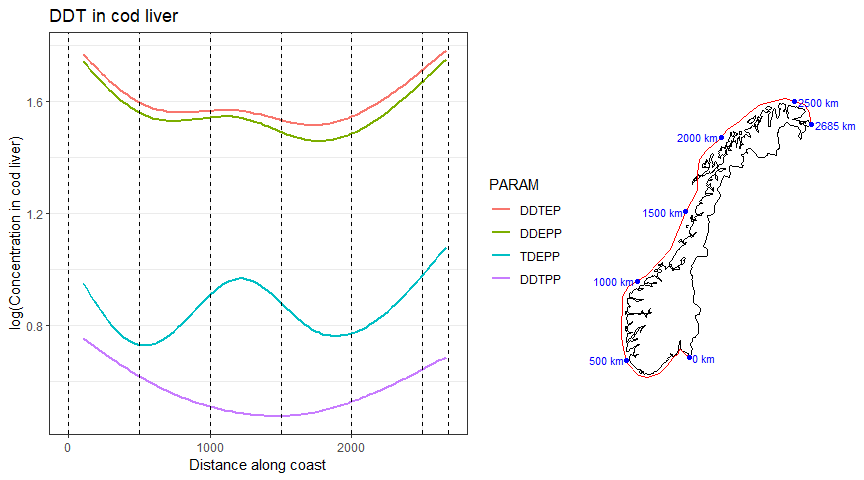
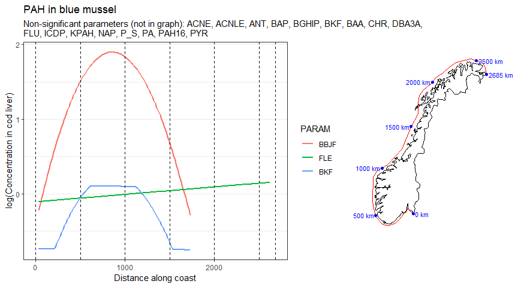
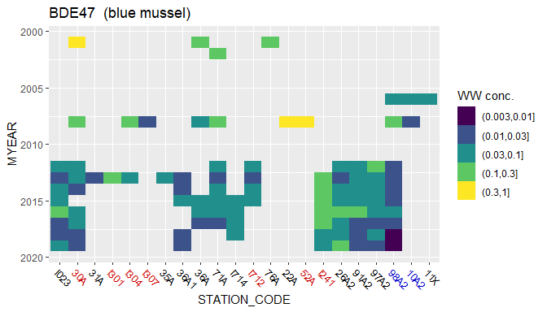
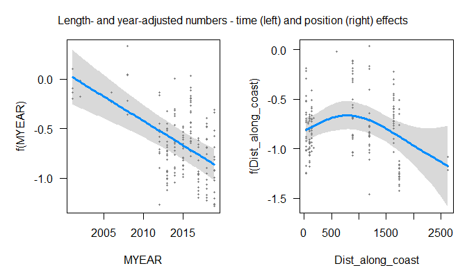
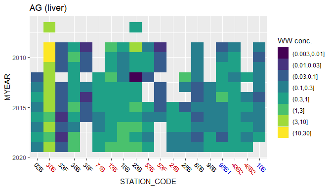

Script 122, based on script 120   


## 1. Libraries  

```r
library(rlang)

library(devtools)
library(lme4)
library(usethis)
library(dplyr)
library(tidyr)
library(purrr)
library(forcats)
library(ggplot2)
library(mgcv)
library(visreg)

# devtools::install_github("moodymudskipper/safejoin")
library(safejoin)

# devtools::install_github("lenz99-/lme4cens")
library(lme4cens)

# For SpatialPoints() function in part 2, used for map in part 8
library(sp)

# For combining plots
library(cowplot)

# For nicer tables
library(knitr)
library(kableExtra)

# For get_point_on_coastline()
# Used in part 8  
source("103_Distance_along_coast_functions.R")
source("121_Analysis_01_functions.R")
source("122_Analysis_01_plots_functions.R")
```


## 2. Data   

```r
#
# Note that we get stations from script 103  
#

# Data including trophic level
dat <- readRDS("Data/104_Selected_data.rds")
cat("Main data set has", nrow(dat), "number of records \n")
```

```
## Main data set has 350688 number of records
```

```r
# Extra isotope data
dat_isotopes <- readRDS("Input_data/87_df_isotopes.rds")

# Station metadata
df_stations <- readRDS("Data/103_Selected_stations.rds")


# xtabs(~STATION_CODE, df_stations ) %>% sort()
df_stations <- df_stations %>%
  mutate(MSTAT = case_when(
    STATION_CODE %in% "I969" ~ "RH",
    TRUE ~ MSTAT)) %>%
  group_by(STATION_CODE, MSTAT) %>%
  summarise_at(vars("Lat", "Lon", "Dist_along_coast"), mean)

check <- df_stations %>%
  group_by(STATION_CODE) %>%
  mutate(n = n()) %>%
  filter(n > 1)

if (nrow(check) > 0){
  cat("Some stations have >1 MSTAT codes - check 'check'! \n")
}
```
Adding   
* position data + MSTAT (type of station - industry-impacted, representative or background)   
* LOQ   
* mean trophic level per station    

```r
#
# Copied from script 121
#

# Median LOQ (per year and tissue only - should be the same for all stations)
dat_param_loq <- dat %>%
  filter(!is.na(FLAG1)) %>%
  group_by(PARAM, MYEAR, TISSUE_NAME) %>%
  summarise(LOQ = median(VALUE_WW), .groups = "drop")

dat2 <- dat %>%
  filter(!is.na(VALUE_WW)) %>%
  ungroup() %>%
  # Add position data + MSTAT (type of station - industry-impacted, representative or background)
  safe_left_join(df_stations %>% 
                   select(STATION_CODE, Lat, Lon, Dist_along_coast, MSTAT),
                 check = "CV",
                 by = "STATION_CODE",
                 na_matches = "never") %>%
  # Add LOQ
  safe_left_join(dat_param_loq,
                 check = "CV",
                 by = c("PARAM", "MYEAR", "TISSUE_NAME"),
                 na_matches = "never") %>%
  mutate(MSTAT = factor(MSTAT,  levels = c("IH", "RH", "B"))) %>%
  # Add mean trophic level per station
  group_by(STATION_CODE) %>%
  mutate(TL_mean = mean(TL, na.rm = TRUE)) %>%
  ungroup() %>%
  filter(!is.na(Dist_along_coast))

# dat2 <- dat
```
Make data set with non-impacted stations only    

```r
dat2_notimpacted <- dat2 %>%
  # Only difference from the next: using 'df_param_notimpacted' here:
  filter(!MSTAT %in% "IH") %>% 
  as.data.frame()
```


Load data for plotting maps    

```r
# From script 103 (without adaption)      

#
# Get Norway map data
#
test <- maps::map("world", "Norway", plot = FALSE)   # map data for Norway - this is just to get region names
sel <- grepl("Svalbard", test$names) | test$names == "Norway:Jan Mayen"  # select Svalbard + Jan Mayen
# test$names[!sel]
map <- maps::map("world", test$names[!sel], exact = TRUE, plot = FALSE)  # Norway w/o Svalbard + Jan Mayen
mapdata <- data.frame(Longitude = map$x, Latitude = map$y)

#
# Add UTM coordinates (x and y) to map
#
coordinate_exists <- !is.na(mapdata$Longitude)   # sp doesn't like NAs
SP <- sp::SpatialPoints(mapdata[coordinate_exists, c("Longitude", "Latitude")],
                    proj4string=CRS(crs_longlat)
)
SP.UTM <- sp::spTransform(SP, CRS(crs_utm))
# Add transformed coords to data set
mapdata$x[coordinate_exists] <- SP.UTM@coords[,1]
mapdata$y[coordinate_exists] <- SP.UTM@coords[,2]


#
# "Coast" data (coordinates for segments along the coast)
#
coast <- readRDS("Data/102_coast_coordinates.rmd")

#
# Make 'coastsegment_distance'   
#
# Distances for start points of the coast segments
segment_dx <- diff(coast$x)/1000
segment_dy <- diff(coast$y)/1000
coastsegment_distance <- sqrt(segment_dx^2 + segment_dy^2) %>% cumsum()
coastsegment_distance <- c(0, coastsegment_distance)
```

### MSTAT categorisation     
MSTAT categories:    
* IH = industry-impacted  
* RH = representative  
* B = background    
Tables shows number of years of data    

```r
dat2 %>%
  filter(grepl("B", STATION_CODE)) %>%
  distinct(STATION_CODE, MSTAT, MYEAR) %>%
  xtabs(~ STATION_CODE + MSTAT, .) %>%
  kbl(escape = FALSE) %>%
  kable_paper("basic", full_width = FALSE)
```

<table class=" lightable-paper" style='font-family: "Arial Narrow", arial, helvetica, sans-serif; width: auto !important; margin-left: auto; margin-right: auto;'>
 <thead>
  <tr>
   <th style="text-align:left;">   </th>
   <th style="text-align:right;"> IH </th>
   <th style="text-align:right;"> RH </th>
   <th style="text-align:right;"> B </th>
  </tr>
 </thead>
<tbody>
  <tr>
   <td style="text-align:left;"> 02B </td>
   <td style="text-align:right;"> 0 </td>
   <td style="text-align:right;"> 8 </td>
   <td style="text-align:right;"> 0 </td>
  </tr>
  <tr>
   <td style="text-align:left;"> 10B </td>
   <td style="text-align:right;"> 0 </td>
   <td style="text-align:right;"> 0 </td>
   <td style="text-align:right;"> 25 </td>
  </tr>
  <tr>
   <td style="text-align:left;"> 13B </td>
   <td style="text-align:right;"> 11 </td>
   <td style="text-align:right;"> 0 </td>
   <td style="text-align:right;"> 0 </td>
  </tr>
  <tr>
   <td style="text-align:left;"> 15B </td>
   <td style="text-align:right;"> 0 </td>
   <td style="text-align:right;"> 26 </td>
   <td style="text-align:right;"> 0 </td>
  </tr>
  <tr>
   <td style="text-align:left;"> 23B </td>
   <td style="text-align:right;"> 0 </td>
   <td style="text-align:right;"> 26 </td>
   <td style="text-align:right;"> 0 </td>
  </tr>
  <tr>
   <td style="text-align:left;"> 24B </td>
   <td style="text-align:right;"> 5 </td>
   <td style="text-align:right;"> 0 </td>
   <td style="text-align:right;"> 0 </td>
  </tr>
  <tr>
   <td style="text-align:left;"> 28B </td>
   <td style="text-align:right;"> 0 </td>
   <td style="text-align:right;"> 7 </td>
   <td style="text-align:right;"> 0 </td>
  </tr>
  <tr>
   <td style="text-align:left;"> 30B </td>
   <td style="text-align:right;"> 26 </td>
   <td style="text-align:right;"> 0 </td>
   <td style="text-align:right;"> 0 </td>
  </tr>
  <tr>
   <td style="text-align:left;"> 36B </td>
   <td style="text-align:right;"> 0 </td>
   <td style="text-align:right;"> 26 </td>
   <td style="text-align:right;"> 0 </td>
  </tr>
  <tr>
   <td style="text-align:left;"> 43B2 </td>
   <td style="text-align:right;"> 11 </td>
   <td style="text-align:right;"> 0 </td>
   <td style="text-align:right;"> 0 </td>
  </tr>
  <tr>
   <td style="text-align:left;"> 45B2 </td>
   <td style="text-align:right;"> 7 </td>
   <td style="text-align:right;"> 0 </td>
   <td style="text-align:right;"> 0 </td>
  </tr>
  <tr>
   <td style="text-align:left;"> 53B </td>
   <td style="text-align:right;"> 26 </td>
   <td style="text-align:right;"> 0 </td>
   <td style="text-align:right;"> 0 </td>
  </tr>
  <tr>
   <td style="text-align:left;"> 71B </td>
   <td style="text-align:right;"> 8 </td>
   <td style="text-align:right;"> 0 </td>
   <td style="text-align:right;"> 0 </td>
  </tr>
  <tr>
   <td style="text-align:left;"> 80B </td>
   <td style="text-align:right;"> 0 </td>
   <td style="text-align:right;"> 11 </td>
   <td style="text-align:right;"> 0 </td>
  </tr>
  <tr>
   <td style="text-align:left;"> 96B </td>
   <td style="text-align:right;"> 0 </td>
   <td style="text-align:right;"> 7 </td>
   <td style="text-align:right;"> 0 </td>
  </tr>
  <tr>
   <td style="text-align:left;"> 98B1 </td>
   <td style="text-align:right;"> 0 </td>
   <td style="text-align:right;"> 0 </td>
   <td style="text-align:right;"> 24 </td>
  </tr>
</tbody>
</table>

### Parameter groups  

```r
df_parameter_groups <- get_df_parameter_groups()

df_parameter_groups %>%
  count(Substance.Group) %>%
  kbl(caption = "Number of parameters per group", escape = FALSE) %>%
  kable_paper("basic", full_width = FALSE)
```

<table class=" lightable-paper" style='font-family: "Arial Narrow", arial, helvetica, sans-serif; width: auto !important; margin-left: auto; margin-right: auto;'>
<caption>Number of parameters per group</caption>
 <thead>
  <tr>
   <th style="text-align:left;"> Substance.Group </th>
   <th style="text-align:right;"> n </th>
  </tr>
 </thead>
<tbody>
  <tr>
   <td style="text-align:left;"> Metals and metalloids </td>
   <td style="text-align:right;"> 21 </td>
  </tr>
  <tr>
   <td style="text-align:left;"> Chlorobiphenyls </td>
   <td style="text-align:right;"> 38 </td>
  </tr>
  <tr>
   <td style="text-align:left;"> Polycyclic aromatic hydrocarbons (PAHs) </td>
   <td style="text-align:right;"> 54 </td>
  </tr>
  <tr>
   <td style="text-align:left;"> Organobromines </td>
   <td style="text-align:right;"> 40 </td>
  </tr>
  <tr>
   <td style="text-align:left;"> Organochlorines (general) </td>
   <td style="text-align:right;"> 17 </td>
  </tr>
  <tr>
   <td style="text-align:left;"> Organofluorines </td>
   <td style="text-align:right;"> 17 </td>
  </tr>
  <tr>
   <td style="text-align:left;"> Phosphorus flame retardant (PFR) </td>
   <td style="text-align:right;"> 14 </td>
  </tr>
  <tr>
   <td style="text-align:left;"> Phenols/chlorophenols </td>
   <td style="text-align:right;"> 5 </td>
  </tr>
  <tr>
   <td style="text-align:left;"> Bisphenols </td>
   <td style="text-align:right;"> 1 </td>
  </tr>
  <tr>
   <td style="text-align:left;"> Chlorinated paraffins </td>
   <td style="text-align:right;"> 5 </td>
  </tr>
  <tr>
   <td style="text-align:left;"> Dichloro-diphenyl-trichloroethane (DDTs) </td>
   <td style="text-align:right;"> 7 </td>
  </tr>
  <tr>
   <td style="text-align:left;"> Hexachlorocyclohexanes </td>
   <td style="text-align:right;"> 2 </td>
  </tr>
  <tr>
   <td style="text-align:left;"> Biological effects: molecular/biochemical/cellular/assays </td>
   <td style="text-align:right;"> 5 </td>
  </tr>
  <tr>
   <td style="text-align:left;"> Organic esters </td>
   <td style="text-align:right;"> 6 </td>
  </tr>
  <tr>
   <td style="text-align:left;"> Isotopes </td>
   <td style="text-align:right;"> 3 </td>
  </tr>
  <tr>
   <td style="text-align:left;"> Cyclodienes </td>
   <td style="text-align:right;"> 3 </td>
  </tr>
  <tr>
   <td style="text-align:left;"> Dioxins </td>
   <td style="text-align:right;"> 24 </td>
  </tr>
  <tr>
   <td style="text-align:left;"> Biomarkers </td>
   <td style="text-align:right;"> 2 </td>
  </tr>
  <tr>
   <td style="text-align:left;"> Phthalates </td>
   <td style="text-align:right;"> 10 </td>
  </tr>
  <tr>
   <td style="text-align:left;"> Organo-metallic compounds </td>
   <td style="text-align:right;"> 17 </td>
  </tr>
  <tr>
   <td style="text-align:left;"> Major inorganic constituents </td>
   <td style="text-align:right;"> 1 </td>
  </tr>
  <tr>
   <td style="text-align:left;"> Triazines </td>
   <td style="text-align:right;"> 1 </td>
  </tr>
  <tr>
   <td style="text-align:left;"> Siloxanes </td>
   <td style="text-align:right;"> 3 </td>
  </tr>
  <tr>
   <td style="text-align:left;"> Chlorinated flame retardants </td>
   <td style="text-align:right;"> 6 </td>
  </tr>
  <tr>
   <td style="text-align:left;"> Others </td>
   <td style="text-align:right;"> 30 </td>
  </tr>
</tbody>
</table>


## 3. Non-linear analyses (GAMM)     
Note:  
* These analyses were performed for all unimpacted stations    
* For concentrations under LOQ, we used random numbers between LOQ/2 and LOQ (3 replicates)  

```r
#o#o#o#o#o#o#o#o#o#o#o#o#o#o#o#o#o#o#o
# Load results from script 104  
#o#o#o#o#o#o#o#o#o#o#o#o#o#o#o#o#o#o#o

# Use the saved results
gamm_list <- readRDS("Data/121_gamm_list1.rds")
cat("Results for", length(gamm_list[[1]]), "parameters/tissues loaded")
```

```
## Results for 543 parameters/tissues loaded
```

```r
if (FALSE){
  str(gamm_list, 1)
  length(gamm_list[["result"]])
  str(gamm_list[["result"]][[1]], 1)
  str(gamm_list[["result"]][[1]]$plotvalues, 1)
  gamm_list[["result"]][[1]][["ttable"]]
  str(gamm_list[["error"]][[1]], 1)
}
```


### Check GAMM results  

Get analyses that didn't fail  

```r
cat("Number of regressions that worked (numbers / percentage): \n")
ok <- gamm_list[["error"]] %>% map_lgl(is.null)
sum(ok)
mean(ok)*100  # 0.96

# Save "ok" in data frame used to run analysis
# listno_replicate$Result_ok <- ok
```

```
## Number of regressions that worked (numbers / percentage): 
## [1] 522
## [1] 96.1326
```
Extract t-values and plot values (fitted lines)   

```r
#
# - t-values: ttable_gamm  
# - Also take the median fitted lines (across replicates): plotvalues_gamm_med     
# - Also add 'Substance.Group' for both    
#

# Extract the one-line t-tables and combine
ttable_gamm <- gamm_list[["result"]][ok] %>% 
  map_dfr(~.[["ttable"]]) %>%
  # Add substance group
  left_join(df_parameter_groups[c("Parameter.Code", "Substance.Group")],
            by = c("PARAM" = "Parameter.Code"))
cat("t and p values for", nrow(ttable_gamm), "parameters/stations \n")

# All numbers are character, set to numeric
vars <- c("Repl", 
          "Year_edf", "Position_esdf", "Year_F", 
          "Position_F", "Year_p", "Position_p")
for (var in vars)
  ttable_gamm[[var]] <- as.numeric(ttable_gamm[[var]])

# Extract the line fits for the "Positopn" effects  
plotvalues_gamm <- gamm_list[["result"]][ok] %>% 
  map_dfr(~.[["plotvalues"]])

# Median fitted lines (across replicates)
plotvalues_gamm_med <- plotvalues_gamm %>%
  group_by(PARAM, TISSUE_NAME, Dist_along_coast) %>%
    summarise_at(
    vars(visregFit, visregLwr, visregUpr),
    median) %>%
  # Add substance group
  left_join(df_parameter_groups[c("Parameter.Code", "Substance.Group")],
            by = c("PARAM" = "Parameter.Code"))


# Check 'plotvalues_gamm' and 'plotvalues_gamm_med' for 
#   a parameter with many <LOQ values (BAP)
if (FALSE){
plotvalues_gamm %>%
  filter(PARAM == "BAP") %>%
  # We cheat a bit to recreate how Repl should actually be (because of code error; now fixed):
  mutate(Repl = rep(1:3, each = 101)) %>%   # xtabs(~TISSUE_NAME + Repl, .) 
  ggplot(aes(Dist_along_coast, visregFit)) + 
  geom_path(aes(color = factor(Repl)), size = 2) +
  geom_path(
    data = plotvalues_gamm_med %>% filter(PARAM == "BAP"),
    aes(Dist_along_coast, visregFit),
    linetype = 2
  )
}
```


### p-values for the effect of 'distance along coast' on concentration         

```r
ttable_gamm %>%
  filter(TISSUE_NAME %in% "Lever") %>%
  mutate(
    `Effect of distance along coast` = ifelse(Position_p < 0.05, "P <= 0.05", "P > 0.05")
  ) %>%
  xtabs(~ addNA(Substance.Group) + `Effect of distance along coast`, .,
        drop.unused.levels = TRUE)
```

```
##                                           Effect of distance along coast
## addNA(Substance.Group)                     P <= 0.05 P > 0.05
##   Metals and metalloids                           22        8
##   Chlorobiphenyls                                 33        0
##   Organobromines                                  21       27
##   Organochlorines (general)                        9        0
##   Dichloro-diphenyl-trichloroethane (DDTs)        12        0
##   Hexachlorocyclohexanes                           6        0
##   Others                                           6        0
```

```r
if (FALSE){


  ttable_gamm %>%
    ggplot(aes(Position_p)) + geom_histogram()

  # fit's degrees of freedom > 1 means non-linear fit  
  ttable_gamm %>%
    ggplot(aes(Position_p, Position_esdf)) + geom_point()
  
  ttable_gamm %>%
    xtabs(~(Position_p < 0.05) + (Position_esdf > 1), .)
  
  ttable_gamm %>%
    xtabs(~ addNA(Substance.Group) + (Position_p < 0.05) + TISSUE_NAME, .)
  
}

# for checking
if (FALSE){
  ttable_gamm %>%
    filter(is.na(Substance.Group)) %>%
    xtabs(~PARAM, .) %>%
    names() %>%
    paste(collapse = ";")
}
```


## 4. Parameters with significant geographic effect (per group) {.tabset}   
Note: For unimpaced stations (RH and B stations)  
  
### Organobromines  

```r
plotgamm_group("Organobromines", report = FALSE)
```

<!-- -->


### Metals  

```r
plotgamm_group("Metals", minvalue = -2, report = FALSE)
```

<!-- -->


### Chlorobiphenyls     

```r
plotgamm_group("Chlorobiphenyls", minvalue = -1)
```

<!-- -->

### DDT  

```r
plotgamm_group("DDT", minvalue = -1)
```

<!-- -->


## 5. Examples {.tabset}   
* The "tile" plots show raw data (medians per station/year) for all stations  
* The two "model" plots show estimated effects for length- and fat-adjusted data for unimpacted stations   

### BDE47  

```r
# debugonce(plot_observations)
plot_observations("BDE47")  
```

<!-- --><!-- -->

```
## Significance of year and position effects:
```

```
##                          edf   Ref.df        F      p-value
## s(MYEAR)            1.000000 1.000000 43.29744 7.705064e-11
## s(Dist_along_coast) 3.934916 3.934916 14.94331 7.016166e-12
```
  
### BDE99  

```r
plot_observations("BDE99")  
```

<!-- --><!-- -->

```
## Significance of year and position effects:
```

```
##                          edf   Ref.df        F      p-value
## s(MYEAR)            2.580908 2.580908 11.86667 6.328335e-07
## s(Dist_along_coast) 3.855394 3.855394 11.45831 1.886763e-08
```
### ZN    

```r
plot_observations("ZN")  
```

<!-- --><!-- -->

```
## Significance of year and position effects:
```

```
##                          edf   Ref.df        F      p-value
## s(MYEAR)            2.969137 2.969137 39.69276 1.117276e-19
## s(Dist_along_coast) 6.096724 6.096724 23.24242 1.399531e-26
```
  
### AG    

```r
plot_observations("AG")  
```

<!-- --><!-- -->

```
## Significance of year and position effects:
```

```
##                          edf   Ref.df        F      p-value
## s(MYEAR)            2.135535 2.135535  9.00257 8.294595e-05
## s(Dist_along_coast) 5.515673 5.515673 15.09066 1.296643e-14
```
### CU    

```r
plot_observations("CU")  
```

<!-- --><!-- -->

```
## Significance of year and position effects:
```

```
##                          edf   Ref.df        F      p-value
## s(MYEAR)            2.896769 2.896769 28.28021 8.035314e-13
## s(Dist_along_coast) 6.528645 6.528645 20.40571 2.315497e-23
```
  
### HG  

```r
plot_observations("HG", "Muskel")  
```

<!-- --><!-- -->

```
## Significance of year and position effects:
```

```
##                          edf   Ref.df        F       p-value
## s(MYEAR)            2.842078 2.842078  79.8821  6.704772e-46
## s(Dist_along_coast) 6.817055 6.817055 210.2537 5.466276e-284
```
  
### Sum PCB    

```r
plot_observations("CB_S7")  
```

<!-- --><!-- -->

```
## Significance of year and position effects:
```

```
##                          edf   Ref.df        F       p-value
## s(MYEAR)            2.815251 2.815251 114.7805  2.188066e-58
## s(Dist_along_coast) 6.833737 6.833737 133.6941 2.375929e-180
```

### CB118      

```r
plot_observations("CB118")  
```

<!-- --><!-- -->

```
## Significance of year and position effects:
```

```
##                          edf   Ref.df        F       p-value
## s(MYEAR)            2.824784 2.824784 144.9694  2.399462e-74
## s(Dist_along_coast) 6.791362 6.791362 128.6562 6.146979e-172
```

### Pentaklorbenzen      

```r
plot_observations("QCB")  
```

<!-- --><!-- -->

```
## Significance of year and position effects:
```

```
##                          edf   Ref.df         F      p-value
## s(MYEAR)            2.920255 2.920255 132.40563 1.352472e-72
## s(Dist_along_coast) 1.000001 1.000001  25.52645 4.682021e-07
```

```r
dat %>% filter(grepl("QCB", PARAM))
```

```
## # A tibble: 6,594 x 25
##    MYEAR STATION_CODE LATIN_NAME TISSUE_NAME SAMPLE_NO2 PARAM FLAG1 DRYWT
##    <dbl> <chr>        <chr>      <chr>            <dbl> <chr> <chr> <dbl>
##  1  1996 10A2         Mytilus e~ Whole soft~          1 QCB   <      19  
##  2  1996 10A2         Mytilus e~ Whole soft~          2 QCB   <      20.4
##  3  1996 10A2         Mytilus e~ Whole soft~          3 QCB   <      20.5
##  4  1997 10A2         Mytilus e~ Whole soft~          1 QCB   <      17.4
##  5  1997 10A2         Mytilus e~ Whole soft~          2 QCB   <      16.2
##  6  1997 10A2         Mytilus e~ Whole soft~          3 QCB   <      16.1
##  7  1999 10A2         Mytilus e~ Whole soft~          1 QCB   <      17.2
##  8  1999 10A2         Mytilus e~ Whole soft~          2 QCB   <      18.6
##  9  1999 10A2         Mytilus e~ Whole soft~          3 QCB   <      17.6
## 10  2000 10A2         Mytilus e~ Whole soft~          1 QCB   <      17.9
## # ... with 6,584 more rows, and 17 more variables: FAT_PERC <dbl>, LNMEA <dbl>,
## #   UNIT <chr>, VALUE_WW <dbl>, VALUE_DW <dbl>, VALUE_FB <dbl>,
## #   VALUE_WWa <dbl>, VALUE_DWa <dbl>, VALUE_FBa <dbl>, UNCERTAINTY <dbl>,
## #   QUANTIFICATION_LIMIT <dbl>, Delta13C <dbl>, Delta15N <dbl>,
## #   Mussel_station <chr>, Delta13C_mussel <dbl>, Delta15N_mussel <dbl>,
## #   TL <dbl>
```

### DDEPP      

```r
# debugonce(plot_observations)
plot_observations("DDEPP")   
```

<!-- --><!-- -->

```
## Significance of year and position effects:
```

```
##                          edf   Ref.df         F      p-value
## s(MYEAR)            1.000001 1.000001 163.85578 1.492606e-36
## s(Dist_along_coast) 3.618176 3.618176  43.15985 5.100922e-31
```

### MCCP      

```r
plot_observations("MCCP")   
```

<!-- --><!-- -->

```
## Significance of year and position effects:
```

```
##                          edf   Ref.df         F      p-value
## s(MYEAR)            1.007037 1.007037 28.456930 1.418277e-07
## s(Dist_along_coast) 3.004425 3.004425  3.343845 1.747078e-02
```
### PFOS      

```r
plot_observations("PFOS")   
```

<!-- --><!-- -->

```
## Significance of year and position effects:
```

```
##                          edf   Ref.df        F      p-value
## s(MYEAR)            2.951796 2.951796 78.80519 3.365358e-38
## s(Dist_along_coast) 3.512482 3.512482 19.14448 7.481495e-12
```

### PFOSA      

```r
plot_observations("PFOSA")   
```

<!-- --><!-- -->

```
## Significance of year and position effects:
```

```
##                          edf   Ref.df        F      p-value
## s(MYEAR)            2.834983 2.834983 39.42512 5.288381e-19
## s(Dist_along_coast) 3.728715 3.728715 56.02690 1.644480e-39
```

### PFOSA      

```r
plot_observations("PFOSA")   
```

<!-- --><!-- -->

```
## Significance of year and position effects:
```

```
##                          edf   Ref.df        F      p-value
## s(MYEAR)            2.841118 2.841118 38.48279 2.029757e-18
## s(Dist_along_coast) 3.727141 3.727141 54.95186 9.296773e-39
```

### Toksafen Parlar 50       

```r
plot_observations("Toksafen Parlar 50")   
```

<!-- --><!-- -->

```
## Significance of year and position effects:
```

```
##                          edf   Ref.df        F      p-value
## s(Dist_along_coast) 3.286858 3.286858 45.17193 2.500276e-24
```

## 6. Linear results   
Different from the non-linear (GAMM) statistics by  
* Assumin a linear effect of distance along coast  
* Analysing length-adjusted concentrations (instead of raw wet-weight concentrations)   
* Picking either 


```r
result_list <- readRDS("Data/120_result_list_notimpacted.rds")
```


### Summary of results  


### Linear_results - store result as 'linear_results'   
*See combined table below for results*

```r
ok <- result_list[[2]] %>% map_lgl(is.null)
cat("Number of regressions that worked (numbers / fraction): \n")
sum(ok)
mean(ok)

# series_param_tissue$Result_nonimpact <- ok

linear_results <- result_list[[1]][ok] %>% 
  bind_rows() %>% 
  left_join(df_parameter_groups[c("Parameter.Code", "Substance.Group")],
            by = c("PARAM" = "Parameter.Code"),
            na_matches = "never") %>%
  select(Substance.Group, everything()) %>%
  arrange(Substance.Group)
```

```
## Number of regressions that worked (numbers / fraction): 
## [1] 318
## [1] 0.9408284
```


## 7. Combine linear + non-linear results in table  

Combine tables  

```r
# linear_results

tab1 <- linear_results %>%
  filter(TISSUE_NAME %in% "Lever" & !is.na(Position_est)) %>%
  select(PARAM, TISSUE_NAME, Position_est, Position_p) %>%
  group_by(PARAM, TISSUE_NAME) %>%
  summarise_all(list(min = min, mean = mean, median = median)) %>%
  ungroup() %>%
  mutate(Linear_effect = case_when(
    is.na(Position_est_mean) ~ "-",
    Position_est_mean < 0 ~ "Decreasing",
    Position_est_mean >= 0 ~ "Increasing"),
    Linear_p = case_when(
      is.na(Position_p_median) ~ "-",
      Position_p_median < 0.001 ~ "< 0.001",
      Position_p_median < 0.01 ~ round(Position_p_median, 3) %>% as.character(),
      Position_p_median <= 1 ~ round(Position_p_median, 2) %>% as.character())
    ) %>% 
  select(PARAM, TISSUE_NAME, Linear_effect, Linear_p)


# tab1


tab2 <- ttable_gamm %>%
  mutate(across(c(Year_edf, Position_esdf, Year_F, Position_F, Year_p, Position_p), as.numeric)) %>%
  group_by(PARAM, TISSUE_NAME) %>%
  summarise_at(vars(Position_esdf, Position_p), median) %>%
  mutate(Non_linear_df = round(Position_esdf, 2), 
    Non_linear_p = case_when(
      is.na(Position_p) ~ "-",
      Position_p < 0.001 ~ "< 0.001",
      Position_p < 0.01 ~ round(Position_p, 3) %>% as.character(),
      Position_p <= 1 ~ round(Position_p, 2) %>% as.character())
    ) %>% 
  select(PARAM, TISSUE_NAME, Non_linear_df, Non_linear_p)


# Combine:


tab_comb <- left_join(tab1, tab2, by = c("PARAM", "TISSUE_NAME")) %>%
    # Add substance group
  left_join(df_parameter_groups[c("Parameter.Code", "Substance.Group")],
            by = c("PARAM" = "Parameter.Code")) %>%
  select(Substance.Group, everything()) %>%
  arrange(Substance.Group, PARAM)

  
# cell_spec("makan", "html", color = "red")
```

Order variables  

```r
pars_pcb <- tab_comb %>% 
  filter(Substance.Group %in% "Chlorobiphenyls") %>%
  pull(PARAM) %>%
  sort_by_number() %>%
  move_to_back("CB")

pars_bde <- tab_comb$PARAM %>% grep("^BD", ., value = TRUE) %>%
  sort_by_number()

pars_hbcd <- tab_comb$PARAM %>% grep("HBCD", ., value = TRUE) %>%
  sort() %>%
  move_to_front("Sum HBCD")

pars_pfas <- tab_comb %>% 
  filter(Substance.Group %in% "Organofluorines") %>%
  pull(PARAM) %>% 
  move_to_front("PFAS$")  # since this is the sum  

# Show all, for check  
pars_pcb
pars_bde
pars_hbcd
pars_pfas

# Other parameters, in alphabetic order 
par_all <- tab_comb %>% pull(PARAM)
sel1 <- par_all %in% pars_pcb
sel2 <- par_all %in% pars_bde
sel3 <- par_all %in% pars_hbcd
sel4 <- par_all %in% pars_pfas
pars_other <- par_all[!(sel1 | sel2 | sel3 | sel4)]

# Correct order
par_levels <- c(pars_pcb, pars_bde, pars_hbcd, pars_pfas, pars_other)

# Check if some parameters occur more than once (they shouldn't!):
check <- table(par_levels)
if (sum(check > 1) > 0)
  check[check > 1]

# Set PARAM factor levels in correct order
tab_comb <- tab_comb %>%
  mutate(PARAM = factor(PARAM, levels = par_levels))
```


```r
cs_dt <- tab_comb

cs_dt$Linear_p = cell_spec(cs_dt$Linear_p, 
                           color = ifelse(cs_dt$Linear_p < 0.05, "red", "black"))

cs_dt$Non_linear_p = cell_spec(cs_dt$Non_linear_p, 
                               color = case_when(
                                 is.na(cs_dt$Non_linear_p) ~ "black",
                                 cs_dt$Non_linear_p <= 0.05 ~ "red",
                                 cs_dt$Non_linear_p > 0.05 ~ "black")
                               )


kbl(cs_dt, escape = F) %>%
  kable_paper("striped", full_width = F)
```

<table class=" lightable-paper lightable-striped" style='font-family: "Arial Narrow", arial, helvetica, sans-serif; width: auto !important; margin-left: auto; margin-right: auto;'>
 <thead>
  <tr>
   <th style="text-align:left;"> Substance.Group </th>
   <th style="text-align:left;"> PARAM </th>
   <th style="text-align:left;"> TISSUE_NAME </th>
   <th style="text-align:left;"> Linear_effect </th>
   <th style="text-align:left;"> Linear_p </th>
   <th style="text-align:right;"> Non_linear_df </th>
   <th style="text-align:left;"> Non_linear_p </th>
  </tr>
 </thead>
<tbody>
  <tr>
   <td style="text-align:left;"> Metals and metalloids </td>
   <td style="text-align:left;"> AG </td>
   <td style="text-align:left;"> Lever </td>
   <td style="text-align:left;"> Decreasing </td>
   <td style="text-align:left;"> <span style="     color: red !important;">0.007</span> </td>
   <td style="text-align:right;"> 5.51 </td>
   <td style="text-align:left;"> <span style="     color: red !important;">&lt; 0.001</span> </td>
  </tr>
  <tr>
   <td style="text-align:left;"> Metals and metalloids </td>
   <td style="text-align:left;"> AS </td>
   <td style="text-align:left;"> Lever </td>
   <td style="text-align:left;"> Decreasing </td>
   <td style="text-align:left;"> <span style="     color: black !important;">0.19</span> </td>
   <td style="text-align:right;"> 4.94 </td>
   <td style="text-align:left;"> <span style="     color: red !important;">&lt; 0.001</span> </td>
  </tr>
  <tr>
   <td style="text-align:left;"> Metals and metalloids </td>
   <td style="text-align:left;"> CD </td>
   <td style="text-align:left;"> Lever </td>
   <td style="text-align:left;"> Increasing </td>
   <td style="text-align:left;"> <span style="     color: red !important;">&lt; 0.001</span> </td>
   <td style="text-align:right;"> 4.00 </td>
   <td style="text-align:left;"> <span style="     color: red !important;">&lt; 0.001</span> </td>
  </tr>
  <tr>
   <td style="text-align:left;"> Metals and metalloids </td>
   <td style="text-align:left;"> CO </td>
   <td style="text-align:left;"> Lever </td>
   <td style="text-align:left;"> Decreasing </td>
   <td style="text-align:left;"> <span style="     color: red !important;">&lt; 0.001</span> </td>
   <td style="text-align:right;"> 6.51 </td>
   <td style="text-align:left;"> <span style="     color: red !important;">&lt; 0.001</span> </td>
  </tr>
  <tr>
   <td style="text-align:left;"> Metals and metalloids </td>
   <td style="text-align:left;"> CR </td>
   <td style="text-align:left;"> Lever </td>
   <td style="text-align:left;"> Decreasing </td>
   <td style="text-align:left;"> <span style="     color: black !important;">0.29</span> </td>
   <td style="text-align:right;"> 1.36 </td>
   <td style="text-align:left;"> <span style="     color: black !important;">0.29</span> </td>
  </tr>
  <tr>
   <td style="text-align:left;"> Metals and metalloids </td>
   <td style="text-align:left;"> CU </td>
   <td style="text-align:left;"> Lever </td>
   <td style="text-align:left;"> Decreasing </td>
   <td style="text-align:left;"> <span style="     color: red !important;">&lt; 0.001</span> </td>
   <td style="text-align:right;"> 6.53 </td>
   <td style="text-align:left;"> <span style="     color: red !important;">&lt; 0.001</span> </td>
  </tr>
  <tr>
   <td style="text-align:left;"> Metals and metalloids </td>
   <td style="text-align:left;"> NI </td>
   <td style="text-align:left;"> Lever </td>
   <td style="text-align:left;"> Increasing </td>
   <td style="text-align:left;"> <span style="     color: black !important;">0.9</span> </td>
   <td style="text-align:right;"> 3.19 </td>
   <td style="text-align:left;"> <span style="     color: red !important;">&lt; 0.001</span> </td>
  </tr>
  <tr>
   <td style="text-align:left;"> Metals and metalloids </td>
   <td style="text-align:left;"> PB </td>
   <td style="text-align:left;"> Lever </td>
   <td style="text-align:left;"> Decreasing </td>
   <td style="text-align:left;"> <span style="     color: black !important;">0.86</span> </td>
   <td style="text-align:right;"> 1.00 </td>
   <td style="text-align:left;"> <span style="     color: black !important;">0.11</span> </td>
  </tr>
  <tr>
   <td style="text-align:left;"> Metals and metalloids </td>
   <td style="text-align:left;"> SN </td>
   <td style="text-align:left;"> Lever </td>
   <td style="text-align:left;"> Increasing </td>
   <td style="text-align:left;"> <span style="     color: black !important;">0.61</span> </td>
   <td style="text-align:right;"> 1.00 </td>
   <td style="text-align:left;"> <span style="     color: black !important;">0.4</span> </td>
  </tr>
  <tr>
   <td style="text-align:left;"> Metals and metalloids </td>
   <td style="text-align:left;"> ZN </td>
   <td style="text-align:left;"> Lever </td>
   <td style="text-align:left;"> Decreasing </td>
   <td style="text-align:left;"> <span style="     color: red !important;">&lt; 0.001</span> </td>
   <td style="text-align:right;"> 6.10 </td>
   <td style="text-align:left;"> <span style="     color: red !important;">&lt; 0.001</span> </td>
  </tr>
  <tr>
   <td style="text-align:left;"> Chlorobiphenyls </td>
   <td style="text-align:left;"> CB_S7 </td>
   <td style="text-align:left;"> Lever </td>
   <td style="text-align:left;"> Decreasing </td>
   <td style="text-align:left;"> <span style="     color: red !important;">&lt; 0.001</span> </td>
   <td style="text-align:right;"> 6.83 </td>
   <td style="text-align:left;"> <span style="     color: red !important;">&lt; 0.001</span> </td>
  </tr>
  <tr>
   <td style="text-align:left;"> Chlorobiphenyls </td>
   <td style="text-align:left;"> CB101 </td>
   <td style="text-align:left;"> Lever </td>
   <td style="text-align:left;"> Decreasing </td>
   <td style="text-align:left;"> <span style="     color: red !important;">0.01</span> </td>
   <td style="text-align:right;"> 6.79 </td>
   <td style="text-align:left;"> <span style="     color: red !important;">&lt; 0.001</span> </td>
  </tr>
  <tr>
   <td style="text-align:left;"> Chlorobiphenyls </td>
   <td style="text-align:left;"> CB105 </td>
   <td style="text-align:left;"> Lever </td>
   <td style="text-align:left;"> Decreasing </td>
   <td style="text-align:left;"> <span style="     color: red !important;">&lt; 0.001</span> </td>
   <td style="text-align:right;"> 6.49 </td>
   <td style="text-align:left;"> <span style="     color: red !important;">&lt; 0.001</span> </td>
  </tr>
  <tr>
   <td style="text-align:left;"> Chlorobiphenyls </td>
   <td style="text-align:left;"> CB114 </td>
   <td style="text-align:left;"> Lever </td>
   <td style="text-align:left;"> Decreasing </td>
   <td style="text-align:left;"> <span style="     color: red !important;">0.004</span> </td>
   <td style="text-align:right;"> NA </td>
   <td style="text-align:left;"> <span style="     color: black !important;">NA</span> </td>
  </tr>
  <tr>
   <td style="text-align:left;"> Chlorobiphenyls </td>
   <td style="text-align:left;"> CB118 </td>
   <td style="text-align:left;"> Lever </td>
   <td style="text-align:left;"> Decreasing </td>
   <td style="text-align:left;"> <span style="     color: red !important;">&lt; 0.001</span> </td>
   <td style="text-align:right;"> 6.79 </td>
   <td style="text-align:left;"> <span style="     color: red !important;">&lt; 0.001</span> </td>
  </tr>
  <tr>
   <td style="text-align:left;"> Chlorobiphenyls </td>
   <td style="text-align:left;"> CB123 </td>
   <td style="text-align:left;"> Lever </td>
   <td style="text-align:left;"> Decreasing </td>
   <td style="text-align:left;"> <span style="     color: black !important;">0.05</span> </td>
   <td style="text-align:right;"> NA </td>
   <td style="text-align:left;"> <span style="     color: black !important;">NA</span> </td>
  </tr>
  <tr>
   <td style="text-align:left;"> Chlorobiphenyls </td>
   <td style="text-align:left;"> CB126 </td>
   <td style="text-align:left;"> Lever </td>
   <td style="text-align:left;"> Decreasing </td>
   <td style="text-align:left;"> <span style="     color: black !important;">0.24</span> </td>
   <td style="text-align:right;"> NA </td>
   <td style="text-align:left;"> <span style="     color: black !important;">NA</span> </td>
  </tr>
  <tr>
   <td style="text-align:left;"> Chlorobiphenyls </td>
   <td style="text-align:left;"> CB138 </td>
   <td style="text-align:left;"> Lever </td>
   <td style="text-align:left;"> Decreasing </td>
   <td style="text-align:left;"> <span style="     color: red !important;">&lt; 0.001</span> </td>
   <td style="text-align:right;"> 6.82 </td>
   <td style="text-align:left;"> <span style="     color: red !important;">&lt; 0.001</span> </td>
  </tr>
  <tr>
   <td style="text-align:left;"> Chlorobiphenyls </td>
   <td style="text-align:left;"> CB153 </td>
   <td style="text-align:left;"> Lever </td>
   <td style="text-align:left;"> Decreasing </td>
   <td style="text-align:left;"> <span style="     color: red !important;">&lt; 0.001</span> </td>
   <td style="text-align:right;"> 6.78 </td>
   <td style="text-align:left;"> <span style="     color: red !important;">&lt; 0.001</span> </td>
  </tr>
  <tr>
   <td style="text-align:left;"> Chlorobiphenyls </td>
   <td style="text-align:left;"> CB156 </td>
   <td style="text-align:left;"> Lever </td>
   <td style="text-align:left;"> Decreasing </td>
   <td style="text-align:left;"> <span style="     color: red !important;">&lt; 0.001</span> </td>
   <td style="text-align:right;"> 6.56 </td>
   <td style="text-align:left;"> <span style="     color: red !important;">&lt; 0.001</span> </td>
  </tr>
  <tr>
   <td style="text-align:left;"> Chlorobiphenyls </td>
   <td style="text-align:left;"> CB157 </td>
   <td style="text-align:left;"> Lever </td>
   <td style="text-align:left;"> Decreasing </td>
   <td style="text-align:left;"> <span style="     color: red !important;">0.01</span> </td>
   <td style="text-align:right;"> NA </td>
   <td style="text-align:left;"> <span style="     color: black !important;">NA</span> </td>
  </tr>
  <tr>
   <td style="text-align:left;"> Chlorobiphenyls </td>
   <td style="text-align:left;"> CB167 </td>
   <td style="text-align:left;"> Lever </td>
   <td style="text-align:left;"> Decreasing </td>
   <td style="text-align:left;"> <span style="     color: red !important;">0.008</span> </td>
   <td style="text-align:right;"> NA </td>
   <td style="text-align:left;"> <span style="     color: black !important;">NA</span> </td>
  </tr>
  <tr>
   <td style="text-align:left;"> Chlorobiphenyls </td>
   <td style="text-align:left;"> CB169 </td>
   <td style="text-align:left;"> Lever </td>
   <td style="text-align:left;"> Decreasing </td>
   <td style="text-align:left;"> <span style="     color: black !important;">0.09</span> </td>
   <td style="text-align:right;"> NA </td>
   <td style="text-align:left;"> <span style="     color: black !important;">NA</span> </td>
  </tr>
  <tr>
   <td style="text-align:left;"> Chlorobiphenyls </td>
   <td style="text-align:left;"> CB180 </td>
   <td style="text-align:left;"> Lever </td>
   <td style="text-align:left;"> Decreasing </td>
   <td style="text-align:left;"> <span style="     color: red !important;">&lt; 0.001</span> </td>
   <td style="text-align:right;"> 6.86 </td>
   <td style="text-align:left;"> <span style="     color: red !important;">&lt; 0.001</span> </td>
  </tr>
  <tr>
   <td style="text-align:left;"> Chlorobiphenyls </td>
   <td style="text-align:left;"> CB189 </td>
   <td style="text-align:left;"> Lever </td>
   <td style="text-align:left;"> Decreasing </td>
   <td style="text-align:left;"> <span style="     color: red !important;">0.002</span> </td>
   <td style="text-align:right;"> NA </td>
   <td style="text-align:left;"> <span style="     color: black !important;">NA</span> </td>
  </tr>
  <tr>
   <td style="text-align:left;"> Chlorobiphenyls </td>
   <td style="text-align:left;"> CB209 </td>
   <td style="text-align:left;"> Lever </td>
   <td style="text-align:left;"> Decreasing </td>
   <td style="text-align:left;"> <span style="     color: red !important;">&lt; 0.001</span> </td>
   <td style="text-align:right;"> 1.00 </td>
   <td style="text-align:left;"> <span style="     color: red !important;">&lt; 0.001</span> </td>
  </tr>
  <tr>
   <td style="text-align:left;"> Chlorobiphenyls </td>
   <td style="text-align:left;"> CB28 </td>
   <td style="text-align:left;"> Lever </td>
   <td style="text-align:left;"> Decreasing </td>
   <td style="text-align:left;"> <span style="     color: red !important;">&lt; 0.001</span> </td>
   <td style="text-align:right;"> 6.78 </td>
   <td style="text-align:left;"> <span style="     color: red !important;">&lt; 0.001</span> </td>
  </tr>
  <tr>
   <td style="text-align:left;"> Chlorobiphenyls </td>
   <td style="text-align:left;"> CB52 </td>
   <td style="text-align:left;"> Lever </td>
   <td style="text-align:left;"> Decreasing </td>
   <td style="text-align:left;"> <span style="     color: red !important;">&lt; 0.001</span> </td>
   <td style="text-align:right;"> 6.84 </td>
   <td style="text-align:left;"> <span style="     color: red !important;">&lt; 0.001</span> </td>
  </tr>
  <tr>
   <td style="text-align:left;"> Chlorobiphenyls </td>
   <td style="text-align:left;"> CB77 </td>
   <td style="text-align:left;"> Lever </td>
   <td style="text-align:left;"> Decreasing </td>
   <td style="text-align:left;"> <span style="     color: red !important;">&lt; 0.001</span> </td>
   <td style="text-align:right;"> NA </td>
   <td style="text-align:left;"> <span style="     color: black !important;">NA</span> </td>
  </tr>
  <tr>
   <td style="text-align:left;"> Chlorobiphenyls </td>
   <td style="text-align:left;"> CB81 </td>
   <td style="text-align:left;"> Lever </td>
   <td style="text-align:left;"> Decreasing </td>
   <td style="text-align:left;"> <span style="     color: red !important;">0.003</span> </td>
   <td style="text-align:right;"> NA </td>
   <td style="text-align:left;"> <span style="     color: black !important;">NA</span> </td>
  </tr>
  <tr>
   <td style="text-align:left;"> Chlorobiphenyls </td>
   <td style="text-align:left;"> Pentaklorbenzen (QCB) </td>
   <td style="text-align:left;"> Lever </td>
   <td style="text-align:left;"> Increasing </td>
   <td style="text-align:left;"> <span style="     color: red !important;">&lt; 0.001</span> </td>
   <td style="text-align:right;"> NA </td>
   <td style="text-align:left;"> <span style="     color: black !important;">NA</span> </td>
  </tr>
  <tr>
   <td style="text-align:left;"> Organobromines </td>
   <td style="text-align:left;"> BDE100 </td>
   <td style="text-align:left;"> Lever </td>
   <td style="text-align:left;"> Decreasing </td>
   <td style="text-align:left;"> <span style="     color: red !important;">0.01</span> </td>
   <td style="text-align:right;"> 3.90 </td>
   <td style="text-align:left;"> <span style="     color: red !important;">&lt; 0.001</span> </td>
  </tr>
  <tr>
   <td style="text-align:left;"> Organobromines </td>
   <td style="text-align:left;"> BDE119 </td>
   <td style="text-align:left;"> Lever </td>
   <td style="text-align:left;"> Increasing </td>
   <td style="text-align:left;"> <span style="     color: black !important;">0.07</span> </td>
   <td style="text-align:right;"> 1.00 </td>
   <td style="text-align:left;"> <span style="     color: black !important;">0.15</span> </td>
  </tr>
  <tr>
   <td style="text-align:left;"> Organobromines </td>
   <td style="text-align:left;"> BDE126 </td>
   <td style="text-align:left;"> Lever </td>
   <td style="text-align:left;"> Decreasing </td>
   <td style="text-align:left;"> <span style="     color: black !important;">0.7</span> </td>
   <td style="text-align:right;"> NA </td>
   <td style="text-align:left;"> <span style="     color: black !important;">NA</span> </td>
  </tr>
  <tr>
   <td style="text-align:left;"> Organobromines </td>
   <td style="text-align:left;"> BDE138 </td>
   <td style="text-align:left;"> Lever </td>
   <td style="text-align:left;"> Decreasing </td>
   <td style="text-align:left;"> <span style="     color: black !important;">0.12</span> </td>
   <td style="text-align:right;"> 1.00 </td>
   <td style="text-align:left;"> <span style="     color: black !important;">0.72</span> </td>
  </tr>
  <tr>
   <td style="text-align:left;"> Organobromines </td>
   <td style="text-align:left;"> BDE153 </td>
   <td style="text-align:left;"> Lever </td>
   <td style="text-align:left;"> Decreasing </td>
   <td style="text-align:left;"> <span style="     color: red !important;">0.02</span> </td>
   <td style="text-align:right;"> 1.00 </td>
   <td style="text-align:left;"> <span style="     color: black !important;">0.11</span> </td>
  </tr>
  <tr>
   <td style="text-align:left;"> Organobromines </td>
   <td style="text-align:left;"> BDE154 </td>
   <td style="text-align:left;"> Lever </td>
   <td style="text-align:left;"> Decreasing </td>
   <td style="text-align:left;"> <span style="     color: black !important;">0.09</span> </td>
   <td style="text-align:right;"> 3.70 </td>
   <td style="text-align:left;"> <span style="     color: red !important;">&lt; 0.001</span> </td>
  </tr>
  <tr>
   <td style="text-align:left;"> Organobromines </td>
   <td style="text-align:left;"> BDE156 </td>
   <td style="text-align:left;"> Lever </td>
   <td style="text-align:left;"> Decreasing </td>
   <td style="text-align:left;"> <span style="     color: black !important;">0.37</span> </td>
   <td style="text-align:right;"> NA </td>
   <td style="text-align:left;"> <span style="     color: black !important;">NA</span> </td>
  </tr>
  <tr>
   <td style="text-align:left;"> Organobromines </td>
   <td style="text-align:left;"> BDE17 </td>
   <td style="text-align:left;"> Lever </td>
   <td style="text-align:left;"> Increasing </td>
   <td style="text-align:left;"> <span style="     color: red !important;">0.002</span> </td>
   <td style="text-align:right;"> NA </td>
   <td style="text-align:left;"> <span style="     color: black !important;">NA</span> </td>
  </tr>
  <tr>
   <td style="text-align:left;"> Organobromines </td>
   <td style="text-align:left;"> BDE183 </td>
   <td style="text-align:left;"> Lever </td>
   <td style="text-align:left;"> Decreasing </td>
   <td style="text-align:left;"> <span style="     color: black !important;">0.64</span> </td>
   <td style="text-align:right;"> 1.00 </td>
   <td style="text-align:left;"> <span style="     color: black !important;">0.54</span> </td>
  </tr>
  <tr>
   <td style="text-align:left;"> Organobromines </td>
   <td style="text-align:left;"> BDE184 </td>
   <td style="text-align:left;"> Lever </td>
   <td style="text-align:left;"> Increasing </td>
   <td style="text-align:left;"> <span style="     color: red !important;">0.03</span> </td>
   <td style="text-align:right;"> NA </td>
   <td style="text-align:left;"> <span style="     color: black !important;">NA</span> </td>
  </tr>
  <tr>
   <td style="text-align:left;"> Organobromines </td>
   <td style="text-align:left;"> BDE191 </td>
   <td style="text-align:left;"> Lever </td>
   <td style="text-align:left;"> Increasing </td>
   <td style="text-align:left;"> <span style="     color: black !important;">0.54</span> </td>
   <td style="text-align:right;"> NA </td>
   <td style="text-align:left;"> <span style="     color: black !important;">NA</span> </td>
  </tr>
  <tr>
   <td style="text-align:left;"> Organobromines </td>
   <td style="text-align:left;"> BDE196 </td>
   <td style="text-align:left;"> Lever </td>
   <td style="text-align:left;"> Decreasing </td>
   <td style="text-align:left;"> <span style="     color: black !important;">0.87</span> </td>
   <td style="text-align:right;"> NA </td>
   <td style="text-align:left;"> <span style="     color: black !important;">NA</span> </td>
  </tr>
  <tr>
   <td style="text-align:left;"> Organobromines </td>
   <td style="text-align:left;"> BDE197 </td>
   <td style="text-align:left;"> Lever </td>
   <td style="text-align:left;"> Increasing </td>
   <td style="text-align:left;"> <span style="     color: black !important;">0.25</span> </td>
   <td style="text-align:right;"> NA </td>
   <td style="text-align:left;"> <span style="     color: black !important;">NA</span> </td>
  </tr>
  <tr>
   <td style="text-align:left;"> Organobromines </td>
   <td style="text-align:left;"> BDE206 </td>
   <td style="text-align:left;"> Lever </td>
   <td style="text-align:left;"> Increasing </td>
   <td style="text-align:left;"> <span style="     color: black !important;">0.56</span> </td>
   <td style="text-align:right;"> NA </td>
   <td style="text-align:left;"> <span style="     color: black !important;">NA</span> </td>
  </tr>
  <tr>
   <td style="text-align:left;"> Organobromines </td>
   <td style="text-align:left;"> BDE207 </td>
   <td style="text-align:left;"> Lever </td>
   <td style="text-align:left;"> Increasing </td>
   <td style="text-align:left;"> <span style="     color: black !important;">0.41</span> </td>
   <td style="text-align:right;"> NA </td>
   <td style="text-align:left;"> <span style="     color: black !important;">NA</span> </td>
  </tr>
  <tr>
   <td style="text-align:left;"> Organobromines </td>
   <td style="text-align:left;"> BDE209 </td>
   <td style="text-align:left;"> Lever </td>
   <td style="text-align:left;"> Decreasing </td>
   <td style="text-align:left;"> <span style="     color: black !important;">0.37</span> </td>
   <td style="text-align:right;"> NA </td>
   <td style="text-align:left;"> <span style="     color: black !important;">NA</span> </td>
  </tr>
  <tr>
   <td style="text-align:left;"> Organobromines </td>
   <td style="text-align:left;"> BDE28 </td>
   <td style="text-align:left;"> Lever </td>
   <td style="text-align:left;"> Decreasing </td>
   <td style="text-align:left;"> <span style="     color: black !important;">0.89</span> </td>
   <td style="text-align:right;"> 3.73 </td>
   <td style="text-align:left;"> <span style="     color: red !important;">0.005</span> </td>
  </tr>
  <tr>
   <td style="text-align:left;"> Organobromines </td>
   <td style="text-align:left;"> BDE47 </td>
   <td style="text-align:left;"> Lever </td>
   <td style="text-align:left;"> Decreasing </td>
   <td style="text-align:left;"> <span style="     color: black !important;">0.08</span> </td>
   <td style="text-align:right;"> 3.94 </td>
   <td style="text-align:left;"> <span style="     color: red !important;">&lt; 0.001</span> </td>
  </tr>
  <tr>
   <td style="text-align:left;"> Organobromines </td>
   <td style="text-align:left;"> BDE49 </td>
   <td style="text-align:left;"> Lever </td>
   <td style="text-align:left;"> Decreasing </td>
   <td style="text-align:left;"> <span style="     color: black !important;">0.87</span> </td>
   <td style="text-align:right;"> 1.00 </td>
   <td style="text-align:left;"> <span style="     color: black !important;">0.83</span> </td>
  </tr>
  <tr>
   <td style="text-align:left;"> Organobromines </td>
   <td style="text-align:left;"> BDE66 </td>
   <td style="text-align:left;"> Lever </td>
   <td style="text-align:left;"> Decreasing </td>
   <td style="text-align:left;"> <span style="     color: black !important;">0.16</span> </td>
   <td style="text-align:right;"> 1.00 </td>
   <td style="text-align:left;"> <span style="     color: black !important;">0.23</span> </td>
  </tr>
  <tr>
   <td style="text-align:left;"> Organobromines </td>
   <td style="text-align:left;"> BDE6S </td>
   <td style="text-align:left;"> Lever </td>
   <td style="text-align:left;"> Decreasing </td>
   <td style="text-align:left;"> <span style="     color: red !important;">0.04</span> </td>
   <td style="text-align:right;"> 3.94 </td>
   <td style="text-align:left;"> <span style="     color: red !important;">&lt; 0.001</span> </td>
  </tr>
  <tr>
   <td style="text-align:left;"> Organobromines </td>
   <td style="text-align:left;"> BDE71 </td>
   <td style="text-align:left;"> Lever </td>
   <td style="text-align:left;"> Decreasing </td>
   <td style="text-align:left;"> <span style="     color: red !important;">0.01</span> </td>
   <td style="text-align:right;"> 1.00 </td>
   <td style="text-align:left;"> <span style="     color: black !important;">0.21</span> </td>
  </tr>
  <tr>
   <td style="text-align:left;"> Organobromines </td>
   <td style="text-align:left;"> BDE77 </td>
   <td style="text-align:left;"> Lever </td>
   <td style="text-align:left;"> Decreasing </td>
   <td style="text-align:left;"> <span style="     color: red !important;">0.01</span> </td>
   <td style="text-align:right;"> 1.00 </td>
   <td style="text-align:left;"> <span style="     color: black !important;">0.98</span> </td>
  </tr>
  <tr>
   <td style="text-align:left;"> Organobromines </td>
   <td style="text-align:left;"> BDE85 </td>
   <td style="text-align:left;"> Lever </td>
   <td style="text-align:left;"> Decreasing </td>
   <td style="text-align:left;"> <span style="     color: black !important;">0.08</span> </td>
   <td style="text-align:right;"> 1.00 </td>
   <td style="text-align:left;"> <span style="     color: black !important;">0.51</span> </td>
  </tr>
  <tr>
   <td style="text-align:left;"> Organobromines </td>
   <td style="text-align:left;"> BDE99 </td>
   <td style="text-align:left;"> Lever </td>
   <td style="text-align:left;"> Increasing </td>
   <td style="text-align:left;"> <span style="     color: black !important;">0.28</span> </td>
   <td style="text-align:right;"> 3.85 </td>
   <td style="text-align:left;"> <span style="     color: red !important;">&lt; 0.001</span> </td>
  </tr>
  <tr>
   <td style="text-align:left;"> Organobromines </td>
   <td style="text-align:left;"> BDESS </td>
   <td style="text-align:left;"> Lever </td>
   <td style="text-align:left;"> Decreasing </td>
   <td style="text-align:left;"> <span style="     color: black !important;">0.11</span> </td>
   <td style="text-align:right;"> 3.91 </td>
   <td style="text-align:left;"> <span style="     color: red !important;">&lt; 0.001</span> </td>
  </tr>
  <tr>
   <td style="text-align:left;"> Organobromines </td>
   <td style="text-align:left;"> HBCDA </td>
   <td style="text-align:left;"> Lever </td>
   <td style="text-align:left;"> Increasing </td>
   <td style="text-align:left;"> <span style="     color: black !important;">0.05</span> </td>
   <td style="text-align:right;"> NA </td>
   <td style="text-align:left;"> <span style="     color: black !important;">NA</span> </td>
  </tr>
  <tr>
   <td style="text-align:left;"> Organobromines </td>
   <td style="text-align:left;"> HBCDB </td>
   <td style="text-align:left;"> Lever </td>
   <td style="text-align:left;"> Decreasing </td>
   <td style="text-align:left;"> <span style="     color: black !important;">0.14</span> </td>
   <td style="text-align:right;"> NA </td>
   <td style="text-align:left;"> <span style="     color: black !important;">NA</span> </td>
  </tr>
  <tr>
   <td style="text-align:left;"> Organobromines </td>
   <td style="text-align:left;"> HBCDD </td>
   <td style="text-align:left;"> Lever </td>
   <td style="text-align:left;"> Increasing </td>
   <td style="text-align:left;"> <span style="     color: black !important;">0.09</span> </td>
   <td style="text-align:right;"> NA </td>
   <td style="text-align:left;"> <span style="     color: black !important;">NA</span> </td>
  </tr>
  <tr>
   <td style="text-align:left;"> Organobromines </td>
   <td style="text-align:left;"> HBCDG </td>
   <td style="text-align:left;"> Lever </td>
   <td style="text-align:left;"> Decreasing </td>
   <td style="text-align:left;"> <span style="     color: black !important;">0.27</span> </td>
   <td style="text-align:right;"> NA </td>
   <td style="text-align:left;"> <span style="     color: black !important;">NA</span> </td>
  </tr>
  <tr>
   <td style="text-align:left;"> Organobromines </td>
   <td style="text-align:left;"> Sum HBCD </td>
   <td style="text-align:left;"> Lever </td>
   <td style="text-align:left;"> Increasing </td>
   <td style="text-align:left;"> <span style="     color: red !important;">0.008</span> </td>
   <td style="text-align:right;"> NA </td>
   <td style="text-align:left;"> <span style="     color: black !important;">NA</span> </td>
  </tr>
  <tr>
   <td style="text-align:left;"> Organochlorines (general) </td>
   <td style="text-align:left;"> Aldrin </td>
   <td style="text-align:left;"> Lever </td>
   <td style="text-align:left;"> Increasing </td>
   <td style="text-align:left;"> <span style="     color: black !important;">0.76</span> </td>
   <td style="text-align:right;"> NA </td>
   <td style="text-align:left;"> <span style="     color: black !important;">NA</span> </td>
  </tr>
  <tr>
   <td style="text-align:left;"> Organochlorines (general) </td>
   <td style="text-align:left;"> alfa-Klordan (cis) </td>
   <td style="text-align:left;"> Lever </td>
   <td style="text-align:left;"> Increasing </td>
   <td style="text-align:left;"> <span style="     color: red !important;">&lt; 0.001</span> </td>
   <td style="text-align:right;"> NA </td>
   <td style="text-align:left;"> <span style="     color: black !important;">NA</span> </td>
  </tr>
  <tr>
   <td style="text-align:left;"> Organochlorines (general) </td>
   <td style="text-align:left;"> Dieldrin </td>
   <td style="text-align:left;"> Lever </td>
   <td style="text-align:left;"> Increasing </td>
   <td style="text-align:left;"> <span style="     color: red !important;">&lt; 0.001</span> </td>
   <td style="text-align:right;"> NA </td>
   <td style="text-align:left;"> <span style="     color: black !important;">NA</span> </td>
  </tr>
  <tr>
   <td style="text-align:left;"> Organochlorines (general) </td>
   <td style="text-align:left;"> Endrin </td>
   <td style="text-align:left;"> Lever </td>
   <td style="text-align:left;"> Increasing </td>
   <td style="text-align:left;"> <span style="     color: red !important;">0.03</span> </td>
   <td style="text-align:right;"> NA </td>
   <td style="text-align:left;"> <span style="     color: black !important;">NA</span> </td>
  </tr>
  <tr>
   <td style="text-align:left;"> Organochlorines (general) </td>
   <td style="text-align:left;"> gamma-Klordan (trans) </td>
   <td style="text-align:left;"> Lever </td>
   <td style="text-align:left;"> Increasing </td>
   <td style="text-align:left;"> <span style="     color: red !important;">&lt; 0.001</span> </td>
   <td style="text-align:right;"> NA </td>
   <td style="text-align:left;"> <span style="     color: black !important;">NA</span> </td>
  </tr>
  <tr>
   <td style="text-align:left;"> Organochlorines (general) </td>
   <td style="text-align:left;"> HCB </td>
   <td style="text-align:left;"> Lever </td>
   <td style="text-align:left;"> Increasing </td>
   <td style="text-align:left;"> <span style="     color: red !important;">&lt; 0.001</span> </td>
   <td style="text-align:right;"> 2.97 </td>
   <td style="text-align:left;"> <span style="     color: red !important;">&lt; 0.001</span> </td>
  </tr>
  <tr>
   <td style="text-align:left;"> Organochlorines (general) </td>
   <td style="text-align:left;"> Heptaklor </td>
   <td style="text-align:left;"> Lever </td>
   <td style="text-align:left;"> Increasing </td>
   <td style="text-align:left;"> <span style="     color: black !important;">0.17</span> </td>
   <td style="text-align:right;"> NA </td>
   <td style="text-align:left;"> <span style="     color: black !important;">NA</span> </td>
  </tr>
  <tr>
   <td style="text-align:left;"> Organochlorines (general) </td>
   <td style="text-align:left;"> Heptaklor epoksid </td>
   <td style="text-align:left;"> Lever </td>
   <td style="text-align:left;"> Increasing </td>
   <td style="text-align:left;"> <span style="     color: red !important;">&lt; 0.001</span> </td>
   <td style="text-align:right;"> NA </td>
   <td style="text-align:left;"> <span style="     color: black !important;">NA</span> </td>
  </tr>
  <tr>
   <td style="text-align:left;"> Organochlorines (general) </td>
   <td style="text-align:left;"> Mirex </td>
   <td style="text-align:left;"> Lever </td>
   <td style="text-align:left;"> Increasing </td>
   <td style="text-align:left;"> <span style="     color: black !important;">0.3</span> </td>
   <td style="text-align:right;"> NA </td>
   <td style="text-align:left;"> <span style="     color: black !important;">NA</span> </td>
  </tr>
  <tr>
   <td style="text-align:left;"> Organochlorines (general) </td>
   <td style="text-align:left;"> OCS </td>
   <td style="text-align:left;"> Lever </td>
   <td style="text-align:left;"> Increasing </td>
   <td style="text-align:left;"> <span style="     color: black !important;">0.15</span> </td>
   <td style="text-align:right;"> 3.51 </td>
   <td style="text-align:left;"> <span style="     color: red !important;">&lt; 0.001</span> </td>
  </tr>
  <tr>
   <td style="text-align:left;"> Organochlorines (general) </td>
   <td style="text-align:left;"> Oktaklorstyren (OCS) </td>
   <td style="text-align:left;"> Lever </td>
   <td style="text-align:left;"> Increasing </td>
   <td style="text-align:left;"> <span style="     color: red !important;">0.03</span> </td>
   <td style="text-align:right;"> NA </td>
   <td style="text-align:left;"> <span style="     color: black !important;">NA</span> </td>
  </tr>
  <tr>
   <td style="text-align:left;"> Organochlorines (general) </td>
   <td style="text-align:left;"> QCB </td>
   <td style="text-align:left;"> Lever </td>
   <td style="text-align:left;"> Increasing </td>
   <td style="text-align:left;"> <span style="     color: red !important;">&lt; 0.001</span> </td>
   <td style="text-align:right;"> 1.00 </td>
   <td style="text-align:left;"> <span style="     color: red !important;">&lt; 0.001</span> </td>
  </tr>
  <tr>
   <td style="text-align:left;"> Organofluorines </td>
   <td style="text-align:left;"> PFAS </td>
   <td style="text-align:left;"> Lever </td>
   <td style="text-align:left;"> Decreasing </td>
   <td style="text-align:left;"> <span style="     color: red !important;">&lt; 0.001</span> </td>
   <td style="text-align:right;"> NA </td>
   <td style="text-align:left;"> <span style="     color: black !important;">NA</span> </td>
  </tr>
  <tr>
   <td style="text-align:left;"> Organofluorines </td>
   <td style="text-align:left;"> PFBS </td>
   <td style="text-align:left;"> Lever </td>
   <td style="text-align:left;"> Increasing </td>
   <td style="text-align:left;"> <span style="     color: black !important;">0.92</span> </td>
   <td style="text-align:right;"> NA </td>
   <td style="text-align:left;"> <span style="     color: black !important;">NA</span> </td>
  </tr>
  <tr>
   <td style="text-align:left;"> Organofluorines </td>
   <td style="text-align:left;"> PFDcA </td>
   <td style="text-align:left;"> Lever </td>
   <td style="text-align:left;"> Decreasing </td>
   <td style="text-align:left;"> <span style="     color: black !important;">0.25</span> </td>
   <td style="text-align:right;"> NA </td>
   <td style="text-align:left;"> <span style="     color: black !important;">NA</span> </td>
  </tr>
  <tr>
   <td style="text-align:left;"> Organofluorines </td>
   <td style="text-align:left;"> PFHpA </td>
   <td style="text-align:left;"> Lever </td>
   <td style="text-align:left;"> Increasing </td>
   <td style="text-align:left;"> <span style="     color: black !important;">0.35</span> </td>
   <td style="text-align:right;"> NA </td>
   <td style="text-align:left;"> <span style="     color: black !important;">NA</span> </td>
  </tr>
  <tr>
   <td style="text-align:left;"> Organofluorines </td>
   <td style="text-align:left;"> PFHxA </td>
   <td style="text-align:left;"> Lever </td>
   <td style="text-align:left;"> Increasing </td>
   <td style="text-align:left;"> <span style="     color: black !important;">0.54</span> </td>
   <td style="text-align:right;"> NA </td>
   <td style="text-align:left;"> <span style="     color: black !important;">NA</span> </td>
  </tr>
  <tr>
   <td style="text-align:left;"> Organofluorines </td>
   <td style="text-align:left;"> PFHxS </td>
   <td style="text-align:left;"> Lever </td>
   <td style="text-align:left;"> Decreasing </td>
   <td style="text-align:left;"> <span style="     color: black !important;">0.87</span> </td>
   <td style="text-align:right;"> NA </td>
   <td style="text-align:left;"> <span style="     color: black !important;">NA</span> </td>
  </tr>
  <tr>
   <td style="text-align:left;"> Organofluorines </td>
   <td style="text-align:left;"> PFNA </td>
   <td style="text-align:left;"> Lever </td>
   <td style="text-align:left;"> Increasing </td>
   <td style="text-align:left;"> <span style="     color: black !important;">0.15</span> </td>
   <td style="text-align:right;"> NA </td>
   <td style="text-align:left;"> <span style="     color: black !important;">NA</span> </td>
  </tr>
  <tr>
   <td style="text-align:left;"> Organofluorines </td>
   <td style="text-align:left;"> PFOA </td>
   <td style="text-align:left;"> Lever </td>
   <td style="text-align:left;"> Increasing </td>
   <td style="text-align:left;"> <span style="     color: black !important;">0.84</span> </td>
   <td style="text-align:right;"> NA </td>
   <td style="text-align:left;"> <span style="     color: black !important;">NA</span> </td>
  </tr>
  <tr>
   <td style="text-align:left;"> Organofluorines </td>
   <td style="text-align:left;"> PFOS </td>
   <td style="text-align:left;"> Lever </td>
   <td style="text-align:left;"> Decreasing </td>
   <td style="text-align:left;"> <span style="     color: red !important;">&lt; 0.001</span> </td>
   <td style="text-align:right;"> NA </td>
   <td style="text-align:left;"> <span style="     color: black !important;">NA</span> </td>
  </tr>
  <tr>
   <td style="text-align:left;"> Organofluorines </td>
   <td style="text-align:left;"> PFOSA </td>
   <td style="text-align:left;"> Lever </td>
   <td style="text-align:left;"> Decreasing </td>
   <td style="text-align:left;"> <span style="     color: red !important;">&lt; 0.001</span> </td>
   <td style="text-align:right;"> NA </td>
   <td style="text-align:left;"> <span style="     color: black !important;">NA</span> </td>
  </tr>
  <tr>
   <td style="text-align:left;"> Organofluorines </td>
   <td style="text-align:left;"> PFUdA </td>
   <td style="text-align:left;"> Lever </td>
   <td style="text-align:left;"> Decreasing </td>
   <td style="text-align:left;"> <span style="     color: black !important;">0.23</span> </td>
   <td style="text-align:right;"> NA </td>
   <td style="text-align:left;"> <span style="     color: black !important;">NA</span> </td>
  </tr>
  <tr>
   <td style="text-align:left;"> Phosphorus flame retardant (PFR) </td>
   <td style="text-align:left;"> EHDPP </td>
   <td style="text-align:left;"> Lever </td>
   <td style="text-align:left;"> Increasing </td>
   <td style="text-align:left;"> <span style="     color: black !important;">0.49</span> </td>
   <td style="text-align:right;"> NA </td>
   <td style="text-align:left;"> <span style="     color: black !important;">NA</span> </td>
  </tr>
  <tr>
   <td style="text-align:left;"> Phosphorus flame retardant (PFR) </td>
   <td style="text-align:left;"> TBEP </td>
   <td style="text-align:left;"> Lever </td>
   <td style="text-align:left;"> Increasing </td>
   <td style="text-align:left;"> <span style="     color: black !important;">0.35</span> </td>
   <td style="text-align:right;"> NA </td>
   <td style="text-align:left;"> <span style="     color: black !important;">NA</span> </td>
  </tr>
  <tr>
   <td style="text-align:left;"> Phosphorus flame retardant (PFR) </td>
   <td style="text-align:left;"> TBP </td>
   <td style="text-align:left;"> Lever </td>
   <td style="text-align:left;"> Increasing </td>
   <td style="text-align:left;"> <span style="     color: black !important;">0.13</span> </td>
   <td style="text-align:right;"> NA </td>
   <td style="text-align:left;"> <span style="     color: black !important;">NA</span> </td>
  </tr>
  <tr>
   <td style="text-align:left;"> Phosphorus flame retardant (PFR) </td>
   <td style="text-align:left;"> TCEP </td>
   <td style="text-align:left;"> Lever </td>
   <td style="text-align:left;"> Increasing </td>
   <td style="text-align:left;"> <span style="     color: black !important;">0.54</span> </td>
   <td style="text-align:right;"> NA </td>
   <td style="text-align:left;"> <span style="     color: black !important;">NA</span> </td>
  </tr>
  <tr>
   <td style="text-align:left;"> Phosphorus flame retardant (PFR) </td>
   <td style="text-align:left;"> TCPP </td>
   <td style="text-align:left;"> Lever </td>
   <td style="text-align:left;"> Increasing </td>
   <td style="text-align:left;"> <span style="     color: black !important;">0.39</span> </td>
   <td style="text-align:right;"> NA </td>
   <td style="text-align:left;"> <span style="     color: black !important;">NA</span> </td>
  </tr>
  <tr>
   <td style="text-align:left;"> Phosphorus flame retardant (PFR) </td>
   <td style="text-align:left;"> TCrP </td>
   <td style="text-align:left;"> Lever </td>
   <td style="text-align:left;"> Increasing </td>
   <td style="text-align:left;"> <span style="     color: black !important;">0.53</span> </td>
   <td style="text-align:right;"> NA </td>
   <td style="text-align:left;"> <span style="     color: black !important;">NA</span> </td>
  </tr>
  <tr>
   <td style="text-align:left;"> Phosphorus flame retardant (PFR) </td>
   <td style="text-align:left;"> TDCP </td>
   <td style="text-align:left;"> Lever </td>
   <td style="text-align:left;"> Increasing </td>
   <td style="text-align:left;"> <span style="     color: black !important;">0.56</span> </td>
   <td style="text-align:right;"> NA </td>
   <td style="text-align:left;"> <span style="     color: black !important;">NA</span> </td>
  </tr>
  <tr>
   <td style="text-align:left;"> Phosphorus flame retardant (PFR) </td>
   <td style="text-align:left;"> TEHP </td>
   <td style="text-align:left;"> Lever </td>
   <td style="text-align:left;"> Increasing </td>
   <td style="text-align:left;"> <span style="     color: black !important;">0.4</span> </td>
   <td style="text-align:right;"> NA </td>
   <td style="text-align:left;"> <span style="     color: black !important;">NA</span> </td>
  </tr>
  <tr>
   <td style="text-align:left;"> Phosphorus flame retardant (PFR) </td>
   <td style="text-align:left;"> TIBP </td>
   <td style="text-align:left;"> Lever </td>
   <td style="text-align:left;"> Increasing </td>
   <td style="text-align:left;"> <span style="     color: black !important;">0.13</span> </td>
   <td style="text-align:right;"> NA </td>
   <td style="text-align:left;"> <span style="     color: black !important;">NA</span> </td>
  </tr>
  <tr>
   <td style="text-align:left;"> Phosphorus flame retardant (PFR) </td>
   <td style="text-align:left;"> ToCrP </td>
   <td style="text-align:left;"> Lever </td>
   <td style="text-align:left;"> Increasing </td>
   <td style="text-align:left;"> <span style="     color: black !important;">0.82</span> </td>
   <td style="text-align:right;"> NA </td>
   <td style="text-align:left;"> <span style="     color: black !important;">NA</span> </td>
  </tr>
  <tr>
   <td style="text-align:left;"> Phosphorus flame retardant (PFR) </td>
   <td style="text-align:left;"> TPhP </td>
   <td style="text-align:left;"> Lever </td>
   <td style="text-align:left;"> Increasing </td>
   <td style="text-align:left;"> <span style="     color: black !important;">0.08</span> </td>
   <td style="text-align:right;"> NA </td>
   <td style="text-align:left;"> <span style="     color: black !important;">NA</span> </td>
  </tr>
  <tr>
   <td style="text-align:left;"> Chlorinated paraffins </td>
   <td style="text-align:left;"> MCCP </td>
   <td style="text-align:left;"> Lever </td>
   <td style="text-align:left;"> Increasing </td>
   <td style="text-align:left;"> <span style="     color: black !important;">0.8</span> </td>
   <td style="text-align:right;"> NA </td>
   <td style="text-align:left;"> <span style="     color: black !important;">NA</span> </td>
  </tr>
  <tr>
   <td style="text-align:left;"> Chlorinated paraffins </td>
   <td style="text-align:left;"> MCCP eksl. LOQ </td>
   <td style="text-align:left;"> Lever </td>
   <td style="text-align:left;"> Increasing </td>
   <td style="text-align:left;"> <span style="     color: black !important;">0.86</span> </td>
   <td style="text-align:right;"> NA </td>
   <td style="text-align:left;"> <span style="     color: black !important;">NA</span> </td>
  </tr>
  <tr>
   <td style="text-align:left;"> Chlorinated paraffins </td>
   <td style="text-align:left;"> SCCP </td>
   <td style="text-align:left;"> Lever </td>
   <td style="text-align:left;"> Increasing </td>
   <td style="text-align:left;"> <span style="     color: black !important;">0.05</span> </td>
   <td style="text-align:right;"> NA </td>
   <td style="text-align:left;"> <span style="     color: black !important;">NA</span> </td>
  </tr>
  <tr>
   <td style="text-align:left;"> Chlorinated paraffins </td>
   <td style="text-align:left;"> SCCP eksl. LOQ </td>
   <td style="text-align:left;"> Lever </td>
   <td style="text-align:left;"> Increasing </td>
   <td style="text-align:left;"> <span style="     color: red !important;">0.01</span> </td>
   <td style="text-align:right;"> NA </td>
   <td style="text-align:left;"> <span style="     color: black !important;">NA</span> </td>
  </tr>
  <tr>
   <td style="text-align:left;"> Dichloro-diphenyl-trichloroethane (DDTs) </td>
   <td style="text-align:left;"> DDEPP </td>
   <td style="text-align:left;"> Lever </td>
   <td style="text-align:left;"> Increasing </td>
   <td style="text-align:left;"> <span style="     color: black !important;">0.43</span> </td>
   <td style="text-align:right;"> 3.62 </td>
   <td style="text-align:left;"> <span style="     color: red !important;">&lt; 0.001</span> </td>
  </tr>
  <tr>
   <td style="text-align:left;"> Dichloro-diphenyl-trichloroethane (DDTs) </td>
   <td style="text-align:left;"> DDTEP </td>
   <td style="text-align:left;"> Lever </td>
   <td style="text-align:left;"> Increasing </td>
   <td style="text-align:left;"> <span style="     color: black !important;">0.25</span> </td>
   <td style="text-align:right;"> 3.56 </td>
   <td style="text-align:left;"> <span style="     color: red !important;">&lt; 0.001</span> </td>
  </tr>
  <tr>
   <td style="text-align:left;"> Dichloro-diphenyl-trichloroethane (DDTs) </td>
   <td style="text-align:left;"> DDTPP </td>
   <td style="text-align:left;"> Lever </td>
   <td style="text-align:left;"> Decreasing </td>
   <td style="text-align:left;"> <span style="     color: black !important;">0.05</span> </td>
   <td style="text-align:right;"> 2.85 </td>
   <td style="text-align:left;"> <span style="     color: red !important;">&lt; 0.001</span> </td>
  </tr>
  <tr>
   <td style="text-align:left;"> Dichloro-diphenyl-trichloroethane (DDTs) </td>
   <td style="text-align:left;"> TDEPP </td>
   <td style="text-align:left;"> Lever </td>
   <td style="text-align:left;"> Increasing </td>
   <td style="text-align:left;"> <span style="     color: red !important;">&lt; 0.001</span> </td>
   <td style="text-align:right;"> 3.81 </td>
   <td style="text-align:left;"> <span style="     color: red !important;">&lt; 0.001</span> </td>
  </tr>
  <tr>
   <td style="text-align:left;"> Hexachlorocyclohexanes </td>
   <td style="text-align:left;"> HCHA </td>
   <td style="text-align:left;"> Lever </td>
   <td style="text-align:left;"> Increasing </td>
   <td style="text-align:left;"> <span style="     color: red !important;">&lt; 0.001</span> </td>
   <td style="text-align:right;"> 1.00 </td>
   <td style="text-align:left;"> <span style="     color: red !important;">&lt; 0.001</span> </td>
  </tr>
  <tr>
   <td style="text-align:left;"> Hexachlorocyclohexanes </td>
   <td style="text-align:left;"> HCHG </td>
   <td style="text-align:left;"> Lever </td>
   <td style="text-align:left;"> Decreasing </td>
   <td style="text-align:left;"> <span style="     color: red !important;">&lt; 0.001</span> </td>
   <td style="text-align:right;"> 1.00 </td>
   <td style="text-align:left;"> <span style="     color: red !important;">&lt; 0.001</span> </td>
  </tr>
  <tr>
   <td style="text-align:left;"> Biological effects: molecular/biochemical/cellular/assays </td>
   <td style="text-align:left;"> EROD </td>
   <td style="text-align:left;"> Lever </td>
   <td style="text-align:left;"> Increasing </td>
   <td style="text-align:left;"> <span style="     color: black !important;">0.15</span> </td>
   <td style="text-align:right;"> NA </td>
   <td style="text-align:left;"> <span style="     color: black !important;">NA</span> </td>
  </tr>
  <tr>
   <td style="text-align:left;"> Organo-metallic compounds </td>
   <td style="text-align:left;"> TBT </td>
   <td style="text-align:left;"> Lever </td>
   <td style="text-align:left;"> Increasing </td>
   <td style="text-align:left;"> <span style="     color: black !important;">0.63</span> </td>
   <td style="text-align:right;"> NA </td>
   <td style="text-align:left;"> <span style="     color: black !important;">NA</span> </td>
  </tr>
  <tr>
   <td style="text-align:left;"> Others </td>
   <td style="text-align:left;"> DRYWT% </td>
   <td style="text-align:left;"> Lever </td>
   <td style="text-align:left;"> Decreasing </td>
   <td style="text-align:left;"> <span style="     color: black !important;">0.24</span> </td>
   <td style="text-align:right;"> 1.99 </td>
   <td style="text-align:left;"> <span style="     color: red !important;">0.01</span> </td>
  </tr>
  <tr>
   <td style="text-align:left;"> Others </td>
   <td style="text-align:left;"> Fett </td>
   <td style="text-align:left;"> Lever </td>
   <td style="text-align:left;"> Increasing </td>
   <td style="text-align:left;"> <span style="     color: black !important;">0.27</span> </td>
   <td style="text-align:right;"> 3.54 </td>
   <td style="text-align:left;"> <span style="     color: red !important;">&lt; 0.001</span> </td>
  </tr>
  <tr>
   <td style="text-align:left;"> NA </td>
   <td style="text-align:left;"> DDDOP </td>
   <td style="text-align:left;"> Lever </td>
   <td style="text-align:left;"> Increasing </td>
   <td style="text-align:left;"> <span style="     color: red !important;">0.01</span> </td>
   <td style="text-align:right;"> NA </td>
   <td style="text-align:left;"> <span style="     color: black !important;">NA</span> </td>
  </tr>
  <tr>
   <td style="text-align:left;"> NA </td>
   <td style="text-align:left;"> DDEOP </td>
   <td style="text-align:left;"> Lever </td>
   <td style="text-align:left;"> Increasing </td>
   <td style="text-align:left;"> <span style="     color: black !important;">0.94</span> </td>
   <td style="text-align:right;"> NA </td>
   <td style="text-align:left;"> <span style="     color: black !important;">NA</span> </td>
  </tr>
  <tr>
   <td style="text-align:left;"> NA </td>
   <td style="text-align:left;"> DDTOP </td>
   <td style="text-align:left;"> Lever </td>
   <td style="text-align:left;"> Increasing </td>
   <td style="text-align:left;"> <span style="     color: black !important;">0.07</span> </td>
   <td style="text-align:right;"> NA </td>
   <td style="text-align:left;"> <span style="     color: black !important;">NA</span> </td>
  </tr>
  <tr>
   <td style="text-align:left;"> NA </td>
   <td style="text-align:left;"> HCHB </td>
   <td style="text-align:left;"> Lever </td>
   <td style="text-align:left;"> Increasing </td>
   <td style="text-align:left;"> <span style="     color: black !important;">0.13</span> </td>
   <td style="text-align:right;"> NA </td>
   <td style="text-align:left;"> <span style="     color: black !important;">NA</span> </td>
  </tr>
  <tr>
   <td style="text-align:left;"> NA </td>
   <td style="text-align:left;"> HCHD </td>
   <td style="text-align:left;"> Lever </td>
   <td style="text-align:left;"> Increasing </td>
   <td style="text-align:left;"> <span style="     color: black !important;">0.27</span> </td>
   <td style="text-align:right;"> NA </td>
   <td style="text-align:left;"> <span style="     color: black !important;">NA</span> </td>
  </tr>
  <tr>
   <td style="text-align:left;"> NA </td>
   <td style="text-align:left;"> Nonaklor, trans- </td>
   <td style="text-align:left;"> Lever </td>
   <td style="text-align:left;"> Increasing </td>
   <td style="text-align:left;"> <span style="     color: red !important;">0.002</span> </td>
   <td style="text-align:right;"> NA </td>
   <td style="text-align:left;"> <span style="     color: black !important;">NA</span> </td>
  </tr>
  <tr>
   <td style="text-align:left;"> NA </td>
   <td style="text-align:left;"> Oxyklordan </td>
   <td style="text-align:left;"> Lever </td>
   <td style="text-align:left;"> Increasing </td>
   <td style="text-align:left;"> <span style="     color: red !important;">0.008</span> </td>
   <td style="text-align:right;"> NA </td>
   <td style="text-align:left;"> <span style="     color: black !important;">NA</span> </td>
  </tr>
  <tr>
   <td style="text-align:left;"> NA </td>
   <td style="text-align:left;"> Sum 6 DIN-PCB eksl. LOQ </td>
   <td style="text-align:left;"> Lever </td>
   <td style="text-align:left;"> Decreasing </td>
   <td style="text-align:left;"> <span style="     color: black !important;">0.1</span> </td>
   <td style="text-align:right;"> NA </td>
   <td style="text-align:left;"> <span style="     color: black !important;">NA</span> </td>
  </tr>
  <tr>
   <td style="text-align:left;"> NA </td>
   <td style="text-align:left;"> Sum 6 DIN-PCB inkl. LOQ </td>
   <td style="text-align:left;"> Lever </td>
   <td style="text-align:left;"> Decreasing </td>
   <td style="text-align:left;"> <span style="     color: black !important;">0.06</span> </td>
   <td style="text-align:right;"> NA </td>
   <td style="text-align:left;"> <span style="     color: black !important;">NA</span> </td>
  </tr>
  <tr>
   <td style="text-align:left;"> NA </td>
   <td style="text-align:left;"> Sum PCB 7 </td>
   <td style="text-align:left;"> Lever </td>
   <td style="text-align:left;"> Decreasing </td>
   <td style="text-align:left;"> <span style="     color: red !important;">0.02</span> </td>
   <td style="text-align:right;"> NA </td>
   <td style="text-align:left;"> <span style="     color: black !important;">NA</span> </td>
  </tr>
  <tr>
   <td style="text-align:left;"> NA </td>
   <td style="text-align:left;"> Toksafen Parlar 26 </td>
   <td style="text-align:left;"> Lever </td>
   <td style="text-align:left;"> Increasing </td>
   <td style="text-align:left;"> <span style="     color: red !important;">&lt; 0.001</span> </td>
   <td style="text-align:right;"> NA </td>
   <td style="text-align:left;"> <span style="     color: black !important;">NA</span> </td>
  </tr>
  <tr>
   <td style="text-align:left;"> NA </td>
   <td style="text-align:left;"> Toksafen Parlar 50 </td>
   <td style="text-align:left;"> Lever </td>
   <td style="text-align:left;"> Increasing </td>
   <td style="text-align:left;"> <span style="     color: red !important;">&lt; 0.001</span> </td>
   <td style="text-align:right;"> NA </td>
   <td style="text-align:left;"> <span style="     color: black !important;">NA</span> </td>
  </tr>
  <tr>
   <td style="text-align:left;"> NA </td>
   <td style="text-align:left;"> Toksafen Parlar 62 </td>
   <td style="text-align:left;"> Lever </td>
   <td style="text-align:left;"> Increasing </td>
   <td style="text-align:left;"> <span style="     color: red !important;">0.02</span> </td>
   <td style="text-align:right;"> NA </td>
   <td style="text-align:left;"> <span style="     color: black !important;">NA</span> </td>
  </tr>
  <tr>
   <td style="text-align:left;"> NA </td>
   <td style="text-align:left;"> trans-Heptaklorepoksid </td>
   <td style="text-align:left;"> Lever </td>
   <td style="text-align:left;"> Increasing </td>
   <td style="text-align:left;"> <span style="     color: red !important;">0.04</span> </td>
   <td style="text-align:right;"> NA </td>
   <td style="text-align:left;"> <span style="     color: black !important;">NA</span> </td>
  </tr>
  <tr>
   <td style="text-align:left;"> NA </td>
   <td style="text-align:left;"> WHO(2005)-PCB TEQ eksl. LOQ </td>
   <td style="text-align:left;"> Lever </td>
   <td style="text-align:left;"> Decreasing </td>
   <td style="text-align:left;"> <span style="     color: black !important;">0.18</span> </td>
   <td style="text-align:right;"> NA </td>
   <td style="text-align:left;"> <span style="     color: black !important;">NA</span> </td>
  </tr>
  <tr>
   <td style="text-align:left;"> NA </td>
   <td style="text-align:left;"> WHO(2005)-PCB TEQ inkl. LOQ </td>
   <td style="text-align:left;"> Lever </td>
   <td style="text-align:left;"> Decreasing </td>
   <td style="text-align:left;"> <span style="     color: black !important;">0.09</span> </td>
   <td style="text-align:right;"> NA </td>
   <td style="text-align:left;"> <span style="     color: black !important;">NA</span> </td>
  </tr>
</tbody>
</table>


