Script 122, based on script 121   


## 1. Libraries  

```r
library(rlang)

library(devtools)
library(lme4)
library(usethis)
library(dplyr)
library(tidyr)
library(purrr)
library(forcats)
library(ggplot2)
library(mgcv)
library(visreg)

# devtools::install_github("moodymudskipper/safejoin")
library(safejoin)

# devtools::install_github("lenz99-/lme4cens")
library(lme4cens)

# For SpatialPoints() function in part 2, used for map in part 8
library(sp)

# For combining plots
library(cowplot)

# For nicer tables
library(knitr)
library(kableExtra)

# For get_point_on_coastline()
# Used in part 8  
source("103_Distance_along_coast_functions.R")
source("121_Analysis_01_functions.R")
source("122_Analysis_01_plots_functions.R")
```


## 2. Data   

```r
#
# Note that we get stations from script 103  
#

# Data including trophic level
dat <- readRDS("Data/104_Selected_data.rds")
cat("Main data set has", nrow(dat), "number of records \n")
```

```
## Main data set has 350688 number of records
```

```r
# Extra isotope data
dat_isotopes <- readRDS("K:/Avdeling/214-Oseanografi/DHJ/Data/Contaminants/Marine/Milkys/87_df_isotopes.rds")

# Station metadata
df_stations <- readRDS("Data/103_Selected_stations.rds")


# xtabs(~STATION_CODE, df_stations ) %>% sort()
df_stations <- df_stations %>%
  mutate(MSTAT = case_when(
    STATION_CODE %in% "I969" ~ "RH",
    TRUE ~ MSTAT)) %>%
  group_by(STATION_CODE, MSTAT) %>%
  summarise_at(vars("Lat", "Lon", "Dist_along_coast"), mean)

check <- df_stations %>%
  group_by(STATION_CODE) %>%
  mutate(n = n()) %>%
  filter(n > 1)

if (nrow(check) > 0){
  cat("Some stations have >1 MSTAT codes - check 'check'! \n")
}
```
Adding   
* position data + MSTAT (type of station - industry-impacted, representative or background)   
* LOQ   
* mean trophic level per station    

```r
#
# Copied from script 121
#

# Median LOQ (per year and tissue only - should be the same for all stations)
dat_param_loq <- dat %>%
  filter(!is.na(FLAG1)) %>%
  group_by(PARAM, MYEAR, TISSUE_NAME) %>%
  summarise(LOQ = median(VALUE_WW), .groups = "drop")

dat2 <- dat %>%
  filter(!is.na(VALUE_WW)) %>%
  ungroup() %>%
  # Add position data + MSTAT (type of station - industry-impacted, representative or background)
  safe_left_join(df_stations %>% 
                   select(STATION_CODE, Lat, Lon, Dist_along_coast, MSTAT),
                 check = "CV",
                 by = "STATION_CODE",
                 na_matches = "never") %>%
  # Add LOQ
  safe_left_join(dat_param_loq,
                 check = "CV",
                 by = c("PARAM", "MYEAR", "TISSUE_NAME"),
                 na_matches = "never") %>%
  mutate(MSTAT = factor(MSTAT,  levels = c("IH", "RH", "B"))) %>%
  # Add mean trophic level per station
  group_by(STATION_CODE) %>%
  mutate(TL_mean = mean(TL, na.rm = TRUE)) %>%
  ungroup() %>%
  filter(!is.na(Dist_along_coast))

# dat2 <- dat
```
Make data set with non-impacted stations only    


```r
dat2_notimpacted <- dat2 %>%
  # Only difference from the next: using 'df_param_notimpacted' here:
  filter(!MSTAT %in% "IH") %>% 
  as.data.frame()
```


Load data for plotting maps    

```r
# From script 103 (without adaption)      

#
# Get Norway map data
#
test <- maps::map("world", "Norway", plot = FALSE)   # map data for Norway - this is just to get region names
sel <- grepl("Svalbard", test$names) | test$names == "Norway:Jan Mayen"  # select Svalbard + Jan Mayen
# test$names[!sel]
map <- maps::map("world", test$names[!sel], exact = TRUE, plot = FALSE)  # Norway w/o Svalbard + Jan Mayen
mapdata <- data.frame(Longitude = map$x, Latitude = map$y)

#
# Add UTM coordinates (x and y) to map
#
coordinate_exists <- !is.na(mapdata$Longitude)   # sp doesn't like NAs
SP <- sp::SpatialPoints(mapdata[coordinate_exists, c("Longitude", "Latitude")],
                    proj4string=CRS(crs_longlat)
)
SP.UTM <- sp::spTransform(SP, CRS(crs_utm))
# Add transformed coords to data set
mapdata$x[coordinate_exists] <- SP.UTM@coords[,1]
mapdata$y[coordinate_exists] <- SP.UTM@coords[,2]


#
# "Coast" data (coordinates for segments along the coast)
#
coast <- readRDS("Data/102_coast_coordinates.rmd")

#
# Make 'coastsegment_distance'   
#
# Distances for start points of the coast segments
segment_dx <- diff(coast$x)/1000
segment_dy <- diff(coast$y)/1000
coastsegment_distance <- sqrt(segment_dx^2 + segment_dy^2) %>% cumsum()
coastsegment_distance <- c(0, coastsegment_distance)
```

### MSTAT categorisation     
MSTAT categories:    
* IH = industry-impacted  
* RH = representative  
* B = background    
Tables shows number of years of data    

```r
dat2 %>%
  filter(grepl("B", STATION_CODE)) %>%
  distinct(STATION_CODE, MSTAT, MYEAR) %>%
  xtabs(~ STATION_CODE + MSTAT, .) %>%
  kbl(escape = FALSE) %>%
  kable_paper("basic", full_width = FALSE)
```

<table class=" lightable-paper" style='font-family: "Arial Narrow", arial, helvetica, sans-serif; width: auto !important; margin-left: auto; margin-right: auto;'>
 <thead>
  <tr>
   <th style="text-align:left;">   </th>
   <th style="text-align:right;"> IH </th>
   <th style="text-align:right;"> RH </th>
   <th style="text-align:right;"> B </th>
  </tr>
 </thead>
<tbody>
  <tr>
   <td style="text-align:left;"> 02B </td>
   <td style="text-align:right;"> 0 </td>
   <td style="text-align:right;"> 8 </td>
   <td style="text-align:right;"> 0 </td>
  </tr>
  <tr>
   <td style="text-align:left;"> 10B </td>
   <td style="text-align:right;"> 0 </td>
   <td style="text-align:right;"> 0 </td>
   <td style="text-align:right;"> 25 </td>
  </tr>
  <tr>
   <td style="text-align:left;"> 13B </td>
   <td style="text-align:right;"> 11 </td>
   <td style="text-align:right;"> 0 </td>
   <td style="text-align:right;"> 0 </td>
  </tr>
  <tr>
   <td style="text-align:left;"> 15B </td>
   <td style="text-align:right;"> 0 </td>
   <td style="text-align:right;"> 26 </td>
   <td style="text-align:right;"> 0 </td>
  </tr>
  <tr>
   <td style="text-align:left;"> 23B </td>
   <td style="text-align:right;"> 0 </td>
   <td style="text-align:right;"> 26 </td>
   <td style="text-align:right;"> 0 </td>
  </tr>
  <tr>
   <td style="text-align:left;"> 24B </td>
   <td style="text-align:right;"> 5 </td>
   <td style="text-align:right;"> 0 </td>
   <td style="text-align:right;"> 0 </td>
  </tr>
  <tr>
   <td style="text-align:left;"> 28B </td>
   <td style="text-align:right;"> 0 </td>
   <td style="text-align:right;"> 7 </td>
   <td style="text-align:right;"> 0 </td>
  </tr>
  <tr>
   <td style="text-align:left;"> 30B </td>
   <td style="text-align:right;"> 26 </td>
   <td style="text-align:right;"> 0 </td>
   <td style="text-align:right;"> 0 </td>
  </tr>
  <tr>
   <td style="text-align:left;"> 36B </td>
   <td style="text-align:right;"> 0 </td>
   <td style="text-align:right;"> 26 </td>
   <td style="text-align:right;"> 0 </td>
  </tr>
  <tr>
   <td style="text-align:left;"> 43B2 </td>
   <td style="text-align:right;"> 11 </td>
   <td style="text-align:right;"> 0 </td>
   <td style="text-align:right;"> 0 </td>
  </tr>
  <tr>
   <td style="text-align:left;"> 45B2 </td>
   <td style="text-align:right;"> 7 </td>
   <td style="text-align:right;"> 0 </td>
   <td style="text-align:right;"> 0 </td>
  </tr>
  <tr>
   <td style="text-align:left;"> 53B </td>
   <td style="text-align:right;"> 26 </td>
   <td style="text-align:right;"> 0 </td>
   <td style="text-align:right;"> 0 </td>
  </tr>
  <tr>
   <td style="text-align:left;"> 71B </td>
   <td style="text-align:right;"> 8 </td>
   <td style="text-align:right;"> 0 </td>
   <td style="text-align:right;"> 0 </td>
  </tr>
  <tr>
   <td style="text-align:left;"> 80B </td>
   <td style="text-align:right;"> 0 </td>
   <td style="text-align:right;"> 11 </td>
   <td style="text-align:right;"> 0 </td>
  </tr>
  <tr>
   <td style="text-align:left;"> 96B </td>
   <td style="text-align:right;"> 0 </td>
   <td style="text-align:right;"> 7 </td>
   <td style="text-align:right;"> 0 </td>
  </tr>
  <tr>
   <td style="text-align:left;"> 98B1 </td>
   <td style="text-align:right;"> 0 </td>
   <td style="text-align:right;"> 0 </td>
   <td style="text-align:right;"> 24 </td>
  </tr>
</tbody>
</table>
### MSTAT categorisation, blue mussel     
MSTAT categories:    
* IH = industry-impacted  
* RH = representative  
* B = background    
Tables shows number of years of data    

```r
dat2 %>%
  filter(grepl("A", STATION_CODE) | grepl("I", STATION_CODE)) %>%
  distinct(STATION_CODE, MSTAT, MYEAR) %>%
  xtabs(~ STATION_CODE + MSTAT, .) %>%
  kbl(escape = FALSE) %>%
  kable_paper("basic", full_width = FALSE)
```

<table class=" lightable-paper" style='font-family: "Arial Narrow", arial, helvetica, sans-serif; width: auto !important; margin-left: auto; margin-right: auto;'>
 <thead>
  <tr>
   <th style="text-align:left;">   </th>
   <th style="text-align:right;"> IH </th>
   <th style="text-align:right;"> RH </th>
   <th style="text-align:right;"> B </th>
  </tr>
 </thead>
<tbody>
  <tr>
   <td style="text-align:left;"> 10A2 </td>
   <td style="text-align:right;"> 0 </td>
   <td style="text-align:right;"> 0 </td>
   <td style="text-align:right;"> 23 </td>
  </tr>
  <tr>
   <td style="text-align:left;"> 15A </td>
   <td style="text-align:right;"> 0 </td>
   <td style="text-align:right;"> 26 </td>
   <td style="text-align:right;"> 0 </td>
  </tr>
  <tr>
   <td style="text-align:left;"> 22A </td>
   <td style="text-align:right;"> 0 </td>
   <td style="text-align:right;"> 26 </td>
   <td style="text-align:right;"> 0 </td>
  </tr>
  <tr>
   <td style="text-align:left;"> 26A2 </td>
   <td style="text-align:right;"> 0 </td>
   <td style="text-align:right;"> 8 </td>
   <td style="text-align:right;"> 0 </td>
  </tr>
  <tr>
   <td style="text-align:left;"> 30A </td>
   <td style="text-align:right;"> 26 </td>
   <td style="text-align:right;"> 0 </td>
   <td style="text-align:right;"> 0 </td>
  </tr>
  <tr>
   <td style="text-align:left;"> 31A </td>
   <td style="text-align:right;"> 0 </td>
   <td style="text-align:right;"> 26 </td>
   <td style="text-align:right;"> 0 </td>
  </tr>
  <tr>
   <td style="text-align:left;"> 35A </td>
   <td style="text-align:right;"> 0 </td>
   <td style="text-align:right;"> 24 </td>
   <td style="text-align:right;"> 0 </td>
  </tr>
  <tr>
   <td style="text-align:left;"> 36A </td>
   <td style="text-align:right;"> 0 </td>
   <td style="text-align:right;"> 19 </td>
   <td style="text-align:right;"> 0 </td>
  </tr>
  <tr>
   <td style="text-align:left;"> 36A1 </td>
   <td style="text-align:right;"> 0 </td>
   <td style="text-align:right;"> 5 </td>
   <td style="text-align:right;"> 0 </td>
  </tr>
  <tr>
   <td style="text-align:left;"> 51A </td>
   <td style="text-align:right;"> 24 </td>
   <td style="text-align:right;"> 0 </td>
   <td style="text-align:right;"> 0 </td>
  </tr>
  <tr>
   <td style="text-align:left;"> 52A </td>
   <td style="text-align:right;"> 24 </td>
   <td style="text-align:right;"> 0 </td>
   <td style="text-align:right;"> 0 </td>
  </tr>
  <tr>
   <td style="text-align:left;"> 56A </td>
   <td style="text-align:right;"> 26 </td>
   <td style="text-align:right;"> 0 </td>
   <td style="text-align:right;"> 0 </td>
  </tr>
  <tr>
   <td style="text-align:left;"> 57A </td>
   <td style="text-align:right;"> 0 </td>
   <td style="text-align:right;"> 25 </td>
   <td style="text-align:right;"> 0 </td>
  </tr>
  <tr>
   <td style="text-align:left;"> 63A </td>
   <td style="text-align:right;"> 0 </td>
   <td style="text-align:right;"> 23 </td>
   <td style="text-align:right;"> 0 </td>
  </tr>
  <tr>
   <td style="text-align:left;"> 64A </td>
   <td style="text-align:right;"> 0 </td>
   <td style="text-align:right;"> 8 </td>
   <td style="text-align:right;"> 0 </td>
  </tr>
  <tr>
   <td style="text-align:left;"> 65A </td>
   <td style="text-align:right;"> 0 </td>
   <td style="text-align:right;"> 26 </td>
   <td style="text-align:right;"> 0 </td>
  </tr>
  <tr>
   <td style="text-align:left;"> 69A </td>
   <td style="text-align:right;"> 0 </td>
   <td style="text-align:right;"> 23 </td>
   <td style="text-align:right;"> 0 </td>
  </tr>
  <tr>
   <td style="text-align:left;"> 71A </td>
   <td style="text-align:right;"> 0 </td>
   <td style="text-align:right;"> 24 </td>
   <td style="text-align:right;"> 0 </td>
  </tr>
  <tr>
   <td style="text-align:left;"> 76A </td>
   <td style="text-align:right;"> 0 </td>
   <td style="text-align:right;"> 17 </td>
   <td style="text-align:right;"> 0 </td>
  </tr>
  <tr>
   <td style="text-align:left;"> 76A2 </td>
   <td style="text-align:right;"> 0 </td>
   <td style="text-align:right;"> 7 </td>
   <td style="text-align:right;"> 0 </td>
  </tr>
  <tr>
   <td style="text-align:left;"> 91A2 </td>
   <td style="text-align:right;"> 0 </td>
   <td style="text-align:right;"> 8 </td>
   <td style="text-align:right;"> 0 </td>
  </tr>
  <tr>
   <td style="text-align:left;"> 97A2 </td>
   <td style="text-align:right;"> 0 </td>
   <td style="text-align:right;"> 8 </td>
   <td style="text-align:right;"> 0 </td>
  </tr>
  <tr>
   <td style="text-align:left;"> 98A2 </td>
   <td style="text-align:right;"> 0 </td>
   <td style="text-align:right;"> 0 </td>
   <td style="text-align:right;"> 22 </td>
  </tr>
  <tr>
   <td style="text-align:left;"> I023 </td>
   <td style="text-align:right;"> 0 </td>
   <td style="text-align:right;"> 25 </td>
   <td style="text-align:right;"> 0 </td>
  </tr>
  <tr>
   <td style="text-align:left;"> I024 </td>
   <td style="text-align:right;"> 0 </td>
   <td style="text-align:right;"> 23 </td>
   <td style="text-align:right;"> 0 </td>
  </tr>
  <tr>
   <td style="text-align:left;"> I131A </td>
   <td style="text-align:right;"> 25 </td>
   <td style="text-align:right;"> 0 </td>
   <td style="text-align:right;"> 0 </td>
  </tr>
  <tr>
   <td style="text-align:left;"> I133 </td>
   <td style="text-align:right;"> 25 </td>
   <td style="text-align:right;"> 0 </td>
   <td style="text-align:right;"> 0 </td>
  </tr>
  <tr>
   <td style="text-align:left;"> I241 </td>
   <td style="text-align:right;"> 24 </td>
   <td style="text-align:right;"> 0 </td>
   <td style="text-align:right;"> 0 </td>
  </tr>
  <tr>
   <td style="text-align:left;"> I301 </td>
   <td style="text-align:right;"> 25 </td>
   <td style="text-align:right;"> 0 </td>
   <td style="text-align:right;"> 0 </td>
  </tr>
  <tr>
   <td style="text-align:left;"> I304 </td>
   <td style="text-align:right;"> 25 </td>
   <td style="text-align:right;"> 0 </td>
   <td style="text-align:right;"> 0 </td>
  </tr>
  <tr>
   <td style="text-align:left;"> I306 </td>
   <td style="text-align:right;"> 22 </td>
   <td style="text-align:right;"> 0 </td>
   <td style="text-align:right;"> 0 </td>
  </tr>
  <tr>
   <td style="text-align:left;"> I307 </td>
   <td style="text-align:right;"> 21 </td>
   <td style="text-align:right;"> 0 </td>
   <td style="text-align:right;"> 0 </td>
  </tr>
  <tr>
   <td style="text-align:left;"> I712 </td>
   <td style="text-align:right;"> 21 </td>
   <td style="text-align:right;"> 0 </td>
   <td style="text-align:right;"> 0 </td>
  </tr>
  <tr>
   <td style="text-align:left;"> I714 </td>
   <td style="text-align:right;"> 0 </td>
   <td style="text-align:right;"> 4 </td>
   <td style="text-align:right;"> 0 </td>
  </tr>
  <tr>
   <td style="text-align:left;"> I964 </td>
   <td style="text-align:right;"> 14 </td>
   <td style="text-align:right;"> 0 </td>
   <td style="text-align:right;"> 0 </td>
  </tr>
  <tr>
   <td style="text-align:left;"> I965 </td>
   <td style="text-align:right;"> 19 </td>
   <td style="text-align:right;"> 0 </td>
   <td style="text-align:right;"> 0 </td>
  </tr>
  <tr>
   <td style="text-align:left;"> I969 </td>
   <td style="text-align:right;"> 0 </td>
   <td style="text-align:right;"> 25 </td>
   <td style="text-align:right;"> 0 </td>
  </tr>
</tbody>
</table>
### Parameter groups  

```r
df_parameter_groups <- get_df_parameter_groups()

df_parameter_groups %>%
  count(Substance.Group) %>%
  kbl(caption = "Number of parameters per group", escape = FALSE) %>%
  kable_paper("basic", full_width = FALSE)
```

<table class=" lightable-paper" style='font-family: "Arial Narrow", arial, helvetica, sans-serif; width: auto !important; margin-left: auto; margin-right: auto;'>
<caption>Number of parameters per group</caption>
 <thead>
  <tr>
   <th style="text-align:left;"> Substance.Group </th>
   <th style="text-align:right;"> n </th>
  </tr>
 </thead>
<tbody>
  <tr>
   <td style="text-align:left;"> Metals and metalloids </td>
   <td style="text-align:right;"> 21 </td>
  </tr>
  <tr>
   <td style="text-align:left;"> Chlorobiphenyls </td>
   <td style="text-align:right;"> 38 </td>
  </tr>
  <tr>
   <td style="text-align:left;"> Polycyclic aromatic hydrocarbons (PAHs) </td>
   <td style="text-align:right;"> 54 </td>
  </tr>
  <tr>
   <td style="text-align:left;"> Organobromines </td>
   <td style="text-align:right;"> 40 </td>
  </tr>
  <tr>
   <td style="text-align:left;"> Organochlorines (general) </td>
   <td style="text-align:right;"> 17 </td>
  </tr>
  <tr>
   <td style="text-align:left;"> Organofluorines </td>
   <td style="text-align:right;"> 17 </td>
  </tr>
  <tr>
   <td style="text-align:left;"> Phosphorus flame retardant (PFR) </td>
   <td style="text-align:right;"> 14 </td>
  </tr>
  <tr>
   <td style="text-align:left;"> Phenols/chlorophenols </td>
   <td style="text-align:right;"> 5 </td>
  </tr>
  <tr>
   <td style="text-align:left;"> Bisphenols </td>
   <td style="text-align:right;"> 1 </td>
  </tr>
  <tr>
   <td style="text-align:left;"> Chlorinated paraffins </td>
   <td style="text-align:right;"> 5 </td>
  </tr>
  <tr>
   <td style="text-align:left;"> Dichloro-diphenyl-trichloroethane (DDTs) </td>
   <td style="text-align:right;"> 7 </td>
  </tr>
  <tr>
   <td style="text-align:left;"> Hexachlorocyclohexanes </td>
   <td style="text-align:right;"> 2 </td>
  </tr>
  <tr>
   <td style="text-align:left;"> Biological effects: molecular/biochemical/cellular/assays </td>
   <td style="text-align:right;"> 5 </td>
  </tr>
  <tr>
   <td style="text-align:left;"> Organic esters </td>
   <td style="text-align:right;"> 6 </td>
  </tr>
  <tr>
   <td style="text-align:left;"> Isotopes </td>
   <td style="text-align:right;"> 3 </td>
  </tr>
  <tr>
   <td style="text-align:left;"> Cyclodienes </td>
   <td style="text-align:right;"> 3 </td>
  </tr>
  <tr>
   <td style="text-align:left;"> Dioxins </td>
   <td style="text-align:right;"> 24 </td>
  </tr>
  <tr>
   <td style="text-align:left;"> Biomarkers </td>
   <td style="text-align:right;"> 2 </td>
  </tr>
  <tr>
   <td style="text-align:left;"> Phthalates </td>
   <td style="text-align:right;"> 10 </td>
  </tr>
  <tr>
   <td style="text-align:left;"> Organo-metallic compounds </td>
   <td style="text-align:right;"> 17 </td>
  </tr>
  <tr>
   <td style="text-align:left;"> Major inorganic constituents </td>
   <td style="text-align:right;"> 1 </td>
  </tr>
  <tr>
   <td style="text-align:left;"> Triazines </td>
   <td style="text-align:right;"> 1 </td>
  </tr>
  <tr>
   <td style="text-align:left;"> Siloxanes </td>
   <td style="text-align:right;"> 3 </td>
  </tr>
  <tr>
   <td style="text-align:left;"> Chlorinated flame retardants </td>
   <td style="text-align:right;"> 6 </td>
  </tr>
  <tr>
   <td style="text-align:left;"> Others </td>
   <td style="text-align:right;"> 30 </td>
  </tr>
</tbody>
</table>


## 3. Non-linear analyses (GAMM)     
Note:  
* These analyses were performed for all *unimpacted* stations    
* For concentrations under LOQ, we used random numbers between LOQ/2 and LOQ (3 replicates)  

```r
#o#o#o#o#o#o#o#o#o#o#o#o#o#o#o#o#o#o#o
# Load results from script 104  
#o#o#o#o#o#o#o#o#o#o#o#o#o#o#o#o#o#o#o

# Use the saved results
gamm_list <- readRDS("Data/121_gamm_list1.rds")  
cat("Results for", length(gamm_list[[1]]), "parameters/tissues loaded")
```

```
## Results for 543 parameters/tissues loaded
```

```r
if (FALSE){
  str(gamm_list, 1)
  length(gamm_list[["result"]])
  str(gamm_list[["result"]][[1]], 1)
  str(gamm_list[["result"]][[1]]$plotvalues, 1)
  gamm_list[["result"]][[1]][["ttable"]]
  str(gamm_list[["error"]][[1]], 1)
}
```


### Check GAMM results  

Get analyses that didn't fail  

```r
cat("Number of regressions that worked (numbers / percentage): \n")
ok <- gamm_list[["error"]] %>% map_lgl(is.null)
sum(ok)
mean(ok)*100  # 0.96

# Save "ok" in data frame used to run analysis
# listno_replicate$Result_ok <- ok
```

```
## Number of regressions that worked (numbers / percentage): 
## [1] 522
## [1] 96.1326
```
Extract t-values and plot values (fitted lines)   

```r
#
# - t-values: ttable_gamm  
# - Also take the median fitted lines (across replicates): plotvalues_gamm_med     
# - Also add 'Substance.Group' for both    
#

# Extract the one-line t-tables and combine
ttable_gamm <- gamm_list[["result"]][ok] %>% 
  map_dfr(~.[["ttable"]]) %>%
  # Add substance group
  left_join(df_parameter_groups[c("Parameter.Code", "Substance.Group")],
            by = c("PARAM" = "Parameter.Code"))
cat("t and p values for", nrow(ttable_gamm), "parameters/stations \n")

# All numbers are character, set to numeric
vars <- c("Repl", 
          "Year_edf", "Position_esdf", "Year_F", 
          "Position_F", "Year_p", "Position_p")
for (var in vars)
  ttable_gamm[[var]] <- as.numeric(ttable_gamm[[var]])

# Extract the line fits for the "Positopn" effects  
plotvalues_gamm <- gamm_list[["result"]][ok] %>% 
  map_dfr(~.[["plotvalues"]])

# Median fitted lines (across replicates)
plotvalues_gamm_med <- plotvalues_gamm %>%
  group_by(PARAM, TISSUE_NAME, Dist_along_coast) %>%
    summarise_at(
    vars(visregFit, visregLwr, visregUpr),
    median) %>%
  # Add substance group
  left_join(df_parameter_groups[c("Parameter.Code", "Substance.Group")],
            by = c("PARAM" = "Parameter.Code"))


# Check 'plotvalues_gamm' and 'plotvalues_gamm_med' for 
#   a parameter with many <LOQ values (BAP)
if (FALSE){
plotvalues_gamm %>%
  filter(PARAM == "BAP") %>%
  # We cheat a bit to recreate how Repl should actually be (because of code error; now fixed):
  mutate(Repl = rep(1:3, each = 101)) %>%   # xtabs(~TISSUE_NAME + Repl, .) 
  ggplot(aes(Dist_along_coast, visregFit)) + 
  geom_path(aes(color = factor(Repl)), size = 2) +
  geom_path(
    data = plotvalues_gamm_med %>% filter(PARAM == "BAP"),
    aes(Dist_along_coast, visregFit),
    linetype = 2
  )
}
```

```r
if (FALSE){
  # Check one particular parameter/tissue
  # First, combine all the one-line t-tables   
  df <- gamm_list$result %>% map_dfr(~.$ttable)
  # Get the index we want
  i <- with(ttable_gamm, which(PARAM == "HG" & TISSUE_NAME == "Muskel"))
  i
  df[i,]
  # Check if its OK
  # All 
  result_ok <- gamm_list0[["error"]] %>% map_lgl(is.null)
  result_ok[i]
  
}
```

### Summarise p-values  

```r
ttable_gamm_summ <- ttable_gamm %>%
  filter(TISSUE_NAME %in% c("Lever", "Whole soft body")) %>%
  group_by(Substance.Group, PARAM, TISSUE_NAME) %>%
  summarise(across(c(Position_p, Position_esdf), median))
```

```
## `summarise()` regrouping output by 'Substance.Group', 'PARAM' (override with `.groups` argument)
```


### p-values for the effect of 'distance along coast' on concentration         

```r
ttable_gamm_summ %>% 
  mutate(
    `Effect of distance along coast` = ifelse(Position_p < 0.05, "P <= 0.05", "P > 0.05")
  ) %>%
  xtabs(~ addNA(Substance.Group) + `Effect of distance along coast` + TISSUE_NAME, .,
        drop.unused.levels = TRUE)
```

```
## , , TISSUE_NAME = Lever
## 
##                                           Effect of distance along coast
## addNA(Substance.Group)                     P <= 0.05 P > 0.05
##   Metals and metalloids                            7        3
##   Chlorobiphenyls                                 11        0
##   Polycyclic aromatic hydrocarbons (PAHs)          0        0
##   Organobromines                                   7        9
##   Organochlorines (general)                        3        0
##   Phosphorus flame retardant (PFR)                 0        0
##   Phenols/chlorophenols                            0        0
##   Bisphenols                                       0        0
##   Chlorinated paraffins                            0        0
##   Dichloro-diphenyl-trichloroethane (DDTs)         4        0
##   Hexachlorocyclohexanes                           2        0
##   Isotopes                                         0        0
##   Others                                           2        0
## 
## , , TISSUE_NAME = Whole soft body
## 
##                                           Effect of distance along coast
## addNA(Substance.Group)                     P <= 0.05 P > 0.05
##   Metals and metalloids                           10        1
##   Chlorobiphenyls                                  8        3
##   Polycyclic aromatic hydrocarbons (PAHs)          3       16
##   Organobromines                                   4       27
##   Organochlorines (general)                        1        2
##   Phosphorus flame retardant (PFR)                 0        8
##   Phenols/chlorophenols                            2        3
##   Bisphenols                                       0        1
##   Chlorinated paraffins                            0        4
##   Dichloro-diphenyl-trichloroethane (DDTs)         4        0
##   Hexachlorocyclohexanes                           0        2
##   Isotopes                                         1        1
##   Others                                           3        3
```

```r
if (FALSE){


  ttable_gamm_summ %>%
    ggplot(aes(Position_p)) + geom_histogram()

  # fit's degrees of freedom > 1 means non-linear fit  
  ttable_gamm_summ %>%
    ggplot(aes(Position_p, Position_esdf, color = factor(Position_p < 0.05))) + geom_point()
  
  ttable_gamm_summ %>%
    xtabs(~(Position_p < 0.05) + (Position_esdf > 1), .)
  
  # for checking
  ttable_gamm %>%
    filter(is.na(Substance.Group)) %>%
    xtabs(~PARAM, .) %>%
    names() %>%
    paste(collapse = ";")

  ttable_gamm_summ %>%
    filter(Substance.Group %in% "Organobromines") %>%
    arrange(TISSUE_NAME, Position_p) %>%
    View()

}
```


## 4. Parameters with significant geographic effect (per group) {.tabset}   
Note: For unimpaced stations (RH and B stations)  
  
### Organobromines in cod liver 

```r
plotgamm_group("Organobromines", report = FALSE)
```

<!-- -->

### Organobromines in blue mussel   

```r
# debugonce(plotgamm_group)
plotgamm_group("Organobromines", tissue = "Whole soft body", report = FALSE)
```

<!-- -->


### Metals  

```r
plotgamm_group("Metals", minvalue = -2, report = FALSE)
```

<!-- -->
### Metals in blue mussel   

```r
plotgamm_group("Metals", tissue = "Whole soft body", minvalue = -2, report = FALSE)
```

<!-- -->

### Chlorobiphenyls     

```r
plotgamm_group("Chlorobiphenyls", minvalue = -1)
```

<!-- -->

### Chlorobiphenyls in blue mussel      

```r
plotgamm_group("Chlorobiphenyls", tissue = "Whole soft body", minvalue = -1)
```

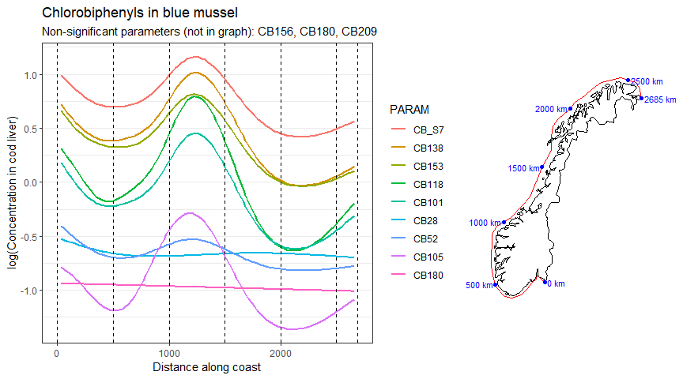<!-- -->

### DDT   

```r
plotgamm_group("DDT", minvalue = -1)
```

<!-- -->
  

### PAH in blue mussel      

```r
plotgamm_group("PAH", tissue = "Whole soft body", minvalue = -1)
```

<!-- -->

### PAH in blue mussel      

```r
plotgamm_group("Organochlor", tissue = "Whole soft body", minvalue = -1)
```

<!-- -->

## 5. Examples {.tabset}   
* The "tile" plots show raw data (medians per station/year) for all stations    
    - The color of the x axis (station code) gives station type: Black = RH (representative), Red = IH (impacted), blue = B (background)  
* The two "model" plots show estimated effects for length- and fat-adjusted data for unimpacted stations   

### BDE47, cod  

```r
# debugonce(plot_observations)
plot_observations("BDE47")  
```

<!-- --><!-- -->

```
## Significance of year and position effects:
```
### BDE47, mussel    

```r
# debugonce(plot_observations)
plot_observations("BDE47",  tissue = "Whole soft body")  
```

<!-- --><!-- -->

```
## Significance of year and position effects:
```
  
### BDE99, cod  

```r
plot_observations("BDE99")  
```

<!-- --><!-- -->

```
## Significance of year and position effects:
```

### BDE99, mussel  

```r
plot_observations("BDE99",  tissue = "Whole soft body")  
```

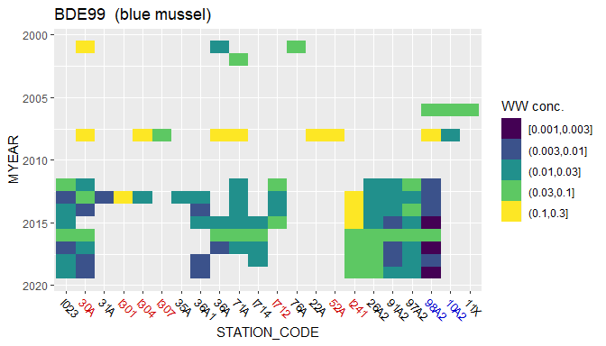<!-- --><!-- -->

```
## Significance of year and position effects:
```

### ZN, cod    

```r
plot_observations("ZN")  
```

<!-- -->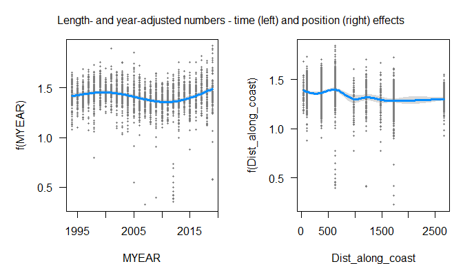<!-- -->

```
## Significance of year and position effects:
```
  
### ZN, mussel    

```r
plot_observations("ZN",  tissue = "Whole soft body")  
```

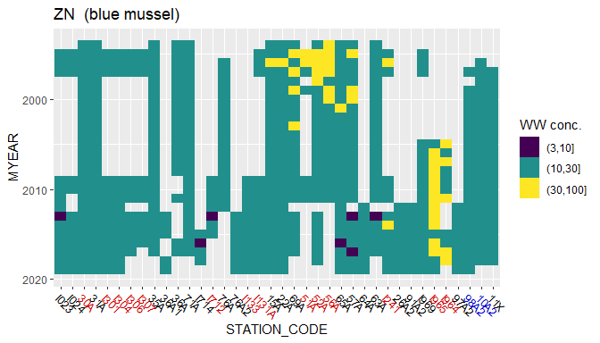<!-- -->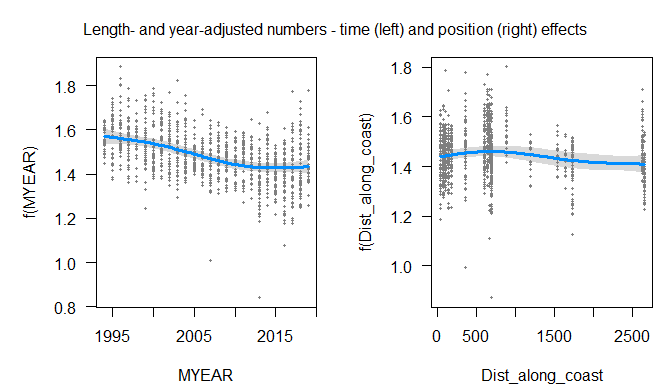<!-- -->

```
## Significance of year and position effects:
```

### AG, cod    

```r
plot_observations("AG")  
```

<!-- --><!-- -->

```
## Significance of year and position effects:
```
### AG, mussel    

```r
plot_observations("AG",  tissue = "Whole soft body")  
```

<!-- -->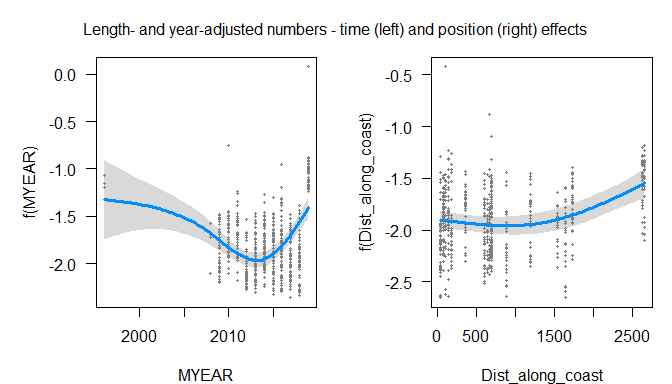<!-- -->

```
## Significance of year and position effects:
```

### CU, cod    

```r
plot_observations("CU")  
```

<!-- --><!-- -->

```
## Significance of year and position effects:
```

### CU, mussel    

```r
plot_observations("CU",  tissue = "Whole soft body")  
```

<!-- --><!-- -->

```
## Significance of year and position effects:
```
  
### HG, cod muscle  

```r
plot_observations("HG", "Muskel")  
```

<!-- --><!-- -->

```
## Significance of year and position effects:
```

### HG, mussel  

```r
plot_observations("HG",  tissue = "Whole soft body")  
```

<!-- -->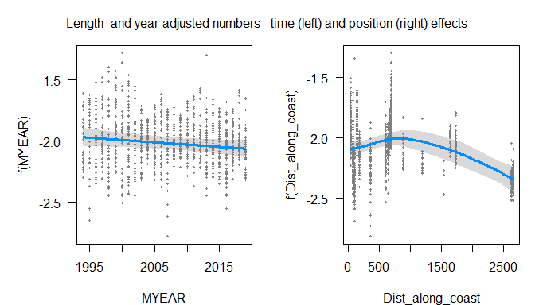<!-- -->

```
## Significance of year and position effects:
```

### CD, cod  

```r
plot_observations("CD")  
```

<!-- --><!-- -->

```
## Significance of year and position effects:
```

### CD, mussel  

```r
plot_observations("CD",  tissue = "Whole soft body")  
```

<!-- -->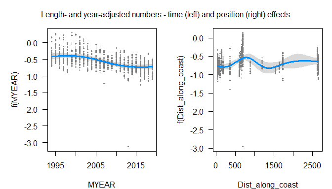<!-- -->

```
## Significance of year and position effects:
```

### PB, cod  

```r
plot_observations("PB")  
```

<!-- -->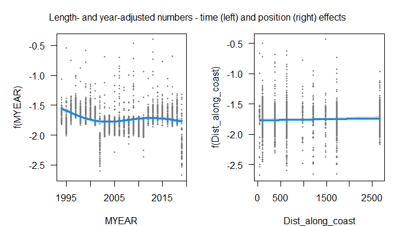<!-- -->

```
## Significance of year and position effects:
```

### PB, mussel  

```r
plot_observations("PB",  tissue = "Whole soft body")  
```

<!-- --><!-- -->

```
## Significance of year and position effects:
```

### CR, cod  

```r
plot_observations("CR")  
```

<!-- --><!-- -->

```
## Significance of year and position effects:
```

### CR, mussel  

```r
plot_observations("CR",  tissue = "Whole soft body")  
```

<!-- -->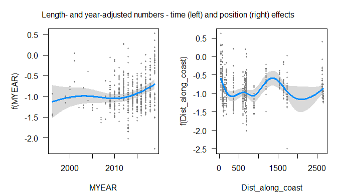<!-- -->

```
## Significance of year and position effects:
```

### CU, cod  

```r
plot_observations("CU")  
```

<!-- --><!-- -->

```
## Significance of year and position effects:
```

### CU, mussel  

```r
plot_observations("CU",  tissue = "Whole soft body")  
```

<!-- --><!-- -->

```
## Significance of year and position effects:
```

### CO, cod  

```r
plot_observations("CO")  
```

<!-- --><!-- -->

```
## Significance of year and position effects:
```

### CO, mussel  

```r
plot_observations("CO",  tissue = "Whole soft body")  
```

<!-- -->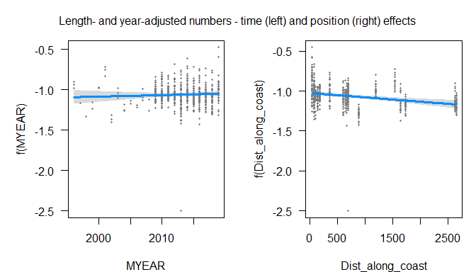<!-- -->

```
## Significance of year and position effects:
```

### NI, cod  

```r
plot_observations("NI")  
```

<!-- --><!-- -->

```
## Significance of year and position effects:
```

### NI, mussel  

```r
plot_observations("NI",  tissue = "Whole soft body")  
```

<!-- -->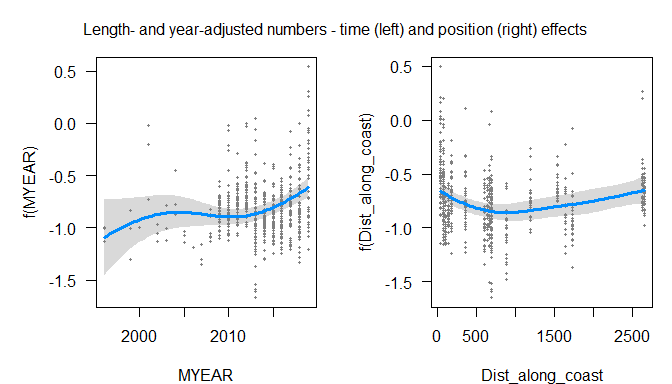<!-- -->

```
## Significance of year and position effects:
```

### AS, cod  

```r
plot_observations("AS")  
```

<!-- --><!-- -->

```
## Significance of year and position effects:
```

### AS, mussel  

```r
plot_observations("AS",  tissue = "Whole soft body")  
```

<!-- -->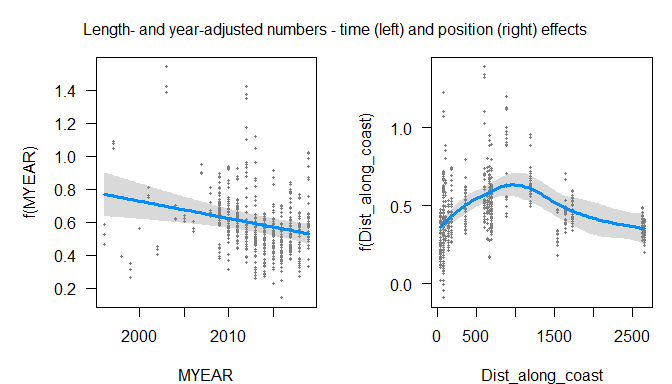<!-- -->

```
## Significance of year and position effects:
```

### BDE100, cod  

```r
plot_observations("BDE100")  
```

<!-- --><!-- -->

```
## Significance of year and position effects:
```

### BDE100, mussel  

```r
plot_observations("BDE100",  tissue = "Whole soft body")  
```

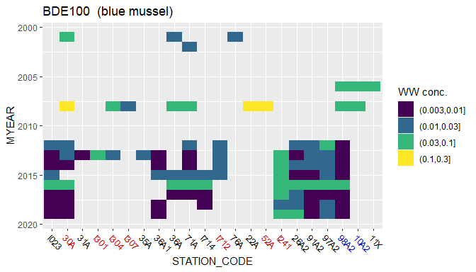<!-- --><!-- -->

```
## Significance of year and position effects:
```

### BDE6S, cod  

```r
plot_observations("BDE6S")  
```

<!-- -->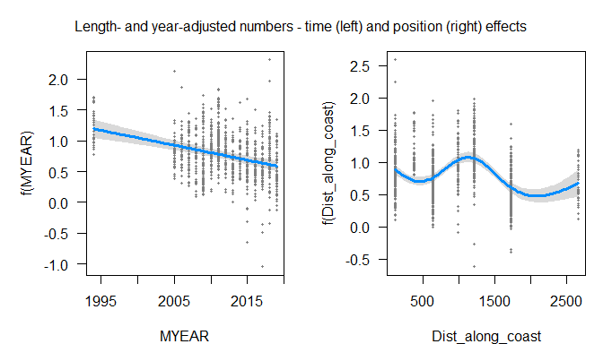<!-- -->

```
## Significance of year and position effects:
```

### BDE6S, mussel  

```r
plot_observations("BDE6S",  tissue = "Whole soft body")  
```

<!-- --><!-- -->

```
## Significance of year and position effects:
```

### HBCDA, cod  

```r
plot_observations("HBCDA")  
```

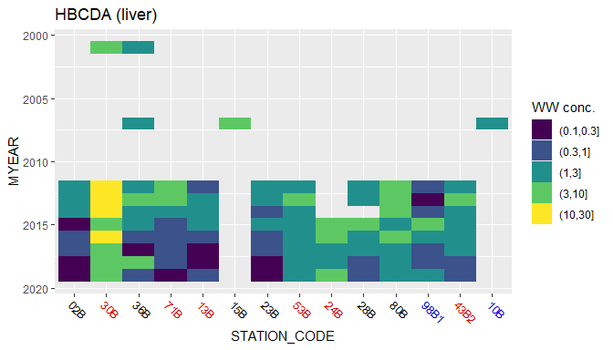<!-- --><!-- -->

```
## Significance of year and position effects:
```

### HBCDA, mussel  

```r
plot_observations("HBCDA",  tissue = "Whole soft body")  
```

<!-- -->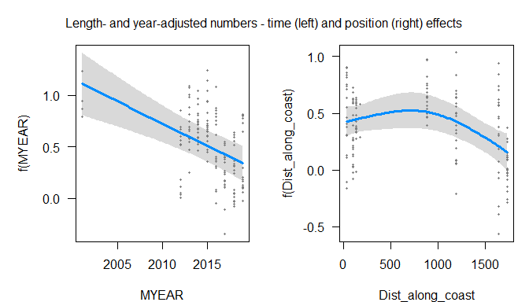<!-- -->

```
## Significance of year and position effects:
```

### HCB, cod  

```r
plot_observations("HCB")  
```

<!-- --><!-- -->

```
## Significance of year and position effects:
```

### HCB, mussel  

```r
plot_observations("HCB",  tissue = "Whole soft body")  
```

<!-- -->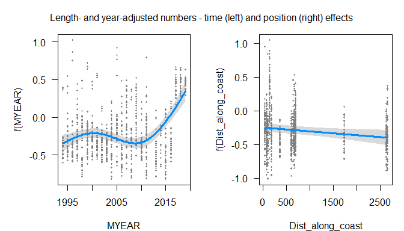<!-- -->

```
## Significance of year and position effects:
```

### Sum PCB, cod    

```r
plot_observations("CB_S7")  
```

<!-- --><!-- -->

```
## Significance of year and position effects:
```

### Sum PCB    

```r
plot_observations("CB_S7",  tissue = "Whole soft body")  
```

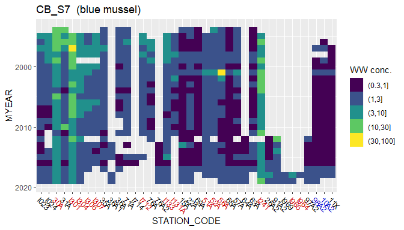<!-- -->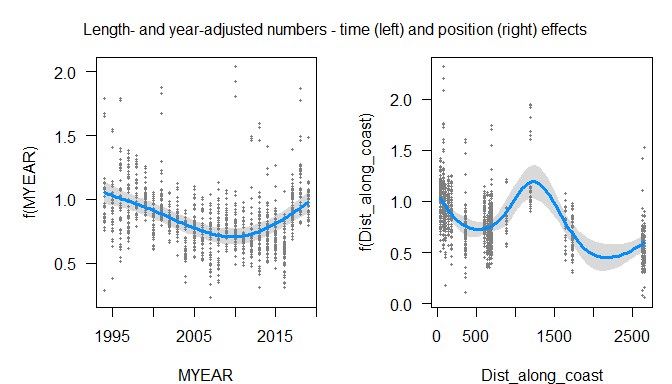<!-- -->

```
## Significance of year and position effects:
```

### CB118, cod      

```r
plot_observations("CB118")  
```

<!-- --><!-- -->

```
## Significance of year and position effects:
```
### CB118, mussel      

```r
plot_observations("CB118",  tissue = "Whole soft body")  
```

<!-- --><!-- -->

```
## Significance of year and position effects:
```

### Pentaklorbenzen, cod      

```r
plot_observations("QCB")  
```

<!-- --><!-- -->

```
## Significance of year and position effects:
```

```r
# dat %>% filter(grepl("QCB", PARAM))
```

### Pentaklorbenzen, mussel      

```r
plot_observations("QCB",  tissue = "Whole soft body")  
```

<!-- -->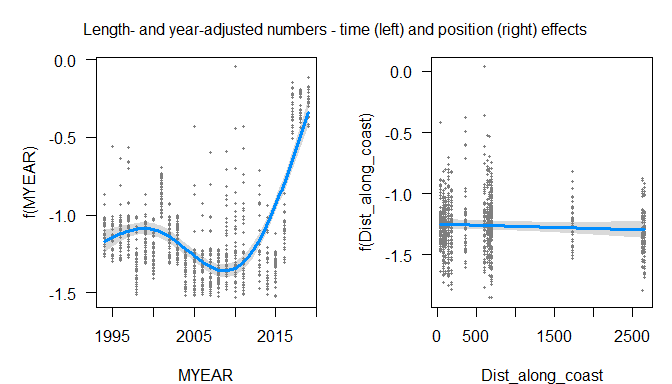<!-- -->

```
## Significance of year and position effects:
```

### P_S, mussel      

```r
# debugonce(plot_observations)
plot_observations("P_S",  tissue = "Whole soft body")   
```

<!-- -->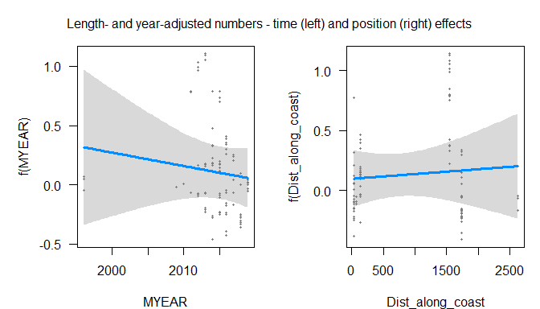<!-- -->

```
## Significance of year and position effects:
```
### PAH16, mussel  

```r
plot_observations("PAH16",  tissue = "Whole soft body")  
```

<!-- -->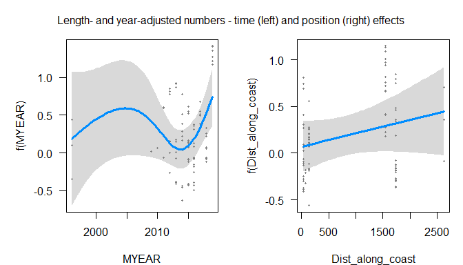<!-- -->

```
## Significance of year and position effects:
```


### BAP, mussel      

```r
# debugonce(plot_observations)
plot_observations("BAP",  tissue = "Whole soft body")   
```

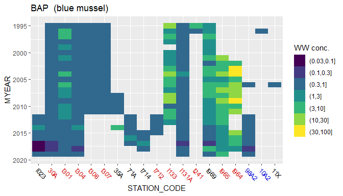<!-- --><!-- -->

```
## Significance of year and position effects:
```


### DDEPP, cod      

```r
# debugonce(plot_observations)
plot_observations("DDEPP")   
```

<!-- --><!-- -->

```
## Significance of year and position effects:
```

### DDEPP, mussel      

```r
# debugonce(plot_observations)
plot_observations("DDEPP",  tissue = "Whole soft body")   
```

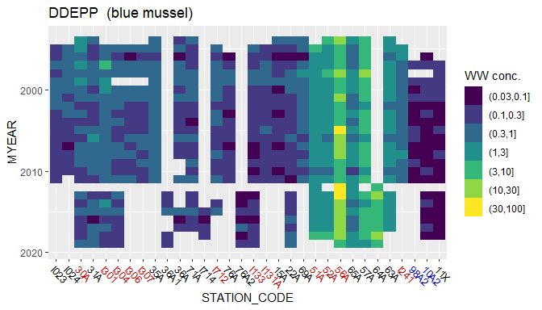<!-- --><!-- -->

```
## Significance of year and position effects:
```


### SCCP, cod      

```r
plot_observations("SCCP")   
```

<!-- --><!-- -->

```
## Significance of year and position effects:
```

### SCCP, mussel      

```r
plot_observations("SCCP",  tissue = "Whole soft body")   
```

<!-- --><!-- -->

```
## Significance of year and position effects:
```

### MCCP, cod      

```r
plot_observations("MCCP")   
```

<!-- -->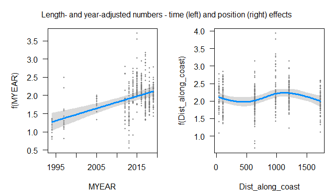<!-- -->

```
## Significance of year and position effects:
```

### MCCP, mussel      

```r
plot_observations("MCCP",  tissue = "Whole soft body")   
```

<!-- -->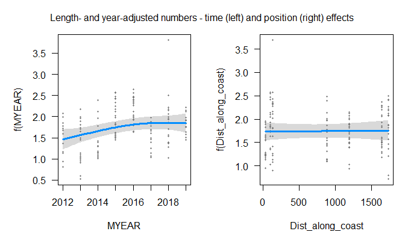<!-- -->

```
## Significance of year and position effects:
```

### PFOS, cod      

```r
plot_observations("PFOS")   
```

<!-- -->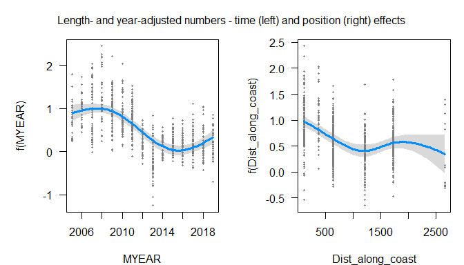<!-- -->

```
## Significance of year and position effects:
```

### PFOS, mussel      

```r
plot_observations("PFOS",  tissue = "Whole soft body")   
```

<!-- -->

```
## Error in smooth.construct.tp.smooth.spec(object, dk$data, dk$knots) : 
##   A term has fewer unique covariate combinations than specified maximum degrees of freedom
```

### PFOSA, cod      

```r
plot_observations("PFOSA")   
```

<!-- --><!-- -->

```
## Significance of year and position effects:
```

### PFOSA, mussel      

```r
plot_observations("PFOSA",  tissue = "Whole soft body")   
```

<!-- -->

```
## Error in smooth.construct.tp.smooth.spec(object, dk$data, dk$knots) : 
##   A term has fewer unique covariate combinations than specified maximum degrees of freedom
```

### Toksafen Parlar 50, cod       

```r
plot_observations("Toksafen Parlar 50")   
```

<!-- --><!-- -->

```
## Significance of year and position effects:
```

### Toksafen Parlar 50, mussel       

```r
plot_observations("Toksafen Parlar 50",  tissue = "Whole soft body")   
```

<!-- -->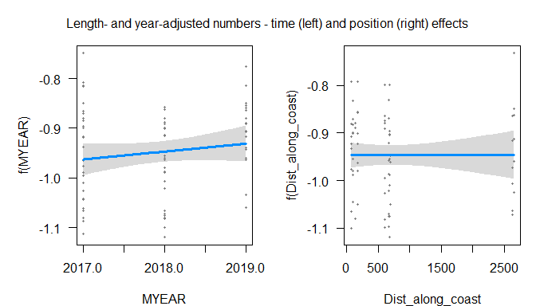<!-- -->

```
## Significance of year and position effects:
```

### TBT, mussel    

```r
plot_observations("TBT",  tissue = "Whole soft body")  
```

<!-- -->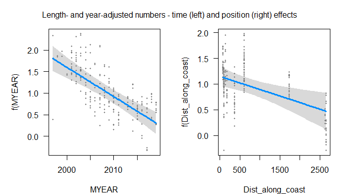<!-- -->

```
## Significance of year and position effects:
```

### Dieldrin    

```r
plot_observations("Dieldrin",  tissue = "Lever")  
```

<!-- -->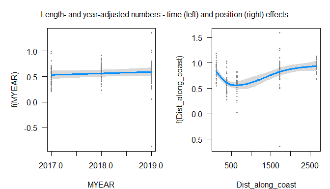<!-- -->

```
## Significance of year and position effects:
```


## 6. Linear results   
Different from the non-linear (GAMM) statistics by  
* Assumin a linear effect of distance along coast  
* Analysing length-adjusted concentrations (instead of raw wet-weight concentrations)   
* Picking either 


```r
result_list <- readRDS("Data/121_result_list_notimpacted.rds")

if (FALSE){
  length(result_list)
  str(result_list, 1)
  str(result_list$result[[1]], 1)
}
```


### Linear_results - store result as 'linear_results'   
*See combined table below for results*

```r
ok <- result_list[[2]] %>% map_lgl(is.null)
cat("Number of regressions that worked (numbers / fraction): \n")
sum(ok)
mean(ok)

# series_param_tissue$Result_nonimpact <- ok

linear_results <- result_list[[1]][ok] %>% 
  bind_rows() %>% 
  left_join(df_parameter_groups[c("Parameter.Code", "Substance.Group")],
            by = c("PARAM" = "Parameter.Code"),
            na_matches = "never") %>%
  select(Substance.Group, everything()) %>%
  arrange(Substance.Group)
```

```
## Number of regressions that worked (numbers / fraction): 
## [1] 342
## [1] 0.76
```


```r
if (FALSE){
  10^(1000*linear_results$Position_est[1])
  100*(10^(1000*linear_results$Position_est[1]) - 1) %>% round(digits = 2)
}

linear_results <- linear_results %>%
  mutate(
    Change_1000km = round(100*(10^(1000*Position_est) - 1), 0),
    Change_10yr = round(100*(10^(10*Year_est) - 1), 0)
    
    
  )
```


## 7. Geographic effect, table of linear + non-linear results      
* Including change in percent for every 1000 km along coast (from Swedish border)    

```r
# linear_results

# For `Percent per 1000 km`:
# * For every 1 km, `log10(conc`) changes by adding `Position_est`
# * For every 1000 km, `log10(conc`) changes by adding `1000*Position_est`
# * For every 1000 km, `conc` changes by multiplying with `10^(1000*Position_est)`


tab1 <- linear_results %>%
  filter(!is.na(Position_est)) %>%
  select(PARAM, TISSUE_NAME, Position_est, Position_p, Position_est) %>%
  group_by(PARAM, TISSUE_NAME) %>%
  summarise_all(list(min = min, mean = mean, median = median)) %>%
  ungroup() %>%
  mutate(
    Linear_effect = case_when(
      is.na(Position_est_mean) ~ "-",
      Position_est_mean < 0 ~ "Decreasing",
      Position_est_mean >= 0 ~ "Increasing"),
    `Percent per 1000 km` = round(100*(10^(1000*Position_est_mean) - 1), 0),
    Linear_p = case_when(
      is.na(Position_p_median) ~ "-",
      Position_p_median < 0.001 ~ "< 0.001",
      Position_p_median < 0.01 ~ round(Position_p_median, 3) %>% as.character(),
      Position_p_median <= 1 ~ round(Position_p_median, 2) %>% as.character())
  ) %>% 
  select(PARAM, TISSUE_NAME, Linear_effect, `Percent per 1000 km`, Linear_p)


# tab1


tab2 <- ttable_gamm %>%
  mutate(across(c(Year_edf, Position_esdf, Year_F, Position_F, Year_p, Position_p), as.numeric)) %>%
  group_by(PARAM, TISSUE_NAME) %>%
  summarise_at(vars(Position_esdf, Position_p), median) %>%
  mutate(Non_linear_df = round(Position_esdf, 2), 
    Non_linear_p = case_when(
      is.na(Position_p) ~ "-",
      Position_p < 0.001 ~ "< 0.001",
      Position_p < 0.01 ~ round(Position_p, 3) %>% as.character(),
      Position_p <= 1 ~ round(Position_p, 2) %>% as.character())
    ) %>% 
  select(PARAM, TISSUE_NAME, Non_linear_df, Non_linear_p)


# Combine:


tab_comb <- left_join(tab1, tab2, by = c("PARAM", "TISSUE_NAME")) %>%
    # Add substance group
  full_join(df_parameter_groups[c("Parameter.Code", "Substance.Group")],
            by = c("PARAM" = "Parameter.Code")) %>%
  select(Substance.Group, everything()) %>%
  arrange(Substance.Group, PARAM) %>%
  filter(!is.na(TISSUE_NAME))

  
# cell_spec("makan", "html", color = "red")
```

Add HG non-linear muscle results    
* We reestimate using plot_observations() function  

```r
# Get result
X <- plot_observations("HG", "Muskel", show_plot = c(FALSE, FALSE))    
```

```
## `summarise()` ungrouping output (override with `.groups` argument)
```

```r
hg_non_linear <- summary(X$mod$gam)$s.table["s(Dist_along_coast)", c("edf", "p-value")]

# Where to insert result
sel <- with(tab_comb, PARAM == "HG" & TISSUE_NAME == "Muskel")

# Insert df
tab_comb[sel, "Non_linear_df"] <- hg_non_linear["edf"]

# Insert p

Position_p <- hg_non_linear["p-value"]
tab_comb[sel, "Non_linear_p"] <- case_when(
      is.na(Position_p) ~ "-",
      Position_p < 0.001 ~ "< 0.001",
      Position_p < 0.01 ~ round(Position_p, 3) %>% as.character(),
      Position_p <= 1 ~ round(Position_p, 2) %>% as.character()
    )
```


Make variable order   

```r
pars_pcb <- c("CB_S7", "CB28", "CB52", "CB77", "CB81",
  "CB101", "CB105", "CB114", "CB118", "CB123", "CB126", "CB138",
  "CB153", "CB156", "CB157", "CB167", "CB169", "CB180", "CB189",
  "CB209", "Pentaklorbenzen (QCB)")

pars_bde <- c("BDESS", "BDE6S", "BDE17", "BDE28", "BDE47", "BDE49", "BDE66",
  "BDE71", "BDE77", "BDE85", "BDE99", "BDE100", "BDE119", "BDE126",
  "BDE138", "BDE153", "BDE154", "BDE156", "BDE183", "BDE184", "BDE191",
  "BDE196", "BDE197", "BDE206", "BDE207", "BDE209")


pars_hbcd <- tab_comb$PARAM %>% grep("HBCD", ., value = TRUE) %>%
  unique() %>%
  sort() %>%
  move_to_front("Sum HBCD")

pars_pfas <- c("PFAS", "PFBS", "PFDcA", "PFHpA", "PFHxA", "PFHxS", "PFNA", "PFOA", 
"PFOS", "PFOSA", "PFUdA")

if (FALSE){
  # Show all, for check  
  pars_pcb
  pars_bde
  pars_hbcd
  pars_pfas
}

# Other parameters, in alphabetic order 
par_all <- tab_comb %>% pull(PARAM)
sel1 <- par_all %in% pars_pcb
sel2 <- par_all %in% pars_bde
sel3 <- par_all %in% pars_hbcd
sel4 <- par_all %in% pars_pfas
pars_other <- par_all[!(sel1 | sel2 | sel3 | sel4)] %>% unique()

# Correct order
par_levels <- c(pars_pcb, pars_bde, pars_hbcd, pars_pfas, pars_other)
```

Order variables  

```r
# Check if some parameters occur more than once (they shouldn't!):
check <- table(par_levels)
if (sum(check > 1) > 0)
  check[check > 1]

# Set PARAM factor levels in correct order
tab_comb <- tab_comb %>%
  mutate(PARAM = factor(PARAM, levels = par_levels))
```
Output  

```r
cs_dt <- tab_comb %>%
  select(-Linear_effect)

cs_dt$Linear_p = cell_spec(cs_dt$Linear_p, 
                           color = ifelse(cs_dt$Linear_p < 0.05, "red", "black"))

cs_dt$Non_linear_p = cell_spec(cs_dt$Non_linear_p, 
                               color = case_when(
                                 is.na(cs_dt$Non_linear_p) ~ "black",
                                 cs_dt$Non_linear_p <= 0.05 ~ "red",
                                 cs_dt$Non_linear_p > 0.05 ~ "black")
                               )


kbl(cs_dt, escape = F) %>%
  kable_paper("striped", full_width = F)  
```

<table class=" lightable-paper lightable-striped" style='font-family: "Arial Narrow", arial, helvetica, sans-serif; width: auto !important; margin-left: auto; margin-right: auto;'>
 <thead>
  <tr>
   <th style="text-align:left;"> Substance.Group </th>
   <th style="text-align:left;"> PARAM </th>
   <th style="text-align:left;"> TISSUE_NAME </th>
   <th style="text-align:right;"> Percent per 1000 km </th>
   <th style="text-align:left;"> Linear_p </th>
   <th style="text-align:right;"> Non_linear_df </th>
   <th style="text-align:left;"> Non_linear_p </th>
  </tr>
 </thead>
<tbody>
  <tr>
   <td style="text-align:left;"> Metals and metalloids </td>
   <td style="text-align:left;"> AG </td>
   <td style="text-align:left;"> Lever </td>
   <td style="text-align:right;"> -30 </td>
   <td style="text-align:left;"> <span style="     color: red !important;">&lt; 0.001</span> </td>
   <td style="text-align:right;"> 5.510000 </td>
   <td style="text-align:left;"> <span style="     color: red !important;">&lt; 0.001</span> </td>
  </tr>
  <tr>
   <td style="text-align:left;"> Metals and metalloids </td>
   <td style="text-align:left;"> AG </td>
   <td style="text-align:left;"> Whole soft body </td>
   <td style="text-align:right;"> 23 </td>
   <td style="text-align:left;"> <span style="     color: red !important;">0.04</span> </td>
   <td style="text-align:right;"> 2.220000 </td>
   <td style="text-align:left;"> <span style="     color: red !important;">&lt; 0.001</span> </td>
  </tr>
  <tr>
   <td style="text-align:left;"> Metals and metalloids </td>
   <td style="text-align:left;"> AS </td>
   <td style="text-align:left;"> Lever </td>
   <td style="text-align:right;"> -9 </td>
   <td style="text-align:left;"> <span style="     color: red !important;">0.02</span> </td>
   <td style="text-align:right;"> 4.940000 </td>
   <td style="text-align:left;"> <span style="     color: red !important;">&lt; 0.001</span> </td>
  </tr>
  <tr>
   <td style="text-align:left;"> Metals and metalloids </td>
   <td style="text-align:left;"> AS </td>
   <td style="text-align:left;"> Whole soft body </td>
   <td style="text-align:right;"> 0 </td>
   <td style="text-align:left;"> <span style="     color: black !important;">0.99</span> </td>
   <td style="text-align:right;"> 3.370000 </td>
   <td style="text-align:left;"> <span style="     color: red !important;">&lt; 0.001</span> </td>
  </tr>
  <tr>
   <td style="text-align:left;"> Metals and metalloids </td>
   <td style="text-align:left;"> CD </td>
   <td style="text-align:left;"> Lever </td>
   <td style="text-align:right;"> 101 </td>
   <td style="text-align:left;"> <span style="     color: red !important;">&lt; 0.001</span> </td>
   <td style="text-align:right;"> 4.000000 </td>
   <td style="text-align:left;"> <span style="     color: red !important;">&lt; 0.001</span> </td>
  </tr>
  <tr>
   <td style="text-align:left;"> Metals and metalloids </td>
   <td style="text-align:left;"> CD </td>
   <td style="text-align:left;"> Whole soft body </td>
   <td style="text-align:right;"> 10 </td>
   <td style="text-align:left;"> <span style="     color: black !important;">0.06</span> </td>
   <td style="text-align:right;"> 5.040000 </td>
   <td style="text-align:left;"> <span style="     color: red !important;">&lt; 0.001</span> </td>
  </tr>
  <tr>
   <td style="text-align:left;"> Metals and metalloids </td>
   <td style="text-align:left;"> CO </td>
   <td style="text-align:left;"> Lever </td>
   <td style="text-align:right;"> -22 </td>
   <td style="text-align:left;"> <span style="     color: red !important;">&lt; 0.001</span> </td>
   <td style="text-align:right;"> 6.510000 </td>
   <td style="text-align:left;"> <span style="     color: red !important;">&lt; 0.001</span> </td>
  </tr>
  <tr>
   <td style="text-align:left;"> Metals and metalloids </td>
   <td style="text-align:left;"> CO </td>
   <td style="text-align:left;"> Whole soft body </td>
   <td style="text-align:right;"> -12 </td>
   <td style="text-align:left;"> <span style="     color: red !important;">&lt; 0.001</span> </td>
   <td style="text-align:right;"> 1.000000 </td>
   <td style="text-align:left;"> <span style="     color: red !important;">&lt; 0.001</span> </td>
  </tr>
  <tr>
   <td style="text-align:left;"> Metals and metalloids </td>
   <td style="text-align:left;"> CR </td>
   <td style="text-align:left;"> Lever </td>
   <td style="text-align:right;"> -10 </td>
   <td style="text-align:left;"> <span style="     color: black !important;">0.24</span> </td>
   <td style="text-align:right;"> 1.360000 </td>
   <td style="text-align:left;"> <span style="     color: black !important;">0.29</span> </td>
  </tr>
  <tr>
   <td style="text-align:left;"> Metals and metalloids </td>
   <td style="text-align:left;"> CR </td>
   <td style="text-align:left;"> Whole soft body </td>
   <td style="text-align:right;"> -10 </td>
   <td style="text-align:left;"> <span style="     color: black !important;">0.23</span> </td>
   <td style="text-align:right;"> 5.940000 </td>
   <td style="text-align:left;"> <span style="     color: red !important;">&lt; 0.001</span> </td>
  </tr>
  <tr>
   <td style="text-align:left;"> Metals and metalloids </td>
   <td style="text-align:left;"> CU </td>
   <td style="text-align:left;"> Lever </td>
   <td style="text-align:right;"> -14 </td>
   <td style="text-align:left;"> <span style="     color: red !important;">&lt; 0.001</span> </td>
   <td style="text-align:right;"> 6.530000 </td>
   <td style="text-align:left;"> <span style="     color: red !important;">&lt; 0.001</span> </td>
  </tr>
  <tr>
   <td style="text-align:left;"> Metals and metalloids </td>
   <td style="text-align:left;"> CU </td>
   <td style="text-align:left;"> Whole soft body </td>
   <td style="text-align:right;"> 0 </td>
   <td style="text-align:left;"> <span style="     color: black !important;">0.83</span> </td>
   <td style="text-align:right;"> 5.450000 </td>
   <td style="text-align:left;"> <span style="     color: red !important;">0.001</span> </td>
  </tr>
  <tr>
   <td style="text-align:left;"> Metals and metalloids </td>
   <td style="text-align:left;"> HG </td>
   <td style="text-align:left;"> Muskel </td>
   <td style="text-align:right;"> 67 </td>
   <td style="text-align:left;"> <span style="     color: black !important;">0.05</span> </td>
   <td style="text-align:right;"> 6.817042 </td>
   <td style="text-align:left;"> <span style="     color: red !important;">&lt; 0.001</span> </td>
  </tr>
  <tr>
   <td style="text-align:left;"> Metals and metalloids </td>
   <td style="text-align:left;"> HG </td>
   <td style="text-align:left;"> Whole soft body </td>
   <td style="text-align:right;"> -17 </td>
   <td style="text-align:left;"> <span style="     color: red !important;">0.001</span> </td>
   <td style="text-align:right;"> 2.570000 </td>
   <td style="text-align:left;"> <span style="     color: red !important;">&lt; 0.001</span> </td>
  </tr>
  <tr>
   <td style="text-align:left;"> Metals and metalloids </td>
   <td style="text-align:left;"> NI </td>
   <td style="text-align:left;"> Lever </td>
   <td style="text-align:right;"> 1 </td>
   <td style="text-align:left;"> <span style="     color: black !important;">0.93</span> </td>
   <td style="text-align:right;"> 3.190000 </td>
   <td style="text-align:left;"> <span style="     color: red !important;">&lt; 0.001</span> </td>
  </tr>
  <tr>
   <td style="text-align:left;"> Metals and metalloids </td>
   <td style="text-align:left;"> NI </td>
   <td style="text-align:left;"> Whole soft body </td>
   <td style="text-align:right;"> -3 </td>
   <td style="text-align:left;"> <span style="     color: black !important;">0.67</span> </td>
   <td style="text-align:right;"> 2.750000 </td>
   <td style="text-align:left;"> <span style="     color: red !important;">0.003</span> </td>
  </tr>
  <tr>
   <td style="text-align:left;"> Metals and metalloids </td>
   <td style="text-align:left;"> PB </td>
   <td style="text-align:left;"> Lever </td>
   <td style="text-align:right;"> 4 </td>
   <td style="text-align:left;"> <span style="     color: black !important;">0.05</span> </td>
   <td style="text-align:right;"> 1.000000 </td>
   <td style="text-align:left;"> <span style="     color: black !important;">0.11</span> </td>
  </tr>
  <tr>
   <td style="text-align:left;"> Metals and metalloids </td>
   <td style="text-align:left;"> PB </td>
   <td style="text-align:left;"> Whole soft body </td>
   <td style="text-align:right;"> -8 </td>
   <td style="text-align:left;"> <span style="     color: black !important;">0.25</span> </td>
   <td style="text-align:right;"> 6.380000 </td>
   <td style="text-align:left;"> <span style="     color: red !important;">&lt; 0.001</span> </td>
  </tr>
  <tr>
   <td style="text-align:left;"> Metals and metalloids </td>
   <td style="text-align:left;"> SN </td>
   <td style="text-align:left;"> Lever </td>
   <td style="text-align:right;"> 3 </td>
   <td style="text-align:left;"> <span style="     color: black !important;">0.68</span> </td>
   <td style="text-align:right;"> 1.000000 </td>
   <td style="text-align:left;"> <span style="     color: black !important;">0.4</span> </td>
  </tr>
  <tr>
   <td style="text-align:left;"> Metals and metalloids </td>
   <td style="text-align:left;"> SN </td>
   <td style="text-align:left;"> Whole soft body </td>
   <td style="text-align:right;"> -11 </td>
   <td style="text-align:left;"> <span style="     color: black !important;">0.07</span> </td>
   <td style="text-align:right;"> 1.000000 </td>
   <td style="text-align:left;"> <span style="     color: black !important;">0.06</span> </td>
  </tr>
  <tr>
   <td style="text-align:left;"> Metals and metalloids </td>
   <td style="text-align:left;"> ZN </td>
   <td style="text-align:left;"> Lever </td>
   <td style="text-align:right;"> -9 </td>
   <td style="text-align:left;"> <span style="     color: red !important;">&lt; 0.001</span> </td>
   <td style="text-align:right;"> 6.100000 </td>
   <td style="text-align:left;"> <span style="     color: red !important;">&lt; 0.001</span> </td>
  </tr>
  <tr>
   <td style="text-align:left;"> Metals and metalloids </td>
   <td style="text-align:left;"> ZN </td>
   <td style="text-align:left;"> Whole soft body </td>
   <td style="text-align:right;"> -3 </td>
   <td style="text-align:left;"> <span style="     color: black !important;">0.05</span> </td>
   <td style="text-align:right;"> 2.420000 </td>
   <td style="text-align:left;"> <span style="     color: red !important;">0.04</span> </td>
  </tr>
  <tr>
   <td style="text-align:left;"> Chlorobiphenyls </td>
   <td style="text-align:left;"> CB_S7 </td>
   <td style="text-align:left;"> Lever </td>
   <td style="text-align:right;"> -27 </td>
   <td style="text-align:left;"> <span style="     color: red !important;">&lt; 0.001</span> </td>
   <td style="text-align:right;"> 6.830000 </td>
   <td style="text-align:left;"> <span style="     color: red !important;">&lt; 0.001</span> </td>
  </tr>
  <tr>
   <td style="text-align:left;"> Chlorobiphenyls </td>
   <td style="text-align:left;"> CB_S7 </td>
   <td style="text-align:left;"> Muskel </td>
   <td style="text-align:right;"> -24 </td>
   <td style="text-align:left;"> <span style="     color: red !important;">0.01</span> </td>
   <td style="text-align:right;"> 3.910000 </td>
   <td style="text-align:left;"> <span style="     color: red !important;">&lt; 0.001</span> </td>
  </tr>
  <tr>
   <td style="text-align:left;"> Chlorobiphenyls </td>
   <td style="text-align:left;"> CB_S7 </td>
   <td style="text-align:left;"> Whole soft body </td>
   <td style="text-align:right;"> -27 </td>
   <td style="text-align:left;"> <span style="     color: red !important;">&lt; 0.001</span> </td>
   <td style="text-align:right;"> 5.630000 </td>
   <td style="text-align:left;"> <span style="     color: red !important;">&lt; 0.001</span> </td>
  </tr>
  <tr>
   <td style="text-align:left;"> Chlorobiphenyls </td>
   <td style="text-align:left;"> CB101 </td>
   <td style="text-align:left;"> Lever </td>
   <td style="text-align:right;"> -6 </td>
   <td style="text-align:left;"> <span style="     color: black !important;">0.12</span> </td>
   <td style="text-align:right;"> 6.790000 </td>
   <td style="text-align:left;"> <span style="     color: red !important;">&lt; 0.001</span> </td>
  </tr>
  <tr>
   <td style="text-align:left;"> Chlorobiphenyls </td>
   <td style="text-align:left;"> CB101 </td>
   <td style="text-align:left;"> Muskel </td>
   <td style="text-align:right;"> -1 </td>
   <td style="text-align:left;"> <span style="     color: black !important;">0.96</span> </td>
   <td style="text-align:right;"> 3.740000 </td>
   <td style="text-align:left;"> <span style="     color: red !important;">&lt; 0.001</span> </td>
  </tr>
  <tr>
   <td style="text-align:left;"> Chlorobiphenyls </td>
   <td style="text-align:left;"> CB101 </td>
   <td style="text-align:left;"> Whole soft body </td>
   <td style="text-align:right;"> -30 </td>
   <td style="text-align:left;"> <span style="     color: red !important;">&lt; 0.001</span> </td>
   <td style="text-align:right;"> 5.900000 </td>
   <td style="text-align:left;"> <span style="     color: red !important;">&lt; 0.001</span> </td>
  </tr>
  <tr>
   <td style="text-align:left;"> Chlorobiphenyls </td>
   <td style="text-align:left;"> CB105 </td>
   <td style="text-align:left;"> Lever </td>
   <td style="text-align:right;"> -25 </td>
   <td style="text-align:left;"> <span style="     color: red !important;">&lt; 0.001</span> </td>
   <td style="text-align:right;"> 6.490000 </td>
   <td style="text-align:left;"> <span style="     color: red !important;">&lt; 0.001</span> </td>
  </tr>
  <tr>
   <td style="text-align:left;"> Chlorobiphenyls </td>
   <td style="text-align:left;"> CB105 </td>
   <td style="text-align:left;"> Muskel </td>
   <td style="text-align:right;"> -24 </td>
   <td style="text-align:left;"> <span style="     color: red !important;">0.02</span> </td>
   <td style="text-align:right;"> 3.910000 </td>
   <td style="text-align:left;"> <span style="     color: red !important;">&lt; 0.001</span> </td>
  </tr>
  <tr>
   <td style="text-align:left;"> Chlorobiphenyls </td>
   <td style="text-align:left;"> CB105 </td>
   <td style="text-align:left;"> Whole soft body </td>
   <td style="text-align:right;"> -21 </td>
   <td style="text-align:left;"> <span style="     color: red !important;">&lt; 0.001</span> </td>
   <td style="text-align:right;"> 5.720000 </td>
   <td style="text-align:left;"> <span style="     color: red !important;">&lt; 0.001</span> </td>
  </tr>
  <tr>
   <td style="text-align:left;"> Chlorobiphenyls </td>
   <td style="text-align:left;"> CB114 </td>
   <td style="text-align:left;"> Lever </td>
   <td style="text-align:right;"> -38 </td>
   <td style="text-align:left;"> <span style="     color: red !important;">0.001</span> </td>
   <td style="text-align:right;"> NA </td>
   <td style="text-align:left;"> <span style="     color: black !important;">NA</span> </td>
  </tr>
  <tr>
   <td style="text-align:left;"> Chlorobiphenyls </td>
   <td style="text-align:left;"> CB114 </td>
   <td style="text-align:left;"> Whole soft body </td>
   <td style="text-align:right;"> -17 </td>
   <td style="text-align:left;"> <span style="     color: black !important;">0.3</span> </td>
   <td style="text-align:right;"> NA </td>
   <td style="text-align:left;"> <span style="     color: black !important;">NA</span> </td>
  </tr>
  <tr>
   <td style="text-align:left;"> Chlorobiphenyls </td>
   <td style="text-align:left;"> CB118 </td>
   <td style="text-align:left;"> Lever </td>
   <td style="text-align:right;"> -22 </td>
   <td style="text-align:left;"> <span style="     color: red !important;">&lt; 0.001</span> </td>
   <td style="text-align:right;"> 6.790000 </td>
   <td style="text-align:left;"> <span style="     color: red !important;">&lt; 0.001</span> </td>
  </tr>
  <tr>
   <td style="text-align:left;"> Chlorobiphenyls </td>
   <td style="text-align:left;"> CB118 </td>
   <td style="text-align:left;"> Muskel </td>
   <td style="text-align:right;"> -24 </td>
   <td style="text-align:left;"> <span style="     color: black !important;">0.05</span> </td>
   <td style="text-align:right;"> 3.930000 </td>
   <td style="text-align:left;"> <span style="     color: red !important;">&lt; 0.001</span> </td>
  </tr>
  <tr>
   <td style="text-align:left;"> Chlorobiphenyls </td>
   <td style="text-align:left;"> CB118 </td>
   <td style="text-align:left;"> Whole soft body </td>
   <td style="text-align:right;"> -30 </td>
   <td style="text-align:left;"> <span style="     color: red !important;">&lt; 0.001</span> </td>
   <td style="text-align:right;"> 6.320000 </td>
   <td style="text-align:left;"> <span style="     color: red !important;">&lt; 0.001</span> </td>
  </tr>
  <tr>
   <td style="text-align:left;"> Chlorobiphenyls </td>
   <td style="text-align:left;"> CB123 </td>
   <td style="text-align:left;"> Lever </td>
   <td style="text-align:right;"> -32 </td>
   <td style="text-align:left;"> <span style="     color: red !important;">0.02</span> </td>
   <td style="text-align:right;"> NA </td>
   <td style="text-align:left;"> <span style="     color: black !important;">NA</span> </td>
  </tr>
  <tr>
   <td style="text-align:left;"> Chlorobiphenyls </td>
   <td style="text-align:left;"> CB123 </td>
   <td style="text-align:left;"> Whole soft body </td>
   <td style="text-align:right;"> -25 </td>
   <td style="text-align:left;"> <span style="     color: black !important;">0.09</span> </td>
   <td style="text-align:right;"> NA </td>
   <td style="text-align:left;"> <span style="     color: black !important;">NA</span> </td>
  </tr>
  <tr>
   <td style="text-align:left;"> Chlorobiphenyls </td>
   <td style="text-align:left;"> CB126 </td>
   <td style="text-align:left;"> Lever </td>
   <td style="text-align:right;"> -27 </td>
   <td style="text-align:left;"> <span style="     color: red !important;">0.005</span> </td>
   <td style="text-align:right;"> NA </td>
   <td style="text-align:left;"> <span style="     color: black !important;">NA</span> </td>
  </tr>
  <tr>
   <td style="text-align:left;"> Chlorobiphenyls </td>
   <td style="text-align:left;"> CB126 </td>
   <td style="text-align:left;"> Whole soft body </td>
   <td style="text-align:right;"> -5 </td>
   <td style="text-align:left;"> <span style="     color: black !important;">0.51</span> </td>
   <td style="text-align:right;"> NA </td>
   <td style="text-align:left;"> <span style="     color: black !important;">NA</span> </td>
  </tr>
  <tr>
   <td style="text-align:left;"> Chlorobiphenyls </td>
   <td style="text-align:left;"> CB138 </td>
   <td style="text-align:left;"> Lever </td>
   <td style="text-align:right;"> -26 </td>
   <td style="text-align:left;"> <span style="     color: red !important;">&lt; 0.001</span> </td>
   <td style="text-align:right;"> 6.820000 </td>
   <td style="text-align:left;"> <span style="     color: red !important;">&lt; 0.001</span> </td>
  </tr>
  <tr>
   <td style="text-align:left;"> Chlorobiphenyls </td>
   <td style="text-align:left;"> CB138 </td>
   <td style="text-align:left;"> Muskel </td>
   <td style="text-align:right;"> -28 </td>
   <td style="text-align:left;"> <span style="     color: red !important;">0.007</span> </td>
   <td style="text-align:right;"> 3.910000 </td>
   <td style="text-align:left;"> <span style="     color: red !important;">&lt; 0.001</span> </td>
  </tr>
  <tr>
   <td style="text-align:left;"> Chlorobiphenyls </td>
   <td style="text-align:left;"> CB138 </td>
   <td style="text-align:left;"> Whole soft body </td>
   <td style="text-align:right;"> -34 </td>
   <td style="text-align:left;"> <span style="     color: red !important;">&lt; 0.001</span> </td>
   <td style="text-align:right;"> 6.090000 </td>
   <td style="text-align:left;"> <span style="     color: red !important;">&lt; 0.001</span> </td>
  </tr>
  <tr>
   <td style="text-align:left;"> Chlorobiphenyls </td>
   <td style="text-align:left;"> CB153 </td>
   <td style="text-align:left;"> Lever </td>
   <td style="text-align:right;"> -33 </td>
   <td style="text-align:left;"> <span style="     color: red !important;">&lt; 0.001</span> </td>
   <td style="text-align:right;"> 6.780000 </td>
   <td style="text-align:left;"> <span style="     color: red !important;">&lt; 0.001</span> </td>
  </tr>
  <tr>
   <td style="text-align:left;"> Chlorobiphenyls </td>
   <td style="text-align:left;"> CB153 </td>
   <td style="text-align:left;"> Muskel </td>
   <td style="text-align:right;"> -35 </td>
   <td style="text-align:left;"> <span style="     color: red !important;">&lt; 0.001</span> </td>
   <td style="text-align:right;"> 3.910000 </td>
   <td style="text-align:left;"> <span style="     color: red !important;">&lt; 0.001</span> </td>
  </tr>
  <tr>
   <td style="text-align:left;"> Chlorobiphenyls </td>
   <td style="text-align:left;"> CB153 </td>
   <td style="text-align:left;"> Whole soft body </td>
   <td style="text-align:right;"> -34 </td>
   <td style="text-align:left;"> <span style="     color: red !important;">&lt; 0.001</span> </td>
   <td style="text-align:right;"> 5.860000 </td>
   <td style="text-align:left;"> <span style="     color: red !important;">&lt; 0.001</span> </td>
  </tr>
  <tr>
   <td style="text-align:left;"> Chlorobiphenyls </td>
   <td style="text-align:left;"> CB156 </td>
   <td style="text-align:left;"> Lever </td>
   <td style="text-align:right;"> -29 </td>
   <td style="text-align:left;"> <span style="     color: red !important;">&lt; 0.001</span> </td>
   <td style="text-align:right;"> 6.560000 </td>
   <td style="text-align:left;"> <span style="     color: red !important;">&lt; 0.001</span> </td>
  </tr>
  <tr>
   <td style="text-align:left;"> Chlorobiphenyls </td>
   <td style="text-align:left;"> CB156 </td>
   <td style="text-align:left;"> Muskel </td>
   <td style="text-align:right;"> -8 </td>
   <td style="text-align:left;"> <span style="     color: black !important;">0.12</span> </td>
   <td style="text-align:right;"> 3.820000 </td>
   <td style="text-align:left;"> <span style="     color: red !important;">&lt; 0.001</span> </td>
  </tr>
  <tr>
   <td style="text-align:left;"> Chlorobiphenyls </td>
   <td style="text-align:left;"> CB156 </td>
   <td style="text-align:left;"> Whole soft body </td>
   <td style="text-align:right;"> -5 </td>
   <td style="text-align:left;"> <span style="     color: black !important;">0.37</span> </td>
   <td style="text-align:right;"> 1.000000 </td>
   <td style="text-align:left;"> <span style="     color: black !important;">0.08</span> </td>
  </tr>
  <tr>
   <td style="text-align:left;"> Chlorobiphenyls </td>
   <td style="text-align:left;"> CB157 </td>
   <td style="text-align:left;"> Lever </td>
   <td style="text-align:right;"> -38 </td>
   <td style="text-align:left;"> <span style="     color: red !important;">&lt; 0.001</span> </td>
   <td style="text-align:right;"> NA </td>
   <td style="text-align:left;"> <span style="     color: black !important;">NA</span> </td>
  </tr>
  <tr>
   <td style="text-align:left;"> Chlorobiphenyls </td>
   <td style="text-align:left;"> CB157 </td>
   <td style="text-align:left;"> Whole soft body </td>
   <td style="text-align:right;"> -27 </td>
   <td style="text-align:left;"> <span style="     color: red !important;">0.03</span> </td>
   <td style="text-align:right;"> NA </td>
   <td style="text-align:left;"> <span style="     color: black !important;">NA</span> </td>
  </tr>
  <tr>
   <td style="text-align:left;"> Chlorobiphenyls </td>
   <td style="text-align:left;"> CB167 </td>
   <td style="text-align:left;"> Lever </td>
   <td style="text-align:right;"> -38 </td>
   <td style="text-align:left;"> <span style="     color: red !important;">&lt; 0.001</span> </td>
   <td style="text-align:right;"> NA </td>
   <td style="text-align:left;"> <span style="     color: black !important;">NA</span> </td>
  </tr>
  <tr>
   <td style="text-align:left;"> Chlorobiphenyls </td>
   <td style="text-align:left;"> CB167 </td>
   <td style="text-align:left;"> Whole soft body </td>
   <td style="text-align:right;"> -20 </td>
   <td style="text-align:left;"> <span style="     color: black !important;">0.06</span> </td>
   <td style="text-align:right;"> NA </td>
   <td style="text-align:left;"> <span style="     color: black !important;">NA</span> </td>
  </tr>
  <tr>
   <td style="text-align:left;"> Chlorobiphenyls </td>
   <td style="text-align:left;"> CB169 </td>
   <td style="text-align:left;"> Lever </td>
   <td style="text-align:right;"> -25 </td>
   <td style="text-align:left;"> <span style="     color: red !important;">0.005</span> </td>
   <td style="text-align:right;"> NA </td>
   <td style="text-align:left;"> <span style="     color: black !important;">NA</span> </td>
  </tr>
  <tr>
   <td style="text-align:left;"> Chlorobiphenyls </td>
   <td style="text-align:left;"> CB169 </td>
   <td style="text-align:left;"> Whole soft body </td>
   <td style="text-align:right;"> 13 </td>
   <td style="text-align:left;"> <span style="     color: black !important;">0.44</span> </td>
   <td style="text-align:right;"> NA </td>
   <td style="text-align:left;"> <span style="     color: black !important;">NA</span> </td>
  </tr>
  <tr>
   <td style="text-align:left;"> Chlorobiphenyls </td>
   <td style="text-align:left;"> CB180 </td>
   <td style="text-align:left;"> Lever </td>
   <td style="text-align:right;"> -34 </td>
   <td style="text-align:left;"> <span style="     color: red !important;">&lt; 0.001</span> </td>
   <td style="text-align:right;"> 6.860000 </td>
   <td style="text-align:left;"> <span style="     color: red !important;">&lt; 0.001</span> </td>
  </tr>
  <tr>
   <td style="text-align:left;"> Chlorobiphenyls </td>
   <td style="text-align:left;"> CB180 </td>
   <td style="text-align:left;"> Muskel </td>
   <td style="text-align:right;"> -28 </td>
   <td style="text-align:left;"> <span style="     color: red !important;">&lt; 0.001</span> </td>
   <td style="text-align:right;"> 3.930000 </td>
   <td style="text-align:left;"> <span style="     color: red !important;">&lt; 0.001</span> </td>
  </tr>
  <tr>
   <td style="text-align:left;"> Chlorobiphenyls </td>
   <td style="text-align:left;"> CB180 </td>
   <td style="text-align:left;"> Whole soft body </td>
   <td style="text-align:right;"> -8 </td>
   <td style="text-align:left;"> <span style="     color: black !important;">0.14</span> </td>
   <td style="text-align:right;"> 1.000000 </td>
   <td style="text-align:left;"> <span style="     color: red !important;">0.05</span> </td>
  </tr>
  <tr>
   <td style="text-align:left;"> Chlorobiphenyls </td>
   <td style="text-align:left;"> CB189 </td>
   <td style="text-align:left;"> Lever </td>
   <td style="text-align:right;"> -49 </td>
   <td style="text-align:left;"> <span style="     color: red !important;">&lt; 0.001</span> </td>
   <td style="text-align:right;"> NA </td>
   <td style="text-align:left;"> <span style="     color: black !important;">NA</span> </td>
  </tr>
  <tr>
   <td style="text-align:left;"> Chlorobiphenyls </td>
   <td style="text-align:left;"> CB189 </td>
   <td style="text-align:left;"> Whole soft body </td>
   <td style="text-align:right;"> -8 </td>
   <td style="text-align:left;"> <span style="     color: black !important;">0.29</span> </td>
   <td style="text-align:right;"> NA </td>
   <td style="text-align:left;"> <span style="     color: black !important;">NA</span> </td>
  </tr>
  <tr>
   <td style="text-align:left;"> Chlorobiphenyls </td>
   <td style="text-align:left;"> CB209 </td>
   <td style="text-align:left;"> Lever </td>
   <td style="text-align:right;"> -11 </td>
   <td style="text-align:left;"> <span style="     color: red !important;">&lt; 0.001</span> </td>
   <td style="text-align:right;"> 1.000000 </td>
   <td style="text-align:left;"> <span style="     color: red !important;">&lt; 0.001</span> </td>
  </tr>
  <tr>
   <td style="text-align:left;"> Chlorobiphenyls </td>
   <td style="text-align:left;"> CB209 </td>
   <td style="text-align:left;"> Muskel </td>
   <td style="text-align:right;"> -2 </td>
   <td style="text-align:left;"> <span style="     color: black !important;">0.38</span> </td>
   <td style="text-align:right;"> 1.000000 </td>
   <td style="text-align:left;"> <span style="     color: black !important;">0.53</span> </td>
  </tr>
  <tr>
   <td style="text-align:left;"> Chlorobiphenyls </td>
   <td style="text-align:left;"> CB209 </td>
   <td style="text-align:left;"> Whole soft body </td>
   <td style="text-align:right;"> -3 </td>
   <td style="text-align:left;"> <span style="     color: black !important;">0.42</span> </td>
   <td style="text-align:right;"> 1.000000 </td>
   <td style="text-align:left;"> <span style="     color: black !important;">0.41</span> </td>
  </tr>
  <tr>
   <td style="text-align:left;"> Chlorobiphenyls </td>
   <td style="text-align:left;"> CB28 </td>
   <td style="text-align:left;"> Lever </td>
   <td style="text-align:right;"> -17 </td>
   <td style="text-align:left;"> <span style="     color: red !important;">&lt; 0.001</span> </td>
   <td style="text-align:right;"> 6.780000 </td>
   <td style="text-align:left;"> <span style="     color: red !important;">&lt; 0.001</span> </td>
  </tr>
  <tr>
   <td style="text-align:left;"> Chlorobiphenyls </td>
   <td style="text-align:left;"> CB28 </td>
   <td style="text-align:left;"> Muskel </td>
   <td style="text-align:right;"> -8 </td>
   <td style="text-align:left;"> <span style="     color: red !important;">0.009</span> </td>
   <td style="text-align:right;"> 3.630000 </td>
   <td style="text-align:left;"> <span style="     color: red !important;">&lt; 0.001</span> </td>
  </tr>
  <tr>
   <td style="text-align:left;"> Chlorobiphenyls </td>
   <td style="text-align:left;"> CB28 </td>
   <td style="text-align:left;"> Whole soft body </td>
   <td style="text-align:right;"> -15 </td>
   <td style="text-align:left;"> <span style="     color: red !important;">0.01</span> </td>
   <td style="text-align:right;"> 2.700000 </td>
   <td style="text-align:left;"> <span style="     color: red !important;">0.001</span> </td>
  </tr>
  <tr>
   <td style="text-align:left;"> Chlorobiphenyls </td>
   <td style="text-align:left;"> CB52 </td>
   <td style="text-align:left;"> Lever </td>
   <td style="text-align:right;"> -8 </td>
   <td style="text-align:left;"> <span style="     color: red !important;">0.02</span> </td>
   <td style="text-align:right;"> 6.840000 </td>
   <td style="text-align:left;"> <span style="     color: red !important;">&lt; 0.001</span> </td>
  </tr>
  <tr>
   <td style="text-align:left;"> Chlorobiphenyls </td>
   <td style="text-align:left;"> CB52 </td>
   <td style="text-align:left;"> Muskel </td>
   <td style="text-align:right;"> -5 </td>
   <td style="text-align:left;"> <span style="     color: black !important;">0.37</span> </td>
   <td style="text-align:right;"> 3.850000 </td>
   <td style="text-align:left;"> <span style="     color: red !important;">&lt; 0.001</span> </td>
  </tr>
  <tr>
   <td style="text-align:left;"> Chlorobiphenyls </td>
   <td style="text-align:left;"> CB52 </td>
   <td style="text-align:left;"> Whole soft body </td>
   <td style="text-align:right;"> -25 </td>
   <td style="text-align:left;"> <span style="     color: red !important;">&lt; 0.001</span> </td>
   <td style="text-align:right;"> 3.960000 </td>
   <td style="text-align:left;"> <span style="     color: red !important;">&lt; 0.001</span> </td>
  </tr>
  <tr>
   <td style="text-align:left;"> Chlorobiphenyls </td>
   <td style="text-align:left;"> CB77 </td>
   <td style="text-align:left;"> Lever </td>
   <td style="text-align:right;"> -33 </td>
   <td style="text-align:left;"> <span style="     color: red !important;">&lt; 0.001</span> </td>
   <td style="text-align:right;"> NA </td>
   <td style="text-align:left;"> <span style="     color: black !important;">NA</span> </td>
  </tr>
  <tr>
   <td style="text-align:left;"> Chlorobiphenyls </td>
   <td style="text-align:left;"> CB77 </td>
   <td style="text-align:left;"> Whole soft body </td>
   <td style="text-align:right;"> -14 </td>
   <td style="text-align:left;"> <span style="     color: black !important;">0.22</span> </td>
   <td style="text-align:right;"> NA </td>
   <td style="text-align:left;"> <span style="     color: black !important;">NA</span> </td>
  </tr>
  <tr>
   <td style="text-align:left;"> Chlorobiphenyls </td>
   <td style="text-align:left;"> CB81 </td>
   <td style="text-align:left;"> Lever </td>
   <td style="text-align:right;"> -38 </td>
   <td style="text-align:left;"> <span style="     color: red !important;">0.003</span> </td>
   <td style="text-align:right;"> NA </td>
   <td style="text-align:left;"> <span style="     color: black !important;">NA</span> </td>
  </tr>
  <tr>
   <td style="text-align:left;"> Chlorobiphenyls </td>
   <td style="text-align:left;"> CB81 </td>
   <td style="text-align:left;"> Whole soft body </td>
   <td style="text-align:right;"> -5 </td>
   <td style="text-align:left;"> <span style="     color: black !important;">0.63</span> </td>
   <td style="text-align:right;"> NA </td>
   <td style="text-align:left;"> <span style="     color: black !important;">NA</span> </td>
  </tr>
  <tr>
   <td style="text-align:left;"> Polycyclic aromatic hydrocarbons (PAHs) </td>
   <td style="text-align:left;"> ACNE </td>
   <td style="text-align:left;"> Whole soft body </td>
   <td style="text-align:right;"> 24 </td>
   <td style="text-align:left;"> <span style="     color: black !important;">0.11</span> </td>
   <td style="text-align:right;"> 1.000000 </td>
   <td style="text-align:left;"> <span style="     color: black !important;">0.34</span> </td>
  </tr>
  <tr>
   <td style="text-align:left;"> Polycyclic aromatic hydrocarbons (PAHs) </td>
   <td style="text-align:left;"> ACNLE </td>
   <td style="text-align:left;"> Whole soft body </td>
   <td style="text-align:right;"> 6 </td>
   <td style="text-align:left;"> <span style="     color: black !important;">0.7</span> </td>
   <td style="text-align:right;"> 1.000000 </td>
   <td style="text-align:left;"> <span style="     color: black !important;">0.23</span> </td>
  </tr>
  <tr>
   <td style="text-align:left;"> Polycyclic aromatic hydrocarbons (PAHs) </td>
   <td style="text-align:left;"> ANT </td>
   <td style="text-align:left;"> Whole soft body </td>
   <td style="text-align:right;"> 15 </td>
   <td style="text-align:left;"> <span style="     color: black !important;">0.67</span> </td>
   <td style="text-align:right;"> 1.000000 </td>
   <td style="text-align:left;"> <span style="     color: black !important;">0.06</span> </td>
  </tr>
  <tr>
   <td style="text-align:left;"> Polycyclic aromatic hydrocarbons (PAHs) </td>
   <td style="text-align:left;"> BAP </td>
   <td style="text-align:left;"> Whole soft body </td>
   <td style="text-align:right;"> 13 </td>
   <td style="text-align:left;"> <span style="     color: black !important;">0.65</span> </td>
   <td style="text-align:right;"> 1.000000 </td>
   <td style="text-align:left;"> <span style="     color: black !important;">0.35</span> </td>
  </tr>
  <tr>
   <td style="text-align:left;"> Polycyclic aromatic hydrocarbons (PAHs) </td>
   <td style="text-align:left;"> BBJF </td>
   <td style="text-align:left;"> Whole soft body </td>
   <td style="text-align:right;"> -5 </td>
   <td style="text-align:left;"> <span style="     color: black !important;">0.9</span> </td>
   <td style="text-align:right;"> 2.760000 </td>
   <td style="text-align:left;"> <span style="     color: red !important;">&lt; 0.001</span> </td>
  </tr>
  <tr>
   <td style="text-align:left;"> Polycyclic aromatic hydrocarbons (PAHs) </td>
   <td style="text-align:left;"> BEP </td>
   <td style="text-align:left;"> Whole soft body </td>
   <td style="text-align:right;"> 0 </td>
   <td style="text-align:left;"> <span style="     color: red !important;">&lt; 0.001</span> </td>
   <td style="text-align:right;"> NA </td>
   <td style="text-align:left;"> <span style="     color: black !important;">NA</span> </td>
  </tr>
  <tr>
   <td style="text-align:left;"> Polycyclic aromatic hydrocarbons (PAHs) </td>
   <td style="text-align:left;"> BGHIP </td>
   <td style="text-align:left;"> Whole soft body </td>
   <td style="text-align:right;"> 23 </td>
   <td style="text-align:left;"> <span style="     color: black !important;">0.45</span> </td>
   <td style="text-align:right;"> 1.000000 </td>
   <td style="text-align:left;"> <span style="     color: black !important;">0.17</span> </td>
  </tr>
  <tr>
   <td style="text-align:left;"> Polycyclic aromatic hydrocarbons (PAHs) </td>
   <td style="text-align:left;"> BKF </td>
   <td style="text-align:left;"> Whole soft body </td>
   <td style="text-align:right;"> -1 </td>
   <td style="text-align:left;"> <span style="     color: black !important;">0.98</span> </td>
   <td style="text-align:right;"> 1.000000 </td>
   <td style="text-align:left;"> <span style="     color: black !important;">0.93</span> </td>
  </tr>
  <tr>
   <td style="text-align:left;"> Polycyclic aromatic hydrocarbons (PAHs) </td>
   <td style="text-align:left;"> BAA </td>
   <td style="text-align:left;"> Whole soft body </td>
   <td style="text-align:right;"> -15 </td>
   <td style="text-align:left;"> <span style="     color: black !important;">0.68</span> </td>
   <td style="text-align:right;"> 3.790000 </td>
   <td style="text-align:left;"> <span style="     color: red !important;">&lt; 0.001</span> </td>
  </tr>
  <tr>
   <td style="text-align:left;"> Polycyclic aromatic hydrocarbons (PAHs) </td>
   <td style="text-align:left;"> CHR </td>
   <td style="text-align:left;"> Whole soft body </td>
   <td style="text-align:right;"> -16 </td>
   <td style="text-align:left;"> <span style="     color: black !important;">0.68</span> </td>
   <td style="text-align:right;"> 1.000000 </td>
   <td style="text-align:left;"> <span style="     color: black !important;">0.64</span> </td>
  </tr>
  <tr>
   <td style="text-align:left;"> Polycyclic aromatic hydrocarbons (PAHs) </td>
   <td style="text-align:left;"> DBA3A </td>
   <td style="text-align:left;"> Whole soft body </td>
   <td style="text-align:right;"> -8 </td>
   <td style="text-align:left;"> <span style="     color: black !important;">0.66</span> </td>
   <td style="text-align:right;"> 1.000000 </td>
   <td style="text-align:left;"> <span style="     color: black !important;">0.45</span> </td>
  </tr>
  <tr>
   <td style="text-align:left;"> Polycyclic aromatic hydrocarbons (PAHs) </td>
   <td style="text-align:left;"> DBTC1 </td>
   <td style="text-align:left;"> Whole soft body </td>
   <td style="text-align:right;"> -2 </td>
   <td style="text-align:left;"> <span style="     color: red !important;">&lt; 0.001</span> </td>
   <td style="text-align:right;"> NA </td>
   <td style="text-align:left;"> <span style="     color: black !important;">NA</span> </td>
  </tr>
  <tr>
   <td style="text-align:left;"> Polycyclic aromatic hydrocarbons (PAHs) </td>
   <td style="text-align:left;"> DBTC2 </td>
   <td style="text-align:left;"> Whole soft body </td>
   <td style="text-align:right;"> -3 </td>
   <td style="text-align:left;"> <span style="     color: red !important;">0.001</span> </td>
   <td style="text-align:right;"> NA </td>
   <td style="text-align:left;"> <span style="     color: black !important;">NA</span> </td>
  </tr>
  <tr>
   <td style="text-align:left;"> Polycyclic aromatic hydrocarbons (PAHs) </td>
   <td style="text-align:left;"> DBTC3 </td>
   <td style="text-align:left;"> Whole soft body </td>
   <td style="text-align:right;"> 490 </td>
   <td style="text-align:left;"> <span style="     color: red !important;">&lt; 0.001</span> </td>
   <td style="text-align:right;"> NA </td>
   <td style="text-align:left;"> <span style="     color: black !important;">NA</span> </td>
  </tr>
  <tr>
   <td style="text-align:left;"> Polycyclic aromatic hydrocarbons (PAHs) </td>
   <td style="text-align:left;"> FLE </td>
   <td style="text-align:left;"> Whole soft body </td>
   <td style="text-align:right;"> 42 </td>
   <td style="text-align:left;"> <span style="     color: red !important;">0.02</span> </td>
   <td style="text-align:right;"> 1.000000 </td>
   <td style="text-align:left;"> <span style="     color: red !important;">0.02</span> </td>
  </tr>
  <tr>
   <td style="text-align:left;"> Polycyclic aromatic hydrocarbons (PAHs) </td>
   <td style="text-align:left;"> FLU </td>
   <td style="text-align:left;"> Whole soft body </td>
   <td style="text-align:right;"> -10 </td>
   <td style="text-align:left;"> <span style="     color: black !important;">0.84</span> </td>
   <td style="text-align:right;"> 1.000000 </td>
   <td style="text-align:left;"> <span style="     color: black !important;">0.57</span> </td>
  </tr>
  <tr>
   <td style="text-align:left;"> Polycyclic aromatic hydrocarbons (PAHs) </td>
   <td style="text-align:left;"> ICDP </td>
   <td style="text-align:left;"> Whole soft body </td>
   <td style="text-align:right;"> 2 </td>
   <td style="text-align:left;"> <span style="     color: black !important;">0.95</span> </td>
   <td style="text-align:right;"> 1.000000 </td>
   <td style="text-align:left;"> <span style="     color: black !important;">0.68</span> </td>
  </tr>
  <tr>
   <td style="text-align:left;"> Polycyclic aromatic hydrocarbons (PAHs) </td>
   <td style="text-align:left;"> KPAH </td>
   <td style="text-align:left;"> Whole soft body </td>
   <td style="text-align:right;"> -18 </td>
   <td style="text-align:left;"> <span style="     color: black !important;">0.55</span> </td>
   <td style="text-align:right;"> 1.000000 </td>
   <td style="text-align:left;"> <span style="     color: black !important;">0.93</span> </td>
  </tr>
  <tr>
   <td style="text-align:left;"> Polycyclic aromatic hydrocarbons (PAHs) </td>
   <td style="text-align:left;"> NAP </td>
   <td style="text-align:left;"> Whole soft body </td>
   <td style="text-align:right;"> 127 </td>
   <td style="text-align:left;"> <span style="     color: black !important;">0.26</span> </td>
   <td style="text-align:right;"> 1.000000 </td>
   <td style="text-align:left;"> <span style="     color: black !important;">0.67</span> </td>
  </tr>
  <tr>
   <td style="text-align:left;"> Polycyclic aromatic hydrocarbons (PAHs) </td>
   <td style="text-align:left;"> NAPC1 </td>
   <td style="text-align:left;"> Whole soft body </td>
   <td style="text-align:right;"> -29 </td>
   <td style="text-align:left;"> <span style="     color: red !important;">&lt; 0.001</span> </td>
   <td style="text-align:right;"> NA </td>
   <td style="text-align:left;"> <span style="     color: black !important;">NA</span> </td>
  </tr>
  <tr>
   <td style="text-align:left;"> Polycyclic aromatic hydrocarbons (PAHs) </td>
   <td style="text-align:left;"> NAPC2 </td>
   <td style="text-align:left;"> Whole soft body </td>
   <td style="text-align:right;"> -64 </td>
   <td style="text-align:left;"> <span style="     color: red !important;">&lt; 0.001</span> </td>
   <td style="text-align:right;"> NA </td>
   <td style="text-align:left;"> <span style="     color: black !important;">NA</span> </td>
  </tr>
  <tr>
   <td style="text-align:left;"> Polycyclic aromatic hydrocarbons (PAHs) </td>
   <td style="text-align:left;"> NAPC3 </td>
   <td style="text-align:left;"> Whole soft body </td>
   <td style="text-align:right;"> 201 </td>
   <td style="text-align:left;"> <span style="     color: red !important;">&lt; 0.001</span> </td>
   <td style="text-align:right;"> NA </td>
   <td style="text-align:left;"> <span style="     color: black !important;">NA</span> </td>
  </tr>
  <tr>
   <td style="text-align:left;"> Polycyclic aromatic hydrocarbons (PAHs) </td>
   <td style="text-align:left;"> P_S </td>
   <td style="text-align:left;"> Whole soft body </td>
   <td style="text-align:right;"> 5 </td>
   <td style="text-align:left;"> <span style="     color: black !important;">0.85</span> </td>
   <td style="text-align:right;"> 1.000000 </td>
   <td style="text-align:left;"> <span style="     color: black !important;">0.55</span> </td>
  </tr>
  <tr>
   <td style="text-align:left;"> Polycyclic aromatic hydrocarbons (PAHs) </td>
   <td style="text-align:left;"> PA </td>
   <td style="text-align:left;"> Whole soft body </td>
   <td style="text-align:right;"> 55 </td>
   <td style="text-align:left;"> <span style="     color: black !important;">0.18</span> </td>
   <td style="text-align:right;"> 1.000000 </td>
   <td style="text-align:left;"> <span style="     color: black !important;">0.15</span> </td>
  </tr>
  <tr>
   <td style="text-align:left;"> Polycyclic aromatic hydrocarbons (PAHs) </td>
   <td style="text-align:left;"> PAC2 </td>
   <td style="text-align:left;"> Whole soft body </td>
   <td style="text-align:right;"> -32 </td>
   <td style="text-align:left;"> <span style="     color: red !important;">&lt; 0.001</span> </td>
   <td style="text-align:right;"> NA </td>
   <td style="text-align:left;"> <span style="     color: black !important;">NA</span> </td>
  </tr>
  <tr>
   <td style="text-align:left;"> Polycyclic aromatic hydrocarbons (PAHs) </td>
   <td style="text-align:left;"> PAH16 </td>
   <td style="text-align:left;"> Whole soft body </td>
   <td style="text-align:right;"> 53 </td>
   <td style="text-align:left;"> <span style="     color: black !important;">0.21</span> </td>
   <td style="text-align:right;"> 1.000000 </td>
   <td style="text-align:left;"> <span style="     color: black !important;">0.24</span> </td>
  </tr>
  <tr>
   <td style="text-align:left;"> Polycyclic aromatic hydrocarbons (PAHs) </td>
   <td style="text-align:left;"> PER </td>
   <td style="text-align:left;"> Whole soft body </td>
   <td style="text-align:right;"> 41 </td>
   <td style="text-align:left;"> <span style="     color: black !important;">0.43</span> </td>
   <td style="text-align:right;"> NA </td>
   <td style="text-align:left;"> <span style="     color: black !important;">NA</span> </td>
  </tr>
  <tr>
   <td style="text-align:left;"> Polycyclic aromatic hydrocarbons (PAHs) </td>
   <td style="text-align:left;"> PYR </td>
   <td style="text-align:left;"> Whole soft body </td>
   <td style="text-align:right;"> -8 </td>
   <td style="text-align:left;"> <span style="     color: black !important;">0.86</span> </td>
   <td style="text-align:right;"> 1.000000 </td>
   <td style="text-align:left;"> <span style="     color: black !important;">0.54</span> </td>
  </tr>
  <tr>
   <td style="text-align:left;"> Organobromines </td>
   <td style="text-align:left;"> BDE100 </td>
   <td style="text-align:left;"> Lever </td>
   <td style="text-align:right;"> -21 </td>
   <td style="text-align:left;"> <span style="     color: red !important;">0.01</span> </td>
   <td style="text-align:right;"> 3.900000 </td>
   <td style="text-align:left;"> <span style="     color: red !important;">&lt; 0.001</span> </td>
  </tr>
  <tr>
   <td style="text-align:left;"> Organobromines </td>
   <td style="text-align:left;"> BDE100 </td>
   <td style="text-align:left;"> Whole soft body </td>
   <td style="text-align:right;"> 25 </td>
   <td style="text-align:left;"> <span style="     color: black !important;">0.18</span> </td>
   <td style="text-align:right;"> 1.000000 </td>
   <td style="text-align:left;"> <span style="     color: black !important;">0.61</span> </td>
  </tr>
  <tr>
   <td style="text-align:left;"> Organobromines </td>
   <td style="text-align:left;"> BDE119 </td>
   <td style="text-align:left;"> Lever </td>
   <td style="text-align:right;"> 13 </td>
   <td style="text-align:left;"> <span style="     color: black !important;">0.14</span> </td>
   <td style="text-align:right;"> 1.000000 </td>
   <td style="text-align:left;"> <span style="     color: black !important;">0.15</span> </td>
  </tr>
  <tr>
   <td style="text-align:left;"> Organobromines </td>
   <td style="text-align:left;"> BDE119 </td>
   <td style="text-align:left;"> Whole soft body </td>
   <td style="text-align:right;"> -7 </td>
   <td style="text-align:left;"> <span style="     color: black !important;">0.46</span> </td>
   <td style="text-align:right;"> 1.000000 </td>
   <td style="text-align:left;"> <span style="     color: black !important;">0.47</span> </td>
  </tr>
  <tr>
   <td style="text-align:left;"> Organobromines </td>
   <td style="text-align:left;"> BDE126 </td>
   <td style="text-align:left;"> Lever </td>
   <td style="text-align:right;"> -4 </td>
   <td style="text-align:left;"> <span style="     color: black !important;">0.6</span> </td>
   <td style="text-align:right;"> NA </td>
   <td style="text-align:left;"> <span style="     color: black !important;">NA</span> </td>
  </tr>
  <tr>
   <td style="text-align:left;"> Organobromines </td>
   <td style="text-align:left;"> BDE126 </td>
   <td style="text-align:left;"> Whole soft body </td>
   <td style="text-align:right;"> -14 </td>
   <td style="text-align:left;"> <span style="     color: black !important;">0.53</span> </td>
   <td style="text-align:right;"> 1.000000 </td>
   <td style="text-align:left;"> <span style="     color: black !important;">0.52</span> </td>
  </tr>
  <tr>
   <td style="text-align:left;"> Organobromines </td>
   <td style="text-align:left;"> BDE138 </td>
   <td style="text-align:left;"> Lever </td>
   <td style="text-align:right;"> -26 </td>
   <td style="text-align:left;"> <span style="     color: black !important;">0.1</span> </td>
   <td style="text-align:right;"> 1.000000 </td>
   <td style="text-align:left;"> <span style="     color: black !important;">0.72</span> </td>
  </tr>
  <tr>
   <td style="text-align:left;"> Organobromines </td>
   <td style="text-align:left;"> BDE138 </td>
   <td style="text-align:left;"> Whole soft body </td>
   <td style="text-align:right;"> 9 </td>
   <td style="text-align:left;"> <span style="     color: black !important;">0.45</span> </td>
   <td style="text-align:right;"> 1.000000 </td>
   <td style="text-align:left;"> <span style="     color: black !important;">0.58</span> </td>
  </tr>
  <tr>
   <td style="text-align:left;"> Organobromines </td>
   <td style="text-align:left;"> BDE153 </td>
   <td style="text-align:left;"> Lever </td>
   <td style="text-align:right;"> -14 </td>
   <td style="text-align:left;"> <span style="     color: red !important;">0.03</span> </td>
   <td style="text-align:right;"> 1.000000 </td>
   <td style="text-align:left;"> <span style="     color: black !important;">0.11</span> </td>
  </tr>
  <tr>
   <td style="text-align:left;"> Organobromines </td>
   <td style="text-align:left;"> BDE153 </td>
   <td style="text-align:left;"> Whole soft body </td>
   <td style="text-align:right;"> 9 </td>
   <td style="text-align:left;"> <span style="     color: black !important;">0.69</span> </td>
   <td style="text-align:right;"> 1.000000 </td>
   <td style="text-align:left;"> <span style="     color: black !important;">0.86</span> </td>
  </tr>
  <tr>
   <td style="text-align:left;"> Organobromines </td>
   <td style="text-align:left;"> BDE154 </td>
   <td style="text-align:left;"> Lever </td>
   <td style="text-align:right;"> -13 </td>
   <td style="text-align:left;"> <span style="     color: black !important;">0.09</span> </td>
   <td style="text-align:right;"> 3.700000 </td>
   <td style="text-align:left;"> <span style="     color: red !important;">&lt; 0.001</span> </td>
  </tr>
  <tr>
   <td style="text-align:left;"> Organobromines </td>
   <td style="text-align:left;"> BDE154 </td>
   <td style="text-align:left;"> Whole soft body </td>
   <td style="text-align:right;"> 6 </td>
   <td style="text-align:left;"> <span style="     color: black !important;">0.78</span> </td>
   <td style="text-align:right;"> 1.000000 </td>
   <td style="text-align:left;"> <span style="     color: black !important;">0.68</span> </td>
  </tr>
  <tr>
   <td style="text-align:left;"> Organobromines </td>
   <td style="text-align:left;"> BDE156 </td>
   <td style="text-align:left;"> Lever </td>
   <td style="text-align:right;"> -5 </td>
   <td style="text-align:left;"> <span style="     color: black !important;">0.25</span> </td>
   <td style="text-align:right;"> NA </td>
   <td style="text-align:left;"> <span style="     color: black !important;">NA</span> </td>
  </tr>
  <tr>
   <td style="text-align:left;"> Organobromines </td>
   <td style="text-align:left;"> BDE156 </td>
   <td style="text-align:left;"> Whole soft body </td>
   <td style="text-align:right;"> -14 </td>
   <td style="text-align:left;"> <span style="     color: black !important;">0.39</span> </td>
   <td style="text-align:right;"> 1.000000 </td>
   <td style="text-align:left;"> <span style="     color: black !important;">0.39</span> </td>
  </tr>
  <tr>
   <td style="text-align:left;"> Organobromines </td>
   <td style="text-align:left;"> BDE17 </td>
   <td style="text-align:left;"> Lever </td>
   <td style="text-align:right;"> 44 </td>
   <td style="text-align:left;"> <span style="     color: red !important;">0.003</span> </td>
   <td style="text-align:right;"> NA </td>
   <td style="text-align:left;"> <span style="     color: black !important;">NA</span> </td>
  </tr>
  <tr>
   <td style="text-align:left;"> Organobromines </td>
   <td style="text-align:left;"> BDE17 </td>
   <td style="text-align:left;"> Whole soft body </td>
   <td style="text-align:right;"> -32 </td>
   <td style="text-align:left;"> <span style="     color: black !important;">0.05</span> </td>
   <td style="text-align:right;"> 1.000000 </td>
   <td style="text-align:left;"> <span style="     color: black !important;">0.83</span> </td>
  </tr>
  <tr>
   <td style="text-align:left;"> Organobromines </td>
   <td style="text-align:left;"> BDE183 </td>
   <td style="text-align:left;"> Lever </td>
   <td style="text-align:right;"> -9 </td>
   <td style="text-align:left;"> <span style="     color: black !important;">0.49</span> </td>
   <td style="text-align:right;"> 1.000000 </td>
   <td style="text-align:left;"> <span style="     color: black !important;">0.54</span> </td>
  </tr>
  <tr>
   <td style="text-align:left;"> Organobromines </td>
   <td style="text-align:left;"> BDE183 </td>
   <td style="text-align:left;"> Whole soft body </td>
   <td style="text-align:right;"> 8 </td>
   <td style="text-align:left;"> <span style="     color: black !important;">0.77</span> </td>
   <td style="text-align:right;"> 1.000000 </td>
   <td style="text-align:left;"> <span style="     color: black !important;">0.92</span> </td>
  </tr>
  <tr>
   <td style="text-align:left;"> Organobromines </td>
   <td style="text-align:left;"> BDE184 </td>
   <td style="text-align:left;"> Lever </td>
   <td style="text-align:right;"> 7 </td>
   <td style="text-align:left;"> <span style="     color: red !important;">0.01</span> </td>
   <td style="text-align:right;"> NA </td>
   <td style="text-align:left;"> <span style="     color: black !important;">NA</span> </td>
  </tr>
  <tr>
   <td style="text-align:left;"> Organobromines </td>
   <td style="text-align:left;"> BDE184 </td>
   <td style="text-align:left;"> Whole soft body </td>
   <td style="text-align:right;"> -6 </td>
   <td style="text-align:left;"> <span style="     color: black !important;">0.51</span> </td>
   <td style="text-align:right;"> 1.000000 </td>
   <td style="text-align:left;"> <span style="     color: black !important;">0.41</span> </td>
  </tr>
  <tr>
   <td style="text-align:left;"> Organobromines </td>
   <td style="text-align:left;"> BDE191 </td>
   <td style="text-align:left;"> Lever </td>
   <td style="text-align:right;"> 0 </td>
   <td style="text-align:left;"> <span style="     color: black !important;">0.56</span> </td>
   <td style="text-align:right;"> NA </td>
   <td style="text-align:left;"> <span style="     color: black !important;">NA</span> </td>
  </tr>
  <tr>
   <td style="text-align:left;"> Organobromines </td>
   <td style="text-align:left;"> BDE191 </td>
   <td style="text-align:left;"> Whole soft body </td>
   <td style="text-align:right;"> -14 </td>
   <td style="text-align:left;"> <span style="     color: black !important;">0.36</span> </td>
   <td style="text-align:right;"> 1.000000 </td>
   <td style="text-align:left;"> <span style="     color: black !important;">0.73</span> </td>
  </tr>
  <tr>
   <td style="text-align:left;"> Organobromines </td>
   <td style="text-align:left;"> BDE196 </td>
   <td style="text-align:left;"> Lever </td>
   <td style="text-align:right;"> 1 </td>
   <td style="text-align:left;"> <span style="     color: black !important;">0.94</span> </td>
   <td style="text-align:right;"> NA </td>
   <td style="text-align:left;"> <span style="     color: black !important;">NA</span> </td>
  </tr>
  <tr>
   <td style="text-align:left;"> Organobromines </td>
   <td style="text-align:left;"> BDE196 </td>
   <td style="text-align:left;"> Whole soft body </td>
   <td style="text-align:right;"> -4 </td>
   <td style="text-align:left;"> <span style="     color: black !important;">0.85</span> </td>
   <td style="text-align:right;"> 1.000000 </td>
   <td style="text-align:left;"> <span style="     color: black !important;">0.96</span> </td>
  </tr>
  <tr>
   <td style="text-align:left;"> Organobromines </td>
   <td style="text-align:left;"> BDE197 </td>
   <td style="text-align:left;"> Lever </td>
   <td style="text-align:right;"> -1 </td>
   <td style="text-align:left;"> <span style="     color: black !important;">0.45</span> </td>
   <td style="text-align:right;"> NA </td>
   <td style="text-align:left;"> <span style="     color: black !important;">NA</span> </td>
  </tr>
  <tr>
   <td style="text-align:left;"> Organobromines </td>
   <td style="text-align:left;"> BDE197 </td>
   <td style="text-align:left;"> Whole soft body </td>
   <td style="text-align:right;"> -3 </td>
   <td style="text-align:left;"> <span style="     color: black !important;">0.41</span> </td>
   <td style="text-align:right;"> 1.000000 </td>
   <td style="text-align:left;"> <span style="     color: black !important;">0.3</span> </td>
  </tr>
  <tr>
   <td style="text-align:left;"> Organobromines </td>
   <td style="text-align:left;"> BDE206 </td>
   <td style="text-align:left;"> Lever </td>
   <td style="text-align:right;"> 5 </td>
   <td style="text-align:left;"> <span style="     color: black !important;">0.59</span> </td>
   <td style="text-align:right;"> NA </td>
   <td style="text-align:left;"> <span style="     color: black !important;">NA</span> </td>
  </tr>
  <tr>
   <td style="text-align:left;"> Organobromines </td>
   <td style="text-align:left;"> BDE206 </td>
   <td style="text-align:left;"> Whole soft body </td>
   <td style="text-align:right;"> -2 </td>
   <td style="text-align:left;"> <span style="     color: black !important;">0.91</span> </td>
   <td style="text-align:right;"> 1.000000 </td>
   <td style="text-align:left;"> <span style="     color: black !important;">0.47</span> </td>
  </tr>
  <tr>
   <td style="text-align:left;"> Organobromines </td>
   <td style="text-align:left;"> BDE207 </td>
   <td style="text-align:left;"> Lever </td>
   <td style="text-align:right;"> 4 </td>
   <td style="text-align:left;"> <span style="     color: black !important;">0.5</span> </td>
   <td style="text-align:right;"> NA </td>
   <td style="text-align:left;"> <span style="     color: black !important;">NA</span> </td>
  </tr>
  <tr>
   <td style="text-align:left;"> Organobromines </td>
   <td style="text-align:left;"> BDE207 </td>
   <td style="text-align:left;"> Whole soft body </td>
   <td style="text-align:right;"> -9 </td>
   <td style="text-align:left;"> <span style="     color: black !important;">0.45</span> </td>
   <td style="text-align:right;"> 1.000000 </td>
   <td style="text-align:left;"> <span style="     color: black !important;">0.82</span> </td>
  </tr>
  <tr>
   <td style="text-align:left;"> Organobromines </td>
   <td style="text-align:left;"> BDE209 </td>
   <td style="text-align:left;"> Lever </td>
   <td style="text-align:right;"> -11 </td>
   <td style="text-align:left;"> <span style="     color: black !important;">0.32</span> </td>
   <td style="text-align:right;"> NA </td>
   <td style="text-align:left;"> <span style="     color: black !important;">NA</span> </td>
  </tr>
  <tr>
   <td style="text-align:left;"> Organobromines </td>
   <td style="text-align:left;"> BDE209 </td>
   <td style="text-align:left;"> Whole soft body </td>
   <td style="text-align:right;"> 23 </td>
   <td style="text-align:left;"> <span style="     color: black !important;">0.37</span> </td>
   <td style="text-align:right;"> 1.000000 </td>
   <td style="text-align:left;"> <span style="     color: black !important;">0.56</span> </td>
  </tr>
  <tr>
   <td style="text-align:left;"> Organobromines </td>
   <td style="text-align:left;"> BDE28 </td>
   <td style="text-align:left;"> Lever </td>
   <td style="text-align:right;"> -1 </td>
   <td style="text-align:left;"> <span style="     color: black !important;">0.89</span> </td>
   <td style="text-align:right;"> 3.730000 </td>
   <td style="text-align:left;"> <span style="     color: red !important;">0.005</span> </td>
  </tr>
  <tr>
   <td style="text-align:left;"> Organobromines </td>
   <td style="text-align:left;"> BDE28 </td>
   <td style="text-align:left;"> Whole soft body </td>
   <td style="text-align:right;"> -13 </td>
   <td style="text-align:left;"> <span style="     color: black !important;">0.57</span> </td>
   <td style="text-align:right;"> 1.000000 </td>
   <td style="text-align:left;"> <span style="     color: black !important;">0.42</span> </td>
  </tr>
  <tr>
   <td style="text-align:left;"> Organobromines </td>
   <td style="text-align:left;"> BDE47 </td>
   <td style="text-align:left;"> Lever </td>
   <td style="text-align:right;"> -15 </td>
   <td style="text-align:left;"> <span style="     color: black !important;">0.08</span> </td>
   <td style="text-align:right;"> 3.940000 </td>
   <td style="text-align:left;"> <span style="     color: red !important;">&lt; 0.001</span> </td>
  </tr>
  <tr>
   <td style="text-align:left;"> Organobromines </td>
   <td style="text-align:left;"> BDE47 </td>
   <td style="text-align:left;"> Whole soft body </td>
   <td style="text-align:right;"> -12 </td>
   <td style="text-align:left;"> <span style="     color: black !important;">0.39</span> </td>
   <td style="text-align:right;"> 2.120000 </td>
   <td style="text-align:left;"> <span style="     color: black !important;">0.08</span> </td>
  </tr>
  <tr>
   <td style="text-align:left;"> Organobromines </td>
   <td style="text-align:left;"> BDE49 </td>
   <td style="text-align:left;"> Lever </td>
   <td style="text-align:right;"> -2 </td>
   <td style="text-align:left;"> <span style="     color: black !important;">0.87</span> </td>
   <td style="text-align:right;"> 1.000000 </td>
   <td style="text-align:left;"> <span style="     color: black !important;">0.83</span> </td>
  </tr>
  <tr>
   <td style="text-align:left;"> Organobromines </td>
   <td style="text-align:left;"> BDE49 </td>
   <td style="text-align:left;"> Whole soft body </td>
   <td style="text-align:right;"> -13 </td>
   <td style="text-align:left;"> <span style="     color: black !important;">0.49</span> </td>
   <td style="text-align:right;"> 3.170000 </td>
   <td style="text-align:left;"> <span style="     color: red !important;">&lt; 0.001</span> </td>
  </tr>
  <tr>
   <td style="text-align:left;"> Organobromines </td>
   <td style="text-align:left;"> BDE66 </td>
   <td style="text-align:left;"> Lever </td>
   <td style="text-align:right;"> -14 </td>
   <td style="text-align:left;"> <span style="     color: black !important;">0.14</span> </td>
   <td style="text-align:right;"> 1.000000 </td>
   <td style="text-align:left;"> <span style="     color: black !important;">0.23</span> </td>
  </tr>
  <tr>
   <td style="text-align:left;"> Organobromines </td>
   <td style="text-align:left;"> BDE66 </td>
   <td style="text-align:left;"> Whole soft body </td>
   <td style="text-align:right;"> -27 </td>
   <td style="text-align:left;"> <span style="     color: black !important;">0.08</span> </td>
   <td style="text-align:right;"> 1.000000 </td>
   <td style="text-align:left;"> <span style="     color: black !important;">0.18</span> </td>
  </tr>
  <tr>
   <td style="text-align:left;"> Organobromines </td>
   <td style="text-align:left;"> BDE6S </td>
   <td style="text-align:left;"> Lever </td>
   <td style="text-align:right;"> -15 </td>
   <td style="text-align:left;"> <span style="     color: red !important;">0.04</span> </td>
   <td style="text-align:right;"> 3.940000 </td>
   <td style="text-align:left;"> <span style="     color: red !important;">&lt; 0.001</span> </td>
  </tr>
  <tr>
   <td style="text-align:left;"> Organobromines </td>
   <td style="text-align:left;"> BDE6S </td>
   <td style="text-align:left;"> Whole soft body </td>
   <td style="text-align:right;"> -2 </td>
   <td style="text-align:left;"> <span style="     color: black !important;">0.88</span> </td>
   <td style="text-align:right;"> 1.000000 </td>
   <td style="text-align:left;"> <span style="     color: black !important;">0.52</span> </td>
  </tr>
  <tr>
   <td style="text-align:left;"> Organobromines </td>
   <td style="text-align:left;"> BDE71 </td>
   <td style="text-align:left;"> Lever </td>
   <td style="text-align:right;"> -36 </td>
   <td style="text-align:left;"> <span style="     color: red !important;">0.01</span> </td>
   <td style="text-align:right;"> 1.000000 </td>
   <td style="text-align:left;"> <span style="     color: black !important;">0.21</span> </td>
  </tr>
  <tr>
   <td style="text-align:left;"> Organobromines </td>
   <td style="text-align:left;"> BDE71 </td>
   <td style="text-align:left;"> Whole soft body </td>
   <td style="text-align:right;"> -24 </td>
   <td style="text-align:left;"> <span style="     color: black !important;">0.05</span> </td>
   <td style="text-align:right;"> 1.000000 </td>
   <td style="text-align:left;"> <span style="     color: black !important;">0.06</span> </td>
  </tr>
  <tr>
   <td style="text-align:left;"> Organobromines </td>
   <td style="text-align:left;"> BDE77 </td>
   <td style="text-align:left;"> Lever </td>
   <td style="text-align:right;"> -34 </td>
   <td style="text-align:left;"> <span style="     color: red !important;">0.02</span> </td>
   <td style="text-align:right;"> 1.000000 </td>
   <td style="text-align:left;"> <span style="     color: black !important;">0.98</span> </td>
  </tr>
  <tr>
   <td style="text-align:left;"> Organobromines </td>
   <td style="text-align:left;"> BDE77 </td>
   <td style="text-align:left;"> Whole soft body </td>
   <td style="text-align:right;"> -24 </td>
   <td style="text-align:left;"> <span style="     color: red !important;">0.02</span> </td>
   <td style="text-align:right;"> 1.000000 </td>
   <td style="text-align:left;"> <span style="     color: red !important;">0.03</span> </td>
  </tr>
  <tr>
   <td style="text-align:left;"> Organobromines </td>
   <td style="text-align:left;"> BDE85 </td>
   <td style="text-align:left;"> Lever </td>
   <td style="text-align:right;"> -24 </td>
   <td style="text-align:left;"> <span style="     color: black !important;">0.08</span> </td>
   <td style="text-align:right;"> 1.000000 </td>
   <td style="text-align:left;"> <span style="     color: black !important;">0.51</span> </td>
  </tr>
  <tr>
   <td style="text-align:left;"> Organobromines </td>
   <td style="text-align:left;"> BDE85 </td>
   <td style="text-align:left;"> Whole soft body </td>
   <td style="text-align:right;"> -15 </td>
   <td style="text-align:left;"> <span style="     color: black !important;">0.2</span> </td>
   <td style="text-align:right;"> 1.000000 </td>
   <td style="text-align:left;"> <span style="     color: black !important;">0.15</span> </td>
  </tr>
  <tr>
   <td style="text-align:left;"> Organobromines </td>
   <td style="text-align:left;"> BDE99 </td>
   <td style="text-align:left;"> Lever </td>
   <td style="text-align:right;"> 13 </td>
   <td style="text-align:left;"> <span style="     color: black !important;">0.26</span> </td>
   <td style="text-align:right;"> 3.850000 </td>
   <td style="text-align:left;"> <span style="     color: red !important;">&lt; 0.001</span> </td>
  </tr>
  <tr>
   <td style="text-align:left;"> Organobromines </td>
   <td style="text-align:left;"> BDE99 </td>
   <td style="text-align:left;"> Whole soft body </td>
   <td style="text-align:right;"> -9 </td>
   <td style="text-align:left;"> <span style="     color: black !important;">0.59</span> </td>
   <td style="text-align:right;"> 1.000000 </td>
   <td style="text-align:left;"> <span style="     color: black !important;">0.16</span> </td>
  </tr>
  <tr>
   <td style="text-align:left;"> Organobromines </td>
   <td style="text-align:left;"> BDESS </td>
   <td style="text-align:left;"> Lever </td>
   <td style="text-align:right;"> -11 </td>
   <td style="text-align:left;"> <span style="     color: black !important;">0.11</span> </td>
   <td style="text-align:right;"> 3.910000 </td>
   <td style="text-align:left;"> <span style="     color: red !important;">&lt; 0.001</span> </td>
  </tr>
  <tr>
   <td style="text-align:left;"> Organobromines </td>
   <td style="text-align:left;"> BDESS </td>
   <td style="text-align:left;"> Whole soft body </td>
   <td style="text-align:right;"> 9 </td>
   <td style="text-align:left;"> <span style="     color: black !important;">0.62</span> </td>
   <td style="text-align:right;"> 1.000000 </td>
   <td style="text-align:left;"> <span style="     color: black !important;">0.62</span> </td>
  </tr>
  <tr>
   <td style="text-align:left;"> Organobromines </td>
   <td style="text-align:left;"> HBCDA </td>
   <td style="text-align:left;"> Lever </td>
   <td style="text-align:right;"> 30 </td>
   <td style="text-align:left;"> <span style="     color: black !important;">0.05</span> </td>
   <td style="text-align:right;"> NA </td>
   <td style="text-align:left;"> <span style="     color: black !important;">NA</span> </td>
  </tr>
  <tr>
   <td style="text-align:left;"> Organobromines </td>
   <td style="text-align:left;"> HBCDA </td>
   <td style="text-align:left;"> Whole soft body </td>
   <td style="text-align:right;"> -25 </td>
   <td style="text-align:left;"> <span style="     color: black !important;">0.09</span> </td>
   <td style="text-align:right;"> 1.790000 </td>
   <td style="text-align:left;"> <span style="     color: red !important;">0.03</span> </td>
  </tr>
  <tr>
   <td style="text-align:left;"> Organobromines </td>
   <td style="text-align:left;"> HBCDB </td>
   <td style="text-align:left;"> Lever </td>
   <td style="text-align:right;"> -15 </td>
   <td style="text-align:left;"> <span style="     color: black !important;">0.13</span> </td>
   <td style="text-align:right;"> NA </td>
   <td style="text-align:left;"> <span style="     color: black !important;">NA</span> </td>
  </tr>
  <tr>
   <td style="text-align:left;"> Organobromines </td>
   <td style="text-align:left;"> HBCDB </td>
   <td style="text-align:left;"> Whole soft body </td>
   <td style="text-align:right;"> 0 </td>
   <td style="text-align:left;"> <span style="     color: black !important;">0.74</span> </td>
   <td style="text-align:right;"> 1.000000 </td>
   <td style="text-align:left;"> <span style="     color: black !important;">0.83</span> </td>
  </tr>
  <tr>
   <td style="text-align:left;"> Organobromines </td>
   <td style="text-align:left;"> HBCDD </td>
   <td style="text-align:left;"> Lever </td>
   <td style="text-align:right;"> 22 </td>
   <td style="text-align:left;"> <span style="     color: black !important;">0.09</span> </td>
   <td style="text-align:right;"> NA </td>
   <td style="text-align:left;"> <span style="     color: black !important;">NA</span> </td>
  </tr>
  <tr>
   <td style="text-align:left;"> Organobromines </td>
   <td style="text-align:left;"> HBCDD </td>
   <td style="text-align:left;"> Whole soft body </td>
   <td style="text-align:right;"> -23 </td>
   <td style="text-align:left;"> <span style="     color: red !important;">0.03</span> </td>
   <td style="text-align:right;"> 1.780000 </td>
   <td style="text-align:left;"> <span style="     color: red !important;">0.01</span> </td>
  </tr>
  <tr>
   <td style="text-align:left;"> Organobromines </td>
   <td style="text-align:left;"> HBCDG </td>
   <td style="text-align:left;"> Lever </td>
   <td style="text-align:right;"> -16 </td>
   <td style="text-align:left;"> <span style="     color: black !important;">0.25</span> </td>
   <td style="text-align:right;"> NA </td>
   <td style="text-align:left;"> <span style="     color: black !important;">NA</span> </td>
  </tr>
  <tr>
   <td style="text-align:left;"> Organobromines </td>
   <td style="text-align:left;"> HBCDG </td>
   <td style="text-align:left;"> Whole soft body </td>
   <td style="text-align:right;"> -22 </td>
   <td style="text-align:left;"> <span style="     color: black !important;">0.06</span> </td>
   <td style="text-align:right;"> 1.000000 </td>
   <td style="text-align:left;"> <span style="     color: black !important;">0.07</span> </td>
  </tr>
  <tr>
   <td style="text-align:left;"> Organobromines </td>
   <td style="text-align:left;"> Sum HBCD </td>
   <td style="text-align:left;"> Lever </td>
   <td style="text-align:right;"> 58 </td>
   <td style="text-align:left;"> <span style="     color: red !important;">0.008</span> </td>
   <td style="text-align:right;"> NA </td>
   <td style="text-align:left;"> <span style="     color: black !important;">NA</span> </td>
  </tr>
  <tr>
   <td style="text-align:left;"> Organobromines </td>
   <td style="text-align:left;"> Sum HBCD </td>
   <td style="text-align:left;"> Whole soft body </td>
   <td style="text-align:right;"> -22 </td>
   <td style="text-align:left;"> <span style="     color: black !important;">0.29</span> </td>
   <td style="text-align:right;"> NA </td>
   <td style="text-align:left;"> <span style="     color: black !important;">NA</span> </td>
  </tr>
  <tr>
   <td style="text-align:left;"> Organobromines </td>
   <td style="text-align:left;"> TBBPA </td>
   <td style="text-align:left;"> Lever </td>
   <td style="text-align:right;"> -20 </td>
   <td style="text-align:left;"> <span style="     color: black !important;">0.3</span> </td>
   <td style="text-align:right;"> NA </td>
   <td style="text-align:left;"> <span style="     color: black !important;">NA</span> </td>
  </tr>
  <tr>
   <td style="text-align:left;"> Organobromines </td>
   <td style="text-align:left;"> TBBPA </td>
   <td style="text-align:left;"> Whole soft body </td>
   <td style="text-align:right;"> 3 </td>
   <td style="text-align:left;"> <span style="     color: black !important;">0.85</span> </td>
   <td style="text-align:right;"> 1.000000 </td>
   <td style="text-align:left;"> <span style="     color: black !important;">0.55</span> </td>
  </tr>
  <tr>
   <td style="text-align:left;"> Organochlorines (general) </td>
   <td style="text-align:left;"> Aldrin </td>
   <td style="text-align:left;"> Lever </td>
   <td style="text-align:right;"> 3 </td>
   <td style="text-align:left;"> <span style="     color: black !important;">0.18</span> </td>
   <td style="text-align:right;"> NA </td>
   <td style="text-align:left;"> <span style="     color: black !important;">NA</span> </td>
  </tr>
  <tr>
   <td style="text-align:left;"> Organochlorines (general) </td>
   <td style="text-align:left;"> Aldrin </td>
   <td style="text-align:left;"> Whole soft body </td>
   <td style="text-align:right;"> 0 </td>
   <td style="text-align:left;"> <span style="     color: black !important;">0.62</span> </td>
   <td style="text-align:right;"> NA </td>
   <td style="text-align:left;"> <span style="     color: black !important;">NA</span> </td>
  </tr>
  <tr>
   <td style="text-align:left;"> Organochlorines (general) </td>
   <td style="text-align:left;"> alfa-Klordan (cis) </td>
   <td style="text-align:left;"> Lever </td>
   <td style="text-align:right;"> 97 </td>
   <td style="text-align:left;"> <span style="     color: red !important;">&lt; 0.001</span> </td>
   <td style="text-align:right;"> NA </td>
   <td style="text-align:left;"> <span style="     color: black !important;">NA</span> </td>
  </tr>
  <tr>
   <td style="text-align:left;"> Organochlorines (general) </td>
   <td style="text-align:left;"> alfa-Klordan (cis) </td>
   <td style="text-align:left;"> Whole soft body </td>
   <td style="text-align:right;"> -5 </td>
   <td style="text-align:left;"> <span style="     color: black !important;">0.07</span> </td>
   <td style="text-align:right;"> NA </td>
   <td style="text-align:left;"> <span style="     color: black !important;">NA</span> </td>
  </tr>
  <tr>
   <td style="text-align:left;"> Organochlorines (general) </td>
   <td style="text-align:left;"> Dieldrin </td>
   <td style="text-align:left;"> Lever </td>
   <td style="text-align:right;"> 29 </td>
   <td style="text-align:left;"> <span style="     color: red !important;">&lt; 0.001</span> </td>
   <td style="text-align:right;"> NA </td>
   <td style="text-align:left;"> <span style="     color: black !important;">NA</span> </td>
  </tr>
  <tr>
   <td style="text-align:left;"> Organochlorines (general) </td>
   <td style="text-align:left;"> Dieldrin </td>
   <td style="text-align:left;"> Whole soft body </td>
   <td style="text-align:right;"> -5 </td>
   <td style="text-align:left;"> <span style="     color: black !important;">0.49</span> </td>
   <td style="text-align:right;"> NA </td>
   <td style="text-align:left;"> <span style="     color: black !important;">NA</span> </td>
  </tr>
  <tr>
   <td style="text-align:left;"> Organochlorines (general) </td>
   <td style="text-align:left;"> Endrin </td>
   <td style="text-align:left;"> Lever </td>
   <td style="text-align:right;"> 3 </td>
   <td style="text-align:left;"> <span style="     color: black !important;">0.44</span> </td>
   <td style="text-align:right;"> NA </td>
   <td style="text-align:left;"> <span style="     color: black !important;">NA</span> </td>
  </tr>
  <tr>
   <td style="text-align:left;"> Organochlorines (general) </td>
   <td style="text-align:left;"> Endrin </td>
   <td style="text-align:left;"> Whole soft body </td>
   <td style="text-align:right;"> 0 </td>
   <td style="text-align:left;"> <span style="     color: black !important;">0.33</span> </td>
   <td style="text-align:right;"> NA </td>
   <td style="text-align:left;"> <span style="     color: black !important;">NA</span> </td>
  </tr>
  <tr>
   <td style="text-align:left;"> Organochlorines (general) </td>
   <td style="text-align:left;"> gamma-Klordan (trans) </td>
   <td style="text-align:left;"> Lever </td>
   <td style="text-align:right;"> 50 </td>
   <td style="text-align:left;"> <span style="     color: red !important;">&lt; 0.001</span> </td>
   <td style="text-align:right;"> NA </td>
   <td style="text-align:left;"> <span style="     color: black !important;">NA</span> </td>
  </tr>
  <tr>
   <td style="text-align:left;"> Organochlorines (general) </td>
   <td style="text-align:left;"> gamma-Klordan (trans) </td>
   <td style="text-align:left;"> Whole soft body </td>
   <td style="text-align:right;"> 0 </td>
   <td style="text-align:left;"> <span style="     color: black !important;">0.74</span> </td>
   <td style="text-align:right;"> NA </td>
   <td style="text-align:left;"> <span style="     color: black !important;">NA</span> </td>
  </tr>
  <tr>
   <td style="text-align:left;"> Organochlorines (general) </td>
   <td style="text-align:left;"> HCB </td>
   <td style="text-align:left;"> Lever </td>
   <td style="text-align:right;"> 25 </td>
   <td style="text-align:left;"> <span style="     color: red !important;">&lt; 0.001</span> </td>
   <td style="text-align:right;"> 2.970000 </td>
   <td style="text-align:left;"> <span style="     color: red !important;">&lt; 0.001</span> </td>
  </tr>
  <tr>
   <td style="text-align:left;"> Organochlorines (general) </td>
   <td style="text-align:left;"> HCB </td>
   <td style="text-align:left;"> Muskel </td>
   <td style="text-align:right;"> 39 </td>
   <td style="text-align:left;"> <span style="     color: red !important;">&lt; 0.001</span> </td>
   <td style="text-align:right;"> 1.000000 </td>
   <td style="text-align:left;"> <span style="     color: red !important;">&lt; 0.001</span> </td>
  </tr>
  <tr>
   <td style="text-align:left;"> Organochlorines (general) </td>
   <td style="text-align:left;"> HCB </td>
   <td style="text-align:left;"> Whole soft body </td>
   <td style="text-align:right;"> -12 </td>
   <td style="text-align:left;"> <span style="     color: black !important;">0.06</span> </td>
   <td style="text-align:right;"> 1.000000 </td>
   <td style="text-align:left;"> <span style="     color: red !important;">0.03</span> </td>
  </tr>
  <tr>
   <td style="text-align:left;"> Organochlorines (general) </td>
   <td style="text-align:left;"> Heptaklor </td>
   <td style="text-align:left;"> Lever </td>
   <td style="text-align:right;"> 3 </td>
   <td style="text-align:left;"> <span style="     color: black !important;">0.12</span> </td>
   <td style="text-align:right;"> NA </td>
   <td style="text-align:left;"> <span style="     color: black !important;">NA</span> </td>
  </tr>
  <tr>
   <td style="text-align:left;"> Organochlorines (general) </td>
   <td style="text-align:left;"> Heptaklor </td>
   <td style="text-align:left;"> Whole soft body </td>
   <td style="text-align:right;"> -3 </td>
   <td style="text-align:left;"> <span style="     color: black !important;">0.26</span> </td>
   <td style="text-align:right;"> NA </td>
   <td style="text-align:left;"> <span style="     color: black !important;">NA</span> </td>
  </tr>
  <tr>
   <td style="text-align:left;"> Organochlorines (general) </td>
   <td style="text-align:left;"> Heptaklor epoksid </td>
   <td style="text-align:left;"> Lever </td>
   <td style="text-align:right;"> 30 </td>
   <td style="text-align:left;"> <span style="     color: red !important;">&lt; 0.001</span> </td>
   <td style="text-align:right;"> NA </td>
   <td style="text-align:left;"> <span style="     color: black !important;">NA</span> </td>
  </tr>
  <tr>
   <td style="text-align:left;"> Organochlorines (general) </td>
   <td style="text-align:left;"> Heptaklor epoksid </td>
   <td style="text-align:left;"> Whole soft body </td>
   <td style="text-align:right;"> 1 </td>
   <td style="text-align:left;"> <span style="     color: black !important;">0.76</span> </td>
   <td style="text-align:right;"> NA </td>
   <td style="text-align:left;"> <span style="     color: black !important;">NA</span> </td>
  </tr>
  <tr>
   <td style="text-align:left;"> Organochlorines (general) </td>
   <td style="text-align:left;"> Mirex </td>
   <td style="text-align:left;"> Lever </td>
   <td style="text-align:right;"> 5 </td>
   <td style="text-align:left;"> <span style="     color: black !important;">0.58</span> </td>
   <td style="text-align:right;"> NA </td>
   <td style="text-align:left;"> <span style="     color: black !important;">NA</span> </td>
  </tr>
  <tr>
   <td style="text-align:left;"> Organochlorines (general) </td>
   <td style="text-align:left;"> Mirex </td>
   <td style="text-align:left;"> Whole soft body </td>
   <td style="text-align:right;"> 0 </td>
   <td style="text-align:left;"> <span style="     color: black !important;">0.47</span> </td>
   <td style="text-align:right;"> NA </td>
   <td style="text-align:left;"> <span style="     color: black !important;">NA</span> </td>
  </tr>
  <tr>
   <td style="text-align:left;"> Organochlorines (general) </td>
   <td style="text-align:left;"> OCS </td>
   <td style="text-align:left;"> Lever </td>
   <td style="text-align:right;"> 3 </td>
   <td style="text-align:left;"> <span style="     color: black !important;">0.07</span> </td>
   <td style="text-align:right;"> 3.510000 </td>
   <td style="text-align:left;"> <span style="     color: red !important;">&lt; 0.001</span> </td>
  </tr>
  <tr>
   <td style="text-align:left;"> Organochlorines (general) </td>
   <td style="text-align:left;"> OCS </td>
   <td style="text-align:left;"> Muskel </td>
   <td style="text-align:right;"> 1 </td>
   <td style="text-align:left;"> <span style="     color: black !important;">0.66</span> </td>
   <td style="text-align:right;"> 1.000000 </td>
   <td style="text-align:left;"> <span style="     color: black !important;">0.72</span> </td>
  </tr>
  <tr>
   <td style="text-align:left;"> Organochlorines (general) </td>
   <td style="text-align:left;"> OCS </td>
   <td style="text-align:left;"> Whole soft body </td>
   <td style="text-align:right;"> 0 </td>
   <td style="text-align:left;"> <span style="     color: black !important;">0.82</span> </td>
   <td style="text-align:right;"> 1.000000 </td>
   <td style="text-align:left;"> <span style="     color: black !important;">0.89</span> </td>
  </tr>
  <tr>
   <td style="text-align:left;"> Organochlorines (general) </td>
   <td style="text-align:left;"> QCB </td>
   <td style="text-align:left;"> Lever </td>
   <td style="text-align:right;"> 12 </td>
   <td style="text-align:left;"> <span style="     color: red !important;">&lt; 0.001</span> </td>
   <td style="text-align:right;"> 1.000000 </td>
   <td style="text-align:left;"> <span style="     color: red !important;">&lt; 0.001</span> </td>
  </tr>
  <tr>
   <td style="text-align:left;"> Organochlorines (general) </td>
   <td style="text-align:left;"> QCB </td>
   <td style="text-align:left;"> Muskel </td>
   <td style="text-align:right;"> 1 </td>
   <td style="text-align:left;"> <span style="     color: black !important;">0.63</span> </td>
   <td style="text-align:right;"> 1.000000 </td>
   <td style="text-align:left;"> <span style="     color: black !important;">0.49</span> </td>
  </tr>
  <tr>
   <td style="text-align:left;"> Organochlorines (general) </td>
   <td style="text-align:left;"> QCB </td>
   <td style="text-align:left;"> Whole soft body </td>
   <td style="text-align:right;"> -4 </td>
   <td style="text-align:left;"> <span style="     color: black !important;">0.58</span> </td>
   <td style="text-align:right;"> 1.000000 </td>
   <td style="text-align:left;"> <span style="     color: black !important;">0.27</span> </td>
  </tr>
  <tr>
   <td style="text-align:left;"> Organofluorines </td>
   <td style="text-align:left;"> PFAS </td>
   <td style="text-align:left;"> Lever </td>
   <td style="text-align:right;"> -51 </td>
   <td style="text-align:left;"> <span style="     color: red !important;">&lt; 0.001</span> </td>
   <td style="text-align:right;"> NA </td>
   <td style="text-align:left;"> <span style="     color: black !important;">NA</span> </td>
  </tr>
  <tr>
   <td style="text-align:left;"> Organofluorines </td>
   <td style="text-align:left;"> PFAS </td>
   <td style="text-align:left;"> Whole soft body </td>
   <td style="text-align:right;"> -13 </td>
   <td style="text-align:left;"> <span style="     color: black !important;">0.36</span> </td>
   <td style="text-align:right;"> NA </td>
   <td style="text-align:left;"> <span style="     color: black !important;">NA</span> </td>
  </tr>
  <tr>
   <td style="text-align:left;"> Organofluorines </td>
   <td style="text-align:left;"> PFBS </td>
   <td style="text-align:left;"> Lever </td>
   <td style="text-align:right;"> 1 </td>
   <td style="text-align:left;"> <span style="     color: black !important;">0.95</span> </td>
   <td style="text-align:right;"> NA </td>
   <td style="text-align:left;"> <span style="     color: black !important;">NA</span> </td>
  </tr>
  <tr>
   <td style="text-align:left;"> Organofluorines </td>
   <td style="text-align:left;"> PFDcA </td>
   <td style="text-align:left;"> Lever </td>
   <td style="text-align:right;"> -4 </td>
   <td style="text-align:left;"> <span style="     color: black !important;">0.18</span> </td>
   <td style="text-align:right;"> NA </td>
   <td style="text-align:left;"> <span style="     color: black !important;">NA</span> </td>
  </tr>
  <tr>
   <td style="text-align:left;"> Organofluorines </td>
   <td style="text-align:left;"> PFDcA </td>
   <td style="text-align:left;"> Whole soft body </td>
   <td style="text-align:right;"> -23 </td>
   <td style="text-align:left;"> <span style="     color: black !important;">0.42</span> </td>
   <td style="text-align:right;"> NA </td>
   <td style="text-align:left;"> <span style="     color: black !important;">NA</span> </td>
  </tr>
  <tr>
   <td style="text-align:left;"> Organofluorines </td>
   <td style="text-align:left;"> PFHpA </td>
   <td style="text-align:left;"> Lever </td>
   <td style="text-align:right;"> 14 </td>
   <td style="text-align:left;"> <span style="     color: black !important;">0.38</span> </td>
   <td style="text-align:right;"> NA </td>
   <td style="text-align:left;"> <span style="     color: black !important;">NA</span> </td>
  </tr>
  <tr>
   <td style="text-align:left;"> Organofluorines </td>
   <td style="text-align:left;"> PFHpA </td>
   <td style="text-align:left;"> Whole soft body </td>
   <td style="text-align:right;"> 3 </td>
   <td style="text-align:left;"> <span style="     color: black !important;">0.85</span> </td>
   <td style="text-align:right;"> NA </td>
   <td style="text-align:left;"> <span style="     color: black !important;">NA</span> </td>
  </tr>
  <tr>
   <td style="text-align:left;"> Organofluorines </td>
   <td style="text-align:left;"> PFHxA </td>
   <td style="text-align:left;"> Lever </td>
   <td style="text-align:right;"> 16 </td>
   <td style="text-align:left;"> <span style="     color: black !important;">0.54</span> </td>
   <td style="text-align:right;"> NA </td>
   <td style="text-align:left;"> <span style="     color: black !important;">NA</span> </td>
  </tr>
  <tr>
   <td style="text-align:left;"> Organofluorines </td>
   <td style="text-align:left;"> PFHxA </td>
   <td style="text-align:left;"> Whole soft body </td>
   <td style="text-align:right;"> -5 </td>
   <td style="text-align:left;"> <span style="     color: black !important;">0.29</span> </td>
   <td style="text-align:right;"> NA </td>
   <td style="text-align:left;"> <span style="     color: black !important;">NA</span> </td>
  </tr>
  <tr>
   <td style="text-align:left;"> Organofluorines </td>
   <td style="text-align:left;"> PFHxS </td>
   <td style="text-align:left;"> Lever </td>
   <td style="text-align:right;"> 1 </td>
   <td style="text-align:left;"> <span style="     color: black !important;">0.94</span> </td>
   <td style="text-align:right;"> NA </td>
   <td style="text-align:left;"> <span style="     color: black !important;">NA</span> </td>
  </tr>
  <tr>
   <td style="text-align:left;"> Organofluorines </td>
   <td style="text-align:left;"> PFHxS </td>
   <td style="text-align:left;"> Whole soft body </td>
   <td style="text-align:right;"> -2 </td>
   <td style="text-align:left;"> <span style="     color: black !important;">0.79</span> </td>
   <td style="text-align:right;"> NA </td>
   <td style="text-align:left;"> <span style="     color: black !important;">NA</span> </td>
  </tr>
  <tr>
   <td style="text-align:left;"> Organofluorines </td>
   <td style="text-align:left;"> PFNA </td>
   <td style="text-align:left;"> Lever </td>
   <td style="text-align:right;"> 17 </td>
   <td style="text-align:left;"> <span style="     color: black !important;">0.13</span> </td>
   <td style="text-align:right;"> NA </td>
   <td style="text-align:left;"> <span style="     color: black !important;">NA</span> </td>
  </tr>
  <tr>
   <td style="text-align:left;"> Organofluorines </td>
   <td style="text-align:left;"> PFNA </td>
   <td style="text-align:left;"> Whole soft body </td>
   <td style="text-align:right;"> -3 </td>
   <td style="text-align:left;"> <span style="     color: black !important;">0.14</span> </td>
   <td style="text-align:right;"> NA </td>
   <td style="text-align:left;"> <span style="     color: black !important;">NA</span> </td>
  </tr>
  <tr>
   <td style="text-align:left;"> Organofluorines </td>
   <td style="text-align:left;"> PFOA </td>
   <td style="text-align:left;"> Lever </td>
   <td style="text-align:right;"> 4 </td>
   <td style="text-align:left;"> <span style="     color: black !important;">0.67</span> </td>
   <td style="text-align:right;"> NA </td>
   <td style="text-align:left;"> <span style="     color: black !important;">NA</span> </td>
  </tr>
  <tr>
   <td style="text-align:left;"> Organofluorines </td>
   <td style="text-align:left;"> PFOA </td>
   <td style="text-align:left;"> Whole soft body </td>
   <td style="text-align:right;"> 4 </td>
   <td style="text-align:left;"> <span style="     color: black !important;">0.63</span> </td>
   <td style="text-align:right;"> NA </td>
   <td style="text-align:left;"> <span style="     color: black !important;">NA</span> </td>
  </tr>
  <tr>
   <td style="text-align:left;"> Organofluorines </td>
   <td style="text-align:left;"> PFOS </td>
   <td style="text-align:left;"> Lever </td>
   <td style="text-align:right;"> -43 </td>
   <td style="text-align:left;"> <span style="     color: red !important;">&lt; 0.001</span> </td>
   <td style="text-align:right;"> NA </td>
   <td style="text-align:left;"> <span style="     color: black !important;">NA</span> </td>
  </tr>
  <tr>
   <td style="text-align:left;"> Organofluorines </td>
   <td style="text-align:left;"> PFOS </td>
   <td style="text-align:left;"> Whole soft body </td>
   <td style="text-align:right;"> -6 </td>
   <td style="text-align:left;"> <span style="     color: black !important;">0.45</span> </td>
   <td style="text-align:right;"> NA </td>
   <td style="text-align:left;"> <span style="     color: black !important;">NA</span> </td>
  </tr>
  <tr>
   <td style="text-align:left;"> Organofluorines </td>
   <td style="text-align:left;"> PFOSA </td>
   <td style="text-align:left;"> Lever </td>
   <td style="text-align:right;"> -55 </td>
   <td style="text-align:left;"> <span style="     color: red !important;">&lt; 0.001</span> </td>
   <td style="text-align:right;"> NA </td>
   <td style="text-align:left;"> <span style="     color: black !important;">NA</span> </td>
  </tr>
  <tr>
   <td style="text-align:left;"> Organofluorines </td>
   <td style="text-align:left;"> PFOSA </td>
   <td style="text-align:left;"> Whole soft body </td>
   <td style="text-align:right;"> -12 </td>
   <td style="text-align:left;"> <span style="     color: black !important;">0.3</span> </td>
   <td style="text-align:right;"> NA </td>
   <td style="text-align:left;"> <span style="     color: black !important;">NA</span> </td>
  </tr>
  <tr>
   <td style="text-align:left;"> Organofluorines </td>
   <td style="text-align:left;"> PFUdA </td>
   <td style="text-align:left;"> Lever </td>
   <td style="text-align:right;"> -5 </td>
   <td style="text-align:left;"> <span style="     color: black !important;">0.31</span> </td>
   <td style="text-align:right;"> NA </td>
   <td style="text-align:left;"> <span style="     color: black !important;">NA</span> </td>
  </tr>
  <tr>
   <td style="text-align:left;"> Organofluorines </td>
   <td style="text-align:left;"> PFUdA </td>
   <td style="text-align:left;"> Whole soft body </td>
   <td style="text-align:right;"> -1 </td>
   <td style="text-align:left;"> <span style="     color: black !important;">0.81</span> </td>
   <td style="text-align:right;"> NA </td>
   <td style="text-align:left;"> <span style="     color: black !important;">NA</span> </td>
  </tr>
  <tr>
   <td style="text-align:left;"> Phosphorus flame retardant (PFR) </td>
   <td style="text-align:left;"> EHDPP </td>
   <td style="text-align:left;"> Lever </td>
   <td style="text-align:right;"> 6 </td>
   <td style="text-align:left;"> <span style="     color: black !important;">0.56</span> </td>
   <td style="text-align:right;"> NA </td>
   <td style="text-align:left;"> <span style="     color: black !important;">NA</span> </td>
  </tr>
  <tr>
   <td style="text-align:left;"> Phosphorus flame retardant (PFR) </td>
   <td style="text-align:left;"> EHDPP </td>
   <td style="text-align:left;"> Whole soft body </td>
   <td style="text-align:right;"> 1 </td>
   <td style="text-align:left;"> <span style="     color: black !important;">0.92</span> </td>
   <td style="text-align:right;"> 1.000000 </td>
   <td style="text-align:left;"> <span style="     color: black !important;">0.9</span> </td>
  </tr>
  <tr>
   <td style="text-align:left;"> Phosphorus flame retardant (PFR) </td>
   <td style="text-align:left;"> TBEP </td>
   <td style="text-align:left;"> Lever </td>
   <td style="text-align:right;"> 17 </td>
   <td style="text-align:left;"> <span style="     color: black !important;">0.42</span> </td>
   <td style="text-align:right;"> NA </td>
   <td style="text-align:left;"> <span style="     color: black !important;">NA</span> </td>
  </tr>
  <tr>
   <td style="text-align:left;"> Phosphorus flame retardant (PFR) </td>
   <td style="text-align:left;"> TBEP </td>
   <td style="text-align:left;"> Whole soft body </td>
   <td style="text-align:right;"> -10 </td>
   <td style="text-align:left;"> <span style="     color: black !important;">0.68</span> </td>
   <td style="text-align:right;"> 1.000000 </td>
   <td style="text-align:left;"> <span style="     color: black !important;">0.79</span> </td>
  </tr>
  <tr>
   <td style="text-align:left;"> Phosphorus flame retardant (PFR) </td>
   <td style="text-align:left;"> TBP </td>
   <td style="text-align:left;"> Lever </td>
   <td style="text-align:right;"> 26 </td>
   <td style="text-align:left;"> <span style="     color: black !important;">0.19</span> </td>
   <td style="text-align:right;"> NA </td>
   <td style="text-align:left;"> <span style="     color: black !important;">NA</span> </td>
  </tr>
  <tr>
   <td style="text-align:left;"> Phosphorus flame retardant (PFR) </td>
   <td style="text-align:left;"> TBP </td>
   <td style="text-align:left;"> Whole soft body </td>
   <td style="text-align:right;"> -18 </td>
   <td style="text-align:left;"> <span style="     color: black !important;">0.41</span> </td>
   <td style="text-align:right;"> 1.000000 </td>
   <td style="text-align:left;"> <span style="     color: black !important;">0.37</span> </td>
  </tr>
  <tr>
   <td style="text-align:left;"> Phosphorus flame retardant (PFR) </td>
   <td style="text-align:left;"> TCEP </td>
   <td style="text-align:left;"> Lever </td>
   <td style="text-align:right;"> 20 </td>
   <td style="text-align:left;"> <span style="     color: black !important;">0.63</span> </td>
   <td style="text-align:right;"> NA </td>
   <td style="text-align:left;"> <span style="     color: black !important;">NA</span> </td>
  </tr>
  <tr>
   <td style="text-align:left;"> Phosphorus flame retardant (PFR) </td>
   <td style="text-align:left;"> TCEP </td>
   <td style="text-align:left;"> Whole soft body </td>
   <td style="text-align:right;"> -1 </td>
   <td style="text-align:left;"> <span style="     color: black !important;">0.91</span> </td>
   <td style="text-align:right;"> 1.000000 </td>
   <td style="text-align:left;"> <span style="     color: black !important;">0.69</span> </td>
  </tr>
  <tr>
   <td style="text-align:left;"> Phosphorus flame retardant (PFR) </td>
   <td style="text-align:left;"> TCPP </td>
   <td style="text-align:left;"> Lever </td>
   <td style="text-align:right;"> 15 </td>
   <td style="text-align:left;"> <span style="     color: black !important;">0.34</span> </td>
   <td style="text-align:right;"> NA </td>
   <td style="text-align:left;"> <span style="     color: black !important;">NA</span> </td>
  </tr>
  <tr>
   <td style="text-align:left;"> Phosphorus flame retardant (PFR) </td>
   <td style="text-align:left;"> TCPP </td>
   <td style="text-align:left;"> Whole soft body </td>
   <td style="text-align:right;"> 27 </td>
   <td style="text-align:left;"> <span style="     color: black !important;">0.54</span> </td>
   <td style="text-align:right;"> 1.000000 </td>
   <td style="text-align:left;"> <span style="     color: black !important;">0.48</span> </td>
  </tr>
  <tr>
   <td style="text-align:left;"> Phosphorus flame retardant (PFR) </td>
   <td style="text-align:left;"> TCrP </td>
   <td style="text-align:left;"> Lever </td>
   <td style="text-align:right;"> 7 </td>
   <td style="text-align:left;"> <span style="     color: black !important;">0.11</span> </td>
   <td style="text-align:right;"> NA </td>
   <td style="text-align:left;"> <span style="     color: black !important;">NA</span> </td>
  </tr>
  <tr>
   <td style="text-align:left;"> Phosphorus flame retardant (PFR) </td>
   <td style="text-align:left;"> TCrP </td>
   <td style="text-align:left;"> Whole soft body </td>
   <td style="text-align:right;"> -43 </td>
   <td style="text-align:left;"> <span style="     color: black !important;">0.15</span> </td>
   <td style="text-align:right;"> NA </td>
   <td style="text-align:left;"> <span style="     color: black !important;">NA</span> </td>
  </tr>
  <tr>
   <td style="text-align:left;"> Phosphorus flame retardant (PFR) </td>
   <td style="text-align:left;"> TCRP </td>
   <td style="text-align:left;"> Lever </td>
   <td style="text-align:right;"> 0 </td>
   <td style="text-align:left;"> <span style="     color: black !important;">0.5</span> </td>
   <td style="text-align:right;"> NA </td>
   <td style="text-align:left;"> <span style="     color: black !important;">NA</span> </td>
  </tr>
  <tr>
   <td style="text-align:left;"> Phosphorus flame retardant (PFR) </td>
   <td style="text-align:left;"> TCRP </td>
   <td style="text-align:left;"> Whole soft body </td>
   <td style="text-align:right;"> 16 </td>
   <td style="text-align:left;"> <span style="     color: black !important;">0.72</span> </td>
   <td style="text-align:right;"> NA </td>
   <td style="text-align:left;"> <span style="     color: black !important;">NA</span> </td>
  </tr>
  <tr>
   <td style="text-align:left;"> Phosphorus flame retardant (PFR) </td>
   <td style="text-align:left;"> TDCP </td>
   <td style="text-align:left;"> Lever </td>
   <td style="text-align:right;"> 19 </td>
   <td style="text-align:left;"> <span style="     color: black !important;">0.51</span> </td>
   <td style="text-align:right;"> NA </td>
   <td style="text-align:left;"> <span style="     color: black !important;">NA</span> </td>
  </tr>
  <tr>
   <td style="text-align:left;"> Phosphorus flame retardant (PFR) </td>
   <td style="text-align:left;"> TDCP </td>
   <td style="text-align:left;"> Whole soft body </td>
   <td style="text-align:right;"> 11 </td>
   <td style="text-align:left;"> <span style="     color: black !important;">0.77</span> </td>
   <td style="text-align:right;"> 1.000000 </td>
   <td style="text-align:left;"> <span style="     color: black !important;">0.7</span> </td>
  </tr>
  <tr>
   <td style="text-align:left;"> Phosphorus flame retardant (PFR) </td>
   <td style="text-align:left;"> TEHP </td>
   <td style="text-align:left;"> Lever </td>
   <td style="text-align:right;"> 21 </td>
   <td style="text-align:left;"> <span style="     color: black !important;">0.49</span> </td>
   <td style="text-align:right;"> NA </td>
   <td style="text-align:left;"> <span style="     color: black !important;">NA</span> </td>
  </tr>
  <tr>
   <td style="text-align:left;"> Phosphorus flame retardant (PFR) </td>
   <td style="text-align:left;"> TEHP </td>
   <td style="text-align:left;"> Whole soft body </td>
   <td style="text-align:right;"> -13 </td>
   <td style="text-align:left;"> <span style="     color: black !important;">0.69</span> </td>
   <td style="text-align:right;"> 1.000000 </td>
   <td style="text-align:left;"> <span style="     color: black !important;">0.53</span> </td>
  </tr>
  <tr>
   <td style="text-align:left;"> Phosphorus flame retardant (PFR) </td>
   <td style="text-align:left;"> TIBP </td>
   <td style="text-align:left;"> Lever </td>
   <td style="text-align:right;"> 14 </td>
   <td style="text-align:left;"> <span style="     color: black !important;">0.19</span> </td>
   <td style="text-align:right;"> NA </td>
   <td style="text-align:left;"> <span style="     color: black !important;">NA</span> </td>
  </tr>
  <tr>
   <td style="text-align:left;"> Phosphorus flame retardant (PFR) </td>
   <td style="text-align:left;"> TIBP </td>
   <td style="text-align:left;"> Whole soft body </td>
   <td style="text-align:right;"> -18 </td>
   <td style="text-align:left;"> <span style="     color: black !important;">0.49</span> </td>
   <td style="text-align:right;"> 1.000000 </td>
   <td style="text-align:left;"> <span style="     color: black !important;">0.48</span> </td>
  </tr>
  <tr>
   <td style="text-align:left;"> Phosphorus flame retardant (PFR) </td>
   <td style="text-align:left;"> ToCrP </td>
   <td style="text-align:left;"> Lever </td>
   <td style="text-align:right;"> 15 </td>
   <td style="text-align:left;"> <span style="     color: black !important;">0.74</span> </td>
   <td style="text-align:right;"> NA </td>
   <td style="text-align:left;"> <span style="     color: black !important;">NA</span> </td>
  </tr>
  <tr>
   <td style="text-align:left;"> Phosphorus flame retardant (PFR) </td>
   <td style="text-align:left;"> ToCrP </td>
   <td style="text-align:left;"> Whole soft body </td>
   <td style="text-align:right;"> -11 </td>
   <td style="text-align:left;"> <span style="     color: black !important;">0.77</span> </td>
   <td style="text-align:right;"> NA </td>
   <td style="text-align:left;"> <span style="     color: black !important;">NA</span> </td>
  </tr>
  <tr>
   <td style="text-align:left;"> Phosphorus flame retardant (PFR) </td>
   <td style="text-align:left;"> TPhP </td>
   <td style="text-align:left;"> Lever </td>
   <td style="text-align:right;"> 9 </td>
   <td style="text-align:left;"> <span style="     color: black !important;">0.17</span> </td>
   <td style="text-align:right;"> NA </td>
   <td style="text-align:left;"> <span style="     color: black !important;">NA</span> </td>
  </tr>
  <tr>
   <td style="text-align:left;"> Phosphorus flame retardant (PFR) </td>
   <td style="text-align:left;"> TPhP </td>
   <td style="text-align:left;"> Whole soft body </td>
   <td style="text-align:right;"> -33 </td>
   <td style="text-align:left;"> <span style="     color: black !important;">0.24</span> </td>
   <td style="text-align:right;"> NA </td>
   <td style="text-align:left;"> <span style="     color: black !important;">NA</span> </td>
  </tr>
  <tr>
   <td style="text-align:left;"> Phosphorus flame retardant (PFR) </td>
   <td style="text-align:left;"> TPHP </td>
   <td style="text-align:left;"> Lever </td>
   <td style="text-align:right;"> 7 </td>
   <td style="text-align:left;"> <span style="     color: black !important;">0.65</span> </td>
   <td style="text-align:right;"> NA </td>
   <td style="text-align:left;"> <span style="     color: black !important;">NA</span> </td>
  </tr>
  <tr>
   <td style="text-align:left;"> Phosphorus flame retardant (PFR) </td>
   <td style="text-align:left;"> TPHP </td>
   <td style="text-align:left;"> Whole soft body </td>
   <td style="text-align:right;"> -3 </td>
   <td style="text-align:left;"> <span style="     color: black !important;">0.82</span> </td>
   <td style="text-align:right;"> NA </td>
   <td style="text-align:left;"> <span style="     color: black !important;">NA</span> </td>
  </tr>
  <tr>
   <td style="text-align:left;"> Phenols/chlorophenols </td>
   <td style="text-align:left;"> 4-N-NP </td>
   <td style="text-align:left;"> Lever </td>
   <td style="text-align:right;"> -39 </td>
   <td style="text-align:left;"> <span style="     color: black !important;">0.21</span> </td>
   <td style="text-align:right;"> NA </td>
   <td style="text-align:left;"> <span style="     color: black !important;">NA</span> </td>
  </tr>
  <tr>
   <td style="text-align:left;"> Phenols/chlorophenols </td>
   <td style="text-align:left;"> 4-N-NP </td>
   <td style="text-align:left;"> Whole soft body </td>
   <td style="text-align:right;"> -4 </td>
   <td style="text-align:left;"> <span style="     color: black !important;">0.86</span> </td>
   <td style="text-align:right;"> 1.000000 </td>
   <td style="text-align:left;"> <span style="     color: black !important;">0.07</span> </td>
  </tr>
  <tr>
   <td style="text-align:left;"> Phenols/chlorophenols </td>
   <td style="text-align:left;"> 4-N-OP </td>
   <td style="text-align:left;"> Lever </td>
   <td style="text-align:right;"> -10 </td>
   <td style="text-align:left;"> <span style="     color: black !important;">0.79</span> </td>
   <td style="text-align:right;"> NA </td>
   <td style="text-align:left;"> <span style="     color: black !important;">NA</span> </td>
  </tr>
  <tr>
   <td style="text-align:left;"> Phenols/chlorophenols </td>
   <td style="text-align:left;"> 4-N-OP </td>
   <td style="text-align:left;"> Whole soft body </td>
   <td style="text-align:right;"> -7 </td>
   <td style="text-align:left;"> <span style="     color: black !important;">0.7</span> </td>
   <td style="text-align:right;"> 1.000000 </td>
   <td style="text-align:left;"> <span style="     color: red !important;">0.02</span> </td>
  </tr>
  <tr>
   <td style="text-align:left;"> Phenols/chlorophenols </td>
   <td style="text-align:left;"> 4-T-NP </td>
   <td style="text-align:left;"> Lever </td>
   <td style="text-align:right;"> -15 </td>
   <td style="text-align:left;"> <span style="     color: black !important;">0.38</span> </td>
   <td style="text-align:right;"> NA </td>
   <td style="text-align:left;"> <span style="     color: black !important;">NA</span> </td>
  </tr>
  <tr>
   <td style="text-align:left;"> Phenols/chlorophenols </td>
   <td style="text-align:left;"> 4-T-NP </td>
   <td style="text-align:left;"> Whole soft body </td>
   <td style="text-align:right;"> -24 </td>
   <td style="text-align:left;"> <span style="     color: black !important;">0.32</span> </td>
   <td style="text-align:right;"> 1.000000 </td>
   <td style="text-align:left;"> <span style="     color: black !important;">0.21</span> </td>
  </tr>
  <tr>
   <td style="text-align:left;"> Phenols/chlorophenols </td>
   <td style="text-align:left;"> 4-T-OP </td>
   <td style="text-align:left;"> Lever </td>
   <td style="text-align:right;"> -15 </td>
   <td style="text-align:left;"> <span style="     color: black !important;">0.56</span> </td>
   <td style="text-align:right;"> NA </td>
   <td style="text-align:left;"> <span style="     color: black !important;">NA</span> </td>
  </tr>
  <tr>
   <td style="text-align:left;"> Phenols/chlorophenols </td>
   <td style="text-align:left;"> 4-T-OP </td>
   <td style="text-align:left;"> Whole soft body </td>
   <td style="text-align:right;"> -9 </td>
   <td style="text-align:left;"> <span style="     color: black !important;">0.7</span> </td>
   <td style="text-align:right;"> 1.000000 </td>
   <td style="text-align:left;"> <span style="     color: red !important;">0.03</span> </td>
  </tr>
  <tr>
   <td style="text-align:left;"> Phenols/chlorophenols </td>
   <td style="text-align:left;"> BPA </td>
   <td style="text-align:left;"> Lever </td>
   <td style="text-align:right;"> -11 </td>
   <td style="text-align:left;"> <span style="     color: black !important;">0.28</span> </td>
   <td style="text-align:right;"> NA </td>
   <td style="text-align:left;"> <span style="     color: black !important;">NA</span> </td>
  </tr>
  <tr>
   <td style="text-align:left;"> Phenols/chlorophenols </td>
   <td style="text-align:left;"> BPA </td>
   <td style="text-align:left;"> Whole soft body </td>
   <td style="text-align:right;"> 17 </td>
   <td style="text-align:left;"> <span style="     color: black !important;">0.09</span> </td>
   <td style="text-align:right;"> 1.000000 </td>
   <td style="text-align:left;"> <span style="     color: black !important;">0.21</span> </td>
  </tr>
  <tr>
   <td style="text-align:left;"> Bisphenols </td>
   <td style="text-align:left;"> BPA </td>
   <td style="text-align:left;"> Lever </td>
   <td style="text-align:right;"> -11 </td>
   <td style="text-align:left;"> <span style="     color: black !important;">0.28</span> </td>
   <td style="text-align:right;"> NA </td>
   <td style="text-align:left;"> <span style="     color: black !important;">NA</span> </td>
  </tr>
  <tr>
   <td style="text-align:left;"> Bisphenols </td>
   <td style="text-align:left;"> BPA </td>
   <td style="text-align:left;"> Whole soft body </td>
   <td style="text-align:right;"> 17 </td>
   <td style="text-align:left;"> <span style="     color: black !important;">0.09</span> </td>
   <td style="text-align:right;"> 1.000000 </td>
   <td style="text-align:left;"> <span style="     color: black !important;">0.21</span> </td>
  </tr>
  <tr>
   <td style="text-align:left;"> Chlorinated paraffins </td>
   <td style="text-align:left;"> MCCP </td>
   <td style="text-align:left;"> Lever </td>
   <td style="text-align:right;"> 4 </td>
   <td style="text-align:left;"> <span style="     color: black !important;">0.8</span> </td>
   <td style="text-align:right;"> NA </td>
   <td style="text-align:left;"> <span style="     color: black !important;">NA</span> </td>
  </tr>
  <tr>
   <td style="text-align:left;"> Chlorinated paraffins </td>
   <td style="text-align:left;"> MCCP </td>
   <td style="text-align:left;"> Whole soft body </td>
   <td style="text-align:right;"> 1 </td>
   <td style="text-align:left;"> <span style="     color: black !important;">0.95</span> </td>
   <td style="text-align:right;"> 1.000000 </td>
   <td style="text-align:left;"> <span style="     color: black !important;">0.88</span> </td>
  </tr>
  <tr>
   <td style="text-align:left;"> Chlorinated paraffins </td>
   <td style="text-align:left;"> MCCP eksl. LOQ </td>
   <td style="text-align:left;"> Lever </td>
   <td style="text-align:right;"> -2 </td>
   <td style="text-align:left;"> <span style="     color: black !important;">0.91</span> </td>
   <td style="text-align:right;"> NA </td>
   <td style="text-align:left;"> <span style="     color: black !important;">NA</span> </td>
  </tr>
  <tr>
   <td style="text-align:left;"> Chlorinated paraffins </td>
   <td style="text-align:left;"> MCCP eksl. LOQ </td>
   <td style="text-align:left;"> Whole soft body </td>
   <td style="text-align:right;"> -12 </td>
   <td style="text-align:left;"> <span style="     color: black !important;">0.71</span> </td>
   <td style="text-align:right;"> 1.000000 </td>
   <td style="text-align:left;"> <span style="     color: black !important;">0.71</span> </td>
  </tr>
  <tr>
   <td style="text-align:left;"> Chlorinated paraffins </td>
   <td style="text-align:left;"> SCCP </td>
   <td style="text-align:left;"> Lever </td>
   <td style="text-align:right;"> 22 </td>
   <td style="text-align:left;"> <span style="     color: black !important;">0.05</span> </td>
   <td style="text-align:right;"> NA </td>
   <td style="text-align:left;"> <span style="     color: black !important;">NA</span> </td>
  </tr>
  <tr>
   <td style="text-align:left;"> Chlorinated paraffins </td>
   <td style="text-align:left;"> SCCP </td>
   <td style="text-align:left;"> Whole soft body </td>
   <td style="text-align:right;"> 4 </td>
   <td style="text-align:left;"> <span style="     color: black !important;">0.87</span> </td>
   <td style="text-align:right;"> 1.000000 </td>
   <td style="text-align:left;"> <span style="     color: black !important;">0.68</span> </td>
  </tr>
  <tr>
   <td style="text-align:left;"> Chlorinated paraffins </td>
   <td style="text-align:left;"> SCCP eksl. LOQ </td>
   <td style="text-align:left;"> Lever </td>
   <td style="text-align:right;"> 50 </td>
   <td style="text-align:left;"> <span style="     color: red !important;">0.01</span> </td>
   <td style="text-align:right;"> NA </td>
   <td style="text-align:left;"> <span style="     color: black !important;">NA</span> </td>
  </tr>
  <tr>
   <td style="text-align:left;"> Chlorinated paraffins </td>
   <td style="text-align:left;"> SCCP eksl. LOQ </td>
   <td style="text-align:left;"> Whole soft body </td>
   <td style="text-align:right;"> -22 </td>
   <td style="text-align:left;"> <span style="     color: black !important;">0.46</span> </td>
   <td style="text-align:right;"> 1.000000 </td>
   <td style="text-align:left;"> <span style="     color: black !important;">0.49</span> </td>
  </tr>
  <tr>
   <td style="text-align:left;"> Dichloro-diphenyl-trichloroethane (DDTs) </td>
   <td style="text-align:left;"> DDEPP </td>
   <td style="text-align:left;"> Lever </td>
   <td style="text-align:right;"> 2 </td>
   <td style="text-align:left;"> <span style="     color: black !important;">0.39</span> </td>
   <td style="text-align:right;"> 3.620000 </td>
   <td style="text-align:left;"> <span style="     color: red !important;">&lt; 0.001</span> </td>
  </tr>
  <tr>
   <td style="text-align:left;"> Dichloro-diphenyl-trichloroethane (DDTs) </td>
   <td style="text-align:left;"> DDEPP </td>
   <td style="text-align:left;"> Muskel </td>
   <td style="text-align:right;"> 1 </td>
   <td style="text-align:left;"> <span style="     color: black !important;">0.9</span> </td>
   <td style="text-align:right;"> 2.960000 </td>
   <td style="text-align:left;"> <span style="     color: red !important;">&lt; 0.001</span> </td>
  </tr>
  <tr>
   <td style="text-align:left;"> Dichloro-diphenyl-trichloroethane (DDTs) </td>
   <td style="text-align:left;"> DDEPP </td>
   <td style="text-align:left;"> Whole soft body </td>
   <td style="text-align:right;"> -34 </td>
   <td style="text-align:left;"> <span style="     color: red !important;">0.02</span> </td>
   <td style="text-align:right;"> 6.740000 </td>
   <td style="text-align:left;"> <span style="     color: red !important;">&lt; 0.001</span> </td>
  </tr>
  <tr>
   <td style="text-align:left;"> Dichloro-diphenyl-trichloroethane (DDTs) </td>
   <td style="text-align:left;"> DDTEP </td>
   <td style="text-align:left;"> Lever </td>
   <td style="text-align:right;"> 3 </td>
   <td style="text-align:left;"> <span style="     color: black !important;">0.21</span> </td>
   <td style="text-align:right;"> 3.560000 </td>
   <td style="text-align:left;"> <span style="     color: red !important;">&lt; 0.001</span> </td>
  </tr>
  <tr>
   <td style="text-align:left;"> Dichloro-diphenyl-trichloroethane (DDTs) </td>
   <td style="text-align:left;"> DDTEP </td>
   <td style="text-align:left;"> Muskel </td>
   <td style="text-align:right;"> 5 </td>
   <td style="text-align:left;"> <span style="     color: black !important;">0.5</span> </td>
   <td style="text-align:right;"> 2.780000 </td>
   <td style="text-align:left;"> <span style="     color: red !important;">&lt; 0.001</span> </td>
  </tr>
  <tr>
   <td style="text-align:left;"> Dichloro-diphenyl-trichloroethane (DDTs) </td>
   <td style="text-align:left;"> DDTEP </td>
   <td style="text-align:left;"> Whole soft body </td>
   <td style="text-align:right;"> -26 </td>
   <td style="text-align:left;"> <span style="     color: black !important;">0.09</span> </td>
   <td style="text-align:right;"> 6.590000 </td>
   <td style="text-align:left;"> <span style="     color: red !important;">&lt; 0.001</span> </td>
  </tr>
  <tr>
   <td style="text-align:left;"> Dichloro-diphenyl-trichloroethane (DDTs) </td>
   <td style="text-align:left;"> DDTPP </td>
   <td style="text-align:left;"> Lever </td>
   <td style="text-align:right;"> -4 </td>
   <td style="text-align:left;"> <span style="     color: black !important;">0.29</span> </td>
   <td style="text-align:right;"> 2.850000 </td>
   <td style="text-align:left;"> <span style="     color: red !important;">&lt; 0.001</span> </td>
  </tr>
  <tr>
   <td style="text-align:left;"> Dichloro-diphenyl-trichloroethane (DDTs) </td>
   <td style="text-align:left;"> DDTPP </td>
   <td style="text-align:left;"> Muskel </td>
   <td style="text-align:right;"> -4 </td>
   <td style="text-align:left;"> <span style="     color: black !important;">0.24</span> </td>
   <td style="text-align:right;"> 1.460000 </td>
   <td style="text-align:left;"> <span style="     color: black !important;">0.44</span> </td>
  </tr>
  <tr>
   <td style="text-align:left;"> Dichloro-diphenyl-trichloroethane (DDTs) </td>
   <td style="text-align:left;"> DDTPP </td>
   <td style="text-align:left;"> Whole soft body </td>
   <td style="text-align:right;"> -9 </td>
   <td style="text-align:left;"> <span style="     color: black !important;">0.65</span> </td>
   <td style="text-align:right;"> 6.280000 </td>
   <td style="text-align:left;"> <span style="     color: red !important;">&lt; 0.001</span> </td>
  </tr>
  <tr>
   <td style="text-align:left;"> Dichloro-diphenyl-trichloroethane (DDTs) </td>
   <td style="text-align:left;"> TDEPP </td>
   <td style="text-align:left;"> Lever </td>
   <td style="text-align:right;"> 18 </td>
   <td style="text-align:left;"> <span style="     color: red !important;">&lt; 0.001</span> </td>
   <td style="text-align:right;"> 3.810000 </td>
   <td style="text-align:left;"> <span style="     color: red !important;">&lt; 0.001</span> </td>
  </tr>
  <tr>
   <td style="text-align:left;"> Dichloro-diphenyl-trichloroethane (DDTs) </td>
   <td style="text-align:left;"> TDEPP </td>
   <td style="text-align:left;"> Muskel </td>
   <td style="text-align:right;"> 6 </td>
   <td style="text-align:left;"> <span style="     color: black !important;">0.08</span> </td>
   <td style="text-align:right;"> 1.650000 </td>
   <td style="text-align:left;"> <span style="     color: black !important;">0.14</span> </td>
  </tr>
  <tr>
   <td style="text-align:left;"> Dichloro-diphenyl-trichloroethane (DDTs) </td>
   <td style="text-align:left;"> TDEPP </td>
   <td style="text-align:left;"> Whole soft body </td>
   <td style="text-align:right;"> -15 </td>
   <td style="text-align:left;"> <span style="     color: black !important;">0.17</span> </td>
   <td style="text-align:right;"> 6.580000 </td>
   <td style="text-align:left;"> <span style="     color: red !important;">&lt; 0.001</span> </td>
  </tr>
  <tr>
   <td style="text-align:left;"> Hexachlorocyclohexanes </td>
   <td style="text-align:left;"> HCHA </td>
   <td style="text-align:left;"> Lever </td>
   <td style="text-align:right;"> 4 </td>
   <td style="text-align:left;"> <span style="     color: red !important;">0.002</span> </td>
   <td style="text-align:right;"> 1.000000 </td>
   <td style="text-align:left;"> <span style="     color: red !important;">&lt; 0.001</span> </td>
  </tr>
  <tr>
   <td style="text-align:left;"> Hexachlorocyclohexanes </td>
   <td style="text-align:left;"> HCHA </td>
   <td style="text-align:left;"> Muskel </td>
   <td style="text-align:right;"> 1 </td>
   <td style="text-align:left;"> <span style="     color: black !important;">0.58</span> </td>
   <td style="text-align:right;"> 1.000000 </td>
   <td style="text-align:left;"> <span style="     color: black !important;">0.7</span> </td>
  </tr>
  <tr>
   <td style="text-align:left;"> Hexachlorocyclohexanes </td>
   <td style="text-align:left;"> HCHA </td>
   <td style="text-align:left;"> Whole soft body </td>
   <td style="text-align:right;"> -5 </td>
   <td style="text-align:left;"> <span style="     color: black !important;">0.31</span> </td>
   <td style="text-align:right;"> 1.000000 </td>
   <td style="text-align:left;"> <span style="     color: black !important;">0.09</span> </td>
  </tr>
  <tr>
   <td style="text-align:left;"> Hexachlorocyclohexanes </td>
   <td style="text-align:left;"> HCHG </td>
   <td style="text-align:left;"> Lever </td>
   <td style="text-align:right;"> -14 </td>
   <td style="text-align:left;"> <span style="     color: red !important;">&lt; 0.001</span> </td>
   <td style="text-align:right;"> 1.000000 </td>
   <td style="text-align:left;"> <span style="     color: red !important;">&lt; 0.001</span> </td>
  </tr>
  <tr>
   <td style="text-align:left;"> Hexachlorocyclohexanes </td>
   <td style="text-align:left;"> HCHG </td>
   <td style="text-align:left;"> Muskel </td>
   <td style="text-align:right;"> -9 </td>
   <td style="text-align:left;"> <span style="     color: red !important;">0.006</span> </td>
   <td style="text-align:right;"> 1.000000 </td>
   <td style="text-align:left;"> <span style="     color: red !important;">0.006</span> </td>
  </tr>
  <tr>
   <td style="text-align:left;"> Hexachlorocyclohexanes </td>
   <td style="text-align:left;"> HCHG </td>
   <td style="text-align:left;"> Whole soft body </td>
   <td style="text-align:right;"> -13 </td>
   <td style="text-align:left;"> <span style="     color: black !important;">0.13</span> </td>
   <td style="text-align:right;"> 1.000000 </td>
   <td style="text-align:left;"> <span style="     color: red !important;">0.05</span> </td>
  </tr>
  <tr>
   <td style="text-align:left;"> Biological effects: molecular/biochemical/cellular/assays </td>
   <td style="text-align:left;"> EROD </td>
   <td style="text-align:left;"> Lever </td>
   <td style="text-align:right;"> 17 </td>
   <td style="text-align:left;"> <span style="     color: black !important;">0.13</span> </td>
   <td style="text-align:right;"> NA </td>
   <td style="text-align:left;"> <span style="     color: black !important;">NA</span> </td>
  </tr>
  <tr>
   <td style="text-align:left;"> Isotopes </td>
   <td style="text-align:left;"> C/N </td>
   <td style="text-align:left;"> Whole soft body </td>
   <td style="text-align:right;"> 1 </td>
   <td style="text-align:left;"> <span style="     color: black !important;">0.6</span> </td>
   <td style="text-align:right;"> 1.000000 </td>
   <td style="text-align:left;"> <span style="     color: black !important;">0.58</span> </td>
  </tr>
  <tr>
   <td style="text-align:left;"> Isotopes </td>
   <td style="text-align:left;"> Delta15N </td>
   <td style="text-align:left;"> Whole soft body </td>
   <td style="text-align:right;"> -6 </td>
   <td style="text-align:left;"> <span style="     color: black !important;">0.38</span> </td>
   <td style="text-align:right;"> 3.630000 </td>
   <td style="text-align:left;"> <span style="     color: red !important;">&lt; 0.001</span> </td>
  </tr>
  <tr>
   <td style="text-align:left;"> Dioxins </td>
   <td style="text-align:left;"> CDD1N </td>
   <td style="text-align:left;"> Whole soft body </td>
   <td style="text-align:right;"> -51 </td>
   <td style="text-align:left;"> <span style="     color: black !important;">0.43</span> </td>
   <td style="text-align:right;"> NA </td>
   <td style="text-align:left;"> <span style="     color: black !important;">NA</span> </td>
  </tr>
  <tr>
   <td style="text-align:left;"> Dioxins </td>
   <td style="text-align:left;"> CDD4X </td>
   <td style="text-align:left;"> Whole soft body </td>
   <td style="text-align:right;"> -49 </td>
   <td style="text-align:left;"> <span style="     color: black !important;">0.43</span> </td>
   <td style="text-align:right;"> NA </td>
   <td style="text-align:left;"> <span style="     color: black !important;">NA</span> </td>
  </tr>
  <tr>
   <td style="text-align:left;"> Dioxins </td>
   <td style="text-align:left;"> CDD6P </td>
   <td style="text-align:left;"> Whole soft body </td>
   <td style="text-align:right;"> -48 </td>
   <td style="text-align:left;"> <span style="     color: black !important;">0.25</span> </td>
   <td style="text-align:right;"> NA </td>
   <td style="text-align:left;"> <span style="     color: black !important;">NA</span> </td>
  </tr>
  <tr>
   <td style="text-align:left;"> Dioxins </td>
   <td style="text-align:left;"> CDD6X </td>
   <td style="text-align:left;"> Whole soft body </td>
   <td style="text-align:right;"> -49 </td>
   <td style="text-align:left;"> <span style="     color: black !important;">0.4</span> </td>
   <td style="text-align:right;"> NA </td>
   <td style="text-align:left;"> <span style="     color: black !important;">NA</span> </td>
  </tr>
  <tr>
   <td style="text-align:left;"> Dioxins </td>
   <td style="text-align:left;"> CDD9X </td>
   <td style="text-align:left;"> Whole soft body </td>
   <td style="text-align:right;"> -30 </td>
   <td style="text-align:left;"> <span style="     color: black !important;">0.58</span> </td>
   <td style="text-align:right;"> NA </td>
   <td style="text-align:left;"> <span style="     color: black !important;">NA</span> </td>
  </tr>
  <tr>
   <td style="text-align:left;"> Dioxins </td>
   <td style="text-align:left;"> CDF2N </td>
   <td style="text-align:left;"> Whole soft body </td>
   <td style="text-align:right;"> -63 </td>
   <td style="text-align:left;"> <span style="     color: black !important;">0.3</span> </td>
   <td style="text-align:right;"> NA </td>
   <td style="text-align:left;"> <span style="     color: black !important;">NA</span> </td>
  </tr>
  <tr>
   <td style="text-align:left;"> Dioxins </td>
   <td style="text-align:left;"> CDF2T </td>
   <td style="text-align:left;"> Whole soft body </td>
   <td style="text-align:right;"> -58 </td>
   <td style="text-align:left;"> <span style="     color: black !important;">0.28</span> </td>
   <td style="text-align:right;"> NA </td>
   <td style="text-align:left;"> <span style="     color: black !important;">NA</span> </td>
  </tr>
  <tr>
   <td style="text-align:left;"> Dioxins </td>
   <td style="text-align:left;"> CDF4X </td>
   <td style="text-align:left;"> Whole soft body </td>
   <td style="text-align:right;"> -50 </td>
   <td style="text-align:left;"> <span style="     color: black !important;">0.38</span> </td>
   <td style="text-align:right;"> NA </td>
   <td style="text-align:left;"> <span style="     color: black !important;">NA</span> </td>
  </tr>
  <tr>
   <td style="text-align:left;"> Dioxins </td>
   <td style="text-align:left;"> CDF6P </td>
   <td style="text-align:left;"> Whole soft body </td>
   <td style="text-align:right;"> -67 </td>
   <td style="text-align:left;"> <span style="     color: black !important;">0.35</span> </td>
   <td style="text-align:right;"> NA </td>
   <td style="text-align:left;"> <span style="     color: black !important;">NA</span> </td>
  </tr>
  <tr>
   <td style="text-align:left;"> Dioxins </td>
   <td style="text-align:left;"> CDF6X </td>
   <td style="text-align:left;"> Whole soft body </td>
   <td style="text-align:right;"> -56 </td>
   <td style="text-align:left;"> <span style="     color: black !important;">0.45</span> </td>
   <td style="text-align:right;"> NA </td>
   <td style="text-align:left;"> <span style="     color: black !important;">NA</span> </td>
  </tr>
  <tr>
   <td style="text-align:left;"> Dioxins </td>
   <td style="text-align:left;"> CDF9P </td>
   <td style="text-align:left;"> Whole soft body </td>
   <td style="text-align:right;"> 55 </td>
   <td style="text-align:left;"> <span style="     color: black !important;">0.97</span> </td>
   <td style="text-align:right;"> NA </td>
   <td style="text-align:left;"> <span style="     color: black !important;">NA</span> </td>
  </tr>
  <tr>
   <td style="text-align:left;"> Dioxins </td>
   <td style="text-align:left;"> CDF9X </td>
   <td style="text-align:left;"> Whole soft body </td>
   <td style="text-align:right;"> -48 </td>
   <td style="text-align:left;"> <span style="     color: black !important;">0.49</span> </td>
   <td style="text-align:right;"> NA </td>
   <td style="text-align:left;"> <span style="     color: black !important;">NA</span> </td>
  </tr>
  <tr>
   <td style="text-align:left;"> Dioxins </td>
   <td style="text-align:left;"> CDFDN </td>
   <td style="text-align:left;"> Whole soft body </td>
   <td style="text-align:right;"> -72 </td>
   <td style="text-align:left;"> <span style="     color: black !important;">0.28</span> </td>
   <td style="text-align:right;"> NA </td>
   <td style="text-align:left;"> <span style="     color: black !important;">NA</span> </td>
  </tr>
  <tr>
   <td style="text-align:left;"> Dioxins </td>
   <td style="text-align:left;"> CDFDX </td>
   <td style="text-align:left;"> Whole soft body </td>
   <td style="text-align:right;"> -66 </td>
   <td style="text-align:left;"> <span style="     color: black !important;">0.37</span> </td>
   <td style="text-align:right;"> NA </td>
   <td style="text-align:left;"> <span style="     color: black !important;">NA</span> </td>
  </tr>
  <tr>
   <td style="text-align:left;"> Organo-metallic compounds </td>
   <td style="text-align:left;"> DBT </td>
   <td style="text-align:left;"> Whole soft body </td>
   <td style="text-align:right;"> -36 </td>
   <td style="text-align:left;"> <span style="     color: black !important;">0.07</span> </td>
   <td style="text-align:right;"> NA </td>
   <td style="text-align:left;"> <span style="     color: black !important;">NA</span> </td>
  </tr>
  <tr>
   <td style="text-align:left;"> Organo-metallic compounds </td>
   <td style="text-align:left;"> DOT </td>
   <td style="text-align:left;"> Whole soft body </td>
   <td style="text-align:right;"> -13 </td>
   <td style="text-align:left;"> <span style="     color: black !important;">0.2</span> </td>
   <td style="text-align:right;"> NA </td>
   <td style="text-align:left;"> <span style="     color: black !important;">NA</span> </td>
  </tr>
  <tr>
   <td style="text-align:left;"> Organo-metallic compounds </td>
   <td style="text-align:left;"> MBT </td>
   <td style="text-align:left;"> Whole soft body </td>
   <td style="text-align:right;"> -50 </td>
   <td style="text-align:left;"> <span style="     color: black !important;">0.05</span> </td>
   <td style="text-align:right;"> NA </td>
   <td style="text-align:left;"> <span style="     color: black !important;">NA</span> </td>
  </tr>
  <tr>
   <td style="text-align:left;"> Organo-metallic compounds </td>
   <td style="text-align:left;"> MOT </td>
   <td style="text-align:left;"> Whole soft body </td>
   <td style="text-align:right;"> -10 </td>
   <td style="text-align:left;"> <span style="     color: black !important;">0.3</span> </td>
   <td style="text-align:right;"> NA </td>
   <td style="text-align:left;"> <span style="     color: black !important;">NA</span> </td>
  </tr>
  <tr>
   <td style="text-align:left;"> Organo-metallic compounds </td>
   <td style="text-align:left;"> TBT </td>
   <td style="text-align:left;"> Lever </td>
   <td style="text-align:right;"> 4 </td>
   <td style="text-align:left;"> <span style="     color: black !important;">0.81</span> </td>
   <td style="text-align:right;"> NA </td>
   <td style="text-align:left;"> <span style="     color: black !important;">NA</span> </td>
  </tr>
  <tr>
   <td style="text-align:left;"> Organo-metallic compounds </td>
   <td style="text-align:left;"> TBT </td>
   <td style="text-align:left;"> Whole soft body </td>
   <td style="text-align:right;"> -45 </td>
   <td style="text-align:left;"> <span style="     color: red !important;">0.004</span> </td>
   <td style="text-align:right;"> NA </td>
   <td style="text-align:left;"> <span style="     color: black !important;">NA</span> </td>
  </tr>
  <tr>
   <td style="text-align:left;"> Organo-metallic compounds </td>
   <td style="text-align:left;"> TCHT </td>
   <td style="text-align:left;"> Whole soft body </td>
   <td style="text-align:right;"> -18 </td>
   <td style="text-align:left;"> <span style="     color: black !important;">0.3</span> </td>
   <td style="text-align:right;"> NA </td>
   <td style="text-align:left;"> <span style="     color: black !important;">NA</span> </td>
  </tr>
  <tr>
   <td style="text-align:left;"> Organo-metallic compounds </td>
   <td style="text-align:left;"> TTBT </td>
   <td style="text-align:left;"> Whole soft body </td>
   <td style="text-align:right;"> -6 </td>
   <td style="text-align:left;"> <span style="     color: black !important;">0.55</span> </td>
   <td style="text-align:right;"> NA </td>
   <td style="text-align:left;"> <span style="     color: black !important;">NA</span> </td>
  </tr>
  <tr>
   <td style="text-align:left;"> Others </td>
   <td style="text-align:left;"> % C </td>
   <td style="text-align:left;"> Whole soft body </td>
   <td style="text-align:right;"> -3 </td>
   <td style="text-align:left;"> <span style="     color: red !important;">0.01</span> </td>
   <td style="text-align:right;"> 1.000000 </td>
   <td style="text-align:left;"> <span style="     color: red !important;">0.006</span> </td>
  </tr>
  <tr>
   <td style="text-align:left;"> Others </td>
   <td style="text-align:left;"> % N </td>
   <td style="text-align:left;"> Whole soft body </td>
   <td style="text-align:right;"> -3 </td>
   <td style="text-align:left;"> <span style="     color: black !important;">0.09</span> </td>
   <td style="text-align:right;"> 1.000000 </td>
   <td style="text-align:left;"> <span style="     color: black !important;">0.08</span> </td>
  </tr>
  <tr>
   <td style="text-align:left;"> Others </td>
   <td style="text-align:left;"> C/N </td>
   <td style="text-align:left;"> Whole soft body </td>
   <td style="text-align:right;"> 1 </td>
   <td style="text-align:left;"> <span style="     color: black !important;">0.6</span> </td>
   <td style="text-align:right;"> 1.000000 </td>
   <td style="text-align:left;"> <span style="     color: black !important;">0.58</span> </td>
  </tr>
  <tr>
   <td style="text-align:left;"> Others </td>
   <td style="text-align:left;"> Delta15N </td>
   <td style="text-align:left;"> Whole soft body </td>
   <td style="text-align:right;"> -6 </td>
   <td style="text-align:left;"> <span style="     color: black !important;">0.38</span> </td>
   <td style="text-align:right;"> 3.630000 </td>
   <td style="text-align:left;"> <span style="     color: red !important;">&lt; 0.001</span> </td>
  </tr>
  <tr>
   <td style="text-align:left;"> Others </td>
   <td style="text-align:left;"> DRYWT% </td>
   <td style="text-align:left;"> Lever </td>
   <td style="text-align:right;"> -2 </td>
   <td style="text-align:left;"> <span style="     color: black !important;">0.09</span> </td>
   <td style="text-align:right;"> 1.990000 </td>
   <td style="text-align:left;"> <span style="     color: red !important;">0.01</span> </td>
  </tr>
  <tr>
   <td style="text-align:left;"> Others </td>
   <td style="text-align:left;"> DRYWT% </td>
   <td style="text-align:left;"> Muskel </td>
   <td style="text-align:right;"> 0 </td>
   <td style="text-align:left;"> <span style="     color: black !important;">0.62</span> </td>
   <td style="text-align:right;"> 1.000000 </td>
   <td style="text-align:left;"> <span style="     color: black !important;">0.51</span> </td>
  </tr>
  <tr>
   <td style="text-align:left;"> Others </td>
   <td style="text-align:left;"> DRYWT% </td>
   <td style="text-align:left;"> Whole soft body </td>
   <td style="text-align:right;"> 6 </td>
   <td style="text-align:left;"> <span style="     color: red !important;">&lt; 0.001</span> </td>
   <td style="text-align:right;"> 4.870000 </td>
   <td style="text-align:left;"> <span style="     color: red !important;">&lt; 0.001</span> </td>
  </tr>
  <tr>
   <td style="text-align:left;"> Others </td>
   <td style="text-align:left;"> Fett </td>
   <td style="text-align:left;"> Lever </td>
   <td style="text-align:right;"> 1 </td>
   <td style="text-align:left;"> <span style="     color: red !important;">0.04</span> </td>
   <td style="text-align:right;"> 3.540000 </td>
   <td style="text-align:left;"> <span style="     color: red !important;">&lt; 0.001</span> </td>
  </tr>
  <tr>
   <td style="text-align:left;"> Others </td>
   <td style="text-align:left;"> Fett </td>
   <td style="text-align:left;"> Muskel </td>
   <td style="text-align:right;"> 2 </td>
   <td style="text-align:left;"> <span style="     color: black !important;">0.3</span> </td>
   <td style="text-align:right;"> 1.920000 </td>
   <td style="text-align:left;"> <span style="     color: red !important;">0.05</span> </td>
  </tr>
  <tr>
   <td style="text-align:left;"> Others </td>
   <td style="text-align:left;"> Fett </td>
   <td style="text-align:left;"> Whole soft body </td>
   <td style="text-align:right;"> -14 </td>
   <td style="text-align:left;"> <span style="     color: black !important;">0.39</span> </td>
   <td style="text-align:right;"> 1.000000 </td>
   <td style="text-align:left;"> <span style="     color: black !important;">0.38</span> </td>
  </tr>
  <tr>
   <td style="text-align:left;"> Others </td>
   <td style="text-align:left;"> TCDD </td>
   <td style="text-align:left;"> Whole soft body </td>
   <td style="text-align:right;"> 7 </td>
   <td style="text-align:left;"> <span style="     color: black !important;">0.94</span> </td>
   <td style="text-align:right;"> NA </td>
   <td style="text-align:left;"> <span style="     color: black !important;">NA</span> </td>
  </tr>
  <tr>
   <td style="text-align:left;"> NA </td>
   <td style="text-align:left;"> CDDO </td>
   <td style="text-align:left;"> Whole soft body </td>
   <td style="text-align:right;"> -26 </td>
   <td style="text-align:left;"> <span style="     color: black !important;">0.46</span> </td>
   <td style="text-align:right;"> NA </td>
   <td style="text-align:left;"> <span style="     color: black !important;">NA</span> </td>
  </tr>
  <tr>
   <td style="text-align:left;"> NA </td>
   <td style="text-align:left;"> CDFO </td>
   <td style="text-align:left;"> Whole soft body </td>
   <td style="text-align:right;"> -55 </td>
   <td style="text-align:left;"> <span style="     color: black !important;">0.45</span> </td>
   <td style="text-align:right;"> NA </td>
   <td style="text-align:left;"> <span style="     color: black !important;">NA</span> </td>
  </tr>
  <tr>
   <td style="text-align:left;"> NA </td>
   <td style="text-align:left;"> DDDOP </td>
   <td style="text-align:left;"> Lever </td>
   <td style="text-align:right;"> 57 </td>
   <td style="text-align:left;"> <span style="     color: red !important;">&lt; 0.001</span> </td>
   <td style="text-align:right;"> NA </td>
   <td style="text-align:left;"> <span style="     color: black !important;">NA</span> </td>
  </tr>
  <tr>
   <td style="text-align:left;"> NA </td>
   <td style="text-align:left;"> DDDOP </td>
   <td style="text-align:left;"> Whole soft body </td>
   <td style="text-align:right;"> -3 </td>
   <td style="text-align:left;"> <span style="     color: black !important;">0.86</span> </td>
   <td style="text-align:right;"> NA </td>
   <td style="text-align:left;"> <span style="     color: black !important;">NA</span> </td>
  </tr>
  <tr>
   <td style="text-align:left;"> NA </td>
   <td style="text-align:left;"> DDEOP </td>
   <td style="text-align:left;"> Lever </td>
   <td style="text-align:right;"> 2 </td>
   <td style="text-align:left;"> <span style="     color: black !important;">0.78</span> </td>
   <td style="text-align:right;"> NA </td>
   <td style="text-align:left;"> <span style="     color: black !important;">NA</span> </td>
  </tr>
  <tr>
   <td style="text-align:left;"> NA </td>
   <td style="text-align:left;"> DDEOP </td>
   <td style="text-align:left;"> Whole soft body </td>
   <td style="text-align:right;"> 0 </td>
   <td style="text-align:left;"> <span style="     color: black !important;">0.5</span> </td>
   <td style="text-align:right;"> NA </td>
   <td style="text-align:left;"> <span style="     color: black !important;">NA</span> </td>
  </tr>
  <tr>
   <td style="text-align:left;"> NA </td>
   <td style="text-align:left;"> DDTOP </td>
   <td style="text-align:left;"> Lever </td>
   <td style="text-align:right;"> 33 </td>
   <td style="text-align:left;"> <span style="     color: red !important;">0.02</span> </td>
   <td style="text-align:right;"> NA </td>
   <td style="text-align:left;"> <span style="     color: black !important;">NA</span> </td>
  </tr>
  <tr>
   <td style="text-align:left;"> NA </td>
   <td style="text-align:left;"> DDTOP </td>
   <td style="text-align:left;"> Whole soft body </td>
   <td style="text-align:right;"> -7 </td>
   <td style="text-align:left;"> <span style="     color: black !important;">0.77</span> </td>
   <td style="text-align:right;"> NA </td>
   <td style="text-align:left;"> <span style="     color: black !important;">NA</span> </td>
  </tr>
  <tr>
   <td style="text-align:left;"> NA </td>
   <td style="text-align:left;"> HCHB </td>
   <td style="text-align:left;"> Lever </td>
   <td style="text-align:right;"> 4 </td>
   <td style="text-align:left;"> <span style="     color: black !important;">0.1</span> </td>
   <td style="text-align:right;"> NA </td>
   <td style="text-align:left;"> <span style="     color: black !important;">NA</span> </td>
  </tr>
  <tr>
   <td style="text-align:left;"> NA </td>
   <td style="text-align:left;"> HCHB </td>
   <td style="text-align:left;"> Whole soft body </td>
   <td style="text-align:right;"> -1 </td>
   <td style="text-align:left;"> <span style="     color: black !important;">0.78</span> </td>
   <td style="text-align:right;"> NA </td>
   <td style="text-align:left;"> <span style="     color: black !important;">NA</span> </td>
  </tr>
  <tr>
   <td style="text-align:left;"> NA </td>
   <td style="text-align:left;"> HCHD </td>
   <td style="text-align:left;"> Lever </td>
   <td style="text-align:right;"> 2 </td>
   <td style="text-align:left;"> <span style="     color: black !important;">0.45</span> </td>
   <td style="text-align:right;"> NA </td>
   <td style="text-align:left;"> <span style="     color: black !important;">NA</span> </td>
  </tr>
  <tr>
   <td style="text-align:left;"> NA </td>
   <td style="text-align:left;"> HCHD </td>
   <td style="text-align:left;"> Whole soft body </td>
   <td style="text-align:right;"> 1 </td>
   <td style="text-align:left;"> <span style="     color: black !important;">0.89</span> </td>
   <td style="text-align:right;"> NA </td>
   <td style="text-align:left;"> <span style="     color: black !important;">NA</span> </td>
  </tr>
  <tr>
   <td style="text-align:left;"> NA </td>
   <td style="text-align:left;"> Nonaklor, trans- </td>
   <td style="text-align:left;"> Lever </td>
   <td style="text-align:right;"> 54 </td>
   <td style="text-align:left;"> <span style="     color: red !important;">&lt; 0.001</span> </td>
   <td style="text-align:right;"> NA </td>
   <td style="text-align:left;"> <span style="     color: black !important;">NA</span> </td>
  </tr>
  <tr>
   <td style="text-align:left;"> NA </td>
   <td style="text-align:left;"> Nonaklor, trans- </td>
   <td style="text-align:left;"> Whole soft body </td>
   <td style="text-align:right;"> -10 </td>
   <td style="text-align:left;"> <span style="     color: black !important;">0.23</span> </td>
   <td style="text-align:right;"> NA </td>
   <td style="text-align:left;"> <span style="     color: black !important;">NA</span> </td>
  </tr>
  <tr>
   <td style="text-align:left;"> NA </td>
   <td style="text-align:left;"> Oxyklordan </td>
   <td style="text-align:left;"> Lever </td>
   <td style="text-align:right;"> 22 </td>
   <td style="text-align:left;"> <span style="     color: red !important;">&lt; 0.001</span> </td>
   <td style="text-align:right;"> NA </td>
   <td style="text-align:left;"> <span style="     color: black !important;">NA</span> </td>
  </tr>
  <tr>
   <td style="text-align:left;"> NA </td>
   <td style="text-align:left;"> Oxyklordan </td>
   <td style="text-align:left;"> Whole soft body </td>
   <td style="text-align:right;"> 2 </td>
   <td style="text-align:left;"> <span style="     color: black !important;">0.4</span> </td>
   <td style="text-align:right;"> NA </td>
   <td style="text-align:left;"> <span style="     color: black !important;">NA</span> </td>
  </tr>
  <tr>
   <td style="text-align:left;"> NA </td>
   <td style="text-align:left;"> Sum 6 DIN-PCB eksl. LOQ </td>
   <td style="text-align:left;"> Lever </td>
   <td style="text-align:right;"> -31 </td>
   <td style="text-align:left;"> <span style="     color: red !important;">0.03</span> </td>
   <td style="text-align:right;"> NA </td>
   <td style="text-align:left;"> <span style="     color: black !important;">NA</span> </td>
  </tr>
  <tr>
   <td style="text-align:left;"> NA </td>
   <td style="text-align:left;"> Sum 6 DIN-PCB eksl. LOQ </td>
   <td style="text-align:left;"> Whole soft body </td>
   <td style="text-align:right;"> 53 </td>
   <td style="text-align:left;"> <span style="     color: red !important;">0.03</span> </td>
   <td style="text-align:right;"> NA </td>
   <td style="text-align:left;"> <span style="     color: black !important;">NA</span> </td>
  </tr>
  <tr>
   <td style="text-align:left;"> NA </td>
   <td style="text-align:left;"> Sum 6 DIN-PCB inkl. LOQ </td>
   <td style="text-align:left;"> Lever </td>
   <td style="text-align:right;"> -34 </td>
   <td style="text-align:left;"> <span style="     color: red !important;">0.01</span> </td>
   <td style="text-align:right;"> NA </td>
   <td style="text-align:left;"> <span style="     color: black !important;">NA</span> </td>
  </tr>
  <tr>
   <td style="text-align:left;"> NA </td>
   <td style="text-align:left;"> Sum 6 DIN-PCB inkl. LOQ </td>
   <td style="text-align:left;"> Whole soft body </td>
   <td style="text-align:right;"> 2 </td>
   <td style="text-align:left;"> <span style="     color: black !important;">0.67</span> </td>
   <td style="text-align:right;"> NA </td>
   <td style="text-align:left;"> <span style="     color: black !important;">NA</span> </td>
  </tr>
  <tr>
   <td style="text-align:left;"> NA </td>
   <td style="text-align:left;"> Sum PCB 7 </td>
   <td style="text-align:left;"> Lever </td>
   <td style="text-align:right;"> -20 </td>
   <td style="text-align:left;"> <span style="     color: red !important;">0.02</span> </td>
   <td style="text-align:right;"> NA </td>
   <td style="text-align:left;"> <span style="     color: black !important;">NA</span> </td>
  </tr>
  <tr>
   <td style="text-align:left;"> NA </td>
   <td style="text-align:left;"> Sum PCB 7 </td>
   <td style="text-align:left;"> Whole soft body </td>
   <td style="text-align:right;"> -53 </td>
   <td style="text-align:left;"> <span style="     color: red !important;">&lt; 0.001</span> </td>
   <td style="text-align:right;"> NA </td>
   <td style="text-align:left;"> <span style="     color: black !important;">NA</span> </td>
  </tr>
  <tr>
   <td style="text-align:left;"> NA </td>
   <td style="text-align:left;"> Toksafen Parlar 26 </td>
   <td style="text-align:left;"> Lever </td>
   <td style="text-align:right;"> 108 </td>
   <td style="text-align:left;"> <span style="     color: red !important;">&lt; 0.001</span> </td>
   <td style="text-align:right;"> NA </td>
   <td style="text-align:left;"> <span style="     color: black !important;">NA</span> </td>
  </tr>
  <tr>
   <td style="text-align:left;"> NA </td>
   <td style="text-align:left;"> Toksafen Parlar 26 </td>
   <td style="text-align:left;"> Whole soft body </td>
   <td style="text-align:right;"> 0 </td>
   <td style="text-align:left;"> <span style="     color: black !important;">0.73</span> </td>
   <td style="text-align:right;"> NA </td>
   <td style="text-align:left;"> <span style="     color: black !important;">NA</span> </td>
  </tr>
  <tr>
   <td style="text-align:left;"> NA </td>
   <td style="text-align:left;"> Toksafen Parlar 50 </td>
   <td style="text-align:left;"> Lever </td>
   <td style="text-align:right;"> 143 </td>
   <td style="text-align:left;"> <span style="     color: red !important;">&lt; 0.001</span> </td>
   <td style="text-align:right;"> NA </td>
   <td style="text-align:left;"> <span style="     color: black !important;">NA</span> </td>
  </tr>
  <tr>
   <td style="text-align:left;"> NA </td>
   <td style="text-align:left;"> Toksafen Parlar 50 </td>
   <td style="text-align:left;"> Whole soft body </td>
   <td style="text-align:right;"> 0 </td>
   <td style="text-align:left;"> <span style="     color: black !important;">0.59</span> </td>
   <td style="text-align:right;"> NA </td>
   <td style="text-align:left;"> <span style="     color: black !important;">NA</span> </td>
  </tr>
  <tr>
   <td style="text-align:left;"> NA </td>
   <td style="text-align:left;"> Toksafen Parlar 62 </td>
   <td style="text-align:left;"> Lever </td>
   <td style="text-align:right;"> 15 </td>
   <td style="text-align:left;"> <span style="     color: red !important;">&lt; 0.001</span> </td>
   <td style="text-align:right;"> NA </td>
   <td style="text-align:left;"> <span style="     color: black !important;">NA</span> </td>
  </tr>
  <tr>
   <td style="text-align:left;"> NA </td>
   <td style="text-align:left;"> Toksafen Parlar 62 </td>
   <td style="text-align:left;"> Whole soft body </td>
   <td style="text-align:right;"> -1 </td>
   <td style="text-align:left;"> <span style="     color: black !important;">0.83</span> </td>
   <td style="text-align:right;"> NA </td>
   <td style="text-align:left;"> <span style="     color: black !important;">NA</span> </td>
  </tr>
  <tr>
   <td style="text-align:left;"> NA </td>
   <td style="text-align:left;"> TPT </td>
   <td style="text-align:left;"> Whole soft body </td>
   <td style="text-align:right;"> -29 </td>
   <td style="text-align:left;"> <span style="     color: red !important;">0.04</span> </td>
   <td style="text-align:right;"> NA </td>
   <td style="text-align:left;"> <span style="     color: black !important;">NA</span> </td>
  </tr>
  <tr>
   <td style="text-align:left;"> NA </td>
   <td style="text-align:left;"> trans-Heptaklorepoksid </td>
   <td style="text-align:left;"> Lever </td>
   <td style="text-align:right;"> 0 </td>
   <td style="text-align:left;"> <span style="     color: black !important;">0.74</span> </td>
   <td style="text-align:right;"> NA </td>
   <td style="text-align:left;"> <span style="     color: black !important;">NA</span> </td>
  </tr>
  <tr>
   <td style="text-align:left;"> NA </td>
   <td style="text-align:left;"> trans-Heptaklorepoksid </td>
   <td style="text-align:left;"> Whole soft body </td>
   <td style="text-align:right;"> 1 </td>
   <td style="text-align:left;"> <span style="     color: black !important;">0.38</span> </td>
   <td style="text-align:right;"> NA </td>
   <td style="text-align:left;"> <span style="     color: black !important;">NA</span> </td>
  </tr>
  <tr>
   <td style="text-align:left;"> NA </td>
   <td style="text-align:left;"> WHO(2005)-PCB TEQ eksl. LOQ </td>
   <td style="text-align:left;"> Lever </td>
   <td style="text-align:right;"> -26 </td>
   <td style="text-align:left;"> <span style="     color: red !important;">0.006</span> </td>
   <td style="text-align:right;"> NA </td>
   <td style="text-align:left;"> <span style="     color: black !important;">NA</span> </td>
  </tr>
  <tr>
   <td style="text-align:left;"> NA </td>
   <td style="text-align:left;"> WHO(2005)-PCB TEQ eksl. LOQ </td>
   <td style="text-align:left;"> Whole soft body </td>
   <td style="text-align:right;"> -50 </td>
   <td style="text-align:left;"> <span style="     color: red !important;">0.03</span> </td>
   <td style="text-align:right;"> NA </td>
   <td style="text-align:left;"> <span style="     color: black !important;">NA</span> </td>
  </tr>
  <tr>
   <td style="text-align:left;"> NA </td>
   <td style="text-align:left;"> WHO(2005)-PCB TEQ inkl. LOQ </td>
   <td style="text-align:left;"> Lever </td>
   <td style="text-align:right;"> -32 </td>
   <td style="text-align:left;"> <span style="     color: red !important;">&lt; 0.001</span> </td>
   <td style="text-align:right;"> NA </td>
   <td style="text-align:left;"> <span style="     color: black !important;">NA</span> </td>
  </tr>
  <tr>
   <td style="text-align:left;"> NA </td>
   <td style="text-align:left;"> WHO(2005)-PCB TEQ inkl. LOQ </td>
   <td style="text-align:left;"> Whole soft body </td>
   <td style="text-align:right;"> -2 </td>
   <td style="text-align:left;"> <span style="     color: black !important;">0.63</span> </td>
   <td style="text-align:right;"> NA </td>
   <td style="text-align:left;"> <span style="     color: black !important;">NA</span> </td>
  </tr>
</tbody>
</table>

```r
# For later use:
tab_comb_Distance <- tab_comb
```


## 8. Year effect, table of linear + non-linear results      
* Including change in percent for every 10 years      

```r
# linear_results

tab1 <- linear_results %>%
  filter(!is.na(Year_est)) %>%
  select(PARAM, TISSUE_NAME, Year_est, Year_p) %>%
  group_by(PARAM, TISSUE_NAME) %>%
  summarise_all(list(min = min, mean = mean, median = median)) %>%
  ungroup() %>%
  mutate(
    Linear_effect = case_when(
      is.na(Year_est_mean) ~ "-",
      Year_est_mean < 0 ~ "Decreasing",
      Year_est_mean >= 0 ~ "Increasing"),
    `Percent per 10 years` = round(100*(10^(10*Year_est_mean) - 1), 0),
    Linear_p = case_when(
      is.na(Year_p_median) ~ "-",
      Year_p_median < 0.001 ~ "< 0.001",
      Year_p_median < 0.01 ~ round(Year_p_median, 3) %>% as.character(),
      Year_p_median <= 1 ~ round(Year_p_median, 2) %>% as.character())
  ) %>% 
  select(PARAM, TISSUE_NAME, Linear_effect, `Percent per 10 years`, Linear_p)


# tab1


tab2 <- ttable_gamm %>%
  mutate(across(c(Year_edf, Position_esdf, Year_F, Position_F, Year_p, Position_p), as.numeric)) %>%
  group_by(PARAM, TISSUE_NAME) %>%
  summarise_at(vars(Year_edf, Year_p), median) %>%
  mutate(Non_linear_df = round(Year_edf, 2), 
    Non_linear_p = case_when(
      is.na(Year_p) ~ "-",
      Year_p < 0.001 ~ "< 0.001",
      Year_p < 0.01 ~ round(Year_p, 3) %>% as.character(),
      Year_p <= 1 ~ round(Year_p, 2) %>% as.character())
    ) %>% 
  select(PARAM, TISSUE_NAME, Non_linear_df, Non_linear_p)


# Combine:


tab_comb <- left_join(tab1, tab2, by = c("PARAM", "TISSUE_NAME")) %>%
    # Add substance group
  full_join(df_parameter_groups[c("Parameter.Code", "Substance.Group")],
            by = c("PARAM" = "Parameter.Code")) %>%
  select(Substance.Group, everything()) %>%
  arrange(Substance.Group, PARAM) %>%
  filter(!is.na(TISSUE_NAME))

  
# cell_spec("makan", "html", color = "red")
```

Add HG muscle results    
* We reestimate using plot_observations() function  

```r
# Get result
X <- plot_observations("HG", "Muskel", show_plot = c(FALSE, FALSE))    
```

```
## `summarise()` ungrouping output (override with `.groups` argument)
```

```r
hg_non_linear <- summary(X$mod$gam)$s.table["s(MYEAR)", c("edf", "p-value")]

# Where to insert result
sel <- with(tab_comb, PARAM == "HG" & TISSUE_NAME == "Muskel")

# Insert df
tab_comb[sel, "Non_linear_df"] <- hg_non_linear["edf"]

# Insert p
Year_p <- hg_non_linear["p-value"]
tab_comb[sel, "Non_linear_p"] <- case_when(
      is.na(Year_p) ~ "-",
      Year_p < 0.001 ~ "< 0.001",
      Year_p < 0.01 ~ round(Year_p, 3) %>% as.character(),
      Year_p <= 1 ~ round(Position_p, 2) %>% as.character()
    )
```
Order variables  

```r
# Check if some parameters occur more than once (they shouldn't!):
check <- table(par_levels)
if (sum(check > 1) > 0)
  check[check > 1]

# Set PARAM factor levels in correct order
tab_comb <- tab_comb %>%
  mutate(PARAM = factor(PARAM, levels = par_levels))
```

Output

```r
cs_dt <- tab_comb %>% 
  select(-Linear_effect)

cs_dt$Linear_p = cell_spec(cs_dt$Linear_p, 
                           color = ifelse(cs_dt$Linear_p < 0.05, "red", "black"))

cs_dt$Non_linear_p = cell_spec(cs_dt$Non_linear_p, 
                               color = case_when(
                                 is.na(cs_dt$Non_linear_p) ~ "black",
                                 cs_dt$Non_linear_p <= 0.05 ~ "red",
                                 cs_dt$Non_linear_p > 0.05 ~ "black")
                               )


kbl(cs_dt, escape = F) %>%
  kable_paper("striped", full_width = F)
```

<table class=" lightable-paper lightable-striped" style='font-family: "Arial Narrow", arial, helvetica, sans-serif; width: auto !important; margin-left: auto; margin-right: auto;'>
 <thead>
  <tr>
   <th style="text-align:left;"> Substance.Group </th>
   <th style="text-align:left;"> PARAM </th>
   <th style="text-align:left;"> TISSUE_NAME </th>
   <th style="text-align:right;"> Percent per 10 years </th>
   <th style="text-align:left;"> Linear_p </th>
   <th style="text-align:right;"> Non_linear_df </th>
   <th style="text-align:left;"> Non_linear_p </th>
  </tr>
 </thead>
<tbody>
  <tr>
   <td style="text-align:left;"> Metals and metalloids </td>
   <td style="text-align:left;"> AG </td>
   <td style="text-align:left;"> Lever </td>
   <td style="text-align:right;"> 41 </td>
   <td style="text-align:left;"> <span style="     color: black !important;">0.06</span> </td>
   <td style="text-align:right;"> 2.14000 </td>
   <td style="text-align:left;"> <span style="     color: red !important;">&lt; 0.001</span> </td>
  </tr>
  <tr>
   <td style="text-align:left;"> Metals and metalloids </td>
   <td style="text-align:left;"> AG </td>
   <td style="text-align:left;"> Whole soft body </td>
   <td style="text-align:right;"> 53 </td>
   <td style="text-align:left;"> <span style="     color: red !important;">0.02</span> </td>
   <td style="text-align:right;"> 2.94000 </td>
   <td style="text-align:left;"> <span style="     color: red !important;">&lt; 0.001</span> </td>
  </tr>
  <tr>
   <td style="text-align:left;"> Metals and metalloids </td>
   <td style="text-align:left;"> AS </td>
   <td style="text-align:left;"> Lever </td>
   <td style="text-align:right;"> 5 </td>
   <td style="text-align:left;"> <span style="     color: black !important;">0.63</span> </td>
   <td style="text-align:right;"> 2.71000 </td>
   <td style="text-align:left;"> <span style="     color: red !important;">&lt; 0.001</span> </td>
  </tr>
  <tr>
   <td style="text-align:left;"> Metals and metalloids </td>
   <td style="text-align:left;"> AS </td>
   <td style="text-align:left;"> Whole soft body </td>
   <td style="text-align:right;"> -15 </td>
   <td style="text-align:left;"> <span style="     color: black !important;">0.1</span> </td>
   <td style="text-align:right;"> 1.00000 </td>
   <td style="text-align:left;"> <span style="     color: red !important;">0.003</span> </td>
  </tr>
  <tr>
   <td style="text-align:left;"> Metals and metalloids </td>
   <td style="text-align:left;"> CD </td>
   <td style="text-align:left;"> Lever </td>
   <td style="text-align:right;"> -11 </td>
   <td style="text-align:left;"> <span style="     color: red !important;">&lt; 0.001</span> </td>
   <td style="text-align:right;"> 2.83000 </td>
   <td style="text-align:left;"> <span style="     color: red !important;">&lt; 0.001</span> </td>
  </tr>
  <tr>
   <td style="text-align:left;"> Metals and metalloids </td>
   <td style="text-align:left;"> CD </td>
   <td style="text-align:left;"> Whole soft body </td>
   <td style="text-align:right;"> -33 </td>
   <td style="text-align:left;"> <span style="     color: red !important;">&lt; 0.001</span> </td>
   <td style="text-align:right;"> 2.79000 </td>
   <td style="text-align:left;"> <span style="     color: red !important;">&lt; 0.001</span> </td>
  </tr>
  <tr>
   <td style="text-align:left;"> Metals and metalloids </td>
   <td style="text-align:left;"> CO </td>
   <td style="text-align:left;"> Lever </td>
   <td style="text-align:right;"> -8 </td>
   <td style="text-align:left;"> <span style="     color: black !important;">0.49</span> </td>
   <td style="text-align:right;"> 2.84000 </td>
   <td style="text-align:left;"> <span style="     color: red !important;">0.001</span> </td>
  </tr>
  <tr>
   <td style="text-align:left;"> Metals and metalloids </td>
   <td style="text-align:left;"> CO </td>
   <td style="text-align:left;"> Whole soft body </td>
   <td style="text-align:right;"> 4 </td>
   <td style="text-align:left;"> <span style="     color: black !important;">0.43</span> </td>
   <td style="text-align:right;"> 1.00000 </td>
   <td style="text-align:left;"> <span style="     color: black !important;">0.45</span> </td>
  </tr>
  <tr>
   <td style="text-align:left;"> Metals and metalloids </td>
   <td style="text-align:left;"> CR </td>
   <td style="text-align:left;"> Lever </td>
   <td style="text-align:right;"> -51 </td>
   <td style="text-align:left;"> <span style="     color: red !important;">&lt; 0.001</span> </td>
   <td style="text-align:right;"> 2.53000 </td>
   <td style="text-align:left;"> <span style="     color: red !important;">&lt; 0.001</span> </td>
  </tr>
  <tr>
   <td style="text-align:left;"> Metals and metalloids </td>
   <td style="text-align:left;"> CR </td>
   <td style="text-align:left;"> Whole soft body </td>
   <td style="text-align:right;"> 69 </td>
   <td style="text-align:left;"> <span style="     color: red !important;">&lt; 0.001</span> </td>
   <td style="text-align:right;"> 2.42000 </td>
   <td style="text-align:left;"> <span style="     color: red !important;">&lt; 0.001</span> </td>
  </tr>
  <tr>
   <td style="text-align:left;"> Metals and metalloids </td>
   <td style="text-align:left;"> CU </td>
   <td style="text-align:left;"> Lever </td>
   <td style="text-align:right;"> -18 </td>
   <td style="text-align:left;"> <span style="     color: red !important;">&lt; 0.001</span> </td>
   <td style="text-align:right;"> 2.90000 </td>
   <td style="text-align:left;"> <span style="     color: red !important;">&lt; 0.001</span> </td>
  </tr>
  <tr>
   <td style="text-align:left;"> Metals and metalloids </td>
   <td style="text-align:left;"> CU </td>
   <td style="text-align:left;"> Whole soft body </td>
   <td style="text-align:right;"> -7 </td>
   <td style="text-align:left;"> <span style="     color: red !important;">&lt; 0.001</span> </td>
   <td style="text-align:right;"> 1.80000 </td>
   <td style="text-align:left;"> <span style="     color: red !important;">&lt; 0.001</span> </td>
  </tr>
  <tr>
   <td style="text-align:left;"> Metals and metalloids </td>
   <td style="text-align:left;"> HG </td>
   <td style="text-align:left;"> Muskel </td>
   <td style="text-align:right;"> 171 </td>
   <td style="text-align:left;"> <span style="     color: red !important;">0.03</span> </td>
   <td style="text-align:right;"> 2.84256 </td>
   <td style="text-align:left;"> <span style="     color: red !important;">&lt; 0.001</span> </td>
  </tr>
  <tr>
   <td style="text-align:left;"> Metals and metalloids </td>
   <td style="text-align:left;"> HG </td>
   <td style="text-align:left;"> Whole soft body </td>
   <td style="text-align:right;"> -8 </td>
   <td style="text-align:left;"> <span style="     color: black !important;">0.13</span> </td>
   <td style="text-align:right;"> 1.00000 </td>
   <td style="text-align:left;"> <span style="     color: black !important;">0.07</span> </td>
  </tr>
  <tr>
   <td style="text-align:left;"> Metals and metalloids </td>
   <td style="text-align:left;"> NI </td>
   <td style="text-align:left;"> Lever </td>
   <td style="text-align:right;"> 34 </td>
   <td style="text-align:left;"> <span style="     color: black !important;">0.17</span> </td>
   <td style="text-align:right;"> 1.00000 </td>
   <td style="text-align:left;"> <span style="     color: black !important;">0.28</span> </td>
  </tr>
  <tr>
   <td style="text-align:left;"> Metals and metalloids </td>
   <td style="text-align:left;"> NI </td>
   <td style="text-align:left;"> Whole soft body </td>
   <td style="text-align:right;"> 57 </td>
   <td style="text-align:left;"> <span style="     color: red !important;">&lt; 0.001</span> </td>
   <td style="text-align:right;"> 2.57000 </td>
   <td style="text-align:left;"> <span style="     color: red !important;">&lt; 0.001</span> </td>
  </tr>
  <tr>
   <td style="text-align:left;"> Metals and metalloids </td>
   <td style="text-align:left;"> PB </td>
   <td style="text-align:left;"> Lever </td>
   <td style="text-align:right;"> -8 </td>
   <td style="text-align:left;"> <span style="     color: red !important;">&lt; 0.001</span> </td>
   <td style="text-align:right;"> 2.93000 </td>
   <td style="text-align:left;"> <span style="     color: red !important;">&lt; 0.001</span> </td>
  </tr>
  <tr>
   <td style="text-align:left;"> Metals and metalloids </td>
   <td style="text-align:left;"> PB </td>
   <td style="text-align:left;"> Whole soft body </td>
   <td style="text-align:right;"> -22 </td>
   <td style="text-align:left;"> <span style="     color: red !important;">&lt; 0.001</span> </td>
   <td style="text-align:right;"> 1.00000 </td>
   <td style="text-align:left;"> <span style="     color: red !important;">&lt; 0.001</span> </td>
  </tr>
  <tr>
   <td style="text-align:left;"> Metals and metalloids </td>
   <td style="text-align:left;"> SN </td>
   <td style="text-align:left;"> Lever </td>
   <td style="text-align:right;"> -71 </td>
   <td style="text-align:left;"> <span style="     color: red !important;">&lt; 0.001</span> </td>
   <td style="text-align:right;"> 2.87000 </td>
   <td style="text-align:left;"> <span style="     color: red !important;">&lt; 0.001</span> </td>
  </tr>
  <tr>
   <td style="text-align:left;"> Metals and metalloids </td>
   <td style="text-align:left;"> SN </td>
   <td style="text-align:left;"> Whole soft body </td>
   <td style="text-align:right;"> -74 </td>
   <td style="text-align:left;"> <span style="     color: red !important;">&lt; 0.001</span> </td>
   <td style="text-align:right;"> 2.86000 </td>
   <td style="text-align:left;"> <span style="     color: red !important;">&lt; 0.001</span> </td>
  </tr>
  <tr>
   <td style="text-align:left;"> Metals and metalloids </td>
   <td style="text-align:left;"> ZN </td>
   <td style="text-align:left;"> Lever </td>
   <td style="text-align:right;"> -4 </td>
   <td style="text-align:left;"> <span style="     color: red !important;">0.001</span> </td>
   <td style="text-align:right;"> 2.97000 </td>
   <td style="text-align:left;"> <span style="     color: red !important;">&lt; 0.001</span> </td>
  </tr>
  <tr>
   <td style="text-align:left;"> Metals and metalloids </td>
   <td style="text-align:left;"> ZN </td>
   <td style="text-align:left;"> Whole soft body </td>
   <td style="text-align:right;"> -14 </td>
   <td style="text-align:left;"> <span style="     color: red !important;">&lt; 0.001</span> </td>
   <td style="text-align:right;"> 2.56000 </td>
   <td style="text-align:left;"> <span style="     color: red !important;">&lt; 0.001</span> </td>
  </tr>
  <tr>
   <td style="text-align:left;"> Chlorobiphenyls </td>
   <td style="text-align:left;"> CB_S7 </td>
   <td style="text-align:left;"> Lever </td>
   <td style="text-align:right;"> -30 </td>
   <td style="text-align:left;"> <span style="     color: red !important;">&lt; 0.001</span> </td>
   <td style="text-align:right;"> 2.82000 </td>
   <td style="text-align:left;"> <span style="     color: red !important;">&lt; 0.001</span> </td>
  </tr>
  <tr>
   <td style="text-align:left;"> Chlorobiphenyls </td>
   <td style="text-align:left;"> CB_S7 </td>
   <td style="text-align:left;"> Muskel </td>
   <td style="text-align:right;"> -4 </td>
   <td style="text-align:left;"> <span style="     color: black !important;">0.78</span> </td>
   <td style="text-align:right;"> 1.00000 </td>
   <td style="text-align:left;"> <span style="     color: black !important;">0.14</span> </td>
  </tr>
  <tr>
   <td style="text-align:left;"> Chlorobiphenyls </td>
   <td style="text-align:left;"> CB_S7 </td>
   <td style="text-align:left;"> Whole soft body </td>
   <td style="text-align:right;"> -7 </td>
   <td style="text-align:left;"> <span style="     color: black !important;">0.18</span> </td>
   <td style="text-align:right;"> 2.87000 </td>
   <td style="text-align:left;"> <span style="     color: red !important;">&lt; 0.001</span> </td>
  </tr>
  <tr>
   <td style="text-align:left;"> Chlorobiphenyls </td>
   <td style="text-align:left;"> CB101 </td>
   <td style="text-align:left;"> Lever </td>
   <td style="text-align:right;"> -42 </td>
   <td style="text-align:left;"> <span style="     color: red !important;">&lt; 0.001</span> </td>
   <td style="text-align:right;"> 1.00000 </td>
   <td style="text-align:left;"> <span style="     color: red !important;">&lt; 0.001</span> </td>
  </tr>
  <tr>
   <td style="text-align:left;"> Chlorobiphenyls </td>
   <td style="text-align:left;"> CB101 </td>
   <td style="text-align:left;"> Muskel </td>
   <td style="text-align:right;"> -2 </td>
   <td style="text-align:left;"> <span style="     color: black !important;">0.91</span> </td>
   <td style="text-align:right;"> 2.79000 </td>
   <td style="text-align:left;"> <span style="     color: red !important;">0.02</span> </td>
  </tr>
  <tr>
   <td style="text-align:left;"> Chlorobiphenyls </td>
   <td style="text-align:left;"> CB101 </td>
   <td style="text-align:left;"> Whole soft body </td>
   <td style="text-align:right;"> -18 </td>
   <td style="text-align:left;"> <span style="     color: red !important;">0.001</span> </td>
   <td style="text-align:right;"> 2.80000 </td>
   <td style="text-align:left;"> <span style="     color: red !important;">&lt; 0.001</span> </td>
  </tr>
  <tr>
   <td style="text-align:left;"> Chlorobiphenyls </td>
   <td style="text-align:left;"> CB105 </td>
   <td style="text-align:left;"> Lever </td>
   <td style="text-align:right;"> -41 </td>
   <td style="text-align:left;"> <span style="     color: red !important;">&lt; 0.001</span> </td>
   <td style="text-align:right;"> 2.77000 </td>
   <td style="text-align:left;"> <span style="     color: red !important;">&lt; 0.001</span> </td>
  </tr>
  <tr>
   <td style="text-align:left;"> Chlorobiphenyls </td>
   <td style="text-align:left;"> CB105 </td>
   <td style="text-align:left;"> Muskel </td>
   <td style="text-align:right;"> -21 </td>
   <td style="text-align:left;"> <span style="     color: black !important;">0.22</span> </td>
   <td style="text-align:right;"> 1.82000 </td>
   <td style="text-align:left;"> <span style="     color: red !important;">0.005</span> </td>
  </tr>
  <tr>
   <td style="text-align:left;"> Chlorobiphenyls </td>
   <td style="text-align:left;"> CB105 </td>
   <td style="text-align:left;"> Whole soft body </td>
   <td style="text-align:right;"> -37 </td>
   <td style="text-align:left;"> <span style="     color: red !important;">&lt; 0.001</span> </td>
   <td style="text-align:right;"> 1.00000 </td>
   <td style="text-align:left;"> <span style="     color: red !important;">&lt; 0.001</span> </td>
  </tr>
  <tr>
   <td style="text-align:left;"> Chlorobiphenyls </td>
   <td style="text-align:left;"> CB114 </td>
   <td style="text-align:left;"> Lever </td>
   <td style="text-align:right;"> 359 </td>
   <td style="text-align:left;"> <span style="     color: black !important;">0.45</span> </td>
   <td style="text-align:right;"> NA </td>
   <td style="text-align:left;"> <span style="     color: black !important;">NA</span> </td>
  </tr>
  <tr>
   <td style="text-align:left;"> Chlorobiphenyls </td>
   <td style="text-align:left;"> CB114 </td>
   <td style="text-align:left;"> Whole soft body </td>
   <td style="text-align:right;"> 10418 </td>
   <td style="text-align:left;"> <span style="     color: red !important;">0.006</span> </td>
   <td style="text-align:right;"> NA </td>
   <td style="text-align:left;"> <span style="     color: black !important;">NA</span> </td>
  </tr>
  <tr>
   <td style="text-align:left;"> Chlorobiphenyls </td>
   <td style="text-align:left;"> CB118 </td>
   <td style="text-align:left;"> Lever </td>
   <td style="text-align:right;"> -40 </td>
   <td style="text-align:left;"> <span style="     color: red !important;">&lt; 0.001</span> </td>
   <td style="text-align:right;"> 2.82000 </td>
   <td style="text-align:left;"> <span style="     color: red !important;">&lt; 0.001</span> </td>
  </tr>
  <tr>
   <td style="text-align:left;"> Chlorobiphenyls </td>
   <td style="text-align:left;"> CB118 </td>
   <td style="text-align:left;"> Muskel </td>
   <td style="text-align:right;"> -18 </td>
   <td style="text-align:left;"> <span style="     color: black !important;">0.36</span> </td>
   <td style="text-align:right;"> 1.00000 </td>
   <td style="text-align:left;"> <span style="     color: red !important;">&lt; 0.001</span> </td>
  </tr>
  <tr>
   <td style="text-align:left;"> Chlorobiphenyls </td>
   <td style="text-align:left;"> CB118 </td>
   <td style="text-align:left;"> Whole soft body </td>
   <td style="text-align:right;"> -33 </td>
   <td style="text-align:left;"> <span style="     color: red !important;">&lt; 0.001</span> </td>
   <td style="text-align:right;"> 1.61000 </td>
   <td style="text-align:left;"> <span style="     color: red !important;">&lt; 0.001</span> </td>
  </tr>
  <tr>
   <td style="text-align:left;"> Chlorobiphenyls </td>
   <td style="text-align:left;"> CB123 </td>
   <td style="text-align:left;"> Lever </td>
   <td style="text-align:right;"> 554 </td>
   <td style="text-align:left;"> <span style="     color: black !important;">0.42</span> </td>
   <td style="text-align:right;"> NA </td>
   <td style="text-align:left;"> <span style="     color: black !important;">NA</span> </td>
  </tr>
  <tr>
   <td style="text-align:left;"> Chlorobiphenyls </td>
   <td style="text-align:left;"> CB123 </td>
   <td style="text-align:left;"> Whole soft body </td>
   <td style="text-align:right;"> 125930 </td>
   <td style="text-align:left;"> <span style="     color: red !important;">&lt; 0.001</span> </td>
   <td style="text-align:right;"> NA </td>
   <td style="text-align:left;"> <span style="     color: black !important;">NA</span> </td>
  </tr>
  <tr>
   <td style="text-align:left;"> Chlorobiphenyls </td>
   <td style="text-align:left;"> CB126 </td>
   <td style="text-align:left;"> Lever </td>
   <td style="text-align:right;"> 49 </td>
   <td style="text-align:left;"> <span style="     color: black !important;">0.12</span> </td>
   <td style="text-align:right;"> NA </td>
   <td style="text-align:left;"> <span style="     color: black !important;">NA</span> </td>
  </tr>
  <tr>
   <td style="text-align:left;"> Chlorobiphenyls </td>
   <td style="text-align:left;"> CB126 </td>
   <td style="text-align:left;"> Whole soft body </td>
   <td style="text-align:right;"> -38 </td>
   <td style="text-align:left;"> <span style="     color: red !important;">&lt; 0.001</span> </td>
   <td style="text-align:right;"> NA </td>
   <td style="text-align:left;"> <span style="     color: black !important;">NA</span> </td>
  </tr>
  <tr>
   <td style="text-align:left;"> Chlorobiphenyls </td>
   <td style="text-align:left;"> CB138 </td>
   <td style="text-align:left;"> Lever </td>
   <td style="text-align:right;"> -30 </td>
   <td style="text-align:left;"> <span style="     color: red !important;">&lt; 0.001</span> </td>
   <td style="text-align:right;"> 2.80000 </td>
   <td style="text-align:left;"> <span style="     color: red !important;">&lt; 0.001</span> </td>
  </tr>
  <tr>
   <td style="text-align:left;"> Chlorobiphenyls </td>
   <td style="text-align:left;"> CB138 </td>
   <td style="text-align:left;"> Muskel </td>
   <td style="text-align:right;"> -13 </td>
   <td style="text-align:left;"> <span style="     color: black !important;">0.5</span> </td>
   <td style="text-align:right;"> 1.00000 </td>
   <td style="text-align:left;"> <span style="     color: red !important;">0.01</span> </td>
  </tr>
  <tr>
   <td style="text-align:left;"> Chlorobiphenyls </td>
   <td style="text-align:left;"> CB138 </td>
   <td style="text-align:left;"> Whole soft body </td>
   <td style="text-align:right;"> -20 </td>
   <td style="text-align:left;"> <span style="     color: red !important;">&lt; 0.001</span> </td>
   <td style="text-align:right;"> 2.69000 </td>
   <td style="text-align:left;"> <span style="     color: red !important;">&lt; 0.001</span> </td>
  </tr>
  <tr>
   <td style="text-align:left;"> Chlorobiphenyls </td>
   <td style="text-align:left;"> CB153 </td>
   <td style="text-align:left;"> Lever </td>
   <td style="text-align:right;"> -24 </td>
   <td style="text-align:left;"> <span style="     color: red !important;">&lt; 0.001</span> </td>
   <td style="text-align:right;"> 2.82000 </td>
   <td style="text-align:left;"> <span style="     color: red !important;">&lt; 0.001</span> </td>
  </tr>
  <tr>
   <td style="text-align:left;"> Chlorobiphenyls </td>
   <td style="text-align:left;"> CB153 </td>
   <td style="text-align:left;"> Muskel </td>
   <td style="text-align:right;"> 0 </td>
   <td style="text-align:left;"> <span style="     color: black !important;">0.97</span> </td>
   <td style="text-align:right;"> 1.00000 </td>
   <td style="text-align:left;"> <span style="     color: black !important;">0.23</span> </td>
  </tr>
  <tr>
   <td style="text-align:left;"> Chlorobiphenyls </td>
   <td style="text-align:left;"> CB153 </td>
   <td style="text-align:left;"> Whole soft body </td>
   <td style="text-align:right;"> -21 </td>
   <td style="text-align:left;"> <span style="     color: red !important;">&lt; 0.001</span> </td>
   <td style="text-align:right;"> 2.77000 </td>
   <td style="text-align:left;"> <span style="     color: red !important;">&lt; 0.001</span> </td>
  </tr>
  <tr>
   <td style="text-align:left;"> Chlorobiphenyls </td>
   <td style="text-align:left;"> CB156 </td>
   <td style="text-align:left;"> Lever </td>
   <td style="text-align:right;"> -42 </td>
   <td style="text-align:left;"> <span style="     color: red !important;">&lt; 0.001</span> </td>
   <td style="text-align:right;"> 2.62000 </td>
   <td style="text-align:left;"> <span style="     color: red !important;">&lt; 0.001</span> </td>
  </tr>
  <tr>
   <td style="text-align:left;"> Chlorobiphenyls </td>
   <td style="text-align:left;"> CB156 </td>
   <td style="text-align:left;"> Muskel </td>
   <td style="text-align:right;"> 2 </td>
   <td style="text-align:left;"> <span style="     color: black !important;">0.85</span> </td>
   <td style="text-align:right;"> 1.00000 </td>
   <td style="text-align:left;"> <span style="     color: black !important;">0.39</span> </td>
  </tr>
  <tr>
   <td style="text-align:left;"> Chlorobiphenyls </td>
   <td style="text-align:left;"> CB156 </td>
   <td style="text-align:left;"> Whole soft body </td>
   <td style="text-align:right;"> -50 </td>
   <td style="text-align:left;"> <span style="     color: red !important;">&lt; 0.001</span> </td>
   <td style="text-align:right;"> 2.84000 </td>
   <td style="text-align:left;"> <span style="     color: red !important;">&lt; 0.001</span> </td>
  </tr>
  <tr>
   <td style="text-align:left;"> Chlorobiphenyls </td>
   <td style="text-align:left;"> CB157 </td>
   <td style="text-align:left;"> Lever </td>
   <td style="text-align:right;"> -15 </td>
   <td style="text-align:left;"> <span style="     color: black !important;">0.93</span> </td>
   <td style="text-align:right;"> NA </td>
   <td style="text-align:left;"> <span style="     color: black !important;">NA</span> </td>
  </tr>
  <tr>
   <td style="text-align:left;"> Chlorobiphenyls </td>
   <td style="text-align:left;"> CB157 </td>
   <td style="text-align:left;"> Whole soft body </td>
   <td style="text-align:right;"> 68721 </td>
   <td style="text-align:left;"> <span style="     color: red !important;">&lt; 0.001</span> </td>
   <td style="text-align:right;"> NA </td>
   <td style="text-align:left;"> <span style="     color: black !important;">NA</span> </td>
  </tr>
  <tr>
   <td style="text-align:left;"> Chlorobiphenyls </td>
   <td style="text-align:left;"> CB167 </td>
   <td style="text-align:left;"> Lever </td>
   <td style="text-align:right;"> 216 </td>
   <td style="text-align:left;"> <span style="     color: black !important;">0.58</span> </td>
   <td style="text-align:right;"> NA </td>
   <td style="text-align:left;"> <span style="     color: black !important;">NA</span> </td>
  </tr>
  <tr>
   <td style="text-align:left;"> Chlorobiphenyls </td>
   <td style="text-align:left;"> CB167 </td>
   <td style="text-align:left;"> Whole soft body </td>
   <td style="text-align:right;"> 30904 </td>
   <td style="text-align:left;"> <span style="     color: red !important;">&lt; 0.001</span> </td>
   <td style="text-align:right;"> NA </td>
   <td style="text-align:left;"> <span style="     color: black !important;">NA</span> </td>
  </tr>
  <tr>
   <td style="text-align:left;"> Chlorobiphenyls </td>
   <td style="text-align:left;"> CB169 </td>
   <td style="text-align:left;"> Lever </td>
   <td style="text-align:right;"> 92 </td>
   <td style="text-align:left;"> <span style="     color: red !important;">0.01</span> </td>
   <td style="text-align:right;"> NA </td>
   <td style="text-align:left;"> <span style="     color: black !important;">NA</span> </td>
  </tr>
  <tr>
   <td style="text-align:left;"> Chlorobiphenyls </td>
   <td style="text-align:left;"> CB169 </td>
   <td style="text-align:left;"> Whole soft body </td>
   <td style="text-align:right;"> 207 </td>
   <td style="text-align:left;"> <span style="     color: red !important;">&lt; 0.001</span> </td>
   <td style="text-align:right;"> NA </td>
   <td style="text-align:left;"> <span style="     color: black !important;">NA</span> </td>
  </tr>
  <tr>
   <td style="text-align:left;"> Chlorobiphenyls </td>
   <td style="text-align:left;"> CB180 </td>
   <td style="text-align:left;"> Lever </td>
   <td style="text-align:right;"> -24 </td>
   <td style="text-align:left;"> <span style="     color: red !important;">&lt; 0.001</span> </td>
   <td style="text-align:right;"> 2.85000 </td>
   <td style="text-align:left;"> <span style="     color: red !important;">&lt; 0.001</span> </td>
  </tr>
  <tr>
   <td style="text-align:left;"> Chlorobiphenyls </td>
   <td style="text-align:left;"> CB180 </td>
   <td style="text-align:left;"> Muskel </td>
   <td style="text-align:right;"> -1 </td>
   <td style="text-align:left;"> <span style="     color: black !important;">0.94</span> </td>
   <td style="text-align:right;"> 1.00000 </td>
   <td style="text-align:left;"> <span style="     color: black !important;">0.18</span> </td>
  </tr>
  <tr>
   <td style="text-align:left;"> Chlorobiphenyls </td>
   <td style="text-align:left;"> CB180 </td>
   <td style="text-align:left;"> Whole soft body </td>
   <td style="text-align:right;"> 22 </td>
   <td style="text-align:left;"> <span style="     color: red !important;">&lt; 0.001</span> </td>
   <td style="text-align:right;"> 2.99000 </td>
   <td style="text-align:left;"> <span style="     color: red !important;">&lt; 0.001</span> </td>
  </tr>
  <tr>
   <td style="text-align:left;"> Chlorobiphenyls </td>
   <td style="text-align:left;"> CB189 </td>
   <td style="text-align:left;"> Lever </td>
   <td style="text-align:right;"> 1071 </td>
   <td style="text-align:left;"> <span style="     color: black !important;">0.3</span> </td>
   <td style="text-align:right;"> NA </td>
   <td style="text-align:left;"> <span style="     color: black !important;">NA</span> </td>
  </tr>
  <tr>
   <td style="text-align:left;"> Chlorobiphenyls </td>
   <td style="text-align:left;"> CB189 </td>
   <td style="text-align:left;"> Whole soft body </td>
   <td style="text-align:right;"> 36771 </td>
   <td style="text-align:left;"> <span style="     color: red !important;">&lt; 0.001</span> </td>
   <td style="text-align:right;"> NA </td>
   <td style="text-align:left;"> <span style="     color: black !important;">NA</span> </td>
  </tr>
  <tr>
   <td style="text-align:left;"> Chlorobiphenyls </td>
   <td style="text-align:left;"> CB209 </td>
   <td style="text-align:left;"> Lever </td>
   <td style="text-align:right;"> -53 </td>
   <td style="text-align:left;"> <span style="     color: red !important;">&lt; 0.001</span> </td>
   <td style="text-align:right;"> 1.96000 </td>
   <td style="text-align:left;"> <span style="     color: red !important;">&lt; 0.001</span> </td>
  </tr>
  <tr>
   <td style="text-align:left;"> Chlorobiphenyls </td>
   <td style="text-align:left;"> CB209 </td>
   <td style="text-align:left;"> Muskel </td>
   <td style="text-align:right;"> 17 </td>
   <td style="text-align:left;"> <span style="     color: red !important;">0.005</span> </td>
   <td style="text-align:right;"> 2.56000 </td>
   <td style="text-align:left;"> <span style="     color: red !important;">&lt; 0.001</span> </td>
  </tr>
  <tr>
   <td style="text-align:left;"> Chlorobiphenyls </td>
   <td style="text-align:left;"> CB209 </td>
   <td style="text-align:left;"> Whole soft body </td>
   <td style="text-align:right;"> -12 </td>
   <td style="text-align:left;"> <span style="     color: red !important;">0.03</span> </td>
   <td style="text-align:right;"> 2.95000 </td>
   <td style="text-align:left;"> <span style="     color: red !important;">&lt; 0.001</span> </td>
  </tr>
  <tr>
   <td style="text-align:left;"> Chlorobiphenyls </td>
   <td style="text-align:left;"> CB28 </td>
   <td style="text-align:left;"> Lever </td>
   <td style="text-align:right;"> -39 </td>
   <td style="text-align:left;"> <span style="     color: red !important;">&lt; 0.001</span> </td>
   <td style="text-align:right;"> 2.85000 </td>
   <td style="text-align:left;"> <span style="     color: red !important;">&lt; 0.001</span> </td>
  </tr>
  <tr>
   <td style="text-align:left;"> Chlorobiphenyls </td>
   <td style="text-align:left;"> CB28 </td>
   <td style="text-align:left;"> Muskel </td>
   <td style="text-align:right;"> 16 </td>
   <td style="text-align:left;"> <span style="     color: red !important;">0.005</span> </td>
   <td style="text-align:right;"> 2.67000 </td>
   <td style="text-align:left;"> <span style="     color: red !important;">&lt; 0.001</span> </td>
  </tr>
  <tr>
   <td style="text-align:left;"> Chlorobiphenyls </td>
   <td style="text-align:left;"> CB28 </td>
   <td style="text-align:left;"> Whole soft body </td>
   <td style="text-align:right;"> 25 </td>
   <td style="text-align:left;"> <span style="     color: red !important;">&lt; 0.001</span> </td>
   <td style="text-align:right;"> 2.95000 </td>
   <td style="text-align:left;"> <span style="     color: red !important;">&lt; 0.001</span> </td>
  </tr>
  <tr>
   <td style="text-align:left;"> Chlorobiphenyls </td>
   <td style="text-align:left;"> CB52 </td>
   <td style="text-align:left;"> Lever </td>
   <td style="text-align:right;"> -41 </td>
   <td style="text-align:left;"> <span style="     color: red !important;">&lt; 0.001</span> </td>
   <td style="text-align:right;"> 1.00000 </td>
   <td style="text-align:left;"> <span style="     color: red !important;">&lt; 0.001</span> </td>
  </tr>
  <tr>
   <td style="text-align:left;"> Chlorobiphenyls </td>
   <td style="text-align:left;"> CB52 </td>
   <td style="text-align:left;"> Muskel </td>
   <td style="text-align:right;"> -5 </td>
   <td style="text-align:left;"> <span style="     color: black !important;">0.62</span> </td>
   <td style="text-align:right;"> 2.04000 </td>
   <td style="text-align:left;"> <span style="     color: red !important;">0.01</span> </td>
  </tr>
  <tr>
   <td style="text-align:left;"> Chlorobiphenyls </td>
   <td style="text-align:left;"> CB52 </td>
   <td style="text-align:left;"> Whole soft body </td>
   <td style="text-align:right;"> 9 </td>
   <td style="text-align:left;"> <span style="     color: black !important;">0.21</span> </td>
   <td style="text-align:right;"> 2.82000 </td>
   <td style="text-align:left;"> <span style="     color: red !important;">&lt; 0.001</span> </td>
  </tr>
  <tr>
   <td style="text-align:left;"> Chlorobiphenyls </td>
   <td style="text-align:left;"> CB77 </td>
   <td style="text-align:left;"> Lever </td>
   <td style="text-align:right;"> -36 </td>
   <td style="text-align:left;"> <span style="     color: black !important;">0.12</span> </td>
   <td style="text-align:right;"> NA </td>
   <td style="text-align:left;"> <span style="     color: black !important;">NA</span> </td>
  </tr>
  <tr>
   <td style="text-align:left;"> Chlorobiphenyls </td>
   <td style="text-align:left;"> CB77 </td>
   <td style="text-align:left;"> Whole soft body </td>
   <td style="text-align:right;"> -28 </td>
   <td style="text-align:left;"> <span style="     color: red !important;">&lt; 0.001</span> </td>
   <td style="text-align:right;"> NA </td>
   <td style="text-align:left;"> <span style="     color: black !important;">NA</span> </td>
  </tr>
  <tr>
   <td style="text-align:left;"> Chlorobiphenyls </td>
   <td style="text-align:left;"> CB81 </td>
   <td style="text-align:left;"> Lever </td>
   <td style="text-align:right;"> -34 </td>
   <td style="text-align:left;"> <span style="     color: black !important;">0.24</span> </td>
   <td style="text-align:right;"> NA </td>
   <td style="text-align:left;"> <span style="     color: black !important;">NA</span> </td>
  </tr>
  <tr>
   <td style="text-align:left;"> Chlorobiphenyls </td>
   <td style="text-align:left;"> CB81 </td>
   <td style="text-align:left;"> Whole soft body </td>
   <td style="text-align:right;"> 0 </td>
   <td style="text-align:left;"> <span style="     color: black !important;">0.8</span> </td>
   <td style="text-align:right;"> NA </td>
   <td style="text-align:left;"> <span style="     color: black !important;">NA</span> </td>
  </tr>
  <tr>
   <td style="text-align:left;"> Polycyclic aromatic hydrocarbons (PAHs) </td>
   <td style="text-align:left;"> ACNE </td>
   <td style="text-align:left;"> Whole soft body </td>
   <td style="text-align:right;"> 44 </td>
   <td style="text-align:left;"> <span style="     color: black !important;">0.12</span> </td>
   <td style="text-align:right;"> 2.02000 </td>
   <td style="text-align:left;"> <span style="     color: red !important;">0.005</span> </td>
  </tr>
  <tr>
   <td style="text-align:left;"> Polycyclic aromatic hydrocarbons (PAHs) </td>
   <td style="text-align:left;"> ACNLE </td>
   <td style="text-align:left;"> Whole soft body </td>
   <td style="text-align:right;"> -17 </td>
   <td style="text-align:left;"> <span style="     color: black !important;">0.26</span> </td>
   <td style="text-align:right;"> 2.01000 </td>
   <td style="text-align:left;"> <span style="     color: red !important;">0.003</span> </td>
  </tr>
  <tr>
   <td style="text-align:left;"> Polycyclic aromatic hydrocarbons (PAHs) </td>
   <td style="text-align:left;"> ANT </td>
   <td style="text-align:left;"> Whole soft body </td>
   <td style="text-align:right;"> -41 </td>
   <td style="text-align:left;"> <span style="     color: black !important;">0.2</span> </td>
   <td style="text-align:right;"> 2.26000 </td>
   <td style="text-align:left;"> <span style="     color: red !important;">0.006</span> </td>
  </tr>
  <tr>
   <td style="text-align:left;"> Polycyclic aromatic hydrocarbons (PAHs) </td>
   <td style="text-align:left;"> BAP </td>
   <td style="text-align:left;"> Whole soft body </td>
   <td style="text-align:right;"> -18 </td>
   <td style="text-align:left;"> <span style="     color: black !important;">0.61</span> </td>
   <td style="text-align:right;"> 1.71000 </td>
   <td style="text-align:left;"> <span style="     color: black !important;">0.27</span> </td>
  </tr>
  <tr>
   <td style="text-align:left;"> Polycyclic aromatic hydrocarbons (PAHs) </td>
   <td style="text-align:left;"> BBJF </td>
   <td style="text-align:left;"> Whole soft body </td>
   <td style="text-align:right;"> -13 </td>
   <td style="text-align:left;"> <span style="     color: black !important;">0.92</span> </td>
   <td style="text-align:right;"> 1.00000 </td>
   <td style="text-align:left;"> <span style="     color: black !important;">0.83</span> </td>
  </tr>
  <tr>
   <td style="text-align:left;"> Polycyclic aromatic hydrocarbons (PAHs) </td>
   <td style="text-align:left;"> BEP </td>
   <td style="text-align:left;"> Whole soft body </td>
   <td style="text-align:right;"> -9 </td>
   <td style="text-align:left;"> <span style="     color: red !important;">&lt; 0.001</span> </td>
   <td style="text-align:right;"> NA </td>
   <td style="text-align:left;"> <span style="     color: black !important;">NA</span> </td>
  </tr>
  <tr>
   <td style="text-align:left;"> Polycyclic aromatic hydrocarbons (PAHs) </td>
   <td style="text-align:left;"> BGHIP </td>
   <td style="text-align:left;"> Whole soft body </td>
   <td style="text-align:right;"> 8 </td>
   <td style="text-align:left;"> <span style="     color: black !important;">0.84</span> </td>
   <td style="text-align:right;"> 1.75000 </td>
   <td style="text-align:left;"> <span style="     color: black !important;">0.16</span> </td>
  </tr>
  <tr>
   <td style="text-align:left;"> Polycyclic aromatic hydrocarbons (PAHs) </td>
   <td style="text-align:left;"> BKF </td>
   <td style="text-align:left;"> Whole soft body </td>
   <td style="text-align:right;"> -40 </td>
   <td style="text-align:left;"> <span style="     color: black !important;">0.56</span> </td>
   <td style="text-align:right;"> 1.00000 </td>
   <td style="text-align:left;"> <span style="     color: black !important;">0.16</span> </td>
  </tr>
  <tr>
   <td style="text-align:left;"> Polycyclic aromatic hydrocarbons (PAHs) </td>
   <td style="text-align:left;"> BAA </td>
   <td style="text-align:left;"> Whole soft body </td>
   <td style="text-align:right;"> -24 </td>
   <td style="text-align:left;"> <span style="     color: black !important;">0.7</span> </td>
   <td style="text-align:right;"> 1.00000 </td>
   <td style="text-align:left;"> <span style="     color: red !important;">0.006</span> </td>
  </tr>
  <tr>
   <td style="text-align:left;"> Polycyclic aromatic hydrocarbons (PAHs) </td>
   <td style="text-align:left;"> CHR </td>
   <td style="text-align:left;"> Whole soft body </td>
   <td style="text-align:right;"> -20 </td>
   <td style="text-align:left;"> <span style="     color: black !important;">0.72</span> </td>
   <td style="text-align:right;"> 1.00000 </td>
   <td style="text-align:left;"> <span style="     color: black !important;">0.67</span> </td>
  </tr>
  <tr>
   <td style="text-align:left;"> Polycyclic aromatic hydrocarbons (PAHs) </td>
   <td style="text-align:left;"> DBA3A </td>
   <td style="text-align:left;"> Whole soft body </td>
   <td style="text-align:right;"> -39 </td>
   <td style="text-align:left;"> <span style="     color: black !important;">0.09</span> </td>
   <td style="text-align:right;"> 2.43000 </td>
   <td style="text-align:left;"> <span style="     color: red !important;">0.003</span> </td>
  </tr>
  <tr>
   <td style="text-align:left;"> Polycyclic aromatic hydrocarbons (PAHs) </td>
   <td style="text-align:left;"> DBTC1 </td>
   <td style="text-align:left;"> Whole soft body </td>
   <td style="text-align:right;"> 99 </td>
   <td style="text-align:left;"> <span style="     color: red !important;">&lt; 0.001</span> </td>
   <td style="text-align:right;"> NA </td>
   <td style="text-align:left;"> <span style="     color: black !important;">NA</span> </td>
  </tr>
  <tr>
   <td style="text-align:left;"> Polycyclic aromatic hydrocarbons (PAHs) </td>
   <td style="text-align:left;"> DBTC2 </td>
   <td style="text-align:left;"> Whole soft body </td>
   <td style="text-align:right;"> 181 </td>
   <td style="text-align:left;"> <span style="     color: red !important;">&lt; 0.001</span> </td>
   <td style="text-align:right;"> NA </td>
   <td style="text-align:left;"> <span style="     color: black !important;">NA</span> </td>
  </tr>
  <tr>
   <td style="text-align:left;"> Polycyclic aromatic hydrocarbons (PAHs) </td>
   <td style="text-align:left;"> DBTC3 </td>
   <td style="text-align:left;"> Whole soft body </td>
   <td style="text-align:right;"> 1716 </td>
   <td style="text-align:left;"> <span style="     color: red !important;">&lt; 0.001</span> </td>
   <td style="text-align:right;"> NA </td>
   <td style="text-align:left;"> <span style="     color: black !important;">NA</span> </td>
  </tr>
  <tr>
   <td style="text-align:left;"> Polycyclic aromatic hydrocarbons (PAHs) </td>
   <td style="text-align:left;"> FLE </td>
   <td style="text-align:left;"> Whole soft body </td>
   <td style="text-align:right;"> 1 </td>
   <td style="text-align:left;"> <span style="     color: black !important;">0.94</span> </td>
   <td style="text-align:right;"> 2.66000 </td>
   <td style="text-align:left;"> <span style="     color: red !important;">0.002</span> </td>
  </tr>
  <tr>
   <td style="text-align:left;"> Polycyclic aromatic hydrocarbons (PAHs) </td>
   <td style="text-align:left;"> FLU </td>
   <td style="text-align:left;"> Whole soft body </td>
   <td style="text-align:right;"> -53 </td>
   <td style="text-align:left;"> <span style="     color: black !important;">0.21</span> </td>
   <td style="text-align:right;"> 1.89000 </td>
   <td style="text-align:left;"> <span style="     color: black !important;">0.08</span> </td>
  </tr>
  <tr>
   <td style="text-align:left;"> Polycyclic aromatic hydrocarbons (PAHs) </td>
   <td style="text-align:left;"> ICDP </td>
   <td style="text-align:left;"> Whole soft body </td>
   <td style="text-align:right;"> -7 </td>
   <td style="text-align:left;"> <span style="     color: black !important;">0.93</span> </td>
   <td style="text-align:right;"> 1.00000 </td>
   <td style="text-align:left;"> <span style="     color: black !important;">0.99</span> </td>
  </tr>
  <tr>
   <td style="text-align:left;"> Polycyclic aromatic hydrocarbons (PAHs) </td>
   <td style="text-align:left;"> KPAH </td>
   <td style="text-align:left;"> Whole soft body </td>
   <td style="text-align:right;"> -30 </td>
   <td style="text-align:left;"> <span style="     color: black !important;">0.43</span> </td>
   <td style="text-align:right;"> 2.14000 </td>
   <td style="text-align:left;"> <span style="     color: red !important;">0.03</span> </td>
  </tr>
  <tr>
   <td style="text-align:left;"> Polycyclic aromatic hydrocarbons (PAHs) </td>
   <td style="text-align:left;"> NAP </td>
   <td style="text-align:left;"> Whole soft body </td>
   <td style="text-align:right;"> 170 </td>
   <td style="text-align:left;"> <span style="     color: black !important;">0.37</span> </td>
   <td style="text-align:right;"> 2.92000 </td>
   <td style="text-align:left;"> <span style="     color: red !important;">&lt; 0.001</span> </td>
  </tr>
  <tr>
   <td style="text-align:left;"> Polycyclic aromatic hydrocarbons (PAHs) </td>
   <td style="text-align:left;"> NAPC1 </td>
   <td style="text-align:left;"> Whole soft body </td>
   <td style="text-align:right;"> -95 </td>
   <td style="text-align:left;"> <span style="     color: red !important;">&lt; 0.001</span> </td>
   <td style="text-align:right;"> NA </td>
   <td style="text-align:left;"> <span style="     color: black !important;">NA</span> </td>
  </tr>
  <tr>
   <td style="text-align:left;"> Polycyclic aromatic hydrocarbons (PAHs) </td>
   <td style="text-align:left;"> NAPC2 </td>
   <td style="text-align:left;"> Whole soft body </td>
   <td style="text-align:right;"> -95 </td>
   <td style="text-align:left;"> <span style="     color: red !important;">&lt; 0.001</span> </td>
   <td style="text-align:right;"> NA </td>
   <td style="text-align:left;"> <span style="     color: black !important;">NA</span> </td>
  </tr>
  <tr>
   <td style="text-align:left;"> Polycyclic aromatic hydrocarbons (PAHs) </td>
   <td style="text-align:left;"> NAPC3 </td>
   <td style="text-align:left;"> Whole soft body </td>
   <td style="text-align:right;"> 81 </td>
   <td style="text-align:left;"> <span style="     color: red !important;">0.01</span> </td>
   <td style="text-align:right;"> NA </td>
   <td style="text-align:left;"> <span style="     color: black !important;">NA</span> </td>
  </tr>
  <tr>
   <td style="text-align:left;"> Polycyclic aromatic hydrocarbons (PAHs) </td>
   <td style="text-align:left;"> P_S </td>
   <td style="text-align:left;"> Whole soft body </td>
   <td style="text-align:right;"> -29 </td>
   <td style="text-align:left;"> <span style="     color: black !important;">0.43</span> </td>
   <td style="text-align:right;"> 1.57000 </td>
   <td style="text-align:left;"> <span style="     color: black !important;">0.33</span> </td>
  </tr>
  <tr>
   <td style="text-align:left;"> Polycyclic aromatic hydrocarbons (PAHs) </td>
   <td style="text-align:left;"> PA </td>
   <td style="text-align:left;"> Whole soft body </td>
   <td style="text-align:right;"> -2 </td>
   <td style="text-align:left;"> <span style="     color: black !important;">0.96</span> </td>
   <td style="text-align:right;"> 2.64000 </td>
   <td style="text-align:left;"> <span style="     color: black !important;">0.2</span> </td>
  </tr>
  <tr>
   <td style="text-align:left;"> Polycyclic aromatic hydrocarbons (PAHs) </td>
   <td style="text-align:left;"> PAC2 </td>
   <td style="text-align:left;"> Whole soft body </td>
   <td style="text-align:right;"> -19 </td>
   <td style="text-align:left;"> <span style="     color: red !important;">&lt; 0.001</span> </td>
   <td style="text-align:right;"> NA </td>
   <td style="text-align:left;"> <span style="     color: black !important;">NA</span> </td>
  </tr>
  <tr>
   <td style="text-align:left;"> Polycyclic aromatic hydrocarbons (PAHs) </td>
   <td style="text-align:left;"> PAH16 </td>
   <td style="text-align:left;"> Whole soft body </td>
   <td style="text-align:right;"> 60 </td>
   <td style="text-align:left;"> <span style="     color: black !important;">0.37</span> </td>
   <td style="text-align:right;"> 2.67000 </td>
   <td style="text-align:left;"> <span style="     color: black !important;">0.08</span> </td>
  </tr>
  <tr>
   <td style="text-align:left;"> Polycyclic aromatic hydrocarbons (PAHs) </td>
   <td style="text-align:left;"> PER </td>
   <td style="text-align:left;"> Whole soft body </td>
   <td style="text-align:right;"> 102 </td>
   <td style="text-align:left;"> <span style="     color: red !important;">0.02</span> </td>
   <td style="text-align:right;"> NA </td>
   <td style="text-align:left;"> <span style="     color: black !important;">NA</span> </td>
  </tr>
  <tr>
   <td style="text-align:left;"> Polycyclic aromatic hydrocarbons (PAHs) </td>
   <td style="text-align:left;"> PYR </td>
   <td style="text-align:left;"> Whole soft body </td>
   <td style="text-align:right;"> -57 </td>
   <td style="text-align:left;"> <span style="     color: black !important;">0.23</span> </td>
   <td style="text-align:right;"> 1.85000 </td>
   <td style="text-align:left;"> <span style="     color: black !important;">0.1</span> </td>
  </tr>
  <tr>
   <td style="text-align:left;"> Organobromines </td>
   <td style="text-align:left;"> BDE100 </td>
   <td style="text-align:left;"> Lever </td>
   <td style="text-align:right;"> -16 </td>
   <td style="text-align:left;"> <span style="     color: black !important;">0.15</span> </td>
   <td style="text-align:right;"> 1.00000 </td>
   <td style="text-align:left;"> <span style="     color: red !important;">0.005</span> </td>
  </tr>
  <tr>
   <td style="text-align:left;"> Organobromines </td>
   <td style="text-align:left;"> BDE100 </td>
   <td style="text-align:left;"> Whole soft body </td>
   <td style="text-align:right;"> -62 </td>
   <td style="text-align:left;"> <span style="     color: red !important;">&lt; 0.001</span> </td>
   <td style="text-align:right;"> 2.85000 </td>
   <td style="text-align:left;"> <span style="     color: red !important;">&lt; 0.001</span> </td>
  </tr>
  <tr>
   <td style="text-align:left;"> Organobromines </td>
   <td style="text-align:left;"> BDE119 </td>
   <td style="text-align:left;"> Lever </td>
   <td style="text-align:right;"> -26 </td>
   <td style="text-align:left;"> <span style="     color: red !important;">&lt; 0.001</span> </td>
   <td style="text-align:right;"> 1.00000 </td>
   <td style="text-align:left;"> <span style="     color: red !important;">&lt; 0.001</span> </td>
  </tr>
  <tr>
   <td style="text-align:left;"> Organobromines </td>
   <td style="text-align:left;"> BDE119 </td>
   <td style="text-align:left;"> Whole soft body </td>
   <td style="text-align:right;"> -93 </td>
   <td style="text-align:left;"> <span style="     color: red !important;">&lt; 0.001</span> </td>
   <td style="text-align:right;"> 1.00000 </td>
   <td style="text-align:left;"> <span style="     color: red !important;">&lt; 0.001</span> </td>
  </tr>
  <tr>
   <td style="text-align:left;"> Organobromines </td>
   <td style="text-align:left;"> BDE126 </td>
   <td style="text-align:left;"> Lever </td>
   <td style="text-align:right;"> -62 </td>
   <td style="text-align:left;"> <span style="     color: red !important;">&lt; 0.001</span> </td>
   <td style="text-align:right;"> NA </td>
   <td style="text-align:left;"> <span style="     color: black !important;">NA</span> </td>
  </tr>
  <tr>
   <td style="text-align:left;"> Organobromines </td>
   <td style="text-align:left;"> BDE126 </td>
   <td style="text-align:left;"> Whole soft body </td>
   <td style="text-align:right;"> -41 </td>
   <td style="text-align:left;"> <span style="     color: black !important;">0.35</span> </td>
   <td style="text-align:right;"> 2.92000 </td>
   <td style="text-align:left;"> <span style="     color: red !important;">&lt; 0.001</span> </td>
  </tr>
  <tr>
   <td style="text-align:left;"> Organobromines </td>
   <td style="text-align:left;"> BDE138 </td>
   <td style="text-align:left;"> Lever </td>
   <td style="text-align:right;"> -59 </td>
   <td style="text-align:left;"> <span style="     color: red !important;">&lt; 0.001</span> </td>
   <td style="text-align:right;"> 2.96000 </td>
   <td style="text-align:left;"> <span style="     color: red !important;">&lt; 0.001</span> </td>
  </tr>
  <tr>
   <td style="text-align:left;"> Organobromines </td>
   <td style="text-align:left;"> BDE138 </td>
   <td style="text-align:left;"> Whole soft body </td>
   <td style="text-align:right;"> -69 </td>
   <td style="text-align:left;"> <span style="     color: red !important;">&lt; 0.001</span> </td>
   <td style="text-align:right;"> 2.95000 </td>
   <td style="text-align:left;"> <span style="     color: red !important;">&lt; 0.001</span> </td>
  </tr>
  <tr>
   <td style="text-align:left;"> Organobromines </td>
   <td style="text-align:left;"> BDE153 </td>
   <td style="text-align:left;"> Lever </td>
   <td style="text-align:right;"> -28 </td>
   <td style="text-align:left;"> <span style="     color: red !important;">&lt; 0.001</span> </td>
   <td style="text-align:right;"> 2.99000 </td>
   <td style="text-align:left;"> <span style="     color: red !important;">&lt; 0.001</span> </td>
  </tr>
  <tr>
   <td style="text-align:left;"> Organobromines </td>
   <td style="text-align:left;"> BDE153 </td>
   <td style="text-align:left;"> Whole soft body </td>
   <td style="text-align:right;"> -49 </td>
   <td style="text-align:left;"> <span style="     color: black !important;">0.05</span> </td>
   <td style="text-align:right;"> 2.84000 </td>
   <td style="text-align:left;"> <span style="     color: red !important;">0.002</span> </td>
  </tr>
  <tr>
   <td style="text-align:left;"> Organobromines </td>
   <td style="text-align:left;"> BDE154 </td>
   <td style="text-align:left;"> Lever </td>
   <td style="text-align:right;"> 41 </td>
   <td style="text-align:left;"> <span style="     color: red !important;">&lt; 0.001</span> </td>
   <td style="text-align:right;"> 2.82000 </td>
   <td style="text-align:left;"> <span style="     color: red !important;">&lt; 0.001</span> </td>
  </tr>
  <tr>
   <td style="text-align:left;"> Organobromines </td>
   <td style="text-align:left;"> BDE154 </td>
   <td style="text-align:left;"> Whole soft body </td>
   <td style="text-align:right;"> -39 </td>
   <td style="text-align:left;"> <span style="     color: black !important;">0.13</span> </td>
   <td style="text-align:right;"> 1.00000 </td>
   <td style="text-align:left;"> <span style="     color: black !important;">0.17</span> </td>
  </tr>
  <tr>
   <td style="text-align:left;"> Organobromines </td>
   <td style="text-align:left;"> BDE156 </td>
   <td style="text-align:left;"> Lever </td>
   <td style="text-align:right;"> -22 </td>
   <td style="text-align:left;"> <span style="     color: black !important;">0.41</span> </td>
   <td style="text-align:right;"> NA </td>
   <td style="text-align:left;"> <span style="     color: black !important;">NA</span> </td>
  </tr>
  <tr>
   <td style="text-align:left;"> Organobromines </td>
   <td style="text-align:left;"> BDE156 </td>
   <td style="text-align:left;"> Whole soft body </td>
   <td style="text-align:right;"> -72 </td>
   <td style="text-align:left;"> <span style="     color: red !important;">0.02</span> </td>
   <td style="text-align:right;"> 2.93000 </td>
   <td style="text-align:left;"> <span style="     color: red !important;">&lt; 0.001</span> </td>
  </tr>
  <tr>
   <td style="text-align:left;"> Organobromines </td>
   <td style="text-align:left;"> BDE17 </td>
   <td style="text-align:left;"> Lever </td>
   <td style="text-align:right;"> 1029 </td>
   <td style="text-align:left;"> <span style="     color: red !important;">0.001</span> </td>
   <td style="text-align:right;"> NA </td>
   <td style="text-align:left;"> <span style="     color: black !important;">NA</span> </td>
  </tr>
  <tr>
   <td style="text-align:left;"> Organobromines </td>
   <td style="text-align:left;"> BDE17 </td>
   <td style="text-align:left;"> Whole soft body </td>
   <td style="text-align:right;"> -88 </td>
   <td style="text-align:left;"> <span style="     color: red !important;">0.002</span> </td>
   <td style="text-align:right;"> 2.95000 </td>
   <td style="text-align:left;"> <span style="     color: red !important;">&lt; 0.001</span> </td>
  </tr>
  <tr>
   <td style="text-align:left;"> Organobromines </td>
   <td style="text-align:left;"> BDE183 </td>
   <td style="text-align:left;"> Lever </td>
   <td style="text-align:right;"> -29 </td>
   <td style="text-align:left;"> <span style="     color: red !important;">0.02</span> </td>
   <td style="text-align:right;"> 2.99000 </td>
   <td style="text-align:left;"> <span style="     color: red !important;">&lt; 0.001</span> </td>
  </tr>
  <tr>
   <td style="text-align:left;"> Organobromines </td>
   <td style="text-align:left;"> BDE183 </td>
   <td style="text-align:left;"> Whole soft body </td>
   <td style="text-align:right;"> -60 </td>
   <td style="text-align:left;"> <span style="     color: black !important;">0.15</span> </td>
   <td style="text-align:right;"> 2.72000 </td>
   <td style="text-align:left;"> <span style="     color: red !important;">0.02</span> </td>
  </tr>
  <tr>
   <td style="text-align:left;"> Organobromines </td>
   <td style="text-align:left;"> BDE184 </td>
   <td style="text-align:left;"> Lever </td>
   <td style="text-align:right;"> -3 </td>
   <td style="text-align:left;"> <span style="     color: black !important;">0.54</span> </td>
   <td style="text-align:right;"> NA </td>
   <td style="text-align:left;"> <span style="     color: black !important;">NA</span> </td>
  </tr>
  <tr>
   <td style="text-align:left;"> Organobromines </td>
   <td style="text-align:left;"> BDE184 </td>
   <td style="text-align:left;"> Whole soft body </td>
   <td style="text-align:right;"> -38 </td>
   <td style="text-align:left;"> <span style="     color: black !important;">0.35</span> </td>
   <td style="text-align:right;"> 2.94000 </td>
   <td style="text-align:left;"> <span style="     color: red !important;">&lt; 0.001</span> </td>
  </tr>
  <tr>
   <td style="text-align:left;"> Organobromines </td>
   <td style="text-align:left;"> BDE191 </td>
   <td style="text-align:left;"> Lever </td>
   <td style="text-align:right;"> -5 </td>
   <td style="text-align:left;"> <span style="     color: black !important;">0.1</span> </td>
   <td style="text-align:right;"> NA </td>
   <td style="text-align:left;"> <span style="     color: black !important;">NA</span> </td>
  </tr>
  <tr>
   <td style="text-align:left;"> Organobromines </td>
   <td style="text-align:left;"> BDE191 </td>
   <td style="text-align:left;"> Whole soft body </td>
   <td style="text-align:right;"> -31 </td>
   <td style="text-align:left;"> <span style="     color: black !important;">0.43</span> </td>
   <td style="text-align:right;"> 2.97000 </td>
   <td style="text-align:left;"> <span style="     color: red !important;">&lt; 0.001</span> </td>
  </tr>
  <tr>
   <td style="text-align:left;"> Organobromines </td>
   <td style="text-align:left;"> BDE196 </td>
   <td style="text-align:left;"> Lever </td>
   <td style="text-align:right;"> -45 </td>
   <td style="text-align:left;"> <span style="     color: red !important;">&lt; 0.001</span> </td>
   <td style="text-align:right;"> NA </td>
   <td style="text-align:left;"> <span style="     color: black !important;">NA</span> </td>
  </tr>
  <tr>
   <td style="text-align:left;"> Organobromines </td>
   <td style="text-align:left;"> BDE196 </td>
   <td style="text-align:left;"> Whole soft body </td>
   <td style="text-align:right;"> 7 </td>
   <td style="text-align:left;"> <span style="     color: black !important;">0.9</span> </td>
   <td style="text-align:right;"> 2.92000 </td>
   <td style="text-align:left;"> <span style="     color: red !important;">&lt; 0.001</span> </td>
  </tr>
  <tr>
   <td style="text-align:left;"> Organobromines </td>
   <td style="text-align:left;"> BDE197 </td>
   <td style="text-align:left;"> Lever </td>
   <td style="text-align:right;"> 6 </td>
   <td style="text-align:left;"> <span style="     color: black !important;">0.66</span> </td>
   <td style="text-align:right;"> NA </td>
   <td style="text-align:left;"> <span style="     color: black !important;">NA</span> </td>
  </tr>
  <tr>
   <td style="text-align:left;"> Organobromines </td>
   <td style="text-align:left;"> BDE197 </td>
   <td style="text-align:left;"> Whole soft body </td>
   <td style="text-align:right;"> 27 </td>
   <td style="text-align:left;"> <span style="     color: black !important;">0.66</span> </td>
   <td style="text-align:right;"> 2.97000 </td>
   <td style="text-align:left;"> <span style="     color: red !important;">&lt; 0.001</span> </td>
  </tr>
  <tr>
   <td style="text-align:left;"> Organobromines </td>
   <td style="text-align:left;"> BDE206 </td>
   <td style="text-align:left;"> Lever </td>
   <td style="text-align:right;"> 1700 </td>
   <td style="text-align:left;"> <span style="     color: red !important;">&lt; 0.001</span> </td>
   <td style="text-align:right;"> NA </td>
   <td style="text-align:left;"> <span style="     color: black !important;">NA</span> </td>
  </tr>
  <tr>
   <td style="text-align:left;"> Organobromines </td>
   <td style="text-align:left;"> BDE206 </td>
   <td style="text-align:left;"> Whole soft body </td>
   <td style="text-align:right;"> 1584 </td>
   <td style="text-align:left;"> <span style="     color: red !important;">&lt; 0.001</span> </td>
   <td style="text-align:right;"> 1.00000 </td>
   <td style="text-align:left;"> <span style="     color: red !important;">&lt; 0.001</span> </td>
  </tr>
  <tr>
   <td style="text-align:left;"> Organobromines </td>
   <td style="text-align:left;"> BDE207 </td>
   <td style="text-align:left;"> Lever </td>
   <td style="text-align:right;"> 77 </td>
   <td style="text-align:left;"> <span style="     color: red !important;">0.009</span> </td>
   <td style="text-align:right;"> NA </td>
   <td style="text-align:left;"> <span style="     color: black !important;">NA</span> </td>
  </tr>
  <tr>
   <td style="text-align:left;"> Organobromines </td>
   <td style="text-align:left;"> BDE207 </td>
   <td style="text-align:left;"> Whole soft body </td>
   <td style="text-align:right;"> 1064 </td>
   <td style="text-align:left;"> <span style="     color: red !important;">&lt; 0.001</span> </td>
   <td style="text-align:right;"> 1.07000 </td>
   <td style="text-align:left;"> <span style="     color: red !important;">&lt; 0.001</span> </td>
  </tr>
  <tr>
   <td style="text-align:left;"> Organobromines </td>
   <td style="text-align:left;"> BDE209 </td>
   <td style="text-align:left;"> Lever </td>
   <td style="text-align:right;"> -24 </td>
   <td style="text-align:left;"> <span style="     color: black !important;">0.17</span> </td>
   <td style="text-align:right;"> NA </td>
   <td style="text-align:left;"> <span style="     color: black !important;">NA</span> </td>
  </tr>
  <tr>
   <td style="text-align:left;"> Organobromines </td>
   <td style="text-align:left;"> BDE209 </td>
   <td style="text-align:left;"> Whole soft body </td>
   <td style="text-align:right;"> -18 </td>
   <td style="text-align:left;"> <span style="     color: black !important;">0.76</span> </td>
   <td style="text-align:right;"> 2.73000 </td>
   <td style="text-align:left;"> <span style="     color: black !important;">0.06</span> </td>
  </tr>
  <tr>
   <td style="text-align:left;"> Organobromines </td>
   <td style="text-align:left;"> BDE28 </td>
   <td style="text-align:left;"> Lever </td>
   <td style="text-align:right;"> -43 </td>
   <td style="text-align:left;"> <span style="     color: red !important;">&lt; 0.001</span> </td>
   <td style="text-align:right;"> 2.80000 </td>
   <td style="text-align:left;"> <span style="     color: red !important;">&lt; 0.001</span> </td>
  </tr>
  <tr>
   <td style="text-align:left;"> Organobromines </td>
   <td style="text-align:left;"> BDE28 </td>
   <td style="text-align:left;"> Whole soft body </td>
   <td style="text-align:right;"> -78 </td>
   <td style="text-align:left;"> <span style="     color: red !important;">&lt; 0.001</span> </td>
   <td style="text-align:right;"> 2.19000 </td>
   <td style="text-align:left;"> <span style="     color: red !important;">&lt; 0.001</span> </td>
  </tr>
  <tr>
   <td style="text-align:left;"> Organobromines </td>
   <td style="text-align:left;"> BDE47 </td>
   <td style="text-align:left;"> Lever </td>
   <td style="text-align:right;"> -38 </td>
   <td style="text-align:left;"> <span style="     color: red !important;">&lt; 0.001</span> </td>
   <td style="text-align:right;"> 1.00000 </td>
   <td style="text-align:left;"> <span style="     color: red !important;">&lt; 0.001</span> </td>
  </tr>
  <tr>
   <td style="text-align:left;"> Organobromines </td>
   <td style="text-align:left;"> BDE47 </td>
   <td style="text-align:left;"> Whole soft body </td>
   <td style="text-align:right;"> -65 </td>
   <td style="text-align:left;"> <span style="     color: red !important;">&lt; 0.001</span> </td>
   <td style="text-align:right;"> 1.00000 </td>
   <td style="text-align:left;"> <span style="     color: red !important;">&lt; 0.001</span> </td>
  </tr>
  <tr>
   <td style="text-align:left;"> Organobromines </td>
   <td style="text-align:left;"> BDE49 </td>
   <td style="text-align:left;"> Lever </td>
   <td style="text-align:right;"> -10 </td>
   <td style="text-align:left;"> <span style="     color: black !important;">0.4</span> </td>
   <td style="text-align:right;"> 1.00000 </td>
   <td style="text-align:left;"> <span style="     color: black !important;">0.39</span> </td>
  </tr>
  <tr>
   <td style="text-align:left;"> Organobromines </td>
   <td style="text-align:left;"> BDE49 </td>
   <td style="text-align:left;"> Whole soft body </td>
   <td style="text-align:right;"> -92 </td>
   <td style="text-align:left;"> <span style="     color: red !important;">&lt; 0.001</span> </td>
   <td style="text-align:right;"> 2.95000 </td>
   <td style="text-align:left;"> <span style="     color: red !important;">&lt; 0.001</span> </td>
  </tr>
  <tr>
   <td style="text-align:left;"> Organobromines </td>
   <td style="text-align:left;"> BDE66 </td>
   <td style="text-align:left;"> Lever </td>
   <td style="text-align:right;"> -44 </td>
   <td style="text-align:left;"> <span style="     color: red !important;">&lt; 0.001</span> </td>
   <td style="text-align:right;"> 2.94000 </td>
   <td style="text-align:left;"> <span style="     color: red !important;">&lt; 0.001</span> </td>
  </tr>
  <tr>
   <td style="text-align:left;"> Organobromines </td>
   <td style="text-align:left;"> BDE66 </td>
   <td style="text-align:left;"> Whole soft body </td>
   <td style="text-align:right;"> -92 </td>
   <td style="text-align:left;"> <span style="     color: red !important;">&lt; 0.001</span> </td>
   <td style="text-align:right;"> 2.80000 </td>
   <td style="text-align:left;"> <span style="     color: red !important;">&lt; 0.001</span> </td>
  </tr>
  <tr>
   <td style="text-align:left;"> Organobromines </td>
   <td style="text-align:left;"> BDE6S </td>
   <td style="text-align:left;"> Lever </td>
   <td style="text-align:right;"> -31 </td>
   <td style="text-align:left;"> <span style="     color: red !important;">&lt; 0.001</span> </td>
   <td style="text-align:right;"> 1.00000 </td>
   <td style="text-align:left;"> <span style="     color: red !important;">&lt; 0.001</span> </td>
  </tr>
  <tr>
   <td style="text-align:left;"> Organobromines </td>
   <td style="text-align:left;"> BDE6S </td>
   <td style="text-align:left;"> Whole soft body </td>
   <td style="text-align:right;"> -61 </td>
   <td style="text-align:left;"> <span style="     color: red !important;">&lt; 0.001</span> </td>
   <td style="text-align:right;"> 2.66000 </td>
   <td style="text-align:left;"> <span style="     color: red !important;">&lt; 0.001</span> </td>
  </tr>
  <tr>
   <td style="text-align:left;"> Organobromines </td>
   <td style="text-align:left;"> BDE71 </td>
   <td style="text-align:left;"> Lever </td>
   <td style="text-align:right;"> -65 </td>
   <td style="text-align:left;"> <span style="     color: red !important;">&lt; 0.001</span> </td>
   <td style="text-align:right;"> 2.99000 </td>
   <td style="text-align:left;"> <span style="     color: red !important;">&lt; 0.001</span> </td>
  </tr>
  <tr>
   <td style="text-align:left;"> Organobromines </td>
   <td style="text-align:left;"> BDE71 </td>
   <td style="text-align:left;"> Whole soft body </td>
   <td style="text-align:right;"> -93 </td>
   <td style="text-align:left;"> <span style="     color: red !important;">&lt; 0.001</span> </td>
   <td style="text-align:right;"> 1.00000 </td>
   <td style="text-align:left;"> <span style="     color: red !important;">&lt; 0.001</span> </td>
  </tr>
  <tr>
   <td style="text-align:left;"> Organobromines </td>
   <td style="text-align:left;"> BDE77 </td>
   <td style="text-align:left;"> Lever </td>
   <td style="text-align:right;"> -78 </td>
   <td style="text-align:left;"> <span style="     color: red !important;">&lt; 0.001</span> </td>
   <td style="text-align:right;"> 2.93000 </td>
   <td style="text-align:left;"> <span style="     color: red !important;">&lt; 0.001</span> </td>
  </tr>
  <tr>
   <td style="text-align:left;"> Organobromines </td>
   <td style="text-align:left;"> BDE77 </td>
   <td style="text-align:left;"> Whole soft body </td>
   <td style="text-align:right;"> -94 </td>
   <td style="text-align:left;"> <span style="     color: red !important;">&lt; 0.001</span> </td>
   <td style="text-align:right;"> 1.00000 </td>
   <td style="text-align:left;"> <span style="     color: red !important;">&lt; 0.001</span> </td>
  </tr>
  <tr>
   <td style="text-align:left;"> Organobromines </td>
   <td style="text-align:left;"> BDE85 </td>
   <td style="text-align:left;"> Lever </td>
   <td style="text-align:right;"> -52 </td>
   <td style="text-align:left;"> <span style="     color: red !important;">&lt; 0.001</span> </td>
   <td style="text-align:right;"> 2.98000 </td>
   <td style="text-align:left;"> <span style="     color: red !important;">&lt; 0.001</span> </td>
  </tr>
  <tr>
   <td style="text-align:left;"> Organobromines </td>
   <td style="text-align:left;"> BDE85 </td>
   <td style="text-align:left;"> Whole soft body </td>
   <td style="text-align:right;"> -91 </td>
   <td style="text-align:left;"> <span style="     color: red !important;">&lt; 0.001</span> </td>
   <td style="text-align:right;"> 2.60000 </td>
   <td style="text-align:left;"> <span style="     color: red !important;">&lt; 0.001</span> </td>
  </tr>
  <tr>
   <td style="text-align:left;"> Organobromines </td>
   <td style="text-align:left;"> BDE99 </td>
   <td style="text-align:left;"> Lever </td>
   <td style="text-align:right;"> -29 </td>
   <td style="text-align:left;"> <span style="     color: red !important;">0.008</span> </td>
   <td style="text-align:right;"> 2.55000 </td>
   <td style="text-align:left;"> <span style="     color: red !important;">&lt; 0.001</span> </td>
  </tr>
  <tr>
   <td style="text-align:left;"> Organobromines </td>
   <td style="text-align:left;"> BDE99 </td>
   <td style="text-align:left;"> Whole soft body </td>
   <td style="text-align:right;"> -59 </td>
   <td style="text-align:left;"> <span style="     color: red !important;">&lt; 0.001</span> </td>
   <td style="text-align:right;"> 2.86000 </td>
   <td style="text-align:left;"> <span style="     color: red !important;">&lt; 0.001</span> </td>
  </tr>
  <tr>
   <td style="text-align:left;"> Organobromines </td>
   <td style="text-align:left;"> BDESS </td>
   <td style="text-align:left;"> Lever </td>
   <td style="text-align:right;"> -28 </td>
   <td style="text-align:left;"> <span style="     color: red !important;">&lt; 0.001</span> </td>
   <td style="text-align:right;"> 1.00000 </td>
   <td style="text-align:left;"> <span style="     color: red !important;">&lt; 0.001</span> </td>
  </tr>
  <tr>
   <td style="text-align:left;"> Organobromines </td>
   <td style="text-align:left;"> BDESS </td>
   <td style="text-align:left;"> Whole soft body </td>
   <td style="text-align:right;"> -32 </td>
   <td style="text-align:left;"> <span style="     color: black !important;">0.32</span> </td>
   <td style="text-align:right;"> 1.00000 </td>
   <td style="text-align:left;"> <span style="     color: black !important;">0.33</span> </td>
  </tr>
  <tr>
   <td style="text-align:left;"> Organobromines </td>
   <td style="text-align:left;"> HBCDA </td>
   <td style="text-align:left;"> Lever </td>
   <td style="text-align:right;"> -82 </td>
   <td style="text-align:left;"> <span style="     color: red !important;">&lt; 0.001</span> </td>
   <td style="text-align:right;"> NA </td>
   <td style="text-align:left;"> <span style="     color: black !important;">NA</span> </td>
  </tr>
  <tr>
   <td style="text-align:left;"> Organobromines </td>
   <td style="text-align:left;"> HBCDA </td>
   <td style="text-align:left;"> Whole soft body </td>
   <td style="text-align:right;"> -62 </td>
   <td style="text-align:left;"> <span style="     color: red !important;">&lt; 0.001</span> </td>
   <td style="text-align:right;"> 1.00000 </td>
   <td style="text-align:left;"> <span style="     color: red !important;">&lt; 0.001</span> </td>
  </tr>
  <tr>
   <td style="text-align:left;"> Organobromines </td>
   <td style="text-align:left;"> HBCDB </td>
   <td style="text-align:left;"> Lever </td>
   <td style="text-align:right;"> -93 </td>
   <td style="text-align:left;"> <span style="     color: red !important;">&lt; 0.001</span> </td>
   <td style="text-align:right;"> NA </td>
   <td style="text-align:left;"> <span style="     color: black !important;">NA</span> </td>
  </tr>
  <tr>
   <td style="text-align:left;"> Organobromines </td>
   <td style="text-align:left;"> HBCDB </td>
   <td style="text-align:left;"> Whole soft body </td>
   <td style="text-align:right;"> -81 </td>
   <td style="text-align:left;"> <span style="     color: red !important;">&lt; 0.001</span> </td>
   <td style="text-align:right;"> 2.74000 </td>
   <td style="text-align:left;"> <span style="     color: red !important;">&lt; 0.001</span> </td>
  </tr>
  <tr>
   <td style="text-align:left;"> Organobromines </td>
   <td style="text-align:left;"> HBCDD </td>
   <td style="text-align:left;"> Lever </td>
   <td style="text-align:right;"> -88 </td>
   <td style="text-align:left;"> <span style="     color: red !important;">&lt; 0.001</span> </td>
   <td style="text-align:right;"> NA </td>
   <td style="text-align:left;"> <span style="     color: black !important;">NA</span> </td>
  </tr>
  <tr>
   <td style="text-align:left;"> Organobromines </td>
   <td style="text-align:left;"> HBCDD </td>
   <td style="text-align:left;"> Whole soft body </td>
   <td style="text-align:right;"> -69 </td>
   <td style="text-align:left;"> <span style="     color: red !important;">&lt; 0.001</span> </td>
   <td style="text-align:right;"> 1.00000 </td>
   <td style="text-align:left;"> <span style="     color: red !important;">&lt; 0.001</span> </td>
  </tr>
  <tr>
   <td style="text-align:left;"> Organobromines </td>
   <td style="text-align:left;"> HBCDG </td>
   <td style="text-align:left;"> Lever </td>
   <td style="text-align:right;"> -89 </td>
   <td style="text-align:left;"> <span style="     color: red !important;">&lt; 0.001</span> </td>
   <td style="text-align:right;"> NA </td>
   <td style="text-align:left;"> <span style="     color: black !important;">NA</span> </td>
  </tr>
  <tr>
   <td style="text-align:left;"> Organobromines </td>
   <td style="text-align:left;"> HBCDG </td>
   <td style="text-align:left;"> Whole soft body </td>
   <td style="text-align:right;"> -64 </td>
   <td style="text-align:left;"> <span style="     color: red !important;">&lt; 0.001</span> </td>
   <td style="text-align:right;"> 1.81000 </td>
   <td style="text-align:left;"> <span style="     color: red !important;">&lt; 0.001</span> </td>
  </tr>
  <tr>
   <td style="text-align:left;"> Organobromines </td>
   <td style="text-align:left;"> Sum HBCD </td>
   <td style="text-align:left;"> Lever </td>
   <td style="text-align:right;"> -97 </td>
   <td style="text-align:left;"> <span style="     color: red !important;">&lt; 0.001</span> </td>
   <td style="text-align:right;"> NA </td>
   <td style="text-align:left;"> <span style="     color: black !important;">NA</span> </td>
  </tr>
  <tr>
   <td style="text-align:left;"> Organobromines </td>
   <td style="text-align:left;"> Sum HBCD </td>
   <td style="text-align:left;"> Whole soft body </td>
   <td style="text-align:right;"> -72 </td>
   <td style="text-align:left;"> <span style="     color: black !important;">0.09</span> </td>
   <td style="text-align:right;"> NA </td>
   <td style="text-align:left;"> <span style="     color: black !important;">NA</span> </td>
  </tr>
  <tr>
   <td style="text-align:left;"> Organobromines </td>
   <td style="text-align:left;"> TBBPA </td>
   <td style="text-align:left;"> Lever </td>
   <td style="text-align:right;"> 482 </td>
   <td style="text-align:left;"> <span style="     color: red !important;">0.002</span> </td>
   <td style="text-align:right;"> NA </td>
   <td style="text-align:left;"> <span style="     color: black !important;">NA</span> </td>
  </tr>
  <tr>
   <td style="text-align:left;"> Organobromines </td>
   <td style="text-align:left;"> TBBPA </td>
   <td style="text-align:left;"> Whole soft body </td>
   <td style="text-align:right;"> 53 </td>
   <td style="text-align:left;"> <span style="     color: black !important;">0.25</span> </td>
   <td style="text-align:right;"> 2.75000 </td>
   <td style="text-align:left;"> <span style="     color: red !important;">0.001</span> </td>
  </tr>
  <tr>
   <td style="text-align:left;"> Organochlorines (general) </td>
   <td style="text-align:left;"> Aldrin </td>
   <td style="text-align:left;"> Lever </td>
   <td style="text-align:right;"> 39 </td>
   <td style="text-align:left;"> <span style="     color: black !important;">0.4</span> </td>
   <td style="text-align:right;"> NA </td>
   <td style="text-align:left;"> <span style="     color: black !important;">NA</span> </td>
  </tr>
  <tr>
   <td style="text-align:left;"> Organochlorines (general) </td>
   <td style="text-align:left;"> Aldrin </td>
   <td style="text-align:left;"> Whole soft body </td>
   <td style="text-align:right;"> 12 </td>
   <td style="text-align:left;"> <span style="     color: black !important;">0.28</span> </td>
   <td style="text-align:right;"> NA </td>
   <td style="text-align:left;"> <span style="     color: black !important;">NA</span> </td>
  </tr>
  <tr>
   <td style="text-align:left;"> Organochlorines (general) </td>
   <td style="text-align:left;"> alfa-Klordan (cis) </td>
   <td style="text-align:left;"> Lever </td>
   <td style="text-align:right;"> 205 </td>
   <td style="text-align:left;"> <span style="     color: black !important;">0.37</span> </td>
   <td style="text-align:right;"> NA </td>
   <td style="text-align:left;"> <span style="     color: black !important;">NA</span> </td>
  </tr>
  <tr>
   <td style="text-align:left;"> Organochlorines (general) </td>
   <td style="text-align:left;"> alfa-Klordan (cis) </td>
   <td style="text-align:left;"> Whole soft body </td>
   <td style="text-align:right;"> 27 </td>
   <td style="text-align:left;"> <span style="     color: black !important;">0.42</span> </td>
   <td style="text-align:right;"> NA </td>
   <td style="text-align:left;"> <span style="     color: black !important;">NA</span> </td>
  </tr>
  <tr>
   <td style="text-align:left;"> Organochlorines (general) </td>
   <td style="text-align:left;"> Dieldrin </td>
   <td style="text-align:left;"> Lever </td>
   <td style="text-align:right;"> 124 </td>
   <td style="text-align:left;"> <span style="     color: black !important;">0.27</span> </td>
   <td style="text-align:right;"> NA </td>
   <td style="text-align:left;"> <span style="     color: black !important;">NA</span> </td>
  </tr>
  <tr>
   <td style="text-align:left;"> Organochlorines (general) </td>
   <td style="text-align:left;"> Dieldrin </td>
   <td style="text-align:left;"> Whole soft body </td>
   <td style="text-align:right;"> -41 </td>
   <td style="text-align:left;"> <span style="     color: black !important;">0.59</span> </td>
   <td style="text-align:right;"> NA </td>
   <td style="text-align:left;"> <span style="     color: black !important;">NA</span> </td>
  </tr>
  <tr>
   <td style="text-align:left;"> Organochlorines (general) </td>
   <td style="text-align:left;"> Endrin </td>
   <td style="text-align:left;"> Lever </td>
   <td style="text-align:right;"> 40 </td>
   <td style="text-align:left;"> <span style="     color: black !important;">0.17</span> </td>
   <td style="text-align:right;"> NA </td>
   <td style="text-align:left;"> <span style="     color: black !important;">NA</span> </td>
  </tr>
  <tr>
   <td style="text-align:left;"> Organochlorines (general) </td>
   <td style="text-align:left;"> Endrin </td>
   <td style="text-align:left;"> Whole soft body </td>
   <td style="text-align:right;"> 17 </td>
   <td style="text-align:left;"> <span style="     color: black !important;">0.87</span> </td>
   <td style="text-align:right;"> NA </td>
   <td style="text-align:left;"> <span style="     color: black !important;">NA</span> </td>
  </tr>
  <tr>
   <td style="text-align:left;"> Organochlorines (general) </td>
   <td style="text-align:left;"> gamma-Klordan (trans) </td>
   <td style="text-align:left;"> Lever </td>
   <td style="text-align:right;"> 182 </td>
   <td style="text-align:left;"> <span style="     color: black !important;">0.2</span> </td>
   <td style="text-align:right;"> NA </td>
   <td style="text-align:left;"> <span style="     color: black !important;">NA</span> </td>
  </tr>
  <tr>
   <td style="text-align:left;"> Organochlorines (general) </td>
   <td style="text-align:left;"> gamma-Klordan (trans) </td>
   <td style="text-align:left;"> Whole soft body </td>
   <td style="text-align:right;"> -11 </td>
   <td style="text-align:left;"> <span style="     color: black !important;">0.19</span> </td>
   <td style="text-align:right;"> NA </td>
   <td style="text-align:left;"> <span style="     color: black !important;">NA</span> </td>
  </tr>
  <tr>
   <td style="text-align:left;"> Organochlorines (general) </td>
   <td style="text-align:left;"> HCB </td>
   <td style="text-align:left;"> Lever </td>
   <td style="text-align:right;"> -7 </td>
   <td style="text-align:left;"> <span style="     color: red !important;">&lt; 0.001</span> </td>
   <td style="text-align:right;"> 2.62000 </td>
   <td style="text-align:left;"> <span style="     color: red !important;">&lt; 0.001</span> </td>
  </tr>
  <tr>
   <td style="text-align:left;"> Organochlorines (general) </td>
   <td style="text-align:left;"> HCB </td>
   <td style="text-align:left;"> Muskel </td>
   <td style="text-align:right;"> -2 </td>
   <td style="text-align:left;"> <span style="     color: black !important;">0.67</span> </td>
   <td style="text-align:right;"> 2.68000 </td>
   <td style="text-align:left;"> <span style="     color: black !important;">0.1</span> </td>
  </tr>
  <tr>
   <td style="text-align:left;"> Organochlorines (general) </td>
   <td style="text-align:left;"> HCB </td>
   <td style="text-align:left;"> Whole soft body </td>
   <td style="text-align:right;"> 39 </td>
   <td style="text-align:left;"> <span style="     color: red !important;">&lt; 0.001</span> </td>
   <td style="text-align:right;"> 2.91000 </td>
   <td style="text-align:left;"> <span style="     color: red !important;">&lt; 0.001</span> </td>
  </tr>
  <tr>
   <td style="text-align:left;"> Organochlorines (general) </td>
   <td style="text-align:left;"> Heptaklor </td>
   <td style="text-align:left;"> Lever </td>
   <td style="text-align:right;"> 36 </td>
   <td style="text-align:left;"> <span style="     color: black !important;">0.7</span> </td>
   <td style="text-align:right;"> NA </td>
   <td style="text-align:left;"> <span style="     color: black !important;">NA</span> </td>
  </tr>
  <tr>
   <td style="text-align:left;"> Organochlorines (general) </td>
   <td style="text-align:left;"> Heptaklor </td>
   <td style="text-align:left;"> Whole soft body </td>
   <td style="text-align:right;"> 6 </td>
   <td style="text-align:left;"> <span style="     color: black !important;">0.62</span> </td>
   <td style="text-align:right;"> NA </td>
   <td style="text-align:left;"> <span style="     color: black !important;">NA</span> </td>
  </tr>
  <tr>
   <td style="text-align:left;"> Organochlorines (general) </td>
   <td style="text-align:left;"> Heptaklor epoksid </td>
   <td style="text-align:left;"> Lever </td>
   <td style="text-align:right;"> 19 </td>
   <td style="text-align:left;"> <span style="     color: black !important;">0.7</span> </td>
   <td style="text-align:right;"> NA </td>
   <td style="text-align:left;"> <span style="     color: black !important;">NA</span> </td>
  </tr>
  <tr>
   <td style="text-align:left;"> Organochlorines (general) </td>
   <td style="text-align:left;"> Heptaklor epoksid </td>
   <td style="text-align:left;"> Whole soft body </td>
   <td style="text-align:right;"> -4 </td>
   <td style="text-align:left;"> <span style="     color: black !important;">0.13</span> </td>
   <td style="text-align:right;"> NA </td>
   <td style="text-align:left;"> <span style="     color: black !important;">NA</span> </td>
  </tr>
  <tr>
   <td style="text-align:left;"> Organochlorines (general) </td>
   <td style="text-align:left;"> Mirex </td>
   <td style="text-align:left;"> Lever </td>
   <td style="text-align:right;"> 63 </td>
   <td style="text-align:left;"> <span style="     color: black !important;">0.55</span> </td>
   <td style="text-align:right;"> NA </td>
   <td style="text-align:left;"> <span style="     color: black !important;">NA</span> </td>
  </tr>
  <tr>
   <td style="text-align:left;"> Organochlorines (general) </td>
   <td style="text-align:left;"> Mirex </td>
   <td style="text-align:left;"> Whole soft body </td>
   <td style="text-align:right;"> 8 </td>
   <td style="text-align:left;"> <span style="     color: black !important;">0.14</span> </td>
   <td style="text-align:right;"> NA </td>
   <td style="text-align:left;"> <span style="     color: black !important;">NA</span> </td>
  </tr>
  <tr>
   <td style="text-align:left;"> Organochlorines (general) </td>
   <td style="text-align:left;"> OCS </td>
   <td style="text-align:left;"> Lever </td>
   <td style="text-align:right;"> -37 </td>
   <td style="text-align:left;"> <span style="     color: red !important;">&lt; 0.001</span> </td>
   <td style="text-align:right;"> 2.90000 </td>
   <td style="text-align:left;"> <span style="     color: red !important;">&lt; 0.001</span> </td>
  </tr>
  <tr>
   <td style="text-align:left;"> Organochlorines (general) </td>
   <td style="text-align:left;"> OCS </td>
   <td style="text-align:left;"> Muskel </td>
   <td style="text-align:right;"> 40 </td>
   <td style="text-align:left;"> <span style="     color: red !important;">&lt; 0.001</span> </td>
   <td style="text-align:right;"> 2.82000 </td>
   <td style="text-align:left;"> <span style="     color: red !important;">&lt; 0.001</span> </td>
  </tr>
  <tr>
   <td style="text-align:left;"> Organochlorines (general) </td>
   <td style="text-align:left;"> OCS </td>
   <td style="text-align:left;"> Whole soft body </td>
   <td style="text-align:right;"> -6 </td>
   <td style="text-align:left;"> <span style="     color: red !important;">0.006</span> </td>
   <td style="text-align:right;"> 2.81000 </td>
   <td style="text-align:left;"> <span style="     color: red !important;">&lt; 0.001</span> </td>
  </tr>
  <tr>
   <td style="text-align:left;"> Organochlorines (general) </td>
   <td style="text-align:left;"> QCB </td>
   <td style="text-align:left;"> Lever </td>
   <td style="text-align:right;"> -36 </td>
   <td style="text-align:left;"> <span style="     color: red !important;">&lt; 0.001</span> </td>
   <td style="text-align:right;"> 2.92000 </td>
   <td style="text-align:left;"> <span style="     color: red !important;">&lt; 0.001</span> </td>
  </tr>
  <tr>
   <td style="text-align:left;"> Organochlorines (general) </td>
   <td style="text-align:left;"> QCB </td>
   <td style="text-align:left;"> Muskel </td>
   <td style="text-align:right;"> -3 </td>
   <td style="text-align:left;"> <span style="     color: black !important;">0.2</span> </td>
   <td style="text-align:right;"> 1.00000 </td>
   <td style="text-align:left;"> <span style="     color: black !important;">0.24</span> </td>
  </tr>
  <tr>
   <td style="text-align:left;"> Organochlorines (general) </td>
   <td style="text-align:left;"> QCB </td>
   <td style="text-align:left;"> Whole soft body </td>
   <td style="text-align:right;"> 44 </td>
   <td style="text-align:left;"> <span style="     color: red !important;">&lt; 0.001</span> </td>
   <td style="text-align:right;"> 2.98000 </td>
   <td style="text-align:left;"> <span style="     color: red !important;">&lt; 0.001</span> </td>
  </tr>
  <tr>
   <td style="text-align:left;"> Organofluorines </td>
   <td style="text-align:left;"> PFAS </td>
   <td style="text-align:left;"> Lever </td>
   <td style="text-align:right;"> -79 </td>
   <td style="text-align:left;"> <span style="     color: red !important;">&lt; 0.001</span> </td>
   <td style="text-align:right;"> NA </td>
   <td style="text-align:left;"> <span style="     color: black !important;">NA</span> </td>
  </tr>
  <tr>
   <td style="text-align:left;"> Organofluorines </td>
   <td style="text-align:left;"> PFAS </td>
   <td style="text-align:left;"> Whole soft body </td>
   <td style="text-align:right;"> 1341 </td>
   <td style="text-align:left;"> <span style="     color: red !important;">0.002</span> </td>
   <td style="text-align:right;"> NA </td>
   <td style="text-align:left;"> <span style="     color: black !important;">NA</span> </td>
  </tr>
  <tr>
   <td style="text-align:left;"> Organofluorines </td>
   <td style="text-align:left;"> PFBS </td>
   <td style="text-align:left;"> Lever </td>
   <td style="text-align:right;"> -95 </td>
   <td style="text-align:left;"> <span style="     color: red !important;">&lt; 0.001</span> </td>
   <td style="text-align:right;"> NA </td>
   <td style="text-align:left;"> <span style="     color: black !important;">NA</span> </td>
  </tr>
  <tr>
   <td style="text-align:left;"> Organofluorines </td>
   <td style="text-align:left;"> PFDcA </td>
   <td style="text-align:left;"> Lever </td>
   <td style="text-align:right;"> -7 </td>
   <td style="text-align:left;"> <span style="     color: black !important;">0.4</span> </td>
   <td style="text-align:right;"> NA </td>
   <td style="text-align:left;"> <span style="     color: black !important;">NA</span> </td>
  </tr>
  <tr>
   <td style="text-align:left;"> Organofluorines </td>
   <td style="text-align:left;"> PFDcA </td>
   <td style="text-align:left;"> Whole soft body </td>
   <td style="text-align:right;"> -90 </td>
   <td style="text-align:left;"> <span style="     color: black !important;">0.05</span> </td>
   <td style="text-align:right;"> NA </td>
   <td style="text-align:left;"> <span style="     color: black !important;">NA</span> </td>
  </tr>
  <tr>
   <td style="text-align:left;"> Organofluorines </td>
   <td style="text-align:left;"> PFHpA </td>
   <td style="text-align:left;"> Lever </td>
   <td style="text-align:right;"> -79 </td>
   <td style="text-align:left;"> <span style="     color: red !important;">&lt; 0.001</span> </td>
   <td style="text-align:right;"> NA </td>
   <td style="text-align:left;"> <span style="     color: black !important;">NA</span> </td>
  </tr>
  <tr>
   <td style="text-align:left;"> Organofluorines </td>
   <td style="text-align:left;"> PFHpA </td>
   <td style="text-align:left;"> Whole soft body </td>
   <td style="text-align:right;"> 3 </td>
   <td style="text-align:left;"> <span style="     color: black !important;">0.88</span> </td>
   <td style="text-align:right;"> NA </td>
   <td style="text-align:left;"> <span style="     color: black !important;">NA</span> </td>
  </tr>
  <tr>
   <td style="text-align:left;"> Organofluorines </td>
   <td style="text-align:left;"> PFHxA </td>
   <td style="text-align:left;"> Lever </td>
   <td style="text-align:right;"> -91 </td>
   <td style="text-align:left;"> <span style="     color: red !important;">&lt; 0.001</span> </td>
   <td style="text-align:right;"> NA </td>
   <td style="text-align:left;"> <span style="     color: black !important;">NA</span> </td>
  </tr>
  <tr>
   <td style="text-align:left;"> Organofluorines </td>
   <td style="text-align:left;"> PFHxA </td>
   <td style="text-align:left;"> Whole soft body </td>
   <td style="text-align:right;"> 18 </td>
   <td style="text-align:left;"> <span style="     color: black !important;">0.54</span> </td>
   <td style="text-align:right;"> NA </td>
   <td style="text-align:left;"> <span style="     color: black !important;">NA</span> </td>
  </tr>
  <tr>
   <td style="text-align:left;"> Organofluorines </td>
   <td style="text-align:left;"> PFHxS </td>
   <td style="text-align:left;"> Lever </td>
   <td style="text-align:right;"> -71 </td>
   <td style="text-align:left;"> <span style="     color: red !important;">&lt; 0.001</span> </td>
   <td style="text-align:right;"> NA </td>
   <td style="text-align:left;"> <span style="     color: black !important;">NA</span> </td>
  </tr>
  <tr>
   <td style="text-align:left;"> Organofluorines </td>
   <td style="text-align:left;"> PFHxS </td>
   <td style="text-align:left;"> Whole soft body </td>
   <td style="text-align:right;"> 10 </td>
   <td style="text-align:left;"> <span style="     color: black !important;">0.66</span> </td>
   <td style="text-align:right;"> NA </td>
   <td style="text-align:left;"> <span style="     color: black !important;">NA</span> </td>
  </tr>
  <tr>
   <td style="text-align:left;"> Organofluorines </td>
   <td style="text-align:left;"> PFNA </td>
   <td style="text-align:left;"> Lever </td>
   <td style="text-align:right;"> -83 </td>
   <td style="text-align:left;"> <span style="     color: red !important;">&lt; 0.001</span> </td>
   <td style="text-align:right;"> NA </td>
   <td style="text-align:left;"> <span style="     color: black !important;">NA</span> </td>
  </tr>
  <tr>
   <td style="text-align:left;"> Organofluorines </td>
   <td style="text-align:left;"> PFNA </td>
   <td style="text-align:left;"> Whole soft body </td>
   <td style="text-align:right;"> -16 </td>
   <td style="text-align:left;"> <span style="     color: black !important;">0.54</span> </td>
   <td style="text-align:right;"> NA </td>
   <td style="text-align:left;"> <span style="     color: black !important;">NA</span> </td>
  </tr>
  <tr>
   <td style="text-align:left;"> Organofluorines </td>
   <td style="text-align:left;"> PFOA </td>
   <td style="text-align:left;"> Lever </td>
   <td style="text-align:right;"> -86 </td>
   <td style="text-align:left;"> <span style="     color: red !important;">&lt; 0.001</span> </td>
   <td style="text-align:right;"> NA </td>
   <td style="text-align:left;"> <span style="     color: black !important;">NA</span> </td>
  </tr>
  <tr>
   <td style="text-align:left;"> Organofluorines </td>
   <td style="text-align:left;"> PFOA </td>
   <td style="text-align:left;"> Whole soft body </td>
   <td style="text-align:right;"> -26 </td>
   <td style="text-align:left;"> <span style="     color: black !important;">0.5</span> </td>
   <td style="text-align:right;"> NA </td>
   <td style="text-align:left;"> <span style="     color: black !important;">NA</span> </td>
  </tr>
  <tr>
   <td style="text-align:left;"> Organofluorines </td>
   <td style="text-align:left;"> PFOS </td>
   <td style="text-align:left;"> Lever </td>
   <td style="text-align:right;"> -85 </td>
   <td style="text-align:left;"> <span style="     color: red !important;">&lt; 0.001</span> </td>
   <td style="text-align:right;"> NA </td>
   <td style="text-align:left;"> <span style="     color: black !important;">NA</span> </td>
  </tr>
  <tr>
   <td style="text-align:left;"> Organofluorines </td>
   <td style="text-align:left;"> PFOS </td>
   <td style="text-align:left;"> Whole soft body </td>
   <td style="text-align:right;"> -22 </td>
   <td style="text-align:left;"> <span style="     color: black !important;">0.74</span> </td>
   <td style="text-align:right;"> NA </td>
   <td style="text-align:left;"> <span style="     color: black !important;">NA</span> </td>
  </tr>
  <tr>
   <td style="text-align:left;"> Organofluorines </td>
   <td style="text-align:left;"> PFOSA </td>
   <td style="text-align:left;"> Lever </td>
   <td style="text-align:right;"> -70 </td>
   <td style="text-align:left;"> <span style="     color: red !important;">&lt; 0.001</span> </td>
   <td style="text-align:right;"> NA </td>
   <td style="text-align:left;"> <span style="     color: black !important;">NA</span> </td>
  </tr>
  <tr>
   <td style="text-align:left;"> Organofluorines </td>
   <td style="text-align:left;"> PFOSA </td>
   <td style="text-align:left;"> Whole soft body </td>
   <td style="text-align:right;"> 3183 </td>
   <td style="text-align:left;"> <span style="     color: red !important;">0.004</span> </td>
   <td style="text-align:right;"> NA </td>
   <td style="text-align:left;"> <span style="     color: black !important;">NA</span> </td>
  </tr>
  <tr>
   <td style="text-align:left;"> Organofluorines </td>
   <td style="text-align:left;"> PFUdA </td>
   <td style="text-align:left;"> Lever </td>
   <td style="text-align:right;"> 5 </td>
   <td style="text-align:left;"> <span style="     color: black !important;">0.71</span> </td>
   <td style="text-align:right;"> NA </td>
   <td style="text-align:left;"> <span style="     color: black !important;">NA</span> </td>
  </tr>
  <tr>
   <td style="text-align:left;"> Organofluorines </td>
   <td style="text-align:left;"> PFUdA </td>
   <td style="text-align:left;"> Whole soft body </td>
   <td style="text-align:right;"> 58 </td>
   <td style="text-align:left;"> <span style="     color: black !important;">0.28</span> </td>
   <td style="text-align:right;"> NA </td>
   <td style="text-align:left;"> <span style="     color: black !important;">NA</span> </td>
  </tr>
  <tr>
   <td style="text-align:left;"> Phosphorus flame retardant (PFR) </td>
   <td style="text-align:left;"> EHDPP </td>
   <td style="text-align:left;"> Lever </td>
   <td style="text-align:right;"> -52 </td>
   <td style="text-align:left;"> <span style="     color: black !important;">0.07</span> </td>
   <td style="text-align:right;"> NA </td>
   <td style="text-align:left;"> <span style="     color: black !important;">NA</span> </td>
  </tr>
  <tr>
   <td style="text-align:left;"> Phosphorus flame retardant (PFR) </td>
   <td style="text-align:left;"> EHDPP </td>
   <td style="text-align:left;"> Whole soft body </td>
   <td style="text-align:right;"> 225 </td>
   <td style="text-align:left;"> <span style="     color: black !important;">0.45</span> </td>
   <td style="text-align:right;"> 1.00000 </td>
   <td style="text-align:left;"> <span style="     color: black !important;">0.33</span> </td>
  </tr>
  <tr>
   <td style="text-align:left;"> Phosphorus flame retardant (PFR) </td>
   <td style="text-align:left;"> TBEP </td>
   <td style="text-align:left;"> Lever </td>
   <td style="text-align:right;"> -99 </td>
   <td style="text-align:left;"> <span style="     color: red !important;">&lt; 0.001</span> </td>
   <td style="text-align:right;"> NA </td>
   <td style="text-align:left;"> <span style="     color: black !important;">NA</span> </td>
  </tr>
  <tr>
   <td style="text-align:left;"> Phosphorus flame retardant (PFR) </td>
   <td style="text-align:left;"> TBEP </td>
   <td style="text-align:left;"> Whole soft body </td>
   <td style="text-align:right;"> -96 </td>
   <td style="text-align:left;"> <span style="     color: red !important;">0.01</span> </td>
   <td style="text-align:right;"> 1.95000 </td>
   <td style="text-align:left;"> <span style="     color: red !important;">0.01</span> </td>
  </tr>
  <tr>
   <td style="text-align:left;"> Phosphorus flame retardant (PFR) </td>
   <td style="text-align:left;"> TBP </td>
   <td style="text-align:left;"> Lever </td>
   <td style="text-align:right;"> -86 </td>
   <td style="text-align:left;"> <span style="     color: red !important;">0.001</span> </td>
   <td style="text-align:right;"> NA </td>
   <td style="text-align:left;"> <span style="     color: black !important;">NA</span> </td>
  </tr>
  <tr>
   <td style="text-align:left;"> Phosphorus flame retardant (PFR) </td>
   <td style="text-align:left;"> TBP </td>
   <td style="text-align:left;"> Whole soft body </td>
   <td style="text-align:right;"> 538 </td>
   <td style="text-align:left;"> <span style="     color: black !important;">0.11</span> </td>
   <td style="text-align:right;"> 1.00000 </td>
   <td style="text-align:left;"> <span style="     color: black !important;">0.11</span> </td>
  </tr>
  <tr>
   <td style="text-align:left;"> Phosphorus flame retardant (PFR) </td>
   <td style="text-align:left;"> TCEP </td>
   <td style="text-align:left;"> Lever </td>
   <td style="text-align:right;"> -100 </td>
   <td style="text-align:left;"> <span style="     color: red !important;">&lt; 0.001</span> </td>
   <td style="text-align:right;"> NA </td>
   <td style="text-align:left;"> <span style="     color: black !important;">NA</span> </td>
  </tr>
  <tr>
   <td style="text-align:left;"> Phosphorus flame retardant (PFR) </td>
   <td style="text-align:left;"> TCEP </td>
   <td style="text-align:left;"> Whole soft body </td>
   <td style="text-align:right;"> -100 </td>
   <td style="text-align:left;"> <span style="     color: red !important;">&lt; 0.001</span> </td>
   <td style="text-align:right;"> 2.52000 </td>
   <td style="text-align:left;"> <span style="     color: red !important;">&lt; 0.001</span> </td>
  </tr>
  <tr>
   <td style="text-align:left;"> Phosphorus flame retardant (PFR) </td>
   <td style="text-align:left;"> TCPP </td>
   <td style="text-align:left;"> Lever </td>
   <td style="text-align:right;"> -33 </td>
   <td style="text-align:left;"> <span style="     color: black !important;">0.53</span> </td>
   <td style="text-align:right;"> NA </td>
   <td style="text-align:left;"> <span style="     color: black !important;">NA</span> </td>
  </tr>
  <tr>
   <td style="text-align:left;"> Phosphorus flame retardant (PFR) </td>
   <td style="text-align:left;"> TCPP </td>
   <td style="text-align:left;"> Whole soft body </td>
   <td style="text-align:right;"> 30 </td>
   <td style="text-align:left;"> <span style="     color: black !important;">0.87</span> </td>
   <td style="text-align:right;"> 1.07000 </td>
   <td style="text-align:left;"> <span style="     color: black !important;">0.87</span> </td>
  </tr>
  <tr>
   <td style="text-align:left;"> Phosphorus flame retardant (PFR) </td>
   <td style="text-align:left;"> TCrP </td>
   <td style="text-align:left;"> Lever </td>
   <td style="text-align:right;"> 155 </td>
   <td style="text-align:left;"> <span style="     color: red !important;">0.02</span> </td>
   <td style="text-align:right;"> NA </td>
   <td style="text-align:left;"> <span style="     color: black !important;">NA</span> </td>
  </tr>
  <tr>
   <td style="text-align:left;"> Phosphorus flame retardant (PFR) </td>
   <td style="text-align:left;"> TCrP </td>
   <td style="text-align:left;"> Whole soft body </td>
   <td style="text-align:right;"> 16742 </td>
   <td style="text-align:left;"> <span style="     color: red !important;">0.005</span> </td>
   <td style="text-align:right;"> NA </td>
   <td style="text-align:left;"> <span style="     color: black !important;">NA</span> </td>
  </tr>
  <tr>
   <td style="text-align:left;"> Phosphorus flame retardant (PFR) </td>
   <td style="text-align:left;"> TCRP </td>
   <td style="text-align:left;"> Lever </td>
   <td style="text-align:right;"> 917865 </td>
   <td style="text-align:left;"> <span style="     color: red !important;">&lt; 0.001</span> </td>
   <td style="text-align:right;"> NA </td>
   <td style="text-align:left;"> <span style="     color: black !important;">NA</span> </td>
  </tr>
  <tr>
   <td style="text-align:left;"> Phosphorus flame retardant (PFR) </td>
   <td style="text-align:left;"> TCRP </td>
   <td style="text-align:left;"> Whole soft body </td>
   <td style="text-align:right;"> 3770 </td>
   <td style="text-align:left;"> <span style="     color: black !important;">0.22</span> </td>
   <td style="text-align:right;"> NA </td>
   <td style="text-align:left;"> <span style="     color: black !important;">NA</span> </td>
  </tr>
  <tr>
   <td style="text-align:left;"> Phosphorus flame retardant (PFR) </td>
   <td style="text-align:left;"> TDCP </td>
   <td style="text-align:left;"> Lever </td>
   <td style="text-align:right;"> -100 </td>
   <td style="text-align:left;"> <span style="     color: red !important;">&lt; 0.001</span> </td>
   <td style="text-align:right;"> NA </td>
   <td style="text-align:left;"> <span style="     color: black !important;">NA</span> </td>
  </tr>
  <tr>
   <td style="text-align:left;"> Phosphorus flame retardant (PFR) </td>
   <td style="text-align:left;"> TDCP </td>
   <td style="text-align:left;"> Whole soft body </td>
   <td style="text-align:right;"> -100 </td>
   <td style="text-align:left;"> <span style="     color: red !important;">&lt; 0.001</span> </td>
   <td style="text-align:right;"> 1.57000 </td>
   <td style="text-align:left;"> <span style="     color: red !important;">&lt; 0.001</span> </td>
  </tr>
  <tr>
   <td style="text-align:left;"> Phosphorus flame retardant (PFR) </td>
   <td style="text-align:left;"> TEHP </td>
   <td style="text-align:left;"> Lever </td>
   <td style="text-align:right;"> -100 </td>
   <td style="text-align:left;"> <span style="     color: red !important;">&lt; 0.001</span> </td>
   <td style="text-align:right;"> NA </td>
   <td style="text-align:left;"> <span style="     color: black !important;">NA</span> </td>
  </tr>
  <tr>
   <td style="text-align:left;"> Phosphorus flame retardant (PFR) </td>
   <td style="text-align:left;"> TEHP </td>
   <td style="text-align:left;"> Whole soft body </td>
   <td style="text-align:right;"> -100 </td>
   <td style="text-align:left;"> <span style="     color: red !important;">&lt; 0.001</span> </td>
   <td style="text-align:right;"> 2.09000 </td>
   <td style="text-align:left;"> <span style="     color: red !important;">&lt; 0.001</span> </td>
  </tr>
  <tr>
   <td style="text-align:left;"> Phosphorus flame retardant (PFR) </td>
   <td style="text-align:left;"> TIBP </td>
   <td style="text-align:left;"> Lever </td>
   <td style="text-align:right;"> -85 </td>
   <td style="text-align:left;"> <span style="     color: red !important;">&lt; 0.001</span> </td>
   <td style="text-align:right;"> NA </td>
   <td style="text-align:left;"> <span style="     color: black !important;">NA</span> </td>
  </tr>
  <tr>
   <td style="text-align:left;"> Phosphorus flame retardant (PFR) </td>
   <td style="text-align:left;"> TIBP </td>
   <td style="text-align:left;"> Whole soft body </td>
   <td style="text-align:right;"> 61 </td>
   <td style="text-align:left;"> <span style="     color: black !important;">0.75</span> </td>
   <td style="text-align:right;"> 1.00000 </td>
   <td style="text-align:left;"> <span style="     color: black !important;">0.73</span> </td>
  </tr>
  <tr>
   <td style="text-align:left;"> Phosphorus flame retardant (PFR) </td>
   <td style="text-align:left;"> ToCrP </td>
   <td style="text-align:left;"> Lever </td>
   <td style="text-align:right;"> -100 </td>
   <td style="text-align:left;"> <span style="     color: red !important;">&lt; 0.001</span> </td>
   <td style="text-align:right;"> NA </td>
   <td style="text-align:left;"> <span style="     color: black !important;">NA</span> </td>
  </tr>
  <tr>
   <td style="text-align:left;"> Phosphorus flame retardant (PFR) </td>
   <td style="text-align:left;"> ToCrP </td>
   <td style="text-align:left;"> Whole soft body </td>
   <td style="text-align:right;"> -45 </td>
   <td style="text-align:left;"> <span style="     color: black !important;">0.72</span> </td>
   <td style="text-align:right;"> NA </td>
   <td style="text-align:left;"> <span style="     color: black !important;">NA</span> </td>
  </tr>
  <tr>
   <td style="text-align:left;"> Phosphorus flame retardant (PFR) </td>
   <td style="text-align:left;"> TPhP </td>
   <td style="text-align:left;"> Lever </td>
   <td style="text-align:right;"> 160 </td>
   <td style="text-align:left;"> <span style="     color: red !important;">0.02</span> </td>
   <td style="text-align:right;"> NA </td>
   <td style="text-align:left;"> <span style="     color: black !important;">NA</span> </td>
  </tr>
  <tr>
   <td style="text-align:left;"> Phosphorus flame retardant (PFR) </td>
   <td style="text-align:left;"> TPhP </td>
   <td style="text-align:left;"> Whole soft body </td>
   <td style="text-align:right;"> 20331 </td>
   <td style="text-align:left;"> <span style="     color: red !important;">0.009</span> </td>
   <td style="text-align:right;"> NA </td>
   <td style="text-align:left;"> <span style="     color: black !important;">NA</span> </td>
  </tr>
  <tr>
   <td style="text-align:left;"> Phosphorus flame retardant (PFR) </td>
   <td style="text-align:left;"> TPHP </td>
   <td style="text-align:left;"> Lever </td>
   <td style="text-align:right;"> 240953 </td>
   <td style="text-align:left;"> <span style="     color: red !important;">&lt; 0.001</span> </td>
   <td style="text-align:right;"> NA </td>
   <td style="text-align:left;"> <span style="     color: black !important;">NA</span> </td>
  </tr>
  <tr>
   <td style="text-align:left;"> Phosphorus flame retardant (PFR) </td>
   <td style="text-align:left;"> TPHP </td>
   <td style="text-align:left;"> Whole soft body </td>
   <td style="text-align:right;"> 172028 </td>
   <td style="text-align:left;"> <span style="     color: red !important;">&lt; 0.001</span> </td>
   <td style="text-align:right;"> NA </td>
   <td style="text-align:left;"> <span style="     color: black !important;">NA</span> </td>
  </tr>
  <tr>
   <td style="text-align:left;"> Phenols/chlorophenols </td>
   <td style="text-align:left;"> 4-N-NP </td>
   <td style="text-align:left;"> Lever </td>
   <td style="text-align:right;"> -18 </td>
   <td style="text-align:left;"> <span style="     color: black !important;">0.84</span> </td>
   <td style="text-align:right;"> NA </td>
   <td style="text-align:left;"> <span style="     color: black !important;">NA</span> </td>
  </tr>
  <tr>
   <td style="text-align:left;"> Phenols/chlorophenols </td>
   <td style="text-align:left;"> 4-N-NP </td>
   <td style="text-align:left;"> Whole soft body </td>
   <td style="text-align:right;"> 185 </td>
   <td style="text-align:left;"> <span style="     color: black !important;">0.06</span> </td>
   <td style="text-align:right;"> 2.99000 </td>
   <td style="text-align:left;"> <span style="     color: red !important;">&lt; 0.001</span> </td>
  </tr>
  <tr>
   <td style="text-align:left;"> Phenols/chlorophenols </td>
   <td style="text-align:left;"> 4-N-OP </td>
   <td style="text-align:left;"> Lever </td>
   <td style="text-align:right;"> -76 </td>
   <td style="text-align:left;"> <span style="     color: red !important;">0.02</span> </td>
   <td style="text-align:right;"> NA </td>
   <td style="text-align:left;"> <span style="     color: black !important;">NA</span> </td>
  </tr>
  <tr>
   <td style="text-align:left;"> Phenols/chlorophenols </td>
   <td style="text-align:left;"> 4-N-OP </td>
   <td style="text-align:left;"> Whole soft body </td>
   <td style="text-align:right;"> 142 </td>
   <td style="text-align:left;"> <span style="     color: black !important;">0.18</span> </td>
   <td style="text-align:right;"> 2.98000 </td>
   <td style="text-align:left;"> <span style="     color: red !important;">&lt; 0.001</span> </td>
  </tr>
  <tr>
   <td style="text-align:left;"> Phenols/chlorophenols </td>
   <td style="text-align:left;"> 4-T-NP </td>
   <td style="text-align:left;"> Lever </td>
   <td style="text-align:right;"> -90 </td>
   <td style="text-align:left;"> <span style="     color: red !important;">&lt; 0.001</span> </td>
   <td style="text-align:right;"> NA </td>
   <td style="text-align:left;"> <span style="     color: black !important;">NA</span> </td>
  </tr>
  <tr>
   <td style="text-align:left;"> Phenols/chlorophenols </td>
   <td style="text-align:left;"> 4-T-NP </td>
   <td style="text-align:left;"> Whole soft body </td>
   <td style="text-align:right;"> 2210 </td>
   <td style="text-align:left;"> <span style="     color: red !important;">0.004</span> </td>
   <td style="text-align:right;"> 2.94000 </td>
   <td style="text-align:left;"> <span style="     color: red !important;">&lt; 0.001</span> </td>
  </tr>
  <tr>
   <td style="text-align:left;"> Phenols/chlorophenols </td>
   <td style="text-align:left;"> 4-T-OP </td>
   <td style="text-align:left;"> Lever </td>
   <td style="text-align:right;"> -70 </td>
   <td style="text-align:left;"> <span style="     color: red !important;">0.02</span> </td>
   <td style="text-align:right;"> NA </td>
   <td style="text-align:left;"> <span style="     color: black !important;">NA</span> </td>
  </tr>
  <tr>
   <td style="text-align:left;"> Phenols/chlorophenols </td>
   <td style="text-align:left;"> 4-T-OP </td>
   <td style="text-align:left;"> Whole soft body </td>
   <td style="text-align:right;"> 58 </td>
   <td style="text-align:left;"> <span style="     color: black !important;">0.49</span> </td>
   <td style="text-align:right;"> 2.99000 </td>
   <td style="text-align:left;"> <span style="     color: red !important;">&lt; 0.001</span> </td>
  </tr>
  <tr>
   <td style="text-align:left;"> Phenols/chlorophenols </td>
   <td style="text-align:left;"> BPA </td>
   <td style="text-align:left;"> Lever </td>
   <td style="text-align:right;"> -78 </td>
   <td style="text-align:left;"> <span style="     color: red !important;">&lt; 0.001</span> </td>
   <td style="text-align:right;"> NA </td>
   <td style="text-align:left;"> <span style="     color: black !important;">NA</span> </td>
  </tr>
  <tr>
   <td style="text-align:left;"> Phenols/chlorophenols </td>
   <td style="text-align:left;"> BPA </td>
   <td style="text-align:left;"> Whole soft body </td>
   <td style="text-align:right;"> -90 </td>
   <td style="text-align:left;"> <span style="     color: red !important;">&lt; 0.001</span> </td>
   <td style="text-align:right;"> 2.97000 </td>
   <td style="text-align:left;"> <span style="     color: red !important;">&lt; 0.001</span> </td>
  </tr>
  <tr>
   <td style="text-align:left;"> Bisphenols </td>
   <td style="text-align:left;"> BPA </td>
   <td style="text-align:left;"> Lever </td>
   <td style="text-align:right;"> -78 </td>
   <td style="text-align:left;"> <span style="     color: red !important;">&lt; 0.001</span> </td>
   <td style="text-align:right;"> NA </td>
   <td style="text-align:left;"> <span style="     color: black !important;">NA</span> </td>
  </tr>
  <tr>
   <td style="text-align:left;"> Bisphenols </td>
   <td style="text-align:left;"> BPA </td>
   <td style="text-align:left;"> Whole soft body </td>
   <td style="text-align:right;"> -90 </td>
   <td style="text-align:left;"> <span style="     color: red !important;">&lt; 0.001</span> </td>
   <td style="text-align:right;"> 2.97000 </td>
   <td style="text-align:left;"> <span style="     color: red !important;">&lt; 0.001</span> </td>
  </tr>
  <tr>
   <td style="text-align:left;"> Chlorinated paraffins </td>
   <td style="text-align:left;"> MCCP </td>
   <td style="text-align:left;"> Lever </td>
   <td style="text-align:right;"> 137 </td>
   <td style="text-align:left;"> <span style="     color: red !important;">&lt; 0.001</span> </td>
   <td style="text-align:right;"> NA </td>
   <td style="text-align:left;"> <span style="     color: black !important;">NA</span> </td>
  </tr>
  <tr>
   <td style="text-align:left;"> Chlorinated paraffins </td>
   <td style="text-align:left;"> MCCP </td>
   <td style="text-align:left;"> Whole soft body </td>
   <td style="text-align:right;"> 247 </td>
   <td style="text-align:left;"> <span style="     color: red !important;">0.04</span> </td>
   <td style="text-align:right;"> 1.61000 </td>
   <td style="text-align:left;"> <span style="     color: red !important;">0.05</span> </td>
  </tr>
  <tr>
   <td style="text-align:left;"> Chlorinated paraffins </td>
   <td style="text-align:left;"> MCCP eksl. LOQ </td>
   <td style="text-align:left;"> Lever </td>
   <td style="text-align:right;"> -99 </td>
   <td style="text-align:left;"> <span style="     color: red !important;">&lt; 0.001</span> </td>
   <td style="text-align:right;"> NA </td>
   <td style="text-align:left;"> <span style="     color: black !important;">NA</span> </td>
  </tr>
  <tr>
   <td style="text-align:left;"> Chlorinated paraffins </td>
   <td style="text-align:left;"> MCCP eksl. LOQ </td>
   <td style="text-align:left;"> Whole soft body </td>
   <td style="text-align:right;"> -38 </td>
   <td style="text-align:left;"> <span style="     color: black !important;">0.75</span> </td>
   <td style="text-align:right;"> 2.44000 </td>
   <td style="text-align:left;"> <span style="     color: black !important;">0.41</span> </td>
  </tr>
  <tr>
   <td style="text-align:left;"> Chlorinated paraffins </td>
   <td style="text-align:left;"> SCCP </td>
   <td style="text-align:left;"> Lever </td>
   <td style="text-align:right;"> 5 </td>
   <td style="text-align:left;"> <span style="     color: black !important;">0.6</span> </td>
   <td style="text-align:right;"> NA </td>
   <td style="text-align:left;"> <span style="     color: black !important;">NA</span> </td>
  </tr>
  <tr>
   <td style="text-align:left;"> Chlorinated paraffins </td>
   <td style="text-align:left;"> SCCP </td>
   <td style="text-align:left;"> Whole soft body </td>
   <td style="text-align:right;"> -42 </td>
   <td style="text-align:left;"> <span style="     color: black !important;">0.13</span> </td>
   <td style="text-align:right;"> 2.31000 </td>
   <td style="text-align:left;"> <span style="     color: red !important;">&lt; 0.001</span> </td>
  </tr>
  <tr>
   <td style="text-align:left;"> Chlorinated paraffins </td>
   <td style="text-align:left;"> SCCP eksl. LOQ </td>
   <td style="text-align:left;"> Lever </td>
   <td style="text-align:right;"> -97 </td>
   <td style="text-align:left;"> <span style="     color: red !important;">&lt; 0.001</span> </td>
   <td style="text-align:right;"> NA </td>
   <td style="text-align:left;"> <span style="     color: black !important;">NA</span> </td>
  </tr>
  <tr>
   <td style="text-align:left;"> Chlorinated paraffins </td>
   <td style="text-align:left;"> SCCP eksl. LOQ </td>
   <td style="text-align:left;"> Whole soft body </td>
   <td style="text-align:right;"> 1900 </td>
   <td style="text-align:left;"> <span style="     color: red !important;">0.01</span> </td>
   <td style="text-align:right;"> 2.29000 </td>
   <td style="text-align:left;"> <span style="     color: red !important;">0.005</span> </td>
  </tr>
  <tr>
   <td style="text-align:left;"> Dichloro-diphenyl-trichloroethane (DDTs) </td>
   <td style="text-align:left;"> DDEPP </td>
   <td style="text-align:left;"> Lever </td>
   <td style="text-align:right;"> -33 </td>
   <td style="text-align:left;"> <span style="     color: red !important;">&lt; 0.001</span> </td>
   <td style="text-align:right;"> 1.00000 </td>
   <td style="text-align:left;"> <span style="     color: red !important;">&lt; 0.001</span> </td>
  </tr>
  <tr>
   <td style="text-align:left;"> Dichloro-diphenyl-trichloroethane (DDTs) </td>
   <td style="text-align:left;"> DDEPP </td>
   <td style="text-align:left;"> Muskel </td>
   <td style="text-align:right;"> -15 </td>
   <td style="text-align:left;"> <span style="     color: black !important;">0.2</span> </td>
   <td style="text-align:right;"> 1.00000 </td>
   <td style="text-align:left;"> <span style="     color: black !important;">0.14</span> </td>
  </tr>
  <tr>
   <td style="text-align:left;"> Dichloro-diphenyl-trichloroethane (DDTs) </td>
   <td style="text-align:left;"> DDEPP </td>
   <td style="text-align:left;"> Whole soft body </td>
   <td style="text-align:right;"> -4 </td>
   <td style="text-align:left;"> <span style="     color: black !important;">0.77</span> </td>
   <td style="text-align:right;"> 2.02000 </td>
   <td style="text-align:left;"> <span style="     color: red !important;">0.02</span> </td>
  </tr>
  <tr>
   <td style="text-align:left;"> Dichloro-diphenyl-trichloroethane (DDTs) </td>
   <td style="text-align:left;"> DDTEP </td>
   <td style="text-align:left;"> Lever </td>
   <td style="text-align:right;"> -26 </td>
   <td style="text-align:left;"> <span style="     color: red !important;">&lt; 0.001</span> </td>
   <td style="text-align:right;"> 1.00000 </td>
   <td style="text-align:left;"> <span style="     color: red !important;">&lt; 0.001</span> </td>
  </tr>
  <tr>
   <td style="text-align:left;"> Dichloro-diphenyl-trichloroethane (DDTs) </td>
   <td style="text-align:left;"> DDTEP </td>
   <td style="text-align:left;"> Muskel </td>
   <td style="text-align:right;"> 47 </td>
   <td style="text-align:left;"> <span style="     color: red !important;">0.002</span> </td>
   <td style="text-align:right;"> 1.00000 </td>
   <td style="text-align:left;"> <span style="     color: red !important;">&lt; 0.001</span> </td>
  </tr>
  <tr>
   <td style="text-align:left;"> Dichloro-diphenyl-trichloroethane (DDTs) </td>
   <td style="text-align:left;"> DDTEP </td>
   <td style="text-align:left;"> Whole soft body </td>
   <td style="text-align:right;"> 23 </td>
   <td style="text-align:left;"> <span style="     color: black !important;">0.17</span> </td>
   <td style="text-align:right;"> 1.00000 </td>
   <td style="text-align:left;"> <span style="     color: black !important;">0.12</span> </td>
  </tr>
  <tr>
   <td style="text-align:left;"> Dichloro-diphenyl-trichloroethane (DDTs) </td>
   <td style="text-align:left;"> DDTPP </td>
   <td style="text-align:left;"> Lever </td>
   <td style="text-align:right;"> -56 </td>
   <td style="text-align:left;"> <span style="     color: red !important;">&lt; 0.001</span> </td>
   <td style="text-align:right;"> 2.64000 </td>
   <td style="text-align:left;"> <span style="     color: red !important;">&lt; 0.001</span> </td>
  </tr>
  <tr>
   <td style="text-align:left;"> Dichloro-diphenyl-trichloroethane (DDTs) </td>
   <td style="text-align:left;"> DDTPP </td>
   <td style="text-align:left;"> Muskel </td>
   <td style="text-align:right;"> -51 </td>
   <td style="text-align:left;"> <span style="     color: red !important;">&lt; 0.001</span> </td>
   <td style="text-align:right;"> 2.80000 </td>
   <td style="text-align:left;"> <span style="     color: red !important;">&lt; 0.001</span> </td>
  </tr>
  <tr>
   <td style="text-align:left;"> Dichloro-diphenyl-trichloroethane (DDTs) </td>
   <td style="text-align:left;"> DDTPP </td>
   <td style="text-align:left;"> Whole soft body </td>
   <td style="text-align:right;"> 17 </td>
   <td style="text-align:left;"> <span style="     color: black !important;">0.39</span> </td>
   <td style="text-align:right;"> 2.69000 </td>
   <td style="text-align:left;"> <span style="     color: red !important;">0.01</span> </td>
  </tr>
  <tr>
   <td style="text-align:left;"> Dichloro-diphenyl-trichloroethane (DDTs) </td>
   <td style="text-align:left;"> TDEPP </td>
   <td style="text-align:left;"> Lever </td>
   <td style="text-align:right;"> -39 </td>
   <td style="text-align:left;"> <span style="     color: red !important;">&lt; 0.001</span> </td>
   <td style="text-align:right;"> 2.82000 </td>
   <td style="text-align:left;"> <span style="     color: red !important;">&lt; 0.001</span> </td>
  </tr>
  <tr>
   <td style="text-align:left;"> Dichloro-diphenyl-trichloroethane (DDTs) </td>
   <td style="text-align:left;"> TDEPP </td>
   <td style="text-align:left;"> Muskel </td>
   <td style="text-align:right;"> 18 </td>
   <td style="text-align:left;"> <span style="     color: red !important;">0.01</span> </td>
   <td style="text-align:right;"> 1.00000 </td>
   <td style="text-align:left;"> <span style="     color: red !important;">0.006</span> </td>
  </tr>
  <tr>
   <td style="text-align:left;"> Dichloro-diphenyl-trichloroethane (DDTs) </td>
   <td style="text-align:left;"> TDEPP </td>
   <td style="text-align:left;"> Whole soft body </td>
   <td style="text-align:right;"> -3 </td>
   <td style="text-align:left;"> <span style="     color: black !important;">0.75</span> </td>
   <td style="text-align:right;"> 1.49000 </td>
   <td style="text-align:left;"> <span style="     color: black !important;">0.12</span> </td>
  </tr>
  <tr>
   <td style="text-align:left;"> Hexachlorocyclohexanes </td>
   <td style="text-align:left;"> HCHA </td>
   <td style="text-align:left;"> Lever </td>
   <td style="text-align:right;"> -64 </td>
   <td style="text-align:left;"> <span style="     color: red !important;">&lt; 0.001</span> </td>
   <td style="text-align:right;"> 2.77000 </td>
   <td style="text-align:left;"> <span style="     color: red !important;">&lt; 0.001</span> </td>
  </tr>
  <tr>
   <td style="text-align:left;"> Hexachlorocyclohexanes </td>
   <td style="text-align:left;"> HCHA </td>
   <td style="text-align:left;"> Muskel </td>
   <td style="text-align:right;"> 13 </td>
   <td style="text-align:left;"> <span style="     color: red !important;">&lt; 0.001</span> </td>
   <td style="text-align:right;"> 2.66000 </td>
   <td style="text-align:left;"> <span style="     color: red !important;">&lt; 0.001</span> </td>
  </tr>
  <tr>
   <td style="text-align:left;"> Hexachlorocyclohexanes </td>
   <td style="text-align:left;"> HCHA </td>
   <td style="text-align:left;"> Whole soft body </td>
   <td style="text-align:right;"> 3 </td>
   <td style="text-align:left;"> <span style="     color: black !important;">0.54</span> </td>
   <td style="text-align:right;"> 2.99000 </td>
   <td style="text-align:left;"> <span style="     color: red !important;">&lt; 0.001</span> </td>
  </tr>
  <tr>
   <td style="text-align:left;"> Hexachlorocyclohexanes </td>
   <td style="text-align:left;"> HCHG </td>
   <td style="text-align:left;"> Lever </td>
   <td style="text-align:right;"> -73 </td>
   <td style="text-align:left;"> <span style="     color: red !important;">&lt; 0.001</span> </td>
   <td style="text-align:right;"> 2.96000 </td>
   <td style="text-align:left;"> <span style="     color: red !important;">&lt; 0.001</span> </td>
  </tr>
  <tr>
   <td style="text-align:left;"> Hexachlorocyclohexanes </td>
   <td style="text-align:left;"> HCHG </td>
   <td style="text-align:left;"> Muskel </td>
   <td style="text-align:right;"> -30 </td>
   <td style="text-align:left;"> <span style="     color: red !important;">&lt; 0.001</span> </td>
   <td style="text-align:right;"> 1.32000 </td>
   <td style="text-align:left;"> <span style="     color: red !important;">&lt; 0.001</span> </td>
  </tr>
  <tr>
   <td style="text-align:left;"> Hexachlorocyclohexanes </td>
   <td style="text-align:left;"> HCHG </td>
   <td style="text-align:left;"> Whole soft body </td>
   <td style="text-align:right;"> -28 </td>
   <td style="text-align:left;"> <span style="     color: red !important;">&lt; 0.001</span> </td>
   <td style="text-align:right;"> 2.97000 </td>
   <td style="text-align:left;"> <span style="     color: red !important;">&lt; 0.001</span> </td>
  </tr>
  <tr>
   <td style="text-align:left;"> Biological effects: molecular/biochemical/cellular/assays </td>
   <td style="text-align:left;"> EROD </td>
   <td style="text-align:left;"> Lever </td>
   <td style="text-align:right;"> -15 </td>
   <td style="text-align:left;"> <span style="     color: black !important;">0.15</span> </td>
   <td style="text-align:right;"> NA </td>
   <td style="text-align:left;"> <span style="     color: black !important;">NA</span> </td>
  </tr>
  <tr>
   <td style="text-align:left;"> Isotopes </td>
   <td style="text-align:left;"> C/N </td>
   <td style="text-align:left;"> Whole soft body </td>
   <td style="text-align:right;"> 31 </td>
   <td style="text-align:left;"> <span style="     color: red !important;">&lt; 0.001</span> </td>
   <td style="text-align:right;"> 2.61000 </td>
   <td style="text-align:left;"> <span style="     color: red !important;">&lt; 0.001</span> </td>
  </tr>
  <tr>
   <td style="text-align:left;"> Isotopes </td>
   <td style="text-align:left;"> Delta15N </td>
   <td style="text-align:left;"> Whole soft body </td>
   <td style="text-align:right;"> -30 </td>
   <td style="text-align:left;"> <span style="     color: red !important;">&lt; 0.001</span> </td>
   <td style="text-align:right;"> 1.00000 </td>
   <td style="text-align:left;"> <span style="     color: red !important;">&lt; 0.001</span> </td>
  </tr>
  <tr>
   <td style="text-align:left;"> Dioxins </td>
   <td style="text-align:left;"> CDD1N </td>
   <td style="text-align:left;"> Whole soft body </td>
   <td style="text-align:right;"> -53 </td>
   <td style="text-align:left;"> <span style="     color: black !important;">0.14</span> </td>
   <td style="text-align:right;"> NA </td>
   <td style="text-align:left;"> <span style="     color: black !important;">NA</span> </td>
  </tr>
  <tr>
   <td style="text-align:left;"> Dioxins </td>
   <td style="text-align:left;"> CDD4X </td>
   <td style="text-align:left;"> Whole soft body </td>
   <td style="text-align:right;"> -71 </td>
   <td style="text-align:left;"> <span style="     color: black !important;">0.09</span> </td>
   <td style="text-align:right;"> NA </td>
   <td style="text-align:left;"> <span style="     color: black !important;">NA</span> </td>
  </tr>
  <tr>
   <td style="text-align:left;"> Dioxins </td>
   <td style="text-align:left;"> CDD6P </td>
   <td style="text-align:left;"> Whole soft body </td>
   <td style="text-align:right;"> -1 </td>
   <td style="text-align:left;"> <span style="     color: black !important;">0.95</span> </td>
   <td style="text-align:right;"> NA </td>
   <td style="text-align:left;"> <span style="     color: black !important;">NA</span> </td>
  </tr>
  <tr>
   <td style="text-align:left;"> Dioxins </td>
   <td style="text-align:left;"> CDD6X </td>
   <td style="text-align:left;"> Whole soft body </td>
   <td style="text-align:right;"> -50 </td>
   <td style="text-align:left;"> <span style="     color: black !important;">0.27</span> </td>
   <td style="text-align:right;"> NA </td>
   <td style="text-align:left;"> <span style="     color: black !important;">NA</span> </td>
  </tr>
  <tr>
   <td style="text-align:left;"> Dioxins </td>
   <td style="text-align:left;"> CDD9X </td>
   <td style="text-align:left;"> Whole soft body </td>
   <td style="text-align:right;"> -18 </td>
   <td style="text-align:left;"> <span style="     color: black !important;">0.79</span> </td>
   <td style="text-align:right;"> NA </td>
   <td style="text-align:left;"> <span style="     color: black !important;">NA</span> </td>
  </tr>
  <tr>
   <td style="text-align:left;"> Dioxins </td>
   <td style="text-align:left;"> CDF2N </td>
   <td style="text-align:left;"> Whole soft body </td>
   <td style="text-align:right;"> -80 </td>
   <td style="text-align:left;"> <span style="     color: red !important;">0.002</span> </td>
   <td style="text-align:right;"> NA </td>
   <td style="text-align:left;"> <span style="     color: black !important;">NA</span> </td>
  </tr>
  <tr>
   <td style="text-align:left;"> Dioxins </td>
   <td style="text-align:left;"> CDF2T </td>
   <td style="text-align:left;"> Whole soft body </td>
   <td style="text-align:right;"> -64 </td>
   <td style="text-align:left;"> <span style="     color: red !important;">0.02</span> </td>
   <td style="text-align:right;"> NA </td>
   <td style="text-align:left;"> <span style="     color: black !important;">NA</span> </td>
  </tr>
  <tr>
   <td style="text-align:left;"> Dioxins </td>
   <td style="text-align:left;"> CDF4X </td>
   <td style="text-align:left;"> Whole soft body </td>
   <td style="text-align:right;"> -64 </td>
   <td style="text-align:left;"> <span style="     color: black !important;">0.12</span> </td>
   <td style="text-align:right;"> NA </td>
   <td style="text-align:left;"> <span style="     color: black !important;">NA</span> </td>
  </tr>
  <tr>
   <td style="text-align:left;"> Dioxins </td>
   <td style="text-align:left;"> CDF6P </td>
   <td style="text-align:left;"> Whole soft body </td>
   <td style="text-align:right;"> -83 </td>
   <td style="text-align:left;"> <span style="     color: red !important;">0.03</span> </td>
   <td style="text-align:right;"> NA </td>
   <td style="text-align:left;"> <span style="     color: black !important;">NA</span> </td>
  </tr>
  <tr>
   <td style="text-align:left;"> Dioxins </td>
   <td style="text-align:left;"> CDF6X </td>
   <td style="text-align:left;"> Whole soft body </td>
   <td style="text-align:right;"> -72 </td>
   <td style="text-align:left;"> <span style="     color: black !important;">0.08</span> </td>
   <td style="text-align:right;"> NA </td>
   <td style="text-align:left;"> <span style="     color: black !important;">NA</span> </td>
  </tr>
  <tr>
   <td style="text-align:left;"> Dioxins </td>
   <td style="text-align:left;"> CDF9P </td>
   <td style="text-align:left;"> Whole soft body </td>
   <td style="text-align:right;"> -52 </td>
   <td style="text-align:left;"> <span style="     color: black !important;">0.43</span> </td>
   <td style="text-align:right;"> NA </td>
   <td style="text-align:left;"> <span style="     color: black !important;">NA</span> </td>
  </tr>
  <tr>
   <td style="text-align:left;"> Dioxins </td>
   <td style="text-align:left;"> CDF9X </td>
   <td style="text-align:left;"> Whole soft body </td>
   <td style="text-align:right;"> -63 </td>
   <td style="text-align:left;"> <span style="     color: black !important;">0.21</span> </td>
   <td style="text-align:right;"> NA </td>
   <td style="text-align:left;"> <span style="     color: black !important;">NA</span> </td>
  </tr>
  <tr>
   <td style="text-align:left;"> Dioxins </td>
   <td style="text-align:left;"> CDFDN </td>
   <td style="text-align:left;"> Whole soft body </td>
   <td style="text-align:right;"> -55 </td>
   <td style="text-align:left;"> <span style="     color: black !important;">0.32</span> </td>
   <td style="text-align:right;"> NA </td>
   <td style="text-align:left;"> <span style="     color: black !important;">NA</span> </td>
  </tr>
  <tr>
   <td style="text-align:left;"> Dioxins </td>
   <td style="text-align:left;"> CDFDX </td>
   <td style="text-align:left;"> Whole soft body </td>
   <td style="text-align:right;"> -84 </td>
   <td style="text-align:left;"> <span style="     color: red !important;">0.007</span> </td>
   <td style="text-align:right;"> NA </td>
   <td style="text-align:left;"> <span style="     color: black !important;">NA</span> </td>
  </tr>
  <tr>
   <td style="text-align:left;"> Organo-metallic compounds </td>
   <td style="text-align:left;"> DBT </td>
   <td style="text-align:left;"> Whole soft body </td>
   <td style="text-align:right;"> -37 </td>
   <td style="text-align:left;"> <span style="     color: black !important;">0.35</span> </td>
   <td style="text-align:right;"> NA </td>
   <td style="text-align:left;"> <span style="     color: black !important;">NA</span> </td>
  </tr>
  <tr>
   <td style="text-align:left;"> Organo-metallic compounds </td>
   <td style="text-align:left;"> DOT </td>
   <td style="text-align:left;"> Whole soft body </td>
   <td style="text-align:right;"> 20 </td>
   <td style="text-align:left;"> <span style="     color: black !important;">0.23</span> </td>
   <td style="text-align:right;"> NA </td>
   <td style="text-align:left;"> <span style="     color: black !important;">NA</span> </td>
  </tr>
  <tr>
   <td style="text-align:left;"> Organo-metallic compounds </td>
   <td style="text-align:left;"> MBT </td>
   <td style="text-align:left;"> Whole soft body </td>
   <td style="text-align:right;"> -11 </td>
   <td style="text-align:left;"> <span style="     color: black !important;">0.71</span> </td>
   <td style="text-align:right;"> NA </td>
   <td style="text-align:left;"> <span style="     color: black !important;">NA</span> </td>
  </tr>
  <tr>
   <td style="text-align:left;"> Organo-metallic compounds </td>
   <td style="text-align:left;"> MOT </td>
   <td style="text-align:left;"> Whole soft body </td>
   <td style="text-align:right;"> 47 </td>
   <td style="text-align:left;"> <span style="     color: black !important;">0.09</span> </td>
   <td style="text-align:right;"> NA </td>
   <td style="text-align:left;"> <span style="     color: black !important;">NA</span> </td>
  </tr>
  <tr>
   <td style="text-align:left;"> Organo-metallic compounds </td>
   <td style="text-align:left;"> TBT </td>
   <td style="text-align:left;"> Lever </td>
   <td style="text-align:right;"> 64537458808 </td>
   <td style="text-align:left;"> <span style="     color: red !important;">&lt; 0.001</span> </td>
   <td style="text-align:right;"> NA </td>
   <td style="text-align:left;"> <span style="     color: black !important;">NA</span> </td>
  </tr>
  <tr>
   <td style="text-align:left;"> Organo-metallic compounds </td>
   <td style="text-align:left;"> TBT </td>
   <td style="text-align:left;"> Whole soft body </td>
   <td style="text-align:right;"> -79 </td>
   <td style="text-align:left;"> <span style="     color: red !important;">&lt; 0.001</span> </td>
   <td style="text-align:right;"> NA </td>
   <td style="text-align:left;"> <span style="     color: black !important;">NA</span> </td>
  </tr>
  <tr>
   <td style="text-align:left;"> Organo-metallic compounds </td>
   <td style="text-align:left;"> TCHT </td>
   <td style="text-align:left;"> Whole soft body </td>
   <td style="text-align:right;"> 155 </td>
   <td style="text-align:left;"> <span style="     color: red !important;">0.01</span> </td>
   <td style="text-align:right;"> NA </td>
   <td style="text-align:left;"> <span style="     color: black !important;">NA</span> </td>
  </tr>
  <tr>
   <td style="text-align:left;"> Organo-metallic compounds </td>
   <td style="text-align:left;"> TTBT </td>
   <td style="text-align:left;"> Whole soft body </td>
   <td style="text-align:right;"> 46 </td>
   <td style="text-align:left;"> <span style="     color: black !important;">0.07</span> </td>
   <td style="text-align:right;"> NA </td>
   <td style="text-align:left;"> <span style="     color: black !important;">NA</span> </td>
  </tr>
  <tr>
   <td style="text-align:left;"> Others </td>
   <td style="text-align:left;"> % C </td>
   <td style="text-align:left;"> Whole soft body </td>
   <td style="text-align:right;"> 3 </td>
   <td style="text-align:left;"> <span style="     color: black !important;">0.63</span> </td>
   <td style="text-align:right;"> 2.58000 </td>
   <td style="text-align:left;"> <span style="     color: red !important;">0.004</span> </td>
  </tr>
  <tr>
   <td style="text-align:left;"> Others </td>
   <td style="text-align:left;"> % N </td>
   <td style="text-align:left;"> Whole soft body </td>
   <td style="text-align:right;"> 5 </td>
   <td style="text-align:left;"> <span style="     color: black !important;">0.55</span> </td>
   <td style="text-align:right;"> 1.71000 </td>
   <td style="text-align:left;"> <span style="     color: black !important;">0.27</span> </td>
  </tr>
  <tr>
   <td style="text-align:left;"> Others </td>
   <td style="text-align:left;"> C/N </td>
   <td style="text-align:left;"> Whole soft body </td>
   <td style="text-align:right;"> 31 </td>
   <td style="text-align:left;"> <span style="     color: red !important;">&lt; 0.001</span> </td>
   <td style="text-align:right;"> 2.61000 </td>
   <td style="text-align:left;"> <span style="     color: red !important;">&lt; 0.001</span> </td>
  </tr>
  <tr>
   <td style="text-align:left;"> Others </td>
   <td style="text-align:left;"> Delta15N </td>
   <td style="text-align:left;"> Whole soft body </td>
   <td style="text-align:right;"> -30 </td>
   <td style="text-align:left;"> <span style="     color: red !important;">&lt; 0.001</span> </td>
   <td style="text-align:right;"> 1.00000 </td>
   <td style="text-align:left;"> <span style="     color: red !important;">&lt; 0.001</span> </td>
  </tr>
  <tr>
   <td style="text-align:left;"> Others </td>
   <td style="text-align:left;"> DRYWT% </td>
   <td style="text-align:left;"> Lever </td>
   <td style="text-align:right;"> -2 </td>
   <td style="text-align:left;"> <span style="     color: black !important;">0.18</span> </td>
   <td style="text-align:right;"> 1.00000 </td>
   <td style="text-align:left;"> <span style="     color: black !important;">0.08</span> </td>
  </tr>
  <tr>
   <td style="text-align:left;"> Others </td>
   <td style="text-align:left;"> DRYWT% </td>
   <td style="text-align:left;"> Muskel </td>
   <td style="text-align:right;"> 0 </td>
   <td style="text-align:left;"> <span style="     color: black !important;">0.91</span> </td>
   <td style="text-align:right;"> 1.00000 </td>
   <td style="text-align:left;"> <span style="     color: black !important;">0.88</span> </td>
  </tr>
  <tr>
   <td style="text-align:left;"> Others </td>
   <td style="text-align:left;"> DRYWT% </td>
   <td style="text-align:left;"> Whole soft body </td>
   <td style="text-align:right;"> -7 </td>
   <td style="text-align:left;"> <span style="     color: red !important;">&lt; 0.001</span> </td>
   <td style="text-align:right;"> 1.00000 </td>
   <td style="text-align:left;"> <span style="     color: red !important;">&lt; 0.001</span> </td>
  </tr>
  <tr>
   <td style="text-align:left;"> Others </td>
   <td style="text-align:left;"> Fett </td>
   <td style="text-align:left;"> Lever </td>
   <td style="text-align:right;"> 3 </td>
   <td style="text-align:left;"> <span style="     color: red !important;">&lt; 0.001</span> </td>
   <td style="text-align:right;"> 1.00000 </td>
   <td style="text-align:left;"> <span style="     color: red !important;">&lt; 0.001</span> </td>
  </tr>
  <tr>
   <td style="text-align:left;"> Others </td>
   <td style="text-align:left;"> Fett </td>
   <td style="text-align:left;"> Muskel </td>
   <td style="text-align:right;"> 12 </td>
   <td style="text-align:left;"> <span style="     color: red !important;">&lt; 0.001</span> </td>
   <td style="text-align:right;"> 2.92000 </td>
   <td style="text-align:left;"> <span style="     color: red !important;">&lt; 0.001</span> </td>
  </tr>
  <tr>
   <td style="text-align:left;"> Others </td>
   <td style="text-align:left;"> Fett </td>
   <td style="text-align:left;"> Whole soft body </td>
   <td style="text-align:right;"> -18 </td>
   <td style="text-align:left;"> <span style="     color: red !important;">0.04</span> </td>
   <td style="text-align:right;"> 1.00000 </td>
   <td style="text-align:left;"> <span style="     color: red !important;">0.04</span> </td>
  </tr>
  <tr>
   <td style="text-align:left;"> Others </td>
   <td style="text-align:left;"> TCDD </td>
   <td style="text-align:left;"> Whole soft body </td>
   <td style="text-align:right;"> -60 </td>
   <td style="text-align:left;"> <span style="     color: black !important;">0.16</span> </td>
   <td style="text-align:right;"> NA </td>
   <td style="text-align:left;"> <span style="     color: black !important;">NA</span> </td>
  </tr>
  <tr>
   <td style="text-align:left;"> NA </td>
   <td style="text-align:left;"> CDDO </td>
   <td style="text-align:left;"> Whole soft body </td>
   <td style="text-align:right;"> -2 </td>
   <td style="text-align:left;"> <span style="     color: black !important;">0.97</span> </td>
   <td style="text-align:right;"> NA </td>
   <td style="text-align:left;"> <span style="     color: black !important;">NA</span> </td>
  </tr>
  <tr>
   <td style="text-align:left;"> NA </td>
   <td style="text-align:left;"> CDFO </td>
   <td style="text-align:left;"> Whole soft body </td>
   <td style="text-align:right;"> -42 </td>
   <td style="text-align:left;"> <span style="     color: black !important;">0.54</span> </td>
   <td style="text-align:right;"> NA </td>
   <td style="text-align:left;"> <span style="     color: black !important;">NA</span> </td>
  </tr>
  <tr>
   <td style="text-align:left;"> NA </td>
   <td style="text-align:left;"> DDDOP </td>
   <td style="text-align:left;"> Lever </td>
   <td style="text-align:right;"> 250 </td>
   <td style="text-align:left;"> <span style="     color: black !important;">0.3</span> </td>
   <td style="text-align:right;"> NA </td>
   <td style="text-align:left;"> <span style="     color: black !important;">NA</span> </td>
  </tr>
  <tr>
   <td style="text-align:left;"> NA </td>
   <td style="text-align:left;"> DDDOP </td>
   <td style="text-align:left;"> Whole soft body </td>
   <td style="text-align:right;"> 117 </td>
   <td style="text-align:left;"> <span style="     color: black !important;">0.43</span> </td>
   <td style="text-align:right;"> NA </td>
   <td style="text-align:left;"> <span style="     color: black !important;">NA</span> </td>
  </tr>
  <tr>
   <td style="text-align:left;"> NA </td>
   <td style="text-align:left;"> DDEOP </td>
   <td style="text-align:left;"> Lever </td>
   <td style="text-align:right;"> 42 </td>
   <td style="text-align:left;"> <span style="     color: black !important;">0.56</span> </td>
   <td style="text-align:right;"> NA </td>
   <td style="text-align:left;"> <span style="     color: black !important;">NA</span> </td>
  </tr>
  <tr>
   <td style="text-align:left;"> NA </td>
   <td style="text-align:left;"> DDEOP </td>
   <td style="text-align:left;"> Whole soft body </td>
   <td style="text-align:right;"> 36 </td>
   <td style="text-align:left;"> <span style="     color: black !important;">0.17</span> </td>
   <td style="text-align:right;"> NA </td>
   <td style="text-align:left;"> <span style="     color: black !important;">NA</span> </td>
  </tr>
  <tr>
   <td style="text-align:left;"> NA </td>
   <td style="text-align:left;"> DDTOP </td>
   <td style="text-align:left;"> Lever </td>
   <td style="text-align:right;"> 131 </td>
   <td style="text-align:left;"> <span style="     color: black !important;">0.51</span> </td>
   <td style="text-align:right;"> NA </td>
   <td style="text-align:left;"> <span style="     color: black !important;">NA</span> </td>
  </tr>
  <tr>
   <td style="text-align:left;"> NA </td>
   <td style="text-align:left;"> DDTOP </td>
   <td style="text-align:left;"> Whole soft body </td>
   <td style="text-align:right;"> 1034 </td>
   <td style="text-align:left;"> <span style="     color: black !important;">0.11</span> </td>
   <td style="text-align:right;"> NA </td>
   <td style="text-align:left;"> <span style="     color: black !important;">NA</span> </td>
  </tr>
  <tr>
   <td style="text-align:left;"> NA </td>
   <td style="text-align:left;"> HCHB </td>
   <td style="text-align:left;"> Lever </td>
   <td style="text-align:right;"> 1 </td>
   <td style="text-align:left;"> <span style="     color: black !important;">0.84</span> </td>
   <td style="text-align:right;"> NA </td>
   <td style="text-align:left;"> <span style="     color: black !important;">NA</span> </td>
  </tr>
  <tr>
   <td style="text-align:left;"> NA </td>
   <td style="text-align:left;"> HCHB </td>
   <td style="text-align:left;"> Whole soft body </td>
   <td style="text-align:right;"> -7 </td>
   <td style="text-align:left;"> <span style="     color: black !important;">0.46</span> </td>
   <td style="text-align:right;"> NA </td>
   <td style="text-align:left;"> <span style="     color: black !important;">NA</span> </td>
  </tr>
  <tr>
   <td style="text-align:left;"> NA </td>
   <td style="text-align:left;"> HCHD </td>
   <td style="text-align:left;"> Lever </td>
   <td style="text-align:right;"> 29 </td>
   <td style="text-align:left;"> <span style="     color: black !important;">0.28</span> </td>
   <td style="text-align:right;"> NA </td>
   <td style="text-align:left;"> <span style="     color: black !important;">NA</span> </td>
  </tr>
  <tr>
   <td style="text-align:left;"> NA </td>
   <td style="text-align:left;"> HCHD </td>
   <td style="text-align:left;"> Whole soft body </td>
   <td style="text-align:right;"> 14 </td>
   <td style="text-align:left;"> <span style="     color: black !important;">0.72</span> </td>
   <td style="text-align:right;"> NA </td>
   <td style="text-align:left;"> <span style="     color: black !important;">NA</span> </td>
  </tr>
  <tr>
   <td style="text-align:left;"> NA </td>
   <td style="text-align:left;"> Nonaklor, trans- </td>
   <td style="text-align:left;"> Lever </td>
   <td style="text-align:right;"> 6 </td>
   <td style="text-align:left;"> <span style="     color: black !important;">0.96</span> </td>
   <td style="text-align:right;"> NA </td>
   <td style="text-align:left;"> <span style="     color: black !important;">NA</span> </td>
  </tr>
  <tr>
   <td style="text-align:left;"> NA </td>
   <td style="text-align:left;"> Nonaklor, trans- </td>
   <td style="text-align:left;"> Whole soft body </td>
   <td style="text-align:right;"> -75 </td>
   <td style="text-align:left;"> <span style="     color: black !important;">0.13</span> </td>
   <td style="text-align:right;"> NA </td>
   <td style="text-align:left;"> <span style="     color: black !important;">NA</span> </td>
  </tr>
  <tr>
   <td style="text-align:left;"> NA </td>
   <td style="text-align:left;"> Oxyklordan </td>
   <td style="text-align:left;"> Lever </td>
   <td style="text-align:right;"> -3 </td>
   <td style="text-align:left;"> <span style="     color: black !important;">0.88</span> </td>
   <td style="text-align:right;"> NA </td>
   <td style="text-align:left;"> <span style="     color: black !important;">NA</span> </td>
  </tr>
  <tr>
   <td style="text-align:left;"> NA </td>
   <td style="text-align:left;"> Oxyklordan </td>
   <td style="text-align:left;"> Whole soft body </td>
   <td style="text-align:right;"> 77 </td>
   <td style="text-align:left;"> <span style="     color: black !important;">0.11</span> </td>
   <td style="text-align:right;"> NA </td>
   <td style="text-align:left;"> <span style="     color: black !important;">NA</span> </td>
  </tr>
  <tr>
   <td style="text-align:left;"> NA </td>
   <td style="text-align:left;"> Sum 6 DIN-PCB eksl. LOQ </td>
   <td style="text-align:left;"> Lever </td>
   <td style="text-align:right;"> 11647 </td>
   <td style="text-align:left;"> <span style="     color: red !important;">0.02</span> </td>
   <td style="text-align:right;"> NA </td>
   <td style="text-align:left;"> <span style="     color: black !important;">NA</span> </td>
  </tr>
  <tr>
   <td style="text-align:left;"> NA </td>
   <td style="text-align:left;"> Sum 6 DIN-PCB eksl. LOQ </td>
   <td style="text-align:left;"> Whole soft body </td>
   <td style="text-align:right;"> 3792 </td>
   <td style="text-align:left;"> <span style="     color: black !important;">0.13</span> </td>
   <td style="text-align:right;"> NA </td>
   <td style="text-align:left;"> <span style="     color: black !important;">NA</span> </td>
  </tr>
  <tr>
   <td style="text-align:left;"> NA </td>
   <td style="text-align:left;"> Sum 6 DIN-PCB inkl. LOQ </td>
   <td style="text-align:left;"> Lever </td>
   <td style="text-align:right;"> 12345 </td>
   <td style="text-align:left;"> <span style="     color: red !important;">0.03</span> </td>
   <td style="text-align:right;"> NA </td>
   <td style="text-align:left;"> <span style="     color: black !important;">NA</span> </td>
  </tr>
  <tr>
   <td style="text-align:left;"> NA </td>
   <td style="text-align:left;"> Sum 6 DIN-PCB inkl. LOQ </td>
   <td style="text-align:left;"> Whole soft body </td>
   <td style="text-align:right;"> 722 </td>
   <td style="text-align:left;"> <span style="     color: red !important;">0.001</span> </td>
   <td style="text-align:right;"> NA </td>
   <td style="text-align:left;"> <span style="     color: black !important;">NA</span> </td>
  </tr>
  <tr>
   <td style="text-align:left;"> NA </td>
   <td style="text-align:left;"> Sum PCB 7 </td>
   <td style="text-align:left;"> Lever </td>
   <td style="text-align:right;"> -90 </td>
   <td style="text-align:left;"> <span style="     color: black !important;">0.09</span> </td>
   <td style="text-align:right;"> NA </td>
   <td style="text-align:left;"> <span style="     color: black !important;">NA</span> </td>
  </tr>
  <tr>
   <td style="text-align:left;"> NA </td>
   <td style="text-align:left;"> Sum PCB 7 </td>
   <td style="text-align:left;"> Whole soft body </td>
   <td style="text-align:right;"> -91 </td>
   <td style="text-align:left;"> <span style="     color: red !important;">0.002</span> </td>
   <td style="text-align:right;"> NA </td>
   <td style="text-align:left;"> <span style="     color: black !important;">NA</span> </td>
  </tr>
  <tr>
   <td style="text-align:left;"> NA </td>
   <td style="text-align:left;"> Toksafen Parlar 26 </td>
   <td style="text-align:left;"> Lever </td>
   <td style="text-align:right;"> 15 </td>
   <td style="text-align:left;"> <span style="     color: black !important;">0.86</span> </td>
   <td style="text-align:right;"> NA </td>
   <td style="text-align:left;"> <span style="     color: black !important;">NA</span> </td>
  </tr>
  <tr>
   <td style="text-align:left;"> NA </td>
   <td style="text-align:left;"> Toksafen Parlar 26 </td>
   <td style="text-align:left;"> Whole soft body </td>
   <td style="text-align:right;"> -7 </td>
   <td style="text-align:left;"> <span style="     color: black !important;">0.49</span> </td>
   <td style="text-align:right;"> NA </td>
   <td style="text-align:left;"> <span style="     color: black !important;">NA</span> </td>
  </tr>
  <tr>
   <td style="text-align:left;"> NA </td>
   <td style="text-align:left;"> Toksafen Parlar 50 </td>
   <td style="text-align:left;"> Lever </td>
   <td style="text-align:right;"> 65 </td>
   <td style="text-align:left;"> <span style="     color: black !important;">0.65</span> </td>
   <td style="text-align:right;"> NA </td>
   <td style="text-align:left;"> <span style="     color: black !important;">NA</span> </td>
  </tr>
  <tr>
   <td style="text-align:left;"> NA </td>
   <td style="text-align:left;"> Toksafen Parlar 50 </td>
   <td style="text-align:left;"> Whole soft body </td>
   <td style="text-align:right;"> -4 </td>
   <td style="text-align:left;"> <span style="     color: black !important;">0.57</span> </td>
   <td style="text-align:right;"> NA </td>
   <td style="text-align:left;"> <span style="     color: black !important;">NA</span> </td>
  </tr>
  <tr>
   <td style="text-align:left;"> NA </td>
   <td style="text-align:left;"> Toksafen Parlar 62 </td>
   <td style="text-align:left;"> Lever </td>
   <td style="text-align:right;"> 92 </td>
   <td style="text-align:left;"> <span style="     color: black !important;">0.23</span> </td>
   <td style="text-align:right;"> NA </td>
   <td style="text-align:left;"> <span style="     color: black !important;">NA</span> </td>
  </tr>
  <tr>
   <td style="text-align:left;"> NA </td>
   <td style="text-align:left;"> Toksafen Parlar 62 </td>
   <td style="text-align:left;"> Whole soft body </td>
   <td style="text-align:right;"> 47 </td>
   <td style="text-align:left;"> <span style="     color: black !important;">0.47</span> </td>
   <td style="text-align:right;"> NA </td>
   <td style="text-align:left;"> <span style="     color: black !important;">NA</span> </td>
  </tr>
  <tr>
   <td style="text-align:left;"> NA </td>
   <td style="text-align:left;"> TPT </td>
   <td style="text-align:left;"> Whole soft body </td>
   <td style="text-align:right;"> 7 </td>
   <td style="text-align:left;"> <span style="     color: black !important;">0.79</span> </td>
   <td style="text-align:right;"> NA </td>
   <td style="text-align:left;"> <span style="     color: black !important;">NA</span> </td>
  </tr>
  <tr>
   <td style="text-align:left;"> NA </td>
   <td style="text-align:left;"> trans-Heptaklorepoksid </td>
   <td style="text-align:left;"> Lever </td>
   <td style="text-align:right;"> 20 </td>
   <td style="text-align:left;"> <span style="     color: black !important;">0.42</span> </td>
   <td style="text-align:right;"> NA </td>
   <td style="text-align:left;"> <span style="     color: black !important;">NA</span> </td>
  </tr>
  <tr>
   <td style="text-align:left;"> NA </td>
   <td style="text-align:left;"> trans-Heptaklorepoksid </td>
   <td style="text-align:left;"> Whole soft body </td>
   <td style="text-align:right;"> -30 </td>
   <td style="text-align:left;"> <span style="     color: black !important;">0.16</span> </td>
   <td style="text-align:right;"> NA </td>
   <td style="text-align:left;"> <span style="     color: black !important;">NA</span> </td>
  </tr>
  <tr>
   <td style="text-align:left;"> NA </td>
   <td style="text-align:left;"> WHO(2005)-PCB TEQ eksl. LOQ </td>
   <td style="text-align:left;"> Lever </td>
   <td style="text-align:right;"> 160 </td>
   <td style="text-align:left;"> <span style="     color: black !important;">0.52</span> </td>
   <td style="text-align:right;"> NA </td>
   <td style="text-align:left;"> <span style="     color: black !important;">NA</span> </td>
  </tr>
  <tr>
   <td style="text-align:left;"> NA </td>
   <td style="text-align:left;"> WHO(2005)-PCB TEQ eksl. LOQ </td>
   <td style="text-align:left;"> Whole soft body </td>
   <td style="text-align:right;"> 90876 </td>
   <td style="text-align:left;"> <span style="     color: black !important;">0.11</span> </td>
   <td style="text-align:right;"> NA </td>
   <td style="text-align:left;"> <span style="     color: black !important;">NA</span> </td>
  </tr>
  <tr>
   <td style="text-align:left;"> NA </td>
   <td style="text-align:left;"> WHO(2005)-PCB TEQ inkl. LOQ </td>
   <td style="text-align:left;"> Lever </td>
   <td style="text-align:right;"> 703 </td>
   <td style="text-align:left;"> <span style="     color: black !important;">0.16</span> </td>
   <td style="text-align:right;"> NA </td>
   <td style="text-align:left;"> <span style="     color: black !important;">NA</span> </td>
  </tr>
  <tr>
   <td style="text-align:left;"> NA </td>
   <td style="text-align:left;"> WHO(2005)-PCB TEQ inkl. LOQ </td>
   <td style="text-align:left;"> Whole soft body </td>
   <td style="text-align:right;"> 356 </td>
   <td style="text-align:left;"> <span style="     color: red !important;">0.005</span> </td>
   <td style="text-align:right;"> NA </td>
   <td style="text-align:left;"> <span style="     color: black !important;">NA</span> </td>
  </tr>
</tbody>
</table>

```r
# For later use:
tab_comb_Year <- tab_comb
```


## APPENDIX: Check how these results differs from old version of linear results   

### Distance  

```r
# ("120" not "121")

#
# Modified from part 6
#
result_list_old <- readRDS("Data/120_result_list_notimpacted.rds")

ok <- result_list_old[[2]] %>% map_lgl(is.null)
cat("Number of regressions that worked (numbers / fraction): \n")
sum(ok)
mean(ok)

# series_param_tissue$Result_nonimpact <- ok

linear_results_old <- result_list_old[[1]][ok] %>% 
  bind_rows() %>% 
  left_join(df_parameter_groups[c("Parameter.Code", "Substance.Group")],
            by = c("PARAM" = "Parameter.Code"),
            na_matches = "never") %>%
  select(Substance.Group, everything()) %>%
  arrange(Substance.Group) %>%
  select(PARAM, TISSUE_NAME, Position_est, Position_p)

colnames(linear_results_old)


#
# Modified from part 7
#

tab1 <- linear_results_old %>%
  filter(!is.na(Position_est)) %>%
  select(PARAM, TISSUE_NAME, Position_est, Position_p) %>%
  group_by(PARAM, TISSUE_NAME) %>%
  summarise_all(list(min = min, mean = mean, median = median)) %>%
  ungroup() %>%
  mutate(Linear_effect = case_when(
    is.na(Position_est_mean) ~ "-",
    Position_est_mean < 0 ~ "Decreasing",
    Position_est_mean >= 0 ~ "Increasing"),
    Linear_p = case_when(
      is.na(Position_p_median) ~ "-",
      Position_p_median < 0.001 ~ "< 0.001",
      Position_p_median < 0.01 ~ round(Position_p_median, 3) %>% as.character(),
      Position_p_median <= 1 ~ round(Position_p_median, 2) %>% as.character())
    ) %>% 
  select(PARAM, TISSUE_NAME, Linear_effect, Linear_p)  %>%
  rename(Linear_effect_old = Linear_effect, 
         Linear_p_old = Linear_p)
```

Combine and show table  

```r
tab_comb_Distance %>%
  full_join(tab1) %>%
  select(-Substance.Group, -Non_linear_df, -Non_linear_p) %>%
  mutate(
    Linear_p = as.numeric(sub("<", "", Linear_p)),
    Linear_p_old = as.numeric(sub("<", "", Linear_p_old)),
    Change = case_when(
      Linear_effect != Linear_effect_old & Linear_p_old <= 0.05 ~ "Trend change (was sign.)",
      Linear_effect != Linear_effect_old & Linear_p <= 0.05 ~ "Trend change (became sign.)",
      Linear_p_old <= 0.05 & Linear_p > 0.05 ~ "Was significant",
      Linear_p_old > 0.05 & Linear_p <= 0.05 ~ "Became significant",
      TRUE ~ "")
    ) %>%
  kbl(escape = F) %>%
  kable_paper("striped", full_width = F)
```

```
## Joining, by = c("PARAM", "TISSUE_NAME")
```

<table class=" lightable-paper lightable-striped" style='font-family: "Arial Narrow", arial, helvetica, sans-serif; width: auto !important; margin-left: auto; margin-right: auto;'>
 <thead>
  <tr>
   <th style="text-align:left;"> PARAM </th>
   <th style="text-align:left;"> TISSUE_NAME </th>
   <th style="text-align:left;"> Linear_effect </th>
   <th style="text-align:right;"> Percent per 1000 km </th>
   <th style="text-align:right;"> Linear_p </th>
   <th style="text-align:left;"> Linear_effect_old </th>
   <th style="text-align:right;"> Linear_p_old </th>
   <th style="text-align:left;"> Change </th>
  </tr>
 </thead>
<tbody>
  <tr>
   <td style="text-align:left;"> AG </td>
   <td style="text-align:left;"> Lever </td>
   <td style="text-align:left;"> Decreasing </td>
   <td style="text-align:right;"> -30 </td>
   <td style="text-align:right;"> 0.001 </td>
   <td style="text-align:left;"> Decreasing </td>
   <td style="text-align:right;"> 0.007 </td>
   <td style="text-align:left;">  </td>
  </tr>
  <tr>
   <td style="text-align:left;"> AG </td>
   <td style="text-align:left;"> Whole soft body </td>
   <td style="text-align:left;"> Increasing </td>
   <td style="text-align:right;"> 23 </td>
   <td style="text-align:right;"> 0.040 </td>
   <td style="text-align:left;"> Increasing </td>
   <td style="text-align:right;"> 0.008 </td>
   <td style="text-align:left;">  </td>
  </tr>
  <tr>
   <td style="text-align:left;"> AS </td>
   <td style="text-align:left;"> Lever </td>
   <td style="text-align:left;"> Decreasing </td>
   <td style="text-align:right;"> -9 </td>
   <td style="text-align:right;"> 0.020 </td>
   <td style="text-align:left;"> Decreasing </td>
   <td style="text-align:right;"> 0.190 </td>
   <td style="text-align:left;"> Became significant </td>
  </tr>
  <tr>
   <td style="text-align:left;"> AS </td>
   <td style="text-align:left;"> Whole soft body </td>
   <td style="text-align:left;"> Decreasing </td>
   <td style="text-align:right;"> 0 </td>
   <td style="text-align:right;"> 0.990 </td>
   <td style="text-align:left;"> Increasing </td>
   <td style="text-align:right;"> 0.930 </td>
   <td style="text-align:left;">  </td>
  </tr>
  <tr>
   <td style="text-align:left;"> CD </td>
   <td style="text-align:left;"> Lever </td>
   <td style="text-align:left;"> Increasing </td>
   <td style="text-align:right;"> 101 </td>
   <td style="text-align:right;"> 0.001 </td>
   <td style="text-align:left;"> Increasing </td>
   <td style="text-align:right;"> 0.001 </td>
   <td style="text-align:left;">  </td>
  </tr>
  <tr>
   <td style="text-align:left;"> CD </td>
   <td style="text-align:left;"> Whole soft body </td>
   <td style="text-align:left;"> Increasing </td>
   <td style="text-align:right;"> 10 </td>
   <td style="text-align:right;"> 0.060 </td>
   <td style="text-align:left;"> Increasing </td>
   <td style="text-align:right;"> 0.130 </td>
   <td style="text-align:left;">  </td>
  </tr>
  <tr>
   <td style="text-align:left;"> CO </td>
   <td style="text-align:left;"> Lever </td>
   <td style="text-align:left;"> Decreasing </td>
   <td style="text-align:right;"> -22 </td>
   <td style="text-align:right;"> 0.001 </td>
   <td style="text-align:left;"> Decreasing </td>
   <td style="text-align:right;"> 0.001 </td>
   <td style="text-align:left;">  </td>
  </tr>
  <tr>
   <td style="text-align:left;"> CO </td>
   <td style="text-align:left;"> Whole soft body </td>
   <td style="text-align:left;"> Decreasing </td>
   <td style="text-align:right;"> -12 </td>
   <td style="text-align:right;"> 0.001 </td>
   <td style="text-align:left;"> Decreasing </td>
   <td style="text-align:right;"> 0.001 </td>
   <td style="text-align:left;">  </td>
  </tr>
  <tr>
   <td style="text-align:left;"> CR </td>
   <td style="text-align:left;"> Lever </td>
   <td style="text-align:left;"> Decreasing </td>
   <td style="text-align:right;"> -10 </td>
   <td style="text-align:right;"> 0.240 </td>
   <td style="text-align:left;"> Decreasing </td>
   <td style="text-align:right;"> 0.290 </td>
   <td style="text-align:left;">  </td>
  </tr>
  <tr>
   <td style="text-align:left;"> CR </td>
   <td style="text-align:left;"> Whole soft body </td>
   <td style="text-align:left;"> Decreasing </td>
   <td style="text-align:right;"> -10 </td>
   <td style="text-align:right;"> 0.230 </td>
   <td style="text-align:left;"> Decreasing </td>
   <td style="text-align:right;"> 0.080 </td>
   <td style="text-align:left;">  </td>
  </tr>
  <tr>
   <td style="text-align:left;"> CU </td>
   <td style="text-align:left;"> Lever </td>
   <td style="text-align:left;"> Decreasing </td>
   <td style="text-align:right;"> -14 </td>
   <td style="text-align:right;"> 0.001 </td>
   <td style="text-align:left;"> Decreasing </td>
   <td style="text-align:right;"> 0.001 </td>
   <td style="text-align:left;">  </td>
  </tr>
  <tr>
   <td style="text-align:left;"> CU </td>
   <td style="text-align:left;"> Whole soft body </td>
   <td style="text-align:left;"> Decreasing </td>
   <td style="text-align:right;"> 0 </td>
   <td style="text-align:right;"> 0.830 </td>
   <td style="text-align:left;"> Increasing </td>
   <td style="text-align:right;"> 0.960 </td>
   <td style="text-align:left;">  </td>
  </tr>
  <tr>
   <td style="text-align:left;"> HG </td>
   <td style="text-align:left;"> Muskel </td>
   <td style="text-align:left;"> Increasing </td>
   <td style="text-align:right;"> 67 </td>
   <td style="text-align:right;"> 0.050 </td>
   <td style="text-align:left;"> Decreasing </td>
   <td style="text-align:right;"> 0.001 </td>
   <td style="text-align:left;"> Trend change (was sign.) </td>
  </tr>
  <tr>
   <td style="text-align:left;"> HG </td>
   <td style="text-align:left;"> Whole soft body </td>
   <td style="text-align:left;"> Decreasing </td>
   <td style="text-align:right;"> -17 </td>
   <td style="text-align:right;"> 0.001 </td>
   <td style="text-align:left;"> Decreasing </td>
   <td style="text-align:right;"> 0.001 </td>
   <td style="text-align:left;">  </td>
  </tr>
  <tr>
   <td style="text-align:left;"> NI </td>
   <td style="text-align:left;"> Lever </td>
   <td style="text-align:left;"> Increasing </td>
   <td style="text-align:right;"> 1 </td>
   <td style="text-align:right;"> 0.930 </td>
   <td style="text-align:left;"> Increasing </td>
   <td style="text-align:right;"> 0.900 </td>
   <td style="text-align:left;">  </td>
  </tr>
  <tr>
   <td style="text-align:left;"> NI </td>
   <td style="text-align:left;"> Whole soft body </td>
   <td style="text-align:left;"> Decreasing </td>
   <td style="text-align:right;"> -3 </td>
   <td style="text-align:right;"> 0.670 </td>
   <td style="text-align:left;"> Decreasing </td>
   <td style="text-align:right;"> 0.390 </td>
   <td style="text-align:left;">  </td>
  </tr>
  <tr>
   <td style="text-align:left;"> PB </td>
   <td style="text-align:left;"> Lever </td>
   <td style="text-align:left;"> Increasing </td>
   <td style="text-align:right;"> 4 </td>
   <td style="text-align:right;"> 0.050 </td>
   <td style="text-align:left;"> Decreasing </td>
   <td style="text-align:right;"> 0.860 </td>
   <td style="text-align:left;"> Trend change (became sign.) </td>
  </tr>
  <tr>
   <td style="text-align:left;"> PB </td>
   <td style="text-align:left;"> Whole soft body </td>
   <td style="text-align:left;"> Decreasing </td>
   <td style="text-align:right;"> -8 </td>
   <td style="text-align:right;"> 0.250 </td>
   <td style="text-align:left;"> Decreasing </td>
   <td style="text-align:right;"> 0.120 </td>
   <td style="text-align:left;">  </td>
  </tr>
  <tr>
   <td style="text-align:left;"> SN </td>
   <td style="text-align:left;"> Lever </td>
   <td style="text-align:left;"> Increasing </td>
   <td style="text-align:right;"> 3 </td>
   <td style="text-align:right;"> 0.680 </td>
   <td style="text-align:left;"> Increasing </td>
   <td style="text-align:right;"> 0.610 </td>
   <td style="text-align:left;">  </td>
  </tr>
  <tr>
   <td style="text-align:left;"> SN </td>
   <td style="text-align:left;"> Whole soft body </td>
   <td style="text-align:left;"> Decreasing </td>
   <td style="text-align:right;"> -11 </td>
   <td style="text-align:right;"> 0.070 </td>
   <td style="text-align:left;"> Decreasing </td>
   <td style="text-align:right;"> 0.110 </td>
   <td style="text-align:left;">  </td>
  </tr>
  <tr>
   <td style="text-align:left;"> ZN </td>
   <td style="text-align:left;"> Lever </td>
   <td style="text-align:left;"> Decreasing </td>
   <td style="text-align:right;"> -9 </td>
   <td style="text-align:right;"> 0.001 </td>
   <td style="text-align:left;"> Decreasing </td>
   <td style="text-align:right;"> 0.001 </td>
   <td style="text-align:left;">  </td>
  </tr>
  <tr>
   <td style="text-align:left;"> ZN </td>
   <td style="text-align:left;"> Whole soft body </td>
   <td style="text-align:left;"> Decreasing </td>
   <td style="text-align:right;"> -3 </td>
   <td style="text-align:right;"> 0.050 </td>
   <td style="text-align:left;"> Decreasing </td>
   <td style="text-align:right;"> 0.090 </td>
   <td style="text-align:left;"> Became significant </td>
  </tr>
  <tr>
   <td style="text-align:left;"> CB_S7 </td>
   <td style="text-align:left;"> Lever </td>
   <td style="text-align:left;"> Decreasing </td>
   <td style="text-align:right;"> -27 </td>
   <td style="text-align:right;"> 0.001 </td>
   <td style="text-align:left;"> Decreasing </td>
   <td style="text-align:right;"> 0.001 </td>
   <td style="text-align:left;">  </td>
  </tr>
  <tr>
   <td style="text-align:left;"> CB_S7 </td>
   <td style="text-align:left;"> Muskel </td>
   <td style="text-align:left;"> Decreasing </td>
   <td style="text-align:right;"> -24 </td>
   <td style="text-align:right;"> 0.010 </td>
   <td style="text-align:left;"> Decreasing </td>
   <td style="text-align:right;"> 0.001 </td>
   <td style="text-align:left;">  </td>
  </tr>
  <tr>
   <td style="text-align:left;"> CB_S7 </td>
   <td style="text-align:left;"> Whole soft body </td>
   <td style="text-align:left;"> Decreasing </td>
   <td style="text-align:right;"> -27 </td>
   <td style="text-align:right;"> 0.001 </td>
   <td style="text-align:left;"> Decreasing </td>
   <td style="text-align:right;"> 0.001 </td>
   <td style="text-align:left;">  </td>
  </tr>
  <tr>
   <td style="text-align:left;"> CB101 </td>
   <td style="text-align:left;"> Lever </td>
   <td style="text-align:left;"> Decreasing </td>
   <td style="text-align:right;"> -6 </td>
   <td style="text-align:right;"> 0.120 </td>
   <td style="text-align:left;"> Decreasing </td>
   <td style="text-align:right;"> 0.010 </td>
   <td style="text-align:left;"> Was significant </td>
  </tr>
  <tr>
   <td style="text-align:left;"> CB101 </td>
   <td style="text-align:left;"> Muskel </td>
   <td style="text-align:left;"> Decreasing </td>
   <td style="text-align:right;"> -1 </td>
   <td style="text-align:right;"> 0.960 </td>
   <td style="text-align:left;"> Decreasing </td>
   <td style="text-align:right;"> 0.010 </td>
   <td style="text-align:left;"> Was significant </td>
  </tr>
  <tr>
   <td style="text-align:left;"> CB101 </td>
   <td style="text-align:left;"> Whole soft body </td>
   <td style="text-align:left;"> Decreasing </td>
   <td style="text-align:right;"> -30 </td>
   <td style="text-align:right;"> 0.001 </td>
   <td style="text-align:left;"> Decreasing </td>
   <td style="text-align:right;"> 0.001 </td>
   <td style="text-align:left;">  </td>
  </tr>
  <tr>
   <td style="text-align:left;"> CB105 </td>
   <td style="text-align:left;"> Lever </td>
   <td style="text-align:left;"> Decreasing </td>
   <td style="text-align:right;"> -25 </td>
   <td style="text-align:right;"> 0.001 </td>
   <td style="text-align:left;"> Decreasing </td>
   <td style="text-align:right;"> 0.001 </td>
   <td style="text-align:left;">  </td>
  </tr>
  <tr>
   <td style="text-align:left;"> CB105 </td>
   <td style="text-align:left;"> Muskel </td>
   <td style="text-align:left;"> Decreasing </td>
   <td style="text-align:right;"> -24 </td>
   <td style="text-align:right;"> 0.020 </td>
   <td style="text-align:left;"> Decreasing </td>
   <td style="text-align:right;"> 0.001 </td>
   <td style="text-align:left;">  </td>
  </tr>
  <tr>
   <td style="text-align:left;"> CB105 </td>
   <td style="text-align:left;"> Whole soft body </td>
   <td style="text-align:left;"> Decreasing </td>
   <td style="text-align:right;"> -21 </td>
   <td style="text-align:right;"> 0.001 </td>
   <td style="text-align:left;"> Decreasing </td>
   <td style="text-align:right;"> 0.002 </td>
   <td style="text-align:left;">  </td>
  </tr>
  <tr>
   <td style="text-align:left;"> CB114 </td>
   <td style="text-align:left;"> Lever </td>
   <td style="text-align:left;"> Decreasing </td>
   <td style="text-align:right;"> -38 </td>
   <td style="text-align:right;"> 0.001 </td>
   <td style="text-align:left;"> Decreasing </td>
   <td style="text-align:right;"> 0.004 </td>
   <td style="text-align:left;">  </td>
  </tr>
  <tr>
   <td style="text-align:left;"> CB114 </td>
   <td style="text-align:left;"> Whole soft body </td>
   <td style="text-align:left;"> Decreasing </td>
   <td style="text-align:right;"> -17 </td>
   <td style="text-align:right;"> 0.300 </td>
   <td style="text-align:left;"> Decreasing </td>
   <td style="text-align:right;"> 0.260 </td>
   <td style="text-align:left;">  </td>
  </tr>
  <tr>
   <td style="text-align:left;"> CB118 </td>
   <td style="text-align:left;"> Lever </td>
   <td style="text-align:left;"> Decreasing </td>
   <td style="text-align:right;"> -22 </td>
   <td style="text-align:right;"> 0.001 </td>
   <td style="text-align:left;"> Decreasing </td>
   <td style="text-align:right;"> 0.001 </td>
   <td style="text-align:left;">  </td>
  </tr>
  <tr>
   <td style="text-align:left;"> CB118 </td>
   <td style="text-align:left;"> Muskel </td>
   <td style="text-align:left;"> Decreasing </td>
   <td style="text-align:right;"> -24 </td>
   <td style="text-align:right;"> 0.050 </td>
   <td style="text-align:left;"> Decreasing </td>
   <td style="text-align:right;"> 0.001 </td>
   <td style="text-align:left;">  </td>
  </tr>
  <tr>
   <td style="text-align:left;"> CB118 </td>
   <td style="text-align:left;"> Whole soft body </td>
   <td style="text-align:left;"> Decreasing </td>
   <td style="text-align:right;"> -30 </td>
   <td style="text-align:right;"> 0.001 </td>
   <td style="text-align:left;"> Decreasing </td>
   <td style="text-align:right;"> 0.001 </td>
   <td style="text-align:left;">  </td>
  </tr>
  <tr>
   <td style="text-align:left;"> CB123 </td>
   <td style="text-align:left;"> Lever </td>
   <td style="text-align:left;"> Decreasing </td>
   <td style="text-align:right;"> -32 </td>
   <td style="text-align:right;"> 0.020 </td>
   <td style="text-align:left;"> Decreasing </td>
   <td style="text-align:right;"> 0.050 </td>
   <td style="text-align:left;">  </td>
  </tr>
  <tr>
   <td style="text-align:left;"> CB123 </td>
   <td style="text-align:left;"> Whole soft body </td>
   <td style="text-align:left;"> Decreasing </td>
   <td style="text-align:right;"> -25 </td>
   <td style="text-align:right;"> 0.090 </td>
   <td style="text-align:left;"> Decreasing </td>
   <td style="text-align:right;"> 0.090 </td>
   <td style="text-align:left;">  </td>
  </tr>
  <tr>
   <td style="text-align:left;"> CB126 </td>
   <td style="text-align:left;"> Lever </td>
   <td style="text-align:left;"> Decreasing </td>
   <td style="text-align:right;"> -27 </td>
   <td style="text-align:right;"> 0.005 </td>
   <td style="text-align:left;"> Decreasing </td>
   <td style="text-align:right;"> 0.240 </td>
   <td style="text-align:left;"> Became significant </td>
  </tr>
  <tr>
   <td style="text-align:left;"> CB126 </td>
   <td style="text-align:left;"> Whole soft body </td>
   <td style="text-align:left;"> Decreasing </td>
   <td style="text-align:right;"> -5 </td>
   <td style="text-align:right;"> 0.510 </td>
   <td style="text-align:left;"> Decreasing </td>
   <td style="text-align:right;"> 0.210 </td>
   <td style="text-align:left;">  </td>
  </tr>
  <tr>
   <td style="text-align:left;"> CB138 </td>
   <td style="text-align:left;"> Lever </td>
   <td style="text-align:left;"> Decreasing </td>
   <td style="text-align:right;"> -26 </td>
   <td style="text-align:right;"> 0.001 </td>
   <td style="text-align:left;"> Decreasing </td>
   <td style="text-align:right;"> 0.001 </td>
   <td style="text-align:left;">  </td>
  </tr>
  <tr>
   <td style="text-align:left;"> CB138 </td>
   <td style="text-align:left;"> Muskel </td>
   <td style="text-align:left;"> Decreasing </td>
   <td style="text-align:right;"> -28 </td>
   <td style="text-align:right;"> 0.007 </td>
   <td style="text-align:left;"> Decreasing </td>
   <td style="text-align:right;"> 0.001 </td>
   <td style="text-align:left;">  </td>
  </tr>
  <tr>
   <td style="text-align:left;"> CB138 </td>
   <td style="text-align:left;"> Whole soft body </td>
   <td style="text-align:left;"> Decreasing </td>
   <td style="text-align:right;"> -34 </td>
   <td style="text-align:right;"> 0.001 </td>
   <td style="text-align:left;"> Decreasing </td>
   <td style="text-align:right;"> 0.001 </td>
   <td style="text-align:left;">  </td>
  </tr>
  <tr>
   <td style="text-align:left;"> CB153 </td>
   <td style="text-align:left;"> Lever </td>
   <td style="text-align:left;"> Decreasing </td>
   <td style="text-align:right;"> -33 </td>
   <td style="text-align:right;"> 0.001 </td>
   <td style="text-align:left;"> Decreasing </td>
   <td style="text-align:right;"> 0.001 </td>
   <td style="text-align:left;">  </td>
  </tr>
  <tr>
   <td style="text-align:left;"> CB153 </td>
   <td style="text-align:left;"> Muskel </td>
   <td style="text-align:left;"> Decreasing </td>
   <td style="text-align:right;"> -35 </td>
   <td style="text-align:right;"> 0.001 </td>
   <td style="text-align:left;"> Decreasing </td>
   <td style="text-align:right;"> 0.001 </td>
   <td style="text-align:left;">  </td>
  </tr>
  <tr>
   <td style="text-align:left;"> CB153 </td>
   <td style="text-align:left;"> Whole soft body </td>
   <td style="text-align:left;"> Decreasing </td>
   <td style="text-align:right;"> -34 </td>
   <td style="text-align:right;"> 0.001 </td>
   <td style="text-align:left;"> Decreasing </td>
   <td style="text-align:right;"> 0.001 </td>
   <td style="text-align:left;">  </td>
  </tr>
  <tr>
   <td style="text-align:left;"> CB156 </td>
   <td style="text-align:left;"> Lever </td>
   <td style="text-align:left;"> Decreasing </td>
   <td style="text-align:right;"> -29 </td>
   <td style="text-align:right;"> 0.001 </td>
   <td style="text-align:left;"> Decreasing </td>
   <td style="text-align:right;"> 0.001 </td>
   <td style="text-align:left;">  </td>
  </tr>
  <tr>
   <td style="text-align:left;"> CB156 </td>
   <td style="text-align:left;"> Muskel </td>
   <td style="text-align:left;"> Decreasing </td>
   <td style="text-align:right;"> -8 </td>
   <td style="text-align:right;"> 0.120 </td>
   <td style="text-align:left;"> Decreasing </td>
   <td style="text-align:right;"> 0.002 </td>
   <td style="text-align:left;"> Was significant </td>
  </tr>
  <tr>
   <td style="text-align:left;"> CB156 </td>
   <td style="text-align:left;"> Whole soft body </td>
   <td style="text-align:left;"> Decreasing </td>
   <td style="text-align:right;"> -5 </td>
   <td style="text-align:right;"> 0.370 </td>
   <td style="text-align:left;"> Decreasing </td>
   <td style="text-align:right;"> 0.230 </td>
   <td style="text-align:left;">  </td>
  </tr>
  <tr>
   <td style="text-align:left;"> CB157 </td>
   <td style="text-align:left;"> Lever </td>
   <td style="text-align:left;"> Decreasing </td>
   <td style="text-align:right;"> -38 </td>
   <td style="text-align:right;"> 0.001 </td>
   <td style="text-align:left;"> Decreasing </td>
   <td style="text-align:right;"> 0.010 </td>
   <td style="text-align:left;">  </td>
  </tr>
  <tr>
   <td style="text-align:left;"> CB157 </td>
   <td style="text-align:left;"> Whole soft body </td>
   <td style="text-align:left;"> Decreasing </td>
   <td style="text-align:right;"> -27 </td>
   <td style="text-align:right;"> 0.030 </td>
   <td style="text-align:left;"> Decreasing </td>
   <td style="text-align:right;"> 0.030 </td>
   <td style="text-align:left;">  </td>
  </tr>
  <tr>
   <td style="text-align:left;"> CB167 </td>
   <td style="text-align:left;"> Lever </td>
   <td style="text-align:left;"> Decreasing </td>
   <td style="text-align:right;"> -38 </td>
   <td style="text-align:right;"> 0.001 </td>
   <td style="text-align:left;"> Decreasing </td>
   <td style="text-align:right;"> 0.008 </td>
   <td style="text-align:left;">  </td>
  </tr>
  <tr>
   <td style="text-align:left;"> CB167 </td>
   <td style="text-align:left;"> Whole soft body </td>
   <td style="text-align:left;"> Decreasing </td>
   <td style="text-align:right;"> -20 </td>
   <td style="text-align:right;"> 0.060 </td>
   <td style="text-align:left;"> Decreasing </td>
   <td style="text-align:right;"> 0.050 </td>
   <td style="text-align:left;"> Was significant </td>
  </tr>
  <tr>
   <td style="text-align:left;"> CB169 </td>
   <td style="text-align:left;"> Lever </td>
   <td style="text-align:left;"> Decreasing </td>
   <td style="text-align:right;"> -25 </td>
   <td style="text-align:right;"> 0.005 </td>
   <td style="text-align:left;"> Decreasing </td>
   <td style="text-align:right;"> 0.090 </td>
   <td style="text-align:left;"> Became significant </td>
  </tr>
  <tr>
   <td style="text-align:left;"> CB169 </td>
   <td style="text-align:left;"> Whole soft body </td>
   <td style="text-align:left;"> Increasing </td>
   <td style="text-align:right;"> 13 </td>
   <td style="text-align:right;"> 0.440 </td>
   <td style="text-align:left;"> Increasing </td>
   <td style="text-align:right;"> 0.800 </td>
   <td style="text-align:left;">  </td>
  </tr>
  <tr>
   <td style="text-align:left;"> CB180 </td>
   <td style="text-align:left;"> Lever </td>
   <td style="text-align:left;"> Decreasing </td>
   <td style="text-align:right;"> -34 </td>
   <td style="text-align:right;"> 0.001 </td>
   <td style="text-align:left;"> Decreasing </td>
   <td style="text-align:right;"> 0.001 </td>
   <td style="text-align:left;">  </td>
  </tr>
  <tr>
   <td style="text-align:left;"> CB180 </td>
   <td style="text-align:left;"> Muskel </td>
   <td style="text-align:left;"> Decreasing </td>
   <td style="text-align:right;"> -28 </td>
   <td style="text-align:right;"> 0.001 </td>
   <td style="text-align:left;"> Decreasing </td>
   <td style="text-align:right;"> 0.001 </td>
   <td style="text-align:left;">  </td>
  </tr>
  <tr>
   <td style="text-align:left;"> CB180 </td>
   <td style="text-align:left;"> Whole soft body </td>
   <td style="text-align:left;"> Decreasing </td>
   <td style="text-align:right;"> -8 </td>
   <td style="text-align:right;"> 0.140 </td>
   <td style="text-align:left;"> Decreasing </td>
   <td style="text-align:right;"> 0.120 </td>
   <td style="text-align:left;">  </td>
  </tr>
  <tr>
   <td style="text-align:left;"> CB189 </td>
   <td style="text-align:left;"> Lever </td>
   <td style="text-align:left;"> Decreasing </td>
   <td style="text-align:right;"> -49 </td>
   <td style="text-align:right;"> 0.001 </td>
   <td style="text-align:left;"> Decreasing </td>
   <td style="text-align:right;"> 0.002 </td>
   <td style="text-align:left;">  </td>
  </tr>
  <tr>
   <td style="text-align:left;"> CB189 </td>
   <td style="text-align:left;"> Whole soft body </td>
   <td style="text-align:left;"> Decreasing </td>
   <td style="text-align:right;"> -8 </td>
   <td style="text-align:right;"> 0.290 </td>
   <td style="text-align:left;"> Decreasing </td>
   <td style="text-align:right;"> 0.090 </td>
   <td style="text-align:left;">  </td>
  </tr>
  <tr>
   <td style="text-align:left;"> CB209 </td>
   <td style="text-align:left;"> Lever </td>
   <td style="text-align:left;"> Decreasing </td>
   <td style="text-align:right;"> -11 </td>
   <td style="text-align:right;"> 0.001 </td>
   <td style="text-align:left;"> Decreasing </td>
   <td style="text-align:right;"> 0.001 </td>
   <td style="text-align:left;">  </td>
  </tr>
  <tr>
   <td style="text-align:left;"> CB209 </td>
   <td style="text-align:left;"> Muskel </td>
   <td style="text-align:left;"> Decreasing </td>
   <td style="text-align:right;"> -2 </td>
   <td style="text-align:right;"> 0.380 </td>
   <td style="text-align:left;"> Decreasing </td>
   <td style="text-align:right;"> 0.010 </td>
   <td style="text-align:left;"> Was significant </td>
  </tr>
  <tr>
   <td style="text-align:left;"> CB209 </td>
   <td style="text-align:left;"> Whole soft body </td>
   <td style="text-align:left;"> Decreasing </td>
   <td style="text-align:right;"> -3 </td>
   <td style="text-align:right;"> 0.420 </td>
   <td style="text-align:left;"> Decreasing </td>
   <td style="text-align:right;"> 0.660 </td>
   <td style="text-align:left;">  </td>
  </tr>
  <tr>
   <td style="text-align:left;"> CB28 </td>
   <td style="text-align:left;"> Lever </td>
   <td style="text-align:left;"> Decreasing </td>
   <td style="text-align:right;"> -17 </td>
   <td style="text-align:right;"> 0.001 </td>
   <td style="text-align:left;"> Decreasing </td>
   <td style="text-align:right;"> 0.001 </td>
   <td style="text-align:left;">  </td>
  </tr>
  <tr>
   <td style="text-align:left;"> CB28 </td>
   <td style="text-align:left;"> Muskel </td>
   <td style="text-align:left;"> Decreasing </td>
   <td style="text-align:right;"> -8 </td>
   <td style="text-align:right;"> 0.009 </td>
   <td style="text-align:left;"> Decreasing </td>
   <td style="text-align:right;"> 0.001 </td>
   <td style="text-align:left;">  </td>
  </tr>
  <tr>
   <td style="text-align:left;"> CB28 </td>
   <td style="text-align:left;"> Whole soft body </td>
   <td style="text-align:left;"> Decreasing </td>
   <td style="text-align:right;"> -15 </td>
   <td style="text-align:right;"> 0.010 </td>
   <td style="text-align:left;"> Decreasing </td>
   <td style="text-align:right;"> 0.010 </td>
   <td style="text-align:left;">  </td>
  </tr>
  <tr>
   <td style="text-align:left;"> CB52 </td>
   <td style="text-align:left;"> Lever </td>
   <td style="text-align:left;"> Decreasing </td>
   <td style="text-align:right;"> -8 </td>
   <td style="text-align:right;"> 0.020 </td>
   <td style="text-align:left;"> Decreasing </td>
   <td style="text-align:right;"> 0.001 </td>
   <td style="text-align:left;">  </td>
  </tr>
  <tr>
   <td style="text-align:left;"> CB52 </td>
   <td style="text-align:left;"> Muskel </td>
   <td style="text-align:left;"> Decreasing </td>
   <td style="text-align:right;"> -5 </td>
   <td style="text-align:right;"> 0.370 </td>
   <td style="text-align:left;"> Decreasing </td>
   <td style="text-align:right;"> 0.001 </td>
   <td style="text-align:left;"> Was significant </td>
  </tr>
  <tr>
   <td style="text-align:left;"> CB52 </td>
   <td style="text-align:left;"> Whole soft body </td>
   <td style="text-align:left;"> Decreasing </td>
   <td style="text-align:right;"> -25 </td>
   <td style="text-align:right;"> 0.001 </td>
   <td style="text-align:left;"> Decreasing </td>
   <td style="text-align:right;"> 0.001 </td>
   <td style="text-align:left;">  </td>
  </tr>
  <tr>
   <td style="text-align:left;"> CB77 </td>
   <td style="text-align:left;"> Lever </td>
   <td style="text-align:left;"> Decreasing </td>
   <td style="text-align:right;"> -33 </td>
   <td style="text-align:right;"> 0.001 </td>
   <td style="text-align:left;"> Decreasing </td>
   <td style="text-align:right;"> 0.001 </td>
   <td style="text-align:left;">  </td>
  </tr>
  <tr>
   <td style="text-align:left;"> CB77 </td>
   <td style="text-align:left;"> Whole soft body </td>
   <td style="text-align:left;"> Decreasing </td>
   <td style="text-align:right;"> -14 </td>
   <td style="text-align:right;"> 0.220 </td>
   <td style="text-align:left;"> Decreasing </td>
   <td style="text-align:right;"> 0.280 </td>
   <td style="text-align:left;">  </td>
  </tr>
  <tr>
   <td style="text-align:left;"> CB81 </td>
   <td style="text-align:left;"> Lever </td>
   <td style="text-align:left;"> Decreasing </td>
   <td style="text-align:right;"> -38 </td>
   <td style="text-align:right;"> 0.003 </td>
   <td style="text-align:left;"> Decreasing </td>
   <td style="text-align:right;"> 0.003 </td>
   <td style="text-align:left;">  </td>
  </tr>
  <tr>
   <td style="text-align:left;"> CB81 </td>
   <td style="text-align:left;"> Whole soft body </td>
   <td style="text-align:left;"> Decreasing </td>
   <td style="text-align:right;"> -5 </td>
   <td style="text-align:right;"> 0.630 </td>
   <td style="text-align:left;"> Decreasing </td>
   <td style="text-align:right;"> 0.430 </td>
   <td style="text-align:left;">  </td>
  </tr>
  <tr>
   <td style="text-align:left;"> ACNE </td>
   <td style="text-align:left;"> Whole soft body </td>
   <td style="text-align:left;"> Increasing </td>
   <td style="text-align:right;"> 24 </td>
   <td style="text-align:right;"> 0.110 </td>
   <td style="text-align:left;"> Increasing </td>
   <td style="text-align:right;"> 0.130 </td>
   <td style="text-align:left;">  </td>
  </tr>
  <tr>
   <td style="text-align:left;"> ACNLE </td>
   <td style="text-align:left;"> Whole soft body </td>
   <td style="text-align:left;"> Increasing </td>
   <td style="text-align:right;"> 6 </td>
   <td style="text-align:right;"> 0.700 </td>
   <td style="text-align:left;"> Increasing </td>
   <td style="text-align:right;"> 0.510 </td>
   <td style="text-align:left;">  </td>
  </tr>
  <tr>
   <td style="text-align:left;"> ANT </td>
   <td style="text-align:left;"> Whole soft body </td>
   <td style="text-align:left;"> Increasing </td>
   <td style="text-align:right;"> 15 </td>
   <td style="text-align:right;"> 0.670 </td>
   <td style="text-align:left;"> Increasing </td>
   <td style="text-align:right;"> 0.680 </td>
   <td style="text-align:left;">  </td>
  </tr>
  <tr>
   <td style="text-align:left;"> BAP </td>
   <td style="text-align:left;"> Whole soft body </td>
   <td style="text-align:left;"> Increasing </td>
   <td style="text-align:right;"> 13 </td>
   <td style="text-align:right;"> 0.650 </td>
   <td style="text-align:left;"> Increasing </td>
   <td style="text-align:right;"> 0.630 </td>
   <td style="text-align:left;">  </td>
  </tr>
  <tr>
   <td style="text-align:left;"> BBJF </td>
   <td style="text-align:left;"> Whole soft body </td>
   <td style="text-align:left;"> Decreasing </td>
   <td style="text-align:right;"> -5 </td>
   <td style="text-align:right;"> 0.900 </td>
   <td style="text-align:left;"> Increasing </td>
   <td style="text-align:right;"> 0.890 </td>
   <td style="text-align:left;">  </td>
  </tr>
  <tr>
   <td style="text-align:left;"> BEP </td>
   <td style="text-align:left;"> Whole soft body </td>
   <td style="text-align:left;"> Decreasing </td>
   <td style="text-align:right;"> 0 </td>
   <td style="text-align:right;"> 0.001 </td>
   <td style="text-align:left;"> Decreasing </td>
   <td style="text-align:right;"> 0.670 </td>
   <td style="text-align:left;"> Became significant </td>
  </tr>
  <tr>
   <td style="text-align:left;"> BGHIP </td>
   <td style="text-align:left;"> Whole soft body </td>
   <td style="text-align:left;"> Increasing </td>
   <td style="text-align:right;"> 23 </td>
   <td style="text-align:right;"> 0.450 </td>
   <td style="text-align:left;"> Increasing </td>
   <td style="text-align:right;"> 0.490 </td>
   <td style="text-align:left;">  </td>
  </tr>
  <tr>
   <td style="text-align:left;"> BKF </td>
   <td style="text-align:left;"> Whole soft body </td>
   <td style="text-align:left;"> Decreasing </td>
   <td style="text-align:right;"> -1 </td>
   <td style="text-align:right;"> 0.980 </td>
   <td style="text-align:left;"> Increasing </td>
   <td style="text-align:right;"> 0.960 </td>
   <td style="text-align:left;">  </td>
  </tr>
  <tr>
   <td style="text-align:left;"> BAA </td>
   <td style="text-align:left;"> Whole soft body </td>
   <td style="text-align:left;"> Decreasing </td>
   <td style="text-align:right;"> -15 </td>
   <td style="text-align:right;"> 0.680 </td>
   <td style="text-align:left;"> Decreasing </td>
   <td style="text-align:right;"> 0.780 </td>
   <td style="text-align:left;">  </td>
  </tr>
  <tr>
   <td style="text-align:left;"> CHR </td>
   <td style="text-align:left;"> Whole soft body </td>
   <td style="text-align:left;"> Decreasing </td>
   <td style="text-align:right;"> -16 </td>
   <td style="text-align:right;"> 0.680 </td>
   <td style="text-align:left;"> Decreasing </td>
   <td style="text-align:right;"> 0.770 </td>
   <td style="text-align:left;">  </td>
  </tr>
  <tr>
   <td style="text-align:left;"> DBA3A </td>
   <td style="text-align:left;"> Whole soft body </td>
   <td style="text-align:left;"> Decreasing </td>
   <td style="text-align:right;"> -8 </td>
   <td style="text-align:right;"> 0.660 </td>
   <td style="text-align:left;"> Decreasing </td>
   <td style="text-align:right;"> 0.490 </td>
   <td style="text-align:left;">  </td>
  </tr>
  <tr>
   <td style="text-align:left;"> DBTC1 </td>
   <td style="text-align:left;"> Whole soft body </td>
   <td style="text-align:left;"> Decreasing </td>
   <td style="text-align:right;"> -2 </td>
   <td style="text-align:right;"> 0.001 </td>
   <td style="text-align:left;"> Decreasing </td>
   <td style="text-align:right;"> 0.080 </td>
   <td style="text-align:left;"> Became significant </td>
  </tr>
  <tr>
   <td style="text-align:left;"> DBTC2 </td>
   <td style="text-align:left;"> Whole soft body </td>
   <td style="text-align:left;"> Decreasing </td>
   <td style="text-align:right;"> -3 </td>
   <td style="text-align:right;"> 0.001 </td>
   <td style="text-align:left;"> Increasing </td>
   <td style="text-align:right;"> 0.001 </td>
   <td style="text-align:left;"> Trend change (was sign.) </td>
  </tr>
  <tr>
   <td style="text-align:left;"> DBTC3 </td>
   <td style="text-align:left;"> Whole soft body </td>
   <td style="text-align:left;"> Increasing </td>
   <td style="text-align:right;"> 490 </td>
   <td style="text-align:right;"> 0.001 </td>
   <td style="text-align:left;"> Increasing </td>
   <td style="text-align:right;"> 0.001 </td>
   <td style="text-align:left;">  </td>
  </tr>
  <tr>
   <td style="text-align:left;"> FLE </td>
   <td style="text-align:left;"> Whole soft body </td>
   <td style="text-align:left;"> Increasing </td>
   <td style="text-align:right;"> 42 </td>
   <td style="text-align:right;"> 0.020 </td>
   <td style="text-align:left;"> Increasing </td>
   <td style="text-align:right;"> 0.040 </td>
   <td style="text-align:left;">  </td>
  </tr>
  <tr>
   <td style="text-align:left;"> FLU </td>
   <td style="text-align:left;"> Whole soft body </td>
   <td style="text-align:left;"> Decreasing </td>
   <td style="text-align:right;"> -10 </td>
   <td style="text-align:right;"> 0.840 </td>
   <td style="text-align:left;"> Decreasing </td>
   <td style="text-align:right;"> 0.800 </td>
   <td style="text-align:left;">  </td>
  </tr>
  <tr>
   <td style="text-align:left;"> ICDP </td>
   <td style="text-align:left;"> Whole soft body </td>
   <td style="text-align:left;"> Increasing </td>
   <td style="text-align:right;"> 2 </td>
   <td style="text-align:right;"> 0.950 </td>
   <td style="text-align:left;"> Increasing </td>
   <td style="text-align:right;"> 0.910 </td>
   <td style="text-align:left;">  </td>
  </tr>
  <tr>
   <td style="text-align:left;"> KPAH </td>
   <td style="text-align:left;"> Whole soft body </td>
   <td style="text-align:left;"> Decreasing </td>
   <td style="text-align:right;"> -18 </td>
   <td style="text-align:right;"> 0.550 </td>
   <td style="text-align:left;"> Decreasing </td>
   <td style="text-align:right;"> 0.680 </td>
   <td style="text-align:left;">  </td>
  </tr>
  <tr>
   <td style="text-align:left;"> NAP </td>
   <td style="text-align:left;"> Whole soft body </td>
   <td style="text-align:left;"> Increasing </td>
   <td style="text-align:right;"> 127 </td>
   <td style="text-align:right;"> 0.260 </td>
   <td style="text-align:left;"> Increasing </td>
   <td style="text-align:right;"> 0.460 </td>
   <td style="text-align:left;">  </td>
  </tr>
  <tr>
   <td style="text-align:left;"> NAPC1 </td>
   <td style="text-align:left;"> Whole soft body </td>
   <td style="text-align:left;"> Decreasing </td>
   <td style="text-align:right;"> -29 </td>
   <td style="text-align:right;"> 0.001 </td>
   <td style="text-align:left;"> NA </td>
   <td style="text-align:right;"> NA </td>
   <td style="text-align:left;">  </td>
  </tr>
  <tr>
   <td style="text-align:left;"> NAPC2 </td>
   <td style="text-align:left;"> Whole soft body </td>
   <td style="text-align:left;"> Decreasing </td>
   <td style="text-align:right;"> -64 </td>
   <td style="text-align:right;"> 0.001 </td>
   <td style="text-align:left;"> Decreasing </td>
   <td style="text-align:right;"> 0.080 </td>
   <td style="text-align:left;"> Became significant </td>
  </tr>
  <tr>
   <td style="text-align:left;"> NAPC3 </td>
   <td style="text-align:left;"> Whole soft body </td>
   <td style="text-align:left;"> Increasing </td>
   <td style="text-align:right;"> 201 </td>
   <td style="text-align:right;"> 0.001 </td>
   <td style="text-align:left;"> Increasing </td>
   <td style="text-align:right;"> 0.001 </td>
   <td style="text-align:left;">  </td>
  </tr>
  <tr>
   <td style="text-align:left;"> P_S </td>
   <td style="text-align:left;"> Whole soft body </td>
   <td style="text-align:left;"> Increasing </td>
   <td style="text-align:right;"> 5 </td>
   <td style="text-align:right;"> 0.850 </td>
   <td style="text-align:left;"> Increasing </td>
   <td style="text-align:right;"> 0.780 </td>
   <td style="text-align:left;">  </td>
  </tr>
  <tr>
   <td style="text-align:left;"> PA </td>
   <td style="text-align:left;"> Whole soft body </td>
   <td style="text-align:left;"> Increasing </td>
   <td style="text-align:right;"> 55 </td>
   <td style="text-align:right;"> 0.180 </td>
   <td style="text-align:left;"> Increasing </td>
   <td style="text-align:right;"> 0.280 </td>
   <td style="text-align:left;">  </td>
  </tr>
  <tr>
   <td style="text-align:left;"> PAC2 </td>
   <td style="text-align:left;"> Whole soft body </td>
   <td style="text-align:left;"> Decreasing </td>
   <td style="text-align:right;"> -32 </td>
   <td style="text-align:right;"> 0.001 </td>
   <td style="text-align:left;"> Decreasing </td>
   <td style="text-align:right;"> 0.001 </td>
   <td style="text-align:left;">  </td>
  </tr>
  <tr>
   <td style="text-align:left;"> PAH16 </td>
   <td style="text-align:left;"> Whole soft body </td>
   <td style="text-align:left;"> Increasing </td>
   <td style="text-align:right;"> 53 </td>
   <td style="text-align:right;"> 0.210 </td>
   <td style="text-align:left;"> Increasing </td>
   <td style="text-align:right;"> 0.250 </td>
   <td style="text-align:left;">  </td>
  </tr>
  <tr>
   <td style="text-align:left;"> PER </td>
   <td style="text-align:left;"> Whole soft body </td>
   <td style="text-align:left;"> Increasing </td>
   <td style="text-align:right;"> 41 </td>
   <td style="text-align:right;"> 0.430 </td>
   <td style="text-align:left;"> Increasing </td>
   <td style="text-align:right;"> 0.410 </td>
   <td style="text-align:left;">  </td>
  </tr>
  <tr>
   <td style="text-align:left;"> PYR </td>
   <td style="text-align:left;"> Whole soft body </td>
   <td style="text-align:left;"> Decreasing </td>
   <td style="text-align:right;"> -8 </td>
   <td style="text-align:right;"> 0.860 </td>
   <td style="text-align:left;"> Decreasing </td>
   <td style="text-align:right;"> 0.910 </td>
   <td style="text-align:left;">  </td>
  </tr>
  <tr>
   <td style="text-align:left;"> BDE100 </td>
   <td style="text-align:left;"> Lever </td>
   <td style="text-align:left;"> Decreasing </td>
   <td style="text-align:right;"> -21 </td>
   <td style="text-align:right;"> 0.010 </td>
   <td style="text-align:left;"> Decreasing </td>
   <td style="text-align:right;"> 0.010 </td>
   <td style="text-align:left;">  </td>
  </tr>
  <tr>
   <td style="text-align:left;"> BDE100 </td>
   <td style="text-align:left;"> Whole soft body </td>
   <td style="text-align:left;"> Increasing </td>
   <td style="text-align:right;"> 25 </td>
   <td style="text-align:right;"> 0.180 </td>
   <td style="text-align:left;"> Increasing </td>
   <td style="text-align:right;"> 0.370 </td>
   <td style="text-align:left;">  </td>
  </tr>
  <tr>
   <td style="text-align:left;"> BDE119 </td>
   <td style="text-align:left;"> Lever </td>
   <td style="text-align:left;"> Increasing </td>
   <td style="text-align:right;"> 13 </td>
   <td style="text-align:right;"> 0.140 </td>
   <td style="text-align:left;"> Increasing </td>
   <td style="text-align:right;"> 0.070 </td>
   <td style="text-align:left;">  </td>
  </tr>
  <tr>
   <td style="text-align:left;"> BDE119 </td>
   <td style="text-align:left;"> Whole soft body </td>
   <td style="text-align:left;"> Decreasing </td>
   <td style="text-align:right;"> -7 </td>
   <td style="text-align:right;"> 0.460 </td>
   <td style="text-align:left;"> Decreasing </td>
   <td style="text-align:right;"> 0.400 </td>
   <td style="text-align:left;">  </td>
  </tr>
  <tr>
   <td style="text-align:left;"> BDE126 </td>
   <td style="text-align:left;"> Lever </td>
   <td style="text-align:left;"> Decreasing </td>
   <td style="text-align:right;"> -4 </td>
   <td style="text-align:right;"> 0.600 </td>
   <td style="text-align:left;"> Decreasing </td>
   <td style="text-align:right;"> 0.700 </td>
   <td style="text-align:left;">  </td>
  </tr>
  <tr>
   <td style="text-align:left;"> BDE126 </td>
   <td style="text-align:left;"> Whole soft body </td>
   <td style="text-align:left;"> Decreasing </td>
   <td style="text-align:right;"> -14 </td>
   <td style="text-align:right;"> 0.530 </td>
   <td style="text-align:left;"> Decreasing </td>
   <td style="text-align:right;"> 0.910 </td>
   <td style="text-align:left;">  </td>
  </tr>
  <tr>
   <td style="text-align:left;"> BDE138 </td>
   <td style="text-align:left;"> Lever </td>
   <td style="text-align:left;"> Decreasing </td>
   <td style="text-align:right;"> -26 </td>
   <td style="text-align:right;"> 0.100 </td>
   <td style="text-align:left;"> Decreasing </td>
   <td style="text-align:right;"> 0.120 </td>
   <td style="text-align:left;">  </td>
  </tr>
  <tr>
   <td style="text-align:left;"> BDE138 </td>
   <td style="text-align:left;"> Whole soft body </td>
   <td style="text-align:left;"> Increasing </td>
   <td style="text-align:right;"> 9 </td>
   <td style="text-align:right;"> 0.450 </td>
   <td style="text-align:left;"> Decreasing </td>
   <td style="text-align:right;"> 0.700 </td>
   <td style="text-align:left;">  </td>
  </tr>
  <tr>
   <td style="text-align:left;"> BDE153 </td>
   <td style="text-align:left;"> Lever </td>
   <td style="text-align:left;"> Decreasing </td>
   <td style="text-align:right;"> -14 </td>
   <td style="text-align:right;"> 0.030 </td>
   <td style="text-align:left;"> Decreasing </td>
   <td style="text-align:right;"> 0.020 </td>
   <td style="text-align:left;">  </td>
  </tr>
  <tr>
   <td style="text-align:left;"> BDE153 </td>
   <td style="text-align:left;"> Whole soft body </td>
   <td style="text-align:left;"> Increasing </td>
   <td style="text-align:right;"> 9 </td>
   <td style="text-align:right;"> 0.690 </td>
   <td style="text-align:left;"> Increasing </td>
   <td style="text-align:right;"> 0.590 </td>
   <td style="text-align:left;">  </td>
  </tr>
  <tr>
   <td style="text-align:left;"> BDE154 </td>
   <td style="text-align:left;"> Lever </td>
   <td style="text-align:left;"> Decreasing </td>
   <td style="text-align:right;"> -13 </td>
   <td style="text-align:right;"> 0.090 </td>
   <td style="text-align:left;"> Decreasing </td>
   <td style="text-align:right;"> 0.090 </td>
   <td style="text-align:left;">  </td>
  </tr>
  <tr>
   <td style="text-align:left;"> BDE154 </td>
   <td style="text-align:left;"> Whole soft body </td>
   <td style="text-align:left;"> Increasing </td>
   <td style="text-align:right;"> 6 </td>
   <td style="text-align:right;"> 0.780 </td>
   <td style="text-align:left;"> Increasing </td>
   <td style="text-align:right;"> 0.970 </td>
   <td style="text-align:left;">  </td>
  </tr>
  <tr>
   <td style="text-align:left;"> BDE156 </td>
   <td style="text-align:left;"> Lever </td>
   <td style="text-align:left;"> Decreasing </td>
   <td style="text-align:right;"> -5 </td>
   <td style="text-align:right;"> 0.250 </td>
   <td style="text-align:left;"> Decreasing </td>
   <td style="text-align:right;"> 0.370 </td>
   <td style="text-align:left;">  </td>
  </tr>
  <tr>
   <td style="text-align:left;"> BDE156 </td>
   <td style="text-align:left;"> Whole soft body </td>
   <td style="text-align:left;"> Decreasing </td>
   <td style="text-align:right;"> -14 </td>
   <td style="text-align:right;"> 0.390 </td>
   <td style="text-align:left;"> Decreasing </td>
   <td style="text-align:right;"> 0.440 </td>
   <td style="text-align:left;">  </td>
  </tr>
  <tr>
   <td style="text-align:left;"> BDE17 </td>
   <td style="text-align:left;"> Lever </td>
   <td style="text-align:left;"> Increasing </td>
   <td style="text-align:right;"> 44 </td>
   <td style="text-align:right;"> 0.003 </td>
   <td style="text-align:left;"> Increasing </td>
   <td style="text-align:right;"> 0.002 </td>
   <td style="text-align:left;">  </td>
  </tr>
  <tr>
   <td style="text-align:left;"> BDE17 </td>
   <td style="text-align:left;"> Whole soft body </td>
   <td style="text-align:left;"> Decreasing </td>
   <td style="text-align:right;"> -32 </td>
   <td style="text-align:right;"> 0.050 </td>
   <td style="text-align:left;"> Decreasing </td>
   <td style="text-align:right;"> 0.040 </td>
   <td style="text-align:left;">  </td>
  </tr>
  <tr>
   <td style="text-align:left;"> BDE183 </td>
   <td style="text-align:left;"> Lever </td>
   <td style="text-align:left;"> Decreasing </td>
   <td style="text-align:right;"> -9 </td>
   <td style="text-align:right;"> 0.490 </td>
   <td style="text-align:left;"> Decreasing </td>
   <td style="text-align:right;"> 0.640 </td>
   <td style="text-align:left;">  </td>
  </tr>
  <tr>
   <td style="text-align:left;"> BDE183 </td>
   <td style="text-align:left;"> Whole soft body </td>
   <td style="text-align:left;"> Increasing </td>
   <td style="text-align:right;"> 8 </td>
   <td style="text-align:right;"> 0.770 </td>
   <td style="text-align:left;"> Increasing </td>
   <td style="text-align:right;"> 0.770 </td>
   <td style="text-align:left;">  </td>
  </tr>
  <tr>
   <td style="text-align:left;"> BDE184 </td>
   <td style="text-align:left;"> Lever </td>
   <td style="text-align:left;"> Increasing </td>
   <td style="text-align:right;"> 7 </td>
   <td style="text-align:right;"> 0.010 </td>
   <td style="text-align:left;"> Increasing </td>
   <td style="text-align:right;"> 0.030 </td>
   <td style="text-align:left;">  </td>
  </tr>
  <tr>
   <td style="text-align:left;"> BDE184 </td>
   <td style="text-align:left;"> Whole soft body </td>
   <td style="text-align:left;"> Decreasing </td>
   <td style="text-align:right;"> -6 </td>
   <td style="text-align:right;"> 0.510 </td>
   <td style="text-align:left;"> Decreasing </td>
   <td style="text-align:right;"> 0.450 </td>
   <td style="text-align:left;">  </td>
  </tr>
  <tr>
   <td style="text-align:left;"> BDE191 </td>
   <td style="text-align:left;"> Lever </td>
   <td style="text-align:left;"> Increasing </td>
   <td style="text-align:right;"> 0 </td>
   <td style="text-align:right;"> 0.560 </td>
   <td style="text-align:left;"> Increasing </td>
   <td style="text-align:right;"> 0.540 </td>
   <td style="text-align:left;">  </td>
  </tr>
  <tr>
   <td style="text-align:left;"> BDE191 </td>
   <td style="text-align:left;"> Whole soft body </td>
   <td style="text-align:left;"> Decreasing </td>
   <td style="text-align:right;"> -14 </td>
   <td style="text-align:right;"> 0.360 </td>
   <td style="text-align:left;"> Decreasing </td>
   <td style="text-align:right;"> 0.460 </td>
   <td style="text-align:left;">  </td>
  </tr>
  <tr>
   <td style="text-align:left;"> BDE196 </td>
   <td style="text-align:left;"> Lever </td>
   <td style="text-align:left;"> Increasing </td>
   <td style="text-align:right;"> 1 </td>
   <td style="text-align:right;"> 0.940 </td>
   <td style="text-align:left;"> Decreasing </td>
   <td style="text-align:right;"> 0.870 </td>
   <td style="text-align:left;">  </td>
  </tr>
  <tr>
   <td style="text-align:left;"> BDE196 </td>
   <td style="text-align:left;"> Whole soft body </td>
   <td style="text-align:left;"> Decreasing </td>
   <td style="text-align:right;"> -4 </td>
   <td style="text-align:right;"> 0.850 </td>
   <td style="text-align:left;"> Increasing </td>
   <td style="text-align:right;"> 0.900 </td>
   <td style="text-align:left;">  </td>
  </tr>
  <tr>
   <td style="text-align:left;"> BDE197 </td>
   <td style="text-align:left;"> Lever </td>
   <td style="text-align:left;"> Decreasing </td>
   <td style="text-align:right;"> -1 </td>
   <td style="text-align:right;"> 0.450 </td>
   <td style="text-align:left;"> Increasing </td>
   <td style="text-align:right;"> 0.250 </td>
   <td style="text-align:left;">  </td>
  </tr>
  <tr>
   <td style="text-align:left;"> BDE197 </td>
   <td style="text-align:left;"> Whole soft body </td>
   <td style="text-align:left;"> Decreasing </td>
   <td style="text-align:right;"> -3 </td>
   <td style="text-align:right;"> 0.410 </td>
   <td style="text-align:left;"> Increasing </td>
   <td style="text-align:right;"> 0.800 </td>
   <td style="text-align:left;">  </td>
  </tr>
  <tr>
   <td style="text-align:left;"> BDE206 </td>
   <td style="text-align:left;"> Lever </td>
   <td style="text-align:left;"> Increasing </td>
   <td style="text-align:right;"> 5 </td>
   <td style="text-align:right;"> 0.590 </td>
   <td style="text-align:left;"> Increasing </td>
   <td style="text-align:right;"> 0.560 </td>
   <td style="text-align:left;">  </td>
  </tr>
  <tr>
   <td style="text-align:left;"> BDE206 </td>
   <td style="text-align:left;"> Whole soft body </td>
   <td style="text-align:left;"> Decreasing </td>
   <td style="text-align:right;"> -2 </td>
   <td style="text-align:right;"> 0.910 </td>
   <td style="text-align:left;"> Decreasing </td>
   <td style="text-align:right;"> 0.690 </td>
   <td style="text-align:left;">  </td>
  </tr>
  <tr>
   <td style="text-align:left;"> BDE207 </td>
   <td style="text-align:left;"> Lever </td>
   <td style="text-align:left;"> Increasing </td>
   <td style="text-align:right;"> 4 </td>
   <td style="text-align:right;"> 0.500 </td>
   <td style="text-align:left;"> Increasing </td>
   <td style="text-align:right;"> 0.410 </td>
   <td style="text-align:left;">  </td>
  </tr>
  <tr>
   <td style="text-align:left;"> BDE207 </td>
   <td style="text-align:left;"> Whole soft body </td>
   <td style="text-align:left;"> Decreasing </td>
   <td style="text-align:right;"> -9 </td>
   <td style="text-align:right;"> 0.450 </td>
   <td style="text-align:left;"> Increasing </td>
   <td style="text-align:right;"> 0.780 </td>
   <td style="text-align:left;">  </td>
  </tr>
  <tr>
   <td style="text-align:left;"> BDE209 </td>
   <td style="text-align:left;"> Lever </td>
   <td style="text-align:left;"> Decreasing </td>
   <td style="text-align:right;"> -11 </td>
   <td style="text-align:right;"> 0.320 </td>
   <td style="text-align:left;"> Decreasing </td>
   <td style="text-align:right;"> 0.370 </td>
   <td style="text-align:left;">  </td>
  </tr>
  <tr>
   <td style="text-align:left;"> BDE209 </td>
   <td style="text-align:left;"> Whole soft body </td>
   <td style="text-align:left;"> Increasing </td>
   <td style="text-align:right;"> 23 </td>
   <td style="text-align:right;"> 0.370 </td>
   <td style="text-align:left;"> Increasing </td>
   <td style="text-align:right;"> 0.450 </td>
   <td style="text-align:left;">  </td>
  </tr>
  <tr>
   <td style="text-align:left;"> BDE28 </td>
   <td style="text-align:left;"> Lever </td>
   <td style="text-align:left;"> Decreasing </td>
   <td style="text-align:right;"> -1 </td>
   <td style="text-align:right;"> 0.890 </td>
   <td style="text-align:left;"> Decreasing </td>
   <td style="text-align:right;"> 0.890 </td>
   <td style="text-align:left;">  </td>
  </tr>
  <tr>
   <td style="text-align:left;"> BDE28 </td>
   <td style="text-align:left;"> Whole soft body </td>
   <td style="text-align:left;"> Decreasing </td>
   <td style="text-align:right;"> -13 </td>
   <td style="text-align:right;"> 0.570 </td>
   <td style="text-align:left;"> Decreasing </td>
   <td style="text-align:right;"> 0.370 </td>
   <td style="text-align:left;">  </td>
  </tr>
  <tr>
   <td style="text-align:left;"> BDE47 </td>
   <td style="text-align:left;"> Lever </td>
   <td style="text-align:left;"> Decreasing </td>
   <td style="text-align:right;"> -15 </td>
   <td style="text-align:right;"> 0.080 </td>
   <td style="text-align:left;"> Decreasing </td>
   <td style="text-align:right;"> 0.080 </td>
   <td style="text-align:left;">  </td>
  </tr>
  <tr>
   <td style="text-align:left;"> BDE47 </td>
   <td style="text-align:left;"> Whole soft body </td>
   <td style="text-align:left;"> Decreasing </td>
   <td style="text-align:right;"> -12 </td>
   <td style="text-align:right;"> 0.390 </td>
   <td style="text-align:left;"> Decreasing </td>
   <td style="text-align:right;"> 0.170 </td>
   <td style="text-align:left;">  </td>
  </tr>
  <tr>
   <td style="text-align:left;"> BDE49 </td>
   <td style="text-align:left;"> Lever </td>
   <td style="text-align:left;"> Decreasing </td>
   <td style="text-align:right;"> -2 </td>
   <td style="text-align:right;"> 0.870 </td>
   <td style="text-align:left;"> Decreasing </td>
   <td style="text-align:right;"> 0.870 </td>
   <td style="text-align:left;">  </td>
  </tr>
  <tr>
   <td style="text-align:left;"> BDE49 </td>
   <td style="text-align:left;"> Whole soft body </td>
   <td style="text-align:left;"> Decreasing </td>
   <td style="text-align:right;"> -13 </td>
   <td style="text-align:right;"> 0.490 </td>
   <td style="text-align:left;"> Decreasing </td>
   <td style="text-align:right;"> 0.310 </td>
   <td style="text-align:left;">  </td>
  </tr>
  <tr>
   <td style="text-align:left;"> BDE66 </td>
   <td style="text-align:left;"> Lever </td>
   <td style="text-align:left;"> Decreasing </td>
   <td style="text-align:right;"> -14 </td>
   <td style="text-align:right;"> 0.140 </td>
   <td style="text-align:left;"> Decreasing </td>
   <td style="text-align:right;"> 0.160 </td>
   <td style="text-align:left;">  </td>
  </tr>
  <tr>
   <td style="text-align:left;"> BDE66 </td>
   <td style="text-align:left;"> Whole soft body </td>
   <td style="text-align:left;"> Decreasing </td>
   <td style="text-align:right;"> -27 </td>
   <td style="text-align:right;"> 0.080 </td>
   <td style="text-align:left;"> Decreasing </td>
   <td style="text-align:right;"> 0.070 </td>
   <td style="text-align:left;">  </td>
  </tr>
  <tr>
   <td style="text-align:left;"> BDE6S </td>
   <td style="text-align:left;"> Lever </td>
   <td style="text-align:left;"> Decreasing </td>
   <td style="text-align:right;"> -15 </td>
   <td style="text-align:right;"> 0.040 </td>
   <td style="text-align:left;"> Decreasing </td>
   <td style="text-align:right;"> 0.040 </td>
   <td style="text-align:left;">  </td>
  </tr>
  <tr>
   <td style="text-align:left;"> BDE6S </td>
   <td style="text-align:left;"> Whole soft body </td>
   <td style="text-align:left;"> Decreasing </td>
   <td style="text-align:right;"> -2 </td>
   <td style="text-align:right;"> 0.880 </td>
   <td style="text-align:left;"> Decreasing </td>
   <td style="text-align:right;"> 0.590 </td>
   <td style="text-align:left;">  </td>
  </tr>
  <tr>
   <td style="text-align:left;"> BDE71 </td>
   <td style="text-align:left;"> Lever </td>
   <td style="text-align:left;"> Decreasing </td>
   <td style="text-align:right;"> -36 </td>
   <td style="text-align:right;"> 0.010 </td>
   <td style="text-align:left;"> Decreasing </td>
   <td style="text-align:right;"> 0.010 </td>
   <td style="text-align:left;">  </td>
  </tr>
  <tr>
   <td style="text-align:left;"> BDE71 </td>
   <td style="text-align:left;"> Whole soft body </td>
   <td style="text-align:left;"> Decreasing </td>
   <td style="text-align:right;"> -24 </td>
   <td style="text-align:right;"> 0.050 </td>
   <td style="text-align:left;"> Decreasing </td>
   <td style="text-align:right;"> 0.140 </td>
   <td style="text-align:left;"> Became significant </td>
  </tr>
  <tr>
   <td style="text-align:left;"> BDE77 </td>
   <td style="text-align:left;"> Lever </td>
   <td style="text-align:left;"> Decreasing </td>
   <td style="text-align:right;"> -34 </td>
   <td style="text-align:right;"> 0.020 </td>
   <td style="text-align:left;"> Decreasing </td>
   <td style="text-align:right;"> 0.010 </td>
   <td style="text-align:left;">  </td>
  </tr>
  <tr>
   <td style="text-align:left;"> BDE77 </td>
   <td style="text-align:left;"> Whole soft body </td>
   <td style="text-align:left;"> Decreasing </td>
   <td style="text-align:right;"> -24 </td>
   <td style="text-align:right;"> 0.020 </td>
   <td style="text-align:left;"> Decreasing </td>
   <td style="text-align:right;"> 0.030 </td>
   <td style="text-align:left;">  </td>
  </tr>
  <tr>
   <td style="text-align:left;"> BDE85 </td>
   <td style="text-align:left;"> Lever </td>
   <td style="text-align:left;"> Decreasing </td>
   <td style="text-align:right;"> -24 </td>
   <td style="text-align:right;"> 0.080 </td>
   <td style="text-align:left;"> Decreasing </td>
   <td style="text-align:right;"> 0.080 </td>
   <td style="text-align:left;">  </td>
  </tr>
  <tr>
   <td style="text-align:left;"> BDE85 </td>
   <td style="text-align:left;"> Whole soft body </td>
   <td style="text-align:left;"> Decreasing </td>
   <td style="text-align:right;"> -15 </td>
   <td style="text-align:right;"> 0.200 </td>
   <td style="text-align:left;"> Decreasing </td>
   <td style="text-align:right;"> 0.390 </td>
   <td style="text-align:left;">  </td>
  </tr>
  <tr>
   <td style="text-align:left;"> BDE99 </td>
   <td style="text-align:left;"> Lever </td>
   <td style="text-align:left;"> Increasing </td>
   <td style="text-align:right;"> 13 </td>
   <td style="text-align:right;"> 0.260 </td>
   <td style="text-align:left;"> Increasing </td>
   <td style="text-align:right;"> 0.280 </td>
   <td style="text-align:left;">  </td>
  </tr>
  <tr>
   <td style="text-align:left;"> BDE99 </td>
   <td style="text-align:left;"> Whole soft body </td>
   <td style="text-align:left;"> Decreasing </td>
   <td style="text-align:right;"> -9 </td>
   <td style="text-align:right;"> 0.590 </td>
   <td style="text-align:left;"> Decreasing </td>
   <td style="text-align:right;"> 0.260 </td>
   <td style="text-align:left;">  </td>
  </tr>
  <tr>
   <td style="text-align:left;"> BDESS </td>
   <td style="text-align:left;"> Lever </td>
   <td style="text-align:left;"> Decreasing </td>
   <td style="text-align:right;"> -11 </td>
   <td style="text-align:right;"> 0.110 </td>
   <td style="text-align:left;"> Decreasing </td>
   <td style="text-align:right;"> 0.110 </td>
   <td style="text-align:left;">  </td>
  </tr>
  <tr>
   <td style="text-align:left;"> BDESS </td>
   <td style="text-align:left;"> Whole soft body </td>
   <td style="text-align:left;"> Increasing </td>
   <td style="text-align:right;"> 9 </td>
   <td style="text-align:right;"> 0.620 </td>
   <td style="text-align:left;"> Increasing </td>
   <td style="text-align:right;"> 0.690 </td>
   <td style="text-align:left;">  </td>
  </tr>
  <tr>
   <td style="text-align:left;"> HBCDA </td>
   <td style="text-align:left;"> Lever </td>
   <td style="text-align:left;"> Increasing </td>
   <td style="text-align:right;"> 30 </td>
   <td style="text-align:right;"> 0.050 </td>
   <td style="text-align:left;"> Increasing </td>
   <td style="text-align:right;"> 0.050 </td>
   <td style="text-align:left;">  </td>
  </tr>
  <tr>
   <td style="text-align:left;"> HBCDA </td>
   <td style="text-align:left;"> Whole soft body </td>
   <td style="text-align:left;"> Decreasing </td>
   <td style="text-align:right;"> -25 </td>
   <td style="text-align:right;"> 0.090 </td>
   <td style="text-align:left;"> Decreasing </td>
   <td style="text-align:right;"> 0.030 </td>
   <td style="text-align:left;"> Was significant </td>
  </tr>
  <tr>
   <td style="text-align:left;"> HBCDB </td>
   <td style="text-align:left;"> Lever </td>
   <td style="text-align:left;"> Decreasing </td>
   <td style="text-align:right;"> -15 </td>
   <td style="text-align:right;"> 0.130 </td>
   <td style="text-align:left;"> Decreasing </td>
   <td style="text-align:right;"> 0.140 </td>
   <td style="text-align:left;">  </td>
  </tr>
  <tr>
   <td style="text-align:left;"> HBCDB </td>
   <td style="text-align:left;"> Whole soft body </td>
   <td style="text-align:left;"> Increasing </td>
   <td style="text-align:right;"> 0 </td>
   <td style="text-align:right;"> 0.740 </td>
   <td style="text-align:left;"> Decreasing </td>
   <td style="text-align:right;"> 0.380 </td>
   <td style="text-align:left;">  </td>
  </tr>
  <tr>
   <td style="text-align:left;"> HBCDD </td>
   <td style="text-align:left;"> Lever </td>
   <td style="text-align:left;"> Increasing </td>
   <td style="text-align:right;"> 22 </td>
   <td style="text-align:right;"> 0.090 </td>
   <td style="text-align:left;"> Increasing </td>
   <td style="text-align:right;"> 0.090 </td>
   <td style="text-align:left;">  </td>
  </tr>
  <tr>
   <td style="text-align:left;"> HBCDD </td>
   <td style="text-align:left;"> Whole soft body </td>
   <td style="text-align:left;"> Decreasing </td>
   <td style="text-align:right;"> -23 </td>
   <td style="text-align:right;"> 0.030 </td>
   <td style="text-align:left;"> Decreasing </td>
   <td style="text-align:right;"> 0.006 </td>
   <td style="text-align:left;">  </td>
  </tr>
  <tr>
   <td style="text-align:left;"> HBCDG </td>
   <td style="text-align:left;"> Lever </td>
   <td style="text-align:left;"> Decreasing </td>
   <td style="text-align:right;"> -16 </td>
   <td style="text-align:right;"> 0.250 </td>
   <td style="text-align:left;"> Decreasing </td>
   <td style="text-align:right;"> 0.270 </td>
   <td style="text-align:left;">  </td>
  </tr>
  <tr>
   <td style="text-align:left;"> HBCDG </td>
   <td style="text-align:left;"> Whole soft body </td>
   <td style="text-align:left;"> Decreasing </td>
   <td style="text-align:right;"> -22 </td>
   <td style="text-align:right;"> 0.060 </td>
   <td style="text-align:left;"> Decreasing </td>
   <td style="text-align:right;"> 0.100 </td>
   <td style="text-align:left;">  </td>
  </tr>
  <tr>
   <td style="text-align:left;"> Sum HBCD </td>
   <td style="text-align:left;"> Lever </td>
   <td style="text-align:left;"> Increasing </td>
   <td style="text-align:right;"> 58 </td>
   <td style="text-align:right;"> 0.008 </td>
   <td style="text-align:left;"> Increasing </td>
   <td style="text-align:right;"> 0.008 </td>
   <td style="text-align:left;">  </td>
  </tr>
  <tr>
   <td style="text-align:left;"> Sum HBCD </td>
   <td style="text-align:left;"> Whole soft body </td>
   <td style="text-align:left;"> Decreasing </td>
   <td style="text-align:right;"> -22 </td>
   <td style="text-align:right;"> 0.290 </td>
   <td style="text-align:left;"> Decreasing </td>
   <td style="text-align:right;"> 0.040 </td>
   <td style="text-align:left;"> Was significant </td>
  </tr>
  <tr>
   <td style="text-align:left;"> TBBPA </td>
   <td style="text-align:left;"> Lever </td>
   <td style="text-align:left;"> Decreasing </td>
   <td style="text-align:right;"> -20 </td>
   <td style="text-align:right;"> 0.300 </td>
   <td style="text-align:left;"> NA </td>
   <td style="text-align:right;"> NA </td>
   <td style="text-align:left;">  </td>
  </tr>
  <tr>
   <td style="text-align:left;"> TBBPA </td>
   <td style="text-align:left;"> Whole soft body </td>
   <td style="text-align:left;"> Increasing </td>
   <td style="text-align:right;"> 3 </td>
   <td style="text-align:right;"> 0.850 </td>
   <td style="text-align:left;"> Decreasing </td>
   <td style="text-align:right;"> 0.500 </td>
   <td style="text-align:left;">  </td>
  </tr>
  <tr>
   <td style="text-align:left;"> Aldrin </td>
   <td style="text-align:left;"> Lever </td>
   <td style="text-align:left;"> Increasing </td>
   <td style="text-align:right;"> 3 </td>
   <td style="text-align:right;"> 0.180 </td>
   <td style="text-align:left;"> Increasing </td>
   <td style="text-align:right;"> 0.760 </td>
   <td style="text-align:left;">  </td>
  </tr>
  <tr>
   <td style="text-align:left;"> Aldrin </td>
   <td style="text-align:left;"> Whole soft body </td>
   <td style="text-align:left;"> Decreasing </td>
   <td style="text-align:right;"> 0 </td>
   <td style="text-align:right;"> 0.620 </td>
   <td style="text-align:left;"> Increasing </td>
   <td style="text-align:right;"> 0.220 </td>
   <td style="text-align:left;">  </td>
  </tr>
  <tr>
   <td style="text-align:left;"> alfa-Klordan (cis) </td>
   <td style="text-align:left;"> Lever </td>
   <td style="text-align:left;"> Increasing </td>
   <td style="text-align:right;"> 97 </td>
   <td style="text-align:right;"> 0.001 </td>
   <td style="text-align:left;"> Increasing </td>
   <td style="text-align:right;"> 0.001 </td>
   <td style="text-align:left;">  </td>
  </tr>
  <tr>
   <td style="text-align:left;"> alfa-Klordan (cis) </td>
   <td style="text-align:left;"> Whole soft body </td>
   <td style="text-align:left;"> Decreasing </td>
   <td style="text-align:right;"> -5 </td>
   <td style="text-align:right;"> 0.070 </td>
   <td style="text-align:left;"> Decreasing </td>
   <td style="text-align:right;"> 0.860 </td>
   <td style="text-align:left;">  </td>
  </tr>
  <tr>
   <td style="text-align:left;"> Dieldrin </td>
   <td style="text-align:left;"> Lever </td>
   <td style="text-align:left;"> Increasing </td>
   <td style="text-align:right;"> 29 </td>
   <td style="text-align:right;"> 0.001 </td>
   <td style="text-align:left;"> Increasing </td>
   <td style="text-align:right;"> 0.001 </td>
   <td style="text-align:left;">  </td>
  </tr>
  <tr>
   <td style="text-align:left;"> Dieldrin </td>
   <td style="text-align:left;"> Whole soft body </td>
   <td style="text-align:left;"> Decreasing </td>
   <td style="text-align:right;"> -5 </td>
   <td style="text-align:right;"> 0.490 </td>
   <td style="text-align:left;"> Decreasing </td>
   <td style="text-align:right;"> 0.470 </td>
   <td style="text-align:left;">  </td>
  </tr>
  <tr>
   <td style="text-align:left;"> Endrin </td>
   <td style="text-align:left;"> Lever </td>
   <td style="text-align:left;"> Increasing </td>
   <td style="text-align:right;"> 3 </td>
   <td style="text-align:right;"> 0.440 </td>
   <td style="text-align:left;"> Increasing </td>
   <td style="text-align:right;"> 0.030 </td>
   <td style="text-align:left;"> Was significant </td>
  </tr>
  <tr>
   <td style="text-align:left;"> Endrin </td>
   <td style="text-align:left;"> Whole soft body </td>
   <td style="text-align:left;"> Decreasing </td>
   <td style="text-align:right;"> 0 </td>
   <td style="text-align:right;"> 0.330 </td>
   <td style="text-align:left;"> Increasing </td>
   <td style="text-align:right;"> 0.790 </td>
   <td style="text-align:left;">  </td>
  </tr>
  <tr>
   <td style="text-align:left;"> gamma-Klordan (trans) </td>
   <td style="text-align:left;"> Lever </td>
   <td style="text-align:left;"> Increasing </td>
   <td style="text-align:right;"> 50 </td>
   <td style="text-align:right;"> 0.001 </td>
   <td style="text-align:left;"> Increasing </td>
   <td style="text-align:right;"> 0.001 </td>
   <td style="text-align:left;">  </td>
  </tr>
  <tr>
   <td style="text-align:left;"> gamma-Klordan (trans) </td>
   <td style="text-align:left;"> Whole soft body </td>
   <td style="text-align:left;"> Decreasing </td>
   <td style="text-align:right;"> 0 </td>
   <td style="text-align:right;"> 0.740 </td>
   <td style="text-align:left;"> Decreasing </td>
   <td style="text-align:right;"> 0.340 </td>
   <td style="text-align:left;">  </td>
  </tr>
  <tr>
   <td style="text-align:left;"> HCB </td>
   <td style="text-align:left;"> Lever </td>
   <td style="text-align:left;"> Increasing </td>
   <td style="text-align:right;"> 25 </td>
   <td style="text-align:right;"> 0.001 </td>
   <td style="text-align:left;"> Increasing </td>
   <td style="text-align:right;"> 0.001 </td>
   <td style="text-align:left;">  </td>
  </tr>
  <tr>
   <td style="text-align:left;"> HCB </td>
   <td style="text-align:left;"> Muskel </td>
   <td style="text-align:left;"> Increasing </td>
   <td style="text-align:right;"> 39 </td>
   <td style="text-align:right;"> 0.001 </td>
   <td style="text-align:left;"> Increasing </td>
   <td style="text-align:right;"> 0.001 </td>
   <td style="text-align:left;">  </td>
  </tr>
  <tr>
   <td style="text-align:left;"> HCB </td>
   <td style="text-align:left;"> Whole soft body </td>
   <td style="text-align:left;"> Decreasing </td>
   <td style="text-align:right;"> -12 </td>
   <td style="text-align:right;"> 0.060 </td>
   <td style="text-align:left;"> Decreasing </td>
   <td style="text-align:right;"> 0.050 </td>
   <td style="text-align:left;"> Was significant </td>
  </tr>
  <tr>
   <td style="text-align:left;"> Heptaklor </td>
   <td style="text-align:left;"> Lever </td>
   <td style="text-align:left;"> Increasing </td>
   <td style="text-align:right;"> 3 </td>
   <td style="text-align:right;"> 0.120 </td>
   <td style="text-align:left;"> Increasing </td>
   <td style="text-align:right;"> 0.170 </td>
   <td style="text-align:left;">  </td>
  </tr>
  <tr>
   <td style="text-align:left;"> Heptaklor </td>
   <td style="text-align:left;"> Whole soft body </td>
   <td style="text-align:left;"> Decreasing </td>
   <td style="text-align:right;"> -3 </td>
   <td style="text-align:right;"> 0.260 </td>
   <td style="text-align:left;"> Decreasing </td>
   <td style="text-align:right;"> 0.190 </td>
   <td style="text-align:left;">  </td>
  </tr>
  <tr>
   <td style="text-align:left;"> Heptaklor epoksid </td>
   <td style="text-align:left;"> Lever </td>
   <td style="text-align:left;"> Increasing </td>
   <td style="text-align:right;"> 30 </td>
   <td style="text-align:right;"> 0.001 </td>
   <td style="text-align:left;"> Increasing </td>
   <td style="text-align:right;"> 0.001 </td>
   <td style="text-align:left;">  </td>
  </tr>
  <tr>
   <td style="text-align:left;"> Heptaklor epoksid </td>
   <td style="text-align:left;"> Whole soft body </td>
   <td style="text-align:left;"> Increasing </td>
   <td style="text-align:right;"> 1 </td>
   <td style="text-align:right;"> 0.760 </td>
   <td style="text-align:left;"> Decreasing </td>
   <td style="text-align:right;"> 0.750 </td>
   <td style="text-align:left;">  </td>
  </tr>
  <tr>
   <td style="text-align:left;"> Mirex </td>
   <td style="text-align:left;"> Lever </td>
   <td style="text-align:left;"> Increasing </td>
   <td style="text-align:right;"> 5 </td>
   <td style="text-align:right;"> 0.580 </td>
   <td style="text-align:left;"> Increasing </td>
   <td style="text-align:right;"> 0.300 </td>
   <td style="text-align:left;">  </td>
  </tr>
  <tr>
   <td style="text-align:left;"> Mirex </td>
   <td style="text-align:left;"> Whole soft body </td>
   <td style="text-align:left;"> Increasing </td>
   <td style="text-align:right;"> 0 </td>
   <td style="text-align:right;"> 0.470 </td>
   <td style="text-align:left;"> Increasing </td>
   <td style="text-align:right;"> 0.450 </td>
   <td style="text-align:left;">  </td>
  </tr>
  <tr>
   <td style="text-align:left;"> OCS </td>
   <td style="text-align:left;"> Lever </td>
   <td style="text-align:left;"> Increasing </td>
   <td style="text-align:right;"> 3 </td>
   <td style="text-align:right;"> 0.070 </td>
   <td style="text-align:left;"> Increasing </td>
   <td style="text-align:right;"> 0.150 </td>
   <td style="text-align:left;">  </td>
  </tr>
  <tr>
   <td style="text-align:left;"> OCS </td>
   <td style="text-align:left;"> Muskel </td>
   <td style="text-align:left;"> Increasing </td>
   <td style="text-align:right;"> 1 </td>
   <td style="text-align:right;"> 0.660 </td>
   <td style="text-align:left;"> Increasing </td>
   <td style="text-align:right;"> 0.560 </td>
   <td style="text-align:left;">  </td>
  </tr>
  <tr>
   <td style="text-align:left;"> OCS </td>
   <td style="text-align:left;"> Whole soft body </td>
   <td style="text-align:left;"> Decreasing </td>
   <td style="text-align:right;"> 0 </td>
   <td style="text-align:right;"> 0.820 </td>
   <td style="text-align:left;"> Decreasing </td>
   <td style="text-align:right;"> 0.720 </td>
   <td style="text-align:left;">  </td>
  </tr>
  <tr>
   <td style="text-align:left;"> QCB </td>
   <td style="text-align:left;"> Lever </td>
   <td style="text-align:left;"> Increasing </td>
   <td style="text-align:right;"> 12 </td>
   <td style="text-align:right;"> 0.001 </td>
   <td style="text-align:left;"> Increasing </td>
   <td style="text-align:right;"> 0.001 </td>
   <td style="text-align:left;">  </td>
  </tr>
  <tr>
   <td style="text-align:left;"> QCB </td>
   <td style="text-align:left;"> Muskel </td>
   <td style="text-align:left;"> Increasing </td>
   <td style="text-align:right;"> 1 </td>
   <td style="text-align:right;"> 0.630 </td>
   <td style="text-align:left;"> Increasing </td>
   <td style="text-align:right;"> 0.510 </td>
   <td style="text-align:left;">  </td>
  </tr>
  <tr>
   <td style="text-align:left;"> QCB </td>
   <td style="text-align:left;"> Whole soft body </td>
   <td style="text-align:left;"> Decreasing </td>
   <td style="text-align:right;"> -4 </td>
   <td style="text-align:right;"> 0.580 </td>
   <td style="text-align:left;"> Decreasing </td>
   <td style="text-align:right;"> 0.250 </td>
   <td style="text-align:left;">  </td>
  </tr>
  <tr>
   <td style="text-align:left;"> PFAS </td>
   <td style="text-align:left;"> Lever </td>
   <td style="text-align:left;"> Decreasing </td>
   <td style="text-align:right;"> -51 </td>
   <td style="text-align:right;"> 0.001 </td>
   <td style="text-align:left;"> Decreasing </td>
   <td style="text-align:right;"> 0.001 </td>
   <td style="text-align:left;">  </td>
  </tr>
  <tr>
   <td style="text-align:left;"> PFAS </td>
   <td style="text-align:left;"> Whole soft body </td>
   <td style="text-align:left;"> Decreasing </td>
   <td style="text-align:right;"> -13 </td>
   <td style="text-align:right;"> 0.360 </td>
   <td style="text-align:left;"> Decreasing </td>
   <td style="text-align:right;"> 0.510 </td>
   <td style="text-align:left;">  </td>
  </tr>
  <tr>
   <td style="text-align:left;"> PFBS </td>
   <td style="text-align:left;"> Lever </td>
   <td style="text-align:left;"> Increasing </td>
   <td style="text-align:right;"> 1 </td>
   <td style="text-align:right;"> 0.950 </td>
   <td style="text-align:left;"> Increasing </td>
   <td style="text-align:right;"> 0.920 </td>
   <td style="text-align:left;">  </td>
  </tr>
  <tr>
   <td style="text-align:left;"> PFDcA </td>
   <td style="text-align:left;"> Lever </td>
   <td style="text-align:left;"> Decreasing </td>
   <td style="text-align:right;"> -4 </td>
   <td style="text-align:right;"> 0.180 </td>
   <td style="text-align:left;"> Decreasing </td>
   <td style="text-align:right;"> 0.250 </td>
   <td style="text-align:left;">  </td>
  </tr>
  <tr>
   <td style="text-align:left;"> PFDcA </td>
   <td style="text-align:left;"> Whole soft body </td>
   <td style="text-align:left;"> Decreasing </td>
   <td style="text-align:right;"> -23 </td>
   <td style="text-align:right;"> 0.420 </td>
   <td style="text-align:left;"> Increasing </td>
   <td style="text-align:right;"> 0.440 </td>
   <td style="text-align:left;">  </td>
  </tr>
  <tr>
   <td style="text-align:left;"> PFHpA </td>
   <td style="text-align:left;"> Lever </td>
   <td style="text-align:left;"> Increasing </td>
   <td style="text-align:right;"> 14 </td>
   <td style="text-align:right;"> 0.380 </td>
   <td style="text-align:left;"> Increasing </td>
   <td style="text-align:right;"> 0.350 </td>
   <td style="text-align:left;">  </td>
  </tr>
  <tr>
   <td style="text-align:left;"> PFHpA </td>
   <td style="text-align:left;"> Whole soft body </td>
   <td style="text-align:left;"> Increasing </td>
   <td style="text-align:right;"> 3 </td>
   <td style="text-align:right;"> 0.850 </td>
   <td style="text-align:left;"> Increasing </td>
   <td style="text-align:right;"> 0.570 </td>
   <td style="text-align:left;">  </td>
  </tr>
  <tr>
   <td style="text-align:left;"> PFHxA </td>
   <td style="text-align:left;"> Lever </td>
   <td style="text-align:left;"> Increasing </td>
   <td style="text-align:right;"> 16 </td>
   <td style="text-align:right;"> 0.540 </td>
   <td style="text-align:left;"> Increasing </td>
   <td style="text-align:right;"> 0.540 </td>
   <td style="text-align:left;">  </td>
  </tr>
  <tr>
   <td style="text-align:left;"> PFHxA </td>
   <td style="text-align:left;"> Whole soft body </td>
   <td style="text-align:left;"> Decreasing </td>
   <td style="text-align:right;"> -5 </td>
   <td style="text-align:right;"> 0.290 </td>
   <td style="text-align:left;"> Decreasing </td>
   <td style="text-align:right;"> 0.590 </td>
   <td style="text-align:left;">  </td>
  </tr>
  <tr>
   <td style="text-align:left;"> PFHxS </td>
   <td style="text-align:left;"> Lever </td>
   <td style="text-align:left;"> Increasing </td>
   <td style="text-align:right;"> 1 </td>
   <td style="text-align:right;"> 0.940 </td>
   <td style="text-align:left;"> Decreasing </td>
   <td style="text-align:right;"> 0.870 </td>
   <td style="text-align:left;">  </td>
  </tr>
  <tr>
   <td style="text-align:left;"> PFHxS </td>
   <td style="text-align:left;"> Whole soft body </td>
   <td style="text-align:left;"> Decreasing </td>
   <td style="text-align:right;"> -2 </td>
   <td style="text-align:right;"> 0.790 </td>
   <td style="text-align:left;"> Decreasing </td>
   <td style="text-align:right;"> 0.520 </td>
   <td style="text-align:left;">  </td>
  </tr>
  <tr>
   <td style="text-align:left;"> PFNA </td>
   <td style="text-align:left;"> Lever </td>
   <td style="text-align:left;"> Increasing </td>
   <td style="text-align:right;"> 17 </td>
   <td style="text-align:right;"> 0.130 </td>
   <td style="text-align:left;"> Increasing </td>
   <td style="text-align:right;"> 0.150 </td>
   <td style="text-align:left;">  </td>
  </tr>
  <tr>
   <td style="text-align:left;"> PFNA </td>
   <td style="text-align:left;"> Whole soft body </td>
   <td style="text-align:left;"> Decreasing </td>
   <td style="text-align:right;"> -3 </td>
   <td style="text-align:right;"> 0.140 </td>
   <td style="text-align:left;"> Decreasing </td>
   <td style="text-align:right;"> 0.830 </td>
   <td style="text-align:left;">  </td>
  </tr>
  <tr>
   <td style="text-align:left;"> PFOA </td>
   <td style="text-align:left;"> Lever </td>
   <td style="text-align:left;"> Increasing </td>
   <td style="text-align:right;"> 4 </td>
   <td style="text-align:right;"> 0.670 </td>
   <td style="text-align:left;"> Increasing </td>
   <td style="text-align:right;"> 0.840 </td>
   <td style="text-align:left;">  </td>
  </tr>
  <tr>
   <td style="text-align:left;"> PFOA </td>
   <td style="text-align:left;"> Whole soft body </td>
   <td style="text-align:left;"> Increasing </td>
   <td style="text-align:right;"> 4 </td>
   <td style="text-align:right;"> 0.630 </td>
   <td style="text-align:left;"> Increasing </td>
   <td style="text-align:right;"> 0.830 </td>
   <td style="text-align:left;">  </td>
  </tr>
  <tr>
   <td style="text-align:left;"> PFOS </td>
   <td style="text-align:left;"> Lever </td>
   <td style="text-align:left;"> Decreasing </td>
   <td style="text-align:right;"> -43 </td>
   <td style="text-align:right;"> 0.001 </td>
   <td style="text-align:left;"> Decreasing </td>
   <td style="text-align:right;"> 0.001 </td>
   <td style="text-align:left;">  </td>
  </tr>
  <tr>
   <td style="text-align:left;"> PFOS </td>
   <td style="text-align:left;"> Whole soft body </td>
   <td style="text-align:left;"> Decreasing </td>
   <td style="text-align:right;"> -6 </td>
   <td style="text-align:right;"> 0.450 </td>
   <td style="text-align:left;"> Decreasing </td>
   <td style="text-align:right;"> 0.750 </td>
   <td style="text-align:left;">  </td>
  </tr>
  <tr>
   <td style="text-align:left;"> PFOSA </td>
   <td style="text-align:left;"> Lever </td>
   <td style="text-align:left;"> Decreasing </td>
   <td style="text-align:right;"> -55 </td>
   <td style="text-align:right;"> 0.001 </td>
   <td style="text-align:left;"> Decreasing </td>
   <td style="text-align:right;"> 0.001 </td>
   <td style="text-align:left;">  </td>
  </tr>
  <tr>
   <td style="text-align:left;"> PFOSA </td>
   <td style="text-align:left;"> Whole soft body </td>
   <td style="text-align:left;"> Decreasing </td>
   <td style="text-align:right;"> -12 </td>
   <td style="text-align:right;"> 0.300 </td>
   <td style="text-align:left;"> Decreasing </td>
   <td style="text-align:right;"> 0.530 </td>
   <td style="text-align:left;">  </td>
  </tr>
  <tr>
   <td style="text-align:left;"> PFUdA </td>
   <td style="text-align:left;"> Lever </td>
   <td style="text-align:left;"> Decreasing </td>
   <td style="text-align:right;"> -5 </td>
   <td style="text-align:right;"> 0.310 </td>
   <td style="text-align:left;"> Decreasing </td>
   <td style="text-align:right;"> 0.230 </td>
   <td style="text-align:left;">  </td>
  </tr>
  <tr>
   <td style="text-align:left;"> PFUdA </td>
   <td style="text-align:left;"> Whole soft body </td>
   <td style="text-align:left;"> Decreasing </td>
   <td style="text-align:right;"> -1 </td>
   <td style="text-align:right;"> 0.810 </td>
   <td style="text-align:left;"> Increasing </td>
   <td style="text-align:right;"> 0.780 </td>
   <td style="text-align:left;">  </td>
  </tr>
  <tr>
   <td style="text-align:left;"> EHDPP </td>
   <td style="text-align:left;"> Lever </td>
   <td style="text-align:left;"> Increasing </td>
   <td style="text-align:right;"> 6 </td>
   <td style="text-align:right;"> 0.560 </td>
   <td style="text-align:left;"> Increasing </td>
   <td style="text-align:right;"> 0.490 </td>
   <td style="text-align:left;">  </td>
  </tr>
  <tr>
   <td style="text-align:left;"> EHDPP </td>
   <td style="text-align:left;"> Whole soft body </td>
   <td style="text-align:left;"> Increasing </td>
   <td style="text-align:right;"> 1 </td>
   <td style="text-align:right;"> 0.920 </td>
   <td style="text-align:left;"> Increasing </td>
   <td style="text-align:right;"> 0.350 </td>
   <td style="text-align:left;">  </td>
  </tr>
  <tr>
   <td style="text-align:left;"> TBEP </td>
   <td style="text-align:left;"> Lever </td>
   <td style="text-align:left;"> Increasing </td>
   <td style="text-align:right;"> 17 </td>
   <td style="text-align:right;"> 0.420 </td>
   <td style="text-align:left;"> Increasing </td>
   <td style="text-align:right;"> 0.350 </td>
   <td style="text-align:left;">  </td>
  </tr>
  <tr>
   <td style="text-align:left;"> TBEP </td>
   <td style="text-align:left;"> Whole soft body </td>
   <td style="text-align:left;"> Decreasing </td>
   <td style="text-align:right;"> -10 </td>
   <td style="text-align:right;"> 0.680 </td>
   <td style="text-align:left;"> Increasing </td>
   <td style="text-align:right;"> 0.620 </td>
   <td style="text-align:left;">  </td>
  </tr>
  <tr>
   <td style="text-align:left;"> TBP </td>
   <td style="text-align:left;"> Lever </td>
   <td style="text-align:left;"> Increasing </td>
   <td style="text-align:right;"> 26 </td>
   <td style="text-align:right;"> 0.190 </td>
   <td style="text-align:left;"> Increasing </td>
   <td style="text-align:right;"> 0.130 </td>
   <td style="text-align:left;">  </td>
  </tr>
  <tr>
   <td style="text-align:left;"> TBP </td>
   <td style="text-align:left;"> Whole soft body </td>
   <td style="text-align:left;"> Decreasing </td>
   <td style="text-align:right;"> -18 </td>
   <td style="text-align:right;"> 0.410 </td>
   <td style="text-align:left;"> Increasing </td>
   <td style="text-align:right;"> 0.760 </td>
   <td style="text-align:left;">  </td>
  </tr>
  <tr>
   <td style="text-align:left;"> TCEP </td>
   <td style="text-align:left;"> Lever </td>
   <td style="text-align:left;"> Increasing </td>
   <td style="text-align:right;"> 20 </td>
   <td style="text-align:right;"> 0.630 </td>
   <td style="text-align:left;"> Increasing </td>
   <td style="text-align:right;"> 0.540 </td>
   <td style="text-align:left;">  </td>
  </tr>
  <tr>
   <td style="text-align:left;"> TCEP </td>
   <td style="text-align:left;"> Whole soft body </td>
   <td style="text-align:left;"> Decreasing </td>
   <td style="text-align:right;"> -1 </td>
   <td style="text-align:right;"> 0.910 </td>
   <td style="text-align:left;"> Increasing </td>
   <td style="text-align:right;"> 0.840 </td>
   <td style="text-align:left;">  </td>
  </tr>
  <tr>
   <td style="text-align:left;"> TCPP </td>
   <td style="text-align:left;"> Lever </td>
   <td style="text-align:left;"> Increasing </td>
   <td style="text-align:right;"> 15 </td>
   <td style="text-align:right;"> 0.340 </td>
   <td style="text-align:left;"> Increasing </td>
   <td style="text-align:right;"> 0.390 </td>
   <td style="text-align:left;">  </td>
  </tr>
  <tr>
   <td style="text-align:left;"> TCPP </td>
   <td style="text-align:left;"> Whole soft body </td>
   <td style="text-align:left;"> Increasing </td>
   <td style="text-align:right;"> 27 </td>
   <td style="text-align:right;"> 0.540 </td>
   <td style="text-align:left;"> Increasing </td>
   <td style="text-align:right;"> 0.170 </td>
   <td style="text-align:left;">  </td>
  </tr>
  <tr>
   <td style="text-align:left;"> TCrP </td>
   <td style="text-align:left;"> Lever </td>
   <td style="text-align:left;"> Increasing </td>
   <td style="text-align:right;"> 7 </td>
   <td style="text-align:right;"> 0.110 </td>
   <td style="text-align:left;"> Increasing </td>
   <td style="text-align:right;"> 0.530 </td>
   <td style="text-align:left;">  </td>
  </tr>
  <tr>
   <td style="text-align:left;"> TCrP </td>
   <td style="text-align:left;"> Whole soft body </td>
   <td style="text-align:left;"> Decreasing </td>
   <td style="text-align:right;"> -43 </td>
   <td style="text-align:right;"> 0.150 </td>
   <td style="text-align:left;"> Increasing </td>
   <td style="text-align:right;"> 0.710 </td>
   <td style="text-align:left;">  </td>
  </tr>
  <tr>
   <td style="text-align:left;"> TCRP </td>
   <td style="text-align:left;"> Lever </td>
   <td style="text-align:left;"> Increasing </td>
   <td style="text-align:right;"> 0 </td>
   <td style="text-align:right;"> 0.500 </td>
   <td style="text-align:left;"> NA </td>
   <td style="text-align:right;"> NA </td>
   <td style="text-align:left;">  </td>
  </tr>
  <tr>
   <td style="text-align:left;"> TCRP </td>
   <td style="text-align:left;"> Whole soft body </td>
   <td style="text-align:left;"> Increasing </td>
   <td style="text-align:right;"> 16 </td>
   <td style="text-align:right;"> 0.720 </td>
   <td style="text-align:left;"> Increasing </td>
   <td style="text-align:right;"> 0.400 </td>
   <td style="text-align:left;">  </td>
  </tr>
  <tr>
   <td style="text-align:left;"> TDCP </td>
   <td style="text-align:left;"> Lever </td>
   <td style="text-align:left;"> Increasing </td>
   <td style="text-align:right;"> 19 </td>
   <td style="text-align:right;"> 0.510 </td>
   <td style="text-align:left;"> Increasing </td>
   <td style="text-align:right;"> 0.560 </td>
   <td style="text-align:left;">  </td>
  </tr>
  <tr>
   <td style="text-align:left;"> TDCP </td>
   <td style="text-align:left;"> Whole soft body </td>
   <td style="text-align:left;"> Increasing </td>
   <td style="text-align:right;"> 11 </td>
   <td style="text-align:right;"> 0.770 </td>
   <td style="text-align:left;"> Increasing </td>
   <td style="text-align:right;"> 0.370 </td>
   <td style="text-align:left;">  </td>
  </tr>
  <tr>
   <td style="text-align:left;"> TEHP </td>
   <td style="text-align:left;"> Lever </td>
   <td style="text-align:left;"> Increasing </td>
   <td style="text-align:right;"> 21 </td>
   <td style="text-align:right;"> 0.490 </td>
   <td style="text-align:left;"> Increasing </td>
   <td style="text-align:right;"> 0.400 </td>
   <td style="text-align:left;">  </td>
  </tr>
  <tr>
   <td style="text-align:left;"> TEHP </td>
   <td style="text-align:left;"> Whole soft body </td>
   <td style="text-align:left;"> Decreasing </td>
   <td style="text-align:right;"> -13 </td>
   <td style="text-align:right;"> 0.690 </td>
   <td style="text-align:left;"> Decreasing </td>
   <td style="text-align:right;"> 0.900 </td>
   <td style="text-align:left;">  </td>
  </tr>
  <tr>
   <td style="text-align:left;"> TIBP </td>
   <td style="text-align:left;"> Lever </td>
   <td style="text-align:left;"> Increasing </td>
   <td style="text-align:right;"> 14 </td>
   <td style="text-align:right;"> 0.190 </td>
   <td style="text-align:left;"> Increasing </td>
   <td style="text-align:right;"> 0.130 </td>
   <td style="text-align:left;">  </td>
  </tr>
  <tr>
   <td style="text-align:left;"> TIBP </td>
   <td style="text-align:left;"> Whole soft body </td>
   <td style="text-align:left;"> Decreasing </td>
   <td style="text-align:right;"> -18 </td>
   <td style="text-align:right;"> 0.490 </td>
   <td style="text-align:left;"> Increasing </td>
   <td style="text-align:right;"> 0.410 </td>
   <td style="text-align:left;">  </td>
  </tr>
  <tr>
   <td style="text-align:left;"> ToCrP </td>
   <td style="text-align:left;"> Lever </td>
   <td style="text-align:left;"> Increasing </td>
   <td style="text-align:right;"> 15 </td>
   <td style="text-align:right;"> 0.740 </td>
   <td style="text-align:left;"> Increasing </td>
   <td style="text-align:right;"> 0.820 </td>
   <td style="text-align:left;">  </td>
  </tr>
  <tr>
   <td style="text-align:left;"> ToCrP </td>
   <td style="text-align:left;"> Whole soft body </td>
   <td style="text-align:left;"> Decreasing </td>
   <td style="text-align:right;"> -11 </td>
   <td style="text-align:right;"> 0.770 </td>
   <td style="text-align:left;"> Increasing </td>
   <td style="text-align:right;"> 0.370 </td>
   <td style="text-align:left;">  </td>
  </tr>
  <tr>
   <td style="text-align:left;"> TPhP </td>
   <td style="text-align:left;"> Lever </td>
   <td style="text-align:left;"> Increasing </td>
   <td style="text-align:right;"> 9 </td>
   <td style="text-align:right;"> 0.170 </td>
   <td style="text-align:left;"> Increasing </td>
   <td style="text-align:right;"> 0.080 </td>
   <td style="text-align:left;">  </td>
  </tr>
  <tr>
   <td style="text-align:left;"> TPhP </td>
   <td style="text-align:left;"> Whole soft body </td>
   <td style="text-align:left;"> Decreasing </td>
   <td style="text-align:right;"> -33 </td>
   <td style="text-align:right;"> 0.240 </td>
   <td style="text-align:left;"> Increasing </td>
   <td style="text-align:right;"> 0.490 </td>
   <td style="text-align:left;">  </td>
  </tr>
  <tr>
   <td style="text-align:left;"> TPHP </td>
   <td style="text-align:left;"> Lever </td>
   <td style="text-align:left;"> Increasing </td>
   <td style="text-align:right;"> 7 </td>
   <td style="text-align:right;"> 0.650 </td>
   <td style="text-align:left;"> NA </td>
   <td style="text-align:right;"> NA </td>
   <td style="text-align:left;">  </td>
  </tr>
  <tr>
   <td style="text-align:left;"> TPHP </td>
   <td style="text-align:left;"> Whole soft body </td>
   <td style="text-align:left;"> Decreasing </td>
   <td style="text-align:right;"> -3 </td>
   <td style="text-align:right;"> 0.820 </td>
   <td style="text-align:left;"> Increasing </td>
   <td style="text-align:right;"> 0.720 </td>
   <td style="text-align:left;">  </td>
  </tr>
  <tr>
   <td style="text-align:left;"> 4-N-NP </td>
   <td style="text-align:left;"> Lever </td>
   <td style="text-align:left;"> Decreasing </td>
   <td style="text-align:right;"> -39 </td>
   <td style="text-align:right;"> 0.210 </td>
   <td style="text-align:left;"> NA </td>
   <td style="text-align:right;"> NA </td>
   <td style="text-align:left;">  </td>
  </tr>
  <tr>
   <td style="text-align:left;"> 4-N-NP </td>
   <td style="text-align:left;"> Whole soft body </td>
   <td style="text-align:left;"> Decreasing </td>
   <td style="text-align:right;"> -4 </td>
   <td style="text-align:right;"> 0.860 </td>
   <td style="text-align:left;"> Decreasing </td>
   <td style="text-align:right;"> 0.780 </td>
   <td style="text-align:left;">  </td>
  </tr>
  <tr>
   <td style="text-align:left;"> 4-N-OP </td>
   <td style="text-align:left;"> Lever </td>
   <td style="text-align:left;"> Decreasing </td>
   <td style="text-align:right;"> -10 </td>
   <td style="text-align:right;"> 0.790 </td>
   <td style="text-align:left;"> NA </td>
   <td style="text-align:right;"> NA </td>
   <td style="text-align:left;">  </td>
  </tr>
  <tr>
   <td style="text-align:left;"> 4-N-OP </td>
   <td style="text-align:left;"> Whole soft body </td>
   <td style="text-align:left;"> Decreasing </td>
   <td style="text-align:right;"> -7 </td>
   <td style="text-align:right;"> 0.700 </td>
   <td style="text-align:left;"> Decreasing </td>
   <td style="text-align:right;"> 0.860 </td>
   <td style="text-align:left;">  </td>
  </tr>
  <tr>
   <td style="text-align:left;"> 4-T-NP </td>
   <td style="text-align:left;"> Lever </td>
   <td style="text-align:left;"> Decreasing </td>
   <td style="text-align:right;"> -15 </td>
   <td style="text-align:right;"> 0.380 </td>
   <td style="text-align:left;"> NA </td>
   <td style="text-align:right;"> NA </td>
   <td style="text-align:left;">  </td>
  </tr>
  <tr>
   <td style="text-align:left;"> 4-T-NP </td>
   <td style="text-align:left;"> Whole soft body </td>
   <td style="text-align:left;"> Decreasing </td>
   <td style="text-align:right;"> -24 </td>
   <td style="text-align:right;"> 0.320 </td>
   <td style="text-align:left;"> Decreasing </td>
   <td style="text-align:right;"> 0.500 </td>
   <td style="text-align:left;">  </td>
  </tr>
  <tr>
   <td style="text-align:left;"> 4-T-OP </td>
   <td style="text-align:left;"> Lever </td>
   <td style="text-align:left;"> Decreasing </td>
   <td style="text-align:right;"> -15 </td>
   <td style="text-align:right;"> 0.560 </td>
   <td style="text-align:left;"> NA </td>
   <td style="text-align:right;"> NA </td>
   <td style="text-align:left;">  </td>
  </tr>
  <tr>
   <td style="text-align:left;"> 4-T-OP </td>
   <td style="text-align:left;"> Whole soft body </td>
   <td style="text-align:left;"> Decreasing </td>
   <td style="text-align:right;"> -9 </td>
   <td style="text-align:right;"> 0.700 </td>
   <td style="text-align:left;"> Decreasing </td>
   <td style="text-align:right;"> 0.920 </td>
   <td style="text-align:left;">  </td>
  </tr>
  <tr>
   <td style="text-align:left;"> BPA </td>
   <td style="text-align:left;"> Lever </td>
   <td style="text-align:left;"> Decreasing </td>
   <td style="text-align:right;"> -11 </td>
   <td style="text-align:right;"> 0.280 </td>
   <td style="text-align:left;"> NA </td>
   <td style="text-align:right;"> NA </td>
   <td style="text-align:left;">  </td>
  </tr>
  <tr>
   <td style="text-align:left;"> BPA </td>
   <td style="text-align:left;"> Whole soft body </td>
   <td style="text-align:left;"> Increasing </td>
   <td style="text-align:right;"> 17 </td>
   <td style="text-align:right;"> 0.090 </td>
   <td style="text-align:left;"> Increasing </td>
   <td style="text-align:right;"> 0.130 </td>
   <td style="text-align:left;">  </td>
  </tr>
  <tr>
   <td style="text-align:left;"> BPA </td>
   <td style="text-align:left;"> Lever </td>
   <td style="text-align:left;"> Decreasing </td>
   <td style="text-align:right;"> -11 </td>
   <td style="text-align:right;"> 0.280 </td>
   <td style="text-align:left;"> NA </td>
   <td style="text-align:right;"> NA </td>
   <td style="text-align:left;">  </td>
  </tr>
  <tr>
   <td style="text-align:left;"> BPA </td>
   <td style="text-align:left;"> Whole soft body </td>
   <td style="text-align:left;"> Increasing </td>
   <td style="text-align:right;"> 17 </td>
   <td style="text-align:right;"> 0.090 </td>
   <td style="text-align:left;"> Increasing </td>
   <td style="text-align:right;"> 0.130 </td>
   <td style="text-align:left;">  </td>
  </tr>
  <tr>
   <td style="text-align:left;"> MCCP </td>
   <td style="text-align:left;"> Lever </td>
   <td style="text-align:left;"> Increasing </td>
   <td style="text-align:right;"> 4 </td>
   <td style="text-align:right;"> 0.800 </td>
   <td style="text-align:left;"> Increasing </td>
   <td style="text-align:right;"> 0.800 </td>
   <td style="text-align:left;">  </td>
  </tr>
  <tr>
   <td style="text-align:left;"> MCCP </td>
   <td style="text-align:left;"> Whole soft body </td>
   <td style="text-align:left;"> Increasing </td>
   <td style="text-align:right;"> 1 </td>
   <td style="text-align:right;"> 0.950 </td>
   <td style="text-align:left;"> Increasing </td>
   <td style="text-align:right;"> 0.260 </td>
   <td style="text-align:left;">  </td>
  </tr>
  <tr>
   <td style="text-align:left;"> MCCP eksl. LOQ </td>
   <td style="text-align:left;"> Lever </td>
   <td style="text-align:left;"> Decreasing </td>
   <td style="text-align:right;"> -2 </td>
   <td style="text-align:right;"> 0.910 </td>
   <td style="text-align:left;"> Increasing </td>
   <td style="text-align:right;"> 0.860 </td>
   <td style="text-align:left;">  </td>
  </tr>
  <tr>
   <td style="text-align:left;"> MCCP eksl. LOQ </td>
   <td style="text-align:left;"> Whole soft body </td>
   <td style="text-align:left;"> Decreasing </td>
   <td style="text-align:right;"> -12 </td>
   <td style="text-align:right;"> 0.710 </td>
   <td style="text-align:left;"> Increasing </td>
   <td style="text-align:right;"> 0.470 </td>
   <td style="text-align:left;">  </td>
  </tr>
  <tr>
   <td style="text-align:left;"> SCCP </td>
   <td style="text-align:left;"> Lever </td>
   <td style="text-align:left;"> Increasing </td>
   <td style="text-align:right;"> 22 </td>
   <td style="text-align:right;"> 0.050 </td>
   <td style="text-align:left;"> Increasing </td>
   <td style="text-align:right;"> 0.050 </td>
   <td style="text-align:left;">  </td>
  </tr>
  <tr>
   <td style="text-align:left;"> SCCP </td>
   <td style="text-align:left;"> Whole soft body </td>
   <td style="text-align:left;"> Increasing </td>
   <td style="text-align:right;"> 4 </td>
   <td style="text-align:right;"> 0.870 </td>
   <td style="text-align:left;"> Increasing </td>
   <td style="text-align:right;"> 0.650 </td>
   <td style="text-align:left;">  </td>
  </tr>
  <tr>
   <td style="text-align:left;"> SCCP eksl. LOQ </td>
   <td style="text-align:left;"> Lever </td>
   <td style="text-align:left;"> Increasing </td>
   <td style="text-align:right;"> 50 </td>
   <td style="text-align:right;"> 0.010 </td>
   <td style="text-align:left;"> Increasing </td>
   <td style="text-align:right;"> 0.010 </td>
   <td style="text-align:left;">  </td>
  </tr>
  <tr>
   <td style="text-align:left;"> SCCP eksl. LOQ </td>
   <td style="text-align:left;"> Whole soft body </td>
   <td style="text-align:left;"> Decreasing </td>
   <td style="text-align:right;"> -22 </td>
   <td style="text-align:right;"> 0.460 </td>
   <td style="text-align:left;"> Decreasing </td>
   <td style="text-align:right;"> 0.710 </td>
   <td style="text-align:left;">  </td>
  </tr>
  <tr>
   <td style="text-align:left;"> DDEPP </td>
   <td style="text-align:left;"> Lever </td>
   <td style="text-align:left;"> Increasing </td>
   <td style="text-align:right;"> 2 </td>
   <td style="text-align:right;"> 0.390 </td>
   <td style="text-align:left;"> Increasing </td>
   <td style="text-align:right;"> 0.430 </td>
   <td style="text-align:left;">  </td>
  </tr>
  <tr>
   <td style="text-align:left;"> DDEPP </td>
   <td style="text-align:left;"> Muskel </td>
   <td style="text-align:left;"> Increasing </td>
   <td style="text-align:right;"> 1 </td>
   <td style="text-align:right;"> 0.900 </td>
   <td style="text-align:left;"> Decreasing </td>
   <td style="text-align:right;"> 0.003 </td>
   <td style="text-align:left;"> Trend change (was sign.) </td>
  </tr>
  <tr>
   <td style="text-align:left;"> DDEPP </td>
   <td style="text-align:left;"> Whole soft body </td>
   <td style="text-align:left;"> Decreasing </td>
   <td style="text-align:right;"> -34 </td>
   <td style="text-align:right;"> 0.020 </td>
   <td style="text-align:left;"> Decreasing </td>
   <td style="text-align:right;"> 0.006 </td>
   <td style="text-align:left;">  </td>
  </tr>
  <tr>
   <td style="text-align:left;"> DDTEP </td>
   <td style="text-align:left;"> Lever </td>
   <td style="text-align:left;"> Increasing </td>
   <td style="text-align:right;"> 3 </td>
   <td style="text-align:right;"> 0.210 </td>
   <td style="text-align:left;"> Increasing </td>
   <td style="text-align:right;"> 0.250 </td>
   <td style="text-align:left;">  </td>
  </tr>
  <tr>
   <td style="text-align:left;"> DDTEP </td>
   <td style="text-align:left;"> Muskel </td>
   <td style="text-align:left;"> Increasing </td>
   <td style="text-align:right;"> 5 </td>
   <td style="text-align:right;"> 0.500 </td>
   <td style="text-align:left;"> Decreasing </td>
   <td style="text-align:right;"> 0.020 </td>
   <td style="text-align:left;"> Trend change (was sign.) </td>
  </tr>
  <tr>
   <td style="text-align:left;"> DDTEP </td>
   <td style="text-align:left;"> Whole soft body </td>
   <td style="text-align:left;"> Decreasing </td>
   <td style="text-align:right;"> -26 </td>
   <td style="text-align:right;"> 0.090 </td>
   <td style="text-align:left;"> Decreasing </td>
   <td style="text-align:right;"> 0.020 </td>
   <td style="text-align:left;"> Was significant </td>
  </tr>
  <tr>
   <td style="text-align:left;"> DDTPP </td>
   <td style="text-align:left;"> Lever </td>
   <td style="text-align:left;"> Decreasing </td>
   <td style="text-align:right;"> -4 </td>
   <td style="text-align:right;"> 0.290 </td>
   <td style="text-align:left;"> Decreasing </td>
   <td style="text-align:right;"> 0.050 </td>
   <td style="text-align:left;"> Was significant </td>
  </tr>
  <tr>
   <td style="text-align:left;"> DDTPP </td>
   <td style="text-align:left;"> Muskel </td>
   <td style="text-align:left;"> Decreasing </td>
   <td style="text-align:right;"> -4 </td>
   <td style="text-align:right;"> 0.240 </td>
   <td style="text-align:left;"> Decreasing </td>
   <td style="text-align:right;"> 0.400 </td>
   <td style="text-align:left;">  </td>
  </tr>
  <tr>
   <td style="text-align:left;"> DDTPP </td>
   <td style="text-align:left;"> Whole soft body </td>
   <td style="text-align:left;"> Decreasing </td>
   <td style="text-align:right;"> -9 </td>
   <td style="text-align:right;"> 0.650 </td>
   <td style="text-align:left;"> Decreasing </td>
   <td style="text-align:right;"> 0.240 </td>
   <td style="text-align:left;">  </td>
  </tr>
  <tr>
   <td style="text-align:left;"> TDEPP </td>
   <td style="text-align:left;"> Lever </td>
   <td style="text-align:left;"> Increasing </td>
   <td style="text-align:right;"> 18 </td>
   <td style="text-align:right;"> 0.001 </td>
   <td style="text-align:left;"> Increasing </td>
   <td style="text-align:right;"> 0.001 </td>
   <td style="text-align:left;">  </td>
  </tr>
  <tr>
   <td style="text-align:left;"> TDEPP </td>
   <td style="text-align:left;"> Muskel </td>
   <td style="text-align:left;"> Increasing </td>
   <td style="text-align:right;"> 6 </td>
   <td style="text-align:right;"> 0.080 </td>
   <td style="text-align:left;"> Decreasing </td>
   <td style="text-align:right;"> 0.960 </td>
   <td style="text-align:left;">  </td>
  </tr>
  <tr>
   <td style="text-align:left;"> TDEPP </td>
   <td style="text-align:left;"> Whole soft body </td>
   <td style="text-align:left;"> Decreasing </td>
   <td style="text-align:right;"> -15 </td>
   <td style="text-align:right;"> 0.170 </td>
   <td style="text-align:left;"> Decreasing </td>
   <td style="text-align:right;"> 0.050 </td>
   <td style="text-align:left;"> Was significant </td>
  </tr>
  <tr>
   <td style="text-align:left;"> HCHA </td>
   <td style="text-align:left;"> Lever </td>
   <td style="text-align:left;"> Increasing </td>
   <td style="text-align:right;"> 4 </td>
   <td style="text-align:right;"> 0.002 </td>
   <td style="text-align:left;"> Increasing </td>
   <td style="text-align:right;"> 0.001 </td>
   <td style="text-align:left;">  </td>
  </tr>
  <tr>
   <td style="text-align:left;"> HCHA </td>
   <td style="text-align:left;"> Muskel </td>
   <td style="text-align:left;"> Increasing </td>
   <td style="text-align:right;"> 1 </td>
   <td style="text-align:right;"> 0.580 </td>
   <td style="text-align:left;"> Decreasing </td>
   <td style="text-align:right;"> 0.350 </td>
   <td style="text-align:left;">  </td>
  </tr>
  <tr>
   <td style="text-align:left;"> HCHA </td>
   <td style="text-align:left;"> Whole soft body </td>
   <td style="text-align:left;"> Decreasing </td>
   <td style="text-align:right;"> -5 </td>
   <td style="text-align:right;"> 0.310 </td>
   <td style="text-align:left;"> Decreasing </td>
   <td style="text-align:right;"> 0.540 </td>
   <td style="text-align:left;">  </td>
  </tr>
  <tr>
   <td style="text-align:left;"> HCHG </td>
   <td style="text-align:left;"> Lever </td>
   <td style="text-align:left;"> Decreasing </td>
   <td style="text-align:right;"> -14 </td>
   <td style="text-align:right;"> 0.001 </td>
   <td style="text-align:left;"> Decreasing </td>
   <td style="text-align:right;"> 0.001 </td>
   <td style="text-align:left;">  </td>
  </tr>
  <tr>
   <td style="text-align:left;"> HCHG </td>
   <td style="text-align:left;"> Muskel </td>
   <td style="text-align:left;"> Decreasing </td>
   <td style="text-align:right;"> -9 </td>
   <td style="text-align:right;"> 0.006 </td>
   <td style="text-align:left;"> Decreasing </td>
   <td style="text-align:right;"> 0.001 </td>
   <td style="text-align:left;">  </td>
  </tr>
  <tr>
   <td style="text-align:left;"> HCHG </td>
   <td style="text-align:left;"> Whole soft body </td>
   <td style="text-align:left;"> Decreasing </td>
   <td style="text-align:right;"> -13 </td>
   <td style="text-align:right;"> 0.130 </td>
   <td style="text-align:left;"> Decreasing </td>
   <td style="text-align:right;"> 0.270 </td>
   <td style="text-align:left;">  </td>
  </tr>
  <tr>
   <td style="text-align:left;"> EROD </td>
   <td style="text-align:left;"> Lever </td>
   <td style="text-align:left;"> Increasing </td>
   <td style="text-align:right;"> 17 </td>
   <td style="text-align:right;"> 0.130 </td>
   <td style="text-align:left;"> Increasing </td>
   <td style="text-align:right;"> 0.150 </td>
   <td style="text-align:left;">  </td>
  </tr>
  <tr>
   <td style="text-align:left;"> C/N </td>
   <td style="text-align:left;"> Whole soft body </td>
   <td style="text-align:left;"> Increasing </td>
   <td style="text-align:right;"> 1 </td>
   <td style="text-align:right;"> 0.600 </td>
   <td style="text-align:left;"> Increasing </td>
   <td style="text-align:right;"> 0.380 </td>
   <td style="text-align:left;">  </td>
  </tr>
  <tr>
   <td style="text-align:left;"> Delta15N </td>
   <td style="text-align:left;"> Whole soft body </td>
   <td style="text-align:left;"> Decreasing </td>
   <td style="text-align:right;"> -6 </td>
   <td style="text-align:right;"> 0.380 </td>
   <td style="text-align:left;"> Decreasing </td>
   <td style="text-align:right;"> 0.660 </td>
   <td style="text-align:left;">  </td>
  </tr>
  <tr>
   <td style="text-align:left;"> CDD1N </td>
   <td style="text-align:left;"> Whole soft body </td>
   <td style="text-align:left;"> Decreasing </td>
   <td style="text-align:right;"> -51 </td>
   <td style="text-align:right;"> 0.430 </td>
   <td style="text-align:left;"> NA </td>
   <td style="text-align:right;"> NA </td>
   <td style="text-align:left;">  </td>
  </tr>
  <tr>
   <td style="text-align:left;"> CDD4X </td>
   <td style="text-align:left;"> Whole soft body </td>
   <td style="text-align:left;"> Decreasing </td>
   <td style="text-align:right;"> -49 </td>
   <td style="text-align:right;"> 0.430 </td>
   <td style="text-align:left;"> NA </td>
   <td style="text-align:right;"> NA </td>
   <td style="text-align:left;">  </td>
  </tr>
  <tr>
   <td style="text-align:left;"> CDD6P </td>
   <td style="text-align:left;"> Whole soft body </td>
   <td style="text-align:left;"> Decreasing </td>
   <td style="text-align:right;"> -48 </td>
   <td style="text-align:right;"> 0.250 </td>
   <td style="text-align:left;"> NA </td>
   <td style="text-align:right;"> NA </td>
   <td style="text-align:left;">  </td>
  </tr>
  <tr>
   <td style="text-align:left;"> CDD6X </td>
   <td style="text-align:left;"> Whole soft body </td>
   <td style="text-align:left;"> Decreasing </td>
   <td style="text-align:right;"> -49 </td>
   <td style="text-align:right;"> 0.400 </td>
   <td style="text-align:left;"> NA </td>
   <td style="text-align:right;"> NA </td>
   <td style="text-align:left;">  </td>
  </tr>
  <tr>
   <td style="text-align:left;"> CDD9X </td>
   <td style="text-align:left;"> Whole soft body </td>
   <td style="text-align:left;"> Decreasing </td>
   <td style="text-align:right;"> -30 </td>
   <td style="text-align:right;"> 0.580 </td>
   <td style="text-align:left;"> NA </td>
   <td style="text-align:right;"> NA </td>
   <td style="text-align:left;">  </td>
  </tr>
  <tr>
   <td style="text-align:left;"> CDF2N </td>
   <td style="text-align:left;"> Whole soft body </td>
   <td style="text-align:left;"> Decreasing </td>
   <td style="text-align:right;"> -63 </td>
   <td style="text-align:right;"> 0.300 </td>
   <td style="text-align:left;"> NA </td>
   <td style="text-align:right;"> NA </td>
   <td style="text-align:left;">  </td>
  </tr>
  <tr>
   <td style="text-align:left;"> CDF2T </td>
   <td style="text-align:left;"> Whole soft body </td>
   <td style="text-align:left;"> Decreasing </td>
   <td style="text-align:right;"> -58 </td>
   <td style="text-align:right;"> 0.280 </td>
   <td style="text-align:left;"> NA </td>
   <td style="text-align:right;"> NA </td>
   <td style="text-align:left;">  </td>
  </tr>
  <tr>
   <td style="text-align:left;"> CDF4X </td>
   <td style="text-align:left;"> Whole soft body </td>
   <td style="text-align:left;"> Decreasing </td>
   <td style="text-align:right;"> -50 </td>
   <td style="text-align:right;"> 0.380 </td>
   <td style="text-align:left;"> NA </td>
   <td style="text-align:right;"> NA </td>
   <td style="text-align:left;">  </td>
  </tr>
  <tr>
   <td style="text-align:left;"> CDF6P </td>
   <td style="text-align:left;"> Whole soft body </td>
   <td style="text-align:left;"> Decreasing </td>
   <td style="text-align:right;"> -67 </td>
   <td style="text-align:right;"> 0.350 </td>
   <td style="text-align:left;"> NA </td>
   <td style="text-align:right;"> NA </td>
   <td style="text-align:left;">  </td>
  </tr>
  <tr>
   <td style="text-align:left;"> CDF6X </td>
   <td style="text-align:left;"> Whole soft body </td>
   <td style="text-align:left;"> Decreasing </td>
   <td style="text-align:right;"> -56 </td>
   <td style="text-align:right;"> 0.450 </td>
   <td style="text-align:left;"> NA </td>
   <td style="text-align:right;"> NA </td>
   <td style="text-align:left;">  </td>
  </tr>
  <tr>
   <td style="text-align:left;"> CDF9P </td>
   <td style="text-align:left;"> Whole soft body </td>
   <td style="text-align:left;"> Increasing </td>
   <td style="text-align:right;"> 55 </td>
   <td style="text-align:right;"> 0.970 </td>
   <td style="text-align:left;"> NA </td>
   <td style="text-align:right;"> NA </td>
   <td style="text-align:left;">  </td>
  </tr>
  <tr>
   <td style="text-align:left;"> CDF9X </td>
   <td style="text-align:left;"> Whole soft body </td>
   <td style="text-align:left;"> Decreasing </td>
   <td style="text-align:right;"> -48 </td>
   <td style="text-align:right;"> 0.490 </td>
   <td style="text-align:left;"> NA </td>
   <td style="text-align:right;"> NA </td>
   <td style="text-align:left;">  </td>
  </tr>
  <tr>
   <td style="text-align:left;"> CDFDN </td>
   <td style="text-align:left;"> Whole soft body </td>
   <td style="text-align:left;"> Decreasing </td>
   <td style="text-align:right;"> -72 </td>
   <td style="text-align:right;"> 0.280 </td>
   <td style="text-align:left;"> NA </td>
   <td style="text-align:right;"> NA </td>
   <td style="text-align:left;">  </td>
  </tr>
  <tr>
   <td style="text-align:left;"> CDFDX </td>
   <td style="text-align:left;"> Whole soft body </td>
   <td style="text-align:left;"> Decreasing </td>
   <td style="text-align:right;"> -66 </td>
   <td style="text-align:right;"> 0.370 </td>
   <td style="text-align:left;"> NA </td>
   <td style="text-align:right;"> NA </td>
   <td style="text-align:left;">  </td>
  </tr>
  <tr>
   <td style="text-align:left;"> DBT </td>
   <td style="text-align:left;"> Whole soft body </td>
   <td style="text-align:left;"> Decreasing </td>
   <td style="text-align:right;"> -36 </td>
   <td style="text-align:right;"> 0.070 </td>
   <td style="text-align:left;"> NA </td>
   <td style="text-align:right;"> NA </td>
   <td style="text-align:left;">  </td>
  </tr>
  <tr>
   <td style="text-align:left;"> DOT </td>
   <td style="text-align:left;"> Whole soft body </td>
   <td style="text-align:left;"> Decreasing </td>
   <td style="text-align:right;"> -13 </td>
   <td style="text-align:right;"> 0.200 </td>
   <td style="text-align:left;"> Decreasing </td>
   <td style="text-align:right;"> 0.670 </td>
   <td style="text-align:left;">  </td>
  </tr>
  <tr>
   <td style="text-align:left;"> MBT </td>
   <td style="text-align:left;"> Whole soft body </td>
   <td style="text-align:left;"> Decreasing </td>
   <td style="text-align:right;"> -50 </td>
   <td style="text-align:right;"> 0.050 </td>
   <td style="text-align:left;"> NA </td>
   <td style="text-align:right;"> NA </td>
   <td style="text-align:left;">  </td>
  </tr>
  <tr>
   <td style="text-align:left;"> MOT </td>
   <td style="text-align:left;"> Whole soft body </td>
   <td style="text-align:left;"> Decreasing </td>
   <td style="text-align:right;"> -10 </td>
   <td style="text-align:right;"> 0.300 </td>
   <td style="text-align:left;"> Decreasing </td>
   <td style="text-align:right;"> 0.550 </td>
   <td style="text-align:left;">  </td>
  </tr>
  <tr>
   <td style="text-align:left;"> TBT </td>
   <td style="text-align:left;"> Lever </td>
   <td style="text-align:left;"> Increasing </td>
   <td style="text-align:right;"> 4 </td>
   <td style="text-align:right;"> 0.810 </td>
   <td style="text-align:left;"> Increasing </td>
   <td style="text-align:right;"> 0.630 </td>
   <td style="text-align:left;">  </td>
  </tr>
  <tr>
   <td style="text-align:left;"> TBT </td>
   <td style="text-align:left;"> Whole soft body </td>
   <td style="text-align:left;"> Decreasing </td>
   <td style="text-align:right;"> -45 </td>
   <td style="text-align:right;"> 0.004 </td>
   <td style="text-align:left;"> Decreasing </td>
   <td style="text-align:right;"> 0.001 </td>
   <td style="text-align:left;">  </td>
  </tr>
  <tr>
   <td style="text-align:left;"> TCHT </td>
   <td style="text-align:left;"> Whole soft body </td>
   <td style="text-align:left;"> Decreasing </td>
   <td style="text-align:right;"> -18 </td>
   <td style="text-align:right;"> 0.300 </td>
   <td style="text-align:left;"> Decreasing </td>
   <td style="text-align:right;"> 0.330 </td>
   <td style="text-align:left;">  </td>
  </tr>
  <tr>
   <td style="text-align:left;"> TTBT </td>
   <td style="text-align:left;"> Whole soft body </td>
   <td style="text-align:left;"> Decreasing </td>
   <td style="text-align:right;"> -6 </td>
   <td style="text-align:right;"> 0.550 </td>
   <td style="text-align:left;"> NA </td>
   <td style="text-align:right;"> NA </td>
   <td style="text-align:left;">  </td>
  </tr>
  <tr>
   <td style="text-align:left;"> % C </td>
   <td style="text-align:left;"> Whole soft body </td>
   <td style="text-align:left;"> Decreasing </td>
   <td style="text-align:right;"> -3 </td>
   <td style="text-align:right;"> 0.010 </td>
   <td style="text-align:left;"> Decreasing </td>
   <td style="text-align:right;"> 0.090 </td>
   <td style="text-align:left;"> Became significant </td>
  </tr>
  <tr>
   <td style="text-align:left;"> % N </td>
   <td style="text-align:left;"> Whole soft body </td>
   <td style="text-align:left;"> Decreasing </td>
   <td style="text-align:right;"> -3 </td>
   <td style="text-align:right;"> 0.090 </td>
   <td style="text-align:left;"> Decreasing </td>
   <td style="text-align:right;"> 0.110 </td>
   <td style="text-align:left;">  </td>
  </tr>
  <tr>
   <td style="text-align:left;"> C/N </td>
   <td style="text-align:left;"> Whole soft body </td>
   <td style="text-align:left;"> Increasing </td>
   <td style="text-align:right;"> 1 </td>
   <td style="text-align:right;"> 0.600 </td>
   <td style="text-align:left;"> Increasing </td>
   <td style="text-align:right;"> 0.380 </td>
   <td style="text-align:left;">  </td>
  </tr>
  <tr>
   <td style="text-align:left;"> Delta15N </td>
   <td style="text-align:left;"> Whole soft body </td>
   <td style="text-align:left;"> Decreasing </td>
   <td style="text-align:right;"> -6 </td>
   <td style="text-align:right;"> 0.380 </td>
   <td style="text-align:left;"> Decreasing </td>
   <td style="text-align:right;"> 0.660 </td>
   <td style="text-align:left;">  </td>
  </tr>
  <tr>
   <td style="text-align:left;"> DRYWT% </td>
   <td style="text-align:left;"> Lever </td>
   <td style="text-align:left;"> Decreasing </td>
   <td style="text-align:right;"> -2 </td>
   <td style="text-align:right;"> 0.090 </td>
   <td style="text-align:left;"> Decreasing </td>
   <td style="text-align:right;"> 0.240 </td>
   <td style="text-align:left;">  </td>
  </tr>
  <tr>
   <td style="text-align:left;"> DRYWT% </td>
   <td style="text-align:left;"> Muskel </td>
   <td style="text-align:left;"> Decreasing </td>
   <td style="text-align:right;"> 0 </td>
   <td style="text-align:right;"> 0.620 </td>
   <td style="text-align:left;"> Decreasing </td>
   <td style="text-align:right;"> 0.010 </td>
   <td style="text-align:left;"> Was significant </td>
  </tr>
  <tr>
   <td style="text-align:left;"> DRYWT% </td>
   <td style="text-align:left;"> Whole soft body </td>
   <td style="text-align:left;"> Increasing </td>
   <td style="text-align:right;"> 6 </td>
   <td style="text-align:right;"> 0.001 </td>
   <td style="text-align:left;"> Increasing </td>
   <td style="text-align:right;"> 0.001 </td>
   <td style="text-align:left;">  </td>
  </tr>
  <tr>
   <td style="text-align:left;"> Fett </td>
   <td style="text-align:left;"> Lever </td>
   <td style="text-align:left;"> Increasing </td>
   <td style="text-align:right;"> 1 </td>
   <td style="text-align:right;"> 0.040 </td>
   <td style="text-align:left;"> Increasing </td>
   <td style="text-align:right;"> 0.270 </td>
   <td style="text-align:left;"> Became significant </td>
  </tr>
  <tr>
   <td style="text-align:left;"> Fett </td>
   <td style="text-align:left;"> Muskel </td>
   <td style="text-align:left;"> Increasing </td>
   <td style="text-align:right;"> 2 </td>
   <td style="text-align:right;"> 0.300 </td>
   <td style="text-align:left;"> Increasing </td>
   <td style="text-align:right;"> 0.370 </td>
   <td style="text-align:left;">  </td>
  </tr>
  <tr>
   <td style="text-align:left;"> Fett </td>
   <td style="text-align:left;"> Whole soft body </td>
   <td style="text-align:left;"> Decreasing </td>
   <td style="text-align:right;"> -14 </td>
   <td style="text-align:right;"> 0.390 </td>
   <td style="text-align:left;"> Increasing </td>
   <td style="text-align:right;"> 0.001 </td>
   <td style="text-align:left;"> Trend change (was sign.) </td>
  </tr>
  <tr>
   <td style="text-align:left;"> TCDD </td>
   <td style="text-align:left;"> Whole soft body </td>
   <td style="text-align:left;"> Increasing </td>
   <td style="text-align:right;"> 7 </td>
   <td style="text-align:right;"> 0.940 </td>
   <td style="text-align:left;"> NA </td>
   <td style="text-align:right;"> NA </td>
   <td style="text-align:left;">  </td>
  </tr>
  <tr>
   <td style="text-align:left;"> CDDO </td>
   <td style="text-align:left;"> Whole soft body </td>
   <td style="text-align:left;"> Decreasing </td>
   <td style="text-align:right;"> -26 </td>
   <td style="text-align:right;"> 0.460 </td>
   <td style="text-align:left;"> NA </td>
   <td style="text-align:right;"> NA </td>
   <td style="text-align:left;">  </td>
  </tr>
  <tr>
   <td style="text-align:left;"> CDFO </td>
   <td style="text-align:left;"> Whole soft body </td>
   <td style="text-align:left;"> Decreasing </td>
   <td style="text-align:right;"> -55 </td>
   <td style="text-align:right;"> 0.450 </td>
   <td style="text-align:left;"> NA </td>
   <td style="text-align:right;"> NA </td>
   <td style="text-align:left;">  </td>
  </tr>
  <tr>
   <td style="text-align:left;"> DDDOP </td>
   <td style="text-align:left;"> Lever </td>
   <td style="text-align:left;"> Increasing </td>
   <td style="text-align:right;"> 57 </td>
   <td style="text-align:right;"> 0.001 </td>
   <td style="text-align:left;"> Increasing </td>
   <td style="text-align:right;"> 0.010 </td>
   <td style="text-align:left;">  </td>
  </tr>
  <tr>
   <td style="text-align:left;"> DDDOP </td>
   <td style="text-align:left;"> Whole soft body </td>
   <td style="text-align:left;"> Decreasing </td>
   <td style="text-align:right;"> -3 </td>
   <td style="text-align:right;"> 0.860 </td>
   <td style="text-align:left;"> Decreasing </td>
   <td style="text-align:right;"> 0.550 </td>
   <td style="text-align:left;">  </td>
  </tr>
  <tr>
   <td style="text-align:left;"> DDEOP </td>
   <td style="text-align:left;"> Lever </td>
   <td style="text-align:left;"> Increasing </td>
   <td style="text-align:right;"> 2 </td>
   <td style="text-align:right;"> 0.780 </td>
   <td style="text-align:left;"> Increasing </td>
   <td style="text-align:right;"> 0.940 </td>
   <td style="text-align:left;">  </td>
  </tr>
  <tr>
   <td style="text-align:left;"> DDEOP </td>
   <td style="text-align:left;"> Whole soft body </td>
   <td style="text-align:left;"> Decreasing </td>
   <td style="text-align:right;"> 0 </td>
   <td style="text-align:right;"> 0.500 </td>
   <td style="text-align:left;"> Decreasing </td>
   <td style="text-align:right;"> 0.720 </td>
   <td style="text-align:left;">  </td>
  </tr>
  <tr>
   <td style="text-align:left;"> DDTOP </td>
   <td style="text-align:left;"> Lever </td>
   <td style="text-align:left;"> Increasing </td>
   <td style="text-align:right;"> 33 </td>
   <td style="text-align:right;"> 0.020 </td>
   <td style="text-align:left;"> Increasing </td>
   <td style="text-align:right;"> 0.070 </td>
   <td style="text-align:left;"> Became significant </td>
  </tr>
  <tr>
   <td style="text-align:left;"> DDTOP </td>
   <td style="text-align:left;"> Whole soft body </td>
   <td style="text-align:left;"> Decreasing </td>
   <td style="text-align:right;"> -7 </td>
   <td style="text-align:right;"> 0.770 </td>
   <td style="text-align:left;"> Decreasing </td>
   <td style="text-align:right;"> 0.610 </td>
   <td style="text-align:left;">  </td>
  </tr>
  <tr>
   <td style="text-align:left;"> HCHB </td>
   <td style="text-align:left;"> Lever </td>
   <td style="text-align:left;"> Increasing </td>
   <td style="text-align:right;"> 4 </td>
   <td style="text-align:right;"> 0.100 </td>
   <td style="text-align:left;"> Increasing </td>
   <td style="text-align:right;"> 0.130 </td>
   <td style="text-align:left;">  </td>
  </tr>
  <tr>
   <td style="text-align:left;"> HCHB </td>
   <td style="text-align:left;"> Whole soft body </td>
   <td style="text-align:left;"> Decreasing </td>
   <td style="text-align:right;"> -1 </td>
   <td style="text-align:right;"> 0.780 </td>
   <td style="text-align:left;"> Decreasing </td>
   <td style="text-align:right;"> 0.910 </td>
   <td style="text-align:left;">  </td>
  </tr>
  <tr>
   <td style="text-align:left;"> HCHD </td>
   <td style="text-align:left;"> Lever </td>
   <td style="text-align:left;"> Increasing </td>
   <td style="text-align:right;"> 2 </td>
   <td style="text-align:right;"> 0.450 </td>
   <td style="text-align:left;"> Increasing </td>
   <td style="text-align:right;"> 0.270 </td>
   <td style="text-align:left;">  </td>
  </tr>
  <tr>
   <td style="text-align:left;"> HCHD </td>
   <td style="text-align:left;"> Whole soft body </td>
   <td style="text-align:left;"> Increasing </td>
   <td style="text-align:right;"> 1 </td>
   <td style="text-align:right;"> 0.890 </td>
   <td style="text-align:left;"> Increasing </td>
   <td style="text-align:right;"> 0.160 </td>
   <td style="text-align:left;">  </td>
  </tr>
  <tr>
   <td style="text-align:left;"> Nonaklor, trans- </td>
   <td style="text-align:left;"> Lever </td>
   <td style="text-align:left;"> Increasing </td>
   <td style="text-align:right;"> 54 </td>
   <td style="text-align:right;"> 0.001 </td>
   <td style="text-align:left;"> Increasing </td>
   <td style="text-align:right;"> 0.002 </td>
   <td style="text-align:left;">  </td>
  </tr>
  <tr>
   <td style="text-align:left;"> Nonaklor, trans- </td>
   <td style="text-align:left;"> Whole soft body </td>
   <td style="text-align:left;"> Decreasing </td>
   <td style="text-align:right;"> -10 </td>
   <td style="text-align:right;"> 0.230 </td>
   <td style="text-align:left;"> Decreasing </td>
   <td style="text-align:right;"> 0.150 </td>
   <td style="text-align:left;">  </td>
  </tr>
  <tr>
   <td style="text-align:left;"> Oxyklordan </td>
   <td style="text-align:left;"> Lever </td>
   <td style="text-align:left;"> Increasing </td>
   <td style="text-align:right;"> 22 </td>
   <td style="text-align:right;"> 0.001 </td>
   <td style="text-align:left;"> Increasing </td>
   <td style="text-align:right;"> 0.008 </td>
   <td style="text-align:left;">  </td>
  </tr>
  <tr>
   <td style="text-align:left;"> Oxyklordan </td>
   <td style="text-align:left;"> Whole soft body </td>
   <td style="text-align:left;"> Increasing </td>
   <td style="text-align:right;"> 2 </td>
   <td style="text-align:right;"> 0.400 </td>
   <td style="text-align:left;"> Increasing </td>
   <td style="text-align:right;"> 0.510 </td>
   <td style="text-align:left;">  </td>
  </tr>
  <tr>
   <td style="text-align:left;"> Sum 6 DIN-PCB eksl. LOQ </td>
   <td style="text-align:left;"> Lever </td>
   <td style="text-align:left;"> Decreasing </td>
   <td style="text-align:right;"> -31 </td>
   <td style="text-align:right;"> 0.030 </td>
   <td style="text-align:left;"> Decreasing </td>
   <td style="text-align:right;"> 0.100 </td>
   <td style="text-align:left;"> Became significant </td>
  </tr>
  <tr>
   <td style="text-align:left;"> Sum 6 DIN-PCB eksl. LOQ </td>
   <td style="text-align:left;"> Whole soft body </td>
   <td style="text-align:left;"> Increasing </td>
   <td style="text-align:right;"> 53 </td>
   <td style="text-align:right;"> 0.030 </td>
   <td style="text-align:left;"> NA </td>
   <td style="text-align:right;"> NA </td>
   <td style="text-align:left;">  </td>
  </tr>
  <tr>
   <td style="text-align:left;"> Sum 6 DIN-PCB inkl. LOQ </td>
   <td style="text-align:left;"> Lever </td>
   <td style="text-align:left;"> Decreasing </td>
   <td style="text-align:right;"> -34 </td>
   <td style="text-align:right;"> 0.010 </td>
   <td style="text-align:left;"> Decreasing </td>
   <td style="text-align:right;"> 0.060 </td>
   <td style="text-align:left;"> Became significant </td>
  </tr>
  <tr>
   <td style="text-align:left;"> Sum 6 DIN-PCB inkl. LOQ </td>
   <td style="text-align:left;"> Whole soft body </td>
   <td style="text-align:left;"> Increasing </td>
   <td style="text-align:right;"> 2 </td>
   <td style="text-align:right;"> 0.670 </td>
   <td style="text-align:left;"> Increasing </td>
   <td style="text-align:right;"> 0.830 </td>
   <td style="text-align:left;">  </td>
  </tr>
  <tr>
   <td style="text-align:left;"> Sum PCB 7 </td>
   <td style="text-align:left;"> Lever </td>
   <td style="text-align:left;"> Decreasing </td>
   <td style="text-align:right;"> -20 </td>
   <td style="text-align:right;"> 0.020 </td>
   <td style="text-align:left;"> Decreasing </td>
   <td style="text-align:right;"> 0.020 </td>
   <td style="text-align:left;">  </td>
  </tr>
  <tr>
   <td style="text-align:left;"> Sum PCB 7 </td>
   <td style="text-align:left;"> Whole soft body </td>
   <td style="text-align:left;"> Decreasing </td>
   <td style="text-align:right;"> -53 </td>
   <td style="text-align:right;"> 0.001 </td>
   <td style="text-align:left;"> Decreasing </td>
   <td style="text-align:right;"> 0.001 </td>
   <td style="text-align:left;">  </td>
  </tr>
  <tr>
   <td style="text-align:left;"> Toksafen Parlar 26 </td>
   <td style="text-align:left;"> Lever </td>
   <td style="text-align:left;"> Increasing </td>
   <td style="text-align:right;"> 108 </td>
   <td style="text-align:right;"> 0.001 </td>
   <td style="text-align:left;"> Increasing </td>
   <td style="text-align:right;"> 0.001 </td>
   <td style="text-align:left;">  </td>
  </tr>
  <tr>
   <td style="text-align:left;"> Toksafen Parlar 26 </td>
   <td style="text-align:left;"> Whole soft body </td>
   <td style="text-align:left;"> Decreasing </td>
   <td style="text-align:right;"> 0 </td>
   <td style="text-align:right;"> 0.730 </td>
   <td style="text-align:left;"> Increasing </td>
   <td style="text-align:right;"> 0.800 </td>
   <td style="text-align:left;">  </td>
  </tr>
  <tr>
   <td style="text-align:left;"> Toksafen Parlar 50 </td>
   <td style="text-align:left;"> Lever </td>
   <td style="text-align:left;"> Increasing </td>
   <td style="text-align:right;"> 143 </td>
   <td style="text-align:right;"> 0.001 </td>
   <td style="text-align:left;"> Increasing </td>
   <td style="text-align:right;"> 0.001 </td>
   <td style="text-align:left;">  </td>
  </tr>
  <tr>
   <td style="text-align:left;"> Toksafen Parlar 50 </td>
   <td style="text-align:left;"> Whole soft body </td>
   <td style="text-align:left;"> Increasing </td>
   <td style="text-align:right;"> 0 </td>
   <td style="text-align:right;"> 0.590 </td>
   <td style="text-align:left;"> Increasing </td>
   <td style="text-align:right;"> 0.270 </td>
   <td style="text-align:left;">  </td>
  </tr>
  <tr>
   <td style="text-align:left;"> Toksafen Parlar 62 </td>
   <td style="text-align:left;"> Lever </td>
   <td style="text-align:left;"> Increasing </td>
   <td style="text-align:right;"> 15 </td>
   <td style="text-align:right;"> 0.001 </td>
   <td style="text-align:left;"> Increasing </td>
   <td style="text-align:right;"> 0.020 </td>
   <td style="text-align:left;">  </td>
  </tr>
  <tr>
   <td style="text-align:left;"> Toksafen Parlar 62 </td>
   <td style="text-align:left;"> Whole soft body </td>
   <td style="text-align:left;"> Decreasing </td>
   <td style="text-align:right;"> -1 </td>
   <td style="text-align:right;"> 0.830 </td>
   <td style="text-align:left;"> Increasing </td>
   <td style="text-align:right;"> 0.440 </td>
   <td style="text-align:left;">  </td>
  </tr>
  <tr>
   <td style="text-align:left;"> TPT </td>
   <td style="text-align:left;"> Whole soft body </td>
   <td style="text-align:left;"> Decreasing </td>
   <td style="text-align:right;"> -29 </td>
   <td style="text-align:right;"> 0.040 </td>
   <td style="text-align:left;"> NA </td>
   <td style="text-align:right;"> NA </td>
   <td style="text-align:left;">  </td>
  </tr>
  <tr>
   <td style="text-align:left;"> trans-Heptaklorepoksid </td>
   <td style="text-align:left;"> Lever </td>
   <td style="text-align:left;"> Decreasing </td>
   <td style="text-align:right;"> 0 </td>
   <td style="text-align:right;"> 0.740 </td>
   <td style="text-align:left;"> Increasing </td>
   <td style="text-align:right;"> 0.040 </td>
   <td style="text-align:left;"> Trend change (was sign.) </td>
  </tr>
  <tr>
   <td style="text-align:left;"> trans-Heptaklorepoksid </td>
   <td style="text-align:left;"> Whole soft body </td>
   <td style="text-align:left;"> Increasing </td>
   <td style="text-align:right;"> 1 </td>
   <td style="text-align:right;"> 0.380 </td>
   <td style="text-align:left;"> Increasing </td>
   <td style="text-align:right;"> 0.420 </td>
   <td style="text-align:left;">  </td>
  </tr>
  <tr>
   <td style="text-align:left;"> WHO(2005)-PCB TEQ eksl. LOQ </td>
   <td style="text-align:left;"> Lever </td>
   <td style="text-align:left;"> Decreasing </td>
   <td style="text-align:right;"> -26 </td>
   <td style="text-align:right;"> 0.006 </td>
   <td style="text-align:left;"> Decreasing </td>
   <td style="text-align:right;"> 0.180 </td>
   <td style="text-align:left;"> Became significant </td>
  </tr>
  <tr>
   <td style="text-align:left;"> WHO(2005)-PCB TEQ eksl. LOQ </td>
   <td style="text-align:left;"> Whole soft body </td>
   <td style="text-align:left;"> Decreasing </td>
   <td style="text-align:right;"> -50 </td>
   <td style="text-align:right;"> 0.030 </td>
   <td style="text-align:left;"> Decreasing </td>
   <td style="text-align:right;"> 0.040 </td>
   <td style="text-align:left;">  </td>
  </tr>
  <tr>
   <td style="text-align:left;"> WHO(2005)-PCB TEQ inkl. LOQ </td>
   <td style="text-align:left;"> Lever </td>
   <td style="text-align:left;"> Decreasing </td>
   <td style="text-align:right;"> -32 </td>
   <td style="text-align:right;"> 0.001 </td>
   <td style="text-align:left;"> Decreasing </td>
   <td style="text-align:right;"> 0.090 </td>
   <td style="text-align:left;"> Became significant </td>
  </tr>
  <tr>
   <td style="text-align:left;"> WHO(2005)-PCB TEQ inkl. LOQ </td>
   <td style="text-align:left;"> Whole soft body </td>
   <td style="text-align:left;"> Decreasing </td>
   <td style="text-align:right;"> -2 </td>
   <td style="text-align:right;"> 0.630 </td>
   <td style="text-align:left;"> Decreasing </td>
   <td style="text-align:right;"> 0.480 </td>
   <td style="text-align:left;">  </td>
  </tr>
  <tr>
   <td style="text-align:left;"> DBTIN </td>
   <td style="text-align:left;"> Whole soft body </td>
   <td style="text-align:left;"> NA </td>
   <td style="text-align:right;"> NA </td>
   <td style="text-align:right;"> NA </td>
   <td style="text-align:left;"> Decreasing </td>
   <td style="text-align:right;"> 0.080 </td>
   <td style="text-align:left;">  </td>
  </tr>
  <tr>
   <td style="text-align:left;"> MBTIN </td>
   <td style="text-align:left;"> Whole soft body </td>
   <td style="text-align:left;"> NA </td>
   <td style="text-align:right;"> NA </td>
   <td style="text-align:right;"> NA </td>
   <td style="text-align:left;"> Decreasing </td>
   <td style="text-align:right;"> 0.100 </td>
   <td style="text-align:left;">  </td>
  </tr>
  <tr>
   <td style="text-align:left;"> Oktaklorstyren (OCS) </td>
   <td style="text-align:left;"> Lever </td>
   <td style="text-align:left;"> NA </td>
   <td style="text-align:right;"> NA </td>
   <td style="text-align:right;"> NA </td>
   <td style="text-align:left;"> Increasing </td>
   <td style="text-align:right;"> 0.030 </td>
   <td style="text-align:left;">  </td>
  </tr>
  <tr>
   <td style="text-align:left;"> Oktaklorstyren (OCS) </td>
   <td style="text-align:left;"> Whole soft body </td>
   <td style="text-align:left;"> NA </td>
   <td style="text-align:right;"> NA </td>
   <td style="text-align:right;"> NA </td>
   <td style="text-align:left;"> Decreasing </td>
   <td style="text-align:right;"> 0.820 </td>
   <td style="text-align:left;">  </td>
  </tr>
  <tr>
   <td style="text-align:left;"> Pentaklorbenzen (QCB) </td>
   <td style="text-align:left;"> Lever </td>
   <td style="text-align:left;"> NA </td>
   <td style="text-align:right;"> NA </td>
   <td style="text-align:right;"> NA </td>
   <td style="text-align:left;"> Increasing </td>
   <td style="text-align:right;"> 0.001 </td>
   <td style="text-align:left;">  </td>
  </tr>
  <tr>
   <td style="text-align:left;"> Pentaklorbenzen (QCB) </td>
   <td style="text-align:left;"> Whole soft body </td>
   <td style="text-align:left;"> NA </td>
   <td style="text-align:right;"> NA </td>
   <td style="text-align:right;"> NA </td>
   <td style="text-align:left;"> Decreasing </td>
   <td style="text-align:right;"> 0.890 </td>
   <td style="text-align:left;">  </td>
  </tr>
  <tr>
   <td style="text-align:left;"> TPTIN </td>
   <td style="text-align:left;"> Whole soft body </td>
   <td style="text-align:left;"> NA </td>
   <td style="text-align:right;"> NA </td>
   <td style="text-align:right;"> NA </td>
   <td style="text-align:left;"> Decreasing </td>
   <td style="text-align:right;"> 0.450 </td>
   <td style="text-align:left;">  </td>
  </tr>
</tbody>
</table>

### Year  

```r
# ("120" not "121")

#
# Modified from part 6
#
result_list_old <- readRDS("Data/120_result_list_notimpacted.rds")

ok <- result_list_old[[2]] %>% map_lgl(is.null)
cat("Number of regressions that worked (numbers / fraction): \n")
sum(ok)
mean(ok)

# series_param_tissue$Result_nonimpact <- ok

linear_results_old <- result_list_old[[1]][ok] %>% 
  bind_rows() %>% 
  left_join(df_parameter_groups[c("Parameter.Code", "Substance.Group")],
            by = c("PARAM" = "Parameter.Code"),
            na_matches = "never") %>%
  select(Substance.Group, everything()) %>%
  arrange(Substance.Group) %>%
  select(PARAM, TISSUE_NAME, Position_est, Position_p)

colnames(linear_results_old)


#
# Modified from part 7
#

tab1 <- linear_results %>%
  filter(!is.na(Year_est)) %>%
  select(PARAM, TISSUE_NAME, Year_est, Year_p) %>%
  group_by(PARAM, TISSUE_NAME) %>%
  summarise_all(list(min = min, mean = mean, median = median)) %>%
  ungroup() %>%
  mutate(Linear_effect = case_when(
    is.na(Year_est_mean) ~ "-",
    Year_est_mean < 0 ~ "Decreasing",
    Year_est_mean >= 0 ~ "Increasing"),
    Linear_p = case_when(
      is.na(Year_p_median) ~ "-",
      Year_p_median < 0.001 ~ "< 0.001",
      Year_p_median < 0.01 ~ round(Year_p_median, 3) %>% as.character(),
      Year_p_median <= 1 ~ round(Year_p_median, 2) %>% as.character())
    ) %>% 
  select(PARAM, TISSUE_NAME, Linear_effect, Linear_p) %>%
  rename(Linear_effect_old = Linear_effect, 
         Linear_p_old = Linear_p)
```

Combine and show table  

```r
tab_comb_Year %>%
  full_join(tab1) %>%
  select(-Substance.Group, -Non_linear_df, -Non_linear_p) %>%
  mutate(
    Linear_p = as.numeric(sub("<", "", Linear_p)),
    Linear_p_old = as.numeric(sub("<", "", Linear_p_old)),
    Change = case_when(
      Linear_effect != Linear_effect_old & Linear_p_old <= 0.05 ~ "Trend change (was sign.)",
      Linear_effect != Linear_effect_old & Linear_p <= 0.05 ~ "Trend change (became sign.)",
      Linear_p_old <= 0.05 & Linear_p > 0.05 ~ "Was significant",
      Linear_p_old > 0.05 & Linear_p <= 0.05 ~ "Became significant",
      TRUE ~ "")
    ) %>%
  kbl(escape = F) %>%
  kable_paper("striped", full_width = F)
```

```
## Joining, by = c("PARAM", "TISSUE_NAME")
```

<table class=" lightable-paper lightable-striped" style='font-family: "Arial Narrow", arial, helvetica, sans-serif; width: auto !important; margin-left: auto; margin-right: auto;'>
 <thead>
  <tr>
   <th style="text-align:left;"> PARAM </th>
   <th style="text-align:left;"> TISSUE_NAME </th>
   <th style="text-align:left;"> Linear_effect </th>
   <th style="text-align:right;"> Percent per 10 years </th>
   <th style="text-align:right;"> Linear_p </th>
   <th style="text-align:left;"> Linear_effect_old </th>
   <th style="text-align:right;"> Linear_p_old </th>
   <th style="text-align:left;"> Change </th>
  </tr>
 </thead>
<tbody>
  <tr>
   <td style="text-align:left;"> AG </td>
   <td style="text-align:left;"> Lever </td>
   <td style="text-align:left;"> Increasing </td>
   <td style="text-align:right;"> 41 </td>
   <td style="text-align:right;"> 0.060 </td>
   <td style="text-align:left;"> Increasing </td>
   <td style="text-align:right;"> 0.060 </td>
   <td style="text-align:left;">  </td>
  </tr>
  <tr>
   <td style="text-align:left;"> AG </td>
   <td style="text-align:left;"> Whole soft body </td>
   <td style="text-align:left;"> Increasing </td>
   <td style="text-align:right;"> 53 </td>
   <td style="text-align:right;"> 0.020 </td>
   <td style="text-align:left;"> Increasing </td>
   <td style="text-align:right;"> 0.020 </td>
   <td style="text-align:left;">  </td>
  </tr>
  <tr>
   <td style="text-align:left;"> AS </td>
   <td style="text-align:left;"> Lever </td>
   <td style="text-align:left;"> Increasing </td>
   <td style="text-align:right;"> 5 </td>
   <td style="text-align:right;"> 0.630 </td>
   <td style="text-align:left;"> Increasing </td>
   <td style="text-align:right;"> 0.630 </td>
   <td style="text-align:left;">  </td>
  </tr>
  <tr>
   <td style="text-align:left;"> AS </td>
   <td style="text-align:left;"> Whole soft body </td>
   <td style="text-align:left;"> Decreasing </td>
   <td style="text-align:right;"> -15 </td>
   <td style="text-align:right;"> 0.100 </td>
   <td style="text-align:left;"> Decreasing </td>
   <td style="text-align:right;"> 0.100 </td>
   <td style="text-align:left;">  </td>
  </tr>
  <tr>
   <td style="text-align:left;"> CD </td>
   <td style="text-align:left;"> Lever </td>
   <td style="text-align:left;"> Decreasing </td>
   <td style="text-align:right;"> -11 </td>
   <td style="text-align:right;"> 0.001 </td>
   <td style="text-align:left;"> Decreasing </td>
   <td style="text-align:right;"> 0.001 </td>
   <td style="text-align:left;">  </td>
  </tr>
  <tr>
   <td style="text-align:left;"> CD </td>
   <td style="text-align:left;"> Whole soft body </td>
   <td style="text-align:left;"> Decreasing </td>
   <td style="text-align:right;"> -33 </td>
   <td style="text-align:right;"> 0.001 </td>
   <td style="text-align:left;"> Decreasing </td>
   <td style="text-align:right;"> 0.001 </td>
   <td style="text-align:left;">  </td>
  </tr>
  <tr>
   <td style="text-align:left;"> CO </td>
   <td style="text-align:left;"> Lever </td>
   <td style="text-align:left;"> Decreasing </td>
   <td style="text-align:right;"> -8 </td>
   <td style="text-align:right;"> 0.490 </td>
   <td style="text-align:left;"> Decreasing </td>
   <td style="text-align:right;"> 0.490 </td>
   <td style="text-align:left;">  </td>
  </tr>
  <tr>
   <td style="text-align:left;"> CO </td>
   <td style="text-align:left;"> Whole soft body </td>
   <td style="text-align:left;"> Increasing </td>
   <td style="text-align:right;"> 4 </td>
   <td style="text-align:right;"> 0.430 </td>
   <td style="text-align:left;"> Increasing </td>
   <td style="text-align:right;"> 0.430 </td>
   <td style="text-align:left;">  </td>
  </tr>
  <tr>
   <td style="text-align:left;"> CR </td>
   <td style="text-align:left;"> Lever </td>
   <td style="text-align:left;"> Decreasing </td>
   <td style="text-align:right;"> -51 </td>
   <td style="text-align:right;"> 0.001 </td>
   <td style="text-align:left;"> Decreasing </td>
   <td style="text-align:right;"> 0.001 </td>
   <td style="text-align:left;">  </td>
  </tr>
  <tr>
   <td style="text-align:left;"> CR </td>
   <td style="text-align:left;"> Whole soft body </td>
   <td style="text-align:left;"> Increasing </td>
   <td style="text-align:right;"> 69 </td>
   <td style="text-align:right;"> 0.001 </td>
   <td style="text-align:left;"> Increasing </td>
   <td style="text-align:right;"> 0.001 </td>
   <td style="text-align:left;">  </td>
  </tr>
  <tr>
   <td style="text-align:left;"> CU </td>
   <td style="text-align:left;"> Lever </td>
   <td style="text-align:left;"> Decreasing </td>
   <td style="text-align:right;"> -18 </td>
   <td style="text-align:right;"> 0.001 </td>
   <td style="text-align:left;"> Decreasing </td>
   <td style="text-align:right;"> 0.001 </td>
   <td style="text-align:left;">  </td>
  </tr>
  <tr>
   <td style="text-align:left;"> CU </td>
   <td style="text-align:left;"> Whole soft body </td>
   <td style="text-align:left;"> Decreasing </td>
   <td style="text-align:right;"> -7 </td>
   <td style="text-align:right;"> 0.001 </td>
   <td style="text-align:left;"> Decreasing </td>
   <td style="text-align:right;"> 0.001 </td>
   <td style="text-align:left;">  </td>
  </tr>
  <tr>
   <td style="text-align:left;"> HG </td>
   <td style="text-align:left;"> Muskel </td>
   <td style="text-align:left;"> Increasing </td>
   <td style="text-align:right;"> 171 </td>
   <td style="text-align:right;"> 0.030 </td>
   <td style="text-align:left;"> Increasing </td>
   <td style="text-align:right;"> 0.030 </td>
   <td style="text-align:left;">  </td>
  </tr>
  <tr>
   <td style="text-align:left;"> HG </td>
   <td style="text-align:left;"> Whole soft body </td>
   <td style="text-align:left;"> Decreasing </td>
   <td style="text-align:right;"> -8 </td>
   <td style="text-align:right;"> 0.130 </td>
   <td style="text-align:left;"> Decreasing </td>
   <td style="text-align:right;"> 0.130 </td>
   <td style="text-align:left;">  </td>
  </tr>
  <tr>
   <td style="text-align:left;"> NI </td>
   <td style="text-align:left;"> Lever </td>
   <td style="text-align:left;"> Increasing </td>
   <td style="text-align:right;"> 34 </td>
   <td style="text-align:right;"> 0.170 </td>
   <td style="text-align:left;"> Increasing </td>
   <td style="text-align:right;"> 0.170 </td>
   <td style="text-align:left;">  </td>
  </tr>
  <tr>
   <td style="text-align:left;"> NI </td>
   <td style="text-align:left;"> Whole soft body </td>
   <td style="text-align:left;"> Increasing </td>
   <td style="text-align:right;"> 57 </td>
   <td style="text-align:right;"> 0.001 </td>
   <td style="text-align:left;"> Increasing </td>
   <td style="text-align:right;"> 0.001 </td>
   <td style="text-align:left;">  </td>
  </tr>
  <tr>
   <td style="text-align:left;"> PB </td>
   <td style="text-align:left;"> Lever </td>
   <td style="text-align:left;"> Decreasing </td>
   <td style="text-align:right;"> -8 </td>
   <td style="text-align:right;"> 0.001 </td>
   <td style="text-align:left;"> Decreasing </td>
   <td style="text-align:right;"> 0.001 </td>
   <td style="text-align:left;">  </td>
  </tr>
  <tr>
   <td style="text-align:left;"> PB </td>
   <td style="text-align:left;"> Whole soft body </td>
   <td style="text-align:left;"> Decreasing </td>
   <td style="text-align:right;"> -22 </td>
   <td style="text-align:right;"> 0.001 </td>
   <td style="text-align:left;"> Decreasing </td>
   <td style="text-align:right;"> 0.001 </td>
   <td style="text-align:left;">  </td>
  </tr>
  <tr>
   <td style="text-align:left;"> SN </td>
   <td style="text-align:left;"> Lever </td>
   <td style="text-align:left;"> Decreasing </td>
   <td style="text-align:right;"> -71 </td>
   <td style="text-align:right;"> 0.001 </td>
   <td style="text-align:left;"> Decreasing </td>
   <td style="text-align:right;"> 0.001 </td>
   <td style="text-align:left;">  </td>
  </tr>
  <tr>
   <td style="text-align:left;"> SN </td>
   <td style="text-align:left;"> Whole soft body </td>
   <td style="text-align:left;"> Decreasing </td>
   <td style="text-align:right;"> -74 </td>
   <td style="text-align:right;"> 0.001 </td>
   <td style="text-align:left;"> Decreasing </td>
   <td style="text-align:right;"> 0.001 </td>
   <td style="text-align:left;">  </td>
  </tr>
  <tr>
   <td style="text-align:left;"> ZN </td>
   <td style="text-align:left;"> Lever </td>
   <td style="text-align:left;"> Decreasing </td>
   <td style="text-align:right;"> -4 </td>
   <td style="text-align:right;"> 0.001 </td>
   <td style="text-align:left;"> Decreasing </td>
   <td style="text-align:right;"> 0.001 </td>
   <td style="text-align:left;">  </td>
  </tr>
  <tr>
   <td style="text-align:left;"> ZN </td>
   <td style="text-align:left;"> Whole soft body </td>
   <td style="text-align:left;"> Decreasing </td>
   <td style="text-align:right;"> -14 </td>
   <td style="text-align:right;"> 0.001 </td>
   <td style="text-align:left;"> Decreasing </td>
   <td style="text-align:right;"> 0.001 </td>
   <td style="text-align:left;">  </td>
  </tr>
  <tr>
   <td style="text-align:left;"> CB_S7 </td>
   <td style="text-align:left;"> Lever </td>
   <td style="text-align:left;"> Decreasing </td>
   <td style="text-align:right;"> -30 </td>
   <td style="text-align:right;"> 0.001 </td>
   <td style="text-align:left;"> Decreasing </td>
   <td style="text-align:right;"> 0.001 </td>
   <td style="text-align:left;">  </td>
  </tr>
  <tr>
   <td style="text-align:left;"> CB_S7 </td>
   <td style="text-align:left;"> Muskel </td>
   <td style="text-align:left;"> Decreasing </td>
   <td style="text-align:right;"> -4 </td>
   <td style="text-align:right;"> 0.780 </td>
   <td style="text-align:left;"> Decreasing </td>
   <td style="text-align:right;"> 0.780 </td>
   <td style="text-align:left;">  </td>
  </tr>
  <tr>
   <td style="text-align:left;"> CB_S7 </td>
   <td style="text-align:left;"> Whole soft body </td>
   <td style="text-align:left;"> Decreasing </td>
   <td style="text-align:right;"> -7 </td>
   <td style="text-align:right;"> 0.180 </td>
   <td style="text-align:left;"> Decreasing </td>
   <td style="text-align:right;"> 0.180 </td>
   <td style="text-align:left;">  </td>
  </tr>
  <tr>
   <td style="text-align:left;"> CB101 </td>
   <td style="text-align:left;"> Lever </td>
   <td style="text-align:left;"> Decreasing </td>
   <td style="text-align:right;"> -42 </td>
   <td style="text-align:right;"> 0.001 </td>
   <td style="text-align:left;"> Decreasing </td>
   <td style="text-align:right;"> 0.001 </td>
   <td style="text-align:left;">  </td>
  </tr>
  <tr>
   <td style="text-align:left;"> CB101 </td>
   <td style="text-align:left;"> Muskel </td>
   <td style="text-align:left;"> Decreasing </td>
   <td style="text-align:right;"> -2 </td>
   <td style="text-align:right;"> 0.910 </td>
   <td style="text-align:left;"> Decreasing </td>
   <td style="text-align:right;"> 0.910 </td>
   <td style="text-align:left;">  </td>
  </tr>
  <tr>
   <td style="text-align:left;"> CB101 </td>
   <td style="text-align:left;"> Whole soft body </td>
   <td style="text-align:left;"> Decreasing </td>
   <td style="text-align:right;"> -18 </td>
   <td style="text-align:right;"> 0.001 </td>
   <td style="text-align:left;"> Decreasing </td>
   <td style="text-align:right;"> 0.001 </td>
   <td style="text-align:left;">  </td>
  </tr>
  <tr>
   <td style="text-align:left;"> CB105 </td>
   <td style="text-align:left;"> Lever </td>
   <td style="text-align:left;"> Decreasing </td>
   <td style="text-align:right;"> -41 </td>
   <td style="text-align:right;"> 0.001 </td>
   <td style="text-align:left;"> Decreasing </td>
   <td style="text-align:right;"> 0.001 </td>
   <td style="text-align:left;">  </td>
  </tr>
  <tr>
   <td style="text-align:left;"> CB105 </td>
   <td style="text-align:left;"> Muskel </td>
   <td style="text-align:left;"> Decreasing </td>
   <td style="text-align:right;"> -21 </td>
   <td style="text-align:right;"> 0.220 </td>
   <td style="text-align:left;"> Decreasing </td>
   <td style="text-align:right;"> 0.220 </td>
   <td style="text-align:left;">  </td>
  </tr>
  <tr>
   <td style="text-align:left;"> CB105 </td>
   <td style="text-align:left;"> Whole soft body </td>
   <td style="text-align:left;"> Decreasing </td>
   <td style="text-align:right;"> -37 </td>
   <td style="text-align:right;"> 0.001 </td>
   <td style="text-align:left;"> Decreasing </td>
   <td style="text-align:right;"> 0.001 </td>
   <td style="text-align:left;">  </td>
  </tr>
  <tr>
   <td style="text-align:left;"> CB114 </td>
   <td style="text-align:left;"> Lever </td>
   <td style="text-align:left;"> Increasing </td>
   <td style="text-align:right;"> 359 </td>
   <td style="text-align:right;"> 0.450 </td>
   <td style="text-align:left;"> Increasing </td>
   <td style="text-align:right;"> 0.450 </td>
   <td style="text-align:left;">  </td>
  </tr>
  <tr>
   <td style="text-align:left;"> CB114 </td>
   <td style="text-align:left;"> Whole soft body </td>
   <td style="text-align:left;"> Increasing </td>
   <td style="text-align:right;"> 10418 </td>
   <td style="text-align:right;"> 0.006 </td>
   <td style="text-align:left;"> Increasing </td>
   <td style="text-align:right;"> 0.006 </td>
   <td style="text-align:left;">  </td>
  </tr>
  <tr>
   <td style="text-align:left;"> CB118 </td>
   <td style="text-align:left;"> Lever </td>
   <td style="text-align:left;"> Decreasing </td>
   <td style="text-align:right;"> -40 </td>
   <td style="text-align:right;"> 0.001 </td>
   <td style="text-align:left;"> Decreasing </td>
   <td style="text-align:right;"> 0.001 </td>
   <td style="text-align:left;">  </td>
  </tr>
  <tr>
   <td style="text-align:left;"> CB118 </td>
   <td style="text-align:left;"> Muskel </td>
   <td style="text-align:left;"> Decreasing </td>
   <td style="text-align:right;"> -18 </td>
   <td style="text-align:right;"> 0.360 </td>
   <td style="text-align:left;"> Decreasing </td>
   <td style="text-align:right;"> 0.360 </td>
   <td style="text-align:left;">  </td>
  </tr>
  <tr>
   <td style="text-align:left;"> CB118 </td>
   <td style="text-align:left;"> Whole soft body </td>
   <td style="text-align:left;"> Decreasing </td>
   <td style="text-align:right;"> -33 </td>
   <td style="text-align:right;"> 0.001 </td>
   <td style="text-align:left;"> Decreasing </td>
   <td style="text-align:right;"> 0.001 </td>
   <td style="text-align:left;">  </td>
  </tr>
  <tr>
   <td style="text-align:left;"> CB123 </td>
   <td style="text-align:left;"> Lever </td>
   <td style="text-align:left;"> Increasing </td>
   <td style="text-align:right;"> 554 </td>
   <td style="text-align:right;"> 0.420 </td>
   <td style="text-align:left;"> Increasing </td>
   <td style="text-align:right;"> 0.420 </td>
   <td style="text-align:left;">  </td>
  </tr>
  <tr>
   <td style="text-align:left;"> CB123 </td>
   <td style="text-align:left;"> Whole soft body </td>
   <td style="text-align:left;"> Increasing </td>
   <td style="text-align:right;"> 125930 </td>
   <td style="text-align:right;"> 0.001 </td>
   <td style="text-align:left;"> Increasing </td>
   <td style="text-align:right;"> 0.001 </td>
   <td style="text-align:left;">  </td>
  </tr>
  <tr>
   <td style="text-align:left;"> CB126 </td>
   <td style="text-align:left;"> Lever </td>
   <td style="text-align:left;"> Increasing </td>
   <td style="text-align:right;"> 49 </td>
   <td style="text-align:right;"> 0.120 </td>
   <td style="text-align:left;"> Increasing </td>
   <td style="text-align:right;"> 0.120 </td>
   <td style="text-align:left;">  </td>
  </tr>
  <tr>
   <td style="text-align:left;"> CB126 </td>
   <td style="text-align:left;"> Whole soft body </td>
   <td style="text-align:left;"> Decreasing </td>
   <td style="text-align:right;"> -38 </td>
   <td style="text-align:right;"> 0.001 </td>
   <td style="text-align:left;"> Decreasing </td>
   <td style="text-align:right;"> 0.001 </td>
   <td style="text-align:left;">  </td>
  </tr>
  <tr>
   <td style="text-align:left;"> CB138 </td>
   <td style="text-align:left;"> Lever </td>
   <td style="text-align:left;"> Decreasing </td>
   <td style="text-align:right;"> -30 </td>
   <td style="text-align:right;"> 0.001 </td>
   <td style="text-align:left;"> Decreasing </td>
   <td style="text-align:right;"> 0.001 </td>
   <td style="text-align:left;">  </td>
  </tr>
  <tr>
   <td style="text-align:left;"> CB138 </td>
   <td style="text-align:left;"> Muskel </td>
   <td style="text-align:left;"> Decreasing </td>
   <td style="text-align:right;"> -13 </td>
   <td style="text-align:right;"> 0.500 </td>
   <td style="text-align:left;"> Decreasing </td>
   <td style="text-align:right;"> 0.500 </td>
   <td style="text-align:left;">  </td>
  </tr>
  <tr>
   <td style="text-align:left;"> CB138 </td>
   <td style="text-align:left;"> Whole soft body </td>
   <td style="text-align:left;"> Decreasing </td>
   <td style="text-align:right;"> -20 </td>
   <td style="text-align:right;"> 0.001 </td>
   <td style="text-align:left;"> Decreasing </td>
   <td style="text-align:right;"> 0.001 </td>
   <td style="text-align:left;">  </td>
  </tr>
  <tr>
   <td style="text-align:left;"> CB153 </td>
   <td style="text-align:left;"> Lever </td>
   <td style="text-align:left;"> Decreasing </td>
   <td style="text-align:right;"> -24 </td>
   <td style="text-align:right;"> 0.001 </td>
   <td style="text-align:left;"> Decreasing </td>
   <td style="text-align:right;"> 0.001 </td>
   <td style="text-align:left;">  </td>
  </tr>
  <tr>
   <td style="text-align:left;"> CB153 </td>
   <td style="text-align:left;"> Muskel </td>
   <td style="text-align:left;"> Decreasing </td>
   <td style="text-align:right;"> 0 </td>
   <td style="text-align:right;"> 0.970 </td>
   <td style="text-align:left;"> Decreasing </td>
   <td style="text-align:right;"> 0.970 </td>
   <td style="text-align:left;">  </td>
  </tr>
  <tr>
   <td style="text-align:left;"> CB153 </td>
   <td style="text-align:left;"> Whole soft body </td>
   <td style="text-align:left;"> Decreasing </td>
   <td style="text-align:right;"> -21 </td>
   <td style="text-align:right;"> 0.001 </td>
   <td style="text-align:left;"> Decreasing </td>
   <td style="text-align:right;"> 0.001 </td>
   <td style="text-align:left;">  </td>
  </tr>
  <tr>
   <td style="text-align:left;"> CB156 </td>
   <td style="text-align:left;"> Lever </td>
   <td style="text-align:left;"> Decreasing </td>
   <td style="text-align:right;"> -42 </td>
   <td style="text-align:right;"> 0.001 </td>
   <td style="text-align:left;"> Decreasing </td>
   <td style="text-align:right;"> 0.001 </td>
   <td style="text-align:left;">  </td>
  </tr>
  <tr>
   <td style="text-align:left;"> CB156 </td>
   <td style="text-align:left;"> Muskel </td>
   <td style="text-align:left;"> Increasing </td>
   <td style="text-align:right;"> 2 </td>
   <td style="text-align:right;"> 0.850 </td>
   <td style="text-align:left;"> Increasing </td>
   <td style="text-align:right;"> 0.850 </td>
   <td style="text-align:left;">  </td>
  </tr>
  <tr>
   <td style="text-align:left;"> CB156 </td>
   <td style="text-align:left;"> Whole soft body </td>
   <td style="text-align:left;"> Decreasing </td>
   <td style="text-align:right;"> -50 </td>
   <td style="text-align:right;"> 0.001 </td>
   <td style="text-align:left;"> Decreasing </td>
   <td style="text-align:right;"> 0.001 </td>
   <td style="text-align:left;">  </td>
  </tr>
  <tr>
   <td style="text-align:left;"> CB157 </td>
   <td style="text-align:left;"> Lever </td>
   <td style="text-align:left;"> Decreasing </td>
   <td style="text-align:right;"> -15 </td>
   <td style="text-align:right;"> 0.930 </td>
   <td style="text-align:left;"> Decreasing </td>
   <td style="text-align:right;"> 0.930 </td>
   <td style="text-align:left;">  </td>
  </tr>
  <tr>
   <td style="text-align:left;"> CB157 </td>
   <td style="text-align:left;"> Whole soft body </td>
   <td style="text-align:left;"> Increasing </td>
   <td style="text-align:right;"> 68721 </td>
   <td style="text-align:right;"> 0.001 </td>
   <td style="text-align:left;"> Increasing </td>
   <td style="text-align:right;"> 0.001 </td>
   <td style="text-align:left;">  </td>
  </tr>
  <tr>
   <td style="text-align:left;"> CB167 </td>
   <td style="text-align:left;"> Lever </td>
   <td style="text-align:left;"> Increasing </td>
   <td style="text-align:right;"> 216 </td>
   <td style="text-align:right;"> 0.580 </td>
   <td style="text-align:left;"> Increasing </td>
   <td style="text-align:right;"> 0.580 </td>
   <td style="text-align:left;">  </td>
  </tr>
  <tr>
   <td style="text-align:left;"> CB167 </td>
   <td style="text-align:left;"> Whole soft body </td>
   <td style="text-align:left;"> Increasing </td>
   <td style="text-align:right;"> 30904 </td>
   <td style="text-align:right;"> 0.001 </td>
   <td style="text-align:left;"> Increasing </td>
   <td style="text-align:right;"> 0.001 </td>
   <td style="text-align:left;">  </td>
  </tr>
  <tr>
   <td style="text-align:left;"> CB169 </td>
   <td style="text-align:left;"> Lever </td>
   <td style="text-align:left;"> Increasing </td>
   <td style="text-align:right;"> 92 </td>
   <td style="text-align:right;"> 0.010 </td>
   <td style="text-align:left;"> Increasing </td>
   <td style="text-align:right;"> 0.010 </td>
   <td style="text-align:left;">  </td>
  </tr>
  <tr>
   <td style="text-align:left;"> CB169 </td>
   <td style="text-align:left;"> Whole soft body </td>
   <td style="text-align:left;"> Increasing </td>
   <td style="text-align:right;"> 207 </td>
   <td style="text-align:right;"> 0.001 </td>
   <td style="text-align:left;"> Increasing </td>
   <td style="text-align:right;"> 0.001 </td>
   <td style="text-align:left;">  </td>
  </tr>
  <tr>
   <td style="text-align:left;"> CB180 </td>
   <td style="text-align:left;"> Lever </td>
   <td style="text-align:left;"> Decreasing </td>
   <td style="text-align:right;"> -24 </td>
   <td style="text-align:right;"> 0.001 </td>
   <td style="text-align:left;"> Decreasing </td>
   <td style="text-align:right;"> 0.001 </td>
   <td style="text-align:left;">  </td>
  </tr>
  <tr>
   <td style="text-align:left;"> CB180 </td>
   <td style="text-align:left;"> Muskel </td>
   <td style="text-align:left;"> Decreasing </td>
   <td style="text-align:right;"> -1 </td>
   <td style="text-align:right;"> 0.940 </td>
   <td style="text-align:left;"> Decreasing </td>
   <td style="text-align:right;"> 0.940 </td>
   <td style="text-align:left;">  </td>
  </tr>
  <tr>
   <td style="text-align:left;"> CB180 </td>
   <td style="text-align:left;"> Whole soft body </td>
   <td style="text-align:left;"> Increasing </td>
   <td style="text-align:right;"> 22 </td>
   <td style="text-align:right;"> 0.001 </td>
   <td style="text-align:left;"> Increasing </td>
   <td style="text-align:right;"> 0.001 </td>
   <td style="text-align:left;">  </td>
  </tr>
  <tr>
   <td style="text-align:left;"> CB189 </td>
   <td style="text-align:left;"> Lever </td>
   <td style="text-align:left;"> Increasing </td>
   <td style="text-align:right;"> 1071 </td>
   <td style="text-align:right;"> 0.300 </td>
   <td style="text-align:left;"> Increasing </td>
   <td style="text-align:right;"> 0.300 </td>
   <td style="text-align:left;">  </td>
  </tr>
  <tr>
   <td style="text-align:left;"> CB189 </td>
   <td style="text-align:left;"> Whole soft body </td>
   <td style="text-align:left;"> Increasing </td>
   <td style="text-align:right;"> 36771 </td>
   <td style="text-align:right;"> 0.001 </td>
   <td style="text-align:left;"> Increasing </td>
   <td style="text-align:right;"> 0.001 </td>
   <td style="text-align:left;">  </td>
  </tr>
  <tr>
   <td style="text-align:left;"> CB209 </td>
   <td style="text-align:left;"> Lever </td>
   <td style="text-align:left;"> Decreasing </td>
   <td style="text-align:right;"> -53 </td>
   <td style="text-align:right;"> 0.001 </td>
   <td style="text-align:left;"> Decreasing </td>
   <td style="text-align:right;"> 0.001 </td>
   <td style="text-align:left;">  </td>
  </tr>
  <tr>
   <td style="text-align:left;"> CB209 </td>
   <td style="text-align:left;"> Muskel </td>
   <td style="text-align:left;"> Increasing </td>
   <td style="text-align:right;"> 17 </td>
   <td style="text-align:right;"> 0.005 </td>
   <td style="text-align:left;"> Increasing </td>
   <td style="text-align:right;"> 0.005 </td>
   <td style="text-align:left;">  </td>
  </tr>
  <tr>
   <td style="text-align:left;"> CB209 </td>
   <td style="text-align:left;"> Whole soft body </td>
   <td style="text-align:left;"> Decreasing </td>
   <td style="text-align:right;"> -12 </td>
   <td style="text-align:right;"> 0.030 </td>
   <td style="text-align:left;"> Decreasing </td>
   <td style="text-align:right;"> 0.030 </td>
   <td style="text-align:left;">  </td>
  </tr>
  <tr>
   <td style="text-align:left;"> CB28 </td>
   <td style="text-align:left;"> Lever </td>
   <td style="text-align:left;"> Decreasing </td>
   <td style="text-align:right;"> -39 </td>
   <td style="text-align:right;"> 0.001 </td>
   <td style="text-align:left;"> Decreasing </td>
   <td style="text-align:right;"> 0.001 </td>
   <td style="text-align:left;">  </td>
  </tr>
  <tr>
   <td style="text-align:left;"> CB28 </td>
   <td style="text-align:left;"> Muskel </td>
   <td style="text-align:left;"> Increasing </td>
   <td style="text-align:right;"> 16 </td>
   <td style="text-align:right;"> 0.005 </td>
   <td style="text-align:left;"> Increasing </td>
   <td style="text-align:right;"> 0.005 </td>
   <td style="text-align:left;">  </td>
  </tr>
  <tr>
   <td style="text-align:left;"> CB28 </td>
   <td style="text-align:left;"> Whole soft body </td>
   <td style="text-align:left;"> Increasing </td>
   <td style="text-align:right;"> 25 </td>
   <td style="text-align:right;"> 0.001 </td>
   <td style="text-align:left;"> Increasing </td>
   <td style="text-align:right;"> 0.001 </td>
   <td style="text-align:left;">  </td>
  </tr>
  <tr>
   <td style="text-align:left;"> CB52 </td>
   <td style="text-align:left;"> Lever </td>
   <td style="text-align:left;"> Decreasing </td>
   <td style="text-align:right;"> -41 </td>
   <td style="text-align:right;"> 0.001 </td>
   <td style="text-align:left;"> Decreasing </td>
   <td style="text-align:right;"> 0.001 </td>
   <td style="text-align:left;">  </td>
  </tr>
  <tr>
   <td style="text-align:left;"> CB52 </td>
   <td style="text-align:left;"> Muskel </td>
   <td style="text-align:left;"> Decreasing </td>
   <td style="text-align:right;"> -5 </td>
   <td style="text-align:right;"> 0.620 </td>
   <td style="text-align:left;"> Decreasing </td>
   <td style="text-align:right;"> 0.620 </td>
   <td style="text-align:left;">  </td>
  </tr>
  <tr>
   <td style="text-align:left;"> CB52 </td>
   <td style="text-align:left;"> Whole soft body </td>
   <td style="text-align:left;"> Increasing </td>
   <td style="text-align:right;"> 9 </td>
   <td style="text-align:right;"> 0.210 </td>
   <td style="text-align:left;"> Increasing </td>
   <td style="text-align:right;"> 0.210 </td>
   <td style="text-align:left;">  </td>
  </tr>
  <tr>
   <td style="text-align:left;"> CB77 </td>
   <td style="text-align:left;"> Lever </td>
   <td style="text-align:left;"> Decreasing </td>
   <td style="text-align:right;"> -36 </td>
   <td style="text-align:right;"> 0.120 </td>
   <td style="text-align:left;"> Decreasing </td>
   <td style="text-align:right;"> 0.120 </td>
   <td style="text-align:left;">  </td>
  </tr>
  <tr>
   <td style="text-align:left;"> CB77 </td>
   <td style="text-align:left;"> Whole soft body </td>
   <td style="text-align:left;"> Decreasing </td>
   <td style="text-align:right;"> -28 </td>
   <td style="text-align:right;"> 0.001 </td>
   <td style="text-align:left;"> Decreasing </td>
   <td style="text-align:right;"> 0.001 </td>
   <td style="text-align:left;">  </td>
  </tr>
  <tr>
   <td style="text-align:left;"> CB81 </td>
   <td style="text-align:left;"> Lever </td>
   <td style="text-align:left;"> Decreasing </td>
   <td style="text-align:right;"> -34 </td>
   <td style="text-align:right;"> 0.240 </td>
   <td style="text-align:left;"> Decreasing </td>
   <td style="text-align:right;"> 0.240 </td>
   <td style="text-align:left;">  </td>
  </tr>
  <tr>
   <td style="text-align:left;"> CB81 </td>
   <td style="text-align:left;"> Whole soft body </td>
   <td style="text-align:left;"> Increasing </td>
   <td style="text-align:right;"> 0 </td>
   <td style="text-align:right;"> 0.800 </td>
   <td style="text-align:left;"> Increasing </td>
   <td style="text-align:right;"> 0.800 </td>
   <td style="text-align:left;">  </td>
  </tr>
  <tr>
   <td style="text-align:left;"> ACNE </td>
   <td style="text-align:left;"> Whole soft body </td>
   <td style="text-align:left;"> Increasing </td>
   <td style="text-align:right;"> 44 </td>
   <td style="text-align:right;"> 0.120 </td>
   <td style="text-align:left;"> Increasing </td>
   <td style="text-align:right;"> 0.120 </td>
   <td style="text-align:left;">  </td>
  </tr>
  <tr>
   <td style="text-align:left;"> ACNLE </td>
   <td style="text-align:left;"> Whole soft body </td>
   <td style="text-align:left;"> Decreasing </td>
   <td style="text-align:right;"> -17 </td>
   <td style="text-align:right;"> 0.260 </td>
   <td style="text-align:left;"> Decreasing </td>
   <td style="text-align:right;"> 0.260 </td>
   <td style="text-align:left;">  </td>
  </tr>
  <tr>
   <td style="text-align:left;"> ANT </td>
   <td style="text-align:left;"> Whole soft body </td>
   <td style="text-align:left;"> Decreasing </td>
   <td style="text-align:right;"> -41 </td>
   <td style="text-align:right;"> 0.200 </td>
   <td style="text-align:left;"> Decreasing </td>
   <td style="text-align:right;"> 0.200 </td>
   <td style="text-align:left;">  </td>
  </tr>
  <tr>
   <td style="text-align:left;"> BAP </td>
   <td style="text-align:left;"> Whole soft body </td>
   <td style="text-align:left;"> Decreasing </td>
   <td style="text-align:right;"> -18 </td>
   <td style="text-align:right;"> 0.610 </td>
   <td style="text-align:left;"> Decreasing </td>
   <td style="text-align:right;"> 0.610 </td>
   <td style="text-align:left;">  </td>
  </tr>
  <tr>
   <td style="text-align:left;"> BBJF </td>
   <td style="text-align:left;"> Whole soft body </td>
   <td style="text-align:left;"> Decreasing </td>
   <td style="text-align:right;"> -13 </td>
   <td style="text-align:right;"> 0.920 </td>
   <td style="text-align:left;"> Decreasing </td>
   <td style="text-align:right;"> 0.920 </td>
   <td style="text-align:left;">  </td>
  </tr>
  <tr>
   <td style="text-align:left;"> BEP </td>
   <td style="text-align:left;"> Whole soft body </td>
   <td style="text-align:left;"> Decreasing </td>
   <td style="text-align:right;"> -9 </td>
   <td style="text-align:right;"> 0.001 </td>
   <td style="text-align:left;"> Decreasing </td>
   <td style="text-align:right;"> 0.001 </td>
   <td style="text-align:left;">  </td>
  </tr>
  <tr>
   <td style="text-align:left;"> BGHIP </td>
   <td style="text-align:left;"> Whole soft body </td>
   <td style="text-align:left;"> Increasing </td>
   <td style="text-align:right;"> 8 </td>
   <td style="text-align:right;"> 0.840 </td>
   <td style="text-align:left;"> Increasing </td>
   <td style="text-align:right;"> 0.840 </td>
   <td style="text-align:left;">  </td>
  </tr>
  <tr>
   <td style="text-align:left;"> BKF </td>
   <td style="text-align:left;"> Whole soft body </td>
   <td style="text-align:left;"> Decreasing </td>
   <td style="text-align:right;"> -40 </td>
   <td style="text-align:right;"> 0.560 </td>
   <td style="text-align:left;"> Decreasing </td>
   <td style="text-align:right;"> 0.560 </td>
   <td style="text-align:left;">  </td>
  </tr>
  <tr>
   <td style="text-align:left;"> BAA </td>
   <td style="text-align:left;"> Whole soft body </td>
   <td style="text-align:left;"> Decreasing </td>
   <td style="text-align:right;"> -24 </td>
   <td style="text-align:right;"> 0.700 </td>
   <td style="text-align:left;"> Decreasing </td>
   <td style="text-align:right;"> 0.700 </td>
   <td style="text-align:left;">  </td>
  </tr>
  <tr>
   <td style="text-align:left;"> CHR </td>
   <td style="text-align:left;"> Whole soft body </td>
   <td style="text-align:left;"> Decreasing </td>
   <td style="text-align:right;"> -20 </td>
   <td style="text-align:right;"> 0.720 </td>
   <td style="text-align:left;"> Decreasing </td>
   <td style="text-align:right;"> 0.720 </td>
   <td style="text-align:left;">  </td>
  </tr>
  <tr>
   <td style="text-align:left;"> DBA3A </td>
   <td style="text-align:left;"> Whole soft body </td>
   <td style="text-align:left;"> Decreasing </td>
   <td style="text-align:right;"> -39 </td>
   <td style="text-align:right;"> 0.090 </td>
   <td style="text-align:left;"> Decreasing </td>
   <td style="text-align:right;"> 0.090 </td>
   <td style="text-align:left;">  </td>
  </tr>
  <tr>
   <td style="text-align:left;"> DBTC1 </td>
   <td style="text-align:left;"> Whole soft body </td>
   <td style="text-align:left;"> Increasing </td>
   <td style="text-align:right;"> 99 </td>
   <td style="text-align:right;"> 0.001 </td>
   <td style="text-align:left;"> Increasing </td>
   <td style="text-align:right;"> 0.001 </td>
   <td style="text-align:left;">  </td>
  </tr>
  <tr>
   <td style="text-align:left;"> DBTC2 </td>
   <td style="text-align:left;"> Whole soft body </td>
   <td style="text-align:left;"> Increasing </td>
   <td style="text-align:right;"> 181 </td>
   <td style="text-align:right;"> 0.001 </td>
   <td style="text-align:left;"> Increasing </td>
   <td style="text-align:right;"> 0.001 </td>
   <td style="text-align:left;">  </td>
  </tr>
  <tr>
   <td style="text-align:left;"> DBTC3 </td>
   <td style="text-align:left;"> Whole soft body </td>
   <td style="text-align:left;"> Increasing </td>
   <td style="text-align:right;"> 1716 </td>
   <td style="text-align:right;"> 0.001 </td>
   <td style="text-align:left;"> Increasing </td>
   <td style="text-align:right;"> 0.001 </td>
   <td style="text-align:left;">  </td>
  </tr>
  <tr>
   <td style="text-align:left;"> FLE </td>
   <td style="text-align:left;"> Whole soft body </td>
   <td style="text-align:left;"> Increasing </td>
   <td style="text-align:right;"> 1 </td>
   <td style="text-align:right;"> 0.940 </td>
   <td style="text-align:left;"> Increasing </td>
   <td style="text-align:right;"> 0.940 </td>
   <td style="text-align:left;">  </td>
  </tr>
  <tr>
   <td style="text-align:left;"> FLU </td>
   <td style="text-align:left;"> Whole soft body </td>
   <td style="text-align:left;"> Decreasing </td>
   <td style="text-align:right;"> -53 </td>
   <td style="text-align:right;"> 0.210 </td>
   <td style="text-align:left;"> Decreasing </td>
   <td style="text-align:right;"> 0.210 </td>
   <td style="text-align:left;">  </td>
  </tr>
  <tr>
   <td style="text-align:left;"> ICDP </td>
   <td style="text-align:left;"> Whole soft body </td>
   <td style="text-align:left;"> Decreasing </td>
   <td style="text-align:right;"> -7 </td>
   <td style="text-align:right;"> 0.930 </td>
   <td style="text-align:left;"> Decreasing </td>
   <td style="text-align:right;"> 0.930 </td>
   <td style="text-align:left;">  </td>
  </tr>
  <tr>
   <td style="text-align:left;"> KPAH </td>
   <td style="text-align:left;"> Whole soft body </td>
   <td style="text-align:left;"> Decreasing </td>
   <td style="text-align:right;"> -30 </td>
   <td style="text-align:right;"> 0.430 </td>
   <td style="text-align:left;"> Decreasing </td>
   <td style="text-align:right;"> 0.430 </td>
   <td style="text-align:left;">  </td>
  </tr>
  <tr>
   <td style="text-align:left;"> NAP </td>
   <td style="text-align:left;"> Whole soft body </td>
   <td style="text-align:left;"> Increasing </td>
   <td style="text-align:right;"> 170 </td>
   <td style="text-align:right;"> 0.370 </td>
   <td style="text-align:left;"> Increasing </td>
   <td style="text-align:right;"> 0.370 </td>
   <td style="text-align:left;">  </td>
  </tr>
  <tr>
   <td style="text-align:left;"> NAPC1 </td>
   <td style="text-align:left;"> Whole soft body </td>
   <td style="text-align:left;"> Decreasing </td>
   <td style="text-align:right;"> -95 </td>
   <td style="text-align:right;"> 0.001 </td>
   <td style="text-align:left;"> Decreasing </td>
   <td style="text-align:right;"> 0.001 </td>
   <td style="text-align:left;">  </td>
  </tr>
  <tr>
   <td style="text-align:left;"> NAPC2 </td>
   <td style="text-align:left;"> Whole soft body </td>
   <td style="text-align:left;"> Decreasing </td>
   <td style="text-align:right;"> -95 </td>
   <td style="text-align:right;"> 0.001 </td>
   <td style="text-align:left;"> Decreasing </td>
   <td style="text-align:right;"> 0.001 </td>
   <td style="text-align:left;">  </td>
  </tr>
  <tr>
   <td style="text-align:left;"> NAPC3 </td>
   <td style="text-align:left;"> Whole soft body </td>
   <td style="text-align:left;"> Increasing </td>
   <td style="text-align:right;"> 81 </td>
   <td style="text-align:right;"> 0.010 </td>
   <td style="text-align:left;"> Increasing </td>
   <td style="text-align:right;"> 0.010 </td>
   <td style="text-align:left;">  </td>
  </tr>
  <tr>
   <td style="text-align:left;"> P_S </td>
   <td style="text-align:left;"> Whole soft body </td>
   <td style="text-align:left;"> Decreasing </td>
   <td style="text-align:right;"> -29 </td>
   <td style="text-align:right;"> 0.430 </td>
   <td style="text-align:left;"> Decreasing </td>
   <td style="text-align:right;"> 0.430 </td>
   <td style="text-align:left;">  </td>
  </tr>
  <tr>
   <td style="text-align:left;"> PA </td>
   <td style="text-align:left;"> Whole soft body </td>
   <td style="text-align:left;"> Decreasing </td>
   <td style="text-align:right;"> -2 </td>
   <td style="text-align:right;"> 0.960 </td>
   <td style="text-align:left;"> Decreasing </td>
   <td style="text-align:right;"> 0.960 </td>
   <td style="text-align:left;">  </td>
  </tr>
  <tr>
   <td style="text-align:left;"> PAC2 </td>
   <td style="text-align:left;"> Whole soft body </td>
   <td style="text-align:left;"> Decreasing </td>
   <td style="text-align:right;"> -19 </td>
   <td style="text-align:right;"> 0.001 </td>
   <td style="text-align:left;"> Decreasing </td>
   <td style="text-align:right;"> 0.001 </td>
   <td style="text-align:left;">  </td>
  </tr>
  <tr>
   <td style="text-align:left;"> PAH16 </td>
   <td style="text-align:left;"> Whole soft body </td>
   <td style="text-align:left;"> Increasing </td>
   <td style="text-align:right;"> 60 </td>
   <td style="text-align:right;"> 0.370 </td>
   <td style="text-align:left;"> Increasing </td>
   <td style="text-align:right;"> 0.370 </td>
   <td style="text-align:left;">  </td>
  </tr>
  <tr>
   <td style="text-align:left;"> PER </td>
   <td style="text-align:left;"> Whole soft body </td>
   <td style="text-align:left;"> Increasing </td>
   <td style="text-align:right;"> 102 </td>
   <td style="text-align:right;"> 0.020 </td>
   <td style="text-align:left;"> Increasing </td>
   <td style="text-align:right;"> 0.020 </td>
   <td style="text-align:left;">  </td>
  </tr>
  <tr>
   <td style="text-align:left;"> PYR </td>
   <td style="text-align:left;"> Whole soft body </td>
   <td style="text-align:left;"> Decreasing </td>
   <td style="text-align:right;"> -57 </td>
   <td style="text-align:right;"> 0.230 </td>
   <td style="text-align:left;"> Decreasing </td>
   <td style="text-align:right;"> 0.230 </td>
   <td style="text-align:left;">  </td>
  </tr>
  <tr>
   <td style="text-align:left;"> BDE100 </td>
   <td style="text-align:left;"> Lever </td>
   <td style="text-align:left;"> Decreasing </td>
   <td style="text-align:right;"> -16 </td>
   <td style="text-align:right;"> 0.150 </td>
   <td style="text-align:left;"> Decreasing </td>
   <td style="text-align:right;"> 0.150 </td>
   <td style="text-align:left;">  </td>
  </tr>
  <tr>
   <td style="text-align:left;"> BDE100 </td>
   <td style="text-align:left;"> Whole soft body </td>
   <td style="text-align:left;"> Decreasing </td>
   <td style="text-align:right;"> -62 </td>
   <td style="text-align:right;"> 0.001 </td>
   <td style="text-align:left;"> Decreasing </td>
   <td style="text-align:right;"> 0.001 </td>
   <td style="text-align:left;">  </td>
  </tr>
  <tr>
   <td style="text-align:left;"> BDE119 </td>
   <td style="text-align:left;"> Lever </td>
   <td style="text-align:left;"> Decreasing </td>
   <td style="text-align:right;"> -26 </td>
   <td style="text-align:right;"> 0.001 </td>
   <td style="text-align:left;"> Decreasing </td>
   <td style="text-align:right;"> 0.001 </td>
   <td style="text-align:left;">  </td>
  </tr>
  <tr>
   <td style="text-align:left;"> BDE119 </td>
   <td style="text-align:left;"> Whole soft body </td>
   <td style="text-align:left;"> Decreasing </td>
   <td style="text-align:right;"> -93 </td>
   <td style="text-align:right;"> 0.001 </td>
   <td style="text-align:left;"> Decreasing </td>
   <td style="text-align:right;"> 0.001 </td>
   <td style="text-align:left;">  </td>
  </tr>
  <tr>
   <td style="text-align:left;"> BDE126 </td>
   <td style="text-align:left;"> Lever </td>
   <td style="text-align:left;"> Decreasing </td>
   <td style="text-align:right;"> -62 </td>
   <td style="text-align:right;"> 0.001 </td>
   <td style="text-align:left;"> Decreasing </td>
   <td style="text-align:right;"> 0.001 </td>
   <td style="text-align:left;">  </td>
  </tr>
  <tr>
   <td style="text-align:left;"> BDE126 </td>
   <td style="text-align:left;"> Whole soft body </td>
   <td style="text-align:left;"> Decreasing </td>
   <td style="text-align:right;"> -41 </td>
   <td style="text-align:right;"> 0.350 </td>
   <td style="text-align:left;"> Decreasing </td>
   <td style="text-align:right;"> 0.350 </td>
   <td style="text-align:left;">  </td>
  </tr>
  <tr>
   <td style="text-align:left;"> BDE138 </td>
   <td style="text-align:left;"> Lever </td>
   <td style="text-align:left;"> Decreasing </td>
   <td style="text-align:right;"> -59 </td>
   <td style="text-align:right;"> 0.001 </td>
   <td style="text-align:left;"> Decreasing </td>
   <td style="text-align:right;"> 0.001 </td>
   <td style="text-align:left;">  </td>
  </tr>
  <tr>
   <td style="text-align:left;"> BDE138 </td>
   <td style="text-align:left;"> Whole soft body </td>
   <td style="text-align:left;"> Decreasing </td>
   <td style="text-align:right;"> -69 </td>
   <td style="text-align:right;"> 0.001 </td>
   <td style="text-align:left;"> Decreasing </td>
   <td style="text-align:right;"> 0.001 </td>
   <td style="text-align:left;">  </td>
  </tr>
  <tr>
   <td style="text-align:left;"> BDE153 </td>
   <td style="text-align:left;"> Lever </td>
   <td style="text-align:left;"> Decreasing </td>
   <td style="text-align:right;"> -28 </td>
   <td style="text-align:right;"> 0.001 </td>
   <td style="text-align:left;"> Decreasing </td>
   <td style="text-align:right;"> 0.001 </td>
   <td style="text-align:left;">  </td>
  </tr>
  <tr>
   <td style="text-align:left;"> BDE153 </td>
   <td style="text-align:left;"> Whole soft body </td>
   <td style="text-align:left;"> Decreasing </td>
   <td style="text-align:right;"> -49 </td>
   <td style="text-align:right;"> 0.050 </td>
   <td style="text-align:left;"> Decreasing </td>
   <td style="text-align:right;"> 0.050 </td>
   <td style="text-align:left;">  </td>
  </tr>
  <tr>
   <td style="text-align:left;"> BDE154 </td>
   <td style="text-align:left;"> Lever </td>
   <td style="text-align:left;"> Increasing </td>
   <td style="text-align:right;"> 41 </td>
   <td style="text-align:right;"> 0.001 </td>
   <td style="text-align:left;"> Increasing </td>
   <td style="text-align:right;"> 0.001 </td>
   <td style="text-align:left;">  </td>
  </tr>
  <tr>
   <td style="text-align:left;"> BDE154 </td>
   <td style="text-align:left;"> Whole soft body </td>
   <td style="text-align:left;"> Decreasing </td>
   <td style="text-align:right;"> -39 </td>
   <td style="text-align:right;"> 0.130 </td>
   <td style="text-align:left;"> Decreasing </td>
   <td style="text-align:right;"> 0.130 </td>
   <td style="text-align:left;">  </td>
  </tr>
  <tr>
   <td style="text-align:left;"> BDE156 </td>
   <td style="text-align:left;"> Lever </td>
   <td style="text-align:left;"> Decreasing </td>
   <td style="text-align:right;"> -22 </td>
   <td style="text-align:right;"> 0.410 </td>
   <td style="text-align:left;"> Decreasing </td>
   <td style="text-align:right;"> 0.410 </td>
   <td style="text-align:left;">  </td>
  </tr>
  <tr>
   <td style="text-align:left;"> BDE156 </td>
   <td style="text-align:left;"> Whole soft body </td>
   <td style="text-align:left;"> Decreasing </td>
   <td style="text-align:right;"> -72 </td>
   <td style="text-align:right;"> 0.020 </td>
   <td style="text-align:left;"> Decreasing </td>
   <td style="text-align:right;"> 0.020 </td>
   <td style="text-align:left;">  </td>
  </tr>
  <tr>
   <td style="text-align:left;"> BDE17 </td>
   <td style="text-align:left;"> Lever </td>
   <td style="text-align:left;"> Increasing </td>
   <td style="text-align:right;"> 1029 </td>
   <td style="text-align:right;"> 0.001 </td>
   <td style="text-align:left;"> Increasing </td>
   <td style="text-align:right;"> 0.001 </td>
   <td style="text-align:left;">  </td>
  </tr>
  <tr>
   <td style="text-align:left;"> BDE17 </td>
   <td style="text-align:left;"> Whole soft body </td>
   <td style="text-align:left;"> Decreasing </td>
   <td style="text-align:right;"> -88 </td>
   <td style="text-align:right;"> 0.002 </td>
   <td style="text-align:left;"> Decreasing </td>
   <td style="text-align:right;"> 0.002 </td>
   <td style="text-align:left;">  </td>
  </tr>
  <tr>
   <td style="text-align:left;"> BDE183 </td>
   <td style="text-align:left;"> Lever </td>
   <td style="text-align:left;"> Decreasing </td>
   <td style="text-align:right;"> -29 </td>
   <td style="text-align:right;"> 0.020 </td>
   <td style="text-align:left;"> Decreasing </td>
   <td style="text-align:right;"> 0.020 </td>
   <td style="text-align:left;">  </td>
  </tr>
  <tr>
   <td style="text-align:left;"> BDE183 </td>
   <td style="text-align:left;"> Whole soft body </td>
   <td style="text-align:left;"> Decreasing </td>
   <td style="text-align:right;"> -60 </td>
   <td style="text-align:right;"> 0.150 </td>
   <td style="text-align:left;"> Decreasing </td>
   <td style="text-align:right;"> 0.150 </td>
   <td style="text-align:left;">  </td>
  </tr>
  <tr>
   <td style="text-align:left;"> BDE184 </td>
   <td style="text-align:left;"> Lever </td>
   <td style="text-align:left;"> Decreasing </td>
   <td style="text-align:right;"> -3 </td>
   <td style="text-align:right;"> 0.540 </td>
   <td style="text-align:left;"> Decreasing </td>
   <td style="text-align:right;"> 0.540 </td>
   <td style="text-align:left;">  </td>
  </tr>
  <tr>
   <td style="text-align:left;"> BDE184 </td>
   <td style="text-align:left;"> Whole soft body </td>
   <td style="text-align:left;"> Decreasing </td>
   <td style="text-align:right;"> -38 </td>
   <td style="text-align:right;"> 0.350 </td>
   <td style="text-align:left;"> Decreasing </td>
   <td style="text-align:right;"> 0.350 </td>
   <td style="text-align:left;">  </td>
  </tr>
  <tr>
   <td style="text-align:left;"> BDE191 </td>
   <td style="text-align:left;"> Lever </td>
   <td style="text-align:left;"> Decreasing </td>
   <td style="text-align:right;"> -5 </td>
   <td style="text-align:right;"> 0.100 </td>
   <td style="text-align:left;"> Decreasing </td>
   <td style="text-align:right;"> 0.100 </td>
   <td style="text-align:left;">  </td>
  </tr>
  <tr>
   <td style="text-align:left;"> BDE191 </td>
   <td style="text-align:left;"> Whole soft body </td>
   <td style="text-align:left;"> Decreasing </td>
   <td style="text-align:right;"> -31 </td>
   <td style="text-align:right;"> 0.430 </td>
   <td style="text-align:left;"> Decreasing </td>
   <td style="text-align:right;"> 0.430 </td>
   <td style="text-align:left;">  </td>
  </tr>
  <tr>
   <td style="text-align:left;"> BDE196 </td>
   <td style="text-align:left;"> Lever </td>
   <td style="text-align:left;"> Decreasing </td>
   <td style="text-align:right;"> -45 </td>
   <td style="text-align:right;"> 0.001 </td>
   <td style="text-align:left;"> Decreasing </td>
   <td style="text-align:right;"> 0.001 </td>
   <td style="text-align:left;">  </td>
  </tr>
  <tr>
   <td style="text-align:left;"> BDE196 </td>
   <td style="text-align:left;"> Whole soft body </td>
   <td style="text-align:left;"> Increasing </td>
   <td style="text-align:right;"> 7 </td>
   <td style="text-align:right;"> 0.900 </td>
   <td style="text-align:left;"> Increasing </td>
   <td style="text-align:right;"> 0.900 </td>
   <td style="text-align:left;">  </td>
  </tr>
  <tr>
   <td style="text-align:left;"> BDE197 </td>
   <td style="text-align:left;"> Lever </td>
   <td style="text-align:left;"> Increasing </td>
   <td style="text-align:right;"> 6 </td>
   <td style="text-align:right;"> 0.660 </td>
   <td style="text-align:left;"> Increasing </td>
   <td style="text-align:right;"> 0.660 </td>
   <td style="text-align:left;">  </td>
  </tr>
  <tr>
   <td style="text-align:left;"> BDE197 </td>
   <td style="text-align:left;"> Whole soft body </td>
   <td style="text-align:left;"> Increasing </td>
   <td style="text-align:right;"> 27 </td>
   <td style="text-align:right;"> 0.660 </td>
   <td style="text-align:left;"> Increasing </td>
   <td style="text-align:right;"> 0.660 </td>
   <td style="text-align:left;">  </td>
  </tr>
  <tr>
   <td style="text-align:left;"> BDE206 </td>
   <td style="text-align:left;"> Lever </td>
   <td style="text-align:left;"> Increasing </td>
   <td style="text-align:right;"> 1700 </td>
   <td style="text-align:right;"> 0.001 </td>
   <td style="text-align:left;"> Increasing </td>
   <td style="text-align:right;"> 0.001 </td>
   <td style="text-align:left;">  </td>
  </tr>
  <tr>
   <td style="text-align:left;"> BDE206 </td>
   <td style="text-align:left;"> Whole soft body </td>
   <td style="text-align:left;"> Increasing </td>
   <td style="text-align:right;"> 1584 </td>
   <td style="text-align:right;"> 0.001 </td>
   <td style="text-align:left;"> Increasing </td>
   <td style="text-align:right;"> 0.001 </td>
   <td style="text-align:left;">  </td>
  </tr>
  <tr>
   <td style="text-align:left;"> BDE207 </td>
   <td style="text-align:left;"> Lever </td>
   <td style="text-align:left;"> Increasing </td>
   <td style="text-align:right;"> 77 </td>
   <td style="text-align:right;"> 0.009 </td>
   <td style="text-align:left;"> Increasing </td>
   <td style="text-align:right;"> 0.009 </td>
   <td style="text-align:left;">  </td>
  </tr>
  <tr>
   <td style="text-align:left;"> BDE207 </td>
   <td style="text-align:left;"> Whole soft body </td>
   <td style="text-align:left;"> Increasing </td>
   <td style="text-align:right;"> 1064 </td>
   <td style="text-align:right;"> 0.001 </td>
   <td style="text-align:left;"> Increasing </td>
   <td style="text-align:right;"> 0.001 </td>
   <td style="text-align:left;">  </td>
  </tr>
  <tr>
   <td style="text-align:left;"> BDE209 </td>
   <td style="text-align:left;"> Lever </td>
   <td style="text-align:left;"> Decreasing </td>
   <td style="text-align:right;"> -24 </td>
   <td style="text-align:right;"> 0.170 </td>
   <td style="text-align:left;"> Decreasing </td>
   <td style="text-align:right;"> 0.170 </td>
   <td style="text-align:left;">  </td>
  </tr>
  <tr>
   <td style="text-align:left;"> BDE209 </td>
   <td style="text-align:left;"> Whole soft body </td>
   <td style="text-align:left;"> Decreasing </td>
   <td style="text-align:right;"> -18 </td>
   <td style="text-align:right;"> 0.760 </td>
   <td style="text-align:left;"> Decreasing </td>
   <td style="text-align:right;"> 0.760 </td>
   <td style="text-align:left;">  </td>
  </tr>
  <tr>
   <td style="text-align:left;"> BDE28 </td>
   <td style="text-align:left;"> Lever </td>
   <td style="text-align:left;"> Decreasing </td>
   <td style="text-align:right;"> -43 </td>
   <td style="text-align:right;"> 0.001 </td>
   <td style="text-align:left;"> Decreasing </td>
   <td style="text-align:right;"> 0.001 </td>
   <td style="text-align:left;">  </td>
  </tr>
  <tr>
   <td style="text-align:left;"> BDE28 </td>
   <td style="text-align:left;"> Whole soft body </td>
   <td style="text-align:left;"> Decreasing </td>
   <td style="text-align:right;"> -78 </td>
   <td style="text-align:right;"> 0.001 </td>
   <td style="text-align:left;"> Decreasing </td>
   <td style="text-align:right;"> 0.001 </td>
   <td style="text-align:left;">  </td>
  </tr>
  <tr>
   <td style="text-align:left;"> BDE47 </td>
   <td style="text-align:left;"> Lever </td>
   <td style="text-align:left;"> Decreasing </td>
   <td style="text-align:right;"> -38 </td>
   <td style="text-align:right;"> 0.001 </td>
   <td style="text-align:left;"> Decreasing </td>
   <td style="text-align:right;"> 0.001 </td>
   <td style="text-align:left;">  </td>
  </tr>
  <tr>
   <td style="text-align:left;"> BDE47 </td>
   <td style="text-align:left;"> Whole soft body </td>
   <td style="text-align:left;"> Decreasing </td>
   <td style="text-align:right;"> -65 </td>
   <td style="text-align:right;"> 0.001 </td>
   <td style="text-align:left;"> Decreasing </td>
   <td style="text-align:right;"> 0.001 </td>
   <td style="text-align:left;">  </td>
  </tr>
  <tr>
   <td style="text-align:left;"> BDE49 </td>
   <td style="text-align:left;"> Lever </td>
   <td style="text-align:left;"> Decreasing </td>
   <td style="text-align:right;"> -10 </td>
   <td style="text-align:right;"> 0.400 </td>
   <td style="text-align:left;"> Decreasing </td>
   <td style="text-align:right;"> 0.400 </td>
   <td style="text-align:left;">  </td>
  </tr>
  <tr>
   <td style="text-align:left;"> BDE49 </td>
   <td style="text-align:left;"> Whole soft body </td>
   <td style="text-align:left;"> Decreasing </td>
   <td style="text-align:right;"> -92 </td>
   <td style="text-align:right;"> 0.001 </td>
   <td style="text-align:left;"> Decreasing </td>
   <td style="text-align:right;"> 0.001 </td>
   <td style="text-align:left;">  </td>
  </tr>
  <tr>
   <td style="text-align:left;"> BDE66 </td>
   <td style="text-align:left;"> Lever </td>
   <td style="text-align:left;"> Decreasing </td>
   <td style="text-align:right;"> -44 </td>
   <td style="text-align:right;"> 0.001 </td>
   <td style="text-align:left;"> Decreasing </td>
   <td style="text-align:right;"> 0.001 </td>
   <td style="text-align:left;">  </td>
  </tr>
  <tr>
   <td style="text-align:left;"> BDE66 </td>
   <td style="text-align:left;"> Whole soft body </td>
   <td style="text-align:left;"> Decreasing </td>
   <td style="text-align:right;"> -92 </td>
   <td style="text-align:right;"> 0.001 </td>
   <td style="text-align:left;"> Decreasing </td>
   <td style="text-align:right;"> 0.001 </td>
   <td style="text-align:left;">  </td>
  </tr>
  <tr>
   <td style="text-align:left;"> BDE6S </td>
   <td style="text-align:left;"> Lever </td>
   <td style="text-align:left;"> Decreasing </td>
   <td style="text-align:right;"> -31 </td>
   <td style="text-align:right;"> 0.001 </td>
   <td style="text-align:left;"> Decreasing </td>
   <td style="text-align:right;"> 0.001 </td>
   <td style="text-align:left;">  </td>
  </tr>
  <tr>
   <td style="text-align:left;"> BDE6S </td>
   <td style="text-align:left;"> Whole soft body </td>
   <td style="text-align:left;"> Decreasing </td>
   <td style="text-align:right;"> -61 </td>
   <td style="text-align:right;"> 0.001 </td>
   <td style="text-align:left;"> Decreasing </td>
   <td style="text-align:right;"> 0.001 </td>
   <td style="text-align:left;">  </td>
  </tr>
  <tr>
   <td style="text-align:left;"> BDE71 </td>
   <td style="text-align:left;"> Lever </td>
   <td style="text-align:left;"> Decreasing </td>
   <td style="text-align:right;"> -65 </td>
   <td style="text-align:right;"> 0.001 </td>
   <td style="text-align:left;"> Decreasing </td>
   <td style="text-align:right;"> 0.001 </td>
   <td style="text-align:left;">  </td>
  </tr>
  <tr>
   <td style="text-align:left;"> BDE71 </td>
   <td style="text-align:left;"> Whole soft body </td>
   <td style="text-align:left;"> Decreasing </td>
   <td style="text-align:right;"> -93 </td>
   <td style="text-align:right;"> 0.001 </td>
   <td style="text-align:left;"> Decreasing </td>
   <td style="text-align:right;"> 0.001 </td>
   <td style="text-align:left;">  </td>
  </tr>
  <tr>
   <td style="text-align:left;"> BDE77 </td>
   <td style="text-align:left;"> Lever </td>
   <td style="text-align:left;"> Decreasing </td>
   <td style="text-align:right;"> -78 </td>
   <td style="text-align:right;"> 0.001 </td>
   <td style="text-align:left;"> Decreasing </td>
   <td style="text-align:right;"> 0.001 </td>
   <td style="text-align:left;">  </td>
  </tr>
  <tr>
   <td style="text-align:left;"> BDE77 </td>
   <td style="text-align:left;"> Whole soft body </td>
   <td style="text-align:left;"> Decreasing </td>
   <td style="text-align:right;"> -94 </td>
   <td style="text-align:right;"> 0.001 </td>
   <td style="text-align:left;"> Decreasing </td>
   <td style="text-align:right;"> 0.001 </td>
   <td style="text-align:left;">  </td>
  </tr>
  <tr>
   <td style="text-align:left;"> BDE85 </td>
   <td style="text-align:left;"> Lever </td>
   <td style="text-align:left;"> Decreasing </td>
   <td style="text-align:right;"> -52 </td>
   <td style="text-align:right;"> 0.001 </td>
   <td style="text-align:left;"> Decreasing </td>
   <td style="text-align:right;"> 0.001 </td>
   <td style="text-align:left;">  </td>
  </tr>
  <tr>
   <td style="text-align:left;"> BDE85 </td>
   <td style="text-align:left;"> Whole soft body </td>
   <td style="text-align:left;"> Decreasing </td>
   <td style="text-align:right;"> -91 </td>
   <td style="text-align:right;"> 0.001 </td>
   <td style="text-align:left;"> Decreasing </td>
   <td style="text-align:right;"> 0.001 </td>
   <td style="text-align:left;">  </td>
  </tr>
  <tr>
   <td style="text-align:left;"> BDE99 </td>
   <td style="text-align:left;"> Lever </td>
   <td style="text-align:left;"> Decreasing </td>
   <td style="text-align:right;"> -29 </td>
   <td style="text-align:right;"> 0.008 </td>
   <td style="text-align:left;"> Decreasing </td>
   <td style="text-align:right;"> 0.008 </td>
   <td style="text-align:left;">  </td>
  </tr>
  <tr>
   <td style="text-align:left;"> BDE99 </td>
   <td style="text-align:left;"> Whole soft body </td>
   <td style="text-align:left;"> Decreasing </td>
   <td style="text-align:right;"> -59 </td>
   <td style="text-align:right;"> 0.001 </td>
   <td style="text-align:left;"> Decreasing </td>
   <td style="text-align:right;"> 0.001 </td>
   <td style="text-align:left;">  </td>
  </tr>
  <tr>
   <td style="text-align:left;"> BDESS </td>
   <td style="text-align:left;"> Lever </td>
   <td style="text-align:left;"> Decreasing </td>
   <td style="text-align:right;"> -28 </td>
   <td style="text-align:right;"> 0.001 </td>
   <td style="text-align:left;"> Decreasing </td>
   <td style="text-align:right;"> 0.001 </td>
   <td style="text-align:left;">  </td>
  </tr>
  <tr>
   <td style="text-align:left;"> BDESS </td>
   <td style="text-align:left;"> Whole soft body </td>
   <td style="text-align:left;"> Decreasing </td>
   <td style="text-align:right;"> -32 </td>
   <td style="text-align:right;"> 0.320 </td>
   <td style="text-align:left;"> Decreasing </td>
   <td style="text-align:right;"> 0.320 </td>
   <td style="text-align:left;">  </td>
  </tr>
  <tr>
   <td style="text-align:left;"> HBCDA </td>
   <td style="text-align:left;"> Lever </td>
   <td style="text-align:left;"> Decreasing </td>
   <td style="text-align:right;"> -82 </td>
   <td style="text-align:right;"> 0.001 </td>
   <td style="text-align:left;"> Decreasing </td>
   <td style="text-align:right;"> 0.001 </td>
   <td style="text-align:left;">  </td>
  </tr>
  <tr>
   <td style="text-align:left;"> HBCDA </td>
   <td style="text-align:left;"> Whole soft body </td>
   <td style="text-align:left;"> Decreasing </td>
   <td style="text-align:right;"> -62 </td>
   <td style="text-align:right;"> 0.001 </td>
   <td style="text-align:left;"> Decreasing </td>
   <td style="text-align:right;"> 0.001 </td>
   <td style="text-align:left;">  </td>
  </tr>
  <tr>
   <td style="text-align:left;"> HBCDB </td>
   <td style="text-align:left;"> Lever </td>
   <td style="text-align:left;"> Decreasing </td>
   <td style="text-align:right;"> -93 </td>
   <td style="text-align:right;"> 0.001 </td>
   <td style="text-align:left;"> Decreasing </td>
   <td style="text-align:right;"> 0.001 </td>
   <td style="text-align:left;">  </td>
  </tr>
  <tr>
   <td style="text-align:left;"> HBCDB </td>
   <td style="text-align:left;"> Whole soft body </td>
   <td style="text-align:left;"> Decreasing </td>
   <td style="text-align:right;"> -81 </td>
   <td style="text-align:right;"> 0.001 </td>
   <td style="text-align:left;"> Decreasing </td>
   <td style="text-align:right;"> 0.001 </td>
   <td style="text-align:left;">  </td>
  </tr>
  <tr>
   <td style="text-align:left;"> HBCDD </td>
   <td style="text-align:left;"> Lever </td>
   <td style="text-align:left;"> Decreasing </td>
   <td style="text-align:right;"> -88 </td>
   <td style="text-align:right;"> 0.001 </td>
   <td style="text-align:left;"> Decreasing </td>
   <td style="text-align:right;"> 0.001 </td>
   <td style="text-align:left;">  </td>
  </tr>
  <tr>
   <td style="text-align:left;"> HBCDD </td>
   <td style="text-align:left;"> Whole soft body </td>
   <td style="text-align:left;"> Decreasing </td>
   <td style="text-align:right;"> -69 </td>
   <td style="text-align:right;"> 0.001 </td>
   <td style="text-align:left;"> Decreasing </td>
   <td style="text-align:right;"> 0.001 </td>
   <td style="text-align:left;">  </td>
  </tr>
  <tr>
   <td style="text-align:left;"> HBCDG </td>
   <td style="text-align:left;"> Lever </td>
   <td style="text-align:left;"> Decreasing </td>
   <td style="text-align:right;"> -89 </td>
   <td style="text-align:right;"> 0.001 </td>
   <td style="text-align:left;"> Decreasing </td>
   <td style="text-align:right;"> 0.001 </td>
   <td style="text-align:left;">  </td>
  </tr>
  <tr>
   <td style="text-align:left;"> HBCDG </td>
   <td style="text-align:left;"> Whole soft body </td>
   <td style="text-align:left;"> Decreasing </td>
   <td style="text-align:right;"> -64 </td>
   <td style="text-align:right;"> 0.001 </td>
   <td style="text-align:left;"> Decreasing </td>
   <td style="text-align:right;"> 0.001 </td>
   <td style="text-align:left;">  </td>
  </tr>
  <tr>
   <td style="text-align:left;"> Sum HBCD </td>
   <td style="text-align:left;"> Lever </td>
   <td style="text-align:left;"> Decreasing </td>
   <td style="text-align:right;"> -97 </td>
   <td style="text-align:right;"> 0.001 </td>
   <td style="text-align:left;"> Decreasing </td>
   <td style="text-align:right;"> 0.001 </td>
   <td style="text-align:left;">  </td>
  </tr>
  <tr>
   <td style="text-align:left;"> Sum HBCD </td>
   <td style="text-align:left;"> Whole soft body </td>
   <td style="text-align:left;"> Decreasing </td>
   <td style="text-align:right;"> -72 </td>
   <td style="text-align:right;"> 0.090 </td>
   <td style="text-align:left;"> Decreasing </td>
   <td style="text-align:right;"> 0.090 </td>
   <td style="text-align:left;">  </td>
  </tr>
  <tr>
   <td style="text-align:left;"> TBBPA </td>
   <td style="text-align:left;"> Lever </td>
   <td style="text-align:left;"> Increasing </td>
   <td style="text-align:right;"> 482 </td>
   <td style="text-align:right;"> 0.002 </td>
   <td style="text-align:left;"> Increasing </td>
   <td style="text-align:right;"> 0.002 </td>
   <td style="text-align:left;">  </td>
  </tr>
  <tr>
   <td style="text-align:left;"> TBBPA </td>
   <td style="text-align:left;"> Whole soft body </td>
   <td style="text-align:left;"> Increasing </td>
   <td style="text-align:right;"> 53 </td>
   <td style="text-align:right;"> 0.250 </td>
   <td style="text-align:left;"> Increasing </td>
   <td style="text-align:right;"> 0.250 </td>
   <td style="text-align:left;">  </td>
  </tr>
  <tr>
   <td style="text-align:left;"> Aldrin </td>
   <td style="text-align:left;"> Lever </td>
   <td style="text-align:left;"> Increasing </td>
   <td style="text-align:right;"> 39 </td>
   <td style="text-align:right;"> 0.400 </td>
   <td style="text-align:left;"> Increasing </td>
   <td style="text-align:right;"> 0.400 </td>
   <td style="text-align:left;">  </td>
  </tr>
  <tr>
   <td style="text-align:left;"> Aldrin </td>
   <td style="text-align:left;"> Whole soft body </td>
   <td style="text-align:left;"> Increasing </td>
   <td style="text-align:right;"> 12 </td>
   <td style="text-align:right;"> 0.280 </td>
   <td style="text-align:left;"> Increasing </td>
   <td style="text-align:right;"> 0.280 </td>
   <td style="text-align:left;">  </td>
  </tr>
  <tr>
   <td style="text-align:left;"> alfa-Klordan (cis) </td>
   <td style="text-align:left;"> Lever </td>
   <td style="text-align:left;"> Increasing </td>
   <td style="text-align:right;"> 205 </td>
   <td style="text-align:right;"> 0.370 </td>
   <td style="text-align:left;"> Increasing </td>
   <td style="text-align:right;"> 0.370 </td>
   <td style="text-align:left;">  </td>
  </tr>
  <tr>
   <td style="text-align:left;"> alfa-Klordan (cis) </td>
   <td style="text-align:left;"> Whole soft body </td>
   <td style="text-align:left;"> Increasing </td>
   <td style="text-align:right;"> 27 </td>
   <td style="text-align:right;"> 0.420 </td>
   <td style="text-align:left;"> Increasing </td>
   <td style="text-align:right;"> 0.420 </td>
   <td style="text-align:left;">  </td>
  </tr>
  <tr>
   <td style="text-align:left;"> Dieldrin </td>
   <td style="text-align:left;"> Lever </td>
   <td style="text-align:left;"> Increasing </td>
   <td style="text-align:right;"> 124 </td>
   <td style="text-align:right;"> 0.270 </td>
   <td style="text-align:left;"> Increasing </td>
   <td style="text-align:right;"> 0.270 </td>
   <td style="text-align:left;">  </td>
  </tr>
  <tr>
   <td style="text-align:left;"> Dieldrin </td>
   <td style="text-align:left;"> Whole soft body </td>
   <td style="text-align:left;"> Decreasing </td>
   <td style="text-align:right;"> -41 </td>
   <td style="text-align:right;"> 0.590 </td>
   <td style="text-align:left;"> Decreasing </td>
   <td style="text-align:right;"> 0.590 </td>
   <td style="text-align:left;">  </td>
  </tr>
  <tr>
   <td style="text-align:left;"> Endrin </td>
   <td style="text-align:left;"> Lever </td>
   <td style="text-align:left;"> Increasing </td>
   <td style="text-align:right;"> 40 </td>
   <td style="text-align:right;"> 0.170 </td>
   <td style="text-align:left;"> Increasing </td>
   <td style="text-align:right;"> 0.170 </td>
   <td style="text-align:left;">  </td>
  </tr>
  <tr>
   <td style="text-align:left;"> Endrin </td>
   <td style="text-align:left;"> Whole soft body </td>
   <td style="text-align:left;"> Increasing </td>
   <td style="text-align:right;"> 17 </td>
   <td style="text-align:right;"> 0.870 </td>
   <td style="text-align:left;"> Increasing </td>
   <td style="text-align:right;"> 0.870 </td>
   <td style="text-align:left;">  </td>
  </tr>
  <tr>
   <td style="text-align:left;"> gamma-Klordan (trans) </td>
   <td style="text-align:left;"> Lever </td>
   <td style="text-align:left;"> Increasing </td>
   <td style="text-align:right;"> 182 </td>
   <td style="text-align:right;"> 0.200 </td>
   <td style="text-align:left;"> Increasing </td>
   <td style="text-align:right;"> 0.200 </td>
   <td style="text-align:left;">  </td>
  </tr>
  <tr>
   <td style="text-align:left;"> gamma-Klordan (trans) </td>
   <td style="text-align:left;"> Whole soft body </td>
   <td style="text-align:left;"> Decreasing </td>
   <td style="text-align:right;"> -11 </td>
   <td style="text-align:right;"> 0.190 </td>
   <td style="text-align:left;"> Decreasing </td>
   <td style="text-align:right;"> 0.190 </td>
   <td style="text-align:left;">  </td>
  </tr>
  <tr>
   <td style="text-align:left;"> HCB </td>
   <td style="text-align:left;"> Lever </td>
   <td style="text-align:left;"> Decreasing </td>
   <td style="text-align:right;"> -7 </td>
   <td style="text-align:right;"> 0.001 </td>
   <td style="text-align:left;"> Decreasing </td>
   <td style="text-align:right;"> 0.001 </td>
   <td style="text-align:left;">  </td>
  </tr>
  <tr>
   <td style="text-align:left;"> HCB </td>
   <td style="text-align:left;"> Muskel </td>
   <td style="text-align:left;"> Decreasing </td>
   <td style="text-align:right;"> -2 </td>
   <td style="text-align:right;"> 0.670 </td>
   <td style="text-align:left;"> Decreasing </td>
   <td style="text-align:right;"> 0.670 </td>
   <td style="text-align:left;">  </td>
  </tr>
  <tr>
   <td style="text-align:left;"> HCB </td>
   <td style="text-align:left;"> Whole soft body </td>
   <td style="text-align:left;"> Increasing </td>
   <td style="text-align:right;"> 39 </td>
   <td style="text-align:right;"> 0.001 </td>
   <td style="text-align:left;"> Increasing </td>
   <td style="text-align:right;"> 0.001 </td>
   <td style="text-align:left;">  </td>
  </tr>
  <tr>
   <td style="text-align:left;"> Heptaklor </td>
   <td style="text-align:left;"> Lever </td>
   <td style="text-align:left;"> Increasing </td>
   <td style="text-align:right;"> 36 </td>
   <td style="text-align:right;"> 0.700 </td>
   <td style="text-align:left;"> Increasing </td>
   <td style="text-align:right;"> 0.700 </td>
   <td style="text-align:left;">  </td>
  </tr>
  <tr>
   <td style="text-align:left;"> Heptaklor </td>
   <td style="text-align:left;"> Whole soft body </td>
   <td style="text-align:left;"> Increasing </td>
   <td style="text-align:right;"> 6 </td>
   <td style="text-align:right;"> 0.620 </td>
   <td style="text-align:left;"> Increasing </td>
   <td style="text-align:right;"> 0.620 </td>
   <td style="text-align:left;">  </td>
  </tr>
  <tr>
   <td style="text-align:left;"> Heptaklor epoksid </td>
   <td style="text-align:left;"> Lever </td>
   <td style="text-align:left;"> Increasing </td>
   <td style="text-align:right;"> 19 </td>
   <td style="text-align:right;"> 0.700 </td>
   <td style="text-align:left;"> Increasing </td>
   <td style="text-align:right;"> 0.700 </td>
   <td style="text-align:left;">  </td>
  </tr>
  <tr>
   <td style="text-align:left;"> Heptaklor epoksid </td>
   <td style="text-align:left;"> Whole soft body </td>
   <td style="text-align:left;"> Decreasing </td>
   <td style="text-align:right;"> -4 </td>
   <td style="text-align:right;"> 0.130 </td>
   <td style="text-align:left;"> Decreasing </td>
   <td style="text-align:right;"> 0.130 </td>
   <td style="text-align:left;">  </td>
  </tr>
  <tr>
   <td style="text-align:left;"> Mirex </td>
   <td style="text-align:left;"> Lever </td>
   <td style="text-align:left;"> Increasing </td>
   <td style="text-align:right;"> 63 </td>
   <td style="text-align:right;"> 0.550 </td>
   <td style="text-align:left;"> Increasing </td>
   <td style="text-align:right;"> 0.550 </td>
   <td style="text-align:left;">  </td>
  </tr>
  <tr>
   <td style="text-align:left;"> Mirex </td>
   <td style="text-align:left;"> Whole soft body </td>
   <td style="text-align:left;"> Increasing </td>
   <td style="text-align:right;"> 8 </td>
   <td style="text-align:right;"> 0.140 </td>
   <td style="text-align:left;"> Increasing </td>
   <td style="text-align:right;"> 0.140 </td>
   <td style="text-align:left;">  </td>
  </tr>
  <tr>
   <td style="text-align:left;"> OCS </td>
   <td style="text-align:left;"> Lever </td>
   <td style="text-align:left;"> Decreasing </td>
   <td style="text-align:right;"> -37 </td>
   <td style="text-align:right;"> 0.001 </td>
   <td style="text-align:left;"> Decreasing </td>
   <td style="text-align:right;"> 0.001 </td>
   <td style="text-align:left;">  </td>
  </tr>
  <tr>
   <td style="text-align:left;"> OCS </td>
   <td style="text-align:left;"> Muskel </td>
   <td style="text-align:left;"> Increasing </td>
   <td style="text-align:right;"> 40 </td>
   <td style="text-align:right;"> 0.001 </td>
   <td style="text-align:left;"> Increasing </td>
   <td style="text-align:right;"> 0.001 </td>
   <td style="text-align:left;">  </td>
  </tr>
  <tr>
   <td style="text-align:left;"> OCS </td>
   <td style="text-align:left;"> Whole soft body </td>
   <td style="text-align:left;"> Decreasing </td>
   <td style="text-align:right;"> -6 </td>
   <td style="text-align:right;"> 0.006 </td>
   <td style="text-align:left;"> Decreasing </td>
   <td style="text-align:right;"> 0.006 </td>
   <td style="text-align:left;">  </td>
  </tr>
  <tr>
   <td style="text-align:left;"> QCB </td>
   <td style="text-align:left;"> Lever </td>
   <td style="text-align:left;"> Decreasing </td>
   <td style="text-align:right;"> -36 </td>
   <td style="text-align:right;"> 0.001 </td>
   <td style="text-align:left;"> Decreasing </td>
   <td style="text-align:right;"> 0.001 </td>
   <td style="text-align:left;">  </td>
  </tr>
  <tr>
   <td style="text-align:left;"> QCB </td>
   <td style="text-align:left;"> Muskel </td>
   <td style="text-align:left;"> Decreasing </td>
   <td style="text-align:right;"> -3 </td>
   <td style="text-align:right;"> 0.200 </td>
   <td style="text-align:left;"> Decreasing </td>
   <td style="text-align:right;"> 0.200 </td>
   <td style="text-align:left;">  </td>
  </tr>
  <tr>
   <td style="text-align:left;"> QCB </td>
   <td style="text-align:left;"> Whole soft body </td>
   <td style="text-align:left;"> Increasing </td>
   <td style="text-align:right;"> 44 </td>
   <td style="text-align:right;"> 0.001 </td>
   <td style="text-align:left;"> Increasing </td>
   <td style="text-align:right;"> 0.001 </td>
   <td style="text-align:left;">  </td>
  </tr>
  <tr>
   <td style="text-align:left;"> PFAS </td>
   <td style="text-align:left;"> Lever </td>
   <td style="text-align:left;"> Decreasing </td>
   <td style="text-align:right;"> -79 </td>
   <td style="text-align:right;"> 0.001 </td>
   <td style="text-align:left;"> Decreasing </td>
   <td style="text-align:right;"> 0.001 </td>
   <td style="text-align:left;">  </td>
  </tr>
  <tr>
   <td style="text-align:left;"> PFAS </td>
   <td style="text-align:left;"> Whole soft body </td>
   <td style="text-align:left;"> Increasing </td>
   <td style="text-align:right;"> 1341 </td>
   <td style="text-align:right;"> 0.002 </td>
   <td style="text-align:left;"> Increasing </td>
   <td style="text-align:right;"> 0.002 </td>
   <td style="text-align:left;">  </td>
  </tr>
  <tr>
   <td style="text-align:left;"> PFBS </td>
   <td style="text-align:left;"> Lever </td>
   <td style="text-align:left;"> Decreasing </td>
   <td style="text-align:right;"> -95 </td>
   <td style="text-align:right;"> 0.001 </td>
   <td style="text-align:left;"> Decreasing </td>
   <td style="text-align:right;"> 0.001 </td>
   <td style="text-align:left;">  </td>
  </tr>
  <tr>
   <td style="text-align:left;"> PFDcA </td>
   <td style="text-align:left;"> Lever </td>
   <td style="text-align:left;"> Decreasing </td>
   <td style="text-align:right;"> -7 </td>
   <td style="text-align:right;"> 0.400 </td>
   <td style="text-align:left;"> Decreasing </td>
   <td style="text-align:right;"> 0.400 </td>
   <td style="text-align:left;">  </td>
  </tr>
  <tr>
   <td style="text-align:left;"> PFDcA </td>
   <td style="text-align:left;"> Whole soft body </td>
   <td style="text-align:left;"> Decreasing </td>
   <td style="text-align:right;"> -90 </td>
   <td style="text-align:right;"> 0.050 </td>
   <td style="text-align:left;"> Decreasing </td>
   <td style="text-align:right;"> 0.050 </td>
   <td style="text-align:left;">  </td>
  </tr>
  <tr>
   <td style="text-align:left;"> PFHpA </td>
   <td style="text-align:left;"> Lever </td>
   <td style="text-align:left;"> Decreasing </td>
   <td style="text-align:right;"> -79 </td>
   <td style="text-align:right;"> 0.001 </td>
   <td style="text-align:left;"> Decreasing </td>
   <td style="text-align:right;"> 0.001 </td>
   <td style="text-align:left;">  </td>
  </tr>
  <tr>
   <td style="text-align:left;"> PFHpA </td>
   <td style="text-align:left;"> Whole soft body </td>
   <td style="text-align:left;"> Increasing </td>
   <td style="text-align:right;"> 3 </td>
   <td style="text-align:right;"> 0.880 </td>
   <td style="text-align:left;"> Increasing </td>
   <td style="text-align:right;"> 0.880 </td>
   <td style="text-align:left;">  </td>
  </tr>
  <tr>
   <td style="text-align:left;"> PFHxA </td>
   <td style="text-align:left;"> Lever </td>
   <td style="text-align:left;"> Decreasing </td>
   <td style="text-align:right;"> -91 </td>
   <td style="text-align:right;"> 0.001 </td>
   <td style="text-align:left;"> Decreasing </td>
   <td style="text-align:right;"> 0.001 </td>
   <td style="text-align:left;">  </td>
  </tr>
  <tr>
   <td style="text-align:left;"> PFHxA </td>
   <td style="text-align:left;"> Whole soft body </td>
   <td style="text-align:left;"> Increasing </td>
   <td style="text-align:right;"> 18 </td>
   <td style="text-align:right;"> 0.540 </td>
   <td style="text-align:left;"> Increasing </td>
   <td style="text-align:right;"> 0.540 </td>
   <td style="text-align:left;">  </td>
  </tr>
  <tr>
   <td style="text-align:left;"> PFHxS </td>
   <td style="text-align:left;"> Lever </td>
   <td style="text-align:left;"> Decreasing </td>
   <td style="text-align:right;"> -71 </td>
   <td style="text-align:right;"> 0.001 </td>
   <td style="text-align:left;"> Decreasing </td>
   <td style="text-align:right;"> 0.001 </td>
   <td style="text-align:left;">  </td>
  </tr>
  <tr>
   <td style="text-align:left;"> PFHxS </td>
   <td style="text-align:left;"> Whole soft body </td>
   <td style="text-align:left;"> Increasing </td>
   <td style="text-align:right;"> 10 </td>
   <td style="text-align:right;"> 0.660 </td>
   <td style="text-align:left;"> Increasing </td>
   <td style="text-align:right;"> 0.660 </td>
   <td style="text-align:left;">  </td>
  </tr>
  <tr>
   <td style="text-align:left;"> PFNA </td>
   <td style="text-align:left;"> Lever </td>
   <td style="text-align:left;"> Decreasing </td>
   <td style="text-align:right;"> -83 </td>
   <td style="text-align:right;"> 0.001 </td>
   <td style="text-align:left;"> Decreasing </td>
   <td style="text-align:right;"> 0.001 </td>
   <td style="text-align:left;">  </td>
  </tr>
  <tr>
   <td style="text-align:left;"> PFNA </td>
   <td style="text-align:left;"> Whole soft body </td>
   <td style="text-align:left;"> Decreasing </td>
   <td style="text-align:right;"> -16 </td>
   <td style="text-align:right;"> 0.540 </td>
   <td style="text-align:left;"> Decreasing </td>
   <td style="text-align:right;"> 0.540 </td>
   <td style="text-align:left;">  </td>
  </tr>
  <tr>
   <td style="text-align:left;"> PFOA </td>
   <td style="text-align:left;"> Lever </td>
   <td style="text-align:left;"> Decreasing </td>
   <td style="text-align:right;"> -86 </td>
   <td style="text-align:right;"> 0.001 </td>
   <td style="text-align:left;"> Decreasing </td>
   <td style="text-align:right;"> 0.001 </td>
   <td style="text-align:left;">  </td>
  </tr>
  <tr>
   <td style="text-align:left;"> PFOA </td>
   <td style="text-align:left;"> Whole soft body </td>
   <td style="text-align:left;"> Decreasing </td>
   <td style="text-align:right;"> -26 </td>
   <td style="text-align:right;"> 0.500 </td>
   <td style="text-align:left;"> Decreasing </td>
   <td style="text-align:right;"> 0.500 </td>
   <td style="text-align:left;">  </td>
  </tr>
  <tr>
   <td style="text-align:left;"> PFOS </td>
   <td style="text-align:left;"> Lever </td>
   <td style="text-align:left;"> Decreasing </td>
   <td style="text-align:right;"> -85 </td>
   <td style="text-align:right;"> 0.001 </td>
   <td style="text-align:left;"> Decreasing </td>
   <td style="text-align:right;"> 0.001 </td>
   <td style="text-align:left;">  </td>
  </tr>
  <tr>
   <td style="text-align:left;"> PFOS </td>
   <td style="text-align:left;"> Whole soft body </td>
   <td style="text-align:left;"> Decreasing </td>
   <td style="text-align:right;"> -22 </td>
   <td style="text-align:right;"> 0.740 </td>
   <td style="text-align:left;"> Decreasing </td>
   <td style="text-align:right;"> 0.740 </td>
   <td style="text-align:left;">  </td>
  </tr>
  <tr>
   <td style="text-align:left;"> PFOSA </td>
   <td style="text-align:left;"> Lever </td>
   <td style="text-align:left;"> Decreasing </td>
   <td style="text-align:right;"> -70 </td>
   <td style="text-align:right;"> 0.001 </td>
   <td style="text-align:left;"> Decreasing </td>
   <td style="text-align:right;"> 0.001 </td>
   <td style="text-align:left;">  </td>
  </tr>
  <tr>
   <td style="text-align:left;"> PFOSA </td>
   <td style="text-align:left;"> Whole soft body </td>
   <td style="text-align:left;"> Increasing </td>
   <td style="text-align:right;"> 3183 </td>
   <td style="text-align:right;"> 0.004 </td>
   <td style="text-align:left;"> Increasing </td>
   <td style="text-align:right;"> 0.004 </td>
   <td style="text-align:left;">  </td>
  </tr>
  <tr>
   <td style="text-align:left;"> PFUdA </td>
   <td style="text-align:left;"> Lever </td>
   <td style="text-align:left;"> Increasing </td>
   <td style="text-align:right;"> 5 </td>
   <td style="text-align:right;"> 0.710 </td>
   <td style="text-align:left;"> Increasing </td>
   <td style="text-align:right;"> 0.710 </td>
   <td style="text-align:left;">  </td>
  </tr>
  <tr>
   <td style="text-align:left;"> PFUdA </td>
   <td style="text-align:left;"> Whole soft body </td>
   <td style="text-align:left;"> Increasing </td>
   <td style="text-align:right;"> 58 </td>
   <td style="text-align:right;"> 0.280 </td>
   <td style="text-align:left;"> Increasing </td>
   <td style="text-align:right;"> 0.280 </td>
   <td style="text-align:left;">  </td>
  </tr>
  <tr>
   <td style="text-align:left;"> EHDPP </td>
   <td style="text-align:left;"> Lever </td>
   <td style="text-align:left;"> Decreasing </td>
   <td style="text-align:right;"> -52 </td>
   <td style="text-align:right;"> 0.070 </td>
   <td style="text-align:left;"> Decreasing </td>
   <td style="text-align:right;"> 0.070 </td>
   <td style="text-align:left;">  </td>
  </tr>
  <tr>
   <td style="text-align:left;"> EHDPP </td>
   <td style="text-align:left;"> Whole soft body </td>
   <td style="text-align:left;"> Increasing </td>
   <td style="text-align:right;"> 225 </td>
   <td style="text-align:right;"> 0.450 </td>
   <td style="text-align:left;"> Increasing </td>
   <td style="text-align:right;"> 0.450 </td>
   <td style="text-align:left;">  </td>
  </tr>
  <tr>
   <td style="text-align:left;"> TBEP </td>
   <td style="text-align:left;"> Lever </td>
   <td style="text-align:left;"> Decreasing </td>
   <td style="text-align:right;"> -99 </td>
   <td style="text-align:right;"> 0.001 </td>
   <td style="text-align:left;"> Decreasing </td>
   <td style="text-align:right;"> 0.001 </td>
   <td style="text-align:left;">  </td>
  </tr>
  <tr>
   <td style="text-align:left;"> TBEP </td>
   <td style="text-align:left;"> Whole soft body </td>
   <td style="text-align:left;"> Decreasing </td>
   <td style="text-align:right;"> -96 </td>
   <td style="text-align:right;"> 0.010 </td>
   <td style="text-align:left;"> Decreasing </td>
   <td style="text-align:right;"> 0.010 </td>
   <td style="text-align:left;">  </td>
  </tr>
  <tr>
   <td style="text-align:left;"> TBP </td>
   <td style="text-align:left;"> Lever </td>
   <td style="text-align:left;"> Decreasing </td>
   <td style="text-align:right;"> -86 </td>
   <td style="text-align:right;"> 0.001 </td>
   <td style="text-align:left;"> Decreasing </td>
   <td style="text-align:right;"> 0.001 </td>
   <td style="text-align:left;">  </td>
  </tr>
  <tr>
   <td style="text-align:left;"> TBP </td>
   <td style="text-align:left;"> Whole soft body </td>
   <td style="text-align:left;"> Increasing </td>
   <td style="text-align:right;"> 538 </td>
   <td style="text-align:right;"> 0.110 </td>
   <td style="text-align:left;"> Increasing </td>
   <td style="text-align:right;"> 0.110 </td>
   <td style="text-align:left;">  </td>
  </tr>
  <tr>
   <td style="text-align:left;"> TCEP </td>
   <td style="text-align:left;"> Lever </td>
   <td style="text-align:left;"> Decreasing </td>
   <td style="text-align:right;"> -100 </td>
   <td style="text-align:right;"> 0.001 </td>
   <td style="text-align:left;"> Decreasing </td>
   <td style="text-align:right;"> 0.001 </td>
   <td style="text-align:left;">  </td>
  </tr>
  <tr>
   <td style="text-align:left;"> TCEP </td>
   <td style="text-align:left;"> Whole soft body </td>
   <td style="text-align:left;"> Decreasing </td>
   <td style="text-align:right;"> -100 </td>
   <td style="text-align:right;"> 0.001 </td>
   <td style="text-align:left;"> Decreasing </td>
   <td style="text-align:right;"> 0.001 </td>
   <td style="text-align:left;">  </td>
  </tr>
  <tr>
   <td style="text-align:left;"> TCPP </td>
   <td style="text-align:left;"> Lever </td>
   <td style="text-align:left;"> Decreasing </td>
   <td style="text-align:right;"> -33 </td>
   <td style="text-align:right;"> 0.530 </td>
   <td style="text-align:left;"> Decreasing </td>
   <td style="text-align:right;"> 0.530 </td>
   <td style="text-align:left;">  </td>
  </tr>
  <tr>
   <td style="text-align:left;"> TCPP </td>
   <td style="text-align:left;"> Whole soft body </td>
   <td style="text-align:left;"> Increasing </td>
   <td style="text-align:right;"> 30 </td>
   <td style="text-align:right;"> 0.870 </td>
   <td style="text-align:left;"> Increasing </td>
   <td style="text-align:right;"> 0.870 </td>
   <td style="text-align:left;">  </td>
  </tr>
  <tr>
   <td style="text-align:left;"> TCrP </td>
   <td style="text-align:left;"> Lever </td>
   <td style="text-align:left;"> Increasing </td>
   <td style="text-align:right;"> 155 </td>
   <td style="text-align:right;"> 0.020 </td>
   <td style="text-align:left;"> Increasing </td>
   <td style="text-align:right;"> 0.020 </td>
   <td style="text-align:left;">  </td>
  </tr>
  <tr>
   <td style="text-align:left;"> TCrP </td>
   <td style="text-align:left;"> Whole soft body </td>
   <td style="text-align:left;"> Increasing </td>
   <td style="text-align:right;"> 16742 </td>
   <td style="text-align:right;"> 0.005 </td>
   <td style="text-align:left;"> Increasing </td>
   <td style="text-align:right;"> 0.005 </td>
   <td style="text-align:left;">  </td>
  </tr>
  <tr>
   <td style="text-align:left;"> TCRP </td>
   <td style="text-align:left;"> Lever </td>
   <td style="text-align:left;"> Increasing </td>
   <td style="text-align:right;"> 917865 </td>
   <td style="text-align:right;"> 0.001 </td>
   <td style="text-align:left;"> Increasing </td>
   <td style="text-align:right;"> 0.001 </td>
   <td style="text-align:left;">  </td>
  </tr>
  <tr>
   <td style="text-align:left;"> TCRP </td>
   <td style="text-align:left;"> Whole soft body </td>
   <td style="text-align:left;"> Increasing </td>
   <td style="text-align:right;"> 3770 </td>
   <td style="text-align:right;"> 0.220 </td>
   <td style="text-align:left;"> Increasing </td>
   <td style="text-align:right;"> 0.220 </td>
   <td style="text-align:left;">  </td>
  </tr>
  <tr>
   <td style="text-align:left;"> TDCP </td>
   <td style="text-align:left;"> Lever </td>
   <td style="text-align:left;"> Decreasing </td>
   <td style="text-align:right;"> -100 </td>
   <td style="text-align:right;"> 0.001 </td>
   <td style="text-align:left;"> Decreasing </td>
   <td style="text-align:right;"> 0.001 </td>
   <td style="text-align:left;">  </td>
  </tr>
  <tr>
   <td style="text-align:left;"> TDCP </td>
   <td style="text-align:left;"> Whole soft body </td>
   <td style="text-align:left;"> Decreasing </td>
   <td style="text-align:right;"> -100 </td>
   <td style="text-align:right;"> 0.001 </td>
   <td style="text-align:left;"> Decreasing </td>
   <td style="text-align:right;"> 0.001 </td>
   <td style="text-align:left;">  </td>
  </tr>
  <tr>
   <td style="text-align:left;"> TEHP </td>
   <td style="text-align:left;"> Lever </td>
   <td style="text-align:left;"> Decreasing </td>
   <td style="text-align:right;"> -100 </td>
   <td style="text-align:right;"> 0.001 </td>
   <td style="text-align:left;"> Decreasing </td>
   <td style="text-align:right;"> 0.001 </td>
   <td style="text-align:left;">  </td>
  </tr>
  <tr>
   <td style="text-align:left;"> TEHP </td>
   <td style="text-align:left;"> Whole soft body </td>
   <td style="text-align:left;"> Decreasing </td>
   <td style="text-align:right;"> -100 </td>
   <td style="text-align:right;"> 0.001 </td>
   <td style="text-align:left;"> Decreasing </td>
   <td style="text-align:right;"> 0.001 </td>
   <td style="text-align:left;">  </td>
  </tr>
  <tr>
   <td style="text-align:left;"> TIBP </td>
   <td style="text-align:left;"> Lever </td>
   <td style="text-align:left;"> Decreasing </td>
   <td style="text-align:right;"> -85 </td>
   <td style="text-align:right;"> 0.001 </td>
   <td style="text-align:left;"> Decreasing </td>
   <td style="text-align:right;"> 0.001 </td>
   <td style="text-align:left;">  </td>
  </tr>
  <tr>
   <td style="text-align:left;"> TIBP </td>
   <td style="text-align:left;"> Whole soft body </td>
   <td style="text-align:left;"> Increasing </td>
   <td style="text-align:right;"> 61 </td>
   <td style="text-align:right;"> 0.750 </td>
   <td style="text-align:left;"> Increasing </td>
   <td style="text-align:right;"> 0.750 </td>
   <td style="text-align:left;">  </td>
  </tr>
  <tr>
   <td style="text-align:left;"> ToCrP </td>
   <td style="text-align:left;"> Lever </td>
   <td style="text-align:left;"> Decreasing </td>
   <td style="text-align:right;"> -100 </td>
   <td style="text-align:right;"> 0.001 </td>
   <td style="text-align:left;"> Decreasing </td>
   <td style="text-align:right;"> 0.001 </td>
   <td style="text-align:left;">  </td>
  </tr>
  <tr>
   <td style="text-align:left;"> ToCrP </td>
   <td style="text-align:left;"> Whole soft body </td>
   <td style="text-align:left;"> Decreasing </td>
   <td style="text-align:right;"> -45 </td>
   <td style="text-align:right;"> 0.720 </td>
   <td style="text-align:left;"> Decreasing </td>
   <td style="text-align:right;"> 0.720 </td>
   <td style="text-align:left;">  </td>
  </tr>
  <tr>
   <td style="text-align:left;"> TPhP </td>
   <td style="text-align:left;"> Lever </td>
   <td style="text-align:left;"> Increasing </td>
   <td style="text-align:right;"> 160 </td>
   <td style="text-align:right;"> 0.020 </td>
   <td style="text-align:left;"> Increasing </td>
   <td style="text-align:right;"> 0.020 </td>
   <td style="text-align:left;">  </td>
  </tr>
  <tr>
   <td style="text-align:left;"> TPhP </td>
   <td style="text-align:left;"> Whole soft body </td>
   <td style="text-align:left;"> Increasing </td>
   <td style="text-align:right;"> 20331 </td>
   <td style="text-align:right;"> 0.009 </td>
   <td style="text-align:left;"> Increasing </td>
   <td style="text-align:right;"> 0.009 </td>
   <td style="text-align:left;">  </td>
  </tr>
  <tr>
   <td style="text-align:left;"> TPHP </td>
   <td style="text-align:left;"> Lever </td>
   <td style="text-align:left;"> Increasing </td>
   <td style="text-align:right;"> 240953 </td>
   <td style="text-align:right;"> 0.001 </td>
   <td style="text-align:left;"> Increasing </td>
   <td style="text-align:right;"> 0.001 </td>
   <td style="text-align:left;">  </td>
  </tr>
  <tr>
   <td style="text-align:left;"> TPHP </td>
   <td style="text-align:left;"> Whole soft body </td>
   <td style="text-align:left;"> Increasing </td>
   <td style="text-align:right;"> 172028 </td>
   <td style="text-align:right;"> 0.001 </td>
   <td style="text-align:left;"> Increasing </td>
   <td style="text-align:right;"> 0.001 </td>
   <td style="text-align:left;">  </td>
  </tr>
  <tr>
   <td style="text-align:left;"> 4-N-NP </td>
   <td style="text-align:left;"> Lever </td>
   <td style="text-align:left;"> Decreasing </td>
   <td style="text-align:right;"> -18 </td>
   <td style="text-align:right;"> 0.840 </td>
   <td style="text-align:left;"> Decreasing </td>
   <td style="text-align:right;"> 0.840 </td>
   <td style="text-align:left;">  </td>
  </tr>
  <tr>
   <td style="text-align:left;"> 4-N-NP </td>
   <td style="text-align:left;"> Whole soft body </td>
   <td style="text-align:left;"> Increasing </td>
   <td style="text-align:right;"> 185 </td>
   <td style="text-align:right;"> 0.060 </td>
   <td style="text-align:left;"> Increasing </td>
   <td style="text-align:right;"> 0.060 </td>
   <td style="text-align:left;">  </td>
  </tr>
  <tr>
   <td style="text-align:left;"> 4-N-OP </td>
   <td style="text-align:left;"> Lever </td>
   <td style="text-align:left;"> Decreasing </td>
   <td style="text-align:right;"> -76 </td>
   <td style="text-align:right;"> 0.020 </td>
   <td style="text-align:left;"> Decreasing </td>
   <td style="text-align:right;"> 0.020 </td>
   <td style="text-align:left;">  </td>
  </tr>
  <tr>
   <td style="text-align:left;"> 4-N-OP </td>
   <td style="text-align:left;"> Whole soft body </td>
   <td style="text-align:left;"> Increasing </td>
   <td style="text-align:right;"> 142 </td>
   <td style="text-align:right;"> 0.180 </td>
   <td style="text-align:left;"> Increasing </td>
   <td style="text-align:right;"> 0.180 </td>
   <td style="text-align:left;">  </td>
  </tr>
  <tr>
   <td style="text-align:left;"> 4-T-NP </td>
   <td style="text-align:left;"> Lever </td>
   <td style="text-align:left;"> Decreasing </td>
   <td style="text-align:right;"> -90 </td>
   <td style="text-align:right;"> 0.001 </td>
   <td style="text-align:left;"> Decreasing </td>
   <td style="text-align:right;"> 0.001 </td>
   <td style="text-align:left;">  </td>
  </tr>
  <tr>
   <td style="text-align:left;"> 4-T-NP </td>
   <td style="text-align:left;"> Whole soft body </td>
   <td style="text-align:left;"> Increasing </td>
   <td style="text-align:right;"> 2210 </td>
   <td style="text-align:right;"> 0.004 </td>
   <td style="text-align:left;"> Increasing </td>
   <td style="text-align:right;"> 0.004 </td>
   <td style="text-align:left;">  </td>
  </tr>
  <tr>
   <td style="text-align:left;"> 4-T-OP </td>
   <td style="text-align:left;"> Lever </td>
   <td style="text-align:left;"> Decreasing </td>
   <td style="text-align:right;"> -70 </td>
   <td style="text-align:right;"> 0.020 </td>
   <td style="text-align:left;"> Decreasing </td>
   <td style="text-align:right;"> 0.020 </td>
   <td style="text-align:left;">  </td>
  </tr>
  <tr>
   <td style="text-align:left;"> 4-T-OP </td>
   <td style="text-align:left;"> Whole soft body </td>
   <td style="text-align:left;"> Increasing </td>
   <td style="text-align:right;"> 58 </td>
   <td style="text-align:right;"> 0.490 </td>
   <td style="text-align:left;"> Increasing </td>
   <td style="text-align:right;"> 0.490 </td>
   <td style="text-align:left;">  </td>
  </tr>
  <tr>
   <td style="text-align:left;"> BPA </td>
   <td style="text-align:left;"> Lever </td>
   <td style="text-align:left;"> Decreasing </td>
   <td style="text-align:right;"> -78 </td>
   <td style="text-align:right;"> 0.001 </td>
   <td style="text-align:left;"> Decreasing </td>
   <td style="text-align:right;"> 0.001 </td>
   <td style="text-align:left;">  </td>
  </tr>
  <tr>
   <td style="text-align:left;"> BPA </td>
   <td style="text-align:left;"> Whole soft body </td>
   <td style="text-align:left;"> Decreasing </td>
   <td style="text-align:right;"> -90 </td>
   <td style="text-align:right;"> 0.001 </td>
   <td style="text-align:left;"> Decreasing </td>
   <td style="text-align:right;"> 0.001 </td>
   <td style="text-align:left;">  </td>
  </tr>
  <tr>
   <td style="text-align:left;"> BPA </td>
   <td style="text-align:left;"> Lever </td>
   <td style="text-align:left;"> Decreasing </td>
   <td style="text-align:right;"> -78 </td>
   <td style="text-align:right;"> 0.001 </td>
   <td style="text-align:left;"> Decreasing </td>
   <td style="text-align:right;"> 0.001 </td>
   <td style="text-align:left;">  </td>
  </tr>
  <tr>
   <td style="text-align:left;"> BPA </td>
   <td style="text-align:left;"> Whole soft body </td>
   <td style="text-align:left;"> Decreasing </td>
   <td style="text-align:right;"> -90 </td>
   <td style="text-align:right;"> 0.001 </td>
   <td style="text-align:left;"> Decreasing </td>
   <td style="text-align:right;"> 0.001 </td>
   <td style="text-align:left;">  </td>
  </tr>
  <tr>
   <td style="text-align:left;"> MCCP </td>
   <td style="text-align:left;"> Lever </td>
   <td style="text-align:left;"> Increasing </td>
   <td style="text-align:right;"> 137 </td>
   <td style="text-align:right;"> 0.001 </td>
   <td style="text-align:left;"> Increasing </td>
   <td style="text-align:right;"> 0.001 </td>
   <td style="text-align:left;">  </td>
  </tr>
  <tr>
   <td style="text-align:left;"> MCCP </td>
   <td style="text-align:left;"> Whole soft body </td>
   <td style="text-align:left;"> Increasing </td>
   <td style="text-align:right;"> 247 </td>
   <td style="text-align:right;"> 0.040 </td>
   <td style="text-align:left;"> Increasing </td>
   <td style="text-align:right;"> 0.040 </td>
   <td style="text-align:left;">  </td>
  </tr>
  <tr>
   <td style="text-align:left;"> MCCP eksl. LOQ </td>
   <td style="text-align:left;"> Lever </td>
   <td style="text-align:left;"> Decreasing </td>
   <td style="text-align:right;"> -99 </td>
   <td style="text-align:right;"> 0.001 </td>
   <td style="text-align:left;"> Decreasing </td>
   <td style="text-align:right;"> 0.001 </td>
   <td style="text-align:left;">  </td>
  </tr>
  <tr>
   <td style="text-align:left;"> MCCP eksl. LOQ </td>
   <td style="text-align:left;"> Whole soft body </td>
   <td style="text-align:left;"> Decreasing </td>
   <td style="text-align:right;"> -38 </td>
   <td style="text-align:right;"> 0.750 </td>
   <td style="text-align:left;"> Decreasing </td>
   <td style="text-align:right;"> 0.750 </td>
   <td style="text-align:left;">  </td>
  </tr>
  <tr>
   <td style="text-align:left;"> SCCP </td>
   <td style="text-align:left;"> Lever </td>
   <td style="text-align:left;"> Increasing </td>
   <td style="text-align:right;"> 5 </td>
   <td style="text-align:right;"> 0.600 </td>
   <td style="text-align:left;"> Increasing </td>
   <td style="text-align:right;"> 0.600 </td>
   <td style="text-align:left;">  </td>
  </tr>
  <tr>
   <td style="text-align:left;"> SCCP </td>
   <td style="text-align:left;"> Whole soft body </td>
   <td style="text-align:left;"> Decreasing </td>
   <td style="text-align:right;"> -42 </td>
   <td style="text-align:right;"> 0.130 </td>
   <td style="text-align:left;"> Decreasing </td>
   <td style="text-align:right;"> 0.130 </td>
   <td style="text-align:left;">  </td>
  </tr>
  <tr>
   <td style="text-align:left;"> SCCP eksl. LOQ </td>
   <td style="text-align:left;"> Lever </td>
   <td style="text-align:left;"> Decreasing </td>
   <td style="text-align:right;"> -97 </td>
   <td style="text-align:right;"> 0.001 </td>
   <td style="text-align:left;"> Decreasing </td>
   <td style="text-align:right;"> 0.001 </td>
   <td style="text-align:left;">  </td>
  </tr>
  <tr>
   <td style="text-align:left;"> SCCP eksl. LOQ </td>
   <td style="text-align:left;"> Whole soft body </td>
   <td style="text-align:left;"> Increasing </td>
   <td style="text-align:right;"> 1900 </td>
   <td style="text-align:right;"> 0.010 </td>
   <td style="text-align:left;"> Increasing </td>
   <td style="text-align:right;"> 0.010 </td>
   <td style="text-align:left;">  </td>
  </tr>
  <tr>
   <td style="text-align:left;"> DDEPP </td>
   <td style="text-align:left;"> Lever </td>
   <td style="text-align:left;"> Decreasing </td>
   <td style="text-align:right;"> -33 </td>
   <td style="text-align:right;"> 0.001 </td>
   <td style="text-align:left;"> Decreasing </td>
   <td style="text-align:right;"> 0.001 </td>
   <td style="text-align:left;">  </td>
  </tr>
  <tr>
   <td style="text-align:left;"> DDEPP </td>
   <td style="text-align:left;"> Muskel </td>
   <td style="text-align:left;"> Decreasing </td>
   <td style="text-align:right;"> -15 </td>
   <td style="text-align:right;"> 0.200 </td>
   <td style="text-align:left;"> Decreasing </td>
   <td style="text-align:right;"> 0.200 </td>
   <td style="text-align:left;">  </td>
  </tr>
  <tr>
   <td style="text-align:left;"> DDEPP </td>
   <td style="text-align:left;"> Whole soft body </td>
   <td style="text-align:left;"> Decreasing </td>
   <td style="text-align:right;"> -4 </td>
   <td style="text-align:right;"> 0.770 </td>
   <td style="text-align:left;"> Decreasing </td>
   <td style="text-align:right;"> 0.770 </td>
   <td style="text-align:left;">  </td>
  </tr>
  <tr>
   <td style="text-align:left;"> DDTEP </td>
   <td style="text-align:left;"> Lever </td>
   <td style="text-align:left;"> Decreasing </td>
   <td style="text-align:right;"> -26 </td>
   <td style="text-align:right;"> 0.001 </td>
   <td style="text-align:left;"> Decreasing </td>
   <td style="text-align:right;"> 0.001 </td>
   <td style="text-align:left;">  </td>
  </tr>
  <tr>
   <td style="text-align:left;"> DDTEP </td>
   <td style="text-align:left;"> Muskel </td>
   <td style="text-align:left;"> Increasing </td>
   <td style="text-align:right;"> 47 </td>
   <td style="text-align:right;"> 0.002 </td>
   <td style="text-align:left;"> Increasing </td>
   <td style="text-align:right;"> 0.002 </td>
   <td style="text-align:left;">  </td>
  </tr>
  <tr>
   <td style="text-align:left;"> DDTEP </td>
   <td style="text-align:left;"> Whole soft body </td>
   <td style="text-align:left;"> Increasing </td>
   <td style="text-align:right;"> 23 </td>
   <td style="text-align:right;"> 0.170 </td>
   <td style="text-align:left;"> Increasing </td>
   <td style="text-align:right;"> 0.170 </td>
   <td style="text-align:left;">  </td>
  </tr>
  <tr>
   <td style="text-align:left;"> DDTPP </td>
   <td style="text-align:left;"> Lever </td>
   <td style="text-align:left;"> Decreasing </td>
   <td style="text-align:right;"> -56 </td>
   <td style="text-align:right;"> 0.001 </td>
   <td style="text-align:left;"> Decreasing </td>
   <td style="text-align:right;"> 0.001 </td>
   <td style="text-align:left;">  </td>
  </tr>
  <tr>
   <td style="text-align:left;"> DDTPP </td>
   <td style="text-align:left;"> Muskel </td>
   <td style="text-align:left;"> Decreasing </td>
   <td style="text-align:right;"> -51 </td>
   <td style="text-align:right;"> 0.001 </td>
   <td style="text-align:left;"> Decreasing </td>
   <td style="text-align:right;"> 0.001 </td>
   <td style="text-align:left;">  </td>
  </tr>
  <tr>
   <td style="text-align:left;"> DDTPP </td>
   <td style="text-align:left;"> Whole soft body </td>
   <td style="text-align:left;"> Increasing </td>
   <td style="text-align:right;"> 17 </td>
   <td style="text-align:right;"> 0.390 </td>
   <td style="text-align:left;"> Increasing </td>
   <td style="text-align:right;"> 0.390 </td>
   <td style="text-align:left;">  </td>
  </tr>
  <tr>
   <td style="text-align:left;"> TDEPP </td>
   <td style="text-align:left;"> Lever </td>
   <td style="text-align:left;"> Decreasing </td>
   <td style="text-align:right;"> -39 </td>
   <td style="text-align:right;"> 0.001 </td>
   <td style="text-align:left;"> Decreasing </td>
   <td style="text-align:right;"> 0.001 </td>
   <td style="text-align:left;">  </td>
  </tr>
  <tr>
   <td style="text-align:left;"> TDEPP </td>
   <td style="text-align:left;"> Muskel </td>
   <td style="text-align:left;"> Increasing </td>
   <td style="text-align:right;"> 18 </td>
   <td style="text-align:right;"> 0.010 </td>
   <td style="text-align:left;"> Increasing </td>
   <td style="text-align:right;"> 0.010 </td>
   <td style="text-align:left;">  </td>
  </tr>
  <tr>
   <td style="text-align:left;"> TDEPP </td>
   <td style="text-align:left;"> Whole soft body </td>
   <td style="text-align:left;"> Decreasing </td>
   <td style="text-align:right;"> -3 </td>
   <td style="text-align:right;"> 0.750 </td>
   <td style="text-align:left;"> Decreasing </td>
   <td style="text-align:right;"> 0.750 </td>
   <td style="text-align:left;">  </td>
  </tr>
  <tr>
   <td style="text-align:left;"> HCHA </td>
   <td style="text-align:left;"> Lever </td>
   <td style="text-align:left;"> Decreasing </td>
   <td style="text-align:right;"> -64 </td>
   <td style="text-align:right;"> 0.001 </td>
   <td style="text-align:left;"> Decreasing </td>
   <td style="text-align:right;"> 0.001 </td>
   <td style="text-align:left;">  </td>
  </tr>
  <tr>
   <td style="text-align:left;"> HCHA </td>
   <td style="text-align:left;"> Muskel </td>
   <td style="text-align:left;"> Increasing </td>
   <td style="text-align:right;"> 13 </td>
   <td style="text-align:right;"> 0.001 </td>
   <td style="text-align:left;"> Increasing </td>
   <td style="text-align:right;"> 0.001 </td>
   <td style="text-align:left;">  </td>
  </tr>
  <tr>
   <td style="text-align:left;"> HCHA </td>
   <td style="text-align:left;"> Whole soft body </td>
   <td style="text-align:left;"> Increasing </td>
   <td style="text-align:right;"> 3 </td>
   <td style="text-align:right;"> 0.540 </td>
   <td style="text-align:left;"> Increasing </td>
   <td style="text-align:right;"> 0.540 </td>
   <td style="text-align:left;">  </td>
  </tr>
  <tr>
   <td style="text-align:left;"> HCHG </td>
   <td style="text-align:left;"> Lever </td>
   <td style="text-align:left;"> Decreasing </td>
   <td style="text-align:right;"> -73 </td>
   <td style="text-align:right;"> 0.001 </td>
   <td style="text-align:left;"> Decreasing </td>
   <td style="text-align:right;"> 0.001 </td>
   <td style="text-align:left;">  </td>
  </tr>
  <tr>
   <td style="text-align:left;"> HCHG </td>
   <td style="text-align:left;"> Muskel </td>
   <td style="text-align:left;"> Decreasing </td>
   <td style="text-align:right;"> -30 </td>
   <td style="text-align:right;"> 0.001 </td>
   <td style="text-align:left;"> Decreasing </td>
   <td style="text-align:right;"> 0.001 </td>
   <td style="text-align:left;">  </td>
  </tr>
  <tr>
   <td style="text-align:left;"> HCHG </td>
   <td style="text-align:left;"> Whole soft body </td>
   <td style="text-align:left;"> Decreasing </td>
   <td style="text-align:right;"> -28 </td>
   <td style="text-align:right;"> 0.001 </td>
   <td style="text-align:left;"> Decreasing </td>
   <td style="text-align:right;"> 0.001 </td>
   <td style="text-align:left;">  </td>
  </tr>
  <tr>
   <td style="text-align:left;"> EROD </td>
   <td style="text-align:left;"> Lever </td>
   <td style="text-align:left;"> Decreasing </td>
   <td style="text-align:right;"> -15 </td>
   <td style="text-align:right;"> 0.150 </td>
   <td style="text-align:left;"> Decreasing </td>
   <td style="text-align:right;"> 0.150 </td>
   <td style="text-align:left;">  </td>
  </tr>
  <tr>
   <td style="text-align:left;"> C/N </td>
   <td style="text-align:left;"> Whole soft body </td>
   <td style="text-align:left;"> Increasing </td>
   <td style="text-align:right;"> 31 </td>
   <td style="text-align:right;"> 0.001 </td>
   <td style="text-align:left;"> Increasing </td>
   <td style="text-align:right;"> 0.001 </td>
   <td style="text-align:left;">  </td>
  </tr>
  <tr>
   <td style="text-align:left;"> Delta15N </td>
   <td style="text-align:left;"> Whole soft body </td>
   <td style="text-align:left;"> Decreasing </td>
   <td style="text-align:right;"> -30 </td>
   <td style="text-align:right;"> 0.001 </td>
   <td style="text-align:left;"> Decreasing </td>
   <td style="text-align:right;"> 0.001 </td>
   <td style="text-align:left;">  </td>
  </tr>
  <tr>
   <td style="text-align:left;"> CDD1N </td>
   <td style="text-align:left;"> Whole soft body </td>
   <td style="text-align:left;"> Decreasing </td>
   <td style="text-align:right;"> -53 </td>
   <td style="text-align:right;"> 0.140 </td>
   <td style="text-align:left;"> Decreasing </td>
   <td style="text-align:right;"> 0.140 </td>
   <td style="text-align:left;">  </td>
  </tr>
  <tr>
   <td style="text-align:left;"> CDD4X </td>
   <td style="text-align:left;"> Whole soft body </td>
   <td style="text-align:left;"> Decreasing </td>
   <td style="text-align:right;"> -71 </td>
   <td style="text-align:right;"> 0.090 </td>
   <td style="text-align:left;"> Decreasing </td>
   <td style="text-align:right;"> 0.090 </td>
   <td style="text-align:left;">  </td>
  </tr>
  <tr>
   <td style="text-align:left;"> CDD6P </td>
   <td style="text-align:left;"> Whole soft body </td>
   <td style="text-align:left;"> Decreasing </td>
   <td style="text-align:right;"> -1 </td>
   <td style="text-align:right;"> 0.950 </td>
   <td style="text-align:left;"> Decreasing </td>
   <td style="text-align:right;"> 0.950 </td>
   <td style="text-align:left;">  </td>
  </tr>
  <tr>
   <td style="text-align:left;"> CDD6X </td>
   <td style="text-align:left;"> Whole soft body </td>
   <td style="text-align:left;"> Decreasing </td>
   <td style="text-align:right;"> -50 </td>
   <td style="text-align:right;"> 0.270 </td>
   <td style="text-align:left;"> Decreasing </td>
   <td style="text-align:right;"> 0.270 </td>
   <td style="text-align:left;">  </td>
  </tr>
  <tr>
   <td style="text-align:left;"> CDD9X </td>
   <td style="text-align:left;"> Whole soft body </td>
   <td style="text-align:left;"> Decreasing </td>
   <td style="text-align:right;"> -18 </td>
   <td style="text-align:right;"> 0.790 </td>
   <td style="text-align:left;"> Decreasing </td>
   <td style="text-align:right;"> 0.790 </td>
   <td style="text-align:left;">  </td>
  </tr>
  <tr>
   <td style="text-align:left;"> CDF2N </td>
   <td style="text-align:left;"> Whole soft body </td>
   <td style="text-align:left;"> Decreasing </td>
   <td style="text-align:right;"> -80 </td>
   <td style="text-align:right;"> 0.002 </td>
   <td style="text-align:left;"> Decreasing </td>
   <td style="text-align:right;"> 0.002 </td>
   <td style="text-align:left;">  </td>
  </tr>
  <tr>
   <td style="text-align:left;"> CDF2T </td>
   <td style="text-align:left;"> Whole soft body </td>
   <td style="text-align:left;"> Decreasing </td>
   <td style="text-align:right;"> -64 </td>
   <td style="text-align:right;"> 0.020 </td>
   <td style="text-align:left;"> Decreasing </td>
   <td style="text-align:right;"> 0.020 </td>
   <td style="text-align:left;">  </td>
  </tr>
  <tr>
   <td style="text-align:left;"> CDF4X </td>
   <td style="text-align:left;"> Whole soft body </td>
   <td style="text-align:left;"> Decreasing </td>
   <td style="text-align:right;"> -64 </td>
   <td style="text-align:right;"> 0.120 </td>
   <td style="text-align:left;"> Decreasing </td>
   <td style="text-align:right;"> 0.120 </td>
   <td style="text-align:left;">  </td>
  </tr>
  <tr>
   <td style="text-align:left;"> CDF6P </td>
   <td style="text-align:left;"> Whole soft body </td>
   <td style="text-align:left;"> Decreasing </td>
   <td style="text-align:right;"> -83 </td>
   <td style="text-align:right;"> 0.030 </td>
   <td style="text-align:left;"> Decreasing </td>
   <td style="text-align:right;"> 0.030 </td>
   <td style="text-align:left;">  </td>
  </tr>
  <tr>
   <td style="text-align:left;"> CDF6X </td>
   <td style="text-align:left;"> Whole soft body </td>
   <td style="text-align:left;"> Decreasing </td>
   <td style="text-align:right;"> -72 </td>
   <td style="text-align:right;"> 0.080 </td>
   <td style="text-align:left;"> Decreasing </td>
   <td style="text-align:right;"> 0.080 </td>
   <td style="text-align:left;">  </td>
  </tr>
  <tr>
   <td style="text-align:left;"> CDF9P </td>
   <td style="text-align:left;"> Whole soft body </td>
   <td style="text-align:left;"> Decreasing </td>
   <td style="text-align:right;"> -52 </td>
   <td style="text-align:right;"> 0.430 </td>
   <td style="text-align:left;"> Decreasing </td>
   <td style="text-align:right;"> 0.430 </td>
   <td style="text-align:left;">  </td>
  </tr>
  <tr>
   <td style="text-align:left;"> CDF9X </td>
   <td style="text-align:left;"> Whole soft body </td>
   <td style="text-align:left;"> Decreasing </td>
   <td style="text-align:right;"> -63 </td>
   <td style="text-align:right;"> 0.210 </td>
   <td style="text-align:left;"> Decreasing </td>
   <td style="text-align:right;"> 0.210 </td>
   <td style="text-align:left;">  </td>
  </tr>
  <tr>
   <td style="text-align:left;"> CDFDN </td>
   <td style="text-align:left;"> Whole soft body </td>
   <td style="text-align:left;"> Decreasing </td>
   <td style="text-align:right;"> -55 </td>
   <td style="text-align:right;"> 0.320 </td>
   <td style="text-align:left;"> Decreasing </td>
   <td style="text-align:right;"> 0.320 </td>
   <td style="text-align:left;">  </td>
  </tr>
  <tr>
   <td style="text-align:left;"> CDFDX </td>
   <td style="text-align:left;"> Whole soft body </td>
   <td style="text-align:left;"> Decreasing </td>
   <td style="text-align:right;"> -84 </td>
   <td style="text-align:right;"> 0.007 </td>
   <td style="text-align:left;"> Decreasing </td>
   <td style="text-align:right;"> 0.007 </td>
   <td style="text-align:left;">  </td>
  </tr>
  <tr>
   <td style="text-align:left;"> DBT </td>
   <td style="text-align:left;"> Whole soft body </td>
   <td style="text-align:left;"> Decreasing </td>
   <td style="text-align:right;"> -37 </td>
   <td style="text-align:right;"> 0.350 </td>
   <td style="text-align:left;"> Decreasing </td>
   <td style="text-align:right;"> 0.350 </td>
   <td style="text-align:left;">  </td>
  </tr>
  <tr>
   <td style="text-align:left;"> DOT </td>
   <td style="text-align:left;"> Whole soft body </td>
   <td style="text-align:left;"> Increasing </td>
   <td style="text-align:right;"> 20 </td>
   <td style="text-align:right;"> 0.230 </td>
   <td style="text-align:left;"> Increasing </td>
   <td style="text-align:right;"> 0.230 </td>
   <td style="text-align:left;">  </td>
  </tr>
  <tr>
   <td style="text-align:left;"> MBT </td>
   <td style="text-align:left;"> Whole soft body </td>
   <td style="text-align:left;"> Decreasing </td>
   <td style="text-align:right;"> -11 </td>
   <td style="text-align:right;"> 0.710 </td>
   <td style="text-align:left;"> Decreasing </td>
   <td style="text-align:right;"> 0.710 </td>
   <td style="text-align:left;">  </td>
  </tr>
  <tr>
   <td style="text-align:left;"> MOT </td>
   <td style="text-align:left;"> Whole soft body </td>
   <td style="text-align:left;"> Increasing </td>
   <td style="text-align:right;"> 47 </td>
   <td style="text-align:right;"> 0.090 </td>
   <td style="text-align:left;"> Increasing </td>
   <td style="text-align:right;"> 0.090 </td>
   <td style="text-align:left;">  </td>
  </tr>
  <tr>
   <td style="text-align:left;"> TBT </td>
   <td style="text-align:left;"> Lever </td>
   <td style="text-align:left;"> Increasing </td>
   <td style="text-align:right;"> 64537458808 </td>
   <td style="text-align:right;"> 0.001 </td>
   <td style="text-align:left;"> Increasing </td>
   <td style="text-align:right;"> 0.001 </td>
   <td style="text-align:left;">  </td>
  </tr>
  <tr>
   <td style="text-align:left;"> TBT </td>
   <td style="text-align:left;"> Whole soft body </td>
   <td style="text-align:left;"> Decreasing </td>
   <td style="text-align:right;"> -79 </td>
   <td style="text-align:right;"> 0.001 </td>
   <td style="text-align:left;"> Decreasing </td>
   <td style="text-align:right;"> 0.001 </td>
   <td style="text-align:left;">  </td>
  </tr>
  <tr>
   <td style="text-align:left;"> TCHT </td>
   <td style="text-align:left;"> Whole soft body </td>
   <td style="text-align:left;"> Increasing </td>
   <td style="text-align:right;"> 155 </td>
   <td style="text-align:right;"> 0.010 </td>
   <td style="text-align:left;"> Increasing </td>
   <td style="text-align:right;"> 0.010 </td>
   <td style="text-align:left;">  </td>
  </tr>
  <tr>
   <td style="text-align:left;"> TTBT </td>
   <td style="text-align:left;"> Whole soft body </td>
   <td style="text-align:left;"> Increasing </td>
   <td style="text-align:right;"> 46 </td>
   <td style="text-align:right;"> 0.070 </td>
   <td style="text-align:left;"> Increasing </td>
   <td style="text-align:right;"> 0.070 </td>
   <td style="text-align:left;">  </td>
  </tr>
  <tr>
   <td style="text-align:left;"> % C </td>
   <td style="text-align:left;"> Whole soft body </td>
   <td style="text-align:left;"> Increasing </td>
   <td style="text-align:right;"> 3 </td>
   <td style="text-align:right;"> 0.630 </td>
   <td style="text-align:left;"> Increasing </td>
   <td style="text-align:right;"> 0.630 </td>
   <td style="text-align:left;">  </td>
  </tr>
  <tr>
   <td style="text-align:left;"> % N </td>
   <td style="text-align:left;"> Whole soft body </td>
   <td style="text-align:left;"> Increasing </td>
   <td style="text-align:right;"> 5 </td>
   <td style="text-align:right;"> 0.550 </td>
   <td style="text-align:left;"> Increasing </td>
   <td style="text-align:right;"> 0.550 </td>
   <td style="text-align:left;">  </td>
  </tr>
  <tr>
   <td style="text-align:left;"> C/N </td>
   <td style="text-align:left;"> Whole soft body </td>
   <td style="text-align:left;"> Increasing </td>
   <td style="text-align:right;"> 31 </td>
   <td style="text-align:right;"> 0.001 </td>
   <td style="text-align:left;"> Increasing </td>
   <td style="text-align:right;"> 0.001 </td>
   <td style="text-align:left;">  </td>
  </tr>
  <tr>
   <td style="text-align:left;"> Delta15N </td>
   <td style="text-align:left;"> Whole soft body </td>
   <td style="text-align:left;"> Decreasing </td>
   <td style="text-align:right;"> -30 </td>
   <td style="text-align:right;"> 0.001 </td>
   <td style="text-align:left;"> Decreasing </td>
   <td style="text-align:right;"> 0.001 </td>
   <td style="text-align:left;">  </td>
  </tr>
  <tr>
   <td style="text-align:left;"> DRYWT% </td>
   <td style="text-align:left;"> Lever </td>
   <td style="text-align:left;"> Decreasing </td>
   <td style="text-align:right;"> -2 </td>
   <td style="text-align:right;"> 0.180 </td>
   <td style="text-align:left;"> Decreasing </td>
   <td style="text-align:right;"> 0.180 </td>
   <td style="text-align:left;">  </td>
  </tr>
  <tr>
   <td style="text-align:left;"> DRYWT% </td>
   <td style="text-align:left;"> Muskel </td>
   <td style="text-align:left;"> Increasing </td>
   <td style="text-align:right;"> 0 </td>
   <td style="text-align:right;"> 0.910 </td>
   <td style="text-align:left;"> Increasing </td>
   <td style="text-align:right;"> 0.910 </td>
   <td style="text-align:left;">  </td>
  </tr>
  <tr>
   <td style="text-align:left;"> DRYWT% </td>
   <td style="text-align:left;"> Whole soft body </td>
   <td style="text-align:left;"> Decreasing </td>
   <td style="text-align:right;"> -7 </td>
   <td style="text-align:right;"> 0.001 </td>
   <td style="text-align:left;"> Decreasing </td>
   <td style="text-align:right;"> 0.001 </td>
   <td style="text-align:left;">  </td>
  </tr>
  <tr>
   <td style="text-align:left;"> Fett </td>
   <td style="text-align:left;"> Lever </td>
   <td style="text-align:left;"> Increasing </td>
   <td style="text-align:right;"> 3 </td>
   <td style="text-align:right;"> 0.001 </td>
   <td style="text-align:left;"> Increasing </td>
   <td style="text-align:right;"> 0.001 </td>
   <td style="text-align:left;">  </td>
  </tr>
  <tr>
   <td style="text-align:left;"> Fett </td>
   <td style="text-align:left;"> Muskel </td>
   <td style="text-align:left;"> Increasing </td>
   <td style="text-align:right;"> 12 </td>
   <td style="text-align:right;"> 0.001 </td>
   <td style="text-align:left;"> Increasing </td>
   <td style="text-align:right;"> 0.001 </td>
   <td style="text-align:left;">  </td>
  </tr>
  <tr>
   <td style="text-align:left;"> Fett </td>
   <td style="text-align:left;"> Whole soft body </td>
   <td style="text-align:left;"> Decreasing </td>
   <td style="text-align:right;"> -18 </td>
   <td style="text-align:right;"> 0.040 </td>
   <td style="text-align:left;"> Decreasing </td>
   <td style="text-align:right;"> 0.040 </td>
   <td style="text-align:left;">  </td>
  </tr>
  <tr>
   <td style="text-align:left;"> TCDD </td>
   <td style="text-align:left;"> Whole soft body </td>
   <td style="text-align:left;"> Decreasing </td>
   <td style="text-align:right;"> -60 </td>
   <td style="text-align:right;"> 0.160 </td>
   <td style="text-align:left;"> Decreasing </td>
   <td style="text-align:right;"> 0.160 </td>
   <td style="text-align:left;">  </td>
  </tr>
  <tr>
   <td style="text-align:left;"> CDDO </td>
   <td style="text-align:left;"> Whole soft body </td>
   <td style="text-align:left;"> Decreasing </td>
   <td style="text-align:right;"> -2 </td>
   <td style="text-align:right;"> 0.970 </td>
   <td style="text-align:left;"> Decreasing </td>
   <td style="text-align:right;"> 0.970 </td>
   <td style="text-align:left;">  </td>
  </tr>
  <tr>
   <td style="text-align:left;"> CDFO </td>
   <td style="text-align:left;"> Whole soft body </td>
   <td style="text-align:left;"> Decreasing </td>
   <td style="text-align:right;"> -42 </td>
   <td style="text-align:right;"> 0.540 </td>
   <td style="text-align:left;"> Decreasing </td>
   <td style="text-align:right;"> 0.540 </td>
   <td style="text-align:left;">  </td>
  </tr>
  <tr>
   <td style="text-align:left;"> DDDOP </td>
   <td style="text-align:left;"> Lever </td>
   <td style="text-align:left;"> Increasing </td>
   <td style="text-align:right;"> 250 </td>
   <td style="text-align:right;"> 0.300 </td>
   <td style="text-align:left;"> Increasing </td>
   <td style="text-align:right;"> 0.300 </td>
   <td style="text-align:left;">  </td>
  </tr>
  <tr>
   <td style="text-align:left;"> DDDOP </td>
   <td style="text-align:left;"> Whole soft body </td>
   <td style="text-align:left;"> Increasing </td>
   <td style="text-align:right;"> 117 </td>
   <td style="text-align:right;"> 0.430 </td>
   <td style="text-align:left;"> Increasing </td>
   <td style="text-align:right;"> 0.430 </td>
   <td style="text-align:left;">  </td>
  </tr>
  <tr>
   <td style="text-align:left;"> DDEOP </td>
   <td style="text-align:left;"> Lever </td>
   <td style="text-align:left;"> Increasing </td>
   <td style="text-align:right;"> 42 </td>
   <td style="text-align:right;"> 0.560 </td>
   <td style="text-align:left;"> Increasing </td>
   <td style="text-align:right;"> 0.560 </td>
   <td style="text-align:left;">  </td>
  </tr>
  <tr>
   <td style="text-align:left;"> DDEOP </td>
   <td style="text-align:left;"> Whole soft body </td>
   <td style="text-align:left;"> Increasing </td>
   <td style="text-align:right;"> 36 </td>
   <td style="text-align:right;"> 0.170 </td>
   <td style="text-align:left;"> Increasing </td>
   <td style="text-align:right;"> 0.170 </td>
   <td style="text-align:left;">  </td>
  </tr>
  <tr>
   <td style="text-align:left;"> DDTOP </td>
   <td style="text-align:left;"> Lever </td>
   <td style="text-align:left;"> Increasing </td>
   <td style="text-align:right;"> 131 </td>
   <td style="text-align:right;"> 0.510 </td>
   <td style="text-align:left;"> Increasing </td>
   <td style="text-align:right;"> 0.510 </td>
   <td style="text-align:left;">  </td>
  </tr>
  <tr>
   <td style="text-align:left;"> DDTOP </td>
   <td style="text-align:left;"> Whole soft body </td>
   <td style="text-align:left;"> Increasing </td>
   <td style="text-align:right;"> 1034 </td>
   <td style="text-align:right;"> 0.110 </td>
   <td style="text-align:left;"> Increasing </td>
   <td style="text-align:right;"> 0.110 </td>
   <td style="text-align:left;">  </td>
  </tr>
  <tr>
   <td style="text-align:left;"> HCHB </td>
   <td style="text-align:left;"> Lever </td>
   <td style="text-align:left;"> Increasing </td>
   <td style="text-align:right;"> 1 </td>
   <td style="text-align:right;"> 0.840 </td>
   <td style="text-align:left;"> Increasing </td>
   <td style="text-align:right;"> 0.840 </td>
   <td style="text-align:left;">  </td>
  </tr>
  <tr>
   <td style="text-align:left;"> HCHB </td>
   <td style="text-align:left;"> Whole soft body </td>
   <td style="text-align:left;"> Decreasing </td>
   <td style="text-align:right;"> -7 </td>
   <td style="text-align:right;"> 0.460 </td>
   <td style="text-align:left;"> Decreasing </td>
   <td style="text-align:right;"> 0.460 </td>
   <td style="text-align:left;">  </td>
  </tr>
  <tr>
   <td style="text-align:left;"> HCHD </td>
   <td style="text-align:left;"> Lever </td>
   <td style="text-align:left;"> Increasing </td>
   <td style="text-align:right;"> 29 </td>
   <td style="text-align:right;"> 0.280 </td>
   <td style="text-align:left;"> Increasing </td>
   <td style="text-align:right;"> 0.280 </td>
   <td style="text-align:left;">  </td>
  </tr>
  <tr>
   <td style="text-align:left;"> HCHD </td>
   <td style="text-align:left;"> Whole soft body </td>
   <td style="text-align:left;"> Increasing </td>
   <td style="text-align:right;"> 14 </td>
   <td style="text-align:right;"> 0.720 </td>
   <td style="text-align:left;"> Increasing </td>
   <td style="text-align:right;"> 0.720 </td>
   <td style="text-align:left;">  </td>
  </tr>
  <tr>
   <td style="text-align:left;"> Nonaklor, trans- </td>
   <td style="text-align:left;"> Lever </td>
   <td style="text-align:left;"> Increasing </td>
   <td style="text-align:right;"> 6 </td>
   <td style="text-align:right;"> 0.960 </td>
   <td style="text-align:left;"> Increasing </td>
   <td style="text-align:right;"> 0.960 </td>
   <td style="text-align:left;">  </td>
  </tr>
  <tr>
   <td style="text-align:left;"> Nonaklor, trans- </td>
   <td style="text-align:left;"> Whole soft body </td>
   <td style="text-align:left;"> Decreasing </td>
   <td style="text-align:right;"> -75 </td>
   <td style="text-align:right;"> 0.130 </td>
   <td style="text-align:left;"> Decreasing </td>
   <td style="text-align:right;"> 0.130 </td>
   <td style="text-align:left;">  </td>
  </tr>
  <tr>
   <td style="text-align:left;"> Oxyklordan </td>
   <td style="text-align:left;"> Lever </td>
   <td style="text-align:left;"> Decreasing </td>
   <td style="text-align:right;"> -3 </td>
   <td style="text-align:right;"> 0.880 </td>
   <td style="text-align:left;"> Decreasing </td>
   <td style="text-align:right;"> 0.880 </td>
   <td style="text-align:left;">  </td>
  </tr>
  <tr>
   <td style="text-align:left;"> Oxyklordan </td>
   <td style="text-align:left;"> Whole soft body </td>
   <td style="text-align:left;"> Increasing </td>
   <td style="text-align:right;"> 77 </td>
   <td style="text-align:right;"> 0.110 </td>
   <td style="text-align:left;"> Increasing </td>
   <td style="text-align:right;"> 0.110 </td>
   <td style="text-align:left;">  </td>
  </tr>
  <tr>
   <td style="text-align:left;"> Sum 6 DIN-PCB eksl. LOQ </td>
   <td style="text-align:left;"> Lever </td>
   <td style="text-align:left;"> Increasing </td>
   <td style="text-align:right;"> 11647 </td>
   <td style="text-align:right;"> 0.020 </td>
   <td style="text-align:left;"> Increasing </td>
   <td style="text-align:right;"> 0.020 </td>
   <td style="text-align:left;">  </td>
  </tr>
  <tr>
   <td style="text-align:left;"> Sum 6 DIN-PCB eksl. LOQ </td>
   <td style="text-align:left;"> Whole soft body </td>
   <td style="text-align:left;"> Increasing </td>
   <td style="text-align:right;"> 3792 </td>
   <td style="text-align:right;"> 0.130 </td>
   <td style="text-align:left;"> Increasing </td>
   <td style="text-align:right;"> 0.130 </td>
   <td style="text-align:left;">  </td>
  </tr>
  <tr>
   <td style="text-align:left;"> Sum 6 DIN-PCB inkl. LOQ </td>
   <td style="text-align:left;"> Lever </td>
   <td style="text-align:left;"> Increasing </td>
   <td style="text-align:right;"> 12345 </td>
   <td style="text-align:right;"> 0.030 </td>
   <td style="text-align:left;"> Increasing </td>
   <td style="text-align:right;"> 0.030 </td>
   <td style="text-align:left;">  </td>
  </tr>
  <tr>
   <td style="text-align:left;"> Sum 6 DIN-PCB inkl. LOQ </td>
   <td style="text-align:left;"> Whole soft body </td>
   <td style="text-align:left;"> Increasing </td>
   <td style="text-align:right;"> 722 </td>
   <td style="text-align:right;"> 0.001 </td>
   <td style="text-align:left;"> Increasing </td>
   <td style="text-align:right;"> 0.001 </td>
   <td style="text-align:left;">  </td>
  </tr>
  <tr>
   <td style="text-align:left;"> Sum PCB 7 </td>
   <td style="text-align:left;"> Lever </td>
   <td style="text-align:left;"> Decreasing </td>
   <td style="text-align:right;"> -90 </td>
   <td style="text-align:right;"> 0.090 </td>
   <td style="text-align:left;"> Decreasing </td>
   <td style="text-align:right;"> 0.090 </td>
   <td style="text-align:left;">  </td>
  </tr>
  <tr>
   <td style="text-align:left;"> Sum PCB 7 </td>
   <td style="text-align:left;"> Whole soft body </td>
   <td style="text-align:left;"> Decreasing </td>
   <td style="text-align:right;"> -91 </td>
   <td style="text-align:right;"> 0.002 </td>
   <td style="text-align:left;"> Decreasing </td>
   <td style="text-align:right;"> 0.002 </td>
   <td style="text-align:left;">  </td>
  </tr>
  <tr>
   <td style="text-align:left;"> Toksafen Parlar 26 </td>
   <td style="text-align:left;"> Lever </td>
   <td style="text-align:left;"> Increasing </td>
   <td style="text-align:right;"> 15 </td>
   <td style="text-align:right;"> 0.860 </td>
   <td style="text-align:left;"> Increasing </td>
   <td style="text-align:right;"> 0.860 </td>
   <td style="text-align:left;">  </td>
  </tr>
  <tr>
   <td style="text-align:left;"> Toksafen Parlar 26 </td>
   <td style="text-align:left;"> Whole soft body </td>
   <td style="text-align:left;"> Decreasing </td>
   <td style="text-align:right;"> -7 </td>
   <td style="text-align:right;"> 0.490 </td>
   <td style="text-align:left;"> Decreasing </td>
   <td style="text-align:right;"> 0.490 </td>
   <td style="text-align:left;">  </td>
  </tr>
  <tr>
   <td style="text-align:left;"> Toksafen Parlar 50 </td>
   <td style="text-align:left;"> Lever </td>
   <td style="text-align:left;"> Increasing </td>
   <td style="text-align:right;"> 65 </td>
   <td style="text-align:right;"> 0.650 </td>
   <td style="text-align:left;"> Increasing </td>
   <td style="text-align:right;"> 0.650 </td>
   <td style="text-align:left;">  </td>
  </tr>
  <tr>
   <td style="text-align:left;"> Toksafen Parlar 50 </td>
   <td style="text-align:left;"> Whole soft body </td>
   <td style="text-align:left;"> Decreasing </td>
   <td style="text-align:right;"> -4 </td>
   <td style="text-align:right;"> 0.570 </td>
   <td style="text-align:left;"> Decreasing </td>
   <td style="text-align:right;"> 0.570 </td>
   <td style="text-align:left;">  </td>
  </tr>
  <tr>
   <td style="text-align:left;"> Toksafen Parlar 62 </td>
   <td style="text-align:left;"> Lever </td>
   <td style="text-align:left;"> Increasing </td>
   <td style="text-align:right;"> 92 </td>
   <td style="text-align:right;"> 0.230 </td>
   <td style="text-align:left;"> Increasing </td>
   <td style="text-align:right;"> 0.230 </td>
   <td style="text-align:left;">  </td>
  </tr>
  <tr>
   <td style="text-align:left;"> Toksafen Parlar 62 </td>
   <td style="text-align:left;"> Whole soft body </td>
   <td style="text-align:left;"> Increasing </td>
   <td style="text-align:right;"> 47 </td>
   <td style="text-align:right;"> 0.470 </td>
   <td style="text-align:left;"> Increasing </td>
   <td style="text-align:right;"> 0.470 </td>
   <td style="text-align:left;">  </td>
  </tr>
  <tr>
   <td style="text-align:left;"> TPT </td>
   <td style="text-align:left;"> Whole soft body </td>
   <td style="text-align:left;"> Increasing </td>
   <td style="text-align:right;"> 7 </td>
   <td style="text-align:right;"> 0.790 </td>
   <td style="text-align:left;"> Increasing </td>
   <td style="text-align:right;"> 0.790 </td>
   <td style="text-align:left;">  </td>
  </tr>
  <tr>
   <td style="text-align:left;"> trans-Heptaklorepoksid </td>
   <td style="text-align:left;"> Lever </td>
   <td style="text-align:left;"> Increasing </td>
   <td style="text-align:right;"> 20 </td>
   <td style="text-align:right;"> 0.420 </td>
   <td style="text-align:left;"> Increasing </td>
   <td style="text-align:right;"> 0.420 </td>
   <td style="text-align:left;">  </td>
  </tr>
  <tr>
   <td style="text-align:left;"> trans-Heptaklorepoksid </td>
   <td style="text-align:left;"> Whole soft body </td>
   <td style="text-align:left;"> Decreasing </td>
   <td style="text-align:right;"> -30 </td>
   <td style="text-align:right;"> 0.160 </td>
   <td style="text-align:left;"> Decreasing </td>
   <td style="text-align:right;"> 0.160 </td>
   <td style="text-align:left;">  </td>
  </tr>
  <tr>
   <td style="text-align:left;"> WHO(2005)-PCB TEQ eksl. LOQ </td>
   <td style="text-align:left;"> Lever </td>
   <td style="text-align:left;"> Increasing </td>
   <td style="text-align:right;"> 160 </td>
   <td style="text-align:right;"> 0.520 </td>
   <td style="text-align:left;"> Increasing </td>
   <td style="text-align:right;"> 0.520 </td>
   <td style="text-align:left;">  </td>
  </tr>
  <tr>
   <td style="text-align:left;"> WHO(2005)-PCB TEQ eksl. LOQ </td>
   <td style="text-align:left;"> Whole soft body </td>
   <td style="text-align:left;"> Increasing </td>
   <td style="text-align:right;"> 90876 </td>
   <td style="text-align:right;"> 0.110 </td>
   <td style="text-align:left;"> Increasing </td>
   <td style="text-align:right;"> 0.110 </td>
   <td style="text-align:left;">  </td>
  </tr>
  <tr>
   <td style="text-align:left;"> WHO(2005)-PCB TEQ inkl. LOQ </td>
   <td style="text-align:left;"> Lever </td>
   <td style="text-align:left;"> Increasing </td>
   <td style="text-align:right;"> 703 </td>
   <td style="text-align:right;"> 0.160 </td>
   <td style="text-align:left;"> Increasing </td>
   <td style="text-align:right;"> 0.160 </td>
   <td style="text-align:left;">  </td>
  </tr>
  <tr>
   <td style="text-align:left;"> WHO(2005)-PCB TEQ inkl. LOQ </td>
   <td style="text-align:left;"> Whole soft body </td>
   <td style="text-align:left;"> Increasing </td>
   <td style="text-align:right;"> 356 </td>
   <td style="text-align:right;"> 0.005 </td>
   <td style="text-align:left;"> Increasing </td>
   <td style="text-align:right;"> 0.005 </td>
   <td style="text-align:left;">  </td>
  </tr>
</tbody>
</table>


