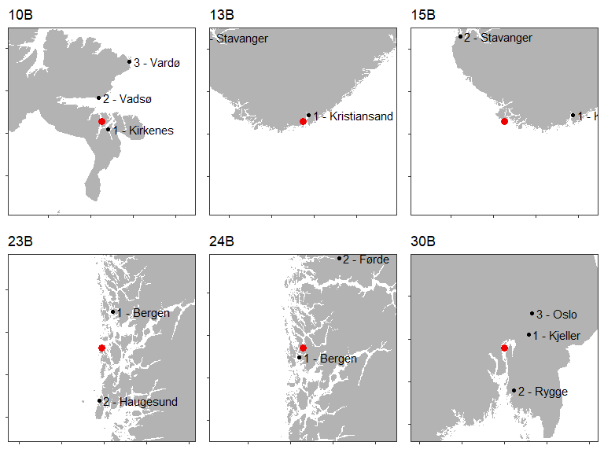
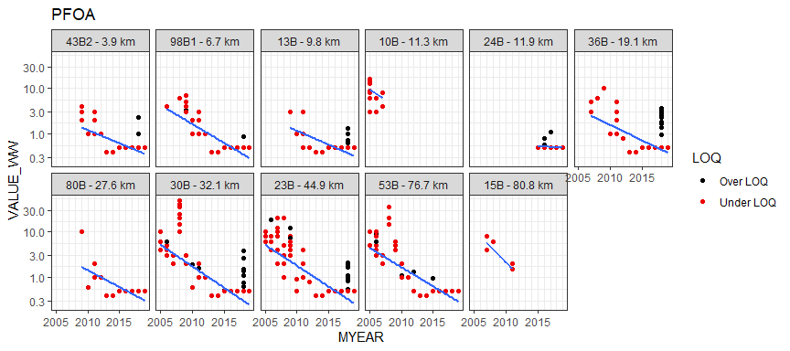
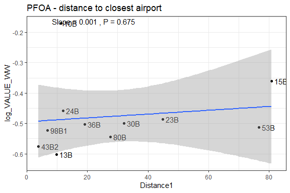
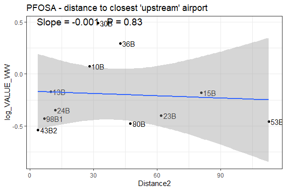
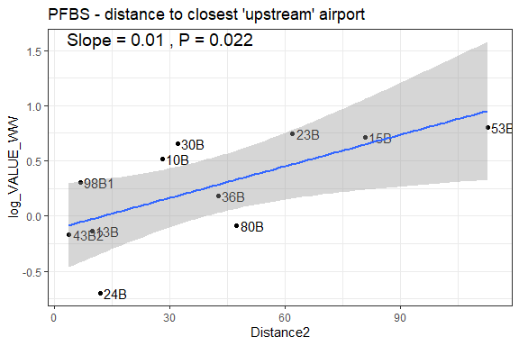
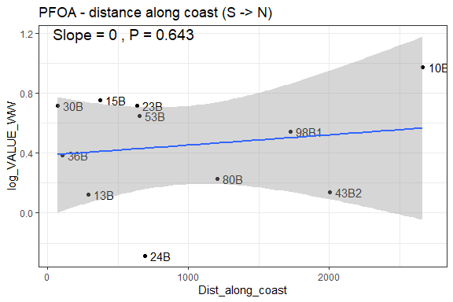
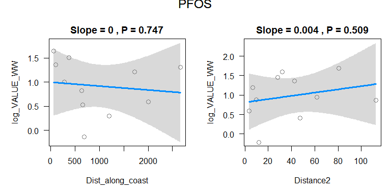

## 1. Packages  

```r
library(dplyr)
library(ggplot2)
library(purrr)
# devtools::install_github("moodymudskipper/safejoin")
library(safejoin)
library(leaflet)

library(knitr)    # for function kable()

library(mapdata)

source("202_Airport_analysis_functions.R")

options(width = 110) # 100 character with for tables etc.
```


## 2. Data  
PFOS PFOSA PFUnDA 
Ta med havner  
Gradient rød - grå - blå  eller lillatone for conc 2019  
PCA for log-transformert + fett + fiskelengde + år + stasjon    

### a1. Read data prepared in script 201   


```r
dat_stations <- readRDS("Data/201_dat_stations.rds")

# Metadata from script 103- contains distance along coast
# Coul also use Station_Name
meta_stations <- readRDS("Data/103_Selected_stations.rds") %>% # View()   
  filter(STATION_CODE %in% unique(dat_stations$STATION_CODE)) %>% 
  select(STATION_CODE, Station_Name, Dist_along_coast) %>%
  group_by(STATION_CODE) %>%
  summarise_all(first)

dat_airports <- readRDS("Data/201_dat_airports.rds")

# "K:/Avdeling/214-Oseanografi/DHJ/Data/Contaminants/Marine/Milkys/"
# dat <- readRDS("K:/Avdeling/214-Oseanografi/DHJ/Data/Contaminants/Marine/Milkys/109_adjusted_data_2020-08-05.rds") %>%
#   filter(MYEAR >= 1994)
dat <- readRDS("Data/201_dat3.rds") %>%
  filter(MYEAR >= 1994 & substr(PARAM, 1, 2) == "PF") %>%
  # Adding Station_Name:
  safe_left_join(meta_stations %>% select(-Dist_along_coast),
                 by = "STATION_CODE", na_matches = "never", check = "bCV")

station_order <- dat %>%
  distinct(STATION_CODE, Dist_along_coast) %>%
  arrange(Dist_along_coast) %>%
  pull(STATION_CODE)

stationname_order <- dat %>%
  distinct(Station_Name, Dist_along_coast) %>%
  arrange(Dist_along_coast) %>%
  pull(Station_Name)

# Set factors for STATION_CODE and Station_Name
dat <- dat %>%
  mutate(STATION_CODE = factor(STATION_CODE, levels = station_order)) %>%
  mutate(Station_Name = factor(Station_Name, levels = stationname_order))

         # Add 'Dist_along_coast'
df_distance <- readRDS("Data/201_df_distance.rds")%>%
  safe_left_join(meta_stations,
                 by = "STATION_CODE", na_matches = "never", check = "bCV")

# Map data

load("../../seksjon 318/Elveovervakning/Data_input/Norway_coastline_longlat2.RData")
map_norway_h <- norway_coast_longlat2
```

### a2 Tables

```r
tab <- dat %>%
  filter(substr(PARAM, 1, 2) == "PF" & MYEAR >= 2005 & TISSUE_NAME %in% "Lever") %>%
  distinct(STATION_CODE, MYEAR, PARAM) %>%
  xtabs(~PARAM + MYEAR, .)

# flextable(tab)
knitr::kable(tab, caption = "Number of stations by substance/year (cod liver only)")

dat %>%
  filter(substr(PARAM, 1, 2) == "PF" & MYEAR >= 2005) %>%
  distinct(STATION_CODE, MYEAR, SAMPLE_NO2) %>%
  xtabs(~STATION_CODE + MYEAR, .) %>%
  knitr::kable(
    caption = 
      "Sample size station/year ('B' stations = cod stations, the rest is blue mussel)")


if (FALSE){
  dat %>%
    filter(STATION_CODE %in% "24B" & MYEAR >= 2005) %>%
    xtabs(~PARAM + MYEAR, .)
}
```


Table: Number of stations by substance/year (cod liver only)

|      | 2005| 2006| 2007| 2008| 2009| 2010| 2011| 2012| 2013| 2014| 2015| 2016| 2017| 2018| 2019|
|:-----|----:|----:|----:|----:|----:|----:|----:|----:|----:|----:|----:|----:|----:|----:|----:|
|PFAS  |    4|    5|    6|    6|    8|    8|    9|    8|    8|    8|    9|    9|    9|    9|    9|
|PFBS  |    4|    5|    6|    6|    8|    8|    9|    8|    8|    8|    9|    9|    9|    0|    0|
|PFDcA |    0|    0|    0|    0|    0|    0|    0|    8|    8|    8|    9|    9|    9|    9|    9|
|PFHpA |    4|    5|    6|    6|    8|    8|    9|    8|    8|    8|    9|    9|    9|    9|    9|
|PFHxA |    4|    5|    6|    6|    8|    8|    9|    8|    8|    8|    9|    9|    9|    9|    9|
|PFHxS |    0|    0|    0|    0|    0|    0|    0|    8|    8|    8|    9|    9|    9|    9|    9|
|PFNA  |    4|    5|    6|    6|    8|    8|    9|    8|    8|    8|    9|    9|    9|    9|    9|
|PFOA  |    4|    5|    6|    6|    8|    8|    9|    8|    8|    8|    9|    9|    9|    9|    9|
|PFOS  |    4|    5|    6|    6|    8|    8|    9|    8|    8|    8|    9|    9|    9|    9|    9|
|PFOSA |    0|    0|    6|    6|    8|    8|    9|    8|    8|    8|    9|    9|    9|    9|    9|
|PFUdA |    0|    0|    0|    0|    0|    0|    0|    8|    8|    8|    9|    9|    9|    9|    9|


Table: Sample size station/year ('B' stations = cod stations, the rest is blue mussel)

|     | 2005| 2006| 2007| 2008| 2009| 2010| 2011| 2012| 2013| 2014| 2015| 2016| 2017| 2018| 2019|
|:----|----:|----:|----:|----:|----:|----:|----:|----:|----:|----:|----:|----:|----:|----:|----:|
|30A  |    0|    0|    0|    0|    0|    0|    0|    0|    0|    0|    0|    0|    3|    3|    3|
|30B  |   17|   22|   21|   23|   20|   25|   25|   13|   16|   15|   12|   15|   12|   10|    5|
|36A1 |    0|    0|    0|    0|    0|    0|    0|    0|    0|    0|    0|    0|    0|    3|    3|
|36B  |    0|    0|   15|    5|   19|   24|   24|   11|   10|   15|   15|   15|   10|   15|    6|
|13B  |    0|    0|    0|    0|   25|   19|   21|    6|   10|   14|   14|   15|   12|    9|   10|
|15B  |    0|    0|   14|    5|    0|    0|   24|    0|    0|    0|    0|    0|    0|    0|    0|
|22A  |    0|    0|    0|    0|    0|    0|    0|    0|    0|    0|    0|    0|    3|    3|    3|
|23B  |   18|   20|   23|   21|   21|   20|   22|   11|   15|   14|   15|   15|   13|   14|   15|
|51A  |    0|    0|    0|    0|    0|    0|    0|    0|    0|    0|    0|    0|    3|    3|    0|
|53B  |   10|   21|   22|    5|   17|   21|   24|   14|    6|    9|   14|   15|   15|   15|   15|
|24B  |    0|    0|    0|    0|    0|    0|    0|    0|    0|    0|   15|   15|   15|   12|   14|
|I241 |    0|    0|    0|    0|    0|    0|    0|    0|    0|    0|    0|    0|    3|    3|    3|
|80B  |    0|    0|    0|    0|   21|    3|   12|   11|   15|   15|   15|   14|   15|   14|   11|
|I969 |    0|    0|    0|    0|    0|    0|    0|    0|    0|    0|    0|    0|    0|    3|    2|
|I965 |    0|    0|    0|    0|    0|    0|    0|    0|    0|    0|    0|    0|    0|    3|    3|
|I964 |    0|    0|    0|    0|    0|    0|    0|    0|    0|    0|    0|    0|    0|    3|    0|
|98B1 |    0|   15|    0|    5|   25|   25|   25|    6|   15|    8|   15|   15|   11|   12|   15|
|98A2 |    0|    0|    0|    0|    0|    0|    0|    0|    0|    0|    0|    0|    3|    3|    3|
|43B2 |    0|    0|    0|    0|   25|   25|   25|   15|   15|   15|   13|   12|   15|   15|   15|
|10B  |   12|    2|    5|    0|    0|    0|    0|    0|    0|    0|    0|    0|    0|    0|    0|
### a3 Define parameters and their order  
Order:  
- First "PFOS", "PFOSA", "PFUdA" (most important)  
- Then acids from 6 carbons (PFHxA) to 10 carbons (PFDcA)  
- Then sulfonates: PFBS (4 carbons() and PFHxS (6 carbons)

```r
# rownames(tab) %>% dput()

# PFAS parameters
# rownames(tab) %>% dput()
# Order:


params <- c("PFOS", "PFOSA", "PFUdA", 
            "PFHxA", "PFHpA", "PFOA", "PFNA", "PFDcA", 
            "PFBS", "PFHxS")

params
```

```
##  [1] "PFOS"  "PFOSA" "PFUdA" "PFHxA" "PFHpA" "PFOA"  "PFNA"  "PFDcA" "PFBS"  "PFHxS"
```

### a4. Detection frequency    
Since 2005  

```r
dat %>%
  filter(substr(PARAM, 1, 2) == "PF" & MYEAR >= 2005 & TISSUE_NAME %in% "Lever") %>%
  mutate(PARAM = factor(PARAM, levels = params)) %>%
  group_by(PARAM) %>%
  summarise(Percentage_detection = 100*mean(is.na(FLAG1)) %>% round(3), .groups = "drop") %>%
  kable(caption = "Percentage detection (cod liver only)" )

dat %>%
  filter(substr(PARAM, 1, 2) == "PF" & MYEAR >= 2005 & TISSUE_NAME %in% "Lever") %>%
  mutate(PARAM = factor(PARAM, levels = params)) %>%
  group_by(PARAM, MYEAR) %>%
  summarise(Percentage_detection = 100*mean(is.na(FLAG1)) %>% round(3), .groups = "drop") %>%
  tidyr::pivot_wider(values_from = "Percentage_detection", names_from = "MYEAR")  %>%
  kable(caption = "Percentage detection per year (cod liver only)" )
```


Table: Percentage detection (cod liver only)

|PARAM | Percentage_detection|
|:-----|--------------------:|
|PFOS  |                 91.1|
|PFOSA |                 70.5|
|PFUdA |                 45.1|
|PFHxA |                  1.5|
|PFHpA |                  1.4|
|PFOA  |                  3.3|
|PFNA  |                  5.3|
|PFDcA |                 13.1|
|PFBS  |                  1.8|
|PFHxS |                  0.8|
|NA    |                 92.4|


Table: Percentage detection per year (cod liver only)

|PARAM | 2005| 2006| 2007| 2008| 2009| 2010| 2011| 2012|  2013|  2014|  2015|  2016|  2017| 2018| 2019|
|:-----|----:|----:|----:|----:|----:|----:|----:|----:|-----:|-----:|-----:|-----:|-----:|----:|----:|
|PFOS  | 75.4| 76.2| 56.2| 95.3| 86.7| 98.8| 87.6| 78.2|  97.1| 100.0| 100.0|  99.2| 100.0| 99.1| 99.1|
|PFOSA |   NA|   NA| 27.0| 73.4| 30.6| 38.9| 49.5| 74.7| 100.0| 100.0|  95.3|  98.5|  91.5| 87.9| 93.4|
|PFUdA |   NA|   NA|   NA|   NA|   NA|   NA|   NA| 19.5|  39.2|  33.3|  71.9|  36.6|  55.9| 46.6| 50.0|
|PFHxA |  0.0|  2.5|  0.0|  0.0|  3.5|  0.0|  0.0|  1.1|   0.0|   0.0|   0.8|   5.3|   3.4|  4.3|  0.0|
|PFHpA |  0.0|  0.0|  0.0|  3.1|  0.6|  0.0|  0.0|  0.0|   0.0|   0.0|   0.0|   0.8|   1.7| 15.5|  0.0|
|PFOA  |  0.0|  5.1|  0.0|  0.0|  2.7|  1.2|  0.5|  1.1|   0.0|   0.0|   1.6|   3.8|   0.8| 31.0|  0.0|
|PFNA  |  0.0|  2.5|  0.0|  0.0|  1.2| 21.6|  6.4| 19.5|   3.9|   0.0|   4.7|   3.8|   0.0|  6.0|  0.0|
|PFDcA |   NA|   NA|   NA|   NA|   NA|   NA|   NA| 13.8|  19.6|   1.0|  16.4|   5.3|   7.6| 15.5| 27.4|
|PFBS  |  0.0|  0.0|  0.0|  3.1|  1.2|  0.0|  0.0|  0.0|   8.8|   0.0|   0.0|   0.8|  11.0|   NA|   NA|
|PFHxS |   NA|   NA|   NA|   NA|   NA|   NA|   NA|  2.3|   0.0|   0.0|   2.3|   1.5|   0.0|  0.0|  0.0|
|NA    | 75.4| 76.2| 65.0| 95.3| 87.3| 98.8| 90.1| 83.9| 100.0| 100.0| 100.0| 100.0| 100.0| 99.1| 99.1|


### b1. Map data

```r
# MAp data (Norway w/o Svalbard + Jan Mayen)
test <- maps::map("worldHires", "Norway", plot = FALSE)   # map data for Norway - this is just to get region names

sel <- grepl("Svalbard", test$names) | 
  test$names == "Norway:Jan Mayen" |
  test$names == "Norway:Bouvet Island"                   # select Svalbard + Jan Mayen
map <- maps::map("worldHires", test$names[!sel], exact = TRUE, plot = FALSE)  # Norway w/o Svalbard + Jan Mayen
map_df <- data.frame(Longitude = map$x, Latitude = map$y)

#
# Add UTM coordinates (x and y) to map
#
crs_longlat <- "+proj=longlat +ellps=WGS84 +datum=WGS84"
crs_utm <- "+proj=utm +zone=33 +ellps=WGS84 +datum=WGS84 +units=m"

coordinate_exists <- !is.na(map_df$Longitude)   # sp doesn't like NAs
SP <- sp::SpatialPoints(map_df[coordinate_exists, c("Longitude", "Latitude")],
                    proj4string = sp::CRS(crs_longlat))
SP.UTM <- sp::spTransform(SP, sp::CRS(crs_utm))
# Add transformed coords to data set
map_df$x[coordinate_exists] <- SP.UTM@coords[,1]
map_df$y[coordinate_exists] <- SP.UTM@coords[,2]

cat("'map_df' created")
```

```
## 'map_df' created
```

```r
if (FALSE){
  maps::map("worldHires", test$names[!sel],
          xlim = c(8,12), ylim = c(58,60),
          col = "gray", fill = TRUE)

}
```

### b2. Yet another background map  

```r
# Background map ----
library(sf)
```

```
## Linking to GEOS 3.8.0, GDAL 3.0.4, PROJ 6.3.1
```

```r
nc_norway <- st_read("K:/Kart/N1000/norge2.shp")
```

```
## Reading layer `norge2' from data source `K:\Kart\N1000\norge2.shp' using driver `ESRI Shapefile'
## Simple feature collection with 2030 features and 4 fields
## geometry type:  POLYGON
## dimension:      XY
## bbox:           xmin: -75844 ymin: 6449504 xmax: 1114610 ymax: 7939790
## CRS:            NA
```

```r
st_crs(nc_norway) <- "+proj=utm +zone=33 +datum=WGS84 +units=m +no_defs"  # set coordinate system

data_norway <- nc_norway %>%
  st_coordinates() %>%                                  # get coordinates only
  as.data.frame()


if (FALSE){

  # plot UTM
  ggplot() +
    geom_polygon(data = data_norway, aes(X, Y, group = interaction(L1, L2)), fill = "grey30") +
    coord_fixed(xlim = c(2, 3)*1E5,  ylim = c(65, 66.8)*1E5)
  
}
```


### c. Distance to airport        
**Distance1** = closest airport  
**Distance2** = closest 'upstream' airport (assuming Norwegian Coastal current going along the coast)  
**Dist_along_coast** = Distance along coast  

```r
df_distance %>% 
  mutate(Distance1 = round(Distance1, 1),
         Distance2 = round(Distance2, 1),
         Dist_along_coast = round(Dist_along_coast, 1)
         ) %>%
  select(-STATION_CODE) %>%
  select(Station_Name, everything()) %>%
  arrange(Dist_along_coast) %>%
  kable()
```


|Station_Name                  | Distance1|Airport1                       | Distance2|Airport2                      | Dist_along_coast|
|:-----------------------------|---------:|:------------------------------|---------:|:-----------------------------|----------------:|
|Inner Oslofjord               |      32.1|Kjeller flyplass               |      32.1|Kjeller flyplass              |             69.1|
|Tjøme, Outer Oslofjord        |      19.1|Sandefjord lufthavn, Torp      |      42.7|Rygge lufthavn                |            104.7|
|Kristiansand harbour area     |       9.8|Kristiansand lufthavn, Kjevik  |       9.8|Kristiansand lufthavn, Kjevik |            287.1|
|Skågskjera, Farsund           |      80.8|Kristiansand lufthavn, Kjevik  |      80.8|Kristiansand lufthavn, Kjevik |            372.9|
|Bømlo, Outer Selbjørnfjord    |      44.9|Bergen lufthavn, Flesland      |      62.0|Haugesund lufthavn, Karmøy    |            633.7|
|Inner Sørfjord                |      76.7|Bergen lufthavn, Flesland      |     112.7|Haugesund lufthavn, Karmøy    |            653.8|
|Bergen harbour area           |      11.9|Bergen lufthavn, Flesland      |      11.9|Bergen lufthavn, Flesland     |            691.6|
|Trondheim harbour             |      27.6|Trondheim lufthavn, Værnes     |      47.5|Ørland lufthavn               |           1205.5|
|Austnesfjord, Lofoten         |       6.7|Svolvær lufthavn, Helle        |       6.7|Svolvær lufthavn, Helle       |           1723.9|
|Tromsø harbour area           |       3.9|Tromsø lufthavn, Langnes       |       3.9|Tromsø lufthavn, Langnes      |           2003.7|
|Kjøfjord, Outer Varangerfjord |      11.3|Kirkenes lufthavn, Høybuktmoen |      28.1|Vadsø lufthavn                |           2665.4|

### d. Plot cod stations + airports    

```r
plots <- purrr::map(1:6, ~plot_closest(., dat_stations, dat_airports))
gg <- cowplot::plot_grid(plotlist = plots, nrow = 2)
ggsave("Figures/202_codstations_airports_01.png", gg, dpi = 500, width = 8, height = 6)
gg
```

<!-- -->

```r
plots <- purrr::map(7:11, ~plot_closest(., dat_stations, dat_airports))
gg <- cowplot::plot_grid(plotlist = plots, nrow = 2)
ggsave("Figures/202_codstations_airports_02.png", gg, dpi = 500, width = 8, height = 6)
gg
```

<!-- -->

### e. Leaflet map  

```r
df <- dat %>%
  filter(PARAM %in% params & TISSUE_NAME %in% c("Lever", "Whole soft body")) %>% 
  distinct(STATION_CODE, TISSUE_NAME, Lon, Lat, MYEAR) %>%
  count(STATION_CODE, TISSUE_NAME, Lon, Lat)

icons_stations <- awesomeIcons(
  icon = 'ios-close',
  iconColor = 'black',
  library = 'ion',
  markerColor = case_when(
    df$TISSUE_NAME == "Whole soft body" ~ "orange",
    df$TISSUE_NAME == "Muskel" ~ "red")
)

icons_stations <- awesomeIcons(
  icon = 'ios-close',
  iconColor = 'black',
  library = 'ion',
  markerColor = case_when(
    df$TISSUE_NAME == "Whole soft body" ~ "orange",
    df$TISSUE_NAME == "Muskel" ~ "red")
)


leaflet(df) %>%
  addTiles() %>%
  addAwesomeMarkers(~Lon, ~Lat, icon = icons_stations,
                    label =  ~STATION_CODE) %>%
  addMarkers(~dat_airports$Lon, ~dat_airports$Lat,
             label = ~dat_airports$LUFTHAVN)
```

<!--html_preserve--><div id="htmlwidget-dcd5a61cbf4ca0c6bc5e" style="width:672px;height:480px;" class="leaflet html-widget"></div>
<script type="application/json" data-for="htmlwidget-dcd5a61cbf4ca0c6bc5e">{"x":{"options":{"crs":{"crsClass":"L.CRS.EPSG3857","code":null,"proj4def":null,"projectedBounds":null,"options":{}}},"calls":[{"method":"addTiles","args":["//{s}.tile.openstreetmap.org/{z}/{x}/{y}.png",null,null,{"minZoom":0,"maxZoom":18,"tileSize":256,"subdomains":"abc","errorTileUrl":"","tms":false,"noWrap":false,"zoomOffset":0,"zoomReverse":false,"opacity":1,"zIndex":1,"detectRetina":false,"attribution":"&copy; <a href=\"http://openstreetmap.org\">OpenStreetMap<\/a> contributors, <a href=\"http://creativecommons.org/licenses/by-sa/2.0/\">CC-BY-SA<\/a>"}]},{"method":"addAwesomeMarkers","args":[[59.881445,59.81466,59.07357,59.0405,58.13283,58.05138,59.58503,59.89562,60.08406,60.09727,60.39664,60.40077,63.44563,66.28017,66.311835,66.318835,68.19655,68.2500566666667,69.653,69.81623],[10.7118325,10.550915,10.42522,10.43583,7.9885,6.7469,5.145465,5.10856,6.550725,6.53972,5.27069,5.30396,10.37173,14.041835,14.12558,14.12783,14.77182,14.66412,18.974,29.7602],{"icon":"ios-close","markerColor":["orange",null,"orange",null,null,null,"orange",null,"orange",null,null,"orange",null,"orange","orange","orange",null,"orange",null,null],"iconColor":"black","spin":false,"squareMarker":false,"iconRotate":0,"font":"monospace","prefix":"ion"},null,null,{"interactive":true,"draggable":false,"keyboard":true,"title":"","alt":"","zIndexOffset":0,"opacity":1,"riseOnHover":false,"riseOffset":250},null,null,null,null,["30A","30B","36A1","36B","13B","15B","22A","23B","51A","53B","24B","I241","80B","I969","I965","I964","98B1","98A2","43B2","10B"],{"interactive":false,"permanent":false,"direction":"auto","opacity":1,"offset":[0,0],"textsize":"10px","textOnly":false,"className":"","sticky":true},null]},{"method":"addMarkers","args":[[62.562442300136,69.2923636384536,69.9760866626319,61.3911970132576,65.4611583429508,67.2692037306637,60.2935221029275,70.6002426323389,70.8715254224912,58.2039534719452,69.0557572668769,68.4888501232388,61.015507969746,61.5836438171391,60.2028026662543,59.3431967253065,70.6796393718063,70.4866749551428,71.0096838068534,63.1120543821714,69.7250613291136,68.1526060521181,71.0296821632053,62.7448053692152,65.7836904302676,70.066709827851,64.4722593536315,62.1800354262192,66.3639052141585,59.3739247861321,64.8384340497634,62.5790253016167,67.5276439062386,78.2461377680614,61.8300617115268,59.1866102680746,61.1562440961903,68.2434639670196,68.5807179834295,69.7866566401735,70.3553928292949,65.9597162980189,69.6815149013993,63.4575940814622,70.0652212217176,67.6545601082429,58.8767852732629,63.6990059003549,59.9713471579092],[6.11963898420366,16.1440466836385,23.3715483912421,5.7568797676059,12.2175403780271,14.3652513475074,5.21808739723801,29.6926352826329,29.0342050491188,8.08502194377201,18.540354130543,16.6783876882033,9.28809002619649,5.02464515428134,11.0840076879249,5.21251653812648,23.6685933738794,22.1397449427819,25.9837373551497,7.82614853346835,29.8877051748598,13.609495413667,27.8266824330749,7.26261718585913,13.2151776348384,24.9739856091401,11.5786622119018,6.07425072535586,14.3014084190681,10.8037964465011,11.1460150645572,11.3449828102082,12.103252190896,15.4654707178335,6.10571943108594,10.2601584466019,7.13785445077997,14.6690500048898,15.0262004523478,20.959700200385,31.0448875700596,12.4722199307694,18.9177192359496,10.9241890696644,29.844760661415,12.7270586786671,5.63783064933377,9.60401416275706,11.0327493185118],null,null,null,{"interactive":true,"draggable":false,"keyboard":true,"title":"","alt":"","zIndexOffset":0,"opacity":1,"riseOnHover":false,"riseOffset":250},null,null,null,null,["Ålesund lufthavn, Vigra","Andøya lufthavn, Andenes","Alta lufthavn","Førde lufthamn, Bringeland","Brønnøysund lufthavn, Brønnøy","Bodø lufthavn","Bergen lufthavn, Flesland","Båtsfjord lufthavn","Berlevåg lufthavn","Kristiansand lufthavn, Kjevik","Bardufoss lufthavn","Harstad/Narvik lufthavn, Evenes","Fagernes lufthavn, Leirin","Florø lufthamn","Oslo lufthavn, Gardermoen","Haugesund lufthavn, Karmøy","Hammerfest lufthavn","Hasvik lufthavn","Honningsvåg lufthavn, Valan","Kristiansund lufthavn, Kvernberget","Kirkenes lufthavn, Høybuktmoen","Leknes lufthavn","Mehamn lufthavn","Molde lufthavn, Årø","Mosjøen lufthavn, Kjærstad","Lakselv lufthavn, Banak","Namsos lufthavn","Ørsta/Volda lufthamn, Hovden","Mo i Rana lufthavn, Røssvoll","Rygge lufthavn","Rørvik lufthavn, Ryum","Røros lufthavn","Røst lufthavn","Svalbard lufthavn, Longyear","Sandane lufthamn, Anda","Sandefjord lufthavn, Torp","Sogndal lufthamn, Haukåsen","Svolvær lufthavn, Helle","Stokmarknes lufthavn, Skagen","Sørkjosen lufthavn","Vardø lufthavn, Svartnes","Sandnessjøen lufthavn, Stokka","Tromsø lufthavn, Langnes","Trondheim lufthavn, Værnes","Vadsø lufthavn","Værøy helikopterplass","Stavanger lufthavn, Sola","Ørland lufthavn","Kjeller flyplass"],{"interactive":false,"permanent":false,"direction":"auto","opacity":1,"offset":[0,0],"textsize":"10px","textOnly":false,"className":"","sticky":true},null]}],"limits":{"lat":[58.05138,78.2461377680614],"lng":[5.02464515428134,31.0448875700596]}},"evals":[],"jsHooks":[]}</script><!--/html_preserve-->

### f1. Plot cod liver PFAS time series    
Stations are arranged by distance to airport    
**Urban stations** are 30B Oslo (inner Oslofjord), 53B Bergen harbour and 43B2 Tromsø harbour  

```r
for (param in params){
  
  gg <- dat %>%
    filter(PARAM %in% param & TISSUE_NAME %in% "Lever") %>%
    arrange(Distance1) %>%
    mutate(Distance_f = 
             as.factor(paste0(STATION_CODE, " - ", round(Distance1, 1), " km")), 
           STATION_CODE = forcats::fct_inorder(Distance_f),
           LOQ = case_when(
             !is.na(FLAG1) ~ "Under LOQ",  
             is.na(FLAG1) ~ "Over LOQ")
           ) %>%
    ggplot(aes(MYEAR, VALUE_WW)) +
    geom_point(aes(color = LOQ)) +
    geom_smooth(method = "lm", formula = 'y~x', se = FALSE) +
    scale_y_log10() +
    scale_x_continuous(breaks = seq(2005,2020,5), minor_breaks = 2005:2020) +
    scale_color_manual(values = c("black", "red2")) +
    facet_wrap(vars(STATION_CODE), nrow = 2) +
    theme_bw() +
    labs(title = param)
  
  print(gg)
}
```

<!-- --><!-- --><!-- --><!-- --><!-- --><!-- --><!-- --><!-- --><!-- --><!-- -->


### f2. Time trends of PFAS in cod liver        
Order = from Oslofjord (30B) to Tromsø (43B2)  
**Urban stations** are 30B Oslo (inner Oslofjord), 53B Bergen harbour and 43B2 Tromsø harbour  


```r
library(broom)
get_reg_coef <- function(df) {
  lm <- lm(log_VALUE_WW ~ MYEAR, data = df)
  tidy(lm) %>%
    filter(term == "MYEAR") %>%
    mutate(PARAM = df$PARAM[1], 
           STATION_CODE = df$STATION_CODE[1],
           N_years = length(unique(df$MYEAR)))
}

results <- dat %>%
  filter(PARAM %in% params & TISSUE_NAME %in% "Lever") %>%
  mutate(log_VALUE_WW = log10(VALUE_WW),
         PARAM = factor(PARAM, levels = params)) %>%
  group_by(PARAM, STATION_CODE) %>%
  group_split() %>%
  map_df(~get_reg_coef(.))

results %>%
  select(PARAM, STATION_CODE, estimate) %>%
  mutate(estimate = round(estimate, 4)) %>%
  tidyr::pivot_wider(names_from = STATION_CODE, values_from = estimate) %>%
  kable(caption = "Slope of time regression (log10-transformed w.w. concentration)")
```


Table: Slope of time regression (log10-transformed w.w. concentration)

|PARAM |     30B|     36B|     13B|     15B|     23B|     53B|     24B|     80B|    98B1|    43B2|     10B|
|:-----|-------:|-------:|-------:|-------:|-------:|-------:|-------:|-------:|-------:|-------:|-------:|
|PFOS  | -0.1005| -0.0974| -0.1073| -0.2290| -0.0719| -0.0777| -0.0379| -0.0814| -0.1080| -0.1101|  0.6415|
|PFOSA | -0.0476| -0.0039| -0.0731| -0.1214| -0.0932| -0.1049|  0.0025| -0.0661| -0.0832| -0.1386|      NA|
|PFUdA | -0.0142|  0.0077| -0.0167|      NA| -0.0164| -0.0062| -0.0215| -0.0119| -0.0298| -0.0221|      NA|
|PFHxA | -0.1176| -0.0763| -0.0384| -0.3449| -0.1088| -0.1020| -0.0047| -0.0558| -0.0863| -0.0281| -0.0385|
|PFHpA | -0.0910| -0.0486| -0.0374| -0.2670| -0.0772| -0.0897|  0.0000| -0.0482| -0.0539| -0.0287| -0.1167|
|PFOA  | -0.0942| -0.0664| -0.0611| -0.1410| -0.0918| -0.0846| -0.0023| -0.0745| -0.0830| -0.0584| -0.0896|
|PFNA  | -0.0897| -0.0654| -0.0510| -0.2633| -0.0793| -0.0728|  0.0000| -0.0540| -0.0593| -0.0368|  0.0456|
|PFDcA |  0.0022|  0.0257|  0.0019|      NA|  0.0170| -0.0007|  0.0000| -0.0108| -0.0182| -0.0113|      NA|
|PFBS  | -0.1466| -0.1278| -0.1086| -0.3474| -0.1570| -0.1605|  0.0000| -0.1141| -0.1213| -0.1030|  0.0668|
|PFHxS | -0.0553| -0.0417| -0.0271|      NA| -0.0336| -0.0481|  0.0000| -0.0438| -0.0379| -0.0647|      NA|

```r
results %>%
  select(PARAM, STATION_CODE, p.value) %>%
  mutate(p.value = round(p.value, 4)) %>%
  tidyr::pivot_wider(names_from = STATION_CODE, values_from = p.value) %>%
  kable(caption = "P-value of time regression (log10-transformed w.w. concentration)")
```


Table: P-value of time regression (log10-transformed w.w. concentration)

|PARAM |    30B|    36B|    13B| 15B|    23B|    53B|    24B|    80B| 98B1|   43B2|    10B|
|:-----|------:|------:|------:|---:|------:|------:|------:|------:|----:|------:|------:|
|PFOS  | 0.0000| 0.0000| 0.0000|   0| 0.0000| 0.0000| 0.0222| 0.0000|    0| 0.0000| 0.0000|
|PFOSA | 0.0000| 0.6540| 0.0000|   0| 0.0000| 0.0000| 0.9099| 0.0000|    0| 0.0000|     NA|
|PFUdA | 0.2884| 0.3611| 0.0521|  NA| 0.0131| 0.5101| 0.0617| 0.0846|    0| 0.0000|     NA|
|PFHxA | 0.0000| 0.0000| 0.0004|   0| 0.0000| 0.0000| 0.2898| 0.0000|    0| 0.0027| 0.1187|
|PFHpA | 0.0000| 0.0000| 0.0005|   0| 0.0000| 0.0000| 0.1752| 0.0000|    0| 0.0021| 0.0002|
|PFOA  | 0.0000| 0.0000| 0.0000|   0| 0.0000| 0.0000| 0.5715| 0.0000|    0| 0.0000| 0.1323|
|PFNA  | 0.0000| 0.0000| 0.0000|   0| 0.0000| 0.0000| 0.1752| 0.0000|    0| 0.0000| 0.5806|
|PFDcA | 0.8238| 0.0000| 0.6488|  NA| 0.0000| 0.8610| 0.1752| 0.0073|    0| 0.0061|     NA|
|PFBS  | 0.0000| 0.0000| 0.0000|   0| 0.0000| 0.0000|    NaN| 0.0000|    0| 0.0000| 0.2862|
|PFHxS | 0.0000| 0.0000| 0.0000|  NA| 0.0000| 0.0000| 0.1752| 0.0000|    0| 0.0000|     NA|

```r
results %>%
  filter(N_years >= 4) %>%
  ggplot(aes(STATION_CODE, estimate)) +
  geom_hline(aes(yintercept = 0)) +
  geom_pointrange(aes(ymin = estimate - 2*std.error, ymax = estimate + 2*std.error)) +
  facet_wrap(vars(PARAM)) +
  theme(axis.text.x = element_text(angle = -45, hjust = 0)) +
  labs(title = "Slope of time regression (log10-transformed w.w. concentration)", 
       subtitle = "Range = conf.int. Only series of >= 4 years included")
```

<!-- -->

### g. Plot PFASs against each other      
Stations are arranged by distance to airport  

```r
df_wide <- dat %>%
  filter(PARAM %in% params & TISSUE_NAME %in% "Lever") %>%
  mutate(log_value = VALUE_WW) %>%
  select(PARAM, MYEAR, STATION_CODE, SAMPLE_NO2, log_value) %>%
  tidyr::pivot_wider(names_from = "PARAM", values_from = "log_value")

df_wide %>%
  select(-MYEAR, -SAMPLE_NO2, -STATION_CODE) %>%
  plot()
```

<!-- -->

```r
df_wide %>%
  select(-MYEAR, -SAMPLE_NO2, -STATION_CODE) %>%
  cor(use = "pairwise.complete.obs") %>%
  round(2) %>%
  kable(caption = "Correlation matrix (cod liver only)")
```


Table: Correlation matrix (cod liver only)

|      | PFBS| PFHpA| PFHxA| PFNA| PFOA| PFOS| PFOSA| PFDcA| PFHxS| PFUdA|
|:-----|----:|-----:|-----:|----:|----:|----:|-----:|-----:|-----:|-----:|
|PFBS  | 1.00|  0.28|  0.44| 0.52| 0.82| 0.25|  0.16|  0.20|  0.23|  0.16|
|PFHpA | 0.28|  1.00|  0.36| 0.34| 0.27| 0.10|  0.07|  0.00| -0.01| -0.02|
|PFHxA | 0.44|  0.36|  1.00| 0.48| 0.43| 0.32|  0.12|  0.08| -0.35| -0.13|
|PFNA  | 0.52|  0.34|  0.48| 1.00| 0.69| 0.28|  0.17|  0.33|  0.52|  0.13|
|PFOA  | 0.82|  0.27|  0.43| 0.69| 1.00| 0.30|  0.18|  0.43|  0.32|  0.23|
|PFOS  | 0.25|  0.10|  0.32| 0.28| 0.30| 1.00|  0.22|  0.54|  0.10|  0.59|
|PFOSA | 0.16|  0.07|  0.12| 0.17| 0.18| 0.22|  1.00|  0.33|  0.04|  0.34|
|PFDcA | 0.20|  0.00|  0.08| 0.33| 0.43| 0.54|  0.33|  1.00|  0.34|  0.63|
|PFHxS | 0.23| -0.01| -0.35| 0.52| 0.32| 0.10|  0.04|  0.34|  1.00|  0.31|
|PFUdA | 0.16| -0.02| -0.13| 0.13| 0.23| 0.59|  0.34|  0.63|  0.31|  1.00|


### h. Box plot  


## 3. Analysis I - estimated concentration in 2019 {.tabset}     
Assuming that all time series are declining equally fast (on log scale) - see previous graphs   
Log wet weight concentration estimated for 2019   
**Urban stations** are 30B Oslo (inner Oslofjord), 53B Bergen harbour and 43B2 Tromsø harbour  


### a. Distance to closest airport   

```r
# result <- get_estimates_parallel(param = "PFOS", dat, df_distance)

for (param in params){
  plot_estimates(param = param, dat, df_distance, 
                 analysis = "parallel",
                 distance_measure = "Distance1") %>%
    print()
  }
```

<!-- --><!-- --><!-- --><!-- --><!-- --><!-- --><!-- --><!-- --><!-- --><!-- -->

### b. Distance to closest 'upstream' airport     

```r
# result <- get_estimates_parallel(param = "PFOS", dat, df_distance)

for (param in params){
  plot_estimates(param = param, dat, df_distance, 
                 analysis = "parallel",
                 distance_measure = "Distance2") %>%
    print()
  }
```

<!-- --><!-- --><!-- --><!-- --><!-- --><!-- --><!-- --><!-- --><!-- --><!-- -->


## 4. Analysis II - analysis of max measured concentration {.tabset}     
Regression assuming independent chance over time for each station  
Log w.w. concentration estimated for the year with highest concentration    
**Urban stations** are 30B Oslo (inner Oslofjord), 53B Bergen harbour and 43B2 Tromsø harbour  

### a. Estimates     
The red dot is Log w.w. concentration estimated for the year with highest concentration  

```r
for (param in params){
  
  result <- get_estimates_max(param = param, dat, df_distance)
  # result$anova
  
  gg <- dat %>%
    filter(PARAM %in% param & TISSUE_NAME %in% "Lever") %>%
    mutate(log_VALUE_WW = log10(VALUE_WW)) %>% # select(MYEAR, log_VALUE_WW, STATION_CODE)
    ggplot(aes(MYEAR, log_VALUE_WW)) +
    geom_point() +
    geom_smooth(method = "lm", formula = 'y ~ x', se = FALSE) +
    geom_point(data = result$estimates, color = "red2") +
    scale_x_continuous(breaks = seq(2005,2020,5), minor_breaks = 2005:2020) +
    facet_wrap(vars(STATION_CODE), nrow = 2) +
    theme_bw() +
    labs(title = param)
  print(gg)
  
}
```

```
## Warning in predict.lm(mod2, df_estimates, se.fit = TRUE): prediction from a rank-deficient fit may be
## misleading
```

<!-- --><!-- --><!-- --><!-- --><!-- --><!-- --><!-- --><!-- --><!-- --><!-- -->

### b. Closest airport     


```r
for (param in params){
  plot_estimates(param = param, dat, df_distance, 
                 analysis = "max",
                 distance_measure = "Distance1") %>%
    print()
  }
```

```
## Warning in predict.lm(mod2, df_estimates, se.fit = TRUE): prediction from a rank-deficient fit may be
## misleading
```

<!-- --><!-- --><!-- --><!-- --><!-- --><!-- --><!-- --><!-- --><!-- --><!-- -->

### c. Closest 'upstream' airport     

```r
# result <- get_estimates_parallel(param = "PFOS", dat, df_distance)

for (param in params){
  plot_estimates(param = param, dat, df_distance, 
                 analysis = "max",
                 distance_measure = "Distance2") %>%
    print()
  }
```

```
## Warning in predict.lm(mod2, df_estimates, se.fit = TRUE): prediction from a rank-deficient fit may be
## misleading
```

<!-- --><!-- --><!-- --><!-- --><!-- --><!-- --><!-- --><!-- --><!-- --><!-- -->


### d. Distance along coast       

```r
# result <- get_estimates_parallel(param = "PFOS", dat, df_distance)

for (param in params){
  plot_estimates(param = param, dat, df_distance, 
                 analysis = "max",
                 distance_measure = "Dist_along_coast") %>%
    print()
  }
```

```
## Warning in predict.lm(mod2, df_estimates, se.fit = TRUE): prediction from a rank-deficient fit may be
## misleading
```

<!-- --><!-- --><!-- --><!-- --><!-- --><!-- --><!-- --><!-- --><!-- --><!-- -->

### e. Coast distance + Upstream airport  

```r
# result <- get_estimates_parallel(param = "PFOS", dat, df_distance)

for (param in params){
  plot_estimates(param = param, dat, df_distance, 
                 analysis = "max",
                 distance_measure = "Dist_along_coast_Dist2")
  }
```

```
## Warning in predict.lm(mod2, df_estimates, se.fit = TRUE): prediction from a rank-deficient fit may be
## misleading
```

<!-- --><!-- --><!-- --><!-- --><!-- --><!-- --><!-- --><!-- --><!-- --><!-- -->

## 5. Boxplots  
Note:   
- 2009 were lacking for 2009 data were lacking for 13B and 15B, where we used 2007 (13B) and 2007-08 (15B)  
- For PFUdA there is no 2009 data (or perhaps they are in the database, if I dig a little?).  
    - So we use 2012-2014 vs 2018-19 for PFUdA   
- Stations are ordered following their position along the coast (that can be changed)    
- EQS added for PFOS. No EQS for PFOSA (PFOA has EQS = 91)

```r
plot1 <- function(param, data){
  data %>%
    filter(PARAM %in% param & TISSUE_NAME %in% "Lever") %>%
    mutate(Year = case_when(
      STATION_CODE %in% "13B" & MYEAR %in% 2007 ~ "2009",
      STATION_CODE %in% "15B" & MYEAR %in% 2006:2007 ~ "2009",
      MYEAR %in% 2009 ~ "2009",
      MYEAR %in% 2019 ~ "2019",
      TRUE ~ as.character(NA))
    ) %>%
    filter(!is.na(Year)) %>%
    ggplot(aes(Station_Name, VALUE_WW)) +
    geom_boxplot(aes(fill = Year), position = position_dodge2(preserve = "single")) +
    theme(axis.text.x = element_text(angle = -30, hjust = 0)) +
    labs(title = param,
         caption = "Note: 2009 data were lacking for 13B and 15B, where we used 2007 (13B) and 2007-08 (15B)")
}

plot2 <- function(param, data){
  data %>%
    filter(PARAM %in% param & TISSUE_NAME %in% "Lever") %>%
    mutate(Year = case_when(
      MYEAR %in% 2012:2014 ~ "2012-2014",
      MYEAR %in% 2018:2019 ~ "2018-2019",
      TRUE ~ as.character(NA))
    ) %>%
    filter(!is.na(Year)) %>%
    ggplot(aes(Station_Name, VALUE_WW)) +
    geom_boxplot(aes(fill = Year), position = position_dodge2(preserve = "single")) +
    scale_fill_brewer(palette = "Set3") +
    theme(axis.text.x = element_text(angle = -30, hjust = 0)) +
    labs(title = param)
}

gg1 <- plot1("PFOS", data = dat)
gg2 <- plot1("PFOSA", data = dat)
gg3 <- plot2("PFUdA", data = dat)
# gg1 
# gg2
# gg3
gg1 + 
  geom_hline(aes(yintercept = 9.1), color = "red2", linetype = 2) +
  scale_y_log10(sec.axis = sec_axis(~ ., breaks = 9.1, labels = function(x) "EQS")) +
  theme(axis.text.y.right = element_text(color = "red2", size = rel(1.5)))
```

```
## Warning in min(x): no non-missing arguments to min; returning Inf
```

```
## Warning in max(x): no non-missing arguments to max; returning -Inf
```

<!-- -->

```r
gg2 + scale_y_log10()
```

<!-- -->

```r
gg3 + scale_y_log10()
```

<!-- -->

## 6. Map   


```r
for (param in c("PFOS", "PFOSA", "PFUdA")){
   # param <- "PFOS"  

  df <- dat %>%
    filter(PARAM %in% param & TISSUE_NAME %in% "Lever" & MYEAR >= 2011 & !is.na(VALUE_WW)) %>% #View()
    group_by(STATION_CODE, Lon, Lat) %>% #View()
    mutate(Last_year = max(MYEAR)) %>% #View()
    filter(MYEAR == Last_year) %>% #View()
    summarise(
      `Concentration last year` = median(VALUE_WW),
      Last_year = first(Last_year),
      .groups = "drop") %>% # View()
    mutate(
      textside = case_when(
        STATION_CODE %in% c("30B", "36B", "13B", "53B") ~ "right",
        TRUE ~ "left"),
      # For adding the "(2011)" under 15B label
      last_year_comment = case_when(
        Last_year < 2019 ~ paste0("(", Last_year, ")"),
        TRUE ~ "")
    ) # %>%  View()
  gg <- ggplot(df) +
    annotation_map(map_norway_h, aes(long, lat), fill = terrain.colors(10)[7]) +
    geom_point(aes(Lon, Lat, fill = `Concentration last year`), pch = 21, size = rel(3)) +
    geom_text(data = subset(df, textside == "right"),
              aes(Lon, Lat, label = STATION_CODE), hjust = -0.4, size = rel(3)) +
    geom_text(data = subset(df, textside == "left"),
              aes(Lon, Lat, label = STATION_CODE), hjust = 1.4, size = rel(3)) +
    # Add "(2011)" under 15B label:
    geom_text(data = subset(df, textside == "left"),
              aes(Lon, Lat - 0.35, label = last_year_comment), hjust = 1.2, size = rel(3)) +
    scale_fill_distiller(palette = "PRGn") +
    annotate("text", x = -8, y = 71.5, label = param, hjust = 0, size = rel(5)) +
    coord_map("lambert", parameters = c(64, 12), xlim = c(-1,30), ylim = c(57, 72)) +
    theme_bw() +
    theme(axis.title = element_blank(),
        legend.position = c(.68, .15))
  
    ggsave(paste0("Figures/202_Map_", param, ".png"), gg, width=6, height=7, dpi = 500)
    
    print(gg)

}
```

<!-- --><!-- --><!-- -->


## 7. PCA      

### Make data ready

```r
dat_wide <- dat %>%
  filter(substr(PARAM, 1, 2) == "PF" & MYEAR >= 2005 & TISSUE_NAME %in% "Lever") %>%
  select(STATION_CODE, Dist_along_coast, MYEAR, SAMPLE_NO2, PARAM, VALUE_WW) %>%
  mutate(log_VALUE_WW = log10(VALUE_WW)) %>%
  select(-VALUE_WW) %>%
  tidyr::pivot_wider(names_from = "PARAM", values_from = "log_VALUE_WW")# %>%
  #as.data.frame()  # for setting row names

# rownames(dat_wide) <- with(dat_wide,
#                            paste(STATION_CODE, MYEAR, SAMPLE_NO2))
  
df <- dat_wide %>% 
  select(-c(STATION_CODE, Dist_along_coast, MYEAR, SAMPLE_NO2))
n_param <- apply(!is.na(df), 1, sum)
cat("Number of parameters per sample: \n")
table(n_param)

cat("\n")
cat("Number of samples per parameter: \n")
n_samples <- apply(!is.na(df), 2, sum)
n_samples
```

```
## Number of parameters per sample: 
## n_param
##   5   7   8  10  11 
##   2 173 663 229 664 
## 
## Number of samples per parameter: 
##  PFAS  PFBS PFHpA PFHxA  PFNA  PFOA  PFOS PFOSA PFDcA PFHxS PFUdA 
##  1731  1508  1730  1728  1730  1704  1727  1589   893   893   886
```

## 8. PCA excluding PFDcA, PFHxS, PFUdA - LOQ values kept  {.tabset}  

### Perform PCA

```r
complete_cases_1 <- dat_wide %>% 
  select(PFBS, PFHpA, PFHxA, PFNA, PFOA, PFOS) %>%
  complete.cases()

cat("Original data have", nrow(dat_wide), "rows \n")
```

```
## Original data have 1731 rows
```

```r
dat_wide_1 <- dat_wide %>% 
  filter(complete_cases_1)
cat("Data for analysis (all parameters present) have", nrow(dat_wide_1), "rows \n\n")
```

```
## Data for analysis (all parameters present) have 1475 rows
```

```r
dat_wide_1 %>%
  select(PFBS, PFHpA, PFHxA, PFNA, PFOA, PFOS) %>%
  scale() %>%            # scale to 0 mean and unit variance
  prcomp() ->            # do PCA
  pca                    # store result as `pca`

# now display the results from the PCA analysis
pca
```

```
## Standard deviations (1, .., p=6):
## [1] 2.1918054 0.8215320 0.5080319 0.3632360 0.2672437 0.2441682
## 
## Rotation (n x k) = (6 x 6):
##              PC1         PC2         PC3         PC4         PC5         PC6
## PFBS  -0.4369069  0.06310596 -0.09486775  0.59077539  0.66747767  0.03985110
## PFHpA -0.4213402  0.30675462  0.43745483 -0.17506192 -0.04527745 -0.71014826
## PFHxA -0.4252818  0.24217532  0.47553713  0.04640214 -0.31406511  0.65845343
## PFNA  -0.4258577  0.08979599 -0.43111876 -0.71736288  0.27535768  0.18516802
## PFOA  -0.4266139 -0.06717070 -0.56290558  0.30624748 -0.61446493 -0.15896956
## PFOS  -0.2955774 -0.91142478  0.26602959 -0.09893226  0.01994020 -0.03133534
```

```r
# Principal components  
pca_data <- data.frame(pca$x, 
                       STATION_CODE = dat_wide_1$STATION_CODE, 
                       MYEAR = dat_wide_1$MYEAR,
                       Dist_along_coast = dat_wide_1$Dist_along_coast)
```


### Percent variance explained  

```r
percent <- 100*pca$sdev^2 / sum(pca$sdev^2)
kable(
  tibble(
    PC = paste0("PC", seq_along(percent)), 
    Percent = round(percent, 1))
)
```


|PC  | Percent|
|:---|-------:|
|PC1 |    80.1|
|PC2 |    11.2|
|PC3 |     4.3|
|PC4 |     2.2|
|PC5 |     1.2|
|PC6 |     1.0|

### Plot PCs by year  

```r
ggplot(pca_data, aes(x = PC1, y = PC2, fill = MYEAR)) + 
  geom_point(shape = 21, size = rel(2.5), alpha = 0.5) +
  scale_fill_distiller(palette = "RdYlBu") +
  theme_bw()
```

<!-- -->

### Plot PCs by year, medians  

```r
df <- pca_data %>%
  group_by(MYEAR) %>%
  summarise_at(vars(PC1,PC2,PC3), median)

ggplot(df, aes(x = PC1, y = PC2, fill = MYEAR)) + 
  geom_path() +
  geom_point(shape = 21, size = rel(2.5), alpha = 0.5) +
  geom_text(aes(label = MYEAR), hjust = -0.3) +
  scale_fill_distiller(palette = "RdYlBu") +
  coord_cartesian(xlim = rangex(df$PC1), ylim = range(df$PC2)) +
  theme_bw()
```

<!-- -->


### Plot PCs by station, PC1 vs PC2    

```r
ggplot(pca_data, aes(x = PC1, y = PC2, fill = STATION_CODE)) + 
  geom_point(shape = 21, size = rel(2.5), alpha = 0.5) +
  scale_fill_brewer(palette = "RdYlBu") +
  theme_bw()
```

<!-- -->

### Plot PCs by station, PC2 vs PC3    

```r
ggplot(pca_data, aes(x = PC2, y = PC3, fill = STATION_CODE)) + 
  geom_point(shape = 21, size = rel(2.5), alpha = 0.5) +
  scale_fill_brewer(palette = "RdYlBu") +
  theme_bw()
```

<!-- -->


### Plot PCs by distance along coast, PC1 vs PC2    

```r
ggplot(pca_data, aes(x = PC1, y = PC2, fill = Dist_along_coast)) + 
  geom_point(shape = 21, size = rel(2.5), alpha = 0.5) +
  scale_fill_distiller(palette = "RdYlBu") +
  theme_bw()
```

<!-- -->

### Plot PCs by station / distance along coast, PC1 + PC2  

```r
df <- pca_data %>%
  group_by(STATION_CODE, Dist_along_coast) %>%
  summarise_at(vars(PC1,PC2,PC3), median)

ggplot(df, aes(x = PC1, y = PC2, fill = Dist_along_coast)) + 
  geom_path() +
  geom_point(shape = 21, size = rel(2.5), alpha = 0.5) +
  geom_text(aes(label = STATION_CODE), hjust = -0.3) +
  scale_fill_distiller(palette = "RdYlBu") +
  coord_cartesian(xlim = rangex(df$PC1), ylim = range(df$PC2)) +
  theme_bw()
```

<!-- -->


### Plot PCs by station / distance along coast, PC2 + PC3  

```r
ggplot(df, aes(x = PC2, y = PC3, fill = Dist_along_coast)) + 
  geom_path() +
  geom_point(shape = 21, size = rel(2.5), alpha = 0.5) +
  geom_text(aes(label = STATION_CODE), hjust = -0.3) +
  scale_fill_distiller(palette = "RdYlBu") +
  coord_cartesian(xlim = rangex(df$PC2), ylim = range(df$PC3)) +
  theme_bw()
```

<!-- -->


### Rotation matrix  

```r
# capture the rotation matrix in a data frame
rotation_data <- data.frame(
  pca$rotation, 
  Parameter = row.names(pca$rotation)
)

# define a pleasing arrow style
arrow_style <- arrow(
  length = unit(0.05, "inches"),
  type = "closed"
)

# now plot, using geom_segment() for arrows and geom_text() for labels
ggplot(rotation_data) + 
  geom_segment(aes(xend = PC1, yend = PC2), x = 0, y = 0, arrow = arrow_style) + 
  geom_text(aes(x = PC1, y = PC2, label = Parameter), hjust = 0, size = 3, color = "red4") + 
  xlim(-1., 1.25) + 
  ylim(-1., 1.) +
  coord_fixed() + # fix aspect ratio to 1:1
  theme_bw()
```

<!-- -->

```r
ggplot(rotation_data) + 
  geom_segment(aes(xend = PC2, yend = PC3), x = 0, y = 0, arrow = arrow_style) + 
  geom_text(aes(x = PC2, y = PC3, label = Parameter), hjust = 0, size = 3, color = "red4") + 
  xlim(-1., 1.25) + 
  ylim(-1., 1.) +
  coord_fixed() + # fix aspect ratio to 1:1
  theme_bw()
```

<!-- -->


## 9. PCA excluding PFDcA, PFHxS, PFUdA - LOQ values replaced {.tabset}       
Values under LOQ have been replaced by random values bewteen LOQ/2 and LOQ.  

### Test of replacing <LOQ values 
* Variable VALUE_WW_r   
* add_random_data() now by default uses the *per-sample LOQ*, not the given LOQ variable    
    * The 'LOQ' variable is the *median LOQ per tissue and year*   

```r
dat %>%
  filter(STATION_CODE %in% "53B" & 
           PARAM %in% "PFOS" & MYEAR == 2009 & TISSUE_NAME %in% "Lever") %>%
  select(STATION_CODE, MYEAR, SAMPLE_NO2, PARAM, VALUE_WW, FLAG1, LOQ) %>%
  add_random_data() %>%
  kable()
```


|STATION_CODE | MYEAR| SAMPLE_NO2|PARAM | VALUE_WW|FLAG1 | LOQ| VALUE_WW_r|
|:------------|-----:|----------:|:-----|--------:|:-----|---:|----------:|
|53B          |  2009|          1|PFOS  |      4.0|NA    |   2|     4.0000|
|53B          |  2009|          2|PFOS  |      3.0|<     |   2|     2.8879|
|53B          |  2009|          3|PFOS  |      3.0|<     |   2|     2.6006|
|53B          |  2009|          4|PFOS  |      3.2|NA    |   2|     3.2000|
|53B          |  2009|          5|PFOS  |      4.0|NA    |   2|     4.0000|
|53B          |  2009|          7|PFOS  |      8.1|NA    |   2|     8.1000|
|53B          |  2009|          8|PFOS  |      3.4|NA    |   2|     3.4000|
|53B          |  2009|          9|PFOS  |      3.0|<     |   2|     2.2304|
|53B          |  2009|         10|PFOS  |      3.5|NA    |   2|     3.5000|
|53B          |  2009|         11|PFOS  |      3.0|<     |   2|     1.7995|
|53B          |  2009|         12|PFOS  |      3.0|<     |   2|     2.4770|
|53B          |  2009|         14|PFOS  |      2.0|<     |   2|     1.0676|
|53B          |  2009|         15|PFOS  |      4.5|NA    |   2|     4.5000|
|53B          |  2009|         16|PFOS  |      2.0|<     |   2|     1.8657|
|53B          |  2009|         17|PFOS  |      3.0|<     |   2|     2.3600|
|53B          |  2009|         18|PFOS  |     22.0|NA    |   2|    22.0000|
|53B          |  2009|         19|PFOS  |     10.0|NA    |   2|    10.0000|

### Perform PCA

```r
dat_wide <- dat %>%
  filter(substr(PARAM, 1, 2) == "PF" & MYEAR >= 2005 & TISSUE_NAME %in% "Lever") %>% 
  add_random_data() %>%
  select(STATION_CODE, Dist_along_coast, MYEAR, SAMPLE_NO2, PARAM, VALUE_WW_r) %>%
  mutate(log_VALUE_WW = log10(VALUE_WW_r)) %>%
  select(-VALUE_WW_r) %>%
  tidyr::pivot_wider(names_from = "PARAM", values_from = "log_VALUE_WW")# %>%

complete_cases_1 <- dat_wide %>% 
  select(PFBS, PFHpA, PFHxA, PFNA, PFOA, PFOS) %>%
  complete.cases()

cat("\n")
```

```r
cat("Original data have", nrow(dat_wide), "rows \n")
```

```
## Original data have 1731 rows
```

```r
dat_wide_1 <- dat_wide %>% 
  filter(complete_cases_1)
cat("Data for analysis (all parameters present) have", nrow(dat_wide_1), "rows \n\n")
```

```
## Data for analysis (all parameters present) have 1475 rows
```

```r
dat_wide_1 %>%
  select(PFBS, PFHpA, PFHxA, PFNA, PFOA, PFOS) %>%
  scale() %>%            # scale to 0 mean and unit variance
  prcomp() ->            # do PCA
  pca                    # store result as `pca`

# now display the results from the PCA analysis
pca
```

```
## Standard deviations (1, .., p=6):
## [1] 2.1594419 0.8367538 0.5316938 0.4072638 0.3210742 0.2915526
## 
## Rotation (n x k) = (6 x 6):
##              PC1         PC2         PC3         PC4         PC5         PC6
## PFBS  -0.4384335  0.06714443 -0.05104046 -0.52340682 -0.72550182  0.01884061
## PFHpA -0.4219201  0.30937484  0.43819522  0.19261175  0.09567888 -0.69857130
## PFHxA -0.4271633  0.24564335  0.45552462 -0.02187314  0.28240273  0.68517035
## PFNA  -0.4244639  0.05592047 -0.48038899  0.71840971 -0.21896710  0.14788714
## PFOA  -0.4272338 -0.05411846 -0.54238190 -0.40551810  0.58029507 -0.13848136
## PFOS  -0.2908482 -0.91289774  0.27004709  0.08893900  0.00723867 -0.03372063
```

```r
# Principal components
pca_data <- data.frame(pca$x, 
                       STATION_CODE = dat_wide_1$STATION_CODE, 
                       MYEAR = dat_wide_1$MYEAR,
                       Dist_along_coast = dat_wide_1$Dist_along_coast)
```


### Percent variance explained  

```r
percent <- 100*pca$sdev^2 / sum(pca$sdev^2)
kable(
  tibble(
    PC = paste0("PC", seq_along(percent)), 
    Percent = round(percent, 1))
)
```


|PC  | Percent|
|:---|-------:|
|PC1 |    77.7|
|PC2 |    11.7|
|PC3 |     4.7|
|PC4 |     2.8|
|PC5 |     1.7|
|PC6 |     1.4|

### Plot PCs by year  

```r
ggplot(pca_data, aes(x = PC1, y = PC2, fill = MYEAR)) + 
  geom_point(shape = 21, size = rel(2.5), alpha = 0.5) +
  scale_fill_distiller(palette = "RdYlBu") +
  theme_bw()
```

<!-- -->

### Plot PCs by year, medians  

```r
df <- pca_data %>%
  group_by(MYEAR) %>%
  summarise_at(vars(PC1,PC2,PC3), median)

ggplot(df, aes(x = PC1, y = PC2, fill = MYEAR)) + 
  geom_path() +
  geom_point(shape = 21, size = rel(2.5), alpha = 0.5) +
  geom_text(aes(label = MYEAR), hjust = -0.3) +
  scale_fill_distiller(palette = "RdYlBu") +
  coord_cartesian(xlim = rangex(df$PC1), ylim = range(df$PC2)) +
  theme_bw()
```

<!-- -->


### Plot PCs by station, PC1 vs PC2    

```r
ggplot(pca_data, aes(x = PC1, y = PC2, fill = STATION_CODE)) + 
  geom_point(shape = 21, size = rel(2.5), alpha = 0.5) +
  scale_fill_brewer(palette = "RdYlBu") +
  theme_bw()
```

<!-- -->

### Plot PCs by station, PC2 vs PC3    

```r
ggplot(pca_data, aes(x = PC2, y = PC3, fill = STATION_CODE)) + 
  geom_point(shape = 21, size = rel(2.5), alpha = 0.5) +
  scale_fill_brewer(palette = "RdYlBu") +
  theme_bw()
```

<!-- -->


### Plot PCs by distance along coast, PC1 vs PC2    

```r
ggplot(pca_data, aes(x = PC1, y = PC2, fill = Dist_along_coast)) + 
  geom_point(shape = 21, size = rel(2.5), alpha = 0.5) +
  scale_fill_distiller(palette = "RdYlBu") +
  theme_bw()
```

<!-- -->


### Plot PCs by station / distance along coast, PC1 + PC2  

```r
df <- pca_data %>%
  group_by(STATION_CODE, Dist_along_coast) %>%
  summarise_at(vars(PC1,PC2,PC3), median)

ggplot(df, aes(x = PC1, y = PC2, fill = Dist_along_coast)) + 
  geom_path() +
  geom_point(shape = 21, size = rel(2.5), alpha = 0.5) +
  geom_text(aes(label = STATION_CODE), hjust = -0.3) +
  scale_fill_distiller(palette = "RdYlBu") +
  coord_cartesian(xlim = rangex(df$PC1), ylim = range(df$PC2)) +
  theme_bw()
```

<!-- -->


### Plot PCs by station / distance along coast, PC2 + PC3  

```r
ggplot(df, aes(x = PC2, y = PC3, fill = Dist_along_coast)) + 
  geom_path() +
  geom_point(shape = 21, size = rel(2.5), alpha = 0.5) +
  geom_text(aes(label = STATION_CODE), hjust = -0.3) +
  scale_fill_distiller(palette = "RdYlBu") +
  coord_cartesian(xlim = rangex(df$PC2), ylim = range(df$PC3)) +
  theme_bw()
```

<!-- -->


### Rotation matrix  

```r
# capture the rotation matrix in a data frame
rotation_data <- data.frame(
  pca$rotation, 
  Parameter = row.names(pca$rotation)
)

# define a pleasing arrow style
arrow_style <- arrow(
  length = unit(0.05, "inches"),
  type = "closed"
)

# now plot, using geom_segment() for arrows and geom_text() for labels
ggplot(rotation_data) + 
  geom_segment(aes(xend = PC1, yend = PC2), x = 0, y = 0, arrow = arrow_style) + 
  geom_text(aes(x = PC1, y = PC2, label = Parameter), hjust = 0, size = 3, color = "red4") + 
  xlim(-1., 1.25) + 
  ylim(-1., 1.) +
  coord_fixed() + # fix aspect ratio to 1:1
  theme_bw()
```

<!-- -->

```r
ggplot(rotation_data) + 
  geom_segment(aes(xend = PC2, yend = PC3), x = 0, y = 0, arrow = arrow_style) + 
  geom_text(aes(x = PC2, y = PC3, label = Parameter), hjust = 0, size = 3, color = "red4") + 
  xlim(-1., 1.25) + 
  ylim(-1., 1.) +
  coord_fixed() + # fix aspect ratio to 1:1
  theme_bw()
```

<!-- -->


## 10. PCS including PFDcA, PFHxS, PFUdA - LOQ values replaced {.tabset}     
Values under LOQ have been replaced by random values bewteen LOQ/2 and LOQ.  

### Perform PCA  

```r
dat_wide <- dat %>%
  filter(substr(PARAM, 1, 2) == "PF" & MYEAR >= 2005 & TISSUE_NAME %in% "Lever") %>% 
  add_random_data() %>%
  select(STATION_CODE, Dist_along_coast, MYEAR, SAMPLE_NO2, PARAM, VALUE_WW_r) %>%
  mutate(log_VALUE_WW = log10(VALUE_WW_r)) %>%
  select(-VALUE_WW_r) %>%
  tidyr::pivot_wider(names_from = "PARAM", values_from = "log_VALUE_WW")# %>%

complete_cases_1 <- dat_wide %>% 
  select(PFBS, PFHpA, PFHxA, PFNA, PFOA, PFOS, PFDcA, PFHxS, PFUdA) %>%
  complete.cases()

cat("\n")
```

```r
cat("Original data have", nrow(dat_wide), "rows \n")
```

```
## Original data have 1731 rows
```

```r
dat_wide_1 <- dat_wide %>% 
  filter(complete_cases_1)
cat("Data for analysis (all parameters present) have", nrow(dat_wide_1), "rows \n\n")
```

```
## Data for analysis (all parameters present) have 664 rows
```

```r
dat_wide_1 %>%
  select(PFBS, PFHpA, PFHxA, PFNA, PFOA, PFOS, PFDcA, PFHxS, PFUdA) %>%
  scale() %>%            # scale to 0 mean and unit variance
  prcomp() ->            # do PCA
  pca                    # store result as `pca`

# now display the results from the PCA analysis
pca
```

```
## Standard deviations (1, .., p=9):
## [1] 1.7069570 1.3813361 1.1874082 0.8143257 0.7633150 0.7450605 0.6502734 0.5987580 0.4312912
## 
## Rotation (n x k) = (9 x 9):
##             PC1         PC2         PC3          PC4         PC5         PC6          PC7         PC8
## PFBS  0.4053021  0.16377594  0.16950206 -0.167889748  0.05243252 -0.84016269  0.181155280 -0.09939770
## PFHpA 0.1843706  0.63029584 -0.05441899 -0.121708369  0.05073679  0.23548948  0.143376670  0.02177745
## PFHxA 0.1168130  0.66232122 -0.07838975  0.004317021 -0.02847643  0.17446072 -0.003420416  0.11437847
## PFNA  0.3479528 -0.00245748  0.36582189  0.631782548  0.53770836  0.11032825 -0.203820921 -0.05320699
## PFOA  0.4198150 -0.08986198  0.28300920 -0.386911664 -0.27198522  0.13221966 -0.671114267  0.20740060
## PFOS  0.2368494 -0.06172883 -0.65697800 -0.172145701  0.32245773  0.02018939 -0.312131730 -0.52492711
## PFDcA 0.4060100 -0.06510433 -0.17751834  0.480241207 -0.69604101  0.06455103  0.130233803 -0.24932215
## PFHxS 0.3755336 -0.26792781  0.26314351 -0.380020195  0.13007330  0.41693152  0.553080518 -0.22482089
## PFUdA 0.3589002 -0.22208027 -0.46461322  0.058741272  0.15933717 -0.01319510  0.185450126  0.73652086
##               PC9
## PFBS  -0.02588563
## PFHpA  0.68694953
## PFHxA -0.70511002
## PFNA   0.01647384
## PFOA   0.03190566
## PFOS  -0.03842373
## PFDcA  0.03179072
## PFHxS -0.16228339
## PFUdA  0.01174097
```

```r
# Principal components  
pca_data <- data.frame(pca$x, 
                       STATION_CODE = dat_wide_1$STATION_CODE, 
                       MYEAR = dat_wide_1$MYEAR,
                       Dist_along_coast = dat_wide_1$Dist_along_coast)
```


### Percent variance explained  

```r
percent <- 100*pca$sdev^2 / sum(pca$sdev^2)
kable(
  tibble(
    PC = paste0("PC", seq_along(percent)), 
    Percent = round(percent, 1))
)
```


|PC  | Percent|
|:---|-------:|
|PC1 |    32.4|
|PC2 |    21.2|
|PC3 |    15.7|
|PC4 |     7.4|
|PC5 |     6.5|
|PC6 |     6.2|
|PC7 |     4.7|
|PC8 |     4.0|
|PC9 |     2.1|

### Plot PCs by year  

```r
ggplot(pca_data, aes(x = PC1, y = PC2, fill = MYEAR)) + 
  geom_point(shape = 21, size = rel(2.5), alpha = 0.5) +
  scale_fill_distiller(palette = "RdYlBu") +
  theme_bw()
```

<!-- -->

### Plot PCs by year, medians  

```r
df <- pca_data %>%
  group_by(MYEAR) %>%
  summarise_at(vars(PC1,PC2,PC3), median)

ggplot(df, aes(x = PC1, y = PC2, fill = MYEAR)) + 
  geom_path() +
  geom_point(shape = 21, size = rel(2.5), alpha = 0.5) +
  geom_text(aes(label = MYEAR), hjust = -0.3) +
  scale_fill_distiller(palette = "RdYlBu") +
  coord_cartesian(xlim = rangex(df$PC1), ylim = range(df$PC2)) +
  theme_bw()
```

<!-- -->


### Plot PCs by station, PC1 vs PC2    

```r
ggplot(pca_data, aes(x = PC1, y = PC2, fill = STATION_CODE)) + 
  geom_point(shape = 21, size = rel(2.5), alpha = 0.5) +
  scale_fill_brewer(palette = "RdYlBu") +
  theme_bw()
```

<!-- -->

### Plot PCs by station, PC2 vs PC3    

```r
ggplot(pca_data, aes(x = PC2, y = PC3, fill = STATION_CODE)) + 
  geom_point(shape = 21, size = rel(2.5), alpha = 0.5) +
  scale_fill_brewer(palette = "RdYlBu") +
  theme_bw()
```

<!-- -->


### Plot PCs by distance along coast, PC1 vs PC2    

```r
ggplot(pca_data, aes(x = PC1, y = PC2, fill = Dist_along_coast)) + 
  geom_point(shape = 21, size = rel(2.5), alpha = 0.5) +
  scale_fill_distiller(palette = "RdYlBu") +
  theme_bw()
```

<!-- -->

### Plot PCs by station / distance along coast, PC1 + PC2  

```r
df <- pca_data %>%
  group_by(STATION_CODE, Dist_along_coast) %>%
  summarise_at(vars(PC1,PC2,PC3), median)

ggplot(df, aes(x = PC1, y = PC2, fill = Dist_along_coast)) + 
  geom_path() +
  geom_point(shape = 21, size = rel(2.5), alpha = 0.5) +
  geom_text(aes(label = STATION_CODE), hjust = -0.3) +
  scale_fill_distiller(palette = "RdYlBu") +
  coord_cartesian(xlim = rangex(df$PC1), ylim = range(df$PC2)) +
  theme_bw()
```

<!-- -->


### Plot PCs by station / distance along coast, PC2 + PC3  

```r
ggplot(df, aes(x = PC2, y = PC3, fill = Dist_along_coast)) + 
  geom_path() +
  geom_point(shape = 21, size = rel(2.5), alpha = 0.5) +
  geom_text(aes(label = STATION_CODE), hjust = -0.3) +
  scale_fill_distiller(palette = "RdYlBu") +
  coord_cartesian(xlim = rangex(df$PC2), ylim = range(df$PC3)) +
  theme_bw()
```

<!-- -->


### Rotation matrix  

```r
# capture the rotation matrix in a data frame
rotation_data <- data.frame(
  pca$rotation, 
  Parameter = row.names(pca$rotation)
)

# define a pleasing arrow style
arrow_style <- arrow(
  length = unit(0.05, "inches"),
  type = "closed"
)

# now plot, using geom_segment() for arrows and geom_text() for labels
ggplot(rotation_data) + 
  geom_segment(aes(xend = PC1, yend = PC2), x = 0, y = 0, arrow = arrow_style) + 
  geom_text(aes(x = PC1, y = PC2, label = Parameter), hjust = 0, size = 3, color = "red4") + 
  xlim(-1., 1.25) + 
  ylim(-1., 1.) +
  coord_fixed() + # fix aspect ratio to 1:1
  theme_bw()
```

<!-- -->

```r
ggplot(rotation_data) + 
  geom_segment(aes(xend = PC2, yend = PC3), x = 0, y = 0, arrow = arrow_style) + 
  geom_text(aes(x = PC2, y = PC3, label = Parameter), hjust = 0, size = 3, color = "red4") + 
  xlim(-1., 1.25) + 
  ylim(-1., 1.) +
  coord_fixed() + # fix aspect ratio to 1:1
  theme_bw()
```

<!-- -->


## 11. Export data to Merete  

```r
vars_select <- c("PFOS", "PFOSA", "PFUdA")

dat_wide <- dat %>%
  filter(PARAM %in% vars_select & MYEAR >= 2005 & TISSUE_NAME %in% "Lever") %>%
  select(STATION_CODE, Dist_along_coast, MYEAR, SAMPLE_NO2, PARAM, VALUE_WW) %>%
  tidyr::pivot_wider(names_from = "PARAM", values_from = "VALUE_WW")

dat_wide_r <- dat %>%
  filter(PARAM %in% vars_select & MYEAR >= 2005 & TISSUE_NAME %in% "Lever") %>% 
  add_random_data() %>%
  mutate(PARAM = paste0(PARAM, "_r")) %>%
  select(STATION_CODE, MYEAR, SAMPLE_NO2, PARAM, VALUE_WW_r) %>%
  tidyr::pivot_wider(names_from = "PARAM", values_from = "VALUE_WW_r")

dat_wide_extra <- dat %>%
  filter(PARAM %in% vars_select & MYEAR >= 2005 & TISSUE_NAME %in% "Lever") %>% 
  group_by(STATION_CODE, MYEAR, SAMPLE_NO2) %>%
  summarise_at(vars(FAT_PERC, LNMEA), .fun = first) %>%
  ungroup()

cat("Number of rows in the three data sets: \n")
nrow(dat_wide)
nrow(dat_wide_r)
nrow(dat_wide_extra)

dat_pca <- dat_wide %>%
  safe_left_join(dat_wide_r, by = c("STATION_CODE", "MYEAR", "SAMPLE_NO2"), 
                 na_matches = "never", check = "BCVm") %>%
  safe_left_join(dat_wide_extra, by = c("STATION_CODE", "MYEAR", "SAMPLE_NO2"), 
                 na_matches = "never", check = "BCVm")


writexl::write_xlsx(
  dat_pca,
  "Data/PFAS-data for PCA (script 202).xlsx"
)
```

```
## Number of rows in the three data sets: 
## [1] 1731
## [1] 1731
## [1] 1731
```


